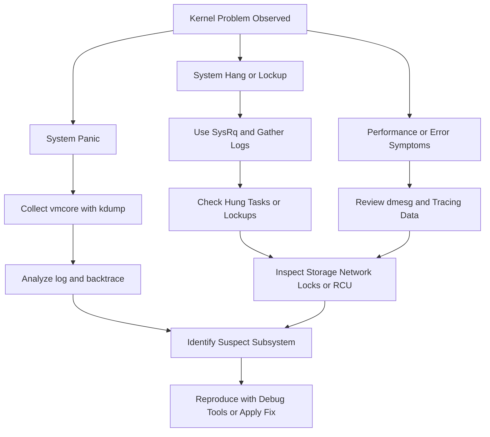

# Kernel Troubleshooting

This guide covers recurring kernel failure patterns, hung tasks, lockups, and subsystem-oriented triage.

## 11.1 Overview

Kernel issue troubleshooting is most effective when symptom patterns are mapped to likely categories.

This section covers common operational kernel problems and how to triage them.

## 11.2 Kernel module crashes

Symptoms:

- oops in module function
- tainted kernel
- instability after loading third-party driver
- crash only on certain hardware

First steps:

- inspect logs for module name
- verify version and provenance
- compare with upstream or vendor fixes
- capture `modinfo` and `mod` output
- collect kdump if panic occurs

## 11.3 Driver issues

Drivers often fail under:

- unusual device resets
- DMA errors
- suspend/resume transitions
- heavy concurrency
- firmware mismatches
- hotplug events

Useful evidence:

- `dmesg`
- `ethtool -i` for NICs
- controller firmware versions
- ftrace or dynamic debug in driver path
- vmcore if crash occurs

## 11.4 Hung tasks

Hung task messages indicate tasks blocked too long.

Relevant sysctl:

```bash
cat /proc/sys/kernel/hung_task_timeout_secs
```

To set temporarily:

```bash
echo 120 | sudo tee /proc/sys/kernel/hung_task_timeout_secs
```

## 11.5 Interpreting hung task reports

Common causes:

- blocked I/O
- deadlocked mutex or semaphore
- filesystem congestion
- NFS or network storage stalls
- driver command timeout

Look for task state `D` and blocked stack traces.

## 11.6 Soft lockups

A soft lockup means a CPU did not schedule for too long.

Usually the CPU is spinning or stuck in kernel context but still servicing some lower-level functions.

Common causes:

- infinite loop
- lock contention spin
- interrupts disabled too long
- pathological tracing or debug code

## 11.7 Hard lockups

A hard lockup usually indicates a CPU stopped handling interrupts for too long.

This is more severe than a soft lockup.

Possible causes:

- interrupts disabled indefinitely
- severe hardware problem
- stuck low-level loop
- NMI watchdog trigger conditions

## 11.8 RCU stalls

RCU stall warnings mean CPUs or tasks are not reaching expected quiescent states.

Common causes:

- long non-preemptible sections
- interrupt or softirq storms
- starvation or lockups
- broken driver behavior

## 11.9 Filesystem issues

Symptoms:

- metadata checksum errors
- journal aborts
- remount read-only
- stack traces in ext4/xfs/btrfs code

Investigate:

- underlying storage errors
- memory corruption possibility
- mount options
- known filesystem bugs in current kernel

## 11.10 Network stack issues

Symptoms:

- soft lockups under packet load
- skb corruption
- NAPI polling loops
- NIC reset storms

Investigate:

- driver version
- firmware version
- offload features
- workload pattern
- traces around Rx/Tx cleanup paths

## 11.11 Storage stack issues

Symptoms:

- task `D` states
- device timeouts
- filesystem hangs
- block layer warnings

Investigate:

- HBA or NVMe firmware
- multipath config
- queue depth tuning
- timeouts and reset behavior
- hardware logs outside OS

## 11.12 Memory pressure vs memory corruption

Do not confuse these.

Memory pressure produces:

- reclaim activity
- OOM logs
- swap churn

Memory corruption produces:

- invalid pointers
- allocator assertions
- list corruption
- random crashes in unrelated paths

## 11.13 Common operational tunables

| Tunable | Purpose |
|---|---|
| `kernel.hung_task_timeout_secs` | hung task reporting threshold |
| `kernel.watchdog_thresh` | watchdog threshold |
| `kernel.softlockup_panic` | panic on soft lockup |
| `kernel.hardlockup_panic` | panic on hard lockup |
| `kernel.panic` | auto reboot after panic |

## 11.14 Module debugging tips

- enable dynamic debug in module
- use ftrace filter for module functions
- collect exact module build ID
- validate against supported kernel ABI
- beware of out-of-tree modules after kernel updates

## 11.15 Driver issue triage checklist

- exact device model
- firmware version
- driver version
- kernel version
- reproduction trigger
- logs before failure
- panic or hang evidence
- whether issue follows device, host, or workload

## 11.16 Hung task triage checklist

- task name and PID
- blocked duration
- wait channel or stack trace
- storage/network dependency
- system-wide or isolated
- lock owner if known

## 11.17 Lockup triage checklist

- soft or hard lockup?
- affected CPU count
- stack trace of stuck CPU
- interrupts enabled?
- third-party module involved?
- recent kernel or firmware change?

## 11.18 RCU stall triage checklist

- which CPU(s) stalled?
- any heavy interrupt source?
- recent tracing or debug feature enabled?
- driver looping in softirq or IRQ?
- follow-up panic or only warnings?

## 11.19 Kernel issue diagnosis flowchart



## 11.20 Symptom-to-tool mapping

| Symptom | First tools |
|---|---|
| panic | kdump, `crash`, logs |
| hang | SysRq, `dmesg`, ftrace |
| intermittent driver bug | dynamic debug, ftrace, eBPF |
| suspected memory corruption | kdump, KASAN in lab |
| performance cliff | tracepoints, eBPF, perf |

## 11.21 Avoiding false conclusions

Do not assume the most visible subsystem is the guilty one.

Examples:

- ext4 panic can stem from storage timeout
- scheduler warning can stem from runaway driver interrupt loop
- random crash in VFS can stem from earlier memory corruption

## 11.22 Escalation readiness

Before escalation, gather:

- exact kernel version
- full logs
- vmcore if available
- reproduction steps
- hardware and firmware details
- recent changes
- scope of impact across nodes

---
