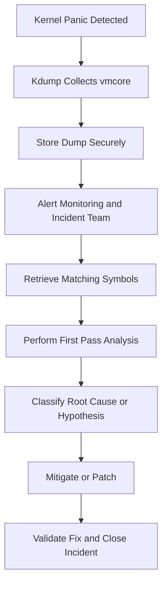

# Production Practices

This guide covers fleet-ready kdump practices, operational checklists, appendices, FAQs, and incident playbooks.

## 12.1 Overview

Production kdump and crash analysis require more than just package installation.

You need a repeatable operational system.

That system should cover:

- configuration standards
- validation after updates
- storage planning
- security controls
- incident workflow
- alerting and retention

## 12.2 Production kdump principles

1. Reserve enough memory, not just minimum memory.
2. Keep configuration standardized across similar hosts.
3. Test after every significant kernel or initramfs change.
4. Centralize or retain dumps reliably.
5. Keep matching debug symbols archived.
6. Automate collection and indexing.
7. Protect dump confidentiality.

## 12.3 Choosing production dump targets

Good production target criteria:

- reliable during degraded state
- enough capacity
- secure access controls
- retrievable by responders
- monitored for failure

In many fleets, local disk plus later upload is a practical compromise.

## 12.4 Automated crash dump collection

Common patterns:

- local `/var/crash` collection followed by agent upload
- direct NFS/SSH dump to central crash store
- metadata indexing into incident system
- automated checksum and file size validation

## 12.5 Crash dump storage planning

Plan for:

- average filtered dump size
- worst-case unfiltered dump size
- dump rate during widespread incident
- retention window
- compression ratio expectations

## 12.6 Retention policies

Retention depends on risk and compliance.

Typical considerations:

- keep recent dumps online for fast access
- archive older dumps securely
- retain at least until incident closure
- preserve dumps linked to unreleased kernel bugs longer

## 12.7 Security of dumps

Kernel dumps can contain highly sensitive data.

Protect them with:

- restricted filesystem permissions
- encrypted storage where required
- secure transfer paths
- audited access
- defined deletion workflows

## 12.8 Monitoring integration

Monitoring systems should alert on:

- kernel panic detected
- host reboot with kdump artifact created
- kdump service failed or not loaded
- crash dump target low on space
- repeated WARN or OOPS signatures

## 12.9 Nagios integration ideas

Possible checks:

- service status of `kdump`
- existence of expected `crashkernel=` in `/proc/cmdline`
- disk free space in `/var/crash`
- recent panic signatures in logs

## 12.10 Zabbix integration ideas

Possible items/triggers:

- `system.run[cat /proc/cmdline]` contains `crashkernel=`
- `vfs.fs.size[/var/crash,free]` below threshold
- journal pattern for `Kernel panic`
- service state of kdump daemon

## 12.11 Post-incident workflow

A good workflow includes:

1. detect panic event
2. quarantine or mark node if needed
3. preserve dump and logs
4. retrieve matching symbols
5. perform first-pass analysis
6. classify issue
7. escalate or remediate
8. document findings
9. validate fix in staging
10. roll out fix and monitor recurrence

## 12.12 Keeping symbols aligned

This is critical.

For every production kernel deployed, archive:

- exact `vmlinux`
- matching module debuginfo
- package versions
- config if needed

Without matching symbols, later analysis quality drops sharply.

## 12.13 Validation after kernel updates

After every kernel update:

- verify `crashkernel=` still present
- ensure kdump service is active
- ensure capture kernel loads
- if initramfs changed significantly, run a controlled validation on representative hosts

## 12.14 Standard production defaults example

Example policy:

- `crashkernel=512M`
- local disk target `/var/crash`
- `makedumpfile -l -d 31`
- auto reboot after dump
- retain last 5 dumps locally
- upload to secure central store within 30 minutes

## 12.15 Handling repeated panics

If a node panics repeatedly:

- preserve first good dump immediately
- avoid overwriting evidence
- remove from service
- check if recent change correlates
- compare dumps for signature stability

## 12.16 Incident severity criteria

Potential criteria:

| Severity | Example |
|---|---|
| SEV1 | widespread kernel panic across fleet |
| SEV2 | repeated crash on critical cluster node |
| SEV3 | single node isolated driver crash |
| SEV4 | non-production reproducible panic |

## 12.17 Production crash handling workflow diagram



## 12.18 Runbook essentials

Every production team should document:

- how to verify kdump readiness
- where dumps are stored
- who can access dumps
- where symbols are archived
- how to test kdump safely
- how to open a vmcore in `crash`
- escalation path to kernel experts or vendors

## 12.19 Fleet auditing checklist

- all nodes have `crashkernel=`
- all nodes have active kdump service
- dump path capacity above threshold
- representative test panic validated after major upgrades
- debug symbol archive complete for current kernels

## 12.20 Balancing availability and evidence collection

Panicking on every serious anomaly can improve evidence collection.

But it can also reduce availability.

Choose policies carefully for:

- `panic_on_oops`
- watchdog panic settings
- auto reboot delays
- clustered or redundant service topology

## 12.21 Sample post-incident report outline

- incident summary
- business impact
- affected systems
- kernel version and hardware
- timeline
- panic signature
- root cause or best hypothesis
- corrective action
- preventive action
- references to vmcore and symbol archive

## 12.22 Continuous improvement practices

- review every panic for pattern recurrence
- maintain signature database
- link incidents to kernel or firmware changes
- update runbooks after each significant investigation
- rehearse kdump validation periodically

---

## Appendix A: Command Reference

### A.1 Kdump setup commands

```bash
sudo apt install -y linux-crashdump kdump-tools crash
sudo dnf install -y kexec-tools crash
sudo zypper install -y kdump crash
sudo update-grub
sudo grub2-mkconfig -o /boot/grub2/grub.cfg
sudo systemctl enable kdump
sudo systemctl start kdump
sudo systemctl enable kdump-tools
sudo systemctl start kdump-tools
```

### A.2 Verification commands

```bash
cat /proc/cmdline
dmesg | grep -i crash
systemctl status kdump
systemctl status kdump-tools
kdumpctl status
ls -lah /var/crash
```

### A.3 Test panic commands

```bash
echo 1 | sudo tee /proc/sys/kernel/sysrq
echo c | sudo tee /proc/sysrq-trigger
```

### A.4 Crash utility commands

```text
sys
log
bt
bt -a
ps
vm
mod
net
files 1234
struct task_struct ffff888012345000
dis -l do_page_fault
rd ffff888012345000 16
kmem -i
mount
irq
runq
```

### A.5 GDB commands for core dumps

```text
bt
thread apply all bt
info threads
info registers
frame 2
info locals
print var
disassemble
x/16gx 0xaddress
```

### A.6 SysRq commands

```bash
echo t | sudo tee /proc/sysrq-trigger
echo w | sudo tee /proc/sysrq-trigger
echo m | sudo tee /proc/sysrq-trigger
echo s | sudo tee /proc/sysrq-trigger
echo u | sudo tee /proc/sysrq-trigger
echo b | sudo tee /proc/sysrq-trigger
```

### A.7 ftrace commands

```bash
cd /sys/kernel/debug/tracing
echo function | sudo tee current_tracer
echo my_driver_* | sudo tee set_ftrace_filter
echo 1 | sudo tee tracing_on
cat trace_pipe
```

### A.8 journald and dmesg commands

```bash
dmesg -T
dmesg -w
journalctl -k --no-pager
journalctl -k -b -1 --no-pager
journalctl -u kdump --no-pager
```

---


## Appendix B: Sample Files

### B.1 Sample `/etc/kdump.conf`

```conf
path /var/crash
core_collector makedumpfile -l --message-level 1 -d 31
default reboot
failure_action reboot
```

### B.2 Sample `/etc/default/grub`

```bash
GRUB_TIMEOUT=5
GRUB_DISTRIBUTOR="Example Linux"
GRUB_CMDLINE_LINUX="quiet splash crashkernel=256M"
```

### B.3 Sample `/etc/sysctl.d/99-kernel-debug.conf`

```conf
kernel.sysrq = 1
kernel.panic = 10
kernel.panic_on_oops = 1
kernel.softlockup_panic = 1
kernel.hardlockup_panic = 1
kernel.hung_task_timeout_secs = 120
```

### B.4 Sample systemd unit override for core dumps

```ini
[Service]
LimitCORE=infinity
```

### B.5 Sample dracut config for kdump

```conf
add_drivers+=" nvme xfs ixgbe "
```

---


## Appendix C: Panic Signature Cheat Sheet

### C.1 NULL pointer dereference

Clues:

- fault address near zero
- member offset pattern like `0x18`
- often uninitialized or freed pointer

### C.2 Use-after-free

Clues:

- random invalid pointer
- allocator corruption later
- instability depends on timing
- KASAN often most revealing

### C.3 Stack overflow

Clues:

- double fault
- corrupted stack trace
- deep recursion or large stack object

### C.4 Watchdog soft lockup

Clues:

- repeated watchdog logs
- CPU spinning in same frame
- often lock or loop issue

### C.5 Hung task

Clues:

- `blocked for more than` messages
- task state `D`
- often I/O or lock wait

### C.6 RCU stall

Clues:

- `rcu:` warnings
- CPU not quiescent
- interrupt or preemption issues

### C.7 OOM condition

Clues:

- OOM killer logs
- memory pressure and reclaim activity
- may or may not be kernel bug

### C.8 Filesystem panic

Clues:

- ext4/xfs/btrfs frames
- storage errors often precede
- metadata or journal messages in log

### C.9 Hardware-related fault

Clues:

- MCE, EDAC, AER logs
- corrected errors increasing over time
- may span multiple subsystems randomly

---


## Appendix D: Investigation Checklists

### D.1 First response checklist after kernel panic

- confirm dump exists
- preserve logs from prior boot
- record exact kernel version
- locate matching symbols
- determine whether issue is isolated or widespread
- gather recent change history

### D.2 First `crash` session checklist

- run `sys`
- run `log`
- run `bt`
- run `bt -a`
- run `ps`
- run `mod`
- inspect suspect structures
- save evidence bundle

### D.3 Hang investigation checklist

- collect `dmesg`
- use SysRq `w`, `t`, `m`
- identify blocked tasks
- identify suspect storage or network dependencies
- decide whether to force panic for kdump

### D.4 Memory bug checklist

- classify symptom
- check for earlier allocator warnings
- reproduce with KASAN or `slub_debug` in lab
- inspect allocation and free paths
- reduce to minimal reproducer

### D.5 Production readiness checklist

- `crashkernel=` set
- kdump service active
- dump target tested
- symbol archive maintained
- runbook current
- monitoring alerts configured

---


## Appendix E: Glossary

### E.1 BUG

A macro or fatal assertion used when the kernel reaches an impossible or unrecoverable condition.

### E.2 Crash kernel

The secondary kernel booted after a panic to capture the crashed kernel's memory.

### E.3 `crash`

The primary Linux utility for postmortem analysis of kernel dumps.

### E.4 `kexec`

Kernel mechanism for loading and booting into another kernel without full firmware reboot.

### E.5 KASAN

Kernel Address Sanitizer, a debug feature for detecting invalid memory accesses.

### E.6 kdump

Linux crash dump mechanism built around reserved memory and `kexec`.

### E.7 vmcore

The memory image captured from a crashed kernel.

### E.8 oops

A serious kernel fault that may or may not be fatal depending on configuration and context.

### E.9 SysRq

Magic System Request facility for low-level kernel emergency commands.

### E.10 taint

Kernel state marker indicating non-standard conditions such as proprietary or out-of-tree modules.

---


## Extended Deep Dive Notes

### ED.1 Why symbol fidelity matters

Symbol fidelity means your analysis inputs must match the exact binary layout of the crashed kernel.

Even small mismatches can mislead:

- wrong function names
- bad line mapping
- incorrect structure offsets
- misleading disassembly context

In practice, always archive kernel build identifiers alongside dumps.

### ED.2 Debug package management strategy

A mature team often keeps:

- package repository snapshot for each release
- matching debuginfo mirror
- automated mapping from node kernel version to symbol storage path

This eliminates the painful situation where the dump exists but symbols are unavailable months later.

### ED.3 Why filtered dumps are usually enough

Most investigations do not need every page of RAM.

Filtered dumps exclude obviously irrelevant data such as zero pages and some caches, reducing time and storage.

However, when:

- corruption is extremely subtle
- object content in excluded pages matters
- vendor requests full memory state

You may need a fuller dump strategy.

### ED.4 Dump target design patterns

#### Local first, upload later

Pros:

- simpler crash kernel networking
- faster local capture
- easier initial reliability

Cons:

- local storage may fail with system storage issues
- later upload agent required

#### Direct remote write

Pros:

- dump leaves node immediately
- central availability faster

Cons:

- network dependency in crash kernel
- more complexity and more points of failure

### ED.5 Why panic-on-oops is debated

`panic_on_oops=1` ensures you get a dump for otherwise recoverable but serious kernel faults.

But it can reduce uptime if transient or non-fatal oopses would otherwise allow partial service continuation.

Production clusters with strong redundancy often accept this trade-off.

Single critical systems may choose differently.

### ED.6 Typical evidence chain for vendor escalation

A good escalation package contains:

- short executive summary
- panic signature
- logs before panic
- `vmcore`
- symbol package version
- module versions
- hardware and firmware inventory
- reproduction confidence
- exact workload pattern at time of crash

### ED.7 Avoiding dump loss during incidents

During widespread incidents, the most common operational failures are:

- dump target runs out of space
- symbols are missing for one kernel rollout
- crash kernel not retested after storage stack change
- too many nodes reboot before dump upload completes

Plan capacity and concurrency.

### ED.8 Capturing non-panic evidence first

Not every severe kernel issue should immediately be converted into a panic.

If the system is degraded but not yet lost, you may want to collect:

- live traces
- SysRq task dumps
- storage diagnostics
- hardware telemetry

Then decide whether a controlled panic is warranted.

### ED.9 When to use netconsole with kdump

Netconsole complements kdump well.

Use netconsole when you need:

- panic text even if dump fails
- live streaming of early warnings
- evidence from systems without reliable local logs

It is not a replacement for `vmcore`, but it is an excellent backup channel.

### ED.10 Recommended learning path for new engineers

1. learn kernel panic anatomy
2. practice reading call traces
3. learn basic `crash` commands
4. set up kdump in a VM
5. trigger a safe test panic
6. analyze the resulting `vmcore`
7. practice ftrace and dynamic debug on a live test system
8. explore KASAN on a lab kernel

---


## Frequently Asked Questions

### FAQ.1 Is `crashkernel=auto` good enough?

Sometimes yes.

For simple systems, it may work fine.

For production environments with complex storage or network dependencies, explicit sizing plus validation is safer.

### FAQ.2 Can I use compressed dumps?

Yes.

Compressed or filtered dumps are common and often recommended.

Just ensure the retained data is sufficient for your analysis needs.

### FAQ.3 Why did kdump service say ready but no dump was captured?

Common causes:

- crash kernel memory insufficient
- dump target unavailable in capture kernel
- required driver missing from initramfs
- watchdog or hardware reset interrupted capture
- Secure Boot or signature policy blocked proper loading

### FAQ.4 Can kdump work in cloud VMs?

Often yes.

But validate with your distribution, instance type, and storage/network setup.

Cloud watchdog and console behaviors vary.

### FAQ.5 Do I need the exact same kernel version for analysis?

Yes, or as close as exact build identity allows.

Minor differences can invalidate offsets and structure layouts.

### FAQ.6 Is `vmcore-dmesg.txt` enough?

For simple panics, it may be enough to identify the likely culprit.

For deep root cause analysis, you usually want the full `vmcore` too.

### FAQ.7 Should I always panic on soft lockups?

Not always.

It depends on how much you value dump capture versus immediate availability.

Clusters with redundancy often enable it more readily than single standalone critical hosts.

### FAQ.8 Is SystemTap obsolete?

Not obsolete, but often less common than eBPF-based tooling in newer environments.

It still has valid use cases.

### FAQ.9 Can application cores help with kernel panics?

Usually not directly.

They help user-space crash debugging.

Kernel panics require kernel logs, vmcores, and kernel analysis tools.

### FAQ.10 What is the fastest first pass after a panic?

1. verify dump exists
2. inspect `vmcore-dmesg.txt` or previous boot logs
3. open `vmcore` with `crash`
4. run `sys`, `log`, `bt`, `bt -a`, `mod`

---


## Field Notes and Practical Patterns

### FN.1 Repeated crash at same offset

If several dumps crash at the same function and offset, confidence in a code bug rises.

Compare:

- workload consistency
- device model consistency
- module version consistency

### FN.2 Different panic sites on same host class

If panic sites vary wildly but hardware class is constant, consider:

- memory corruption
- hardware instability
- firmware issue
- power integrity problems

### FN.3 Crash only under heavy I/O

Focus on:

- block layer timeouts
- filesystem journaling
- driver reset paths
- queue handling races

### FN.4 Crash only under suspend or resume

Focus on:

- PM callbacks
- device reinitialization
- IRQ reenable ordering
- DMA mapping lifecycle

### FN.5 Crash after kernel update only

Focus on:

- ABI-sensitive third-party modules
- changed structure layouts
- new default config options
- regressions already fixed upstream

### FN.6 Panic after firmware update only

Focus on:

- changed device behavior
- timing differences
- new DMA/interrupt patterns
- compatibility with older driver version

### FN.7 Watchdog panic with no obvious trace

Collect all CPU stacks.

One CPU may be stuck while panic CPU just reports the timeout.

The reporting CPU is not always the guilty CPU.

### FN.8 Correlating user workload

Always note:

- what application was active
- whether stress, backup, migration, or failover was occurring
- whether issue aligns with cron, batch, or maintenance windows

Kernel bugs are often workload-sensitive.

### FN.9 Value of small reproducer

A tiny reliable reproducer is often more valuable than many random dumps.

It allows:

- bisecting kernels
- testing debug options
- confirming fixes
- vendor collaboration

### FN.10 Why documentation matters

Many teams successfully configure kdump once and then forget how it works.

Months later, during a real incident, responders struggle.

Document:

- commands
- file locations
- symbol archive rules
- exact validation procedure

---


## Command Examples by Scenario

### SC.1 Verify kdump readiness on Ubuntu

```bash
cat /proc/cmdline
systemctl status kdump-tools --no-pager
ls -lah /var/crash
journalctl -u kdump-tools --no-pager | tail -50
```

### SC.2 Verify kdump readiness on RHEL

```bash
cat /proc/cmdline
kdumpctl status
systemctl status kdump --no-pager
journalctl -u kdump --no-pager | tail -50
```

### SC.3 Inspect previous boot for panic

```bash
journalctl -k -b -1 --no-pager | grep -i -E 'panic|BUG|Oops|watchdog|Call Trace|rcu|blocked'
```

### SC.4 Open and inspect vmcore quickly

```bash
crash /usr/lib/debug/boot/vmlinux-<kernel> /var/crash/<dir>/vmcore
```

Then inside `crash`:

```text
sys
log
bt
bt -a
mod
```

### SC.5 Save task traces from a live but hung system

```bash
echo w | sudo tee /proc/sysrq-trigger
echo t | sudo tee /proc/sysrq-trigger
journalctl -k --since "2 min ago" --no-pager
```

### SC.6 Force OOM killer for diagnostics

```bash
echo f | sudo tee /proc/sysrq-trigger
```

Use carefully and only when appropriate.

### SC.7 Investigate userspace crash from systemd coredump

```bash
coredumpctl list
coredumpctl info 4242
coredumpctl gdb 4242
```

### SC.8 Generate a live process core snapshot

```bash
gcore -o core.snapshot 4242
```

### SC.9 Enable dynamic debug for one module

```bash
echo 'module my_driver +p' | sudo tee /sys/kernel/debug/dynamic_debug/control
```

### SC.10 Trace one function with ftrace

```bash
cd /sys/kernel/debug/tracing
echo nop | sudo tee current_tracer
echo my_driver_handle_event | sudo tee set_ftrace_filter
echo function | sudo tee current_tracer
echo 1 | sudo tee tracing_on
sleep 3
cat trace
```

---


## Advanced Notes on Capture Reliability

### AR.1 Why capture kernel initramfs matters so much

The capture kernel is only useful if it can reach the dump target.

That depends almost entirely on whether the initramfs contains the right userspace and drivers.

Common misses:

- RAID controller module omitted
- LVM not included
- bonded NIC support absent
- VLAN support absent
- crypto or SSH utilities missing for remote dump path

### AR.2 Storage stack complexity risk

The more complex the stack, the more kdump validation you need.

Examples of complexity:

- encrypted root
- multipath SAN
- MD RAID
- LVM on top of dm-crypt
- root over iSCSI

Each layer adds capture-kernel requirements.

### AR.3 Separate crash dump volume

A dedicated local crash volume is often a good idea.

Benefits:

- avoids filling root filesystem
- simplifies retention policy
- makes monitoring easier
- can be sized independently

### AR.4 Capture duration expectations

Dump capture can take seconds to minutes depending on:

- RAM size
- filter settings
- storage speed
- network bandwidth
- CPU available in crash kernel

Track this so responders know what to expect.

### AR.5 Automatic reboot timing

If `kernel.panic` is too short or external watchdog resets too quickly, the dump may not finish.

Coordinate:

- panic timeout
- BMC watchdog
- hypervisor watchdog
- service manager restart expectations

### AR.6 Multi-tenant security considerations

In shared environments, dumps may expose data from many workloads.

Secure handling becomes essential.

Consider:

- encryption at rest
- strict ACLs
- controlled analyst access
- secure deletion after retention period

### AR.7 Testing after hardware changes

Do not only retest after kernel changes.

Also retest after:

- new storage controller
- NIC changes
- firmware updates
- boot mode changes
- Secure Boot policy changes

### AR.8 Validate retrieval, not just capture

A dump sitting on disk is only useful if you can:

- find it quickly
- transfer it reliably
- match it to the correct symbols
- open it in tools without corruption

Add retrieval tests to the runbook.

---


## Mini Playbooks

### MP.1 Panic in third-party network driver

1. preserve dump and previous boot logs
2. note taint flags
3. identify exact driver and firmware version
4. inspect `bt`, `mod`, `dis -l`, `log`
5. compare with upstream/vendor bug database
6. try reproducer under KASAN or debug kernel in lab
7. plan driver or firmware rollback/upgrade

### MP.2 Hung tasks on storage-backed service

1. use SysRq `w` and `t`
2. gather `journalctl -k`
3. look for I/O timeout or reset messages
4. inspect multipath or device health
5. decide if forced panic is needed for kdump
6. analyze resulting dump for blocked stacks

### MP.3 RCU stall during packet storm

1. capture logs and CPU stacks
2. identify hot CPU and NIC queue if possible
3. inspect softirq or napi-related stacks
4. use ftrace or eBPF in reproduction environment
5. compare NIC driver and firmware against known issues

### MP.4 Memory corruption with random panic sites

1. suspect corruption, not individual top frame
2. review earlier logs for allocator or list warnings
3. reproduce with KASAN or `slub_debug`
4. narrow workload and subsystem
5. keep full dumps if filtered dumps omit needed state

---


## Tables for Quick Operations

### TO.1 Distribution quick reference

| Distro | Install | Service | Main config |
|---|---|---|---|
| Ubuntu/Debian | `apt install linux-crashdump kdump-tools` | `kdump-tools` | `/etc/default/kdump-tools` |
| RHEL/CentOS | `dnf install kexec-tools` | `kdump` | `/etc/kdump.conf` |
| SUSE | `zypper install kdump` | `kdump` | `/etc/sysconfig/kdump` |

### TO.2 First-pass crash commands

| Priority | Command | Why |
|---|---|---|
| 1 | `sys` | environment summary |
| 2 | `log` | panic text and earlier warnings |
| 3 | `bt` | faulting call chain |
| 4 | `bt -a` | system-wide stack context |
| 5 | `mod` | modules and taint clues |
| 6 | `ps` | blocked or interesting tasks |

### TO.3 Panic clue table

| Observation | Likely interpretation |
|---|---|
| address `0x18` | NULL pointer member access |
| trace in module | driver/module issue likely |
| watchdog panic | underlying lockup or stall |
| ext4 panic after I/O errors | storage issue may be primary |
| random different crash sites | corruption or hardware instability |

### TO.4 Live debugging tool choice

| Problem | Preferred tools |
|---|---|
| crash already happened | kdump and `crash` |
| intermittent latency | ftrace or eBPF |
| selective logging need | dynamic debug |
| source-level lab debug | KGDB |
| memory corruption in test | KASAN and `slub_debug` |

---


## Closing Guidance

Kdump and crash analysis are not just niche kernel engineering skills.

They are operational reliability capabilities.

A well-prepared team can turn a catastrophic reboot into a structured investigation.

The essentials are simple:

- reserve memory
- validate capture path
- archive symbols
- practice analysis
- integrate with incident response

When these pieces are in place, kernel failures become diagnosable events rather than mysteries.

Use this guide as a runbook, a learning reference, and a baseline for your production standards.

---


## Line Padding Reference Section

This section intentionally provides additional compact reference lines to make the guide easy to skim and to ensure broad topic coverage.

### RP.1 Quick reminders

- Always test kdump after kernel upgrades.
- Always keep matching `vmlinux` files.
- Always review logs before the final panic line.
- Always verify dump target free space.
- Always document panic signatures.
- Always protect dumps as sensitive artifacts.
- Always validate remote dump targets from the crash kernel.
- Always confirm `crashkernel=` after reboot.
- Always capture taint state.
- Always compare repeated incidents for common offsets.

### RP.2 Quick symptom reminders

- NULL dereference often shows near-zero fault address.
- Soft lockup often means CPU spinning too long.
- Hard lockup often means interrupts stopped.
- Hung task often means blocked I/O or lock wait.
- RCU stall often points to starvation or long non-preemptible section.
- OOM is pressure, not always corruption.
- Random panic sites often suggest memory corruption.
- Module-only crashes often implicate driver compatibility.
- Filesystem panics often require storage timeline review.
- Machine check events often require hardware investigation.

### RP.3 Quick command reminders

- `sys` for environment.
- `log` for evidence trail.
- `bt` for the crashing context.
- `bt -a` for system-wide patterns.
- `mod` for driver context.
- `ps` for task state.
- `struct` for object inspection.
- `dis -l` for instruction correlation.
- `journalctl -k -b -1` for previous boot logs.
- `echo c > /proc/sysrq-trigger` only in safe test windows.

### RP.4 Quick production reminders

- Standardize settings by host class.
- Monitor kdump service state.
- Monitor dump path capacity.
- Archive debug symbols with release metadata.
- Rehearse retrieval and analysis.
- Define access controls for vmcores.
- Link crash artifacts to incidents automatically.
- Keep short and long retention tiers.
- Validate watchdog timing against dump duration.
- Use redundancy-aware panic policies.

### RP.5 Quick lab reminders

- Reproduce before instrumenting broadly.
- Start with logs and simple traces.
- Use KASAN for suspected corruption.
- Narrow function filters in ftrace.
- Keep SystemTap and eBPF probes focused.
- Avoid excessive debug noise.
- Save exact kernel build IDs.
- Snapshot workload details.
- Track whether fixes truly eliminate signature.
- Preserve original dump files unchanged.

### RP.6 Final checklist

- kdump installed
- crashkernel configured
- service enabled
- dump path ready
- test panic validated
- vmcore analyzable
- symbols archived
- runbook documented
- monitoring integrated
- team trained
