# Kdump, Crash Analysis, and Kernel Debugging Guide

This guide is now split into focused runbooks so you can move from capture setup to postmortem analysis, live debugging, and production operating practices.

## Overview

- Start with the kdump overview and setup guides to understand capture flow and validate your environment.
- Use the crash, panic, core dump, SysRq, kernel debugging, SystemTap, logging, and memory debugging guides during investigations.
- Finish with production practices for appendices, reference tables, FAQs, and incident playbooks.

## Learning Path

```mermaid
graph LR
A["Kdump Overview"] --> B["Kdump Setup"]
B --> C["Crash Analysis"]
C --> D["Kernel Panic"]
D --> E["Core Dumps"]
E --> F["SysRq"]
F --> G["Kernel Debugging"]
G --> H["SystemTap"]
H --> I["Kernel Logs"]
I --> J["Memory Debugging"]
J --> K["Kernel Troubleshooting"]
K --> L["Production Practices"]
```

## Table of Contents

1. [Kdump Overview](01-kdump-overview.md)
2. [Kdump Setup](02-kdump-setup.md)
3. [Crash Analysis](03-crash-analysis.md)
4. [Kernel Panic Analysis](04-kernel-panic.md)
5. [Core Dumps](05-core-dumps.md)
6. [Magic SysRq Key](06-sysrq.md)
7. [Kernel Debugging Tools](07-kernel-debugging.md)
8. [SystemTap](08-systemtap.md)
9. [dmesg and Kernel Logs](09-dmesg-kernel-logs.md)
10. [Memory Debugging](10-memory-debugging.md)
11. [Kernel Troubleshooting](11-kernel-troubleshooting.md)
12. [Production Practices](12-production-practices.md)
