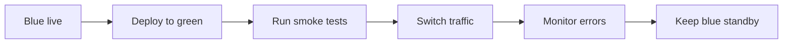

# Application Deployment

This guide covers release workflows, migrations, validation, and rollback operations.

## 10.1 Deployment fundamentals

- Build artifact once.
- Promote same artifact across environments.
- Externalize configuration.
- Use health checks.
- Automate migrations carefully.
- Keep rollback fast.
- Capture deployment metadata.

## 10.2 Deploying web applications with Nginx

### Basic release layout

```text
/opt/app/releases/2025-01-01-120000
/opt/app/releases/2025-01-02-173000
/opt/app/current -> /opt/app/releases/2025-01-02-173000
```

### Simple deploy flow

- Upload artifact.
- Extract into new release directory.
- Install dependencies if required.
- Run migrations.
- Update symlink.
- Restart or reload service.
- Run smoke tests.

### Example Nginx server block

```nginx
server {
    listen 80;
    server_name app.example.com;

    location / {
        proxy_pass http://127.0.0.1:3000;
        proxy_set_header Host $host;
        proxy_set_header X-Real-IP $remote_addr;
        proxy_set_header X-Forwarded-For $proxy_add_x_forwarded_for;
        proxy_set_header X-Forwarded-Proto $scheme;
    }
}
```

### Validate and reload Nginx

```bash
sudo nginx -t
sudo systemctl reload nginx
```

## 10.3 Apache deployment basics

```bash
sudo apachectl configtest
sudo systemctl reload apache2 || sudo systemctl reload httpd
```

## 10.4 Database migrations

### General approach

- Confirm backup exists.
- Confirm migration reviewed.
- Confirm lock impact.
- Confirm maintenance window if needed.
- Run in staging first.
- Monitor errors after execution.

### Examples

```bash
python manage.py migrate
```

```bash
bundle exec rake db:migrate
```

```bash
npm run migrate
```

## 10.5 Rolling restart procedure

- Drain one node.
- Stop app on drained node.
- Deploy new version.
- Start app.
- Run health checks.
- Re-add node to load balancer.
- Repeat node by node.

### Example with systemd and HAProxy backend maintenance

```bash
sudo systemctl restart myapp
curl -fsS http://127.0.0.1:8080/healthz
```

## 10.6 Blue-green deployment flow



### Blue-green steps

- Keep two identical environments.
- Deploy to inactive environment.
- Run smoke tests.
- Switch load balancer or DNS.
- Monitor latency and error rates.
- Roll back by switching traffic back.

## 10.7 Rollback procedures

### Symlink-based rollback

```bash
ls -1 /opt/app/releases
sudo ln -sfn /opt/app/releases/2025-01-01-120000 /opt/app/current
sudo systemctl restart myapp
curl -fsS http://127.0.0.1:8080/healthz
```

### Package-based rollback

```bash
sudo apt install myapp=1.2.2-1
sudo dnf downgrade myapp
```

## 10.8 Deployment script example

```bash
#!/usr/bin/env bash
set -euo pipefail

APP_DIR=/opt/myapp
RELEASE=$(date +%F-%H%M%S)
RELEASE_DIR="$APP_DIR/releases/$RELEASE"
ARTIFACT=/tmp/myapp.tar.gz

sudo mkdir -p "$RELEASE_DIR"
sudo tar -xzf "$ARTIFACT" -C "$RELEASE_DIR"
sudo ln -sfn "$RELEASE_DIR" "$APP_DIR/current"
sudo systemctl restart myapp
curl -fsS http://127.0.0.1:8080/healthz
```

## 10.9 Deployment smoke tests

```bash
curl -fsS -o /dev/null -w '%{http_code}
' http://127.0.0.1/healthz
curl -fsS http://127.0.0.1/version
```

## 10.10 Deployment one-liners

```bash
readlink -f /opt/app/current
ls -1dt /opt/app/releases/* | head -5
```

```bash
journalctl -u myapp --since '10 min ago' --no-pager | tail -100
```

---
