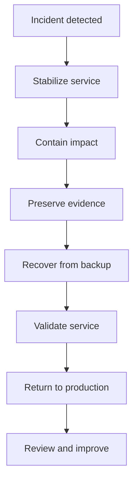
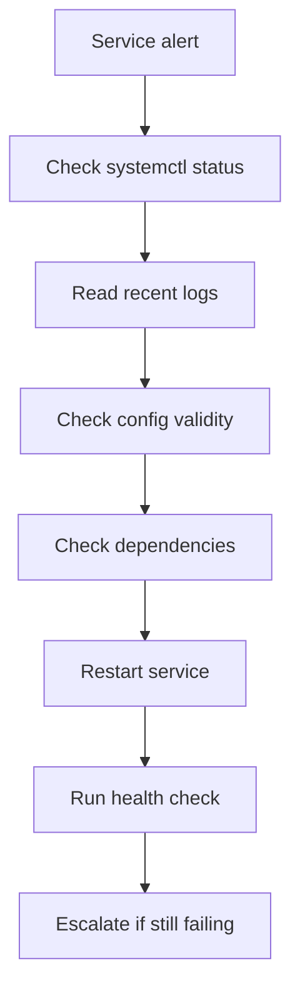
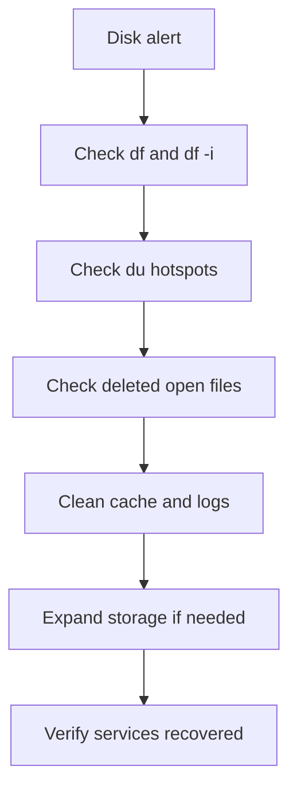
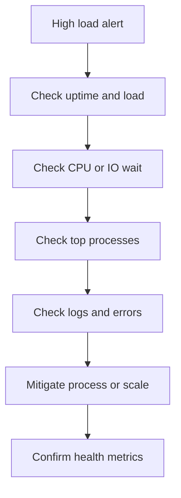

# Disaster Recovery Scenarios

This guide covers urgent recovery workflows and shared operational appendices, templates, and scripts.

## 15.1 Server will not boot — recovery steps

### Symptoms

- Stuck at boot loader.
- Kernel panic.
- Filesystem check failure.
- Emergency mode prompt.
- Reboot loop.

### Immediate actions

- Capture console screenshot or serial output.
- Identify recent changes.
- Check cloud provider console logs if virtual machine.
- Boot into rescue mode if available.
- Mount root filesystem read-only first.

### Recovery sequence

1. Access console or rescue ISO.
2. Identify root disk.
3. Run filesystem check.
4. Inspect `/etc/fstab` for bad mounts.
5. Chroot if needed.
6. Rebuild initramfs if needed.
7. Reinstall bootloader if needed.
8. Roll back recent kernel if required.

### Example rescue commands

```bash
lsblk
blkid
mount /dev/sda2 /mnt
mount /dev/sda1 /mnt/boot || true
for i in /dev /dev/pts /proc /sys /run; do mount --bind "$i" "/mnt$i"; done
chroot /mnt
```

### Check `fstab`

```bash
cat /etc/fstab
mount -a
```

### Rebuild initramfs

```bash
update-initramfs -u -k all
mkinitcpio -P || true
dracut -f || true
```

### Reinstall GRUB

```bash
grub-install /dev/sda
update-grub || grub2-mkconfig -o /boot/grub2/grub.cfg
```

## 15.2 Database corruption — recovery

### Initial containment

- Stop writes.
- Take snapshot if possible.
- Preserve logs.
- Confirm whether corruption is logical or physical.
- Check replication state.
- Notify stakeholders.

### MySQL checks

```bash
mysqlcheck --all-databases
mysqlcheck -u root -p --auto-repair mydb
```

### PostgreSQL checks

```bash
sudo -u postgres pg_checksums --check -D /var/lib/postgresql/15/main || true
sudo -u postgres reindexdb --all
```

### Restore from backup path

- Verify latest good backup.
- Restore to isolated host first.
- Validate application integrity.
- Replay binlogs or WAL if available.
- Cut over once validated.

## 15.3 Accidental file deletion — recovery

### Immediate actions

- Stop writes to affected filesystem.
- Check backups.
- Check snapshots.
- Check whether file is still open by process.

### Recover deleted but open file

```bash
sudo lsof | grep '(deleted)'
```

### Copy data from open FD

```bash
sudo cp /proc/1234/fd/5 recovered.log
```

### Snapshot restore idea

- Mount snapshot read-only.
- Copy required files.
- Verify ownership and SELinux context.
- Compare checksums.

## 15.4 Full disk — emergency cleanup

### Emergency checklist

- Identify filesystem at 100%.
- Check inodes.
- Check deleted-open files.
- Remove package caches.
- Vacuum journals.
- Rotate or truncate huge logs.
- Move large data off-host if needed.
- Expand volume if possible.

### Emergency commands

```bash
df -hT
df -ih
sudo lsof +L1
sudo du -xah / | sort -hr | head -50
```

```bash
sudo journalctl --vacuum-size=200M
sudo apt clean || true
sudo dnf clean all || true
```

## 15.5 Compromised server — incident response

### First priorities

- Isolate host from network.
- Preserve volatile evidence if policy requires.
- Do not destroy logs.
- Rotate credentials from a clean host.
- Notify security team.
- Treat host as untrusted.

### Containment steps

- Remove from load balancer.
- Block outbound traffic if possible.
- Stop nonessential services.
- Snapshot disks.
- Export relevant logs.
- Record running processes and network connections.

### Evidence commands

```bash
date
hostname -f
who
w
last -a | head -50
ps auxwwf
ss -tulpn
ip -br a
crontab -l
systemctl list-units --type=service --state=running
journalctl --since '24 hours ago' --no-pager > incident-journal.txt
```

### Search for persistence

```bash
sudo find /etc/systemd /usr/lib/systemd /etc/cron* /var/spool/cron -type f -mtime -30 -ls
```

```bash
sudo find /tmp /var/tmp /dev/shm -type f -ls
```

### Rootkit and integrity tools

```bash
sudo rkhunter --check || true
sudo chkrootkit || true
sudo aide --check || true
```

### Recovery principle

- Rebuild from trusted image.
- Restore only verified application data.
- Do not trust existing binaries.
- Rotate all secrets.
- Review lateral movement.
- Perform postmortem.

## 15.6 Disaster recovery workflow map



## 15.7 DR drill checklist

- Test backup restore monthly.
- Test failover quarterly.
- Verify contact list.
- Verify runbooks are current.
- Verify monitoring during drills.
- Record timing metrics.
- Capture lessons learned.

---

## Appendix A. Command Reference Tables

### A.1 Essential system inspection commands

| Task | Command |
|---|---|
| OS info | `cat /etc/os-release` |
| Kernel | `uname -r` |
| Uptime | `uptime` |
| Memory | `free -h` |
| CPU | `mpstat -P ALL 1 1` |
| Disk | `df -hT` |
| Inodes | `df -ih` |
| Services | `systemctl --failed` |
| Logs | `journalctl -p err -n 50 --no-pager` |
| Sockets | `ss -tulpn` |

### A.2 Common package manager commands

| Action | Debian or Ubuntu | RHEL family |
|---|---|---|
| Update metadata | `apt update` | `dnf makecache` |
| Upgrade packages | `apt upgrade -y` | `dnf upgrade -y` |
| Install package | `apt install -y pkg` | `dnf install -y pkg` |
| Remove package | `apt remove -y pkg` | `dnf remove -y pkg` |
| Clean cache | `apt clean` | `dnf clean all` |
| List installed | `dpkg -l` | `rpm -qa` |

### A.3 Common file locations

| File or directory | Purpose |
|---|---|
| `/etc/ssh/sshd_config` | SSH daemon config |
| `/etc/fstab` | Persistent mounts |
| `/etc/hosts` | Local hostname mapping |
| `/etc/resolv.conf` | DNS resolver config |
| `/var/log/` | Logs |
| `/etc/systemd/system/` | Custom unit files |
| `/etc/cron.d/` | System cron jobs |
| `/etc/sudoers.d/` | Sudo fragments |

---


## Appendix B. Reusable Scripts Library

### B.1 Lightweight service check script

```bash
#!/usr/bin/env bash
set -euo pipefail
SERVICES=(sshd nginx docker cron)
for s in "${SERVICES[@]}"; do
  if systemctl is-active --quiet "$s"; then
    echo "OK: $s"
  else
    echo "CRITICAL: $s"
  fi
done
```

### B.2 Disk alert script

```bash
#!/usr/bin/env bash
set -euo pipefail
THRESHOLD=85
df -hP | awk -v t="$THRESHOLD" 'NR>1 {gsub(/%/,"",$5); if ($5 >= t) print "ALERT", $6, $5"%"}'
```

### B.3 Failed login summary script

```bash
#!/usr/bin/env bash
set -euo pipefail
LOGS="/var/log/auth.log /var/log/secure"
grep -hEi 'failed password|invalid user' $LOGS 2>/dev/null | awk '{print $(NF-3)}' | sort | uniq -c | sort -nr | head -20
```

### B.4 Port check script

```bash
#!/usr/bin/env bash
set -euo pipefail
HOST=${1:?Usage: $0 host port}
PORT=${2:?Usage: $0 host port}
if nc -z -w 3 "$HOST" "$PORT"; then
  echo "OPEN: $HOST:$PORT"
else
  echo "CLOSED: $HOST:$PORT"
  exit 1
fi
```

### B.5 Rolling restart helper outline

```bash
#!/usr/bin/env bash
set -euo pipefail
NODES=(app01 app02 app03)
for n in "${NODES[@]}"; do
  echo "Draining $n from load balancer"
  ssh "$n" 'sudo systemctl restart myapp && curl -fsS http://127.0.0.1:8080/healthz'
  echo "$n healthy"
done
```

---


## Appendix C. Operations Checklists

### C.1 Daily checklist

- Review monitoring alerts.
- Review failed services.
- Review disk usage.
- Review backup status.
- Review security events.
- Review package updates.
- Review certificate expiry.
- Review cron job outcomes.
- Review unusual log errors.
- Review capacity trends.

### C.2 Weekly checklist

- Validate restores.
- Review privileged access.
- Clean up stale users.
- Check filesystem growth.
- Verify time sync.
- Review firewall changes.
- Review kernel errors.
- Rotate old keys if scheduled.
- Review container image drift.
- Review Kubernetes failed pods.

### C.3 Monthly checklist

- Patch systems.
- Reboot where required.
- Review backup retention.
- Review cloud costs.
- Review certificate inventory.
- Review open ports.
- Review unused services.
- Run vulnerability scans.
- Test disaster recovery steps.
- Update runbooks.

---


## Appendix D. Long-form Command Catalog

### D.1 Server setup commands

1. `hostnamectl status`
2. `timedatectl status`
3. `ip -br a`
4. `ip route`
5. `ss -tulpn`
6. `lsblk -f`
7. `findmnt`
8. `swapon --show`
9. `systemctl --failed`
10. `journalctl -p err -n 50 --no-pager`
11. `apt update`
12. `apt upgrade -y`
13. `dnf upgrade -y`
14. `useradd -m -s /bin/bash user`
15. `passwd user`
16. `usermod -aG sudo user`
17. `usermod -aG wheel user`
18. `sshd -t`
19. `systemctl reload sshd`
20. `ufw status verbose`
21. `firewall-cmd --list-all`
22. `sysctl --system`
23. `resolvectl status`
24. `chronyc tracking`
25. `who -b`
26. `last reboot | head`
27. `journalctl -xb --no-pager`
28. `cat /etc/os-release`
29. `uname -a`
30. `hostname -f`
31. `cat /etc/hosts`
32. `cat /etc/fstab`
33. `mount -a`
34. `getent passwd user`
35. `getent group sudo`
36. `getent group wheel`
37. `visudo -cf /etc/sudoers`
38. `namei -l /home/user/.ssh/authorized_keys`
39. `chmod 600 ~/.ssh/authorized_keys`
40. `chmod 700 ~/.ssh`

### D.2 Health check commands

41. `uptime`
42. `free -h`
43. `vmstat 1 5`
44. `mpstat -P ALL 1 3`
45. `sar -u 1 3`
46. `sar -r 1 3`
47. `iostat -xz 1 3`
48. `pidstat 1 3`
49. `df -hT`
50. `df -ih`
51. `du -xhd1 /`
52. `ps -eo pid,user,%cpu,%mem,cmd --sort=-%cpu | head`
53. `ps -eo pid,user,%mem,%cpu,cmd --sort=-%mem | head`
54. `systemctl --failed`
55. `journalctl -p warning -n 50 --no-pager`
56. `journalctl -k -n 50 --no-pager`
57. `dmesg --level=err,warn | tail`
58. `last -a | head`
59. `lastb | head`
60. `ss -s`
61. `ip -br a`
62. `ip route`
63. `lsof +L1`
64. `findmnt -lo TARGET,SOURCE,FSTYPE,OPTIONS`
65. `cat /proc/loadavg`
66. `cat /proc/meminfo`
67. `swapon --show`
68. `systemd-analyze`
69. `who -b`
70. `uptime -p`

### D.3 Logging commands

71. `journalctl -xb --no-pager`
72. `journalctl -u nginx --no-pager`
73. `journalctl -u nginx -f`
74. `journalctl --since '1 hour ago' --no-pager`
75. `journalctl -p err --since today --no-pager`
76. `journalctl -b -1 --no-pager`
77. `journalctl --disk-usage`
78. `journalctl --vacuum-time=7d`
79. `journalctl --vacuum-size=500M`
80. `journalctl --verify`
81. `grep -RiE 'error|fail|fatal|panic' /var/log`
82. `awk '{print $1}' /var/log/nginx/access.log | sort | uniq -c | sort -nr | head`
83. `awk '{print $7}' /var/log/nginx/access.log | sort | uniq -c | sort -nr | head`
84. `awk '{print $9}' /var/log/nginx/access.log | sort | uniq -c | sort -nr`
85. `awk '$9 ~ /^5/' /var/log/nginx/access.log | tail`
86. `grep -Ei 'failed password|invalid user' /var/log/auth.log`
87. `grep -Ei 'oom|out of memory' /var/log/kern.log`
88. `logrotate -d /etc/logrotate.conf`
89. `logrotate -f /etc/logrotate.conf`
90. `cat /var/lib/logrotate/status`

### D.4 User management commands

91. `useradd -m -s /bin/bash alice`
92. `passwd alice`
93. `userdel alice`
94. `userdel -r alice`
95. `chage -l alice`
96. `chage -d 0 alice`
97. `passwd -S alice`
98. `usermod -L alice`
99. `usermod -U alice`
100. `usermod -aG sudo alice`
101. `usermod -aG wheel alice`
102. `sudo -l -U alice`
103. `w`
104. `who`
105. `users`
106. `last -a | head -50`
107. `lastlog | head -50`
108. `lastb | head -50`
109. `getent passwd`
110. `awk -F: '($3 == 0) {print}' /etc/passwd`
111. `find / -xdev -uid 1050 -ls`
112. `namei -l /home/alice/.ssh/authorized_keys`
113. `gpasswd -d alice sudo`
114. `gpasswd -d alice wheel`
115. `pkill -u alice`

### D.5 Disk and storage commands

116. `lsblk -f`
117. `blkid`
118. `fdisk -l`
119. `pvs`
120. `vgs`
121. `lvs -a -o +devices`
122. `lvextend -r -L +20G /dev/vg/lv`
123. `resize2fs /dev/vg/lv`
124. `xfs_growfs /mountpoint`
125. `pvcreate /dev/sdb1`
126. `vgextend vgdata /dev/sdb1`
127. `mkfs.ext4 /dev/sdb1`
128. `mkfs.xfs /dev/sdb1`
129. `mount /dev/sdb1 /data`
130. `mount -a`
131. `find / -xdev -type f -size +1G -printf '%s %p
'`
132. `du -xah /var | sort -hr | head -30`
133. `apt clean`
134. `dnf clean all`
135. `truncate -s 0 /var/log/big.log`
136. `docker system df`
137. `docker system prune -f`
138. `find /tmp -mtime +7 -delete`
139. `find /var/tmp -mtime +7 -delete`
140. `tune2fs -l /dev/sda1`

### D.6 Service management commands

141. `systemctl start nginx`
142. `systemctl stop nginx`
143. `systemctl restart nginx`
144. `systemctl reload nginx`
145. `systemctl enable nginx`
146. `systemctl disable nginx`
147. `systemctl status nginx --no-pager`
148. `systemctl is-active nginx`
149. `systemctl is-enabled nginx`
150. `systemctl cat nginx`
151. `systemctl daemon-reload`
152. `systemctl edit nginx`
153. `systemd-analyze verify /etc/systemd/system/myapp.service`
154. `journalctl -u myapp -xe --no-pager`
155. `systemctl show myapp -p NRestarts`
156. `systemctl list-dependencies nginx`
157. `systemctl show nginx -p After -p Wants -p Requires`
158. `journalctl -u sshd --since today --no-pager`
159. `systemctl list-units --type=service --state=running`
160. `systemctl --failed`

### D.7 Backup commands

161. `rsync -aHAX --delete /etc backup:/backups/host/`
162. `mysqldump --single-transaction appdb | gzip > appdb.sql.gz`
163. `mysql -e 'show databases'`
164. `pg_dump -Fc appdb > appdb.dump`
165. `pg_dumpall | gzip > cluster.sql.gz`
166. `pg_restore -l appdb.dump | head`
167. `gzip -t appdb.sql.gz`
168. `gunzip -c appdb.sql.gz | mysql appdb`
169. `createdb appdb_restore`
170. `pg_restore -d appdb_restore appdb.dump`
171. `find /backups -mtime -1 -type f | head`
172. `ssh backup 'df -h /backups'`
173. `tar -czf etc-backup.tgz /etc`
174. `sha256sum backupfile`
175. `rclone sync /data remote:host/data`

### D.8 Security commands

176. `lastb | head`
177. `grep -Ei 'failed password|invalid user' /var/log/auth.log`
178. `apt list --upgradable`
179. `dnf updateinfo list security`
180. `ss -tulpn`
181. `lsof -i -P -n | grep LISTEN`
182. `ufw status numbered`
183. `firewall-cmd --list-all`
184. `nft list ruleset`
185. `certbot renew --dry-run`
186. `find / -xdev -perm -4000 -type f -ls`
187. `find / -xdev -perm -0002 -type f -ls`
188. `getenforce`
189. `ausearch -m AVC,USER_AVC -ts recent`
190. `aa-status`
191. `fail2ban-client status`
192. `grep -R 'NOPASSWD' /etc/sudoers /etc/sudoers.d`
193. `find /home -name authorized_keys -mtime -30 -ls`
194. `lynis audit system`
195. `rpm -Va`

### D.9 Networking commands

196. `ping -c 4 example.com`
197. `nc -vz example.com 443`
198. `curl -I https://example.com`
199. `ip -br a`
200. `ip route`
201. `ip rule`
202. `dig example.com`
203. `dig +short example.com`
204. `dig @8.8.8.8 example.com`
205. `host example.com`
206. `nslookup example.com`
207. `dig -x 8.8.8.8 +short`
208. `resolvectl status`
209. `sar -n DEV 1 5`
210. `ip -s link`
211. `iftop -nP`
212. `ssh -L 8080:127.0.0.1:80 user@host`
213. `ssh -R 2222:127.0.0.1:22 jumpbox`
214. `ssh -D 1080 user@host`
215. `wg show`
216. `ip neigh`
217. `ss -lntp`
218. `lsof -i :8080`
219. `tcpdump -i any -nn port 53`
220. `tracepath example.com`

### D.10 Deployment commands

221. `nginx -t`
222. `apachectl configtest`
223. `systemctl reload nginx`
224. `systemctl reload httpd`
225. `python manage.py migrate`
226. `bundle exec rake db:migrate`
227. `npm run migrate`
228. `readlink -f /opt/app/current`
229. `ls -1dt /opt/app/releases/* | head`
230. `curl -fsS http://127.0.0.1/healthz`
231. `curl -fsS http://127.0.0.1/version`
232. `systemctl restart myapp`
233. `journalctl -u myapp --since '10 min ago'`
234. `ln -sfn /opt/app/releases/old /opt/app/current`
235. `apt install myapp=1.2.2-1`
236. `dnf downgrade myapp`
237. `tar -xzf artifact.tgz -C /opt/app/releases/new`
238. `chown -R appuser:appuser /opt/app/releases/new`
239. `find /opt/app/releases -maxdepth 1 -mindepth 1 -type d | sort`
240. `sha256sum artifact.tgz`

### D.11 Docker commands

241. `docker ps`
242. `docker ps -a`
243. `docker start web`
244. `docker stop web`
245. `docker restart web`
246. `docker logs web --tail 100`
247. `docker logs -f web`
248. `docker exec -it web /bin/sh`
249. `docker inspect web`
250. `docker pull nginx:stable`
251. `docker build -t myapp:1.0.0 .`
252. `docker tag myapp:1.0.0 registry/myapp:1.0.0`
253. `docker push registry/myapp:1.0.0`
254. `docker image prune -af`
255. `docker system df`
256. `docker compose up -d`
257. `docker compose ps`
258. `docker compose logs -f`
259. `docker compose pull`
260. `docker compose down`
261. `docker stats --no-stream`
262. `docker top web`
263. `docker inspect -f '{{.State.Status}} {{.State.RestartCount}}' web`
264. `docker exec web env | sort`
265. `docker inspect -f '{{json .Mounts}}' web | jq .`
266. `docker inspect -f '{{json .NetworkSettings.Networks}}' web | jq .`
267. `docker ps -a --filter status=exited`
268. `docker container prune -f`
269. `docker network prune -f`
270. `docker volume prune -f`
271. `docker cp web:/var/log/app.log ./app.log`
272. `docker run --rm alpine date`
273. `journalctl -u docker --since '1 hour ago'`
274. `docker events --since 1h`
275. `docker system prune -af --volumes`

### D.12 Kubernetes commands

276. `kubectl config get-contexts`
277. `kubectl config current-context`
278. `kubectl get nodes -o wide`
279. `kubectl get pods -A`
280. `kubectl get deploy -A`
281. `kubectl get svc -A`
282. `kubectl get ingress -A`
283. `kubectl describe pod mypod -n prod`
284. `kubectl logs pod/mypod -n prod`
285. `kubectl logs pod/mypod -n prod --previous`
286. `kubectl exec -it pod/mypod -n prod -- /bin/sh`
287. `kubectl get events -n prod --sort-by=.lastTimestamp`
288. `kubectl get pods -n prod -w`
289. `kubectl rollout status deploy/myapp -n prod`
290. `kubectl rollout restart deploy/myapp -n prod`
291. `kubectl rollout undo deploy/myapp -n prod`
292. `kubectl rollout history deploy/myapp -n prod`
293. `kubectl scale deploy/myapp --replicas=5 -n prod`
294. `kubectl autoscale deploy/myapp --min=2 --max=10 --cpu-percent=70 -n prod`
295. `kubectl logs -n prod -l app=myapp --tail=100 --prefix=true`
296. `kubectl top nodes`
297. `kubectl top pods -A --containers`
298. `kubectl cordon worker01`
299. `kubectl drain worker01 --ignore-daemonsets --delete-emptydir-data`
300. `kubectl uncordon worker01`

---


## Appendix E. Runbook Templates

### E.1 Incident triage template

- Incident ID:
- Start time:
- Reporter:
- Affected systems:
- Customer impact:
- Initial symptoms:
- Severity:
- Current mitigation:
- Next action owner:
- Communications channel:
- Recovery ETA:

### E.2 Change checklist template

- Change ID:
- Purpose:
- Risk level:
- Backout plan:
- Validation plan:
- Monitoring plan:
- Maintenance window:
- Approver:
- Operator:
- Start time:
- End time:

### E.3 Backup restore test template

- Backup source:
- Backup timestamp:
- Restore target:
- Restore operator:
- Integrity checks:
- App validation result:
- Time to restore:
- Issues found:
- Follow-up tasks:

---


## Appendix F. Extra Practical One-Liners

### F.1 Process inspection

```bash
ps -eo pid,lstart,cmd --sort=lstart | tail -20
```

```bash
pstree -ap | head -100
```

```bash
for p in $(pgrep nginx); do cat /proc/$p/status | egrep 'Name|State|VmRSS|Threads'; done
```

### F.2 Filesystem inspection

```bash
findmnt -R /
```

```bash
mount | column -t
```

```bash
stat /etc/passwd
```

### F.3 Authentication checks

```bash
sudo journalctl -u sshd --since today --no-pager | egrep 'Accepted|Failed|Invalid'
```

```bash
sudo awk -F: '$3 >= 1000 && $7 !~ /(nologin|false)$/ {print $1}' /etc/passwd
```

### F.4 Package verification

```bash
dpkg -l | head -30
rpm -qa | head -30
```

```bash
apt-mark showhold || true
dnf versionlock list || true
```

### F.5 Service and socket checks

```bash
systemctl list-sockets
```

```bash
ss -lntup | sort -k5
```

### F.6 Kernel and boot checks

```bash
uname -r
sysctl kernel.hostname
systemd-analyze blame | head -30
```

```bash
journalctl -k -b --no-pager | tail -100
```

### F.7 Container and orchestration quick checks

```bash
docker ps --format '{{.Names}} {{.Status}}'
```

```bash
kubectl get pods -A --field-selector=status.phase!=Running
```

### F.8 Database quick checks

```bash
mysqladmin ping
```

```bash
sudo -u postgres pg_isready
```

```bash
sudo -u postgres psql -c 'select now();'
```

### F.9 Web checks

```bash
curl -fsS -o /dev/null -w '%{http_code} %{time_total}
' http://127.0.0.1/
```

```bash
openssl s_client -connect example.com:443 -servername example.com </dev/null 2>/dev/null | openssl x509 -noout -dates -issuer -subject
```

### F.10 Cleanup checks

```bash
find /var/log -type f -size +100M -printf '%p %k KB
' | sort -k2 -nr | head -20
```

```bash
find /home -maxdepth 2 -type f -name '*.log' -mtime +30 -ls
```

---


## Appendix G. Troubleshooting Decision Trees

### G.1 Service down flow



### G.2 Disk full flow



### G.3 High load flow



---


## Appendix H. Practical Daily Task Lists by Role

### H.1 Linux sysadmin daily list

1. Check overnight alerts.
2. Check failed services.
3. Check disk use on critical mounts.
4. Check backup completion.
5. Check auth failures.
6. Check package updates.
7. Check certificate expiry.
8. Check unusual kernel logs.
9. Check hardware or VM host alerts.
10. Check cron results.
11. Check new user requests.
12. Check expiring passwords if applicable.
13. Check firewall changes.
14. Check pending reboot requirements.
15. Check monitoring agent status.
16. Check NTP sync.
17. Check VPN or tunnel status.
18. Check open incidents.
19. Check CMDB accuracy if changes occurred.
20. Update shift notes.

### H.2 DevOps engineer daily list

1. Check CI pipeline failures.
2. Check deployment health.
3. Check error budgets.
4. Check app latency and saturation.
5. Check container crash loops.
6. Check Kubernetes pending pods.
7. Check node pressure.
8. Check backup age.
9. Check cert expiry.
10. Check release queue.
11. Check feature flag status.
12. Check DB replication lag.
13. Check queue depth.
14. Check object storage usage.
15. Check ingress errors.
16. Check image vulnerabilities.
17. Check secrets rotation tasks.
18. Check infrastructure drift.
19. Check rollback readiness.
20. Write operational notes.

---


## Appendix I. Validation After Common Changes

### I.1 After package updates

- Confirm services are active.
- Confirm apps respond.
- Confirm kernel version if rebooted.
- Confirm monitoring healthy.
- Confirm no new journal errors.

### I.2 After SSH changes

- Keep current session open.
- Open second session and test login.
- Confirm root login policy.
- Confirm public key auth works.
- Confirm logs show expected behavior.

### I.3 After firewall changes

- Confirm expected ports reachable.
- Confirm denied ports blocked.
- Confirm app health checks pass.
- Confirm monitoring connectivity.
- Save rule set if required.

### I.4 After storage expansion

- Confirm block device size changed.
- Confirm PV or partition updated.
- Confirm LV size updated.
- Confirm filesystem expanded.
- Confirm mount has expected free space.

### I.5 After deployment

- Confirm service active.
- Confirm health endpoint passes.
- Confirm recent logs clean.
- Confirm correct version exposed.
- Confirm monitoring stable.

---


## Appendix J. More Ready-to-Use Scripts

### J.1 Failed service reporter

```bash
#!/usr/bin/env bash
set -euo pipefail
FAILED=$(systemctl --failed --no-legend | awk '{print $1}')
if [ -z "$FAILED" ]; then
  echo "No failed units"
  exit 0
fi
for s in $FAILED; do
  echo "==== $s ===="
  systemctl status "$s" --no-pager || true
  journalctl -u "$s" -n 50 --no-pager || true
done
```

### J.2 Cert expiry checker

```bash
#!/usr/bin/env bash
set -euo pipefail
HOST=${1:?Usage: $0 host}
END=$(echo | openssl s_client -servername "$HOST" -connect "$HOST:443" 2>/dev/null | openssl x509 -noout -enddate | cut -d= -f2)
echo "$HOST expires on $END"
```

### J.3 Port inventory script

```bash
#!/usr/bin/env bash
set -euo pipefail
ss -tulpn | awk 'NR==1 || /LISTEN|UNCONN/'
```

### J.4 Large file finder script

```bash
#!/usr/bin/env bash
set -euo pipefail
PATH_TO_SCAN=${1:-/}
find "$PATH_TO_SCAN" -xdev -type f -size +500M -printf '%10s %p
' 2>/dev/null | sort -nr | head -50 | numfmt --field=1 --to=iec
```

### J.5 Journal error summary script

```bash
#!/usr/bin/env bash
set -euo pipefail
journalctl -p err --since yesterday --no-pager | awk '{count[$5]++} END {for (i in count) print count[i], i}' | sort -nr | head -20
```

---


## Closing Notes

- Build repeatable habits.
- Prefer automation over memory.
- Validate every change.
- Keep rollback simple.
- Document edge cases after incidents.
- Review this guide periodically.
- Adapt commands to your distro and policy.
- Treat production changes with discipline.
- Test restores often.
- Keep learning from outages.
