# Linux Day-to-Day Tasks Guide

This guide is now split into focused operational runbooks so you can jump directly to a daily task area, validation workflow, or recovery scenario.

## Overview

- Start with server setup and health checks for baseline readiness.
- Use the task guides for logs, users, disks, services, backups, security, networking, deployments, Docker, Kubernetes, cron, and quick performance fixes.
- Use the disaster recovery guide for urgent scenarios plus reusable templates, decision trees, scripts, and operational appendices.

## Learning Path

```mermaid
graph LR
A["Server Setup"] --> B["Health Checks"]
B --> C["Logs"]
C --> D["Users"]
D --> E["Disk"]
E --> F["Services"]
F --> G["Backup and Restore"]
G --> H["Security"]
H --> I["Network"]
I --> J["App Deployment"]
J --> K["Docker"]
K --> L["Kubernetes"]
L --> M["Cron"]
M --> N["Performance"]
N --> O["Disaster Recovery"]
```

## Table of Contents

1. [Server Setup](01-server-setup.md)
2. [Health Checks](02-health-checks.md)
3. [Log Management](03-log-management.md)
4. [User Management](04-user-management.md)
5. [Disk Management](05-disk-management.md)
6. [Service Management](06-service-management.md)
7. [Backup and Restore](07-backup-restore.md)
8. [Security Tasks](08-security-tasks.md)
9. [Network Tasks](09-network-tasks.md)
10. [Application Deployment](10-app-deployment.md)
11. [Docker Day-to-Day](11-docker-daily.md)
12. [Kubernetes Day-to-Day](12-kubernetes-daily.md)
13. [Cron Management](13-cron-management.md)
14. [Performance Fixes](14-performance-fixes.md)
15. [Disaster Recovery](15-disaster-recovery.md)
