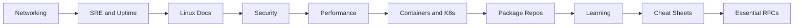

# Linux Resources and Bookmarks Guide

This guide is now split into focused reference collections so you can jump straight to networking, Linux documentation, security, performance, container, package, learning, and quick-reference material.

## Overview

- Use the networking, security, performance, container, and package guides when you need authoritative references fast.
- Use the SRE, Linux docs, and learning guides for deeper study, incident handling, and day-two operations.
- Use the cheat sheet and RFC guides for rapid lookup during troubleshooting, design, and interviews.

## Learning Path

## Table of Contents

1. [Networking References](01-networking-refs.md)
2. [SRE and Uptime](02-sre-uptime.md)
3. [Linux Documentation](03-linux-docs.md)
4. [Security References](04-security-refs.md)
5. [Performance References](05-performance-refs.md)
6. [Container and Kubernetes References](06-container-k8s.md)
7. [Package Repositories](07-package-repos.md)
8. [Learning and Practice](08-learning.md)
9. [Cheat Sheets and Quick References](09-cheatsheets.md)
10. [Essential RFCs](10-essential-rfcs.md)
