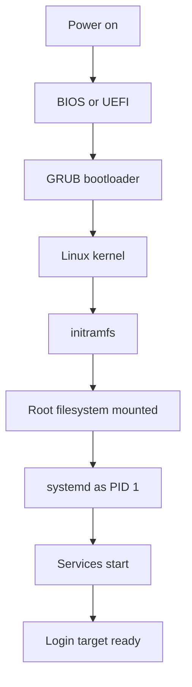

# Intermediate Linux Interview Questions

This guide collects intermediate Linux interview questions covering administration, networking, storage, and troubleshooting.

## Q51: What is a process in Linux?
**Answer:** A process is an instance of a running program with its own PID, memory space, open file descriptors, environment variables, and execution context. Linux is process-oriented: everything from shells to web servers to cron jobs runs as processes.

Important concepts:
- PID: Process ID
- PPID: Parent Process ID
- Foreground vs background process
- User/system processes
- States such as running, sleeping, stopped, zombie

Example commands:
```bash
ps -ef | head
ps -p 1 -f
pstree -p | head
```

---

## Q52: What is the difference between a process and a thread?
**Answer:** A process is an independent execution unit with its own address space. A thread is a lighter execution unit within a process that shares memory and resources with sibling threads.

Why it matters:
- Processes provide stronger isolation
- Threads are cheaper to create and switch between
- Multi-threaded apps can use multiple CPU cores efficiently

Example commands:
```bash
ps -eLf | head
top -H -p $(pgrep -n java)
```

---

## Q53: How do you list running processes?
**Answer:** Common tools include `ps`, `top`, `htop`, `pgrep`, and `pidof`.

Examples:
- `ps -ef` — Full listing
- `ps aux` — BSD-style listing
- `top` — Real-time process view
- `pgrep nginx` — Find PID by name
- `pidof sshd` — PID(s) by program name

Example commands:
```bash
ps -ef | grep nginx
pgrep -a sshd
pidof systemd
top -b -n 1 | head -20
```

---

## Q54: How do you kill a process?
**Answer:** Use `kill`, `pkill`, or `killall` depending on context, though `kill` with a specific PID is safer and more precise.

Common signals:
- `SIGTERM (15)` — Graceful termination
- `SIGKILL (9)` — Force kill
- `SIGHUP (1)` — Reload/restart behavior in some daemons

Example commands:
```bash
kill 1234
kill -TERM 1234
kill -9 1234
pkill -f gunicorn
```

Operational guidance:
- Try `SIGTERM` first
- Use `SIGKILL` only if the process refuses to exit

---

## Q55: What is a zombie process?
**Answer:** A zombie process is a terminated process whose exit status has not yet been collected by its parent via `wait()`. It no longer executes, but it still has a process table entry.

Characteristics:
- Shows state `Z`
- Consumes PID slot, not CPU or meaningful memory
- Usually disappears when the parent reaps it

If zombies accumulate, the parent process may be buggy.

Example commands:
```bash
ps -el | grep ' Z '
ps -eo pid,ppid,state,cmd | awk '$3=="Z"'
```

---

## Q56: What is an orphan process?
**Answer:** An orphan process is a process whose parent has exited before the child. The kernel reassigns the orphan to PID 1 (or another designated reaper process such as systemd), which later collects its exit status.

This is normal behavior in Unix-like systems.

Example commands:
```bash
ps -eo pid,ppid,cmd | awk '$2==1 {print}' | head
```

---

## Q57: What do process states like R, S, D, T, and Z mean?
**Answer:** Process state codes provide insight into system behavior.

Common states:
- `R` — Running or runnable
- `S` — Interruptible sleep
- `D` — Uninterruptible sleep, usually waiting on I/O
- `T` — Stopped or traced
- `Z` — Zombie

If many processes are stuck in `D`, investigate storage or kernel-level waits.

Example commands:
```bash
ps -eo pid,state,cmd | head -20
ps -eo pid,ppid,state,wchan,cmd | grep '^ *[0-9]'
```

---

## Q58: What is nice and renice?
**Answer:** Nice values influence process scheduling priority for normal user-space tasks. Lower nice values mean higher scheduling priority.

Range:
- `-20` highest priority
- `19` lowest priority

Commands:
- `nice` — Start a command with a given nice value
- `renice` — Change nice value of an existing process

Example commands:
```bash
nice -n 10 tar -czf backup.tar.gz /data
renice 5 -p 1234
ps -o pid,ni,cmd -p 1234
```

---

## Q59: What is the difference between top, htop, vmstat, and iostat?
**Answer:** These tools focus on different resource perspectives.

- `top` — Real-time CPU/memory/process view
- `htop` — Interactive enhanced version of top
- `vmstat` — Virtual memory, processes, CPU, I/O summary
- `iostat` — CPU and block device I/O statistics

Use them together during performance troubleshooting.

Example commands:
```bash
top
vmstat 1 5
iostat -xz 1 5
```

---

## Q60: How do you schedule recurring jobs?
**Answer:** Use `cron` for recurring tasks and `at` for one-time scheduled execution.

Cron concepts:
- Per-user crontab with `crontab -e`
- System-wide files like `/etc/crontab` and `/etc/cron.*`
- Standard fields: minute, hour, day-of-month, month, day-of-week

Example commands:
```bash
crontab -l
crontab -e
systemctl status cron || systemctl status crond
```

Example cron entry:
```cron
0 2 * * * /usr/local/bin/backup.sh
```

---

## Q61: What are systemd services and units?
**Answer:** `systemd` is the dominant init system and service manager in many Linux distributions. It manages different types of units such as services, sockets, mounts, timers, and targets.

Common unit types:
- `.service`
- `.socket`
- `.mount`
- `.timer`
- `.target`

Common tasks:
- Start/stop/restart services
- Enable services at boot
- Inspect status and logs

Example commands:
```bash
systemctl status sshd
systemctl list-units --type=service
systemctl cat nginx
```

---

## Q62: How do you start, stop, restart, and enable services?
**Answer:** Use `systemctl` for service operations.

Common commands:
- `systemctl start nginx`
- `systemctl stop nginx`
- `systemctl restart nginx`
- `systemctl reload nginx`
- `systemctl enable nginx`
- `systemctl disable nginx`
- `systemctl is-enabled nginx`

Example commands:
```bash
sudo systemctl start nginx
sudo systemctl restart nginx
sudo systemctl enable nginx
systemctl is-active nginx
systemctl is-enabled nginx
```

---

## Q63: How do you read logs in a systemd-based system?
**Answer:** Use `journalctl` to view systemd journal logs. It supports filtering by unit, boot, time, priority, and following live logs.

Useful options:
- `journalctl -u nginx`
- `journalctl -xe`
- `journalctl -b`
- `journalctl -f`
- `journalctl --since "1 hour ago"`

Example commands:
```bash
journalctl -u sshd --since today
journalctl -p err -b
journalctl -f
```

---

## Q64: How does Linux boot at a high level?
**Answer:** Linux boot involves several stages from firmware to user-space services.

Typical flow:
1. BIOS/UEFI initializes hardware
2. Bootloader such as GRUB loads kernel and initramfs
3. Kernel initializes memory, CPU, devices, drivers
4. Kernel mounts initramfs and then root file system
5. PID 1 starts, usually `systemd`
6. Services and targets are activated
7. Login prompt or graphical target becomes available



Example commands:
```bash
systemd-analyze
systemd-analyze blame
ls /boot
```

---

## Q65: What is networking in Linux and how do you view interface information?
**Answer:** Linux networking involves interfaces, IP addresses, routes, ARP/neighbor tables, sockets, firewall rules, and network services. The modern command suite is `ip` from `iproute2`.

Useful tasks:
- View interfaces and addresses
- Bring links up/down
- Inspect routes and neighbor entries

Example commands:
```bash
ip addr show
ip link show
ip route show
ip neigh show
```

---

## Q66: What is the difference between `ip`, `ifconfig`, and `nmcli`?
**Answer:** `ip` is the modern and preferred utility from `iproute2`. `ifconfig` is older and deprecated in many environments. `nmcli` is used to manage NetworkManager.

Use cases:
- `ip`: scripting and standard network inspection/configuration
- `ifconfig`: legacy systems
- `nmcli`: desktop/server systems managed by NetworkManager

Example commands:
```bash
ip a
ifconfig || true
nmcli device status || true
nmcli connection show || true
```

---

## Q67: How do you test network connectivity?
**Answer:** Several layers of testing are useful.

Layered checks:
1. Local interface status
2. IP reachability with `ping`
3. DNS resolution with `dig`, `host`, or `nslookup`
4. TCP reachability with `nc`, `telnet`, or `curl`
5. Route path with `traceroute` or `tracepath`

Example commands:
```bash
ping -c 4 8.8.8.8
ping -c 4 google.com
dig github.com
nc -vz example.com 443
traceroute 8.8.8.8
```

---

## Q68: How do you inspect listening ports and active connections?
**Answer:** Use `ss`, which is faster and more modern than `netstat`.

Useful options:
- `ss -tulnp` — TCP/UDP listening sockets with process info
- `ss -tan` — TCP connections
- `ss -s` — Summary

Example commands:
```bash
ss -tulnp
ss -tan | head
ss -s
lsof -i :443
```

---

## Q69: What is DNS and how do you troubleshoot it?
**Answer:** DNS converts domain names to IP addresses. Troubleshooting should separate name resolution problems from general network connectivity issues.

Checks:
- Verify `/etc/resolv.conf`
- Test with `dig` or `host`
- Compare internal vs external resolvers
- Check search domain behavior
- Confirm firewalls allow UDP/TCP 53

Example commands:
```bash
cat /etc/resolv.conf
dig example.com
host example.com
nslookup example.com
```

---

## Q70: What is a routing table?
**Answer:** A routing table determines where packets are sent based on destination networks, gateways, and interfaces. The kernel uses the most specific matching route.

Important fields:
- Destination network
- Gateway/next hop
- Interface
- Metric

Example commands:
```bash
ip route show
ip route get 8.8.8.8
netstat -rn || true
```

---

## Q71: How do you transfer files securely between systems?
**Answer:** Common secure methods include `scp`, `sftp`, and `rsync` over SSH.

Use cases:
- `scp` — Simple copy
- `sftp` — Interactive secure transfer
- `rsync -e ssh` — Efficient sync, preserves attributes, transfers deltas

Example commands:
```bash
scp backup.tar.gz user@server:/backups/
sftp user@server
rsync -avz -e ssh /data/ user@server:/data/
```

---

## Q72: What is SSH and what are key SSH files?
**Answer:** SSH provides secure remote login and encrypted data transfer. It uses host keys, user authentication, and optional public key authentication.

Important files:
- Client config: `~/.ssh/config`
- Private keys: `~/.ssh/id_rsa`, `~/.ssh/id_ed25519`
- Authorized keys: `~/.ssh/authorized_keys`
- Server config: `/etc/ssh/sshd_config`
- Known hosts: `~/.ssh/known_hosts`

Example commands:
```bash
ssh user@server
ssh -i ~/.ssh/id_ed25519 user@server
ssh-keygen -t ed25519
cat ~/.ssh/authorized_keys
```

---

## Q73: How do you troubleshoot SSH login failures?
**Answer:** Check the problem from both client and server perspectives.

Client-side:
- Use verbose mode with `ssh -vvv`
- Verify DNS and network reachability
- Check key permissions

Server-side:
- Inspect `sshd` status
- Review logs
- Validate `/etc/ssh/sshd_config`
- Confirm firewall and SELinux/AppArmor policies

Example commands:
```bash
ssh -vvv user@server
sudo systemctl status sshd
sudo sshd -t
journalctl -u sshd --since "10 minutes ago"
ls -ld ~/.ssh
ls -l ~/.ssh/authorized_keys
```

---

## Q74: What is a shell script?
**Answer:** A shell script is a text file containing shell commands executed in sequence. It is used for automation, administration, deployment, monitoring, backups, and bootstrapping.

Typical structure:
- Shebang line
- Variables
- Conditional logic
- Loops
- Functions
- Error handling

Example script:
```bash
#!/bin/bash
set -e
DATE=$(date +%F)
echo "Backup started on $DATE"
```

Example commands:
```bash
chmod +x backup.sh
./backup.sh
bash -x backup.sh
```

---

## Q75: What is the purpose of the shebang line?
**Answer:** The shebang tells the kernel which interpreter to use when executing a script directly.

Examples:
- `#!/bin/bash`
- `#!/usr/bin/env bash`
- `#!/bin/sh`
- `#!/usr/bin/python3`

Using `/usr/bin/env` can make scripts more portable across environments where interpreter locations vary.

Example commands:
```bash
head -n 1 script.sh
chmod +x script.sh
./script.sh
```

---

## Q76: How do variables work in shell scripts?
**Answer:** Variables store values for reuse in scripts. Bash variables are typically assigned without spaces around `=`.

Examples:
- `NAME="linux"`
- `COUNT=5`
- `echo "$NAME"`

Best practices:
- Quote variable expansions unless you intentionally want word splitting
- Use meaningful names
- Export variables only when child processes need them

Example commands:
```bash
NAME="server01"
echo "$NAME"
export ENV=prod
env | grep '^ENV='
```

---

## Q77: How do conditionals work in Bash?
**Answer:** Bash supports `if`, `elif`, `else`, and test expressions using `[ ]`, `[[ ]]`, or `test`.

Example:
```bash
if [ -f /etc/passwd ]; then
  echo "file exists"
else
  echo "missing"
fi
```

Useful tests:
- `-f` regular file
- `-d` directory
- `-z` empty string
- `-n` non-empty string
- `-eq`, `-lt`, `-gt` numeric comparisons

Example commands:
```bash
[ -d /etc ] && echo yes
[[ -n "$HOME" ]] && echo home-set
```

---

## Q78: How do loops work in shell scripts?
**Answer:** Loops let you repeat actions over lists, ranges, or conditions.

Common loop types:
- `for`
- `while`
- `until`

Example:
```bash
for user in alice bob carol; do
  echo "$user"
done
```

Example commands:
```bash
for f in /etc/*.conf; do echo "$f"; done | head
COUNT=1
while [ $COUNT -le 3 ]; do echo $COUNT; COUNT=$((COUNT+1)); done
```

---

## Q79: What is `set -euo pipefail` and why is it used?
**Answer:** This is a common Bash safety pattern.

- `set -e` — Exit on command failure
- `set -u` — Error on unset variables
- `set -o pipefail` — Pipeline fails if any command fails

It helps reduce silent errors in automation scripts.

Example:
```bash
#!/bin/bash
set -euo pipefail
```

Example commands:
```bash
bash -c 'set -euo pipefail; false; echo never'
```

---

## Q80: How do you debug shell scripts?
**Answer:** Common techniques:
- `bash -x script.sh` for execution trace
- `set -x` inside script to trace commands
- `set -e` for fail-fast behavior
- `echo` or `printf` for variable inspection
- ShellCheck for static analysis when available

Example commands:
```bash
bash -x deploy.sh
bash -n deploy.sh
set -x
```

---

## Q81: What is a file descriptor?
**Answer:** A file descriptor is an integer representing an open file, socket, pipe, or other I/O resource for a process.

Common descriptors:
- `0` stdin
- `1` stdout
- `2` stderr

Processes can open many more file descriptors for logs, sockets, temp files, and database connections.

Example commands:
```bash
ls -l /proc/$$/fd
lsof -p $$ | head
```

---

## Q82: What is `lsof` used for?
**Answer:** `lsof` stands for **list open files**. In Linux, everything is treated as a file abstraction, so `lsof` can show regular files, directories, block devices, libraries, and network sockets opened by processes.

Practical uses:
- Identify which process is using a port
- Find deleted-but-still-open files consuming space
- Inspect process file activity

Example commands:
```bash
lsof -i :8080
lsof -p 1234 | head
lsof | grep deleted
```

---

## Q83: How do you check memory usage?
**Answer:** Common memory inspection tools:
- `free -h`
- `top`
- `vmstat`
- `/proc/meminfo`
- `smem` if installed

Understand Linux memory behavior:
- Free memory alone is not enough
- Cached and buffered memory can be reclaimed
- Watch swap usage and OOM events

Example commands:
```bash
free -h
cat /proc/meminfo | head -20
vmstat 1 5
```

---

## Q84: What is swap space?
**Answer:** Swap is disk-backed virtual memory used when RAM pressure increases. It provides a safety buffer but is much slower than RAM.

Why it matters:
- Helps avoid immediate OOM conditions
- Excessive swap usage may indicate memory pressure
- Some swap is useful even on modern systems depending on workload

Example commands:
```bash
swapon --show
free -h
cat /proc/swaps
```

---

## Q85: How do you mount and unmount file systems?
**Answer:** Mounting attaches a file system to the directory tree. Unmounting detaches it.

Commands:
- `mount /dev/sdb1 /mnt/data`
- `umount /mnt/data`
- `findmnt`
- `lsblk`

Persistent mounts are configured in `/etc/fstab`.

Example commands:
```bash
lsblk
findmnt
sudo mount /dev/sdb1 /mnt
sudo umount /mnt
```

---

## Q86: What is `/etc/fstab`?
**Answer:** `/etc/fstab` defines file systems to mount automatically at boot or on demand. It includes device identifiers, mount points, file system types, mount options, dump value, and fsck order.

Typical fields:
1. Device or UUID
2. Mount point
3. File system type
4. Options
5. Dump
6. Fsck order

Example commands:
```bash
cat /etc/fstab
blkid
findmnt --verify
```

Sample entry:
```fstab
UUID=1234-5678 /data ext4 defaults,nofail 0 2
```

---

## Q87: What is the difference between ext4, XFS, and Btrfs?
**Answer:** These are common Linux file systems with different trade-offs.

- **ext4** — Mature, stable, widely supported, good default choice
- **XFS** — Excellent for large files and scalability, common in enterprise distributions
- **Btrfs** — Advanced features like snapshots, checksums, subvolumes, compression

Selection depends on workload, tooling, operational maturity, and recovery strategy.

Example commands:
```bash
lsblk -f
mount | grep -E 'ext4|xfs|btrfs'
```

---

## Q88: How do you manage partitions and disks?
**Answer:** Disk management typically involves these steps:
1. Detect disk
2. Partition disk
3. Create file system
4. Mount it
5. Persist in `/etc/fstab`

Tools:
- `lsblk`
- `fdisk`
- `parted`
- `mkfs.ext4`, `mkfs.xfs`
- `blkid`

Example commands:
```bash
lsblk
sudo fdisk /dev/sdb
sudo mkfs.ext4 /dev/sdb1
sudo blkid /dev/sdb1
sudo mount /dev/sdb1 /data
```

---

## Q89: What is LVM?
**Answer:** LVM (Logical Volume Manager) provides flexible storage management by abstracting physical disks into volume groups and logical volumes. It allows resizing, snapshots, and easier capacity planning.

Core terms:
- PV — Physical Volume
- VG — Volume Group
- LV — Logical Volume

Typical flow:
1. `pvcreate`
2. `vgcreate`
3. `lvcreate`
4. Create file system and mount

Example commands:
```bash
sudo pvcreate /dev/sdb1
sudo vgcreate vgdata /dev/sdb1
sudo lvcreate -n lvapp -L 20G vgdata
sudo mkfs.ext4 /dev/vgdata/lvapp
```

---

## Q90: How do you extend a logical volume and file system?
**Answer:** With LVM, you can often grow storage online.

Typical steps:
1. Confirm free space in the volume group
2. Extend the logical volume
3. Grow the file system

Example commands:
```bash
vgs
lvs
sudo lvextend -L +10G /dev/vgdata/lvapp
sudo resize2fs /dev/vgdata/lvapp
sudo xfs_growfs /mountpoint
```

Use `resize2fs` for ext-family file systems and `xfs_growfs` for XFS.

---

## Q91: How do you check CPU information?
**Answer:** CPU information can be obtained from multiple sources.

Useful commands:
- `lscpu`
- `cat /proc/cpuinfo`
- `nproc`
- `top`

Key details:
- Architecture
- Core count
- Thread count
- CPU model
- Virtualization support

Example commands:
```bash
lscpu
nproc
cat /proc/cpuinfo | grep 'model name' | head
```

---

## Q92: How do you identify startup performance issues?
**Answer:** On systemd systems, `systemd-analyze` is the main tool.

Useful commands:
- `systemd-analyze`
- `systemd-analyze blame`
- `systemd-analyze critical-chain`

These show total boot time and the units contributing most to delays.

Example commands:
```bash
systemd-analyze
systemd-analyze blame | head -20
systemd-analyze critical-chain
```

---

## Q93: What is SELinux at a high level?
**Answer:** SELinux (Security-Enhanced Linux) is a mandatory access control system that enforces security policies beyond traditional Unix permissions. Even if DAC permissions allow access, SELinux can still deny it.

Modes:
- Enforcing
- Permissive
- Disabled

Common commands:
- `getenforce`
- `sestatus`
- `restorecon`
- `semanage`

Example commands:
```bash
getenforce
sestatus
ls -Z /var/www/html
```

---

## Q94: What is a firewall and how do you inspect it?
**Answer:** A firewall controls allowed and blocked network traffic. Linux may use tools such as `firewalld`, `nftables`, or legacy `iptables`.

Common inspection tools:
- `firewall-cmd --list-all`
- `nft list ruleset`
- `iptables -L -n -v`

Example commands:
```bash
sudo firewall-cmd --list-all || true
sudo nft list ruleset || true
sudo iptables -L -n -v || true
```

---

## Q95: How do you troubleshoot high CPU usage?
**Answer:** Start by identifying the process, then determine whether the issue is expected load, bad code, inefficient queries, or system contention.

Approach:
1. Identify top CPU consumers
2. Check if one core or all cores are busy
3. Inspect process/thread behavior
4. Review recent deployments and logs
5. Consider profiling or strace if needed

Example commands:
```bash
top
ps -eo pid,ppid,%cpu,%mem,cmd --sort=-%cpu | head
top -H -p 1234
journalctl -xe
```

---

## Q96: How do you troubleshoot high memory usage?
**Answer:** Look for total memory pressure, swap usage, cache behavior, OOM events, and top consumers.

Approach:
1. Check overall memory and swap
2. Identify top memory-consuming processes
3. Review kernel logs for OOM killer
4. Determine leak vs legitimate cache growth
5. Tune application memory limits or scaling

Example commands:
```bash
free -h
ps -eo pid,%mem,rss,cmd --sort=-%mem | head
dmesg | grep -i -E 'oom|killed process'
cat /proc/meminfo | head -20
```

---

## Q97: How do you troubleshoot disk I/O bottlenecks?
**Answer:** Symptoms include high load average with low CPU usage, slow application responses, blocked processes in `D` state, and elevated storage latencies.

Tools:
- `iostat -xz`
- `vmstat`
- `iotop` if available
- `dmesg`
- `smartctl` if hardware access is available

Example commands:
```bash
iostat -xz 1 5
vmstat 1 5
ps -eo pid,state,wchan,cmd | awk '$2=="D"'
dmesg | tail -50
```

---

## Q98: How do you troubleshoot a service that fails to start?
**Answer:** Diagnose configuration, dependencies, permissions, missing files, port conflicts, and security policy denials.

Step-by-step:
1. Check status
2. Read logs
3. Validate config
4. Check port conflicts
5. Confirm permissions and ownership
6. Review SELinux/AppArmor if applicable

Example commands:
```bash
systemctl status nginx
journalctl -u nginx -n 100 --no-pager
nginx -t
ss -tulnp | grep ':80 '
ls -ld /var/www/html
```

---

## Q99: What is the difference between load average and CPU utilization?
**Answer:** CPU utilization shows how busy the CPUs are. Load average represents the average number of processes that are running or waiting for CPU or uninterruptible I/O.

Important insight:
- High load does not always mean high CPU usage
- Disk or network I/O stalls can inflate load average
- Compare load to CPU core count

Example commands:
```bash
uptime
cat /proc/loadavg
lscpu | grep '^CPU(s):'
top
```

---

## Q100: What intermediate Linux topics are most important for interviews?
**Answer:** Strong intermediate candidates should be confident in process management, systemd, logs, networking, SSH, storage, shell scripting, performance basics, and troubleshooting methodology.

Top focus areas:
- `ps`, `top`, `kill`, `nice`
- `systemctl`, `journalctl`
- `ip`, `ss`, `ping`, `dig`
- `cron`, shell scripting, `bash -x`
- `df`, `du`, `mount`, `/etc/fstab`
- LVM and file systems
- `free`, `vmstat`, `iostat`
- SSH, DNS, firewall basics

Example commands:
```bash
systemctl status sshd
journalctl -u sshd -n 50
ip route
ss -tulnp
free -h
iostat -xz 1 3
```

---
