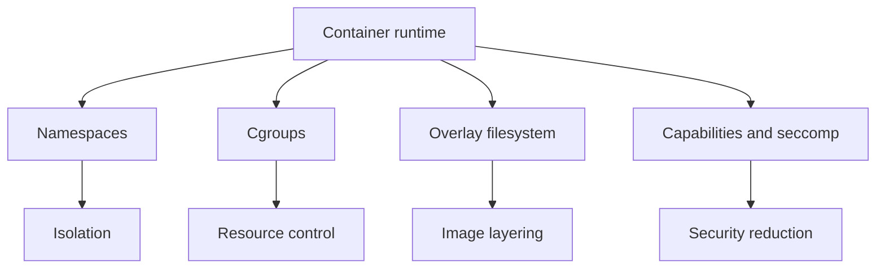
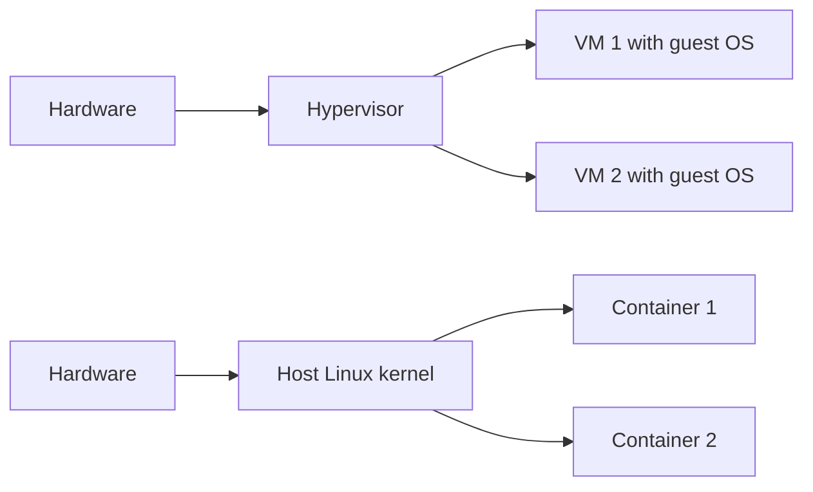

# Advanced Linux Interview Questions

This guide collects advanced Linux interview questions spanning internals, performance, security, and system behavior.

## Q101: What happens during a Linux system call?
**Answer:** A system call is the controlled interface through which a user-space program requests a service from the kernel. Examples include reading a file, creating a process, binding a socket, or allocating memory.

High-level flow:
1. User process executes a system call wrapper from libc or directly invokes syscall instruction
2. CPU switches from user mode to kernel mode
3. Kernel validates arguments and permissions
4. Kernel performs the requested operation
5. Result and errno are returned to user space

This boundary is fundamental to Linux isolation and resource control.

Example commands:
```bash
strace -c ls >/dev/null 2>&1
strace -e openat,read,write cat /etc/hosts
```

---

## Q102: What is the difference between user space and kernel space?
**Answer:** **User space** is where applications run with restricted privileges. **Kernel space** is where the kernel executes with full hardware and memory access.

Why it matters:
- Protects the system from buggy or malicious applications
- Enforces security and isolation
- Requires system calls for privileged operations

Kernel crashes can impact the whole system, while user-space process crashes are typically isolated.

Example commands:
```bash
uname -a
cat /proc/version
dmesg | tail
```

---

## Q103: What is the Linux scheduler?
**Answer:** The Linux scheduler decides which runnable task gets CPU time and on which core. It balances fairness, responsiveness, throughput, and latency.

Key points:
- Standard tasks typically use the Completely Fair Scheduler (CFS)
- Real-time classes exist for latency-sensitive workloads
- Priority, nice values, CPU affinity, and cgroups affect scheduling behavior

Example commands:
```bash
chrt -p $$
ps -eo pid,cls,rtprio,ni,cmd | head
taskset -p $$
```

---

## Q104: What are cgroups?
**Answer:** Control groups (cgroups) limit, account for, and isolate resource usage such as CPU, memory, I/O, and PIDs for groups of processes. They are heavily used by containers and systemd.

They enable:
- CPU quota/weight control
- Memory limits
- I/O throttling
- Process count limits

Example commands:
```bash
mount | grep cgroup
systemd-cgls | head -50
systemd-cgtop | head
```

---

## Q105: What are namespaces in Linux?
**Answer:** Namespaces provide isolation of system resources for a group of processes. They are a building block of containers.

Common namespace types:
- PID
- Network
- Mount
- UTS
- IPC
- User
- Cgroup

They allow processes to have isolated views of process IDs, hostnames, networking, and file system mounts.

Example commands:
```bash
lsns
unshare --help | head
```

---

## Q106: How do cgroups and namespaces relate to containers?
**Answer:** Containers rely primarily on:
- **Namespaces** for isolation
- **Cgroups** for resource limits and accounting
- **Union/overlay file systems** for image layering
- **Capabilities** and security policies for privilege reduction

This combination allows multiple application environments to run on one kernel while feeling isolated.



Example commands:
```bash
docker inspect container_id || true
podman inspect container_id || true
lsns
systemd-cgls
```

---

## Q107: What is the role of initramfs?
**Answer:** Initramfs is a temporary root file system loaded into memory during boot. It contains tools and drivers needed to initialize hardware and mount the real root file system.

It is especially important when:
- Root storage uses LVM, RAID, or encryption
- Special drivers are needed early in boot
- Recovery or rescue operations are required

Example commands:
```bash
lsinitramfs /boot/initrd.img-$(uname -r) | head || true
ls /boot
```

---

## Q108: What is GRUB?
**Answer:** GRUB is a bootloader that loads the Linux kernel and initramfs, passes kernel parameters, and can provide boot menus and recovery entries.

Common admin actions:
- Inspect GRUB config
- Update boot parameters
- Rebuild configuration after changes

Example commands:
```bash
cat /etc/default/grub
ls /boot/grub* 
sudo grub2-mkconfig -o /boot/grub2/grub.cfg || sudo update-grub
```

---

## Q109: What is the OOM killer?
**Answer:** The Out-Of-Memory (OOM) killer is a kernel mechanism that selects and terminates processes when the system cannot reclaim enough memory to continue operating safely.

Important notes:
- It chooses processes based on heuristic scores and badness factors
- Logs are recorded in kernel messages/journal
- Frequent OOM events indicate capacity or limit issues

Example commands:
```bash
dmesg | grep -i oom
journalctl -k | grep -i 'killed process'
cat /proc/$$/oom_score
cat /proc/$$/oom_score_adj
```

---

## Q110: What is copy-on-write?
**Answer:** Copy-on-write (CoW) is an optimization where data is shared until a modification occurs, at which point a copy is made. Linux uses CoW concepts in several places such as process forking, snapshots, and some file systems.

Examples:
- `fork()` initially shares memory pages until either process writes
- Btrfs and some storage snapshots use CoW semantics

Example commands:
```bash
ps -o pid,rss,cmd -p $$
```

---

## Q111: What are capabilities in Linux security?
**Answer:** Linux capabilities split the all-powerful root privilege into smaller discrete privileges such as binding low ports or changing file ownership. This helps implement least privilege.

Examples:
- `CAP_NET_BIND_SERVICE`
- `CAP_SYS_ADMIN`
- `CAP_CHOWN`

Example commands:
```bash
getcap /usr/bin/ping || true
capsh --print | head -40 || true
```

---

## Q112: What is PAM?
**Answer:** PAM (Pluggable Authentication Modules) is a framework for authentication, account checks, session handling, and password management. Many services like SSH, login, and sudo integrate with PAM.

PAM enables flexible authentication policy without changing application code.

Important locations:
- `/etc/pam.d/`
- `/etc/security/`

Example commands:
```bash
ls /etc/pam.d | head
cat /etc/pam.d/sshd
```

---

## Q113: What is the difference between discretionary and mandatory access control?
**Answer:** **Discretionary Access Control (DAC)** uses traditional Unix permissions and ownership, where object owners can control access. **Mandatory Access Control (MAC)** uses centrally enforced policies such as SELinux that users cannot arbitrarily bypass.

Why interviews ask this:
- Demonstrates security model understanding
- Explains why permissions alone may not solve access issues

Example commands:
```bash
ls -l /var/www/html
ls -Z /var/www/html || true
getenforce || true
```

---

## Q114: How do you harden SSH on Linux servers?
**Answer:** SSH hardening reduces brute-force risk, privilege abuse, and weak access methods.

Best practices:
- Disable password auth where possible
- Use key-based auth
- Disable direct root login
- Restrict users/groups
- Use strong ciphers and modern protocols
- Implement MFA or bastion access if required
- Rate-limit connection attempts

Example commands:
```bash
sudo grep -E '^(PermitRootLogin|PasswordAuthentication|PubkeyAuthentication)' /etc/ssh/sshd_config
sudo sshd -t
sudo systemctl reload sshd
```

Potential config:
```text
PermitRootLogin no
PasswordAuthentication no
PubkeyAuthentication yes
AllowGroups sshusers
```

---

## Q115: What is seccomp?
**Answer:** Seccomp is a Linux kernel feature that restricts which system calls a process can make. It reduces attack surface, especially for containers and sandboxed workloads.

Commonly used by:
- Docker and other container runtimes
- Sandboxed services
- Security-sensitive workloads

Example commands:
```bash
grep Seccomp /proc/$$/status
```

---

## Q116: What is AppArmor?
**Answer:** AppArmor is a Linux security module that confines programs according to per-application profiles. It is commonly used in Ubuntu-based systems.

Compared with SELinux:
- SELinux is label-based
- AppArmor is path-based

Example commands:
```bash
sudo aa-status || true
ls /etc/apparmor.d || true
```

---

## Q117: How do you analyze a system call issue or hanging program?
**Answer:** `strace` is often the first tool to inspect what a process is doing at the syscall layer. `ltrace` can help with library calls.

Use cases:
- Detect repeated failed syscalls
- Identify missing files or permissions
- See blocking I/O or network calls

Example commands:
```bash
strace -p 1234
strace -tt -f -o trace.log ./app
ltrace ./app || true
```

---

## Q118: What is the purpose of `perf`?
**Answer:** `perf` is a powerful Linux performance analysis toolkit for CPU profiling, hardware counters, tracing, and flame-graph-compatible workflows.

It helps identify:
- Hot functions
- CPU cycles and cache misses
- Scheduler behavior
- Kernel/user-space performance hotspots

Example commands:
```bash
perf stat ls >/dev/null
perf top || true
perf record -g -- sleep 5 || true
```

---

## Q119: What is the difference between RAID and LVM?
**Answer:** RAID and LVM solve different storage problems.

- **RAID** provides redundancy and/or performance across multiple disks
- **LVM** provides flexible logical storage management

They are often combined:
1. Build RAID array
2. Create LVM on top
3. Create logical volumes

Example commands:
```bash
cat /proc/mdstat || true
lsblk
pvs
vgs
lvs
```

---

## Q120: What are common RAID levels?
**Answer:** Common RAID levels:
- RAID 0 — Striping, no redundancy
- RAID 1 — Mirroring
- RAID 5 — Striping with single parity
- RAID 6 — Striping with double parity
- RAID 10 — Mirrored stripes

Trade-offs involve capacity, read/write performance, rebuild time, and fault tolerance.

Example commands:
```bash
cat /proc/mdstat
mdadm --detail /dev/md0 || true
```

---

## Q121: How do you troubleshoot a kernel panic or boot failure?
**Answer:** Start with boot logs, rescue mode, last known kernel, and storage/root file system validation.

Approach:
1. Capture the exact error from console/IPMI/cloud serial log
2. Try previous kernel from GRUB
3. Boot rescue/emergency mode
4. Verify `/etc/fstab`, root UUID, initramfs, disk health
5. Rebuild initramfs or bootloader if needed

Example commands:
```bash
journalctl -b -1 -p err
cat /etc/fstab
blkid
ls /boot
```

---

## Q122: What is CPU affinity and when would you use it?
**Answer:** CPU affinity binds a process or thread to specific CPU cores. This can help with performance isolation, cache locality, licensing constraints, or troubleshooting noisy neighbors.

Use with care, because over-constraining workloads can reduce scheduler flexibility.

Example commands:
```bash
taskset -p 1234
taskset -cp 0,1 1234
```

---

## Q123: What is NUMA?
**Answer:** NUMA (Non-Uniform Memory Access) is a memory architecture where memory access latency depends on which CPU socket/node accesses which memory bank. On large servers, NUMA awareness matters for performance-sensitive workloads.

Useful when tuning databases, JVMs, and analytics systems.

Example commands:
```bash
numactl --hardware || true
lscpu | grep NUMA
```

---

## Q124: What is transparent huge pages and why can it matter?
**Answer:** Transparent Huge Pages (THP) automatically uses larger memory pages to improve TLB efficiency, but it can introduce latency or compaction overhead for some workloads like databases.

Depending on workload, THP may improve or hurt performance.

Example commands:
```bash
cat /sys/kernel/mm/transparent_hugepage/enabled
cat /sys/kernel/mm/transparent_hugepage/defrag
```

---

## Q125: How do you troubleshoot network latency on Linux?
**Answer:** Measure rather than guess. Determine whether the issue is DNS, TCP handshake, packet loss, routing, application latency, or server overload.

Approach:
1. Test ICMP reachability and latency
2. Resolve DNS separately
3. Check routes
4. Inspect interface errors and drops
5. Analyze sockets and retransmits
6. Capture packets if needed

Example commands:
```bash
ping -c 5 server
mtr -rw server || true
ip -s link
ss -ti dst server || true
tcpdump -i any host server -c 50 || true
```

---

## Q126: What is `tcpdump` used for?
**Answer:** `tcpdump` captures and displays network packets. It is essential for validating whether traffic is sent, received, retransmitted, reset, or blocked.

Use cases:
- DNS query verification
- TLS handshake debugging
- Load balancer/backend analysis
- Packet loss investigation

Example commands:
```bash
sudo tcpdump -i any port 53 -c 20
sudo tcpdump -i eth0 host 10.0.0.5 and port 443
sudo tcpdump -nn -i any tcp
```

---

## Q127: What is the Linux page cache?
**Answer:** The page cache stores file data in memory to accelerate reads and reduce disk I/O. This is why Linux may show low “free” memory while still performing well.

Important idea:
- Cache is generally reclaimable
- Cached memory is beneficial, not wasted
- Sudden drops in cache can indicate pressure

Example commands:
```bash
free -h
cat /proc/meminfo | grep -E 'Cached|Buffers|MemAvailable'
```

---

## Q128: How do you troubleshoot file descriptor exhaustion?
**Answer:** Symptoms include “too many open files” errors, inability to accept connections, or application instability.

Approach:
1. Check system and user limits
2. Identify process with excessive open files
3. Determine whether descriptors are sockets, files, pipes, or leaks
4. Tune limits and fix application behavior

Example commands:
```bash
ulimit -n
cat /proc/sys/fs/file-max
lsof -p 1234 | wc -l
cat /proc/1234/limits
```

---

## Q129: What is the difference between hard and soft resource limits?
**Answer:** Soft limits are the current enforced limits for a process/user session. Hard limits are the maximum values to which soft limits can be raised without additional privilege.

Commonly managed via:
- `ulimit`
- `/etc/security/limits.conf`
- systemd unit settings like `LimitNOFILE=`

Example commands:
```bash
ulimit -Sn
ulimit -Hn
cat /proc/$$/limits
```

---

## Q130: What are kernel modules?
**Answer:** Kernel modules are pieces of code that can be loaded/unloaded into the kernel at runtime to add functionality like drivers, file systems, or networking features without rebuilding the kernel.

Common commands:
- `lsmod`
- `modinfo`
- `modprobe`
- `rmmod`

Example commands:
```bash
lsmod | head
modinfo ext4 | head
sudo modprobe br_netfilter || true
```

---

## Q131: What is `/proc` and how is it used?
**Answer:** `/proc` is a virtual file system exposing kernel and process information. It is not stored on disk like a normal file system.

Useful paths:
- `/proc/cpuinfo`
- `/proc/meminfo`
- `/proc/loadavg`
- `/proc/<pid>/`
- `/proc/sys/`

Example commands:
```bash
cat /proc/cpuinfo | head
cat /proc/meminfo | head
ls /proc/$$
```

---

## Q132: What is `sysctl`?
**Answer:** `sysctl` is used to view and modify kernel runtime parameters, especially networking and memory tunables.

Examples of tunables:
- IP forwarding
- TCP settings
- VM behavior
- kernel panic configuration

Example commands:
```bash
sysctl net.ipv4.ip_forward
sysctl vm.swappiness
sudo sysctl -w net.ipv4.ip_forward=1
sysctl -a | head
```

---

## Q133: How do you make kernel parameter changes persistent?
**Answer:** Temporary changes with `sysctl -w` disappear on reboot. Persistent changes should be placed in configuration files loaded during boot.

Common locations:
- `/etc/sysctl.conf`
- `/etc/sysctl.d/*.conf`

Example commands:
```bash
echo 'net.ipv4.ip_forward = 1' | sudo tee /etc/sysctl.d/99-custom.conf
sudo sysctl --system
sysctl net.ipv4.ip_forward
```

---

## Q134: What is eBPF at a high level?
**Answer:** eBPF allows safe, programmable code to run in the kernel for tracing, networking, observability, and security use cases. It powers many modern performance and security tools.

Use cases:
- Low-overhead tracing
- Network filtering and load balancing
- Security enforcement
- Performance insights

Example commands:
```bash
bpftool prog show || true
bpftool map show || true
```

---

## Q135: What is the difference between virtualization and containerization?
**Answer:** Virtualization runs separate guest operating systems on virtual hardware, usually via a hypervisor. Containers share the host kernel while isolating user-space environments.

Trade-offs:
- VMs provide stronger isolation and OS heterogeneity
- Containers are lighter and faster to start
- Containers require kernel compatibility with the host



Example commands:
```bash
systemd-detect-virt
docker ps || true
podman ps || true
```

---

## Q136: How do Linux containers handle storage and networking?
**Answer:** Container runtimes typically use layered images and virtual networking abstractions.

Storage:
- Overlay/union file systems
- Writable container layers
- Volumes and bind mounts for persistence

Networking:
- Bridge networks
- Veth pairs
- NAT/port publishing
- CNI plugins in orchestrated environments

Example commands:
```bash
docker network ls || true
docker volume ls || true
ip link show | grep veth || true
bridge link || true
```

---

## Q137: What are systemd timers and how do they compare to cron?
**Answer:** Systemd timers provide scheduled execution similar to cron but integrate with systemd dependencies, logging, service units, and calendar expressions.

Advantages over cron:
- Better service integration
- Structured logs via journal
- Easier dependency handling
- Persistent timers can catch up after downtime

Example commands:
```bash
systemctl list-timers --all
systemctl cat logrotate.timer
```

---

## Q138: What is infrastructure as code from a Linux admin perspective?
**Answer:** Infrastructure as code (IaC) means managing servers, networks, configurations, and policies through version-controlled definitions rather than manual changes.

Benefits:
- Repeatability
- Auditability
- Faster provisioning
- Lower drift
- Easier rollback and peer review

Linux admins commonly touch:
- Ansible
- Terraform
- Cloud-init
- Shell bootstrap scripts

Example commands:
```bash
ansible --version || true
terraform version || true
cloud-init status || true
```

---

## Q139: What is configuration drift?
**Answer:** Configuration drift occurs when systems that should be identical diverge over time due to manual changes, inconsistent patching, or ad hoc fixes.

Problems caused:
- Hard-to-reproduce incidents
- Deployment failures
- Security inconsistencies
- Testing/production mismatch

Mitigation:
- Automation
- Immutable infrastructure where possible
- Regular compliance scans
- Version-controlled configuration

Example commands:
```bash
rpm -qa | sort | head
systemctl list-unit-files | head
```

---

## Q140: How do you secure secrets on Linux systems?
**Answer:** Secrets such as API keys, database passwords, TLS private keys, and tokens require strict handling.

Best practices:
- Avoid storing in shell history or plaintext files
- Use dedicated secret managers when possible
- Restrict file permissions
- Rotate regularly
- Inject at runtime rather than baking into images
- Audit access

Example commands:
```bash
chmod 600 /path/to/private.key
history | tail
printenv | grep -i token || true
```

---

## Q141: What is a bastion host?
**Answer:** A bastion host is a hardened server used as a controlled entry point to access systems in private networks. It centralizes audit, access policy, and network exposure.

Benefits:
- Reduced attack surface
- Centralized logging and authentication
- Better segmentation

Example commands:
```bash
ssh -J bastion user@internal-host
cat ~/.ssh/config
```

Sample SSH config:
```text
Host internal-app
    HostName 10.0.2.10
    User ec2-user
    ProxyJump bastion
```

---

## Q142: How do you investigate intermittent application slowness?
**Answer:** Intermittent issues require time-correlated evidence.

Approach:
1. Define the time window
2. Correlate application logs, system metrics, and deployment history
3. Check CPU, memory, disk, and network during the event
4. Look for GC pauses, connection pool exhaustion, lock contention, DNS delays, or downstream dependency latency
5. Capture short-term tracing if issue recurs

Example commands:
```bash
journalctl --since "2025-01-10 10:00" --until "2025-01-10 10:15"
ss -s
iostat -xz 1 5
vmstat 1 5
sar -n DEV 1 5 || true
```

---

## Q143: How do you approach Linux performance tuning safely?
**Answer:** Safe tuning follows a disciplined method.

Principles:
- Measure first
- Change one variable at a time
- Define success metrics
- Understand workload-specific trade-offs
- Document and automate changes
- Test in staging when possible

Areas often tuned:
- Sysctls
- File descriptor limits
- Service worker/thread counts
- Storage scheduler and queue depth
- CPU pinning or quotas

Example commands:
```bash
sysctl -a | grep somaxconn
ulimit -n
systemctl show nginx | grep LimitNOFILE
```

---

## Q144: What is journald and how is it different from traditional log files?
**Answer:** `journald` is the logging component of systemd. It stores structured logs and supports metadata such as unit name, PID, UID, boot ID, and priority.

Compared with flat files:
- Easier filtering by service or priority
- Centralized boot-aware query interface
- Binary journal storage by default
- May still forward to syslog depending on configuration

Example commands:
```bash
journalctl -u docker
journalctl -b -1
journalctl _PID=1
```

---

## Q145: How do you investigate packet drops or interface errors?
**Answer:** Interface-level problems can stem from duplex mismatch, hardware faults, driver issues, queue overflows, MTU problems, or upstream congestion.

Checks:
- Interface statistics
- Driver/firmware logs
- Offload settings if relevant
- Switch-side counters if accessible

Example commands:
```bash
ip -s link
ethtool -S eth0 || true
ethtool eth0 || true
dmesg | grep -i eth0
```

---

## Q146: What is the role of reverse proxies like Nginx on Linux servers?
**Answer:** Reverse proxies sit in front of backend services to handle TLS termination, routing, load balancing, buffering, caching, rate limiting, and header management.

Benefits:
- Hide backend topology
- Centralize TLS and access controls
- Improve resiliency and observability

Example commands:
```bash
nginx -t
ss -tulnp | grep nginx
curl -I http://localhost
```

---

## Q147: How do you diagnose DNS-related slowness in applications?
**Answer:** DNS issues can cause connection delays, startup latency, and failed upstream resolution.

Approach:
1. Measure lookup time directly
2. Compare with IP-based connection performance
3. Inspect resolver config and timeout behavior
4. Check caching layers and local stub resolvers
5. Review application DNS behavior

Example commands:
```bash
time getent hosts example.com
time dig example.com
curl -w 'namelookup=%{time_namelookup}\nconnect=%{time_connect}\nstarttransfer=%{time_starttransfer}\n' -o /dev/null -s https://example.com
cat /etc/resolv.conf
```

---

## Q148: What are common Linux security audit areas?
**Answer:** Security reviews often include:
- Patch level and unsupported packages
- User accounts and sudoers
- SSH configuration
- Open ports and exposed services
- Firewall rules
- File permissions on secrets
- SELinux/AppArmor status
- Audit logging and central log forwarding
- Kernel parameters and hardening

Example commands:
```bash
ss -tulnp
sudo -l
getent passwd
find / -xdev -perm -4000 2>/dev/null
rpm -qa --last | head || dpkg -l | head
```

---

## Q149: What is immutable infrastructure?
**Answer:** Immutable infrastructure means servers or images are not modified in place after deployment. Instead, changes are made by rebuilding and redeploying a new image or instance.

Benefits:
- Reduced drift
- Easier rollback
- Reproducible deployments
- Clear change provenance

Trade-offs:
- Requires stronger automation and artifact pipelines
- Debugging may rely more on logs/metrics than shell changes

Example commands:
```bash
uname -a
cat /etc/os-release
systemctl list-units --type=service | head
```

---

## Q150: What advanced Linux topics matter most in senior interviews?
**Answer:** Senior interviews often emphasize how the kernel, scheduler, memory, storage, networking, security, and automation interact under real production load.

Focus areas:
- System calls, `/proc`, `sysctl`, kernel modules
- cgroups, namespaces, containers
- OOM, page cache, file descriptors, limits
- perf, strace, tcpdump, iostat, vmstat
- SELinux/AppArmor, capabilities, PAM, SSH hardening
- Boot internals, GRUB, initramfs
- Performance tuning methodology and incident response

Example commands:
```bash
strace -p 1234
perf stat -- sleep 1
sysctl vm.swappiness
lsns
systemd-cgtop
```

---
