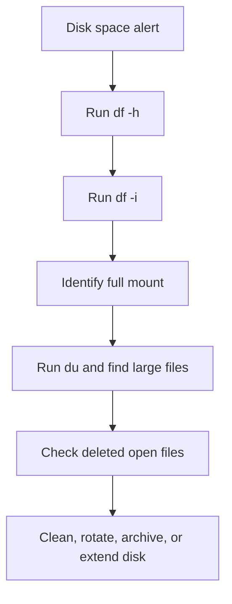
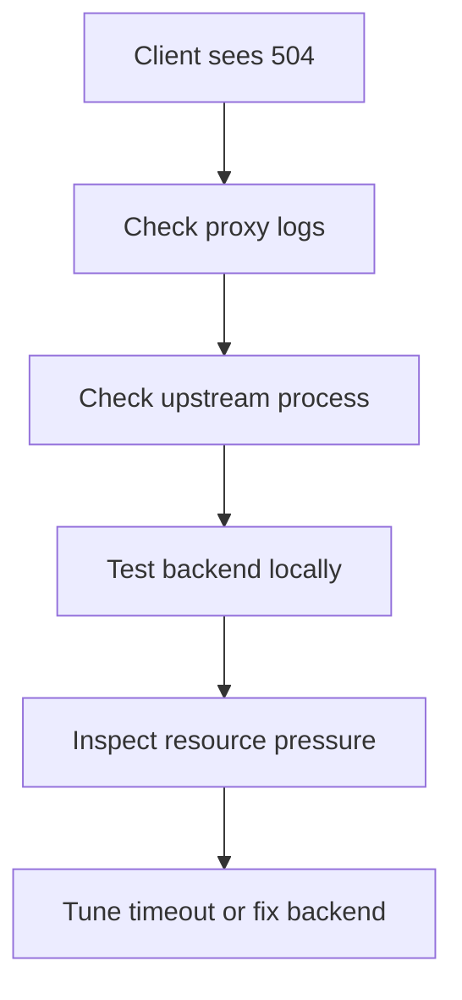

# Scenario-Based Linux Interview Questions

This guide collects production-style scenario questions, structured troubleshooting answers, and step-by-step incident solutions.

## Q151: A production server is running out of disk space. How would you troubleshoot it?
**Answer:** Start by determining whether the issue is total space, inode exhaustion, a single mount filling up, or deleted files still held open.

Step-by-step approach:
1. Check file system usage
2. Check inode usage
3. Identify the mount point filling up
4. Find large directories and files
5. Check for deleted-but-open files
6. Review logs, caches, backups, core dumps, and container data
7. Clean safely or extend storage

Example commands:
```bash
df -h
df -i
du -xhd1 /var | sort -h
find /var -xdev -type f -size +500M -ls | sort -k7 -n
lsof | grep deleted
journalctl --disk-usage
```

Decision flow:


---

## Q152: Users complain about slow SSH connections. How would you investigate?
**Answer:** Slow SSH can be caused by DNS lookups, reverse DNS, GSSAPI, overloaded server CPU, network latency, authentication delays, PAM modules, or home directory/NFS issues.

Step-by-step:
1. Reproduce with verbose client logging
2. Check connection vs authentication delay
3. Inspect server logs
4. Test DNS and reverse DNS
5. Review `sshd_config`
6. Check PAM, LDAP, NFS, and load

Example commands:
```bash
ssh -vvv user@server
journalctl -u sshd -n 100 --no-pager
getent hosts client-ip
sudo grep -E 'UseDNS|GSSAPIAuthentication' /etc/ssh/sshd_config
uptime
```

Potential mitigations:
- Disable `UseDNS` if reverse lookups are slow
- Disable unused GSSAPI auth
- Fix directory service latency
- Reduce login shell startup overhead

---

## Q153: A web application returns 504 Gateway Timeout. What Linux-side checks would you perform?
**Answer:** A 504 usually means the upstream application did not respond in time to a gateway or reverse proxy. The Linux-side investigation should cover reverse proxy, backend process health, network path, DNS, resource contention, and logs.

Step-by-step:
1. Confirm which component emitted 504
2. Check reverse proxy status and logs
3. Check upstream application status and listening port
4. Test backend locally from the proxy host
5. Review CPU, memory, disk, and connection saturation
6. Inspect timeouts and keepalive settings

Example commands:
```bash
systemctl status nginx
journalctl -u nginx -n 100
ss -tulnp | grep -E ':80 |:443 |:8080 '
curl -I http://127.0.0.1:8080/health
ps -eo pid,%cpu,%mem,cmd --sort=-%cpu | head
```



---

## Q154: A service fails after reboot but runs manually. What would you check?
**Answer:** If a service works manually but not at boot, investigate timing, environment, dependencies, permissions, file system availability, and working directory assumptions.

Step-by-step:
1. Review systemd unit file
2. Check dependencies like network or mounts
3. Compare environment variables under service vs shell
4. Confirm paths are absolute
5. Check ownership and execute permissions
6. Review logs from boot

Example commands:
```bash
systemctl cat myapp
systemctl status myapp
journalctl -u myapp -b
systemctl show myapp | grep -E 'Environment|ExecStart|After|Requires'
findmnt
```

---

## Q155: The server has high load average, but CPU usage looks low. Why?
**Answer:** High load with low CPU often points to processes waiting in uninterruptible sleep, typically due to disk or sometimes network I/O. It can also happen when many runnable tasks are queued even if short bursts keep average CPU moderate.

Step-by-step:
1. Compare load to CPU count
2. Inspect process states
3. Look for `D` state tasks
4. Check disk latency and storage errors
5. Review NFS or remote storage issues

Example commands:
```bash
uptime
lscpu | grep '^CPU(s):'
ps -eo pid,state,wchan,cmd | awk '$2=="D"'
iostat -xz 1 5
dmesg | tail -50
```

---

## Q156: Users cannot write to a shared directory. How do you troubleshoot?
**Answer:** Shared-directory issues often involve ownership, group membership, permissions, ACLs, sticky bit, mount options, or SELinux/AppArmor.

Step-by-step:
1. Inspect directory permissions and ownership
2. Confirm user group membership
3. Check ACLs if used
4. Verify mount is not read-only
5. Review SELinux/AppArmor context if applicable

Example commands:
```bash
ls -ld /shared
id alice
getfacl /shared || true
mount | grep ' /shared '
ls -Zd /shared || true
```

---

## Q157: A process is stuck and won’t terminate with SIGTERM. What next?
**Answer:** First understand **why** it is stuck before jumping to SIGKILL. Processes in uninterruptible sleep (`D`) often cannot respond until the kernel wait completes.

Step-by-step:
1. Check state and wait channel
2. Inspect open files or network activity
3. Determine whether it is blocked on storage or IPC
4. Use `strace` if attachable
5. Use `SIGKILL` only if safe and necessary

Example commands:
```bash
ps -o pid,state,wchan,cmd -p 1234
lsof -p 1234 | head
strace -p 1234
kill -TERM 1234
kill -9 1234
```

---

## Q158: A server is reachable by IP but not by hostname. What do you check?
**Answer:** This points strongly to a DNS or name service resolution problem.

Step-by-step:
1. Verify general connectivity using IP
2. Test DNS queries directly
3. Inspect `/etc/resolv.conf`
4. Check search domains and `/etc/nsswitch.conf`
5. Compare `/etc/hosts` and resolver output

Example commands:
```bash
ping -c 2 8.8.8.8
getent hosts example.com
dig example.com
cat /etc/resolv.conf
cat /etc/nsswitch.conf
```

---

## Q159: A mount point did not come up after reboot. What would you do?
**Answer:** Boot-time mount issues are commonly caused by wrong UUIDs, missing devices, incorrect file system type, bad mount options, or dependency timing.

Step-by-step:
1. Check `/etc/fstab`
2. Verify device/UUID exists
3. Test mount manually
4. Check boot logs
5. Consider `nofail` or proper dependency ordering if external storage is slow

Example commands:
```bash
cat /etc/fstab
blkid
findmnt --verify
sudo mount -a
journalctl -b | grep -i mount
```

---

## Q160: A Linux VM suddenly becomes unresponsive. How would you respond?
**Answer:** Treat this as an incident. Determine whether the issue is CPU lockup, memory exhaustion, disk I/O hang, kernel panic, or network isolation.

Step-by-step:
1. Check hypervisor/cloud console or serial console
2. See if SSH is down but console is alive
3. Look for OOM, kernel panic, or file system errors after recovery
4. Preserve evidence before reboot if possible
5. Review metrics and recent changes

Example commands after recovery:
```bash
journalctl -b -1 -p err
journalctl -k -b -1
last -x | head
dmesg | tail -100
```

---

## Q161: A deployment succeeded, but the application is inaccessible. What Linux checks help first?
**Answer:** Start from the outside and move inward.

Step-by-step:
1. Check service status
2. Check listening ports
3. Check local firewall rules
4. Test locally with curl
5. Check reverse proxy and backend mapping
6. Confirm routes/security groups/load balancer health if relevant

Example commands:
```bash
systemctl status myapp
ss -tulnp | grep myapp
curl -v http://127.0.0.1:8080/health
sudo firewall-cmd --list-all || true
journalctl -u myapp -n 100
```

---

## Q162: A cron job is not running. How do you troubleshoot it?
**Answer:** Cron failures often come from wrong user context, PATH issues, missing execute permission, shell assumptions, or environment differences.

Step-by-step:
1. Confirm cron service is running
2. Check crontab syntax and ownership
3. Use absolute paths
4. Redirect stdout/stderr to a log
5. Test the command manually under the same user

Example commands:
```bash
systemctl status cron || systemctl status crond
crontab -l
sudo grep CRON /var/log/syslog || journalctl -u cron
sudo -u appuser /bin/bash -lc '/usr/local/bin/job.sh'
```

---

## Q163: A script works interactively but fails from cron. Why?
**Answer:** Cron provides a minimal environment. PATH, SHELL, HOME, locale, working directory, and interactive assumptions often differ.

Typical causes:
- Relative paths
- Missing environment variables
- Commands not found due to PATH
- Interactive prompts or TTY dependencies
- Different umask or permissions

Example commands:
```bash
env | sort
sudo -u appuser env -i /bin/bash --noprofile --norc -c '/usr/local/bin/job.sh'
```

Recommended fixes:
- Use absolute paths
- Set PATH explicitly
- Export required variables
- Redirect logs
- Avoid interactive commands

---

## Q164: A server keeps running out of memory. How do you narrow it down?
**Answer:** Determine whether this is a leak, legitimate growth, cache pressure, burst traffic, or bad memory limits.

Step-by-step:
1. Check memory and swap trends
2. Identify biggest consumers
3. Review OOM logs
4. Look for growth over time
5. Check container or cgroup limits if applicable
6. Decide between fixing, tuning, or scaling

Example commands:
```bash
free -h
ps -eo pid,%mem,rss,etime,cmd --sort=-%mem | head
journalctl -k | grep -i oom
cat /sys/fs/cgroup/memory.max 2>/dev/null || true
```

---

## Q165: You see “No space left on device,” but `df -h` shows free space. Why?
**Answer:** This often means inode exhaustion, a full different mount point, reserved blocks behavior, or quota limitations.

Step-by-step:
1. Check inode usage
2. Verify exact mount point of affected path
3. Check quotas if enabled
4. Confirm application isn’t writing to a smaller overlay/tmpfs mount

Example commands:
```bash
df -h
df -i
findmnt /var/app/data
quota -vs || true
mount | grep overlay || true
```

---

## Q166: Logs were deleted, but disk space did not return. Why?
**Answer:** A process may still have the deleted file open, so the space is not released until the file descriptor is closed.

Step-by-step:
1. Search for deleted open files
2. Identify owning process
3. Restart or signal the process to reopen logs safely
4. Avoid deleting active logs directly when logrotate is expected

Example commands:
```bash
lsof | grep deleted
lsof -p 1234 | grep deleted
kill -HUP 1234
systemctl restart app
```

---

## Q167: An application cannot bind to port 80. What could be wrong?
**Answer:** Common causes:
- Another process already using the port
- Insufficient privileges or missing capability
- SELinux/AppArmor denial
- Incorrect listen address

Step-by-step:
1. Check port ownership
2. Review service logs
3. Inspect privileges/capabilities
4. Validate configuration

Example commands:
```bash
ss -tulnp | grep ':80 '
journalctl -u nginx -n 50
getcap /path/to/binary || true
ls -Z /path/to/binary || true
```

---

## Q168: A package update broke an application. How do you handle it?
**Answer:** Treat this as a change-related incident.

Step-by-step:
1. Identify exactly what changed
2. Check package history and logs
3. Validate config syntax and service compatibility
4. Roll back if supported or reinstall known-good version
5. Preserve evidence for root cause analysis

Example commands:
```bash
rpm -qa --last | head || grep ' install ' /var/log/dpkg.log | tail
journalctl -u myapp -n 100
nginx -t || true
apt-cache policy nginx || true
dnf history list || true
```

---

## Q169: A server can reach some sites but not others. What would you test?
**Answer:** The issue may involve DNS, MTU, firewall policy, proxy configuration, routing asymmetry, or destination-specific blocking.

Step-by-step:
1. Compare DNS resolution for working vs failing sites
2. Test TCP reachability to failing destinations
3. Review routes and proxy settings
4. Check MTU/fragmentation-sensitive paths
5. Capture packets if needed

Example commands:
```bash
dig working.example
dig failing.example
curl -Iv https://failing.example
ip route
ip link show
env | grep -i proxy
```

---

## Q170: A database on Linux shows intermittent stalls. What OS-level checks are useful?
**Answer:** Databases are sensitive to storage latency, memory pressure, swap, CPU steal time, noisy neighbors, THP, and file descriptor limits.

Step-by-step:
1. Check CPU, memory, and swap
2. Check storage latency and queue depth
3. Review kernel logs for I/O issues
4. Check THP and NUMA settings
5. Verify limits and connection counts

Example commands:
```bash
vmstat 1 5
iostat -xz 1 5
free -h
dmesg | tail -50
cat /sys/kernel/mm/transparent_hugepage/enabled
ulimit -n
```

---

## Q171: A file system is mounted read-only unexpectedly. What would you inspect?
**Answer:** File systems may remount read-only due to detected corruption, storage errors, or underlying device problems.

Step-by-step:
1. Confirm mount options
2. Review kernel logs
3. Check hardware/storage errors
4. Plan controlled maintenance and fsck if needed
5. Avoid careless remounting before understanding data integrity risk

Example commands:
```bash
mount | grep ' ro,'
dmesg | tail -100
journalctl -k -n 100
lsblk
```

---

## Q172: A Linux host is dropping incoming connections during peak traffic. What do you check?
**Answer:** This may be due to SYN backlog overflow, connection tracking limits, file descriptor exhaustion, reverse proxy saturation, or firewall/load balancer constraints.

Step-by-step:
1. Check socket summaries
2. Review listen backlog and queue overflow metrics
3. Inspect fd limits and process limits
4. Examine conntrack if NAT/firewall is involved
5. Validate application worker capacity

Example commands:
```bash
ss -s
sysctl net.core.somaxconn
sysctl net.ipv4.tcp_max_syn_backlog
ulimit -n
cat /proc/sys/net/netfilter/nf_conntrack_max 2>/dev/null || true
```

---

## Q173: SSH works, but sudo is very slow. What could cause it?
**Answer:** Slow sudo often points to DNS lookups, LDAP/SSSD delays, PAM module latency, or misconfigured hostname resolution.

Step-by-step:
1. Measure delay precisely
2. Inspect `/etc/nsswitch.conf`
3. Check SSSD/LDAP status
4. Verify hostname resolution in `/etc/hosts`
5. Review PAM config and logs

Example commands:
```bash
time sudo -l
cat /etc/nsswitch.conf
systemctl status sssd || true
hostname
getent hosts $(hostname)
```

---

## Q174: You suspect a compromised Linux server. What initial actions do you take?
**Answer:** Prioritize containment, evidence preservation, and business impact assessment. Avoid blindly wiping evidence before understanding what happened.

Step-by-step:
1. Follow incident response process
2. Isolate host if needed
3. Preserve logs and volatile evidence if policy allows
4. Check suspicious logins, processes, network connections, and persistence
5. Rotate credentials and review scope
6. Rebuild from trusted images if compromise is confirmed

Example commands:
```bash
last -a | head
who
w
ps -ef
ss -tupan
find /etc/systemd /etc/cron* -type f | head
journalctl --since "24 hours ago"
```

---

## Q175: Kernel upgrade completed, but the host did not boot properly. What recovery path would you try?
**Answer:** Use a structured rollback path.

Step-by-step:
1. Select previous kernel from GRUB
2. Use rescue mode if needed
3. Review boot logs
4. Rebuild initramfs and GRUB config
5. Verify third-party kernel modules if used
6. Roll back package if necessary

Example commands:
```bash
journalctl -b -1
uname -r
ls /boot
lsmod | head
```

---

## Q176: A containerized app works locally but not on the host network path. What do you inspect?
**Answer:** Check published ports, bridge networking, firewall/NAT rules, bind addresses, reverse proxy upstream configuration, and service readiness.

Step-by-step:
1. Confirm container is running and healthy
2. Verify published ports
3. Test from host to container-exposed port
4. Inspect bridge networks and iptables/nft rules
5. Review logs and health checks

Example commands:
```bash
docker ps || true
docker port container_id || true
ss -tulnp | grep -E ':80 |:8080 '
curl -v http://127.0.0.1:8080/health
sudo nft list ruleset || true
```

---

## Q177: A Kubernetes node reports disk pressure. What Linux-level checks help?
**Answer:** Disk pressure on a node may come from container images, writable layers, logs, emptyDir volumes, kubelet data, or OS logs.

Step-by-step:
1. Check usage of root and container storage mounts
2. Inspect `/var/lib/containerd`, `/var/lib/docker`, `/var/log`, `/var/lib/kubelet`
3. Find large images, logs, and orphaned layers
4. Review inode exhaustion

Example commands:
```bash
df -h
df -i
du -xhd1 /var/lib | sort -h
du -xhd1 /var/log | sort -h
journalctl --disk-usage
```

---

## Q178: Time drift is causing application issues. How do you troubleshoot?
**Answer:** Time sync problems can break TLS, Kerberos, distributed systems, logs, and scheduled tasks.

Step-by-step:
1. Check current time and timezone
2. Verify NTP/chrony/systemd-timesyncd status
3. Confirm upstream time sources are reachable
4. Review drift and sync state

Example commands:
```bash
date
timedatectl
chronyc sources -v || true
chronyc tracking || true
systemctl status chronyd || systemctl status systemd-timesyncd
```

---

## Q179: An app randomly fails with “Too many open files.” What is your plan?
**Answer:** This usually indicates descriptor leaks, insufficient limits, or sudden traffic bursts beyond current sizing.

Step-by-step:
1. Confirm current soft and hard limits
2. Inspect process descriptor count over time
3. Identify dominant descriptor type
4. Raise limits appropriately if justified
5. Fix the application leak or connection management issue

Example commands:
```bash
ulimit -Sn
ulimit -Hn
lsof -p 1234 | wc -l
ls -l /proc/1234/fd | wc -l
cat /proc/1234/limits
```

---

## Q180: A reverse proxy returns 502 after a backend restart. What do you verify?
**Answer:** A 502 often indicates the proxy cannot establish or maintain a proper connection to the upstream.

Step-by-step:
1. Confirm backend is actually listening
2. Check socket path or TCP endpoint
3. Validate proxy upstream configuration
4. Check permissions if using Unix sockets
5. Review backend start timing and readiness

Example commands:
```bash
systemctl status backend
ss -tulnp | grep 8080
ls -l /run/backend.sock || true
journalctl -u nginx -n 100
curl -v http://127.0.0.1:8080/health
```

---

## 🎯 Scenario-Based Interview Questions

These scenarios are written the way strong production interview answers should sound: assess impact, gather evidence, make the safest fix first, verify recovery, then prevent recurrence.

### Scenario 1: Production Server Disk Full
**Situation:** You receive an alert that a production web server's root partition is at 98%. The application is starting to fail with write errors and users report intermittent 500 responses.

**Step-by-step solution:**
1. Confirm whether the issue is blocks, inodes, or a mounted filesystem problem:
```bash
df -h
df -i
findmnt /
```
**Why this matters:** `df -h` shows space usage, `df -i` catches inode exhaustion, and `findmnt` confirms which device backs the root filesystem.

2. Find which top-level paths are consuming space:
```bash
du -xhd1 / 2>/dev/null | sort -rh | head -20
du -xhd1 /var 2>/dev/null | sort -rh | head -20
```
**Why this matters:** Most production growth happens under `/var`, `/tmp`, application data directories, or container storage.

3. Check for deleted files still held open by running processes:
```bash
lsof +L1
```
**Why this matters:** Log rotation or manual deletion does not reclaim space until the owning process closes the file descriptor.

4. Inspect log growth and journal usage:
```bash
find /var/log -type f -size +100M -exec ls -lh {} \;
journalctl --disk-usage
journalctl --vacuum-size=500M
```
**Why this matters:** Huge logs and oversized systemd journals are common and often safe to reduce quickly.

5. Clean package caches and stale temporary files:
```bash
apt clean && apt autoremove -y
# or
dnf clean all
find /tmp -xdev -type f -mtime +2 -ls | head
```
**Why this matters:** Package caches and temp files can free space fast with relatively low risk.

6. Check container and image usage if Docker is present:
```bash
docker system df
docker ps -a
docker image prune -a
```
**Why this matters:** Old images, stopped containers, and large overlay layers often fill `/var/lib/docker`.

7. If root is on LVM and cleanup is not enough, extend safely:
```bash
lsblk
pvs
vgs
lvs
lvextend -r -L +20G /dev/vg0/root
```
**Why this matters:** Extending is safer than deleting blindly when usage is legitimate and sustained.

8. Verify application recovery:
```bash
df -h /
systemctl status nginx
curl -f http://127.0.0.1/health
```
**Why this matters:** The incident is not over until service health is confirmed.

**Root cause explanation:** Disk-full incidents are usually caused by runaway logs, unbounded temp files, container layers, backup dumps left on local disk, or deleted-but-open files.

**Common mistakes to avoid:**
- Deleting files before identifying what owns them
- Clearing active database or application data instead of caches/logs
- Ignoring inode exhaustion when `df -h` looks acceptable
- Forgetting to verify application recovery after cleanup

**Prevention and monitoring recommendations:**
- Alert on both disk blocks and inode usage
- Enforce log rotation and journal size limits
- Set retention policies for backups, dumps, and container images
- Trend filesystem growth so capacity expansion happens before emergencies

---

### Scenario 2: SSH Connection Refused
**Situation:** You cannot SSH into a Linux server. `ssh user@server` returns `Connection refused`, but the host responds to ping.

**Step-by-step solution:**
1. Confirm the TCP port really is refusing connections:
```bash
nc -vz server.example.com 22
ssh -vvv user@server.example.com
```
**Why this matters:** `Connection refused` means the network path likely works, but nothing is listening on the destination port or a local firewall is rejecting it.

2. Use console, KVM, cloud serial console, or another access path to inspect the host:
```bash
systemctl status sshd || systemctl status ssh
ss -tlnp | grep ':22 '
```
**Why this matters:** The SSH daemon may have crashed, failed to start after config changes, or be listening on a different port.

3. Validate SSH configuration syntax:
```bash
sshd -t
systemctl cat sshd || systemctl cat ssh
```
**Why this matters:** A bad `sshd_config` often prevents daemon startup after reload or restart.

4. Review recent logs for bind or authentication subsystem failures:
```bash
journalctl -u sshd -n 100 --no-pager || journalctl -u ssh -n 100 --no-pager
journalctl -xe --no-pager | tail -50
```
**Why this matters:** Logs reveal port binding failures, missing host keys, syntax errors, or SELinux denials.

5. Check whether the service changed ports or is bound to the wrong interface:
```bash
grep -Ei '^(Port|ListenAddress)' /etc/ssh/sshd_config
ip addr
ss -tlnp | grep sshd
```
**Why this matters:** A config change may have moved SSH to a nonstandard port or limited it to localhost.

6. Verify local firewall and cloud security group rules:
```bash
firewall-cmd --list-all || true
nft list ruleset || true
iptables -L -n -v || true
```
**Why this matters:** The daemon can be healthy while host firewall policy blocks port 22.

7. Fix the issue and restart safely:
```bash
systemctl restart sshd
systemctl enable sshd
ss -tlnp | grep ':22 '
```
**Why this matters:** Restart only after config validation so you do not worsen the outage.

8. Re-test from a client:
```bash
ssh -p 22 user@server.example.com
```
**Why this matters:** Final validation must happen from the original failure path.

**Root cause explanation:** The most common causes are stopped `sshd`, invalid config, changed port, host firewall rules, or an automated hardening change.

**Common mistakes to avoid:**
- Restarting `sshd` without testing config first
- Assuming ping means SSH must work
- Forgetting cloud firewalls or security groups
- Locking yourself out by editing config over the only SSH session

**Prevention and monitoring recommendations:**
- Monitor `sshd` unit state and port 22 reachability
- Use `sshd -t` in CI/CD before deploying config changes
- Keep out-of-band access available for production servers
- Manage SSH config through version control and rollbackable automation

---

### Scenario 3: High Load Average but Low CPU Usage
**Situation:** A server shows a load average above 50, but CPU utilization is only 10%. Users say the application is hanging.

**Step-by-step solution:**
1. Confirm the mismatch between load and CPU:
```bash
uptime
top -b -n 1 | head -20
mpstat -P ALL 1 3
```
**Why this matters:** Load average includes runnable and uninterruptible tasks, not just active CPU usage.

2. Look for blocked tasks and I/O wait:
```bash
vmstat 1 5
iostat -xz 1 5
pidstat -d 1 5
```
**Why this matters:** High `wa` or high device utilization points to processes waiting on storage, not CPU saturation.

3. Identify processes causing heavy reads or writes:
```bash
iotop -oPa
lsof | head
ps -eo state,pid,ppid,cmd | awk '$1 ~ /D/ {print}' | head -20
```
**Why this matters:** Processes in `D` state are often blocked on disk, NFS, or kernel I/O paths.

4. Check underlying storage and kernel messages:
```bash
lsblk -o NAME,SIZE,FSTYPE,MOUNTPOINT
smartctl -a /dev/sda || true
dmesg | tail -50
journalctl -k -n 100 --no-pager
```
**Why this matters:** Failing disks, storage timeouts, multipath issues, or filesystem errors can create huge load with low CPU use.

5. If the workload uses NFS or remote storage, verify mount health:
```bash
mount | grep nfs
nfsstat -m || true
showmount -e nfs-server.example.com || true
```
**Why this matters:** Hung remote mounts can block many processes simultaneously.

6. Check application behavior:
```bash
mysqladmin processlist || true
ps -eo pid,cmd,%mem,%cpu --sort=-%cpu | head
strace -p <pid>
```
**Why this matters:** Expensive queries, lock contention, or synchronous writes can drive I/O-bound stalls.

7. Mitigate based on evidence:
```bash
ionice -c3 -p <pid>
systemctl restart app
umount -fl /stuck/mount
```
**Why this matters:** The fix depends on whether the cause is runaway jobs, bad storage, or a hung remote dependency.

**Root cause explanation:** High load with low CPU usually means the kernel has many tasks waiting on disk or network-backed storage; the classic answer is I/O wait.

**Common mistakes to avoid:**
- Treating load average as equivalent to CPU utilization
- Restarting applications without checking storage first
- Ignoring `D` state tasks and kernel logs
- Missing remote storage dependencies such as NFS

**Prevention and monitoring recommendations:**
- Monitor `%iowait`, disk latency, queue depth, and filesystem latency
- Alert on blocked task count and NFS timeout errors
- Separate batch I/O from latency-sensitive workloads
- Trend database slow queries and disk growth together

---

### Scenario 4: Web Application Returning 502 Bad Gateway
**Situation:** Nginx is returning `502 Bad Gateway` to all users. The site was healthy an hour ago.

**Step-by-step solution:**
1. Confirm the user-visible symptom and scope:
```bash
curl -I https://app.example.com
curl -vk https://app.example.com/health
```
**Why this matters:** You need to distinguish a backend issue from TLS, DNS, or load balancer problems.

2. Check Nginx status and configuration:
```bash
systemctl status nginx
nginx -t
journalctl -u nginx -n 100 --no-pager
```
**Why this matters:** A broken Nginx config or failed reload can surface as gateway errors.

3. Inspect the Nginx error log:
```bash
tail -100 /var/log/nginx/error.log
```
**Why this matters:** The error log usually shows whether the upstream is refusing connections, timing out, or closing early.

4. Test the upstream locally from the Nginx host:
```bash
ss -tlnp | grep -E '8080|9000|3000'
curl -v http://127.0.0.1:8080/health
```
**Why this matters:** If the upstream app is down or not listening, Nginx can only return 502.

5. Check the application service directly:
```bash
systemctl status myapp
journalctl -u myapp -n 100 --no-pager
systemctl show myapp | grep -E 'ExecStart|EnvironmentFile|WorkingDirectory'
```
**Why this matters:** The backend may have crashed after deployment, lost database connectivity, or failed to bind its port.

6. Validate socket permissions if using Unix sockets:
```bash
ls -l /run/myapp.sock
namei -l /run/myapp.sock
```
**Why this matters:** Nginx often fails with 502 when it cannot access the upstream socket due to ownership or SELinux context.

7. Fix, reload, and verify:
```bash
systemctl restart myapp
systemctl reload nginx
curl -f http://127.0.0.1:8080/health
curl -I https://app.example.com
```
**Why this matters:** Recovery must include both upstream health and end-user validation.

**Root cause explanation:** 502 usually means the reverse proxy could not get a valid response from the backend because the app is down, misconfigured, overloaded, or inaccessible.

**Common mistakes to avoid:**
- Restarting Nginx when the real problem is the upstream
- Ignoring socket file permissions and SELinux context
- Testing only from outside, not locally on the host
- Forgetting recent deploys, environment changes, or expired credentials

**Prevention and monitoring recommendations:**
- Alert on upstream health checks, not just HTTP 502 count
- Use systemd restart policies and readiness checks
- Track deploy events next to error rates and app restarts
- Log upstream response codes and latency in Nginx

---

### Scenario 5: Server Rebooted Unexpectedly
**Situation:** Monday morning you find that a production server rebooted over the weekend. No one admits to doing it. You need to investigate.

**Step-by-step solution:**
1. Confirm when the reboot happened:
```bash
last reboot | head -5
who -b
uptime -s
```
**Why this matters:** Establishing the exact time window lets you correlate logs, monitoring alerts, and change records.

2. Review previous boot logs:
```bash
journalctl -b -1 -n 200 --no-pager
journalctl -b -1 -p err --no-pager
```
**Why this matters:** The prior boot journal often contains panic traces, shutdown reasons, OOM events, or hardware errors.

3. Check system logs around the event:
```bash
journalctl --since '2025-01-11 00:00' --until '2025-01-12 08:00' --no-pager
cat /var/log/messages | tail -100 || true
cat /var/log/syslog | tail -100 || true
```
**Why this matters:** You want to identify whether the reboot was graceful, forced, or crash-driven.

4. Look for panic, watchdog, OOM, or power-loss indicators:
```bash
journalctl -k -b -1 --no-pager | egrep -i 'panic|watchdog|oom|segfault|mce|I/O error'
dmesg -T | tail -100
```
**Why this matters:** Kernel messages often reveal what happened immediately before the restart.

5. Check whether a user or automation issued a reboot:
```bash
last -x | head -20
ausearch -m USER_CMD -ts recent || true
grep -Ri reboot /var/log/cron* /var/log/messages* 2>/dev/null | tail -20
```
**Why this matters:** Patch automation, configuration management, or a human operator may have triggered it intentionally.

6. Inspect crash dump configuration if kdump is enabled:
```bash
systemctl status kdump || true
ls -lh /var/crash 2>/dev/null
```
**Why this matters:** A vmcore allows deeper analysis of kernel panics and severe crashes.

7. Correlate with external systems:
```bash
ipmitool sel list || true
```
**Why this matters:** Hardware power events, thermal events, and remote console actions may not be obvious from OS logs.

**Root cause explanation:** Unexpected reboots usually come from kernel panic, power loss, watchdog reset, automated patching, human action, or infrastructure failures.

**Common mistakes to avoid:**
- Looking only at the current boot logs
- Assuming a reboot was malicious or accidental without evidence
- Ignoring cloud or hardware management logs
- Forgetting scheduled patch windows and config-management jobs

**Prevention and monitoring recommendations:**
- Enable `kdump` for production where appropriate
- Alert on reboot events and correlate them with change management
- Record shutdown and reboot reasons in automation pipelines
- Use UPS, hardware monitoring, and IPMI/cloud event collection

---

### Scenario 6: Cannot Resolve DNS
**Situation:** A server can ping `8.8.8.8`, but cannot resolve hostnames like `google.com` or internal service names.

**Step-by-step solution:**
1. Confirm the failure is DNS-specific:
```bash
ping -c 2 8.8.8.8
ping -c 2 google.com || true
curl -I http://1.1.1.1 || true
```
**Why this matters:** Successful IP connectivity but failed name resolution narrows the issue to the resolver path.

2. Inspect resolver configuration:
```bash
cat /etc/resolv.conf
resolvectl status || systemd-resolve --status || true
```
**Why this matters:** Bad nameserver entries, search domains, or stub resolver issues are common.

3. Query the configured resolver directly:
```bash
dig google.com
nslookup google.com
```
**Why this matters:** Direct DNS tools show timeouts, SERVFAIL, NXDOMAIN, and which nameserver responded.

4. Test reachability to the DNS server:
```bash
ip route
ping -c 2 <dns-server-ip>
ss -lunp | grep ':53 '
```
**Why this matters:** The configured resolver may itself be unreachable or blocked.

5. Check local firewall and SELinux if a local caching resolver is used:
```bash
firewall-cmd --list-all || true
nft list ruleset || true
getenforce || true
```
**Why this matters:** UDP or TCP port 53 can be blocked locally, especially after hardening changes.

6. Validate name service switch order:
```bash
grep '^hosts:' /etc/nsswitch.conf
```
**Why this matters:** Incorrect NSS order can cause delays or unexpected lookups.

7. Restart resolver services if needed:
```bash
systemctl restart systemd-resolved || true
systemctl restart NetworkManager || true
```
**Why this matters:** Corrupt resolver state or DHCP-supplied bad config may be fixed by renewing network configuration.

8. Re-test external and internal names:
```bash
dig internal-api.example.com
curl -I https://internal-api.example.com || true
```
**Why this matters:** You must confirm both internet and private DNS behavior.

**Root cause explanation:** Usually the problem is bad `/etc/resolv.conf`, an unreachable nameserver, firewalling on port 53, expired VPN/DNS path, or a broken local resolver service.

**Common mistakes to avoid:**
- Editing `/etc/resolv.conf` directly when NetworkManager or systemd-resolved overwrites it
- Testing only public DNS when internal zones are failing
- Assuming DNS is fine because ping to IP works
- Ignoring NSS order and search domain behavior

**Prevention and monitoring recommendations:**
- Monitor DNS query success and latency from hosts
- Use redundant resolvers and validate DHCP-supplied settings
- Manage resolver configuration declaratively
- Alert on resolver service failures and unusual DNS timeout rates

---

### Scenario 7: Cron Job Not Executing
**Situation:** A critical backup cron job has not run for three days, and no one noticed until the backup report was missing.

**Step-by-step solution:**
1. Check whether the cron daemon is running:
```bash
systemctl status cron || systemctl status crond
```
**Why this matters:** If the scheduler itself is down, none of the jobs will run.

2. Inspect the crontab definition:
```bash
crontab -l
cat /etc/crontab
ls -l /etc/cron.d /etc/cron.daily
```
**Why this matters:** The schedule, user field, or file permissions may be wrong.

3. Review cron logs:
```bash
journalctl -u cron -n 100 --no-pager || journalctl -u crond -n 100 --no-pager
grep CRON /var/log/syslog | tail -50 || grep CROND /var/log/cron | tail -50
```
**Why this matters:** Logs reveal whether cron triggered the job and whether the command exited quickly or failed.

4. Run the command manually with a minimal environment:
```bash
env -i /bin/bash -lc '/usr/local/bin/backup.sh'
```
**Why this matters:** Cron runs with a stripped-down environment, so scripts that depend on `PATH`, shell profiles, or relative paths often fail.

5. Check script permissions, shebang, and output redirection:
```bash
ls -l /usr/local/bin/backup.sh
head -5 /usr/local/bin/backup.sh
```
**Why this matters:** Missing execute bits, wrong interpreter paths, or syntax errors are common causes.

6. Verify mail, lock file, and destination storage behavior:
```bash
ls -l /var/spool/mail || true
find /var/lock -type f | grep backup || true
mount | grep backup
```
**Why this matters:** Jobs may skip because of stale lock files or missing backup destinations.

7. Fix and test with logging:
```bash
bash -x /usr/local/bin/backup.sh
```
**Why this matters:** Verbose execution shows the exact failure point.

**Root cause explanation:** Cron failures are usually caused by daemon outages, bad environment assumptions, changed paths, stale lock files, missing mounts, or silent script errors.

**Common mistakes to avoid:**
- Assuming cron runs with your interactive shell environment
- Using relative paths inside jobs
- Ignoring output redirection and missing logging
- Forgetting that `/etc/cron.d/*` requires a user field

**Prevention and monitoring recommendations:**
- Log every scheduled job explicitly
- Alert if expected backup artifacts are missing
- Prefer systemd timers for better observability where possible
- Use `shellcheck` and explicit environment variables in scripts

---

### Scenario 8: Docker Container Keeps Restarting
**Situation:** A Docker container is in a restart loop. `docker ps` shows it restarting every 30 seconds and the service is unavailable.

**Step-by-step solution:**
1. Confirm restart behavior and exit code:
```bash
docker ps -a
docker inspect --format '{{.Name}} {{.State.Status}} {{.State.ExitCode}} {{.RestartCount}}' myapp
```
**Why this matters:** Exit code and restart count tell you whether the process is crashing or being killed.

2. Read the container logs:
```bash
docker logs --tail 100 myapp
```
**Why this matters:** Most crash loops are obvious once you look at stderr/stdout.

3. Check the image entrypoint and command:
```bash
docker inspect --format '{{json .Config.Entrypoint}} {{json .Config.Cmd}}' myapp
```
**Why this matters:** Incorrect startup commands, missing binaries, or bad arguments often break instantly.

4. Inspect environment variables, mounts, and dependencies:
```bash
docker inspect myapp | egrep 'Env|Mounts|IPAddress|RestartPolicy' -A5 -B2
```
**Why this matters:** Containers commonly fail because required env vars, secrets, or bind mounts are missing.

5. Check host resource pressure:
```bash
free -h
df -h
dmesg | grep -i 'killed process'
```
**Why this matters:** The container may be OOM-killed or failing because the host filesystem is full.

6. Run the image interactively if needed:
```bash
docker run --rm -it --entrypoint /bin/sh myapp-image
```
**Why this matters:** An interactive shell helps validate config, files, and startup scripts.

7. Fix and redeploy:
```bash
docker stop myapp
docker rm myapp
docker run -d --name myapp --restart unless-stopped -p 8080:8080 myapp-image
```
**Why this matters:** Recreating the container from known-good inputs is often cleaner than patching a broken runtime state.

**Root cause explanation:** Common causes include bad app config, missing secrets, failed DB connections, wrong entrypoint, host OOM, or image regressions.

**Common mistakes to avoid:**
- Looking only at `docker ps` without reading logs
- Ignoring exit codes and OOM evidence
- Assuming the image is bad when the env or mounts are wrong
- Changing multiple variables at once during recovery

**Prevention and monitoring recommendations:**
- Export container restart counts to monitoring
- Add health checks and structured startup logs
- Validate environment variables in entrypoint scripts
- Keep deployment rollback fast and repeatable

---

### Scenario 9: MySQL Replication Lag
**Situation:** A MySQL replica is showing `Seconds_Behind_Master = 3600` and the lag is still growing. Read traffic is hitting stale data.

**Step-by-step solution:**
1. Confirm replication status and thread state:
```bash
mysql -e 'SHOW SLAVE STATUS\G'
# or for newer versions
mysql -e 'SHOW REPLICA STATUS\G'
```
**Why this matters:** You need to see whether lag is from IO thread, SQL thread, network fetch, or a stopped replica thread.

2. Identify the blocking statement or long-running apply step:
```bash
mysql -e 'SHOW PROCESSLIST;'
mysql -e 'SHOW ENGINE INNODB STATUS\G' | head -100
```
**Why this matters:** Large transactions, locks, DDL, and row-apply bottlenecks are common causes of replication delay.

3. Check host resource pressure on the replica:
```bash
iostat -xz 1 5
vmstat 1 5
free -h
```
**Why this matters:** Replication lag often grows because the replica cannot write or flush fast enough.

4. Verify network health between primary and replica:
```bash
ping -c 4 primary-db.example.com
ss -tnp | grep 3306
```
**Why this matters:** Packet loss or unstable links can stall the replication IO thread.

5. Check for replication errors or stopped threads:
```bash
mysql -e 'SHOW VARIABLES LIKE "read_only";'
mysql -e 'SHOW SLAVE STATUS\G' | egrep 'Last_SQL_Error|Last_IO_Error|Slave_SQL_Running|Slave_IO_Running|Replica_SQL_Running|Replica_IO_Running'
```
**Why this matters:** Lag may really be a broken replica with a stopped SQL thread.

6. If a huge transaction is applying, decide on mitigation:
```bash
mysql -e 'SHOW PROCESSLIST;'
pt-heartbeat --check || true
```
**Why this matters:** Sometimes the safest option is to redirect reads away from the lagging replica, not to force risky fixes mid-incident.

7. Verify recovery:
```bash
mysql -e 'SHOW SLAVE STATUS\G' | egrep 'Seconds_Behind_Master|Slave_SQL_Running|Slave_IO_Running'
```
**Why this matters:** The incident is resolved only when lag trends back toward zero.

**Root cause explanation:** Replica lag typically comes from slow disk, long transactions, blocking DDL, lock waits, replica under-sizing, or network instability.

**Common mistakes to avoid:**
- Treating `Seconds_Behind_Master` as perfect truth during thread issues
- Restarting replication blindly without reading error fields
- Running heavy analytics on the lagging replica during recovery
- Skipping application-level mitigation like draining reads from the stale node

**Prevention and monitoring recommendations:**
- Monitor replica lag, relay log growth, and replication thread state
- Keep replicas sized for worst-case write bursts
- Avoid huge transactions and uncontrolled DDL in production
- Use heartbeats and reader routing that understands replica freshness

---

### Scenario 10: Memory Usage at 95% but No OOM
**Situation:** `free -h` shows 95% memory used, but the system is responsive and there are no OOM kills. Is there a problem?

**Step-by-step solution:**
1. Inspect memory using the `available` field, not just `used`:
```bash
free -h
cat /proc/meminfo | egrep 'MemTotal|MemFree|MemAvailable|Buffers|Cached|SReclaimable|SwapTotal|SwapFree'
```
**Why this matters:** Linux intentionally uses free memory for page cache and reclaimable slabs.

2. Check swap activity and reclaim pressure:
```bash
vmstat 1 5
sar -W 1 5 || true
```
**Why this matters:** Healthy cache usage is normal, but sustained swap-in/swap-out can indicate real pressure.

3. Identify top memory consumers:
```bash
ps -eo pid,%mem,rss,vsz,cmd --sort=-%mem | head -20
smem -rk || true
```
**Why this matters:** You still need to know whether one process is growing abnormally.

4. Check for OOM history and kernel pressure signals:
```bash
dmesg | egrep -i 'oom|out of memory'
journalctl -k -n 100 --no-pager
```
**Why this matters:** A responsive system can still have recent pressure events worth addressing.

5. Distinguish anonymous memory from cache:
```bash
slabtop -o | head -20
```
**Why this matters:** Large slab or cache usage may be reclaimable, while leaked anonymous memory is not.

6. Reassure with evidence and keep watching trends:
```bash
watch -n 2 free -h
```
**Why this matters:** In interviews, the key insight is that high used memory alone is not automatically a problem.

**Root cause explanation:** Linux uses otherwise idle RAM for filesystem cache to improve performance. The `available` metric is the better quick health indicator than `free`.

**Common mistakes to avoid:**
- Panicking because `free` memory is low
- Dropping caches in production without evidence
- Ignoring swap thrash or rising major page faults
- Looking only at one point-in-time output

**Prevention and monitoring recommendations:**
- Alert on `MemAvailable`, swap activity, and OOM events
- Trend top memory consumers over time
- Right-size JVMs and database buffers explicitly
- Use memory cgroups or limits for noisy workloads

---

### Scenario 11: Permission Denied Despite Correct Permissions
**Situation:** A user has `755` permissions on a script but still gets `Permission denied` when trying to execute it.

**Step-by-step solution:**
1. Confirm file permissions and ownership:
```bash
ls -l /opt/scripts/run.sh
id appuser
```
**Why this matters:** Start with the basics before looking at more subtle access controls.

2. Check parent directory permissions:
```bash
namei -l /opt/scripts/run.sh
```
**Why this matters:** Execute permission is required on every directory in the path.

3. Check filesystem mount options:
```bash
mount | grep '/opt'
findmnt /opt
```
**Why this matters:** A filesystem mounted with `noexec` blocks execution even if the file mode is `755`.

4. Check SELinux or AppArmor context:
```bash
getenforce || true
ls -Z /opt/scripts/run.sh || true
ausearch -m avc -ts recent || true
```
**Why this matters:** MAC policy can deny execution despite normal Unix mode bits.

5. Check ACLs and immutable attributes:
```bash
getfacl /opt/scripts/run.sh
lsattr /opt/scripts/run.sh
```
**Why this matters:** ACLs and filesystem attributes can override or complicate standard permission assumptions.

6. Verify the interpreter and line endings:
```bash
head -1 /opt/scripts/run.sh
file /opt/scripts/run.sh
```
**Why this matters:** A missing interpreter, bad shebang, or Windows CRLF line endings can surface as execution errors.

7. Test execution explicitly:
```bash
bash /opt/scripts/run.sh
```
**Why this matters:** If `bash script.sh` works but `./script.sh` fails, the issue is execution context, not script logic.

**Root cause explanation:** The classic hidden causes are `noexec` mounts, SELinux denials, missing execute permission on parent directories, ACL restrictions, or a bad interpreter path.

**Common mistakes to avoid:**
- Looking only at `ls -l` output
- Forgetting the directory path permissions
- Disabling SELinux instead of fixing context or policy
- Ignoring shebang and line-ending problems

**Prevention and monitoring recommendations:**
- Standardize deployment paths and mount options
- Use configuration management for permissions and SELinux contexts
- Validate scripts with `file`, `shellcheck`, and CI checks
- Document when `noexec` is intentionally used for security

---

### Scenario 12: Network Interface Has IP but No Connectivity
**Situation:** A server NIC shows the correct IP address, but it cannot reach the gateway or any remote hosts.

**Step-by-step solution:**
1. Confirm interface state and addressing:
```bash
ip addr show eth0
ip link show eth0
```
**Why this matters:** The interface may have an IP but still be administratively down or report carrier issues.

2. Check routing:
```bash
ip route
ip route get 8.8.8.8
```
**Why this matters:** Missing default route or wrong source routing is a common cause of apparent isolation.

3. Test the local gateway and ARP/neighbor resolution:
```bash
ping -c 3 <gateway-ip>
ip neigh show
arp -n
```
**Why this matters:** If ARP fails, the problem is usually layer 2, VLAN, cable, or switch-related.

4. Check interface counters and errors:
```bash
ip -s link show eth0
ethtool eth0 || true
```
**Why this matters:** RX/TX errors, dropped packets, or autonegotiation mismatch can break connectivity.

5. Inspect firewall policy:
```bash
nft list ruleset || true
iptables -L -n -v || true
```
**Why this matters:** Host firewall rules may block traffic even though the interface is configured correctly.

6. Capture packets during a test:
```bash
tcpdump -ni eth0 icmp or arp
```
**Why this matters:** Packet capture shows whether traffic leaves the host and whether replies return.

7. Check VLAN, bonding, or cloud metadata if applicable:
```bash
nmcli connection show || true
cat /etc/network/interfaces 2>/dev/null || true
```
**Why this matters:** Misapplied VLAN tags or bad network profiles often survive reboot and break only one host.

**Root cause explanation:** The issue is usually missing routes, gateway/ARP failure, VLAN mismatch, interface errors, or host firewall policy.

**Common mistakes to avoid:**
- Stopping at `ip addr` and assuming networking is fine
- Testing only external IPs and not the gateway
- Ignoring ARP/neigh state and interface error counters
- Flushing firewall rules recklessly on production hosts

**Prevention and monitoring recommendations:**
- Monitor default route presence, interface errors, and link flaps
- Manage network config declaratively
- Alert on gateway reachability and packet drops
- Keep console access available for remote hosts

---

### Scenario 13: Kernel Panic After Package Update
**Situation:** After a routine package update and reboot, the system drops into a panic or fails to boot normally.

**Step-by-step solution:**
1. Boot a known-good kernel from GRUB:
```bash
uname -r
ls /boot
```
**Why this matters:** Restoring service with the previous kernel is often the fastest safe recovery path.

2. Use rescue mode or live media to inspect the system:
```bash
cat /etc/fstab
blkid
lsblk -f
```
**Why this matters:** Bad initramfs, wrong root UUID, or broken mount definitions can all look like kernel issues.

3. Inspect previous boot errors:
```bash
journalctl -b -1 -p err --no-pager
journalctl -k -b -1 --no-pager | tail -100
```
**Why this matters:** The logs usually identify missing drivers, module failures, or filesystem problems.

4. Rebuild initramfs and grub config if needed:
```bash
dracut -f || update-initramfs -u
grub2-mkconfig -o /boot/grub2/grub.cfg || update-grub
```
**Why this matters:** A mismatched initramfs or broken boot config is a common post-update failure mode.

5. Check third-party kernel modules:
```bash
lsmod | head
rpm -qa | grep -Ei 'kernel|dkms' || dpkg -l | grep -Ei 'linux-image|dkms'
```
**Why this matters:** Out-of-tree drivers can break after kernel updates.

6. Review crash dump information if present:
```bash
ls -lh /var/crash 2>/dev/null
systemctl status kdump || true
```
**Why this matters:** Dump analysis helps determine whether the new kernel itself is unstable or the failure is environment-specific.

7. Hold the bad kernel package until fixed:
```bash
apt-mark hold linux-image-generic || true
dnf versionlock add kernel* || true
```
**Why this matters:** Preventing repeated rollout avoids additional outages.

**Root cause explanation:** Kernel update failures often come from broken initramfs, driver incompatibility, bad `fstab`, bootloader issues, or unsupported hardware modules.

**Common mistakes to avoid:**
- Rebooting repeatedly without collecting evidence
- Removing all old kernels before validating the new one
- Assuming every boot failure is a kernel bug
- Forgetting storage and UUID changes after updates

**Prevention and monitoring recommendations:**
- Keep at least one known-good kernel installed
- Test kernel updates in staging with matching hardware/drivers
- Enable crash dumps for critical systems
- Tie patching to boot-validation health checks

---

### Scenario 14: SSL Certificate Expired — Emergency Renewal
**Situation:** Users report browser security warnings and `curl` shows the public certificate expired overnight.

**Step-by-step solution:**
1. Confirm the presented certificate and expiration:
```bash
echo | openssl s_client -connect app.example.com:443 -servername app.example.com 2>/dev/null | openssl x509 -noout -dates -subject -issuer
curl -Iv https://app.example.com
```
**Why this matters:** You must verify the actual cert served to users, not just the file on disk.

2. Determine how certificates are managed:
```bash
grep -R 'ssl_certificate' /etc/nginx /etc/httpd 2>/dev/null
systemctl list-timers | grep -Ei 'certbot|acme' || true
```
**Why this matters:** Renewal and deployment differ for Certbot, ACME clients, load balancers, and vendor-managed certs.

3. Renew the certificate:
```bash
certbot renew --dry-run || true
certbot renew
```
**Why this matters:** A dry run validates the renewal path before the real request where possible.

4. If the challenge fails, test HTTP reachability and DNS:
```bash
curl -I http://app.example.com/.well-known/acme-challenge/test
nslookup app.example.com
```
**Why this matters:** Broken DNS, redirects, or firewall rules often prevent HTTP-01 validation.

5. Reload the web server after renewal:
```bash
nginx -t && systemctl reload nginx
# or
apachectl configtest && systemctl reload httpd
```
**Why this matters:** Many outages persist because the renewed cert exists but the service still uses the old file until reload.

6. Verify the new cert is live:
```bash
echo | openssl s_client -connect app.example.com:443 -servername app.example.com 2>/dev/null | openssl x509 -noout -dates
```
**Why this matters:** Validation must confirm the externally served certificate changed.

**Root cause explanation:** Expired certificates usually result from failed automation, ACME challenge failures, missing reload hooks, or unnoticed domain/DNS changes.

**Common mistakes to avoid:**
- Checking the cert file on disk but not the cert presented over the network
- Forgetting intermediate chain files
- Renewing successfully but not reloading the service
- Waiting until expiration day instead of acting early

**Prevention and monitoring recommendations:**
- Alert 30, 14, and 7 days before expiration
- Test renewal in automation with dry runs
- Log and monitor ACME timer failures
- Keep certificate inventory and ownership documented

---

### Scenario 15: Zombie Processes Accumulating
**Situation:** `ps` shows many zombie processes and the operations team is worried the system is unstable.

**Step-by-step solution:**
1. Identify zombie processes and their parent PIDs:
```bash
ps -eo pid,ppid,state,cmd | awk '$3 ~ /Z/ {print}'
```
**Why this matters:** Zombies themselves use little memory; the important question is which parent is failing to reap them.

2. Inspect the parent process:
```bash
ps -fp <ppid>
strace -p <ppid>
```
**Why this matters:** The parent may be stuck, buggy, or not handling `SIGCHLD` correctly.

3. Check service logs for the parent application:
```bash
journalctl -u parent-service -n 100 --no-pager
```
**Why this matters:** Crashes, deadlocks, or signal-handling bugs are often visible in logs.

4. If the parent is unhealthy, restart it gracefully:
```bash
systemctl restart parent-service
```
**Why this matters:** When the parent exits, `init`/`systemd` adopts and reaps the zombies.

5. Confirm cleanup:
```bash
ps -eo pid,ppid,state,cmd | awk '$3 ~ /Z/ {print}'
```
**Why this matters:** You need to verify the symptom actually disappeared.

**Root cause explanation:** Zombie buildup means a parent process is not calling `wait()` on finished child processes. The bug is in the parent or its runtime behavior.

**Common mistakes to avoid:**
- Trying to kill the zombie itself
- Treating a small number of short-lived zombies as a major outage
- Missing the real parent process problem
- Ignoring PID 1 signal-handling issues inside containers

**Prevention and monitoring recommendations:**
- Monitor zombie count trends, not just single instances
- Ensure container entrypoints properly reap child processes
- Review process supervision and signal handling in app code
- Use `tini` or a proper init process in containers when needed

---

### Scenario 16: NFS Mount Hanging — All Processes Stuck
**Situation:** An NFS mount becomes unresponsive and now commands like `ls`, backups, and application workers touching that path are hanging.

**Step-by-step solution:**
1. Identify processes stuck in uninterruptible sleep:
```bash
ps -eo state,pid,ppid,cmd | awk '$1 ~ /D/ {print}' | head -20
```
**Why this matters:** Hung NFS operations often put tasks into `D` state where they cannot be killed cleanly.

2. Confirm the mount and options:
```bash
mount | grep nfs
nfsstat -m || true
findmnt -t nfs,nfs4
```
**Why this matters:** Hard mounts and timeout/retrans settings affect recovery behavior.

3. Test connectivity to the NFS server:
```bash
ping -c 3 nfs-server.example.com
showmount -e nfs-server.example.com || true
rpcinfo -p nfs-server.example.com || true
```
**Why this matters:** The server, RPC services, or network path may be down.

4. Review kernel and mount-related logs:
```bash
journalctl -k -n 100 --no-pager
dmesg | tail -50
```
**Why this matters:** Timeout and lock messages help distinguish server failure from client-side issues.

5. Use lazy or forced unmount only when appropriate:
```bash
umount -fl /mnt/data
```
**Why this matters:** A lazy unmount detaches the path without waiting for all blocked users to resolve immediately.

6. Restore service cautiously:
```bash
mount /mnt/data
ls /mnt/data | head
```
**Why this matters:** Remount only after verifying the server and path are healthy again.

**Root cause explanation:** Common causes include NFS server outage, network partition, stale locks, firewall/RPC problems, or overloaded storage behind the export.

**Common mistakes to avoid:**
- Killing `D` state processes and expecting them to disappear
- Rebooting before understanding whether the server side is still broken
- Using hard mounts without considering application tolerance
- Ignoring NFS timeout and retransmission tuning

**Prevention and monitoring recommendations:**
- Monitor NFS latency, timeout errors, and server export health
- Use automount for less critical paths where appropriate
- Separate critical application paths from fragile remote mounts
- Review `hard`, `soft`, `timeo`, and `retrans` settings intentionally

---

### Scenario 17: Password-less sudo Stopped Working
**Situation:** An automation user previously ran password-less `sudo` successfully, but now commands prompt for a password and deployment jobs are failing.

**Step-by-step solution:**
1. Confirm what `sudo` thinks the user can do:
```bash
sudo -l -U deploy
id deploy
```
**Why this matters:** This shows whether the user still matches the intended sudo policy and group membership.

2. Validate sudoers syntax safely:
```bash
visudo -c
```
**Why this matters:** One malformed include file can invalidate expected policy behavior.

3. Inspect included sudoers configuration:
```bash
grep -R 'deploy\|NOPASSWD' /etc/sudoers /etc/sudoers.d 2>/dev/null
```
**Why this matters:** The NOPASSWD rule may have been removed, shadowed, or restricted to a different command path.

4. Confirm the exact command path used by automation:
```bash
which systemctl
which rsync
```
**Why this matters:** Sudo rules are path-sensitive; `/bin/systemctl` and `/usr/bin/systemctl` are different in policy matching.

5. Check for group changes from directory services or config management:
```bash
getent group sudo || getent group wheel
id deploy
```
**Why this matters:** LDAP, SSSD, or automation may have altered effective groups.

6. Fix the sudoers rule with least privilege:
```bash
visudo -f /etc/sudoers.d/deploy
```
Example entry:
```sudoers
deploy ALL=(root) NOPASSWD: /usr/bin/systemctl restart myapp, /usr/bin/rsync
```
**Why this matters:** Production fixes should be explicit and narrow, not broad `ALL=(ALL) NOPASSWD:ALL` unless truly justified.

7. Re-test non-interactively:
```bash
sudo -n systemctl restart myapp
```
**Why this matters:** `-n` is the right test for automation because it fails instead of prompting.

**Root cause explanation:** Typical causes are broken sudoers syntax, changed command paths, revoked group membership, or a config-management overwrite.

**Common mistakes to avoid:**
- Editing `/etc/sudoers` directly without `visudo`
- Granting overly broad sudo to fix a narrow automation issue
- Forgetting exact command paths in rules
- Testing interactively when the real failure is non-interactive automation

**Prevention and monitoring recommendations:**
- Manage sudoers via version control and `visudo -c` validation
- Keep automation sudo rules narrow and documented
- Alert on failed privileged automation commands
- Periodically verify service-account permissions after IAM/group changes

---

### Scenario 18: Firewall Locked You Out of Server
**Situation:** A firewall change was pushed and administrators can no longer SSH to the server from the bastion host.

**Step-by-step solution:**
1. Use console, IPMI, or cloud serial access to regain entry:
```bash
who
last -a | head
```
**Why this matters:** You need an out-of-band path because SSH is already unavailable.

2. Inspect the active firewall configuration:
```bash
firewall-cmd --list-all || true
nft list ruleset || true
iptables -S || true
```
**Why this matters:** You must see the effective policy before changing anything.

3. Confirm whether SSH is explicitly allowed:
```bash
firewall-cmd --query-service=ssh || true
ss -tlnp | grep ':22 '
```
**Why this matters:** Sometimes the firewall blocks traffic even though `sshd` is healthy.

4. Add a temporary safe allow rule for the bastion source:
```bash
firewall-cmd --add-rich-rule='rule family="ipv4" source address="10.0.0.10/32" service name="ssh" accept' --timeout=1h || true
```
**Why this matters:** A time-limited rule restores access without leaving a permanent emergency hole.

5. Correct the persistent policy:
```bash
firewall-cmd --permanent --add-service=ssh
firewall-cmd --reload
```
**Why this matters:** The temporary fix must be followed by the real configuration fix.

6. Validate from the bastion host:
```bash
ssh user@server.example.com
```
**Why this matters:** Verification from the affected path proves the incident is over.

**Root cause explanation:** The most common causes are a missing SSH allow rule, wrong source CIDR, default-drop policy, or a configuration-management push with bad variables.

**Common mistakes to avoid:**
- Flushing all firewall rules in panic
- Opening SSH to the world instead of the bastion or admin network
- Forgetting runtime versus permanent firewall states
- Making changes over the only remote session without rollback protection

**Prevention and monitoring recommendations:**
- Use staged firewall changes with automatic rollback timers
- Keep console access enabled for production systems
- Test firewall policy in CI or staging before rollout
- Monitor SSH reachability from the bastion continuously

---

### Scenario 19: LVM Logical Volume Out of Space
**Situation:** `/var` is 100% full and it is backed by an LVM logical volume. You need to extend it safely without downtime if possible.

**Step-by-step solution:**
1. Confirm the filesystem and LV layout:
```bash
df -h /var
lsblk
pvs
vgs
lvs -a -o +devices
```
**Why this matters:** You need to know which LV backs `/var` and whether the volume group has free extents.

2. Check whether the VG has free space already:
```bash
vgs
```
**Why this matters:** If free extents exist, the extension is straightforward.

3. Extend the LV and filesystem online:
```bash
lvextend -r -L +20G /dev/vg0/var
```
**Why this matters:** The `-r` flag grows both the LV and the filesystem in one step for supported filesystems.

4. If no free space exists, add a disk or partition first:
```bash
pvcreate /dev/sdb
vgextend vg0 /dev/sdb
lvextend -r -L +20G /dev/vg0/var
```
**Why this matters:** LVM makes capacity expansion flexible, but you still need physical backing space.

5. Verify growth:
```bash
lvs
df -h /var
```
**Why this matters:** Always confirm both block device and mounted filesystem reflect the new size.

6. Investigate why growth was needed:
```bash
du -xhd1 /var | sort -rh | head -20
```
**Why this matters:** Capacity expansion solves the symptom, but the growth driver still needs action.

**Root cause explanation:** The immediate cause is lack of free space on the LV, but the underlying cause is usually logs, package cache, databases, or application data growth.

**Common mistakes to avoid:**
- Growing the wrong LV
- Extending storage without checking the actual consumer
- Forgetting filesystem resize after LV resize when not using `-r`
- Running `xfs_growfs` or `resize2fs` on the wrong filesystem type

**Prevention and monitoring recommendations:**
- Alert on LV, VG, and filesystem usage separately
- Track top growth paths inside large filesystems
- Keep runbooks for online LVM expansion per filesystem type
- Capacity-plan data and log retention proactively

---

### Scenario 20: Application Listening but Not Responding
**Situation:** `ss -tlnp` shows the application listening on port 8080, but client requests hang or time out.

**Step-by-step solution:**
1. Confirm the socket is listening and identify the process:
```bash
ss -tlnp | grep ':8080 '
ps -fp <pid>
```
**Why this matters:** Listening only proves the port is bound; it does not prove the app can accept and handle requests.

2. Test locally with timeout:
```bash
time curl -v --max-time 5 http://127.0.0.1:8080/health
```
**Why this matters:** Local tests remove external load balancers and network complexity.

3. Check thread state and open files:
```bash
top -H -p <pid>
lsof -p <pid> | head -50
```
**Why this matters:** The process may be stuck on disk, DB sockets, or thread starvation.

4. Attach `strace` to a worker process:
```bash
strace -tt -p <pid>
```
**Why this matters:** `strace` reveals whether the app is blocked on `accept`, `read`, DB queries, locks, or remote calls.

5. Check upstream dependencies:
```bash
ss -tnp | grep -E '5432|3306|6379|9092'
curl -v http://dependency.example.com/health || true
```
**Why this matters:** An app can listen normally while every request blocks on a database, cache, or API dependency.

6. Review logs and resource pressure:
```bash
journalctl -u myapp -n 100 --no-pager
vmstat 1 5
iostat -xz 1 5
```
**Why this matters:** Timeouts may be due to lock contention, GC pauses, disk stalls, or dependency errors.

7. Restart only after evidence collection and if needed for recovery:
```bash
systemctl restart myapp
curl -f http://127.0.0.1:8080/health
```
**Why this matters:** A restart may restore service temporarily, but only evidence tells you why it hung.

**Root cause explanation:** Common reasons include thread pool exhaustion, deadlocks, dependency stalls, DB connection pool exhaustion, or blocking I/O.

**Common mistakes to avoid:**
- Assuming “listening” means “healthy”
- Restarting before collecting useful debugging evidence
- Ignoring downstream dependency health
- Testing only from outside the box

**Prevention and monitoring recommendations:**
- Expose health, readiness, and dependency status endpoints
- Monitor thread pools, queue depth, and connection pools
- Add request timeout metrics and slow request logging
- Capture on-demand stack traces for hung processes

---

### Scenario 21: Server Clock Drifting — Timestamps Wrong
**Situation:** Logs from one Linux server are several minutes behind other systems, causing authentication failures and confusing event timelines.

**Step-by-step solution:**
1. Confirm current time, timezone, and sync status:
```bash
date
timedatectl
chronyc tracking || ntpq -p || true
```
**Why this matters:** You need to know whether the issue is wall clock, timezone, or actual NTP synchronization.

2. Check the time synchronization service:
```bash
systemctl status chronyd || systemctl status systemd-timesyncd || systemctl status ntpd
```
**Why this matters:** The service may be stopped, misconfigured, or unable to reach its peers.

3. Verify upstream time source reachability:
```bash
chronyc sources -v || true
ping -c 3 time.google.com || true
ss -unp | grep ':123 '
```
**Why this matters:** NTP needs network access and valid peers.

4. Force a correction if appropriate:
```bash
chronyc makestep || true
```
**Why this matters:** `makestep` is useful when drift is large and an immediate correction is necessary.

5. Check for virtualization or host clock issues:
```bash
dmesg | grep -i clock
vmware-toolbox-cmd timesync status || true
```
**Why this matters:** Guests can drift if the hypervisor, suspend/resume, or guest tools are misbehaving.

6. Re-verify time-sensitive services:
```bash
kinit user@REALM || true
journalctl --since '10 minutes ago' --no-pager | tail -20
```
**Why this matters:** Kerberos, certificates, and clustered systems often fail first when clocks drift.

**Root cause explanation:** Clock drift comes from disabled NTP, blocked NTP traffic, wrong peers, virtualization sync problems, or hardware clock issues.

**Common mistakes to avoid:**
- Confusing timezone mismatch with clock skew
- Manually setting time without fixing the sync service
- Ignoring authentication systems that depend on accurate time
- Forgetting UDP/123 firewall rules

**Prevention and monitoring recommendations:**
- Monitor NTP offset and peer status on every host
- Standardize on one time sync service
- Alert on drift beyond strict thresholds
- Keep timezone configuration consistent and documented

---

### Scenario 22: Accidentally Deleted /etc/fstab
**Situation:** Someone accidentally removed `/etc/fstab`. The server is still running, but a reboot would be dangerous and some mounts may not come back.

**Step-by-step solution:**
1. Do not reboot. Capture current mount state:
```bash
mount
findmnt -R /
lsblk -f
blkid
```
**Why this matters:** The running system still knows what is mounted; this is your best source for reconstruction.

2. Restore from backup if available:
```bash
ls -l /etc/fstab*
cp /etc/fstab.bak /etc/fstab || true
```
**Why this matters:** A known-good backup is safer than rebuilding manually from memory.

3. If no backup exists, rebuild `/etc/fstab` carefully using UUIDs:
```bash
blkid
```
Example entries:
```fstab
UUID=<root-uuid> / ext4 defaults 0 1
UUID=<boot-uuid> /boot ext4 defaults 0 2
UUID=<swap-uuid> none swap sw 0 0
UUID=<data-uuid> /data xfs defaults,nofail 0 2
```
**Why this matters:** UUID-based mounts survive device name changes across reboots.

4. Validate syntax before rebooting:
```bash
mount -a
findmnt --verify
```
**Why this matters:** `mount -a` catches bad entries now instead of during the next boot.

5. Pay attention to remote and optional mounts:
```bash
grep -E 'nfs|cifs' /etc/fstab
```
**Why this matters:** Remote mounts may need `nofail`, `_netdev`, or automount options to avoid boot hangs.

**Root cause explanation:** The immediate issue is missing persistent mount definitions. The real risk is boot failure, incorrect mount targets, or skipped critical filesystems after restart.

**Common mistakes to avoid:**
- Rebooting before reconstructing and testing
- Using `/dev/sdX` paths instead of UUIDs
- Forgetting swap, boot, or remote mounts
- Adding remote mounts without `_netdev` or `nofail` where needed

**Prevention and monitoring recommendations:**
- Version control important system config like `/etc/fstab`
- Keep local backups of baseline config files
- Use infrastructure automation to manage mounts
- Test `mount -a` after every storage change

---

### Scenario 23: Kubernetes Pod Stuck in CrashLoopBackOff
**Situation:** A production Kubernetes pod is in `CrashLoopBackOff` and the application behind it is unavailable.

**Step-by-step solution:**
1. Inspect pod state, last exit code, and events:
```bash
kubectl describe pod myapp-abc123 -n prod
kubectl get pod myapp-abc123 -n prod -o wide
```
**Why this matters:** Events show restart reasons, probe failures, image pull issues, and scheduling history.

2. Read current and previous container logs:
```bash
kubectl logs myapp-abc123 -n prod
kubectl logs myapp-abc123 -n prod --previous
```
**Why this matters:** Crash loops often happen too fast; `--previous` shows the last failed container output.

3. Check resource limits and OOM evidence:
```bash
kubectl top pod myapp-abc123 -n prod || true
kubectl describe node <node-name> | grep -A5 -i memory
```
**Why this matters:** Exit code 137 and OOMKilled are very common in crash loops.

4. Inspect config, secrets, and environment:
```bash
kubectl get deploy myapp -n prod -o yaml | grep -A5 -B2 -E 'image:|env:|secretKeyRef|configMapRef'
```
**Why this matters:** Bad environment variables, missing secrets, and config regressions break startup.

5. If the issue is node-specific, inspect the node and kubelet:
```bash
kubectl describe node <node-name>
journalctl -u kubelet -n 100 --no-pager
```
**Why this matters:** Node pressure, volume mount failures, and runtime errors can cause repeated pod crashes.

6. Roll back or patch the deployment:
```bash
kubectl rollout history deploy/myapp -n prod
kubectl rollout undo deploy/myapp -n prod
```
**Why this matters:** Fast rollback is often the safest production recovery step.

7. Verify readiness after fix:
```bash
kubectl get pods -n prod -w
kubectl rollout status deploy/myapp -n prod
```
**Why this matters:** Recovery is complete only when the new pod is stable and ready.

**Root cause explanation:** Crash loops usually come from config errors, missing secrets, failed dependencies, OOM kills, bad probes, or broken images.

**Common mistakes to avoid:**
- Looking only at the current logs and missing `--previous`
- Restarting pods manually without fixing the deployment
- Ignoring readiness/liveness probe misconfiguration
- Overlooking node-level issues such as disk pressure or volume mounts

**Prevention and monitoring recommendations:**
- Alert on restart count and CrashLoopBackOff events
- Validate images and config in staging before rollout
- Tune probes and resource requests realistically
- Keep rollback commands documented and practiced

---

### Scenario 24: Jenkins Build Failing — Permission Denied
**Situation:** A Jenkins job that used to deploy successfully now fails with `Permission denied` while accessing a script, workspace path, or SSH key.

**Step-by-step solution:**
1. Confirm which user the job runs as:
```bash
ps -ef | grep jenkins
id jenkins
```
**Why this matters:** CI problems often come down to the effective service account and its permissions.

2. Inspect the failing file or directory:
```bash
namei -l /var/lib/jenkins/workspace/myjob/deploy.sh
ls -l /var/lib/jenkins/.ssh
```
**Why this matters:** Parent directory traversal, file ownership, and key file modes all matter.

3. Check sudo or remote command usage if part of deployment:
```bash
sudo -l -U jenkins
```
**Why this matters:** The job may have lost required sudo rights or a command path changed.

4. Check SELinux or mount flags if execution is denied:
```bash
getenforce || true
ls -Z /var/lib/jenkins/workspace/myjob/deploy.sh || true
findmnt /var/lib/jenkins
```
**Why this matters:** `noexec` mounts and SELinux context issues are common after hardening.

5. Validate SSH key permissions and connectivity:
```bash
ls -l /var/lib/jenkins/.ssh
sudo -u jenkins ssh -T git@github.com || true
```
**Why this matters:** Jenkins often fails because private keys, known_hosts, or ownership changed.

6. Re-run the failing command as the Jenkins user:
```bash
sudo -u jenkins /bin/bash -lc '/var/lib/jenkins/workspace/myjob/deploy.sh'
```
**Why this matters:** Reproducing as the service account removes guesswork.

7. Fix ownership or policy surgically:
```bash
chown -R jenkins:jenkins /var/lib/jenkins/workspace/myjob
chmod 700 /var/lib/jenkins/.ssh
chmod 600 /var/lib/jenkins/.ssh/id_rsa
```
**Why this matters:** CI fixes should be minimal and not weaken overall system security.

**Root cause explanation:** The usual causes are ownership drift, `noexec` mounts, broken SSH key permissions, sudo changes, or SELinux denial.

**Common mistakes to avoid:**
- Giving `777` permissions just to “make it work”
- Testing as root instead of the Jenkins user
- Forgetting parent directory permissions and mount flags
- Leaving private keys too open, which SSH rejects

**Prevention and monitoring recommendations:**
- Manage CI host permissions and SSH keys declaratively
- Use dedicated deploy users and narrow sudo rules
- Mount workspaces with execution only when required
- Alert on repeated Jenkins permission failures

---

### Scenario 25: Production Database Backup Failed
**Situation:** The nightly production database backup failed and there is no fresh restore point from the last 24 hours.

**Step-by-step solution:**
1. Confirm the failure time and exact backup command:
```bash
systemctl status backup-db || true
journalctl -u backup-db -n 100 --no-pager || true
grep -R 'mysqldump\|pg_dump\|xtrabackup' /etc/cron* /usr/local/bin 2>/dev/null
```
**Why this matters:** You need the failing command, return code, and schedule before fixing anything.

2. Check destination availability and free space:
```bash
df -h
mount | grep backup
ls -lh /backup
```
**Why this matters:** Backup failures are often caused by full disks, missing mounts, or permission changes.

3. Validate database connectivity and credentials:
```bash
mysqladmin ping || true
psql -c 'select now();' || true
```
**Why this matters:** The backup job may fail because the database is unreachable or secrets rotated.

4. Run the backup command manually with verbose output:
```bash
mysqldump --single-transaction --all-databases > /backup/manual.sql
# or
pg_dumpall > /backup/manual.sql
```
**Why this matters:** A manual test exposes permission, connectivity, locking, or storage issues directly.

5. Verify the artifact is usable:
```bash
ls -lh /backup/manual.sql
gzip -t /backup/manual.sql.gz || true
```
**Why this matters:** A backup file that exists but is corrupt is not a backup.

6. If the backup is large, consider streaming safely:
```bash
mysqldump --single-transaction --all-databases | gzip > /backup/manual.sql.gz
```
**Why this matters:** Streaming compression can reduce local disk pressure.

7. Confirm retention and replication of backups:
```bash
find /backup -type f -mtime -7 -ls | tail -20
```
**Why this matters:** One successful backup today is not enough if retention or off-host copy is broken.

**Root cause explanation:** Most failures are due to full backup targets, missing mounts, rotated credentials, permissions drift, database lock/contention, or script errors.

**Common mistakes to avoid:**
- Declaring success because the job “ran” without validating artifacts
- Writing local backups onto the same production disk that is already full
- Skipping restore validation
- Leaving backup credentials broader than necessary

**Prevention and monitoring recommendations:**
- Alert on missing backups and backup age, not just job exit code
- Periodically run restore drills in a non-production environment
- Monitor backup storage capacity and mount availability
- Encrypt and replicate backups off-host

---

### Scenario 26: HAProxy Backend Servers Showing DOWN
**Situation:** HAProxy reports all backend servers as `DOWN`, and users see service unavailability even though some app nodes appear to be running.

**Step-by-step solution:**
1. Check HAProxy service status and recent logs:
```bash
systemctl status haproxy
journalctl -u haproxy -n 100 --no-pager
```
**Why this matters:** A config error or reload failure can stop healthy nodes from serving traffic.

2. Validate HAProxy configuration:
```bash
haproxy -c -f /etc/haproxy/haproxy.cfg
```
**Why this matters:** Small syntax mistakes in health checks or backend definitions can mark everything down.

3. Inspect the health-check configuration and server state:
```bash
grep -nE 'backend|server|option httpchk|check' /etc/haproxy/haproxy.cfg
```
**Why this matters:** Wrong path, port, host header, TLS setting, or timeout can fail every backend probe.

4. Test the health endpoint directly from the HAProxy host:
```bash
curl -v http://app1.example.com:8080/health
curl -v http://app2.example.com:8080/health
```
**Why this matters:** The app may be up for general traffic but fail the specific HAProxy health check.

5. Verify network connectivity and port reachability:
```bash
nc -vz app1.example.com 8080
nc -vz app2.example.com 8080
ss -tn
```
**Why this matters:** Firewalls, security groups, or changed listener ports commonly break backend checks.

6. Reload after fixing check definitions or backend addresses:
```bash
systemctl reload haproxy
```
**Why this matters:** Reload is safer than restart in production when possible.

7. Re-validate through HAProxy:
```bash
curl -I https://public-app.example.com
```
**Why this matters:** Final verification must include the real traffic path through the load balancer.

**Root cause explanation:** Usually the issue is broken health-check config, wrong backend port, bad TLS expectations, firewall changes, or app nodes failing readiness.

**Common mistakes to avoid:**
- Assuming the app is healthy because the process is running
- Testing backends from your laptop instead of the HAProxy host
- Using a health check path that depends on a broken external dependency
- Restarting HAProxy before validating config

**Prevention and monitoring recommendations:**
- Monitor health-check success per backend and per AZ/node
- Keep health endpoints lightweight and dependency-aware
- Version control HAProxy config and lint it before deploy
- Alert on backend depletion before all servers are down

---

### Scenario 27: Log Files Filling Disk Every Day
**Situation:** Disk cleanup solves the problem temporarily, but the same log directory grows by tens of gigabytes every day.

**Step-by-step solution:**
1. Measure log growth and identify the top files:
```bash
du -sh /var/log/* 2>/dev/null | sort -rh | head -20
find /var/log -type f -size +500M -ls
```
**Why this matters:** You need evidence of which files are growing and how quickly.

2. Check whether logs are rotated correctly:
```bash
logrotate -d /etc/logrotate.conf
ls -l /etc/logrotate.d
```
**Why this matters:** Broken rotation config is a classic cause of runaway log growth.

3. Inspect the application generating the logs:
```bash
tail -100 /var/log/myapp/error.log
journalctl -u myapp -n 100 --no-pager
```
**Why this matters:** The real problem may be an error storm, failed dependency, or debug logging accidentally left enabled.

4. Check for deleted-but-open rotated logs:
```bash
lsof +L1 | grep log
```
**Why this matters:** Rotated files can still consume space if the process never reopens logs.

5. Reduce noise or move to safer logging settings:
```bash
grep -Ri 'log_level\|debug' /etc/myapp /opt/myapp 2>/dev/null
```
**Why this matters:** Debug-level logging in production can explode volume quickly.

6. Force rotation or reload the app if appropriate:
```bash
logrotate -f /etc/logrotate.conf
systemctl reload myapp || systemctl restart myapp
```
**Why this matters:** The application may need a signal or restart to close old file handles.

**Root cause explanation:** Repeated log growth is typically caused by error loops, debug logging, broken rotation, or processes holding rotated files open.

**Common mistakes to avoid:**
- Deleting logs without fixing the source of growth
- Rotating aggressively but not reopening file descriptors
- Disabling logging entirely and losing forensic data
- Ignoring structured logging or centralized logging options

**Prevention and monitoring recommendations:**
- Alert on log volume rate-of-change, not just disk fullness
- Keep debug logging off by default in production
- Centralize logs and enforce retention
- Review top recurring log messages after every incident

---

### Scenario 28: User Complains “Server is Slow”
**Situation:** A user says, “The server is slow,” but provides no other detail. You need to troubleshoot methodically.

**Step-by-step solution:**
1. Clarify what “slow” means and for whom:
```bash
uptime
w
```
**Why this matters:** Slowness could mean high latency, failed logins, slow disk, network delay, or just one application.

2. Check the basic health triad: CPU, memory, and disk:
```bash
top -b -n 1 | head -20
free -h
df -h
```
**Why this matters:** A quick triage often reveals immediate saturation.

3. Look for load, blocked tasks, and I/O wait:
```bash
vmstat 1 5
iostat -xz 1 5
```
**Why this matters:** High load is often caused by I/O rather than CPU.

4. Check the network path and DNS:
```bash
ss -s
dig internal-service.example.com
curl -w '%{time_namelookup} %{time_connect} %{time_starttransfer} %{time_total}\n' -o /dev/null -s https://app.example.com
```
**Why this matters:** Slow user experience may be DNS or network latency, not server compute.

5. Identify top resource consumers:
```bash
ps -eo pid,%cpu,%mem,cmd --sort=-%cpu | head
ps -eo pid,%mem,rss,cmd --sort=-%mem | head
```
**Why this matters:** Heavy batch jobs, leaks, or runaway processes are common.

6. Check recent changes and errors:
```bash
journalctl --since '1 hour ago' -p warning --no-pager | tail -100
last -x | head -10
```
**Why this matters:** Many “slow” incidents begin right after deploys, reboots, or dependency issues.

7. Narrow to the affected service and validate user symptom:
```bash
curl -f http://127.0.0.1:8080/health || true
```
**Why this matters:** A generic complaint becomes actionable when you isolate the slow component.

**Root cause explanation:** “Slow server” is a symptom, not a cause; common root causes are CPU saturation, I/O wait, memory pressure, DNS delay, network loss, or backend dependency slowness.

**Common mistakes to avoid:**
- Jumping straight to a reboot
- Treating a vague complaint as enough evidence
- Looking only at one subsystem
- Ignoring recent changes and external dependencies

**Prevention and monitoring recommendations:**
- Monitor golden signals: latency, traffic, errors, saturation
- Give users/service owners a standard incident template
- Track deploys, config changes, and capacity alongside service metrics
- Build service-specific dashboards instead of relying on host stats alone

---

### Scenario 29: Ansible Playbook Failing on One Host
**Situation:** An Ansible playbook succeeds everywhere except one server, where tasks fail with timeouts or module errors.

**Step-by-step solution:**
1. Run the playbook with verbose output for the failing host only:
```bash
ansible-playbook site.yml -l badhost -vvv
```
**Why this matters:** High verbosity shows SSH negotiation, module transfer, Python interpreter issues, and task stdout/stderr.

2. Test basic connectivity and facts gathering:
```bash
ansible badhost -m ping
ansible badhost -m setup -a 'filter=ansible_distribution*'
```
**Why this matters:** If fact gathering fails, the issue is often Python, permissions, SSH, or a broken shell environment.

3. Check the Python interpreter and temp directories on the host:
```bash
ssh badhost 'which python3; python3 --version; df -h /tmp; mount | grep /tmp'
```
**Why this matters:** Ansible modules need a usable interpreter and writable temp space; `noexec` or full `/tmp` can break execution.

4. Verify privilege escalation behavior:
```bash
ansible badhost -m command -a 'id' -b -vvv
```
**Why this matters:** One host may have different sudo policy, password prompts, or PATH differences.

5. Compare host variables and inventory data:
```bash
ansible-inventory --host badhost
```
**Why this matters:** A typo in inventory, wrong `ansible_user`, or bad group vars can affect only one host.

6. Inspect the host for local issues:
```bash
ssh badhost 'journalctl -n 100 --no-pager; free -h; df -h'
```
**Why this matters:** The failing host may simply be unhealthy or out of resources.

**Root cause explanation:** One-host Ansible failures usually come from SSH keys, Python/interpreter mismatch, sudo differences, temp filesystem issues, or drift from the baseline.

**Common mistakes to avoid:**
- Re-running the full playbook repeatedly without narrowing to the host
- Assuming the playbook logic is wrong when only one node fails
- Ignoring interpreter paths and `/tmp` behavior
- Fixing drift manually without updating automation

**Prevention and monitoring recommendations:**
- Standardize baseline packages and Python availability
- Periodically run drift detection on managed hosts
- Keep inventory and group vars reviewed in code review
- Use CI to lint playbooks and validate interpreter assumptions

---

### Scenario 30: Rolling Back a Bad Deployment
**Situation:** A new release was deployed 20 minutes ago and error rates spiked immediately. You need to roll back safely.

**Step-by-step solution:**
1. Confirm the deployment is the likely trigger:
```bash
journalctl --since '30 minutes ago' --no-pager | tail -100
curl -I https://app.example.com
```
**Why this matters:** Correlation with release timing prevents rolling back the wrong change.

2. Identify the previous known-good version:
```bash
ls -1 /opt/releases
readlink -f /opt/myapp/current
```
**Why this matters:** You need a deterministic rollback target, not guesswork.

3. Validate the old release before switching traffic:
```bash
curl -f http://127.0.0.1:8081/health || true
```
**Why this matters:** Rollback should restore a version you know can start and serve requests.

4. Switch back using your deployment mechanism:
```bash
ln -sfn /opt/releases/2025-01-10 /opt/myapp/current
systemctl restart myapp
nginx -t && systemctl reload nginx
```
**Why this matters:** A symlink-based or package-based rollback is fast, repeatable, and safer than ad hoc edits.

5. If running in Kubernetes, roll back the deployment revision:
```bash
kubectl rollout undo deploy/myapp -n prod
kubectl rollout status deploy/myapp -n prod
```
**Why this matters:** Orchestrated environments should use orchestrator-native rollback methods.

6. Verify externally and watch error rates:
```bash
curl -I https://app.example.com
journalctl -u myapp -n 50 --no-pager
```
**Why this matters:** The rollback is successful only if user-visible errors and internal health recover.

7. Preserve evidence before the next change:
```bash
cp /etc/myapp/config.yaml /etc/myapp/config.yaml.incident-copy || true
```
**Why this matters:** Incident learning requires logs, config, and version evidence from the failed release.

**Root cause explanation:** Bad deployments fail due to code regressions, config changes, dependency incompatibility, missing migrations, or environment mismatches.

**Common mistakes to avoid:**
- Trying to patch the bad release live during a broad outage
- Rolling back code while leaving incompatible schema or config changes in place
- Forgetting to validate the old version before switching
- Losing evidence needed for postmortem analysis

**Prevention and monitoring recommendations:**
- Use health checks, canaries, and progressive rollout
- Keep rollbacks one command away
- Tie releases to dashboards and alert annotations
- Require post-deployment verification for every production change

---
