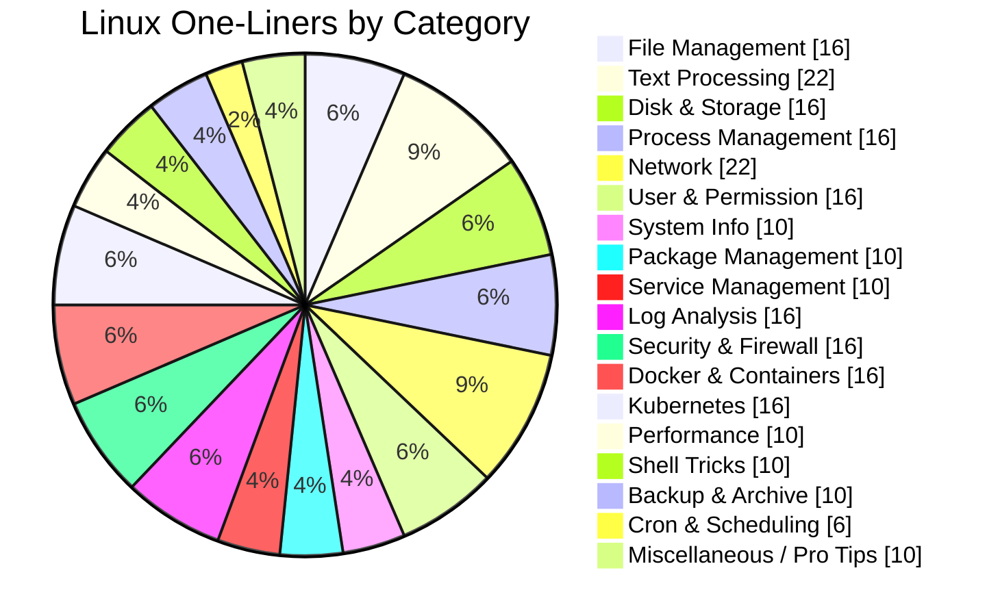

# Linux One-Liners Guide

A practical, interview-focused collection of frequently used Linux one-liners for modern RHEL 8+/9 and Ubuntu 20.04+ systems.

This guide contains **248** categorized one-liners.

## 6. File Management (16)
**1. Find all files larger than 100MB** → `find / -type f -size +100M 2>/dev/null`
**2. Find all empty files under a path** → `find /path -type f -empty`
**3. Find all empty directories** → `find /path -type d -empty`
**4. Find directories named cache** → `find / -type d -name 'cache' 2>/dev/null`
**5. Find files modified in the last 24 hours** → `find /var/log -type f -mtime -1`
**6. Find files by extension recursively** → `find /srv/app -type f -name '*.conf'`
**7. Find broken symlinks** → `find / -xtype l 2>/dev/null`
**8. Locate a file quickly using the locate database** → `locate -i nginx.conf`
**9. List the newest 20 files in a directory** → `ls -lt /var/log | head -20`
**10. Show hidden files except . and ..** → `ls -d .[^.]*`
**11. Copy a directory while preserving permissions and timestamps** → `cp -a /source /destination`
**12. Move every .log file into an archive directory** → `find /var/log -maxdepth 1 -type f -name '*.log' -exec mv -t /archive {} +`
**13. Delete files older than 30 days** → `find /backup -type f -mtime +30 -delete`
**14. Create parent directories and an empty file in one command** → `install -D /dev/null /opt/app/config/app.conf`
**15. Compare two directory trees briefly** → `diff -qr dir1 dir2`
**16. Show the detected type of every file in a directory** → `find . -maxdepth 1 -type f -exec file {} +`

## 6. Text Processing (22)
**17. Search recursively for a pattern with line numbers** → `grep -Rni 'error' /var/log`
**18. Count matching lines per file** → `grep -Rci 'timeout' /etc`
**19. Print non-comment, non-empty lines from a config file** → `grep -Ev '^\s*(#|$)' /etc/ssh/sshd_config`
**20. Replace every occurrence of a string in a file** → `sed -i 's/old/new/g' file.txt`
**21. Print lines between two matching patterns** → `sed -n '/BEGIN/,/END/p' file.txt`
**22. Show only the first and third columns from a CSV** → `cut -d',' -f1,3 data.csv`
**23. Extract usernames from /etc/passwd** → `cut -d: -f1 /etc/passwd`
**24. Sum a numeric column** → `awk '{sum += $3} END {print sum}' data.txt`
**25. Print lines where the fifth column is greater than 80** → `awk '$5 > 80' metrics.txt`
**26. Show duplicate lines with counts** → `sort file.txt | uniq -c | sort -nr`
**27. Sort a file numerically by the second column in reverse order** → `sort -k2,2nr scores.txt`
**28. Show the top 20 most frequent words in a file** → `tr -cs '[:alnum:]' '\n' < file.txt | tr '[:upper:]' '[:lower:]' | sort | uniq -c | sort -nr | head -20`
**29. Convert all text to lowercase** → `tr '[:upper:]' '[:lower:]' < input.txt`
**30. Convert tabs into spaces** → `expand -t 4 file.txt`
**31. Join two files side by side** → `paste file1.txt file2.txt`
**32. Convert newline-separated values into a comma-separated list** → `paste -sd, file.txt`
**33. Show the first 10 and last 10 lines of a file** → `{ head -10 file.txt; echo '---'; tail -10 file.txt; }`
**34. Extract all IPv4 addresses from a file** → `grep -Eo '([0-9]{1,3}\.){3}[0-9]{1,3}' file.txt`
**35. Print the length of the longest line** → `awk '{print length}' file.txt | sort -nr | head -1`
**36. Remove blank lines from a file** → `sed '/^$/d' file.txt`
**37. Show common lines between two sorted files** → `comm -12 <(sort file1.txt) <(sort file2.txt)`
**38. Search inside gzip-compressed logs** → `zgrep -i 'exception' /var/log/app.log*.gz`

## 6. Disk & Storage (16)
**39. Show human-readable filesystem usage** → `df -h`
**40. Show inode usage on all filesystems** → `df -i`
**41. Show the biggest directories on the current filesystem** → `du -xhd1 / | sort -h`
**42. List block devices with filesystem details** → `lsblk -f`
**43. Show mounted filesystems as a tree** → `findmnt`
**44. Show UUIDs and filesystem types for disks** → `blkid`
**45. Display the partition table for a disk** → `fdisk -l /dev/sda`
**46. Validate all /etc/fstab entries without rebooting** → `mount -a`
**47. Show block devices with sizes in bytes** → `lsblk -b`
**48. List currently unused block devices** → `lsblk -nrpo NAME,MOUNTPOINT | awk '$2==""{print $1}'`
**49. Show the source device mounted on /var** → `findmnt -no SOURCE,TARGET /var`
**50. Display swap devices and their usage** → `swapon --show`
**51. Summarize LVM physical, volume, and logical volumes** → `pvs && vgs && lvs`
**52. Show free space available in each volume group** → `vgs -o vg_name,vg_size,vg_free`
**53. Show logical volumes with backing devices** → `lvs -a -o lv_name,vg_name,lv_size,devices`
**54. Print filesystem-specific details for an XFS mount** → `xfs_info /mountpoint`

## 6. Process Management (16)
**55. Show the top 15 CPU-consuming processes** → `ps -eo pid,ppid,%cpu,%mem,cmd --sort=-%cpu | head -15`
**56. Show the top 15 memory-consuming processes** → `ps -eo pid,ppid,%mem,%cpu,cmd --sort=-%mem | head -15`
**57. Display the full process tree** → `ps -ef --forest`
**58. Show a process tree for a specific PID** → `pstree -p 1234`
**59. Find which process has a file open** → `lsof /path/to/file`
**60. Find which process is listening on port 5432** → `lsof -iTCP:5432 -sTCP:LISTEN -P -n`
**61. Send SIGTERM to every process matching a name** → `pkill -15 nginx`
**62. Force kill a process by PID** → `kill -9 1234`
**63. Lower the priority of a running process** → `renice +10 -p 1234`
**64. Start a CPU-heavy job with low priority** → `nice -n 10 tar -czf backup.tar.gz /data`
**65. Trace syscalls made by a command** → `strace -f -o trace.log command`
**66. Show zombie processes** → `ps -eo pid,ppid,state,cmd | awk '$3 ~ /Z/ {print}'`
**67. Watch the top CPU processes every 2 seconds** → `watch -n 2 'ps -eo pid,%cpu,%mem,cmd --sort=-%cpu | head'`
**68. Show threads of a process** → `ps -T -p 1234`
**69. Show the start time and elapsed runtime of a PID** → `ps -p 1234 -o pid,lstart,etime,cmd`
**70. Display environment variables of a running process** → `tr '\0' '\n' < /proc/1234/environ`

## 6. Network (22)
**71. Show all IP addresses on the host** → `ip -br addr show`
**72. Show the default route** → `ip route show default`
**73. Show the route the kernel will use to reach a host** → `ip route get 8.8.8.8`
**74. List all listening TCP and UDP sockets** → `ss -tulnp`
**75. Show established TCP connections to port 443** → `ss -tan state established '( dport = :443 or sport = :443 )'`
**76. Show interface statistics** → `ip -s link`
**77. Show ARP/neighbor cache entries** → `ip neigh show`
**78. Test whether a remote TCP port is reachable** → `nc -vz example.com 443`
**79. Fetch only HTTP response headers** → `curl -I https://example.com`
**80. Measure DNS, connect, and total time for an HTTP request** → `curl -o /dev/null -s -w 'dns=%{time_namelookup} connect=%{time_connect} total=%{time_total}\n' https://example.com`
**81. Download a file and resume if interrupted** → `wget -c https://example.com/file.iso`
**82. Resolve a hostname using the default DNS resolver** → `dig example.com`
**83. Query a specific DNS server for a record** → `dig @1.1.1.1 example.com A +short`
**84. Perform a reverse DNS lookup** → `dig -x 8.8.8.8 +short`
**85. Show your public IP address** → `curl -s https://ifconfig.me`
**86. Inspect the certificate presented by an HTTPS server** → `openssl s_client -connect example.com:443 -servername example.com </dev/null | openssl x509 -noout -issuer -subject -dates`
**87. Scan the most common ports on a host** → `nmap -Pn example.com`
**88. Capture 100 packets on port 80 without name resolution** → `tcpdump -ni any port 80 -c 100`
**89. Show listening ports with the legacy netstat view** → `netstat -tulpen`
**90. Test path quality to a host with 10 probes** → `mtr -rwzc 10 example.com`
**91. Test the largest non-fragmenting MTU with ping** → `ping -M do -s 1472 -c 4 8.8.8.8`
**92. Show only the HTTP status code for an endpoint** → `curl -s -o /dev/null -w '%{http_code}\n' https://example.com/health`

## 6. User & Permission (16)

**93. Create a user with a home directory and Bash shell** → `useradd -m -s /bin/bash deploy`
**94. Show a user's UID, GID, and groups** → `id deploy`
**95. Show password aging information for a user** → `chage -l deploy`
**96. Force a password change on the next login** → `chage -d 0 deploy`
**97. Add a user to the sudo-capable admin group** → `usermod -aG sudo deploy`
**98. Lock a user account** → `usermod -L deploy`
**99. Unlock a user account** → `usermod -U deploy`
**100. Change ownership of a directory tree** → `chown -R appuser:appgroup /srv/app`
**101. Grant read, write, and execute to the owner only** → `chmod 700 secret.sh`
**102. Add execute permission for the owner without touching others** → `chmod u+x script.sh`
**103. Show ACLs on a file or directory** → `getfacl /srv/app`
**104. Grant a user read/write access with ACLs** → `setfacl -m u:deploy:rw /srv/app/config.yml`
**105. Set a default ACL so new files inherit group read access** → `setfacl -d -m g:devops:rX /srv/shared`
**106. Remove all ACLs from a file** → `setfacl -b /srv/app/config.yml`
**107. Find world-writable files** → `find / -xdev -type f -perm -0002 2>/dev/null`
**108. Find files owned by a specific user** → `find / -user deploy 2>/dev/null`

## 6. System Info (10)
**109. Show the running kernel version** → `uname -r`
**110. Show full kernel, architecture, and hostname details** → `uname -a`
**111. Display OS release information** → `cat /etc/os-release`
**112. Show uptime and load averages** → `uptime`
**113. Show CPU architecture and socket/core layout** → `lscpu`
**114. Show memory and swap usage** → `free -h`
**115. Show hardware product and vendor information** → `dmidecode -t system`
**116. Show the kernel command line used at boot** → `cat /proc/cmdline`
**117. Show recent kernel warnings and errors** → `dmesg --level=warn,err | tail -50`
**118. Detect whether the system is virtualized** → `systemd-detect-virt`

## 6. Package Management (10)
**119. Refresh apt package metadata** → `apt update`
**120. List upgradable packages on Debian/Ubuntu** → `apt list --upgradable`
**121. Search for a package in apt repositories** → `apt-cache search nginx`
**122. Show package candidate and installed versions** → `apt-cache policy curl`
**123. List files installed by a Debian package** → `dpkg -L curl`
**124. Find which Debian package owns a file** → `dpkg -S /bin/ls`
**125. Show package details on RHEL-family systems** → `dnf info nginx`
**126. List available updates on RHEL-family systems** → `dnf check-update`
**127. Show enabled repositories with yum compatibility** → `yum repolist enabled`
**128. Verify the integrity of files installed by an RPM package** → `rpm -V bash`

## 6. Service Management (10)
**129. Check the status of a service** → `systemctl status nginx`
**130. Restart a service** → `systemctl restart nginx`
**131. Reload a service without a full restart** → `systemctl reload nginx`
**132. Enable and start a service immediately** → `systemctl enable --now nginx`
**133. Disable and stop a service immediately** → `systemctl disable --now nginx`
**134. List failed services** → `systemctl --failed`
**135. Show all running services** → `systemctl list-units --type=service --state=running`
**136. Show the dependency tree for a service** → `systemctl list-dependencies nginx`
**137. Show which units slow down boot the most** → `systemd-analyze blame | head -20`
**138. Prevent a service from being started manually or automatically** → `systemctl mask telnet.socket`

## 6. Log Analysis (16)
**139. Show the last 100 lines of the main system log** → `tail -100 /var/log/messages /var/log/syslog 2>/dev/null`
**140. Follow a log file in real time** → `tail -F /var/log/nginx/access.log`
**141. Follow a log and filter for errors only** → `tail -F /var/log/nginx/error.log | grep --line-buffered -i error`
**142. Show all errors from the current boot with systemd** → `journalctl -b -p err`
**143. Show warnings from the previous boot** → `journalctl -b -1 -p warning`
**144. Show service logs from the last hour** → `journalctl -u nginx --since '1 hour ago'`
**145. Show kernel messages since yesterday** → `journalctl -k --since yesterday`
**146. Show failed SSH logins from common auth logs** → `grep -h 'Failed password' /var/log/auth.log /var/log/secure 2>/dev/null`
**147. List the top client IPs hitting an NGINX access log** → `awk '{print $1}' /var/log/nginx/access.log | sort | uniq -c | sort -nr | head`
**148. Count HTTP status codes in an access log** → `awk '{print $9}' /var/log/nginx/access.log | sort | uniq -c | sort -nr`
**149. Show only 5xx responses from an access log** → `awk '$9 ~ /^5/ {print}' /var/log/nginx/access.log`
**150. Search inside rotated and compressed application logs** → `zgrep -h 'ERROR' /var/log/app.log*`
**151. Display the end of the previous boot log** → `journalctl -b -1 -e`
**152. Count sudo commands from auth logs** → `grep -h 'sudo:' /var/log/auth.log /var/log/secure 2>/dev/null | wc -l`
**153. Show log entries between two timestamps** → `journalctl --since '2024-01-01 10:00:00' --until '2024-01-01 11:00:00'`
**154. Summarize ERROR lines per hour from a text log** → `grep 'ERROR' app.log | cut -d' ' -f1,2 | sort | uniq -c`

## 6. Security & Firewall (16)
**155. List the active nftables ruleset** → `nft list ruleset`
**156. List active firewalld zones and allowed services** → `firewall-cmd --list-all`
**157. Open HTTPS permanently in firewalld** → `firewall-cmd --add-service=https --permanent`
**158. Reload firewalld after making rule changes** → `firewall-cmd --reload`
**159. List iptables rules with packet counters** → `iptables -L -n -v`
**160. Show the current SELinux mode** → `getenforce`
**161. Show SELinux contexts on web content** → `ls -Z /var/www/html`
**162. Restore default SELinux contexts on a directory tree** → `restorecon -Rv /var/www/html`
**163. Show the expected SELinux context for a path** → `matchpathcon /var/www/html/index.html`
**164. Show recent SELinux AVC denials** → `ausearch -m AVC,USER_AVC -ts recent`
**165. Show passwordless sudo rules** → `grep -R 'NOPASSWD' /etc/sudoers /etc/sudoers.d 2>/dev/null`
**166. Inspect the effective SSH daemon security settings** → `sshd -T | grep -E 'permitrootlogin|passwordauthentication|pubkeyauthentication'`
**167. Generate a modern Ed25519 SSH key pair** → `ssh-keygen -t ed25519 -a 100 -f ~/.ssh/id_ed25519`
**168. Copy your SSH public key to a remote host** → `ssh-copy-id user@server`
**169. Find world-writable directories without the sticky bit** → `find / -xdev -type d -perm -0002 ! -perm -1000 2>/dev/null`
**170. Show locally listening ports with owning users** → `ss -tulpen`

## 6. Docker & Containers (16)
**171. List running containers** → `docker ps`
**172. List all containers including stopped ones** → `docker ps -a`
**173. List local images** → `docker images`
**174. Show the last 100 log lines from a container** → `docker logs --tail 100 myapp`
**175. Open a shell inside a running container** → `docker exec -it myapp /bin/sh`
**176. Show live CPU and memory usage for containers once** → `docker stats --no-stream`
**177. Inspect a container's IP address** → `docker inspect -f '{{range .NetworkSettings.Networks}}{{.IPAddress}}{{end}}' myapp`
**178. Build an image from the current directory** → `docker build -t myapp:latest .`
**179. Run a container in detached mode with a port mapping** → `docker run -d --name myapp -p 8080:80 myapp:latest`
**180. Copy a file from a container to the host** → `docker cp myapp:/var/log/app.log ./app.log`
**181. Remove all stopped containers safely** → `docker container prune -f`
**182. Remove dangling images only** → `docker image prune -f`
**183. Show Docker disk usage by images, containers, and volumes** → `docker system df`
**184. Show image layer history** → `docker history myapp:latest`
**185. Follow Docker events from the last 10 minutes** → `docker events --since 10m`
**186. Set a restart policy on an existing container** → `docker update --restart unless-stopped myapp`

## 6. Kubernetes (16)
**187. List all resources in a namespace** → `kubectl get all -n prod`
**188. List pods with node placement and IPs** → `kubectl get pods -o wide -n prod`
**189. Describe a pod for troubleshooting** → `kubectl describe pod web-abc123 -n prod`
**190. Show the last 100 lines of logs from a pod** → `kubectl logs --tail=100 web-abc123 -n prod`
**191. Follow logs from a pod in real time** → `kubectl logs -f web-abc123 -n prod`
**192. Open a shell inside a pod** → `kubectl exec -it web-abc123 -n prod -- /bin/sh`
**193. Show node resource usage** → `kubectl top nodes`
**194. Show pod resource usage in a namespace** → `kubectl top pods -n prod`
**195. Check rollout progress of a deployment** → `kubectl rollout status deployment/web -n prod`
**196. Restart a deployment cleanly** → `kubectl rollout restart deployment/web -n prod`
**197. Show cluster events sorted by newest first** → `kubectl get events -A --sort-by=.metadata.creationTimestamp`
**198. List every pod scheduled on a specific node** → `kubectl get pods -A -o wide --field-selector spec.nodeName=node1`
**199. List pods that are not in Running phase** → `kubectl get pods -A --field-selector=status.phase!=Running`
**200. Update a deployment image** → `kubectl set image deployment/web web=nginx:1.27 -n prod`
**201. Port-forward a local port to a service** → `kubectl port-forward svc/web 8080:80 -n prod`
**202. Decode a secret value from Kubernetes** → `kubectl get secret app-secret -n prod -o jsonpath='{.data.password}' | base64 -d && echo`

## 6. Performance (10)
**203. Sample CPU, run queue, and memory every second** → `vmstat 1 5`
**204. Show per-device I/O utilization and latency** → `iostat -xz 1 5`
**205. Show CPU usage for every core** → `mpstat -P ALL 1 5`
**206. Show per-process CPU, memory, and I/O stats** → `pidstat -dur 1 5`
**207. Show network throughput counters over time** → `sar -n DEV 1 5`
**208. Show memory pressure and paging details** → `sar -r 1 5`
**209. Profile a command with perf stat** → `perf stat -d command`
**210. Show the hottest CPU stacks live with perf** → `perf top`
**211. Capture disk latency for a single process** → `iotop -oPa`
**212. Quickly confirm load averages versus CPU count** → `echo 'load:' $(cut -d' ' -f1-3 /proc/loadavg) 'cpus:' $(nproc)`

## 6. Shell Tricks (10)
**213. Repeat the previous command with sudo** → `sudo !!`
**214. Search command history for SSH commands** → `history | grep ssh`
**215. Re-run the most recent command starting with systemctl** → `!systemctl`
**216. Run a command in another directory without changing your shell** → `(cd /srv/app && ls -lah)`
**217. Create several directories at once with brace expansion** → `mkdir -p project/{bin,conf,log,tmp}`
**218. Compare two files after sorting them on the fly** → `diff <(sort file1.txt) <(sort file2.txt)`
**219. See output on screen and save it to a file at the same time** → `command | tee output.log`
**220. Run a command for every .log file in the directory** → `for f in *.log; do gzip "$f"; done`
**221. Strip the extension from a filename using parameter expansion** → `f=archive.tar.gz; echo ${f%%.*}`
**222. Run a command on batches of files safely** → `find . -name '*.tmp' -print0 | xargs -0 -n 50 rm -f`

## 6. Backup & Archive (10)
**223. Create a compressed tar archive** → `tar -czf backup-$(date +%F).tar.gz /data`
**224. Extract a compressed tar archive** → `tar -xzf backup-2024-01-01.tar.gz -C /restore`
**225. Archive a directory while preserving ACLs and xattrs** → `tar --acls --xattrs -czf full-backup.tar.gz /srv`
**226. Mirror one directory to another with rsync** → `rsync -aHAX --delete /data/ /backup/data/`
**227. Preview an rsync backup without changing anything** → `rsync -aHAX --delete --dry-run /data/ /backup/data/`
**228. Copy files securely to another host with compression** → `scp -C backup.tar.gz user@server:/backup/`
**229. Copy a directory tree to another host over SSH** → `scp -r /srv/app user@server:/srv/`
**230. Clone a disk with dd and show progress** → `dd if=/dev/sda of=/backup/sda.img bs=64K status=progress conv=fsync`
**231. Create a compressed image from a disk** → `dd if=/dev/sda bs=64K status=progress | gzip > /backup/sda.img.gz`
**232. Verify file integrity with SHA-256** → `sha256sum backup.tar.gz`

## 6. Cron & Scheduling (6)
**233. List the current user's cron jobs** → `crontab -l`
**234. Edit the current user's cron table** → `crontab -e`
**235. Install a cron job that runs every 5 minutes** → `(crontab -l 2>/dev/null; echo '*/5 * * * * /usr/local/bin/health-check.sh') | crontab -`
**236. Show all active systemd timers** → `systemctl list-timers --all`
**237. Schedule a one-time job 10 minutes from now** → `echo '/usr/local/bin/cleanup.sh' | at now + 10 minutes`
**238. Validate a systemd calendar expression** → `systemd-analyze calendar 'Mon..Fri *-*-* 02:00:00'`

## 6. Miscellaneous / Pro Tips (10)
**239. Serve the current directory over HTTP quickly** → `python3 -m http.server 8000`
**240. Pretty-print JSON from stdin** → `python3 -m json.tool`
**241. Convert an epoch timestamp to human-readable time** → `date -d @1710000000`
**242. Generate a 32-character random password** → `openssl rand -base64 24`
**243. Show where a command comes from** → `type -a python3`
**244. Show environment variables in sorted order** → `env | sort`
**245. Watch a command refresh every 2 seconds** → `watch -n 2 'df -h'`
**246. Display tabular data in aligned columns** → `column -t -s, data.csv`
**247. Base64-decode a string** → `echo 'SGVsbG8=' | base64 -d`
**248. Number lines with leading zeros** → `nl -w2 -nrz file.txt`

## Count Summary

| Category | Count |
| --- | ---: |
| File Management | 16 |
| Text Processing | 22 |
| Disk & Storage | 16 |
| Process Management | 16 |
| Network | 22 |
| User & Permission | 16 |
| System Info | 10 |
| Package Management | 10 |
| Service Management | 10 |
| Log Analysis | 16 |
| Security & Firewall | 16 |
| Docker & Containers | 16 |
| Kubernetes | 16 |
| Performance | 10 |
| Shell Tricks | 10 |
| Backup & Archive | 10 |
| Cron & Scheduling | 6 |
| Miscellaneous / Pro Tips | 10 |
| **Total** | **248** |

---

Use these as fast interview answers, troubleshooting shortcuts, and production-friendly command patterns.
