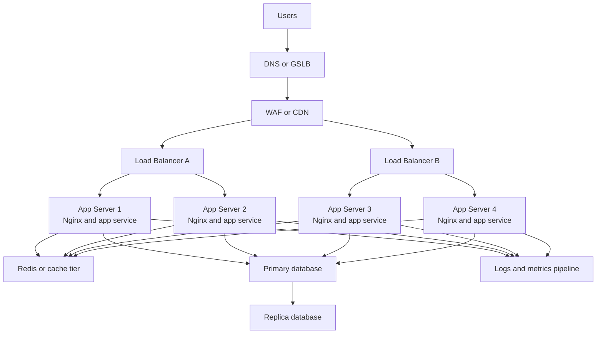
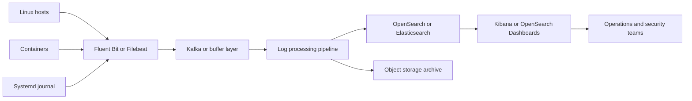
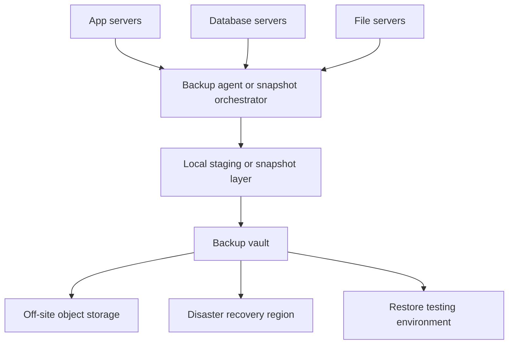

# Architecture and Design Interview Questions

This guide collects Linux architecture and systems design interview questions with production-style answers and diagrams.

## 🏗️ Architecture & Design Questions

### Design Question 1: Design a Highly Available Web Application Infrastructure on Linux
**Question:** How would you design a highly available Linux-based web application stack for a business-critical internet-facing service?

**Production-grade answer:**
A strong design uses multiple availability zones, at least two load balancers, multiple stateless application servers, replicated databases, centralized logging, centralized metrics, configuration management, and automated failover where appropriate. The application tier should be horizontally scalable, the database tier should have a clear primary/replica or clustered model, and every layer should expose health checks.



**Key design decisions:**
1. **Stateless application nodes** — Store sessions in Redis or use signed tokens so any healthy node can serve requests.
2. **Health checks at every tier** — The load balancer should check `/health` or `/ready` endpoints and remove failed nodes automatically.
3. **Database resilience** — Use managed HA database services when possible; otherwise implement replication, backups, failover runbooks, and connection pooling.
4. **Configuration management** — Build every Linux node from code using Ansible, Terraform, Packer, or image pipelines.
5. **Observability** — Collect host metrics, application metrics, logs, traces, and deployment events in one place.
6. **Security** — Use least privilege, SSH hardening, firewall segmentation, patching, secret management, TLS everywhere, and audit logs.
7. **Capacity and failure planning** — Size the fleet so one availability zone or one app node can fail without breaching SLOs.

**Example Linux implementation notes:**
```bash
systemctl enable nginx
systemctl enable myapp
firewall-cmd --permanent --add-service=https
sysctl -w net.core.somaxconn=4096
```

**What interviewers want to hear:**
- No single points of failure
- Clear separation between web, app, cache, and database layers
- Health checks and monitoring built in from day one
- Safe deployment and rollback strategy
- Security, backups, and capacity planning treated as first-class design items

---

### Design Question 2: How Would You Set Up a Centralized Logging System?
**Question:** Design centralized logging for Linux servers, containers, and applications so operations teams can search incidents quickly.

**Production-grade answer:**
A solid centralized logging design collects logs locally, forwards them reliably, enriches them with host and app metadata, stores them in a searchable backend, and enforces retention and access control. The logging path should survive application restarts and transient network failures.



**Design considerations:**
1. **Collectors on every host** — Use Fluent Bit, Vector, rsyslog, or Filebeat to collect `/var/log/*`, journald, and application logs.
2. **Buffering and backpressure handling** — A queue like Kafka helps absorb spikes and outages in the indexing tier.
3. **Structured logs** — Prefer JSON with fields such as `timestamp`, `hostname`, `service`, `environment`, `request_id`, and `severity`.
4. **Retention tiers** — Keep hot searchable logs for short-term triage and archive older logs cheaply to object storage.
5. **Security and privacy** — Redact secrets, restrict access by role, and encrypt logs in transit and at rest.
6. **Correlation** — Attach deployment version, Kubernetes namespace, container ID, and cloud instance metadata so incidents can be traced quickly.

**Example Linux collector checks:**
```bash
systemctl status fluent-bit || systemctl status filebeat
journalctl -u fluent-bit -n 100 --no-pager
tail -f /var/log/messages
curl -s http://localhost:2020/api/v1/metrics || true
```

**Common mistakes in design interviews:**
- Sending logs directly from apps to a central store with no buffering
- Keeping only local logs on ephemeral hosts
- Indexing everything forever with no retention or cost controls
- Ignoring PII and secrets in log data
- Collecting logs but not making them searchable by host, service, and time

**What interviewers want to hear:**
- Reliability under bursts and outages
- Searchability and metadata enrichment
- Secure storage and access control
- Practical retention and cost strategy
- Clear operational debugging workflow

---

### Design Question 3: Design a Backup Strategy for 50 Production Servers
**Question:** How would you design a backup strategy for around 50 Linux production servers with databases, application servers, and file servers?

**Production-grade answer:**
A mature backup design starts by classifying data, setting RPO/RTO targets, defining backup frequency per workload, storing copies off-host and off-site, encrypting everything, and testing restores regularly. Not every server needs the same backup pattern.



**Recommended strategy:**
1. **Classify data types**
   - OS rebuildable from automation: usually no full-image backup needed
   - Databases: transaction-aware logical or physical backups plus WAL/binlog retention
   - File servers: snapshot-based plus file-level restore capability
   - Config: version control plus periodic backup of critical `/etc` state

2. **Define policies by workload**
   - Databases: nightly full plus continuous binlog/WAL archiving
   - Application data: hourly or daily snapshots depending on RPO
   - Critical configs and secrets references: daily backup with strict access control

3. **Follow the 3-2-1 principle**
   - 3 copies of data
   - 2 different media or systems
   - 1 copy off-site or cross-region

4. **Use immutable or protected storage where possible**
   - Prevent ransomware or accidental deletion from destroying all backup copies.

5. **Encrypt and audit**
   - Encrypt in transit and at rest
   - Log every backup and restore action
   - Separate backup admin permissions from system admin permissions

6. **Test restores regularly**
   - A backup strategy is incomplete without restore verification.

**Example Linux operational commands:**
```bash
systemctl status backup-agent
restic snapshots || true
rsync -aHAX /data backup@vault:/srv/backups/host01 || true
mysqlbinlog --read-from-remote-server --host=db01 --raw --stop-never mysql-bin.000001 || true
```

**Sample policy answer:**
- Tier 1 databases: 15-minute RPO, 1-hour RTO, continuous log shipping, nightly full backup
- Tier 2 application data: 4-hour RPO, daily snapshots, weekly full off-site copy
- Tier 3 rebuildable stateless nodes: rebuild from image and config management, back up only business data and configuration

**What interviewers want to hear:**
- RPO and RTO drive the design
- Different workloads require different backup methods
- Restore testing matters more than backup job green status alone
- Off-host, off-site, encrypted copies are mandatory
- Documentation, ownership, and monitoring are part of the design

---
