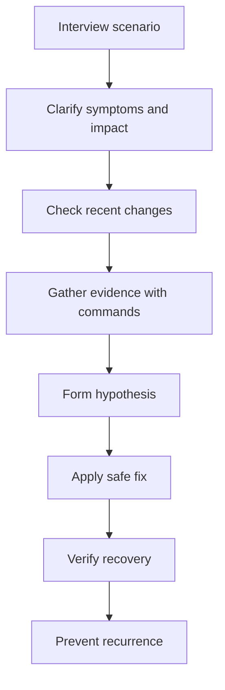

# Linux Interview Quick Reference

This guide collects file locations, command packs, ports, signals, exit codes, and final review checklists.

## Important File Locations

| Path | Purpose |
|---|---|
| `/etc/passwd` | User account definitions |
| `/etc/shadow` | Password hashes and aging information |
| `/etc/group` | Group definitions |
| `/etc/gshadow` | Group security information |
| `/etc/sudoers` | Sudo policy |
| `/etc/ssh/sshd_config` | OpenSSH server configuration |
| `/etc/hosts` | Static hostname mappings |
| `/etc/resolv.conf` | DNS resolver configuration |
| `/etc/fstab` | Static mount definitions |
| `/etc/crontab` | System-wide cron entries |
| `/etc/sysctl.conf` | Kernel parameter configuration |
| `/etc/sysctl.d/` | Drop-in kernel tuning files |
| `/etc/pam.d/` | PAM service configuration |
| `/etc/systemd/system/` | Local systemd unit files |
| `/usr/lib/systemd/system/` | Packaged systemd unit files |
| `/var/log/` | Traditional log directory |
| `/var/spool/cron/` | User cron spools on some systems |
| `/var/lib/` | Persistent application and service state |
| `/boot/` | Kernel, initramfs, bootloader files |
| `/proc/` | Virtual kernel and process info |
| `/sys/` | Virtual device and kernel interfaces |
| `/dev/` | Device nodes |
| `/home/` | User home directories |
| `/root/` | Root user home |
| `/tmp/` | Temporary files |
| `/run/` | Runtime state files and sockets |

---

## Essential Commands Cheat Sheet

| Area | Commands |
|---|---|
| Navigation | `pwd`, `cd`, `ls`, `tree` |
| Files | `touch`, `cp`, `mv`, `rm`, `mkdir`, `find` |
| Viewing | `cat`, `less`, `head`, `tail`, `tail -f` |
| Text processing | `grep`, `awk`, `sed`, `sort`, `cut`, `uniq`, `wc` |
| Permissions | `chmod`, `chown`, `chgrp`, `umask`, `getfacl`, `setfacl` |
| Users | `id`, `who`, `w`, `useradd`, `usermod`, `passwd` |
| Processes | `ps`, `top`, `htop`, `pgrep`, `kill`, `nice`, `renice` |
| Services | `systemctl`, `journalctl`, `loginctl` |
| Networking | `ip`, `ss`, `ping`, `dig`, `curl`, `nc`, `traceroute`, `tcpdump` |
| Storage | `df`, `du`, `lsblk`, `blkid`, `mount`, `umount`, `findmnt` |
| LVM | `pvs`, `vgs`, `lvs`, `lvextend`, `lvreduce` |
| Packages | `apt`, `dpkg`, `dnf`, `yum`, `rpm`, `zypper` |
| Scheduling | `crontab`, `at`, `systemctl list-timers` |
| Performance | `vmstat`, `iostat`, `sar`, `strace`, `perf` |
| Security | `sudo`, `getenforce`, `sestatus`, `firewall-cmd`, `nft`, `iptables` |
| Archives | `tar`, `gzip`, `gunzip`, `zip`, `unzip` |

---

## Common Port Numbers

| Port | Protocol | Typical Use |
|---|---|---|
| 20/21 | TCP | FTP |
| 22 | TCP | SSH/SCP/SFTP |
| 23 | TCP | Telnet |
| 25 | TCP | SMTP |
| 53 | TCP/UDP | DNS |
| 67/68 | UDP | DHCP |
| 69 | UDP | TFTP |
| 80 | TCP | HTTP |
| 110 | TCP | POP3 |
| 123 | UDP | NTP |
| 143 | TCP | IMAP |
| 161/162 | UDP | SNMP |
| 389 | TCP/UDP | LDAP |
| 443 | TCP | HTTPS |
| 465 | TCP | SMTPS |
| 514 | UDP | Syslog |
| 587 | TCP | SMTP submission |
| 636 | TCP | LDAPS |
| 993 | TCP | IMAPS |
| 995 | TCP | POP3S |
| 1433 | TCP | Microsoft SQL Server |
| 1521 | TCP | Oracle DB |
| 2049 | TCP/UDP | NFS |
| 2379 | TCP | etcd client |
| 2380 | TCP | etcd peer |
| 3000 | TCP | Common web app port |
| 3306 | TCP | MySQL/MariaDB |
| 3389 | TCP | RDP |
| 5432 | TCP | PostgreSQL |
| 5601 | TCP | Kibana |
| 5672 | TCP | RabbitMQ |
| 6379 | TCP | Redis |
| 6443 | TCP | Kubernetes API server |
| 8080 | TCP | Alternative HTTP/app port |
| 8443 | TCP | Alternative HTTPS/app port |
| 9090 | TCP | Prometheus |
| 9200 | TCP | Elasticsearch/OpenSearch |
| 9300 | TCP | Elasticsearch transport |
| 10250 | TCP | Kubelet |

---

## Common Signal Numbers

| Signal | Number | Meaning |
|---|---:|---|
| SIGHUP | 1 | Hangup or reload request |
| SIGINT | 2 | Interrupt from keyboard |
| SIGQUIT | 3 | Quit |
| SIGILL | 4 | Illegal instruction |
| SIGTRAP | 5 | Trace/breakpoint trap |
| SIGABRT | 6 | Abort |
| SIGBUS | 7 | Bus error |
| SIGFPE | 8 | Floating-point exception |
| SIGKILL | 9 | Force kill, cannot be caught |
| SIGUSR1 | 10 | User-defined signal 1 |
| SIGSEGV | 11 | Segmentation fault |
| SIGUSR2 | 12 | User-defined signal 2 |
| SIGPIPE | 13 | Broken pipe |
| SIGALRM | 14 | Alarm clock |
| SIGTERM | 15 | Graceful termination request |
| SIGCHLD | 17 | Child stopped or exited |
| SIGCONT | 18 | Continue if stopped |
| SIGSTOP | 19 | Stop, cannot be caught |
| SIGTSTP | 20 | Terminal stop |
| SIGTTIN | 21 | Background read from TTY |
| SIGTTOU | 22 | Background write to TTY |

Note: Signal numbering can vary slightly across Unix variants, but the above is standard enough for Linux interview reference.

---

## Common Exit Codes

| Exit Code | Meaning |
|---|---|
| 0 | Success |
| 1 | General error |
| 2 | Misuse of shell builtin or incorrect usage |
| 126 | Command found but not executable |
| 127 | Command not found |
| 128 | Invalid exit argument |
| 128+n | Fatal error due to signal `n` |
| 130 | Script terminated by `Ctrl+C` / SIGINT |
| 137 | Killed by SIGKILL, often OOM or forced kill |
| 139 | Segmentation fault / SIGSEGV |
| 143 | Terminated by SIGTERM |
| 255 | Exit status out of range or general failure in some tools |

Example:
```bash
ls /does-not-exist
echo $?
```

---

## Troubleshooting Command Packs

### Disk Investigation Pack
```bash
df -h
df -i
du -xhd1 /var | sort -h
find /var -xdev -type f -size +500M -ls
lsof | grep deleted
```

### CPU and Memory Investigation Pack
```bash
uptime
top -b -n 1 | head -20
free -h
vmstat 1 5
ps -eo pid,%cpu,%mem,cmd --sort=-%cpu | head
ps -eo pid,%mem,rss,cmd --sort=-%mem | head
```

### Network Investigation Pack
```bash
ip addr
ip route
ss -tulnp
ss -s
ping -c 4 8.8.8.8
dig example.com
curl -Iv https://example.com
```

### Service Failure Investigation Pack
```bash
systemctl status myservice
journalctl -u myservice -n 100 --no-pager
systemctl cat myservice
systemctl show myservice | grep -E 'ExecStart|Environment|After|Requires'
```

---

## Linux Interview Preparation Tips

1. Practice in a VM or cloud instance.
2. Learn the reasoning behind commands, not just syntax.
3. Be able to explain trade-offs.
4. When answering scenario questions, use a structured troubleshooting methodology.
5. Mention logs, metrics, and recent changes.
6. Be explicit about safety in production.
7. Know the difference between a quick fix and root cause.
8. Explain how to verify success after every action.

A strong interview answer usually includes:
- Problem framing
- Likely causes
- Validation steps
- Safe remediation
- Follow-up prevention measures



---

## Final Review Checklist

Use this checklist before a Linux interview:

- I can explain the Linux file system hierarchy.
- I can manage permissions, ownership, users, and groups.
- I can use pipes, redirection, grep, awk, and find effectively.
- I can inspect processes, logs, services, and ports.
- I can troubleshoot SSH, DNS, storage, and performance issues.
- I understand systemd, cron, and shell scripting basics.
- I know LVM, mounts, `/etc/fstab`, and file system basics.
- I understand load average, memory pressure, page cache, and swap.
- I can discuss containers using namespaces and cgroups.
- I can handle scenario questions with clear step-by-step logic.
- I can connect Linux concepts to DevOps, CI/CD, Kubernetes, and SRE work.

---

## Additional Practice Prompts

Use these prompts to extend your preparation:

1. Explain how Linux handles a TCP connection from SYN to application accept.
2. Compare ext4 and XFS for a database workload.
3. Describe how a reverse proxy communicates with an upstream service.
4. Explain what happens when a process writes to a file on a full file system.
5. Design a Linux hardening baseline for an internet-facing VM.
6. Troubleshoot why a container can reach the internet but not another pod.
7. Explain how systemd restarts a crashing service.
8. Investigate a sudden spike in context switches.
9. Explain the impact of a bad DNS resolver on a web app.
10. Describe how you would automate Linux patching safely.

---

## Closing Note

Linux interview success comes from combining command knowledge with systems thinking. The best answers show that you can:
- Operate safely in production
- Troubleshoot methodically
- Understand internals well enough to explain behavior
- Automate repeatable work
- Balance speed, reliability, and security

Study deeply, practice repeatedly, and always verify your assumptions with data.

---
