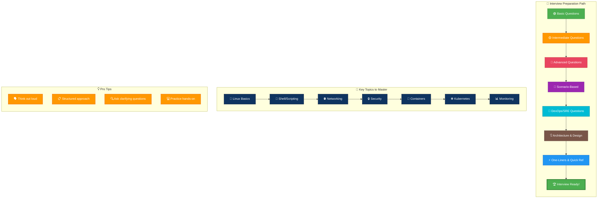
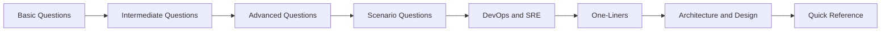

# Linux Interview Questions Guide

---

## 🎬 Interview Prep Strategy — Animated Workflow

---

This guide is now split into focused interview-prep files so you can study by level, practice production scenarios, and keep quick-reference material close at hand.

## Overview

- Start with the basic, intermediate, and advanced question sets to build depth in order.
- Use the scenario and DevOps/SRE guides for real-world troubleshooting and platform-oriented interview practice.
- Use the one-liner, architecture, and quick-reference guides for fast revision before interviews.

## Learning Path

## Table of Contents

1. [Basic Questions](01-basic-questions.md)
2. [Intermediate Questions](02-intermediate-questions.md)
3. [Advanced Questions](03-advanced-questions.md)
4. [Scenario Questions](04-scenario-questions.md)
5. [DevOps and SRE Questions](05-devops-sre-questions.md)
6. [One-Liners](06-one-liners.md)
7. [Architecture and Design](07-architecture-design.md)
8. [Quick Reference](08-quick-reference.md)
