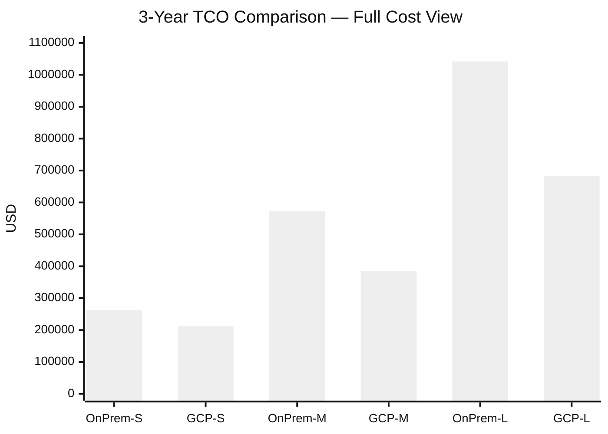
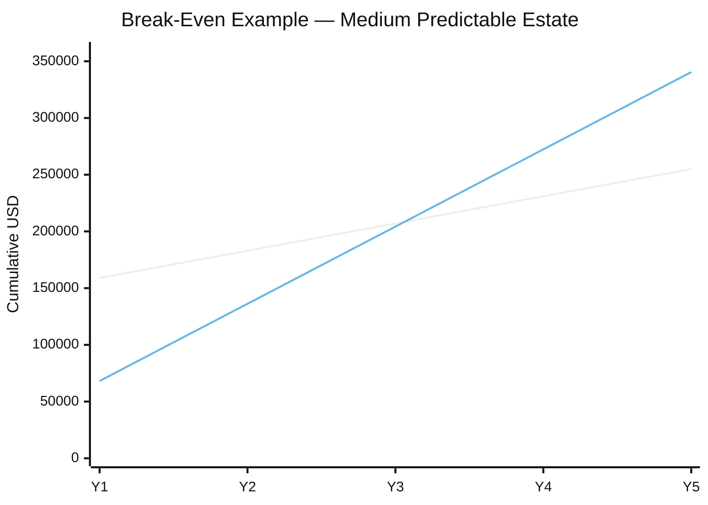
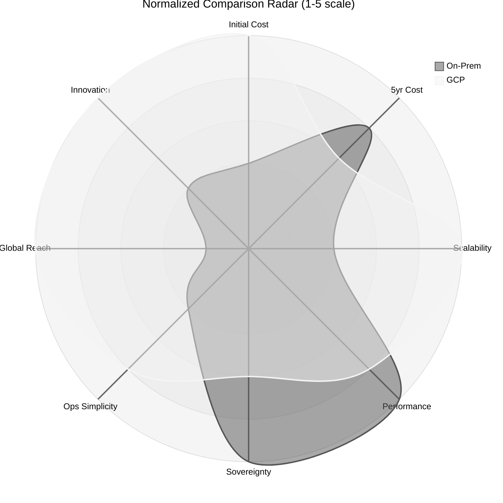
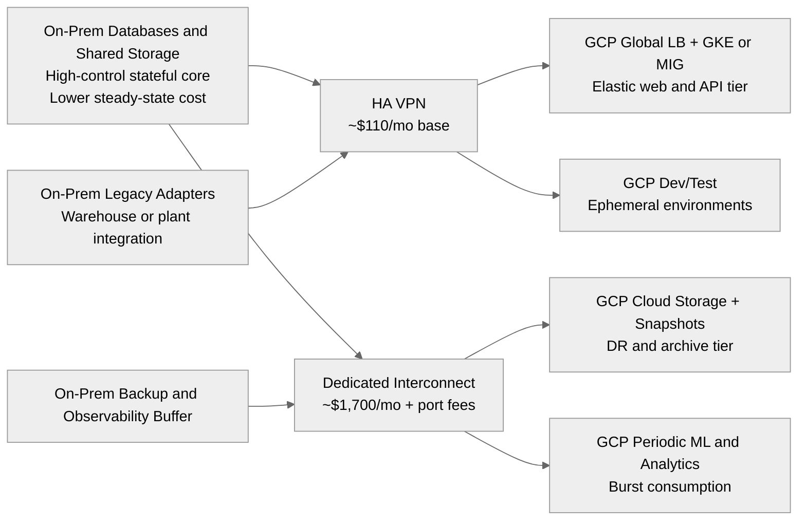
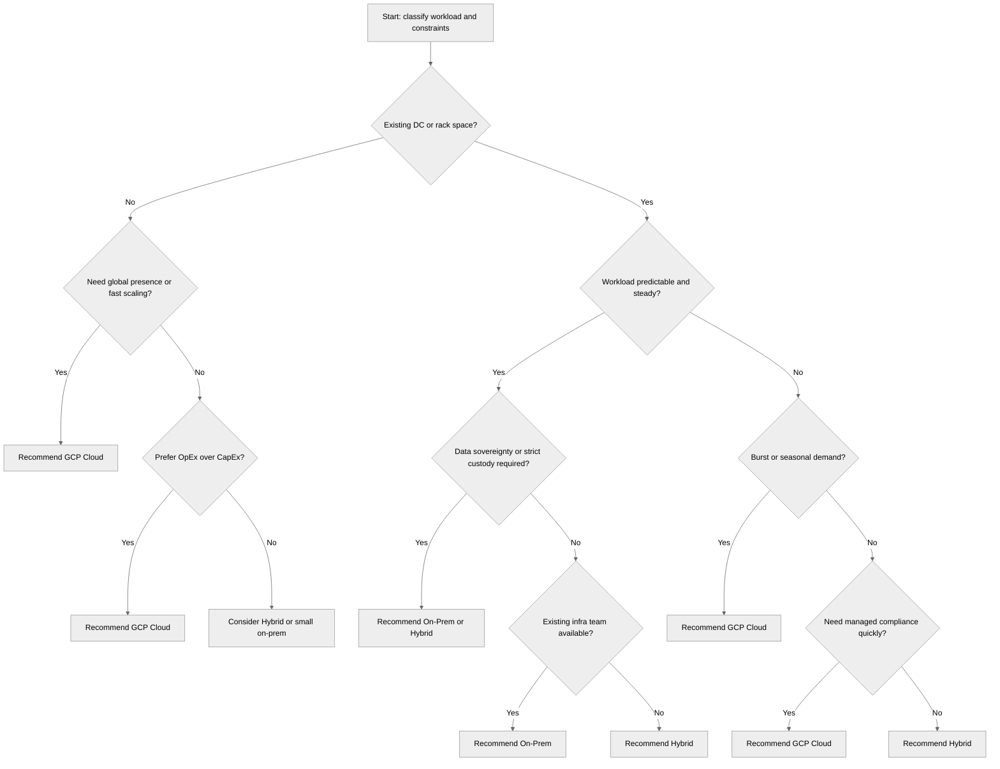

<pre>
┌──────────────────────────────────────────────────────────────┐
│  Bare-Metal vs Cloud — Pricing & Decision Framework         │
│  TCO, Performance, Security, Operations Compared            │
└──────────────────────────────────────────────────────────────┘
</pre>

# Bare-Metal vs GCP Cloud — Complete Comparison

> Related AM bare-metal guides: [`README.md`](./README.md), [`01-hypervisor-layer.md`](./01-hypervisor-layer.md), [`02-network-design.md`](./02-network-design.md), [`03-firewall-and-security.md`](./03-firewall-and-security.md), [`04-shared-storage.md`](./04-shared-storage.md), [`05-vm-provisioning-and-hardening.md`](./05-vm-provisioning-and-hardening.md), [`07-containers-and-monitoring.md`](./07-containers-and-monitoring.md), [`09-kubernetes-deployment.md`](./09-kubernetes-deployment.md)
>
> Related GCP equivalents: [`GCP-Cloud-Deployment/README.md`](./GCP-Cloud-Deployment/README.md), [`GCP-Cloud-Deployment/01-compute-and-vms.md`](./GCP-Cloud-Deployment/01-compute-and-vms.md), [`GCP-Cloud-Deployment/02-networking.md`](./GCP-Cloud-Deployment/02-networking.md), [`GCP-Cloud-Deployment/03-storage-and-databases.md`](./GCP-Cloud-Deployment/03-storage-and-databases.md), [`GCP-Cloud-Deployment/04-gke-kubernetes.md`](./GCP-Cloud-Deployment/04-gke-kubernetes.md), [`GCP-Cloud-Deployment/05-security-and-iam.md`](./GCP-Cloud-Deployment/05-security-and-iam.md), [`GCP-Cloud-Deployment/06-monitoring-and-operations.md`](./GCP-Cloud-Deployment/06-monitoring-and-operations.md), [`GCP-Cloud-Deployment/07-migration-and-hybrid.md`](./GCP-Cloud-Deployment/07-migration-and-hybrid.md)
>
> Related application context: [`../Architecture/README.md`](../Architecture/README.md), [`../Architecture/01-system-overview-and-design-decisions.md`](../Architecture/01-system-overview-and-design-decisions.md), [`../Architecture/03-cloud-infrastructure.md`](../Architecture/03-cloud-infrastructure.md), [`../Architecture/10-high-level-design.md`](../Architecture/10-high-level-design.md)

This guide compares the AM on-prem bare-metal deployment track with the GCP cloud equivalent for the same 10-application ecommerce platform.

The goal is not to claim one platform always wins.

The goal is to make trade-offs explicit across:

- capital cost,
- monthly spend,
- elasticity,
- security boundary control,
- disaster recovery posture,
- performance predictability,
- staffing burden,
- and long-term optionality.

All prices are approximate public-market USD references for 2024-2025.

Always validate current list prices with vendors, the Google Cloud Pricing Calculator, reseller quotes, and your negotiated discounts before procurement.

## Executive Summary

- Quick verdict: cloud usually wins for speed and elasticity; on-prem wins when workloads are predictable, heavily regulated, or egress-heavy; hybrid wins when only part of the stack needs cloud elasticity.
- Short version: if you are still discovering product-market fit, default to GCP; if you already know your steady-state footprint and own the operational skillset, on-prem frequently becomes attractive after the second or third year.
- Practical rule: compare **full-stack TCO**, not only compute.
- Important nuance: most “cloud is expensive” stories are actually **egress + logging + over-sizing + always-on managed premium** stories.
- Important nuance: most “on-prem is cheaper” stories assume **existing rack space, sunk staffing, and good procurement discipline**.
| Scenario | Winner | Why |
|----------|--------|-----|
| Startup / MVP (< 20 VMs) | ☁️ Cloud | No CapEx, fast provisioning, pay-as-you-go |
| Stable enterprise (50+ VMs, predictable) | 🏢 On-Prem | Lower long-term cost, full control |
| Burst/seasonal workloads | ☁️ Cloud | Auto-scale, no idle hardware |
| Data sovereignty / compliance | 🏢 On-Prem | Full data control, no third-party |
| Global distribution | ☁️ Cloud | 35+ regions, CDN, edge |
| GPU/ML training | Depends | Cloud for burst, on-prem for sustained |
| Hybrid (some on-prem + cloud) | 🔀 Both | Best of both worlds |

### Fast-read takeaways

- **AM bare-metal path** maps to fixed-capacity infrastructure: servers, switches, firewall, storage, rack, power, and an operator team.
- **GCP path** replaces physical procurement with Compute Engine, GKE, Cloud SQL, Filestore, Cloud Storage, Cloud Load Balancing, and Cloud Operations.
- The AM guides in [`01-hypervisor-layer.md`](./01-hypervisor-layer.md) and [`04-shared-storage.md`](./04-shared-storage.md) represent the largest on-prem cost centers.
- The GCP guides in [`01-compute-and-vms.md`](./GCP-Cloud-Deployment/01-compute-and-vms.md), [`03-storage-and-databases.md`](./GCP-Cloud-Deployment/03-storage-and-databases.md), and [`04-gke-kubernetes.md`](./GCP-Cloud-Deployment/04-gke-kubernetes.md) represent the largest cloud bill drivers.
- Compute is only one line item.
- Staffing, egress, resiliency design, and storage class decisions matter just as much.
- For the 10-application ecommerce platform from `Architecture/`, the dominant economics depend on whether traffic is spiky, global, compliance-heavy, or stable and warehouse-centric.

### Summary cost snapshot
| View | Small Footprint | Medium Footprint | Large Footprint | Main Caveat |
|------|-----------------|------------------|-----------------|-------------|
| On-Prem amortized hardware only (3yr) | $1,222/mo | $3,333/mo | $8,472/mo | Does not include people, power, space |
| GCP 3yr CUD service bill | $3,379/mo | $5,674/mo | $11,448/mo | Does not include migration one-time cost |
| Greenfield 3yr full TCO | $263,200 | $573,400 | $1,041,800 | Includes staffing, support, power, space |
| GCP 3yr full TCO | $211,644 | $384,264 | $682,128 | Assumes disciplined CUD and moderate logging |

### Why the two monthly views differ

- The amortized on-prem hardware number is intentionally narrow: it spreads only acquisition cost over time.
- The full TCO number is wider: it includes power, cooling, floor space/colo, Internet, support contracts, and staffing.
- The GCP monthly total is broad at the platform-service layer, but it still depends on egress, logging, database HA, and support tier assumptions.
- If your organization already owns the space and already employs the team, the incremental on-prem cost can be dramatically lower than the greenfield TCO table suggests.
- If your organization lacks rack space and has no infra team, cloud becomes even more favorable than the base tables suggest.

## Assumptions Used in This Guide

- Region for cloud pricing: **`us-central1`**, because that is already the default target noted in [`GCP-Cloud-Deployment/README.md`](./GCP-Cloud-Deployment/README.md).
- Utilization model: 24x7 steady-state production baseline for the listed instances.
- Monthly conversion: 730 hours.
- On-prem depreciation: shown at both **3 years** and **5 years**.
- Storage assumptions: mixed NVMe performance tier plus object/archive tier for backups.
- Network assumptions: moderate Internet egress for most scenarios; separate high-egress scenario in the media example.
- People assumptions: the TCO tables use incremental FTE estimates, not fully allocated corporate overhead.
- Security assumptions: both platforms are run competently; the comparison is not between “good cloud” and “neglected on-prem” or vice versa.
- Licensing assumptions: Linux-first stack, open-source defaults, optional commercial support where useful.
- Availability assumptions: single primary site for on-prem unless otherwise stated; multi-zone is default in GCP where supported.

## 1. Hardware Procurement — Detailed Cost Breakdown

The bare-metal AM design starts with the physical layer described in [`README.md`](./README.md) and expands through hypervisors, VLANs, firewall controls, and shared storage.

That means the first pricing decision is not “how many VMs?”

It is:

- how much fixed capacity to buy,
- how much redundancy to include on day one,
- what performance tier to assign to storage,
- and whether the environment is a single-rack SMB build or an enterprise platform with support contracts.

### Server Costs (Per Unit, 2024-2025 Pricing)
| Component | Budget Option | Mid-Range | Enterprise |
|-----------|---------------|-----------|------------|
| **Server** | Supermicro 2U (2x Xeon 4416+, 256GB, 2x 1.92TB NVMe) | Dell R760 (2x Xeon 6430, 512GB, 4x 1.92TB NVMe) | HPE DL380a Gen11 (2x Xeon 8462Y+, 1TB, 8x 3.84TB NVMe) |
| **Price** | $6,000-8,000 | $12,000-18,000 | $25,000-40,000 |
| **Cores** | 40 cores | 64 cores | 128 cores |
| **RAM** | 256 GB | 512 GB | 1 TB |
| **Storage** | 3.84 TB NVMe | 7.68 TB NVMe | 30.72 TB NVMe |

#### Server procurement interpretation

- The budget profile is usually enough for a 3-node Proxmox or KVM starter cluster plus a few utility VMs.
- The mid-range profile is closer to the AM production baseline for a serious multi-tier environment with room for HA and maintenance slack.
- The enterprise profile is appropriate when the same platform must host large databases, Kubernetes worker pools, observability, CI/CD, and spare capacity for failover.
- CPU list prices vary widely by OEM, support level, and memory DIMM population.
- Memory often moves the quote more than CPU once you pass 512 GB per node.
- Local NVMe is cheap compared with external flash arrays, but it does not replace shared storage for live migration and HA patterns described in [`04-shared-storage.md`](./04-shared-storage.md).
- Buying fewer, denser hosts lowers switch-port count and rack usage, but it increases blast radius per host failure.
- Buying more, smaller hosts increases network complexity, but improves fault isolation and maintenance flexibility.

### Network Equipment
| Equipment | Budget | Enterprise | Notes |
|-----------|--------|------------|-------|
| 10GbE managed switch (48-port) | $1,500-3,000 (Mikrotik, FS.com) | $5,000-15,000 (Cisco Catalyst, Arista) | Need 2 for redundancy |
| 25GbE switch | $3,000-5,000 | $10,000-25,000 | For storage/spine |
| SFP+ 10G modules (per pair) | $15-30 (generic) | $200-500 (Cisco) | 4-8 per server |
| Cat6A cabling (per run) | $10-20 | $30-50 (pre-terminated) | Or fiber: $20-50/run |
| Patch panel + cable management | $100-300 | $300-600 | Per rack |

#### Network cost notes

- Dual-switch design is not optional for meaningful HA.
- Budget switch pairs can work well for SMB and labs, but enterprise support, telemetry, and MLAG/VPC maturity often justify the premium at scale.
- Optics are where many BOMs get quietly inflated.
- Generic optics are dramatically cheaper, but some vendors officially support only their coded modules.
- Copper is cheaper for short runs; fiber is cleaner for denser racks, 25G/100G growth, and EMC-heavy rooms.
- Storage traffic may justify 25GbE even when the rest of the fabric remains 10GbE.
- The AM VLAN isolation plan in [`02-network-design.md`](./02-network-design.md) should be used to estimate port count, trunking, and management overhead.

### Firewall / Security
| Device | Budget | Enterprise | Notes |
|--------|--------|------------|-------|
| pfSense appliance (Netgate 6100) | $800-1,500 | — | Great for SMB |
| FortiGate 60F/80F | $1,000-2,500 | — | UTM included |
| FortiGate 200F/400F | — | $5,000-15,000 | Enterprise throughput |
| Palo Alto PA-440/450 | — | $3,000-8,000 | Advanced threat prevention |
| Annual subscription (IPS/AV/URL) | $300-800/yr | $2,000-8,000/yr | Required for full features |

#### Firewall cost notes

- Appliance sticker price is only part of the cost.
- Threat-prevention subscriptions are usually mandatory if you expect IPS, anti-malware, URL filtering, and vendor TAC support.
- Throughput claims are often quoted without heavy security services enabled.
- If east-west inspection is required, buy for the inspected throughput, not the raw firewall throughput.
- The operational model from [`03-firewall-and-security.md`](./03-firewall-and-security.md) matters: more zones and more logging mean more policy work and more storage for logs.

### Storage
| Storage System | Capacity | Price | IOPS | Notes |
|----------------|----------|-------|------|-------|
| TrueNAS Mini X+ | 40-80 TB | $2,000-4,000 | 50K-100K | SMB/homelab |
| Synology RS3621xs+ | 96-192 TB | $5,000-8,000 (diskless) | 100K-200K | Mid-range NAS |
| TrueNAS M40 | 100-500 TB | $15,000-40,000 | 200K-500K | Enterprise NAS/SAN |
| NetApp AFF A250 | 50-200 TB | $30,000-80,000 | 500K+ | Enterprise tier |
| Pure Storage FlashArray//E | 100-500 TB | $50,000-150,000 | 1M+ | All-flash enterprise |
| Disks: 16TB HDD (Exos) | — | $250-350 each | — | Bulk storage |
| Disks: 3.84TB NVMe (Samsung PM9A3) | — | $350-500 each | — | Performance tier |

#### Storage economics

- Shared storage is frequently the most under-budgeted part of an on-prem build.
- Cheap servers with weak shared storage often underperform expensive cloud storage in real life.
- Capacity planning must include snapshots, replica space, file-system reserve, RAID parity, spare disks, and performance headroom.
- NFS is cheaper operationally; block storage is often better for databases and latency-sensitive systems.
- The AM storage guidance in [`04-shared-storage.md`](./04-shared-storage.md) should drive whether you price for sequential throughput, random IOPS, or shared file semantics.
- Flash arrays deliver stable latency but can dominate the entire CapEx line item.
- HDD-backed NAS can be very economical for backup repositories, media, and colder workloads.

### Rack & Power
| Component | Cost | Notes |
|-----------|------|-------|
| 42U rack (APC/StarTech) | $1,000-3,000 | With doors, side panels |
| PDU (metered, per-outlet) | $300-800 x2 | Dual PDU for redundancy |
| UPS 3kVA (APC Smart-UPS) | $1,500-3,000 | 15-30 min runtime |
| UPS 6kVA (rack-mount) | $3,000-6,000 | For larger deployments |
| Monthly power cost | $200-600/mo | ~2-5 kW average draw |
| Monthly colocation (if not owned) | $500-2,000/mo | Per half/full rack |
| Cooling | $100-300/mo | Included in colo |

#### Facility considerations

- If you already own conditioned rack space, the economics change materially in favor of on-prem.
- If you need third-party colocation from day one, on-prem is still viable, but the cost gap versus cloud narrows.
- UPS battery replacement and electrical work are easy to forget in first-year planning.
- Power rates are volatile; do not lock the business case to a single low utility number.
- When the AM design says “verify each layer before promoting workloads,” that also means funding spares, lab time, and maintenance windows.

### Total On-Prem Build — 3 Scenarios
| Component | Small (3 servers) | Medium (5 servers) | Large (10 servers) |
|-----------|-------------------|--------------------|--------------------|
| Servers | $24,000 | $70,000 | $180,000 |
| Switches (pair) | $4,000 | $10,000 | $30,000 |
| Firewall | $2,000 | $5,000 | $15,000 |
| Storage | $8,000 | $25,000 | $60,000 |
| Rack + PDU + UPS | $5,000 | $8,000 | $15,000 |
| Cabling + accessories | $1,000 | $2,000 | $5,000 |
| **Hardware Total** | **$44,000** | **$120,000** | **$305,000** |
| Amortized over 3 years (/mo) | **$1,222/mo** | **$3,333/mo** | **$8,472/mo** |
| Amortized over 5 years (/mo) | **$733/mo** | **$2,000/mo** | **$5,083/mo** |

#### What the scenario sizes mean

- **Small**: enough for a resilient starter cluster, utility services, and a modest Kubernetes footprint.
- **Medium**: enough for a real production platform with HA headroom and multiple app tiers.
- **Large**: enough for a consolidated platform hosting multiple environments, more storage, more worker density, and more observability retention.

#### Procurement rules of thumb

- Buy enough headroom to survive one host failure without breaching SLOs.
- Price support and warranty at the same time as the hardware quote.
- Include spare optics, a spare disk policy, and at least one cold spare SSD/NVMe set.
- Model both 3-year and 5-year refresh cycles.
- If the business is likely to double in 12 months, leave rack power and switch uplink room for that growth now.

#### On-prem cost sensitivities

- Memory density.
- Flash vs HDD mix.
- Single-site vs dual-site ambition.
- Support contract tier.
- How much of the environment must be enterprise-grade on day one.
- Whether observability and backup platforms run on the same hardware or on dedicated nodes.

## 2. GCP Cloud Equivalent — Detailed Pricing

The GCP directory translates the same AM layers into managed or cloud-native services.

Compute and hypervisor work shift into Compute Engine and GKE.

VLAN and switch design shift into VPCs, subnets, Cloud NAT, load balancers, and Cloud Armor.

Storage and database operations shift into Persistent Disk, Filestore, Cloud Storage, Cloud SQL, AlloyDB, and Memorystore.

That shift changes the economic profile from CapEx to service-metered OpEx.

### Compute Engine Pricing (us-central1, 2024)
| Machine Type | vCPUs | RAM | On-Demand/hr | On-Demand/mo | 1yr CUD/mo | 3yr CUD/mo | Spot/mo |
|--------------|-------|-----|--------------|--------------|------------|------------|---------|
| e2-standard-8 | 8 | 32 GB | $0.268 | $193 | $122 | $87 | $58-77 |
| n2-standard-8 | 8 | 32 GB | $0.389 | $280 | $177 | $126 | $84 |
| n2-standard-16 | 16 | 64 GB | $0.777 | $559 | $353 | $252 | $168 |
| n2-standard-32 | 32 | 128 GB | $1.554 | $1,119 | $707 | $504 | $336 |
| n2-standard-64 | 64 | 256 GB | $3.109 | $2,238 | $1,414 | $1,008 | $671 |
| n2-highmem-32 | 32 | 256 GB | $2.106 | $1,516 | $958 | $683 | $455 |
| c3-standard-44 | 44 | 176 GB | $2.075 | $1,494 | $944 | $673 | $448 |

#### Compute interpretation

- `n2-standard-*` remains the safest default comparison point because it most closely resembles the balanced VM fleets described in [`GCP-Cloud-Deployment/01-compute-and-vms.md`](./GCP-Cloud-Deployment/01-compute-and-vms.md).
- `e2` is the cost optimizer for utility or dev/test workloads.
- `c3` is the performance optimizer when per-core speed matters more than lowest cost.
- Spot is unbeatable for disposable workers, CI, batch jobs, or asynchronously recoverable services.
- CUDs matter enormously.
- A cloud pricing conversation without CUD strategy is usually incomplete.

### Storage Pricing (per GB/month)
| Storage Type | $/GB/mo | 1 TB/mo | 10 TB/mo | Notes |
|--------------|---------|---------|----------|-------|
| pd-standard (HDD) | $0.040 | $41 | $410 | General purpose |
| pd-balanced | $0.100 | $102 | $1,024 | Good default |
| pd-ssd | $0.170 | $174 | $1,741 | High performance |
| pd-extreme | $0.125 + IOPS | ~$200+ | ~$2,000+ | Custom IOPS |
| Hyperdisk Extreme | $0.110 + IOPS | Varies | Varies | Next-gen |
| Filestore Basic HDD | $0.200 | $205 | $2,048 | Managed NFS |
| Filestore Basic SSD | $0.300 | $307 | $3,072 | Fast NFS |
| Cloud Storage Standard | $0.020 | $20 | $200 | Object storage |
| Cloud Storage Nearline | $0.010 | $10 | $100 | 30-day min |
| Cloud Storage Coldline | $0.004 | $4 | $40 | 90-day min |

#### Storage interpretation

- Cloud block storage is operationally simple, but it is not cheap at large steady-state sizes compared with amortized on-prem HDD or hybrid arrays.
- Filestore is easy to consume, but it carries a visible managed premium over self-run NFS.
- Cloud Storage changes the backup equation completely: backups, archives, and media repositories no longer need the same local footprint.
- The storage choices in [`GCP-Cloud-Deployment/03-storage-and-databases.md`](./GCP-Cloud-Deployment/03-storage-and-databases.md) strongly influence TCO because block, file, and object economics differ so much.

### Networking Pricing
| Service | Cost | Notes |
|---------|------|-------|
| Ingress | Free | All inbound traffic |
| Egress (to Internet, first 1TB) | Free | Monthly free tier |
| Egress (1-10 TB) | $0.12/GB | ~$120-1,200/mo |
| Egress (10+ TB) | $0.08/GB | Volume discount |
| Cloud NAT | $0.045/hr + $0.045/GB | ~$33/mo base + data |
| External IP (static, assigned) | $0.004/hr | ~$3/mo per IP |
| External IP (static, unassigned) | $0.010/hr | $7.30/mo — release unused! |
| Cloud LB (forwarding rule) | $0.025/hr | ~$18/mo per rule |
| Cloud LB (data processed) | $0.008-0.012/GB | Varies by type |
| Cloud Armor (standard) | $5/policy + $1/rule + $0.75/M requests | WAF |
| Cloud VPN (HA VPN tunnel) | $0.075/hr | ~$55/mo per tunnel (need 2 min) |
| Dedicated Interconnect (10G) | $1,700/mo | + partner port fees |

#### Network interpretation

- Most cloud billing surprises are not compute surprises.
- They are network surprises.
- Egress, cross-zone traffic, cross-region traffic, load-balancer data processing, NAT, and forgotten public IPs are common offenders.
- The GCP networking choices described in [`GCP-Cloud-Deployment/02-networking.md`](./GCP-Cloud-Deployment/02-networking.md) reduce exposure to some of these costs, but do not eliminate them.
- Dedicated Interconnect is expensive by itself, yet it may still be cheaper than repeated heavy VPN or Internet egress for data-intensive hybrid systems.

### Database Pricing
| Service | Config | Monthly Est. | Notes |
|---------|--------|--------------|-------|
| Cloud SQL PostgreSQL (db-custom-4-16, HA) | 4 vCPU, 16GB, 100GB SSD | $350-450 | HA doubles compute |
| Cloud SQL PostgreSQL (db-custom-8-32, HA) | 8 vCPU, 32GB, 500GB SSD | $750-1,000 | Production recommended |
| AlloyDB (4 vCPU, HA) | 4 vCPU, 32GB, 100GB | $700-900 | PostgreSQL-compatible |
| Cloud Spanner (1 node) | 1 processing unit | $657 | Global consistency |
| Memorystore Redis (5GB, HA) | Standard tier | $175 | Managed Redis |
| Memorystore Redis (25GB, HA) | Standard tier | $875 | Larger cache |

#### Database interpretation

- Managed databases reduce toil and often improve availability posture.
- They also add a significant premium over self-managed PostgreSQL or Redis on VMs.
- For the 10-app ecommerce system, orders, auth, and payments usually justify HA managed databases first.
- Low-criticality utility databases do not always justify the same premium.
- Database migration and topology decisions should be read alongside [`GCP-Cloud-Deployment/07-migration-and-hybrid.md`](./GCP-Cloud-Deployment/07-migration-and-hybrid.md).

### GKE Pricing
| Component | Cost | Notes |
|-----------|------|-------|
| GKE Standard management fee | $0.10/hr ($73/mo) | Per cluster |
| GKE Autopilot management fee | Free | Included |
| Autopilot vCPU | $0.0445/hr | Per pod vCPU |
| Autopilot RAM | $0.0049/hr | Per pod GB |
| Autopilot ephemeral storage | $0.000054/hr | Per pod GB |
| Autopilot Spot vCPU | $0.0156/hr | 65% discount |

#### GKE interpretation

- Autopilot is compelling for teams who want Kubernetes without owning node lifecycle.
- Standard is better when you need GPU, daemon-heavy agents, tight node tuning, or capacity reservation control.
- The GKE trade-offs are detailed in [`GCP-Cloud-Deployment/04-gke-kubernetes.md`](./GCP-Cloud-Deployment/04-gke-kubernetes.md).
- In pricing terms, Autopilot often wins for smaller, variable, or platform-light teams.
- Standard often wins once the platform is large, dense, and well-optimized.

### Monitoring & Operations
| Service | Free Tier | Paid | Notes |
|---------|-----------|------|-------|
| Cloud Monitoring (metrics) | First 150MB/account | $0.2580/MB chargeable | Most metrics free |
| Cloud Logging (ingestion) | First 50GB/project | $0.50/GB | Can be expensive! |
| Cloud Logging (storage) | 30 days included | $0.01/GB/mo beyond | Archive to Cloud Storage |
| Cloud Trace (spans) | First 2.5M spans | $0.20/M spans | Usually free for small |
| Alerting | Free | Free | Notification channels free |

#### Ops interpretation

- Cloud Operations is operationally elegant but must be actively governed.
- Chatty debug logs, verbose audit retention, and high-cardinality metrics can quietly erase savings from right-sizing compute.
- The monitoring principles from [`07-containers-and-monitoring.md`](./07-containers-and-monitoring.md) still apply; the tooling is different, not the discipline.

### Total GCP Cloud — 3 Equivalent Scenarios
| Component | Small (equiv 3 servers) | Medium (equiv 5 servers) | Large (equiv 10 servers) |
|-----------|-------------------------|--------------------------|--------------------------|
| Compute (n2-standard-32 × N) | 3 × $504 = $1,512 | 5 × $504 = $2,520 | 10 × $504 = $5,040 |
| Storage (pd-balanced, 5TB) | $512 | $1,024 | $2,048 |
| Filestore (1TB basic HDD) | $205 | $205 | $410 |
| Cloud SQL HA | $450 | $750 | $1,500 |
| Memorystore Redis (5GB) | $175 | $175 | $350 |
| GKE (Autopilot, 3 workloads) | $300 | $600 | $1,200 |
| Networking (NAT, LB, egress 500GB) | $150 | $250 | $500 |
| Monitoring + Logging | $50 | $100 | $300 |
| Cloud DNS + misc | $25 | $50 | $100 |
| **Monthly Total (3yr CUD)** | **$3,379** | **$5,674** | **$11,448** |
| **Monthly Total (on-demand)** | **$4,750** | **$8,000** | **$16,000** |
| **3-Year Total (CUD)** | **$121,644** | **$204,264** | **$412,128** |

#### Cloud cost sensitivities

- Egress can turn a “cheap” architecture into an expensive one very quickly.
- Cloud SQL HA, AlloyDB, and Filestore can easily exceed the VM compute line for some app mixes.
- Regional or multi-region design increases cost but improves resilience.
- Always-on workloads should aggressively use CUDs.
- Disposable, asynchronous, or CI workloads should aggressively use Spot.

#### Where cloud economics look strongest

- Traffic patterns are uncertain.
- Environments are short-lived.
- Teams need to provision globally in minutes.
- Managed services reduce the need for day-2 engineering.
- Backup and DR would otherwise require expensive secondary hardware.

## 3. Head-to-Head TCO Comparison (3-Year)

The tables below compare two different truths at the same time:

1. **On-prem hardware amortization is very cheap** compared with list-price cloud compute.
2. **Full operational ownership is not free**, so greenfield 3-year TCO can still favor cloud.

### Cost Comparison Table
| Category | On-Prem Small | GCP Small | On-Prem Medium | GCP Medium | On-Prem Large | GCP Large |
|----------|---------------|-----------|----------------|------------|---------------|-----------|
| Hardware (CapEx) | $44,000 | $0 | $120,000 | $0 | $305,000 | $0 |
| Power + Cooling (3yr) | $10,800 | $0 | $21,600 | $0 | $43,200 | $0 |
| Colocation/space (3yr) | $18,000 | $0 | $36,000 | $0 | $72,000 | $0 |
| Internet/bandwidth (3yr) | $5,400 | Included | $10,800 | Included | $21,600 | Included |
| Staffing (infra engineer, 3yr) | $180,000 (0.5 FTE) | $90,000 (0.25 FTE) | $360,000 (1 FTE) | $180,000 (0.5 FTE) | $540,000 (1.5 FTE) | $270,000 (0.75 FTE) |
| Software licenses | $0-5,000 | $0 | $0-10,000 | $0 | $0-25,000 | $0 |
| Hardware warranty/support (3yr) | $5,000 | $0 | $15,000 | $0 | $35,000 | $0 |
| Cloud compute+services (3yr) | $0 | $121,644 | $0 | $204,264 | $0 | $412,128 |
| **3-Year Total** | **$263,200** | **$211,644** | **$573,400** | **$384,264** | **$1,041,800** | **$682,128** |
| **Monthly Average** | **$7,311** | **$5,879** | **$15,928** | **$10,674** | **$28,939** | **$18,948** |

### TCO Comparison Diagram

### Reading the 3-year TCO table

- In a **greenfield** model, cloud often wins for 3 years because CapEx + staffing dominate early on-prem economics.
- The same table does **not** prove cloud is always cheaper.
- It proves that owning the full platform stack requires enough scale or enough sunk capability to offset upfront cost.
- Staffing is the single largest uncertainty in the table.
- If the same infra team is already employed for adjacent environments, the incremental on-prem TCO can drop sharply.
- If you need 24x7 managed cloud support, that can push cloud higher than shown.

### Break-Even Analysis

The right break-even question is not “when does hardware amortization beat cloud?”

It is:

- when does **steady-state run-rate** beat cloud,
- after accounting for power and space,
- with a realistic staffing model,
- across a 3- to 5-year horizon,
- and under utilization assumptions that are actually achieved.

#### Generic greenfield result

- For most small and medium greenfield environments, GCP remains cheaper through year 3.
- On-prem usually needs one or more of the following to catch up:
  - existing rack space,
  - existing staff,
  - high egress,
  - long refresh cycles,
  - or very high sustained utilization.

#### Enterprise-adjusted medium scenario

This is the common repatriation-style case:

- hardware + support bought upfront: **$135,000**,
- recurring on-prem operating cost: **~$24,000/year**,
- equivalent GCP medium service bill: **$68,088/year** using 3-year CUD assumptions,
- break-even: roughly **month 35-37**.

#### 5-year cumulative example
| Year | On-Prem Medium (enterprise-adjusted) | GCP Medium (3yr CUD rate) | Comment |
|------|--------------------------------------|---------------------------|---------|
| Year 1 | $159,000 | $68,088 | Cloud clearly cheaper early |
| Year 2 | $183,000 | $136,176 | Gap narrows |
| Year 3 | $207,000 | $204,264 | Near break-even |
| Year 4 | $231,000 | $272,352 | On-prem becomes cheaper |
| Year 5 | $255,000 | $340,440 | On-prem materially ahead |

#### Break-even conclusions

- If you are greenfield and understaffed, cloud wins early and often.
- If you already own the rack and the people, on-prem can beat cloud after the second or third year.
- If the workload is bursty, the break-even may never arrive because idle hardware destroys utilization.
- If the workload is highly predictable and steady, on-prem gains confidence with every month after break-even.
- If the workload changes every quarter, cloud optionality may be worth paying for.

### When On-Prem Wins

- Stable, predictable workload with high utilization.
- Existing data center or free rack space.
- High Internet egress volume (>10 TB/month).
- Strong data sovereignty requirements.
- Sustained GPU/ML workloads.
- Existing infra team and change-control maturity.
- 5+ year planning horizon.
- Need for exact hardware profile, BIOS tuning, NUMA placement, or unusual storage topology.

### When GCP Cloud Wins

- Variable or bursty workloads.
- Rapid growth or frequent environment creation.
- Global distribution needs.
- Small platform team.
- DR and cross-region patterns are needed quickly.
- No CapEx budget.
- Compliance inheritance is valuable.
- Migration urgency is high.
- Product direction is still changing.

### Cost-control summary by platform

- **On-prem:** win through sizing discipline, standardization, longer asset life, and shared operations.
- **GCP:** win through CUDs, Spot, log controls, egress design, right-sizing, and managed-service selection.

## 4. Multi-Parameter Comparison Matrix

### Comprehensive Decision Framework
| Parameter | On-Prem Bare-Metal | GCP Cloud | Notes |
|-----------|--------------------|-----------|-------|
| **Initial Cost** | ⭐⭐ (high CapEx) | ⭐⭐⭐⭐⭐ (no CapEx) | Cloud: pay-as-you-go |
| **Long-term Cost (5yr)** | ⭐⭐⭐⭐ (amortized) | ⭐⭐⭐ (ongoing OpEx) | On-prem cheaper at scale |
| **Provisioning Speed** | ⭐⭐ (weeks-months) | ⭐⭐⭐⭐⭐ (minutes) | Cloud: API-driven |
| **Scalability** | ⭐⭐ (buy more hardware) | ⭐⭐⭐⭐⭐ (auto-scale) | Cloud: elastic |
| **Performance (raw)** | ⭐⭐⭐⭐⭐ (dedicated) | ⭐⭐⭐⭐ (shared infra) | On-prem: no noisy neighbors |
| **Performance (network latency)** | ⭐⭐⭐⭐⭐ (local) | ⭐⭐⭐ (depends on region) | On-prem for same-rack latency |
| **Reliability / HA** | ⭐⭐⭐ (you build it) | ⭐⭐⭐⭐⭐ (built-in) | Cloud: multi-zone/region |
| **Disaster Recovery** | ⭐⭐ (expensive 2nd site) | ⭐⭐⭐⭐⭐ (cross-region) | Cloud: easy DR |
| **Security (physical)** | ⭐⭐⭐⭐⭐ (you control) | ⭐⭐⭐⭐ (shared responsibility) | On-prem: full control |
| **Security (software)** | ⭐⭐⭐ (your patches) | ⭐⭐⭐⭐ (managed patching) | Cloud: faster patches |
| **Data Sovereignty** | ⭐⭐⭐⭐⭐ (full control) | ⭐⭐⭐ (vendor-hosted) | On-prem for compliance |
| **Compliance Certs** | ⭐⭐ (build yourself) | ⭐⭐⭐⭐⭐ (inherited) | Cloud: SOC2, PCI, HIPAA ready |
| **Operational Burden** | ⭐⭐ (heavy) | ⭐⭐⭐⭐ (managed) | Cloud: less ops |
| **Staffing Required** | ⭐⭐ (1-3 FTE) | ⭐⭐⭐⭐ (0.25-1 FTE) | Cloud needs fewer infra people |
| **Customization** | ⭐⭐⭐⭐⭐ (unlimited) | ⭐⭐⭐ (within service limits) | On-prem: any config |
| **Vendor Lock-in** | ⭐⭐⭐⭐⭐ (none) | ⭐⭐ (high with managed services) | Use Terraform to mitigate |
| **Global Reach** | ⭐ (single site usually) | ⭐⭐⭐⭐⭐ (35+ regions) | Cloud for global apps |
| **Innovation Speed** | ⭐⭐ (manual upgrades) | ⭐⭐⭐⭐⭐ (new services weekly) | Cloud: managed ML, AI, etc. |
| **Backup & Recovery** | ⭐⭐⭐ (you manage) | ⭐⭐⭐⭐⭐ (automated) | Cloud: snapshots, versioning |
| **Environmental Impact** | ⭐⭐ (your power) | ⭐⭐⭐⭐ (Google is carbon-neutral) | Cloud: more efficient PUE |

### Parameter-by-parameter interpretation
#### 1. Initial Cost

- **On-prem lens:** On-prem requires cash up front for hardware, rack, storage, and security gear.
- **Cloud lens:** GCP starts with zero hardware purchase and scales from the first VM upward.
- **Decision question:** If your CFO prefers OpEx and fast reversibility, cloud gets the first advantage.
#### 2. Long-term Cost

- **On-prem lens:** Well-utilized hardware can become very cost-efficient after year 3.
- **Cloud lens:** Cloud keeps charging for every month of steady-state usage.
- **Decision question:** The longer and steadier the workload, the more attractive repatriation becomes.
#### 3. Provisioning Speed

- **On-prem lens:** Procurement, delivery, racking, burn-in, and hardening can take weeks.
- **Cloud lens:** A project, VPC, and cluster can exist the same day.
- **Decision question:** Delivery speed has direct product value for startups and migration deadlines.
#### 4. Scalability

- **On-prem lens:** Scale means buying, installing, and integrating more hardware.
- **Cloud lens:** Scale means API calls, autoscaling policies, or larger reservations.
- **Decision question:** Burst demand is the most decisive differentiator in cloud’s favor.
#### 5. Performance (raw)

- **On-prem lens:** Dedicated hosts avoid noisy neighbors and virtualization layers you do not control.
- **Cloud lens:** Modern cloud performance is strong, but tenant isolation and abstraction still exist.
- **Decision question:** Latency-sensitive databases and ML training often expose the difference.
#### 6. Performance (network latency)

- **On-prem lens:** East-west traffic in the same rack or same LAN is hard for cloud to beat.
- **Cloud lens:** Cloud adds region, zone, and LB hops even when performance is excellent.
- **Decision question:** Same-rack or same-campus latency is one of on-prem’s strongest arguments.
#### 7. Reliability / HA

- **On-prem lens:** You must design and test every HA mechanism yourself.
- **Cloud lens:** Multi-zone services, auto-healing groups, and managed failover are built in.
- **Decision question:** Cloud reduces the amount of plumbing the team must personally own.
#### 8. Disaster Recovery

- **On-prem lens:** A second site is expensive and operationally non-trivial.
- **Cloud lens:** Cross-region copies, snapshots, and failover patterns are easier to implement.
- **Decision question:** If DR is a board-level requirement, cloud shortens time to readiness.
#### 9. Security (physical)

- **On-prem lens:** You control physical access policy, asset custody, and media handling.
- **Cloud lens:** Google secures the facility, but you still rely on a third party.
- **Decision question:** Some organizations want custody guarantees more than certification inheritance.
#### 10. Security (software)

- **On-prem lens:** Patch management, firmware cadence, and hardening are yours to execute.
- **Cloud lens:** Many control planes and managed services receive Google-operated patching.
- **Decision question:** Cloud still uses shared responsibility; it only shrinks the patch surface you own.
#### 11. Data Sovereignty

- **On-prem lens:** On-prem makes geography, retention, and custody straightforward.
- **Cloud lens:** Cloud can satisfy many residency needs, but not every policy accepts third-party hosting.
- **Decision question:** Regulators, auditors, and contracts often decide this parameter for you.
#### 12. Compliance Certs

- **On-prem lens:** You must build evidence, controls, and audits largely yourself.
- **Cloud lens:** Cloud providers bring audited controls you can inherit.
- **Decision question:** This is one reason cloud adoption is so strong in smaller regulated teams.
#### 13. Operational Burden

- **On-prem lens:** Hardware lifecycle, firmware, switch configs, backups, and incident response all remain local.
- **Cloud lens:** Managed services remove a large amount of platform toil.
- **Decision question:** Ops burden often matters more than raw per-VM cost for lean teams.
#### 14. Staffing Required

- **On-prem lens:** Meaningful on-prem platforms need network, system, storage, and platform skill.
- **Cloud lens:** Cloud still needs expertise, but fewer people can cover more surface area.
- **Decision question:** People cost dominates many 3-year TCO models.
#### 15. Customization

- **On-prem lens:** You can choose exact CPUs, HBAs, RAID layout, hypervisor policy, and storage stack.
- **Cloud lens:** Managed services impose guardrails and feature limits.
- **Decision question:** Customization is only valuable if the business truly benefits from it.
#### 16. Vendor Lock-in

- **On-prem lens:** Standard hardware and open-source software maximize exit options.
- **Cloud lens:** Managed services can create deep coupling to provider APIs and behavior.
- **Decision question:** Terraform, containers, and portable data formats reduce but do not remove lock-in.
#### 17. Global Reach

- **On-prem lens:** On-prem usually begins as one site with one latency domain.
- **Cloud lens:** GCP already provides global backbone, edge, and regional presence.
- **Decision question:** If the app must serve multiple geographies quickly, cloud is structurally advantaged.
#### 18. Innovation Speed

- **On-prem lens:** New platform capabilities require internal rollout and validation.
- **Cloud lens:** Cloud adds services and managed capabilities continuously.
- **Decision question:** Innovation speed matters when the business wants AI, analytics, or event tooling now.
#### 19. Backup & Recovery

- **On-prem lens:** You design repositories, schedules, media rotation, and restore tests.
- **Cloud lens:** Snapshots, versioning, and managed backup tooling reduce manual effort.
- **Decision question:** Backups are not a checkbox; recovery testing still matters in both models.
#### 20. Environmental Impact

- **On-prem lens:** Your power efficiency depends on your room, cooling, and utilization.
- **Cloud lens:** Hyperscalers usually operate more efficient data centers at scale.
- **Decision question:** Sustainability may matter for ESG targets or customer procurement questionnaires.
### Weighted Scoring by Use Case
| Parameter | Weight (Startup) | Weight (Enterprise) | Weight (Regulated) |
|-----------|------------------|---------------------|--------------------|
| Initial Cost | 25% | 5% | 10% |
| Long-term Cost | 5% | 25% | 15% |
| Scalability | 20% | 10% | 5% |
| Data Sovereignty | 5% | 10% | 30% |
| Compliance | 10% | 15% | 25% |
| Ops Burden | 20% | 15% | 10% |
| Performance | 5% | 10% | 5% |
| Innovation | 10% | 10% | 0% |

| Use Case | On-Prem Weighted Score | GCP Weighted Score | Winner |
|----------|------------------------|--------------------|--------|
| Startup | 2.4 | 4.55 | ☁️ GCP |
| Enterprise | 4.2 | 4.05 | 🏢 On-Prem |
| Regulated | 4.1 | 3.9 | 🏢 On-Prem |

#### How to read the weighted scores

- The startup row uses the baseline matrix: cloud wins decisively because speed, elasticity, and low initial cost dominate.
- The enterprise row assumes an organization with existing controls, existing space, and some sunk operations capability.
- The regulated row assumes the organization is willing to invest in compliance evidence on-prem in exchange for stronger custody control.
- If your enterprise is greenfield with no infra team, cloud scores higher than the adjusted enterprise row suggests.
- If your regulated organization needs quick inherited certifications rather than full physical custody, hybrid may outscore both extremes.

### Scoring Radar

### Weighted score recommendations

- **Startup:** choose GCP unless you already own a production-ready private cloud and can move at cloud speed.
- **Enterprise:** choose on-prem for dense, stable, predictable estates with an existing platform team; otherwise cloud remains competitive.
- **Regulated:** choose on-prem or hybrid depending on whether physical custody or inherited certifications carry more weight.
- **Global digital product:** choose cloud even if some databases remain on-prem.
- **Mixed portfolio:** default to hybrid and continuously repatriate only what is obviously stable and expensive.

## 5. Hybrid Model — Best of Both

Hybrid is often the practical answer when the organization wants to preserve control over core state while using cloud for elasticity, DR, analytics, or global reach.

### What usually stays on-prem

- Core transactional databases with strict data residency rules.
- Legacy apps tightly coupled to local systems or special hardware.
- High-egress origins where public cloud transfer charges would dominate.
- Industrial, warehouse, or plant systems with low-latency local dependencies.
- Long-running GPU clusters with sustained utilization.

### What usually goes to cloud

- Web frontends and stateless APIs.
- Burst capacity during campaigns or month-end peaks.
- DR copies and warm-standby environments.
- Dev/test and ephemeral integration environments.
- Data science experiments or periodic ML training.
- Managed observability, archives, and object storage.

### Connectivity options

- **HA VPN:** fastest to start, good for initial hybrid or moderate throughput.
- **Dedicated Interconnect:** better for stable, high-throughput, low-jitter connectivity.
- **Partner Interconnect:** compromise option when direct colocation with Google is not practical.

### Hybrid cost pattern

- For suitable estates, hybrid often reduces total spend by **20-30%** versus pure cloud.
- That saving usually comes from keeping predictable core state on amortized hardware while using cloud only where elasticity or geography really matter.
- Hybrid also avoids full repatriation risk because the organization can move one layer at a time.

### Hybrid architecture diagram

### Hybrid design notes tied to this repo

- The on-prem foundation remains aligned with [`02-network-design.md`](./02-network-design.md), [`03-firewall-and-security.md`](./03-firewall-and-security.md), and [`04-shared-storage.md`](./04-shared-storage.md).
- The cloud edge and application layers align with [`GCP-Cloud-Deployment/02-networking.md`](./GCP-Cloud-Deployment/02-networking.md), [`04-gke-kubernetes.md`](./GCP-Cloud-Deployment/04-gke-kubernetes.md), and [`07-migration-and-hybrid.md`](./GCP-Cloud-Deployment/07-migration-and-hybrid.md).
- Hybrid works best when boundaries are explicit: on-prem for systems of record, cloud for systems of engagement or burst.
- Hybrid works poorly when every request chatters synchronously across the link.

### Hybrid success checklist

- Keep latency-sensitive write paths local.
- Replicate asynchronously when possible.
- Avoid split-brain ownership of the same data domain.
- Put observability on both sides of the boundary.
- Budget for link redundancy and encryption.
- Test failover and degraded-link behavior, not only full outage behavior.

## 6. Hidden Costs People Forget

### On-Prem Hidden Costs
| Cost | Typical Impact | Why It Matters |
|------|----------------|----------------|
| Hardware failures & spares inventory | $2K-10K/yr | Keep spare disks, optics, PSUs, and maybe a cold spare host. |
| Firmware/BIOS updates | Engineer time | Testing firmware safely takes planned maintenance and rollback discipline. |
| Rack space rent increase | Varies | Colo pricing can rise faster than original assumptions. |
| Power rate increases | Varies | Electricity inflation compounds over multi-year asset life. |
| Insurance for hardware | Often omitted | Important when assets are capitalized and colocated. |
| End-of-life hardware disposal | $500-5K event-driven | Secure wipe, e-waste handling, and logistics are real work. |
| After-hours on-call for physical issues | People cost | A failed PSU at 2 a.m. is not abstract toil. |
| Training for new hardware models | People cost | New switch OS or storage controller families take time to learn. |
| Opportunity cost of CapEx | Finance cost | Cash tied in hardware cannot fund product or GTM. |
| Hardware refresh every 3-5 years | Major event | Refresh projects consume planning and migration effort. |

### Cloud Hidden Costs
| Cost | Typical Impact | Why It Matters |
|------|----------------|----------------|
| Egress charges | $1,000+/mo possible | Streaming, backups, APIs, and partner feeds can dominate the bill. |
| Log ingestion | $0.50/GB | Verbose application logging can quietly become one of the top bill items. |
| Snapshots accumulating | Varies | Forgotten snapshots and unattached disks create silent storage drift. |
| Idle/forgotten resources | Varies | Orphaned IPs, load balancers, dev clusters, and test disks cost money every hour. |
| Cross-region data transfer | Varies | DR, analytics, and replication traffic are easy to underestimate. |
| Premium support | $15K+/yr to $100K+/yr+ | Large enterprises often need paid support beyond free support. |
| Managed database premium over self-managed | 2-3x | Cloud SQL or AlloyDB save toil but add premium cost. |
| Cloud Armor / advanced security features | Varies | Security services are modular and bill separately. |
| Reserved capacity wasted | Commitment risk | CUDs lower price but reduce flexibility. |
| Skill gap / cloud architect salary premium | People cost | Cloud still requires strong architecture and FinOps discipline. |

### Hidden-cost mitigation playbook
| Platform | Mitigation | Benefit |
|----------|------------|---------|
| On-prem | Maintain a spare-parts policy | Prevents emergency premium shipping and long outages. |
| On-prem | Standardize hardware generations | Reduces training, firmware variance, and parts complexity. |
| On-prem | Track actual power draw | Improves future TCO accuracy and colo negotiations. |
| On-prem | Plan refresh one year early | Avoids surprise end-of-support events. |
| GCP | Set budgets and anomaly alerts | Catches spend drift early. |
| GCP | Use labels/tags from day one | Enables accountability and cost allocation. |
| GCP | Apply snapshot retention policies | Stops storage drift. |
| GCP | Review egress monthly | The biggest bill surprise deserves the biggest routine check. |
| Both | Measure restore success, not backup checkbox | Recovery confidence matters more than “backup exists.” |
| Both | Review architecture quarterly | The cheaper platform last year may not be the cheaper platform now. |

## 7. Decision Framework Flowchart

### Decision notes

- Use the flowchart for first-pass direction only.
- Always validate with a bill-of-materials or calculator-backed cost model.
- If the answer is “hybrid,” define ownership boundaries immediately.
- If the answer is “cloud,” define FinOps controls before the first production deployment.
- If the answer is “on-prem,” define spare, support, and refresh policies before approving CapEx.

## 8. Real-World Scenarios

### Scenario A: E-Commerce Startup (10-app from Architecture/)

- **Traffic:** 10K DAU growing to 100K in 12 months.
- **Architecture context:** the 10-application ecommerce system from [`../Architecture/01-system-overview-and-design-decisions.md`](../Architecture/01-system-overview-and-design-decisions.md).
- **Recommendation:** GCP Cloud, ideally **GKE Autopilot** for the web/API tier plus managed databases where justified.
- **Monthly cost:** approximately **$3,000-5,000** depending on database HA, CDN, and observability volume.
- **Why:** the highest value is fast iteration, elasticity, CI/CD speed, and avoiding CapEx while product-market fit is still forming.

#### Startup scenario rationale

- Marketing spikes are more dangerous than average load.
- Engineers should spend time shipping product rather than building rack automation.
- DR, TLS, CDN, load balancing, and managed databases can be consumed immediately.
- The startup should keep architecture portable enough to revisit repatriation later if cost stabilizes.

### Scenario B: Healthcare Company (HIPAA)

- **Estate:** 200 VMs, stable workload, sensitive patient data.
- **Recommendation:** Hybrid.
- **Monthly cost:** roughly **$15,000 hybrid** versus **$25,000 pure cloud** for an equivalent always-on regulated estate.
- **Why:** patient data and core systems stay on-prem, while cloud is used for DR, analytics, collaboration, and less-sensitive application layers.

#### Healthcare scenario rationale

- Data custody and auditability matter as much as raw cost.
- Existing compliance controls often make on-prem data storage sensible.
- Cloud still adds value for backup immutability, region diversity, and fast non-prod environments.
- Security architecture should mirror the AM control layering from [`03-firewall-and-security.md`](./03-firewall-and-security.md) and the GCP IAM guidance from [`05-security-and-iam.md`](./GCP-Cloud-Deployment/05-security-and-iam.md).

### Scenario C: Media Streaming Company

- **Traffic profile:** high egress, 50+ TB/month, CDN-heavy.
- **Recommendation:** On-prem origin servers plus Cloud CDN/edge.
- **Why:** pure cloud egress can reach **$4,000-6,000+/mo** rapidly even before compute and storage are considered.
- **Best pattern:** keep source media and origin distribution economically close to the content, but use cloud/global edge where it improves user experience.

#### Media scenario rationale

- Origin egress is the key driver.
- CDN offload helps, but origin misses and partner delivery still cost money.
- A hybrid origin model often outperforms a pure-cloud billing profile.

### Scenario D: AI/ML Training Lab

- **Requirement:** 8x A100 GPUs, sustained 24x7 training.
- **On-prem:** about **$200K hardware** + **$1,500/mo power** = about **$254K over 3 years** before staff/support.
- **GCP:** `a2-ultragpu-8g` around **$29/hr** × 24 × 30 = **$20,880/mo** = about **$751K over 3 years**.
- **Recommendation:** on-prem if utilization is sustained; cloud if use is bursty or the project is short-lived.
- **Break-even:** roughly **8-10 months** depending on financing, support, and actual utilization.

#### AI/ML scenario rationale

- GPU economics amplify the cost difference between burst and sustained workloads.
- Cloud wins for experimentation and queue-based peak demand.
- On-prem wins when expensive accelerators are kept busy nearly all the time.

### Scenario summary table
| Scenario | Primary Need | Best Fit | Reason |
|----------|--------------|----------|--------|
| Startup ecommerce | Speed + elasticity | GCP | Fast provisioning, no CapEx, easy autoscale |
| Healthcare | Control + compliance | Hybrid | Sensitive data local, DR and burst in cloud |
| Media streaming | High egress efficiency | On-Prem + CDN | Origin egress is too expensive in pure cloud |
| AI/ML lab | GPU economics | Depends | Burst favors cloud, sustained favors owned hardware |

## 9. Migration Cost Considerations

### One-time migration cost components

- Assessment tooling and discovery.
- Target architecture design.
- Terraform, networking, IAM, and landing-zone engineering.
- Data migration and validation.
- Parallel run period.
- Cutover rehearsals and rollback planning.
- Application refactoring where lift-and-shift is insufficient.
- Training and runbook updates.

### Typical migration timeline

- **Small environment:** 6-10 weeks.
- **Medium environment:** 3-4 months.
- **Large regulated environment:** 4-6 months or more.

### Budgeting rule

- Budget **15-25% of first-year cloud cost** for migration itself.
- Budget **1-2 months of dual-running cost** for risk-managed cutover.
- Budget additional engineering if database schemas, IP assumptions, or storage semantics change.

### Migration risk multipliers

- Legacy hard-coded IPs.
- Stateful applications tightly coupled to NFS or SAN semantics.
- Unsupported operating systems.
- Poor observability before migration.
- No existing IaC discipline.
- Hidden data-transfer volumes.

### Migration note tied to this repo

- The detailed migration path is already outlined in [`GCP-Cloud-Deployment/07-migration-and-hybrid.md`](./GCP-Cloud-Deployment/07-migration-and-hybrid.md).
- This pricing guide adds the cost and operating lens on top of that technical migration flow.

## 10. Recommendations & Best Practices

- Start with cloud for new projects when uncertainty is high.
- Consider on-prem repatriation if cloud costs exceed **2x** the realistic on-prem equivalent and the workload is stable.
- Use CUDs and SUDs aggressively for baseline cloud capacity.
- Monitor egress from day one; it is the most common cloud bill surprise.
- Implement FinOps practices immediately.
- Review architecture quarterly for right-sizing and service fit.
- Use labels/tags for cost attribution everywhere.
- Set budgets and alerts before the first resource goes live.
- Keep portability in mind even when using managed services.
- Treat DR, backup, and restore validation as budget line items, not “future improvements.”

### FinOps checklist for GCP

- Export billing data.
- Create budgets by project and environment.
- Label by team, product, and environment.
- Review unattached disks, old snapshots, and idle IPs monthly.
- Enforce lifecycle rules for logs and objects.
- Revisit CUD coverage every quarter.
- Put egress and logging on the monthly ops review agenda.

### Ops checklist for on-prem

- Maintain a hardware inventory with warranty status.
- Track firmware and BIOS baselines.
- Track measured power usage, not guessed power usage.
- Keep spares and RMA workflow documented.
- Test live migration, storage failover, and restore paths quarterly.
- Keep one-host failure capacity available.
- Plan refresh windows at least 12 months before support expiration.

