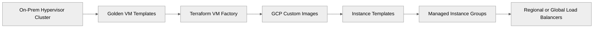
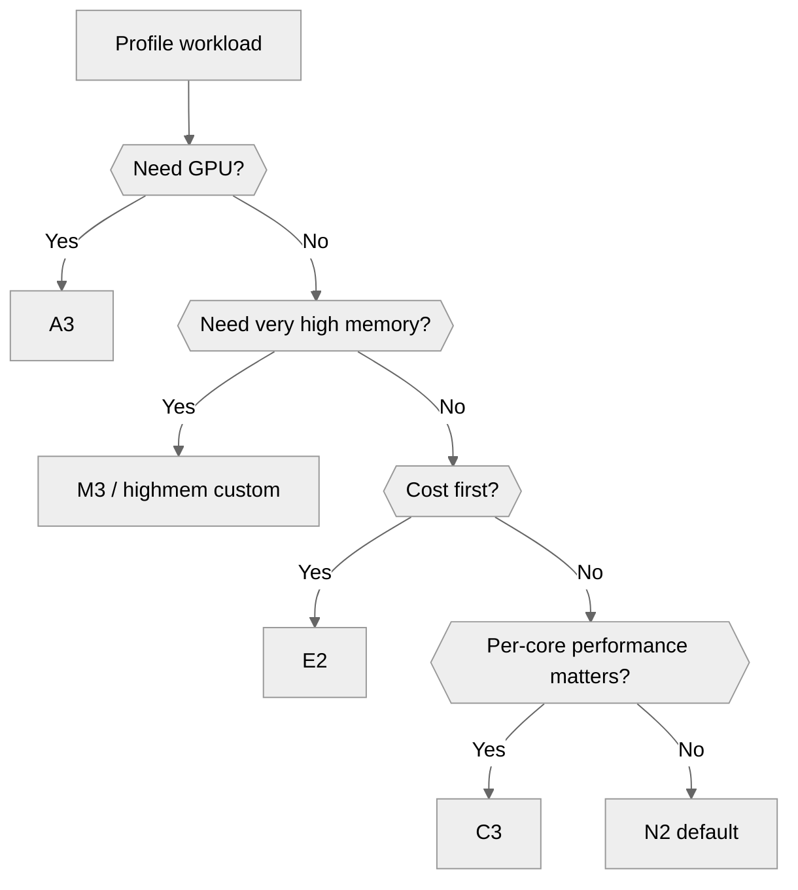
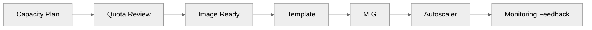
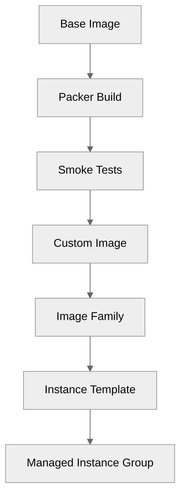

# 01 — Compute and VMs on GCP

> Related on-prem AM references: [`../01-hypervisor-layer.md`](../01-hypervisor-layer.md), [`../05-vm-provisioning-and-hardening.md`](../05-vm-provisioning-and-hardening.md)
>
> Related architecture references: [`../../Architecture/03-cloud-infrastructure.md`](../../Architecture/03-cloud-infrastructure.md), [`../../Architecture/10-high-level-design.md`](../../Architecture/10-high-level-design.md)

## Purpose

This file is the GCP equivalent of the AM **hypervisor layer + VM provisioning** stack. On-prem you built Proxmox, golden templates, and Terraform/Ansible-driven VM creation. On GCP, the replacement pattern is **Compute Engine + custom images + instance templates + Managed Instance Groups + load balancers + Terraform**.

## Compute Engine fundamentals

- You no longer manage a hypervisor cluster or storage multipath for boot disks.
- You still manage capacity, image quality, availability, rollback, and cost posture.
- The normal production path is: **image → template → MIG → health check → load balancer**.
- Compute Engine gives the VM abstraction; your platform work shifts into template versioning, policy, quotas, and autoscaling.



## Machine families

| Family | Typical use | Strength | Caveat |
|--------|-------------|----------|--------|
| E2 | Dev/test, utility VMs, CI runners | Lowest-cost general-purpose | Less premium performance profile |
| N2 | Default production app VMs | Balanced CPU/memory and broad availability | More expensive than E2 |
| C3 | Higher-performance API/web tiers | Better per-core performance | Premium price |
| M3 | Large-memory workloads | Very large RAM footprints | High cost |
| A3 | GPU/AI workloads | Accelerator optimized | Not for standard app tiers |
| Custom types | Fine-grained right-sizing | Avoid overbuying RAM/CPU | Validate ratios |
| Sole-tenant nodes | Isolation/compliance/licensing | Dedicated host placement | Significant premium |

### Recommendation

- **Default app VM**: `n2-standard-8` or `n2-standard-16`.
- **Utility VM**: `e2-standard-4` or `e2-standard-8`.
- **High-throughput API**: `c3-standard-8` or bigger.
- **Memory-heavy service**: large custom `n2-highmem` or `m3` only if metrics justify it.



## Procurement and cost

| Model | Use case | Trade-off |
|------|----------|-----------|
| On-demand | First migrations, unpredictable workloads | Highest unit price |
| SUD | Always-on VMs without formal commitment | Automatic but smaller savings |
| 1-year CUD | Stable production baseline | Good savings, moderate commitment |
| 3-year CUD | Mature steady-state fleet | Best price, least flexible |
| Spot VM | CI, batch, workers, async processing | Interruptible at any time |

### Common price references (USD, typical public list guidance)

| Shape | On-demand | 1-year CUD | 3-year CUD | Notes |
|------|-----------|------------|------------|-------|
| `n2-standard-8` | `$0.3886/hr` | `~$0.245/hr` | `~$0.175/hr` | Balanced production default |
| `e2-standard-8` | `$0.268-$0.312/hr` | `$0.19-$0.23/hr` | `$0.14-$0.17/hr` | Lower-cost utility workloads |
| `c3-standard-8` | `$0.42-$0.48/hr` | `$0.29-$0.34/hr` | `$0.22-$0.26/hr` | Higher performance app tier |
| Spot `n2-standard-8` | `~$0.035-$0.15/hr` | n/a | n/a | 60-91% discount, preemptible |

### Cost takeaways

- `n2-standard-8` for 730 hours is about **$283.68/month** on-demand.
- Three always-on `n2-standard-8` instances are about **$851/month** before disks, LB, logging, and egress.
- The same three under 1-year CUD are about **$536.55/month**.
- Use CUDs for baseline, on-demand for burst, and Spot for disposable work.

## Resource planning

### Example day-one sizing for the ecommerce stack

| Workload | Shape | Count | Growth strategy |
|----------|-------|-------|-----------------|
| Web edge | `n2-standard-8` or `c3-standard-8` | 2-4 | LB utilization or CPU autoscaling |
| BFF/API | `n2-standard-8` | 2-4 | Request-rate scaling |
| Payment isolation VMs | `n2-standard-8` | 2 | Conservative scaling, tighter IAM |
| Legacy adapters | `e2-standard-4` | 1-2 | Manual right-size |
| Build runners | `e2-standard-8` Spot | 0-10 | Queue-depth scaling |
| Utility/admin | `e2-standard-4` | 1-2 | Keep minimal |

### Instance groups

| Group type | Use it when | Why |
|-----------|-------------|-----|
| Managed Instance Group | Standard stateless fleets | Auto-healing, autoscaling, rolling updates |
| Unmanaged Instance Group | Transitional or hand-crafted members | Limited but occasionally useful for migration |

### Autoscaling signals

- CPU utilization for simple stateless services.
- Load balancer utilization or request rate for web/API tiers.
- Queue depth or custom metrics for workers.
- Schedule-based scaling for business-hour peaks or flash sales.

### Quota planning

- vCPU quota per region and family.
- External/internal IP quota.
- SSD persistent disk quota.
- Forwarding rules and load balancer quota.
- Request increases **before** migration waves.



## VM creation methods

### gcloud CLI example

```bash
gcloud compute instances create prod-web-1 \
  --machine-type=n2-standard-8 \
  --zone=us-central1-a \
  --image-family=rocky-linux-9 \
  --image-project=rocky-linux-cloud \
  --boot-disk-size=100GB \
  --boot-disk-type=pd-ssd \
  --network=prod-vpc \
  --subnet=prod-subnet \
  --tags=web-server \
  --service-account=prod-web-sa@PROJECT_ID.iam.gserviceaccount.com \
  --scopes=https://www.googleapis.com/auth/cloud-platform \
  --metadata=enable-oslogin=TRUE \
  --shielded-secure-boot \
  --shielded-vtpm \
  --shielded-integrity-monitoring
```

### Console use

- Good for validation and learning.
- Not acceptable as the long-term source of truth for production.
- Anything created in the console should be captured in Terraform or `gcloud` automation.

### Terraform single-instance example

```hcl
resource "google_compute_instance" "prod_web_1" {
  name         = "prod-web-1"
  machine_type = "n2-standard-8"
  zone         = "us-central1-a"
  tags         = ["web-server"]

  boot_disk {
    initialize_params {
      image = "projects/rocky-linux-cloud/global/images/family/rocky-linux-9"
      size  = 100
      type  = "pd-ssd"
    }
  }

  network_interface {
    subnetwork = google_compute_subnetwork.prod.id
  }

  metadata = {
    enable-oslogin = "TRUE"
  }

  service_account {
    email  = google_service_account.web.email
    scopes = ["cloud-platform"]
  }

  shielded_instance_config {
    enable_secure_boot          = true
    enable_vtpm                 = true
    enable_integrity_monitoring = true
  }
}
```

## Golden image pipeline

### Recommended pattern

**Packer → Custom image → Image family → Instance template → MIG**

- Put OS patching, monitoring agents, baseline packages, and hardening into the image.
- Put environment-specific config into startup scripts or config management.
- Version images with build number, date, and git SHA.
- Keep at least two known-good production images for rollback.



### Complete Packer HCL example for GCE

```hcl
packer {
  required_plugins {
    googlecompute = {
      source  = "github.com/hashicorp/googlecompute"
      version = ">= 1.1.6"
    }
  }
}

source "googlecompute" "rocky9" {
  project_id              = var.project_id
  zone                    = "us-central1-a"
  source_image_family     = "rocky-linux-9"
  source_image_project_id = ["rocky-linux-cloud"]
  image_name              = "rocky9-hardened-{{timestamp}}"
  image_family            = "rocky9-hardened"
  machine_type            = "e2-standard-4"
  ssh_username            = "packer"
  disk_size               = 50
  disk_type               = "pd-ssd"
  use_internal_ip         = true
  omit_external_ip        = true
}

build {
  sources = ["source.googlecompute.rocky9"]

  provisioner "shell" {
    inline = [
      "sudo dnf -y update",
      "sudo dnf -y install chrony google-osconfig-agent google-cloud-ops-agent jq unzip",
      "sudo systemctl enable chronyd",
      "sudo systemctl enable google-osconfig-agent",
      "sudo systemctl enable google-cloud-ops-agent"
    ]
  }
}
```

## Instance templates and Managed Instance Groups (MIG)

### Template creation

```bash
gcloud compute instance-templates create web-template-v1 \
  --machine-type=n2-standard-8 \
  --region=us-central1 \
  --network=prod-vpc \
  --subnet=prod-subnet \
  --boot-disk-size=100GB \
  --boot-disk-type=pd-ssd \
  --image-family=rocky9-hardened-prod \
  --image-project=PROJECT_ID \
  --service-account=prod-web-sa@PROJECT_ID.iam.gserviceaccount.com \
  --metadata=enable-oslogin=TRUE \
  --tags=web-server \
  --shielded-secure-boot \
  --shielded-vtpm \
  --shielded-integrity-monitoring
```

### Regional MIG

```bash
gcloud compute instance-groups managed create web-mig \
  --region=us-central1 \
  --base-instance-name=web \
  --size=3 \
  --template=web-template-v1 \
  --zones=us-central1-a,us-central1-b,us-central1-f
```

### Auto-healing and autoscaling

```bash
gcloud compute health-checks create http web-hc \
  --request-path=/healthz \
  --port=8080

gcloud compute instance-groups managed set-autohealing web-mig \
  --region=us-central1 \
  --health-check=web-hc \
  --initial-delay=300

gcloud compute instance-groups managed set-autoscaling web-mig \
  --region=us-central1 \
  --min-num-replicas=3 \
  --max-num-replicas=12 \
  --target-cpu-utilization=0.65
```

### Rolling updates and canaries

- Create a new template version for every image change.
- Canary 5-10% of the fleet first for high-risk services.
- Use `maxSurge` and `maxUnavailable` conservatively on customer-facing fleets.
- Roll back by switching the MIG back to the previous template.

## Shielded VMs

- **Secure Boot** validates boot-chain integrity.
- **vTPM** enables measured boot/attestation support.
- **Integrity Monitoring** surfaces boot changes.
- This is the GCP equivalent of insisting on trustworthy firmware and guest posture in the AM hypervisor design.

## OS Login

- Stop using metadata-based SSH key sprawl.
- Grant IAM roles such as `roles/compute.osLogin` or `roles/compute.osAdminLogin`.
- Combine with IAP so production VMs do not need public IPs.

## Sole-tenant nodes

### Use them when

- Software licensing depends on host affinity.
- Compliance requires hardware isolation evidence.
- Performance-sensitive appliances cannot tolerate multi-tenant placement.

### Avoid them when

- The requirement is vague or emotional rather than real.
- The workload is standard stateless web/API traffic.
- You have not yet optimized normal VM sizing and reservation choices.

## Complete Terraform example: VPC + template + MIG + LB

```hcl
resource "google_compute_network" "prod" {
  name                    = "prod-vpc"
  auto_create_subnetworks = false
}

resource "google_compute_subnetwork" "prod" {
  name          = "prod-subnet"
  region        = "us-central1"
  network       = google_compute_network.prod.id
  ip_cidr_range = "10.10.30.0/24"
}

resource "google_compute_firewall" "allow_lb_hc" {
  name    = "allow-web-hc"
  network = google_compute_network.prod.name

  allow {
    protocol = "tcp"
    ports    = ["8080"]
  }

  target_tags   = ["web-server"]
  source_ranges = ["130.211.0.0/22", "35.191.0.0/16"]
}

resource "google_compute_region_health_check" "web" {
  name   = "web-hc"
  region = "us-central1"
  http_health_check {
    port         = 8080
    request_path = "/healthz"
  }
}

resource "google_compute_instance_template" "web" {
  name_prefix  = "web-template-"
  machine_type = "n2-standard-8"
  region       = "us-central1"
  tags         = ["web-server"]

  disk {
    source_image = "projects/rocky-linux-cloud/global/images/family/rocky-linux-9"
    auto_delete  = true
    boot         = true
    disk_type    = "pd-ssd"
    disk_size_gb = 100
  }

  network_interface {
    subnetwork = google_compute_subnetwork.prod.id
  }

  metadata = {
    enable-oslogin = "TRUE"
  }
}

resource "google_compute_region_instance_group_manager" "web" {
  name               = "web-mig"
  base_instance_name = "web"
  region             = "us-central1"
  distribution_policy_zones = ["us-central1-a", "us-central1-b", "us-central1-f"]
  version {
    instance_template = google_compute_instance_template.web.id
    name              = "v1"
  }
  target_size = 3
  auto_healing_policies {
    health_check      = google_compute_region_health_check.web.id
    initial_delay_sec = 300
  }
}
```

## Troubleshooting

| Symptom | Likely cause | First checks |
|---------|--------------|--------------|
| `Quota 'CPUS' exceeded` | Regional quota too low | Quotas page, family/region limits |
| `ZONE_RESOURCE_POOL_EXHAUSTED` | Capacity shortage in zone/family | Retry other zone or use reservation |
| Health check fails after deploy | App not listening or firewall missing | Serial console, startup script log, health-check rule |
| IAP SSH denied | Missing IAM or OS Login role | IAM bindings, OS Login metadata |
| Startup script loop | Package repo or metadata issue | Serial port output, cloud-init logs |

### Helpful commands

```bash
gcloud compute instances get-serial-port-output prod-web-1 --zone=us-central1-a
gcloud compute ssh prod-web-1 --zone=us-central1-a --tunnel-through-iap
```

## Mapping back to the AM docs

| AM concept | GCP equivalent |
|-----------|----------------|
| Proxmox cluster | Compute Engine regions/zones |
| Golden VM template | Custom image + image family |
| HA VM restart/migration | MIG auto-healing + zonal spread |
| Hypervisor patching | Hidden provider-managed layer |
| VM factory | Packer + Terraform + instance templates |
