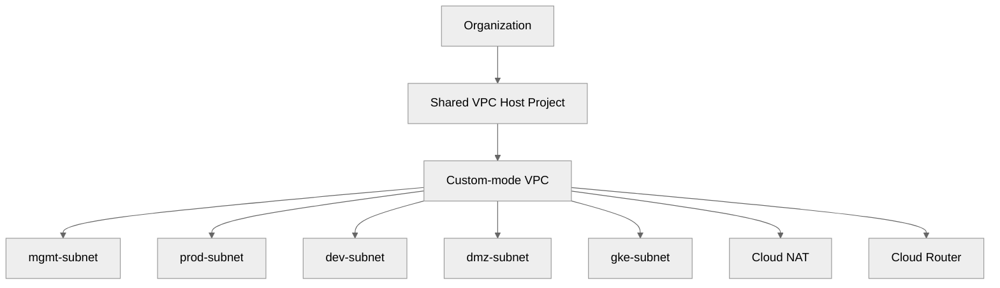
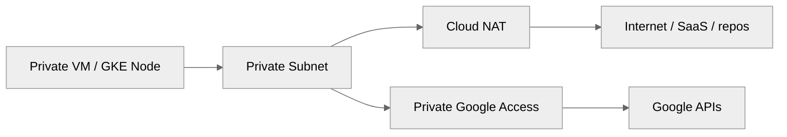
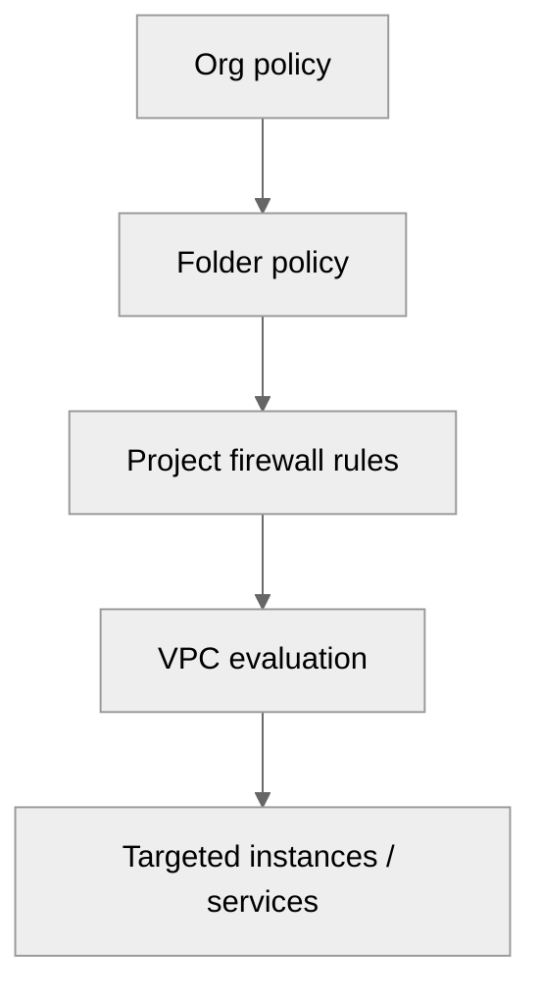
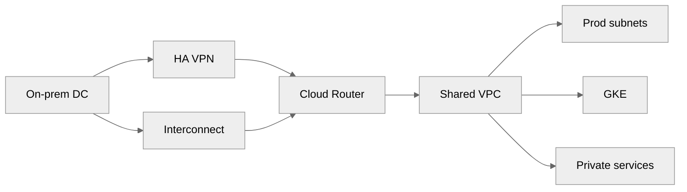

# 02 — Networking on GCP

> Related on-prem AM references: [`../02-network-design.md`](../02-network-design.md), [`../03-firewall-and-security.md`](../03-firewall-and-security.md)
>
> Related architecture references: [`../../Architecture/03-cloud-infrastructure.md`](../../Architecture/03-cloud-infrastructure.md), [`../../Architecture/04-onprem-to-cloud-migration.md`](../../Architecture/04-onprem-to-cloud-migration.md)

## Purpose

This document is the GCP equivalent of the AM **network design + firewall** chapters. Replace VLAN trunks, switch pairs, firewall appliances, and appliance load balancers with **VPC, regional subnets, Cloud Router, Cloud NAT, Google load balancers, VPC firewall rules, hierarchical firewall policies, Cloud Armor, and Cloud DNS**.

## Design stance

- Use **custom-mode VPC**, not auto mode.
- Keep production workloads on **private IPs only** unless a public endpoint is truly required.
- Use **global HTTPS load balancing** for internet-facing HTTP(S) services.
- Use **Cloud NAT** for outbound internet from private VMs and private GKE nodes.
- Use **Shared VPC** if multiple projects need one network governance plane.
- Keep hybrid paths explicit with **HA VPN** or **Interconnect** and BGP via Cloud Router.



## Why custom mode VPC?

- Auto mode creates region subnets you did not design.
- It is the cloud equivalent of letting switch defaults decide segmentation.
- Custom mode keeps the CIDR plan aligned to the AM VLAN model.
- Shared VPC later becomes easier because intent is explicit from day one.

## Shared VPC vs standalone VPC

| Pattern | Use it when | Benefits | Caveats |
|---------|-------------|----------|---------|
| Standalone VPC | Small single-project environment | Simple ownership | Harder to centralize governance later |
| Shared VPC | Platform team manages networking for multiple service projects | Central policy and fewer duplicated network assets | Requires IAM/project discipline |

## Subnet strategy mapped from on-prem VLANs

| On-Prem VLAN | GCP Subnet | CIDR | Purpose |
|-------------|-----------|------|---------|
| MGMT (10) | `mgmt-subnet` | `10.10.10.0/24` | Admin tools, IAP targets, utility hosts |
| Storage (20) | n/a | n/a | PD/Filestore/Cloud Storage are provider-managed |
| VM-Prod (30) | `prod-subnet` | `10.10.30.0/24` | Production GCE workloads |
| VM-Dev (40) | `dev-subnet` | `10.10.40.0/24` | Dev and staging workloads |
| DMZ (50) | `dmz-subnet` | `10.10.50.0/24` | Public-facing appliances only when required |
| K8S (60) | `gke-subnet` | `10.10.60.0/24` | GKE nodes + secondary ranges |

### GKE secondary ranges

| Range | Example CIDR | Why |
|------|---------------|-----|
| Pods | `10.20.0.0/14` | Large headroom for pod IPs |
| Services | `10.24.0.0/20` | Stable service virtual IPs |

### Terraform VPC example

```hcl
resource "google_compute_network" "shared" {
  name                    = "shared-prod-vpc"
  auto_create_subnetworks = false
  routing_mode            = "GLOBAL"
}

resource "google_compute_subnetwork" "prod" {
  name                     = "prod-subnet"
  region                   = "us-central1"
  network                  = google_compute_network.shared.id
  ip_cidr_range            = "10.10.30.0/24"
  private_ip_google_access = true
}

resource "google_compute_subnetwork" "gke" {
  name                     = "gke-subnet"
  region                   = "us-central1"
  network                  = google_compute_network.shared.id
  ip_cidr_range            = "10.10.60.0/24"
  private_ip_google_access = true

  secondary_ip_range {
    range_name    = "gke-pods"
    ip_cidr_range = "10.20.0.0/14"
  }

  secondary_ip_range {
    range_name    = "gke-services"
    ip_cidr_range = "10.24.0.0/20"
  }
}
```

## Private Google Access

- Turn it on for private subnets hosting VMs and GKE nodes.
- It lets workloads reach Google APIs without external IPs.
- It is critical for Artifact Registry pulls, OS Config, Cloud Storage, and many managed-service calls from private nodes.

## Cloud NAT

Cloud NAT is the cloud equivalent of the outbound NAT function on the on-prem firewall.

### gcloud example

```bash
gcloud compute routers create prod-router \
  --network=shared-prod-vpc \
  --region=us-central1

gcloud compute routers nats create prod-nat \
  --router=prod-router \
  --region=us-central1 \
  --nat-all-subnet-ip-ranges \
  --auto-allocate-nat-external-ips \
  --enable-logging
```

### Terraform example

```hcl
resource "google_compute_router" "prod" {
  name    = "prod-router"
  network = google_compute_network.shared.id
  region  = "us-central1"
}

resource "google_compute_router_nat" "prod" {
  name                               = "prod-nat"
  router                             = google_compute_router.prod.name
  region                             = google_compute_router.prod.region
  nat_ip_allocate_option             = "AUTO_ONLY"
  source_subnetwork_ip_ranges_to_nat = "ALL_SUBNETWORKS_ALL_IP_RANGES"
}
```



## Cloud Router and hybrid routing

- Use Cloud Router with HA VPN or Interconnect for BGP route exchange.
- Advertise only the exact prefixes that on-prem actually needs.
- Keep hybrid routing dynamic instead of hard-coded wherever possible.

## Load balancing

| Need | Recommended LB | Why |
|------|----------------|-----|
| Public web apps | External global HTTP(S) LB | Global anycast IP, CDN, Cloud Armor, managed certs |
| Internal HTTP services | Internal HTTP(S) LB | Private L7 routing |
| Internal TCP/UDP | Internal passthrough LB | Simple private traffic distribution |
| Public raw TCP/UDP | External passthrough Network LB | For non-HTTP public services |

```mermaid
%%{init:{"theme":"neutral"}}%%
flowchart TD
    A[New service] --> B{{HTTP or HTTPS?}}
    B -->|Yes public| C[External global HTTP(S) LB]
    B -->|Yes internal| D[Internal HTTP(S) LB]
    B -->|No internal| E[Internal passthrough LB]
    B -->|No public| F[External passthrough LB]
```

### External HTTP(S) LB example

```bash
gcloud compute addresses create web-lb-ip --global

gcloud compute health-checks create http web-hc \
  --request-path=/healthz \
  --port=8080

gcloud compute backend-services create web-backend \
  --global \
  --protocol=HTTP \
  --port-name=http \
  --health-checks=web-hc \
  --enable-cdn
```

### Internal TCP LB Terraform example

```hcl
resource "google_compute_region_backend_service" "internal_api" {
  name                  = "internal-api"
  region                = "us-central1"
  protocol              = "TCP"
  load_balancing_scheme = "INTERNAL"
}
```

## Firewall rules

### VPC firewall basics

| Property | What to remember |
|----------|------------------|
| Direction | Ingress or egress |
| Priority | Lower number wins |
| Targets | Tags or service accounts |
| Sources | CIDRs, tags, or service accounts |
| Action | Allow or deny |

### Strategy

- Default deny ingress.
- Allow only known east-west flows.
- Prefer **service accounts** as targets when identity consistency matters.
- Explicitly allow Google probe ranges for LB health checks.

### Example rules

```bash
gcloud compute firewall-rules create allow-ssh-from-iap \
  --network=shared-prod-vpc \
  --direction=INGRESS \
  --action=ALLOW \
  --rules=tcp:22 \
  --source-ranges=35.235.240.0/20 \
  --target-tags=ssh-iap

gcloud compute firewall-rules create allow-web-health-checks \
  --network=shared-prod-vpc \
  --direction=INGRESS \
  --action=ALLOW \
  --rules=tcp:8080 \
  --source-ranges=130.211.0.0/22,35.191.0.0/16 \
  --target-tags=web-server
```

### Hierarchical firewall policies

- Apply org/folder guardrails once.
- Let projects add only the minimal service-specific rules.
- Use them as the cloud replacement for upstream global firewall governance.



## Cloud Armor

### Use cases

- OWASP Top 10 rule sets.
- Geo-blocking.
- Rate limiting.
- Adaptive protection for attacks.

### Example commands

```bash
gcloud compute security-policies create web-armor-policy

gcloud compute security-policies rules create 1000 \
  --security-policy=web-armor-policy \
  --expression="evaluatePreconfiguredWaf('xss-v33-stable')" \
  --action=deny-403
```

## Cloud DNS

| Zone type | Example | Purpose |
|----------|---------|---------|
| Public | `example.com` | Customer-facing DNS |
| Private | `prod.internal.` | Internal service discovery |
| Forwarding / peered | `onprem.local.` | Hybrid resolution to on-prem DNS |

```bash
gcloud dns managed-zones create prod-private-zone \
  --dns-name=prod.internal. \
  --visibility=private \
  --networks=shared-prod-vpc
```

## Hybrid connectivity

| Option | Best for | Notes |
|-------|----------|-------|
| HA VPN | Early migration and moderate bandwidth | Fastest and cheapest to start |
| Partner Interconnect | Mid-range enterprise private connectivity | Depends on provider |
| Dedicated Interconnect | High steady throughput | Best latency predictability |



## Network Intelligence Center

- Use **Connectivity Tests** before guessing.
- Use **Topology** view to validate VPN, routes, and service paths.
- Use **Firewall Insights** to find shadowed or unused rules.
- Use **Performance Dashboard** for packet loss and latency investigation.

## Cost notes

- Internet egress often lands around **$0.08-$0.12/GB** depending on destination and region.
- Cloud NAT is billed for gateway and processed data.
- HTTP(S) load balancing has forwarding-rule, proxy, and data-processing charges.
- VPN and Interconnect add attachment/tunnel/traffic costs.

## Mapping back to the AM docs

| AM concept | GCP equivalent |
|-----------|----------------|
| VLAN design | Regional subnets + secondary ranges |
| Managed switches | Google-managed SDN fabric |
| Hardware firewall | VPC firewall + hierarchical policy + Cloud Armor |
| NAT on firewall | Cloud NAT |
| Router BGP | Cloud Router |
| DMZ | Global LB edge + very limited public subnet use |
