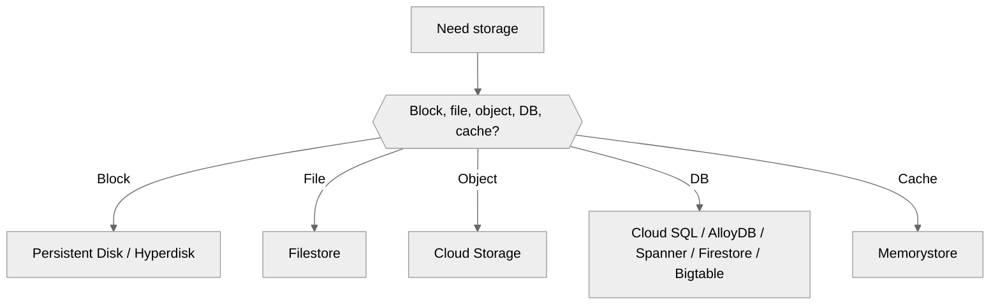
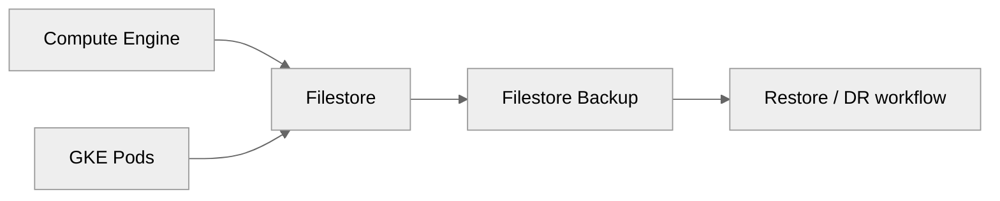
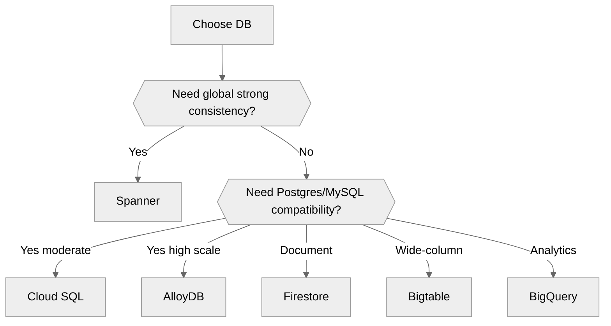
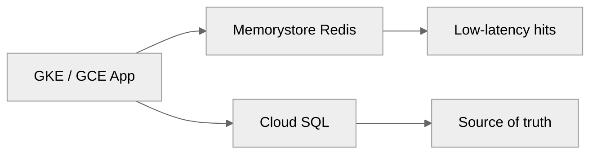

# 03 — Storage and Databases on GCP

> Related on-prem AM references: [`../04-shared-storage.md`](../04-shared-storage.md), [`../05-vm-provisioning-and-hardening.md`](../05-vm-provisioning-and-hardening.md)
>
> Related architecture references: [`../../Architecture/03-cloud-infrastructure.md`](../../Architecture/03-cloud-infrastructure.md), [`../../Architecture/10-high-level-design.md`](../../Architecture/10-high-level-design.md)

## Purpose

This document is the GCP equivalent of the AM **shared storage** chapter. The goal is to map NFS, iSCSI, SAN/NAS, snapshot policy, and database placement into **Persistent Disk, Hyperdisk, Filestore, Cloud Storage, Cloud SQL, AlloyDB, Spanner, Firestore, Bigtable, BigQuery, and Memorystore**.

## Storage decision matrix

| Need | GCP Service | Type | Performance | Cost |
|------|-----------|------|-------------|------|
| VM boot/data disk | Persistent Disk / Hyperdisk | Block | Up to high IOPS with tier tuning | `$0.04-$0.17+/GB/mo` |
| Shared filesystem (NFS) | Filestore | File | Tier-dependent, up to very high IOPS | `$0.16-$0.30/GB/mo` |
| Backups / images / media | Cloud Storage | Object | Durable and lifecycle-managed | `$0.02-$0.026/GB/mo` Standard regional |
| Relational DB | Cloud SQL / AlloyDB / Spanner | Managed DB | Engine-specific | Varies |
| Data warehouse | BigQuery | Columnar/serverless | High analytics scale | `$5/TB queried` |
| Cache | Memorystore | In-memory | Sub-ms | Tier-dependent |



## Persistent Disk deep-dive

### Disk types

| Disk type | Best for | Notes |
|----------|----------|-------|
| `pd-standard` | Large, cheaper, sequential workloads | HDD-backed |
| `pd-balanced` | Default general-purpose VM disks | Good first choice |
| `pd-ssd` | App and database disks needing lower latency | Often about `$0.17/GB/mo` |
| `pd-extreme` | Provisioned-IOPS DB workloads | Expensive and specialized |
| Hyperdisk | Decoupled capacity/performance tuning | Useful for mature performance engineering |

### Rules of thumb

- Use `pd-balanced` for most general-purpose Linux VMs.
- Use `pd-ssd` for order, payment, and search tiers.
- Keep boot disks small and immutable.
- Use separate data disks for stateful workloads when practical.
- Use regional persistent disk only when a classic active/passive VM design still makes sense.

### gcloud examples

```bash
gcloud compute disks create order-db-data \
  --type=pd-ssd \
  --size=500GB \
  --zone=us-central1-a

gcloud compute instances attach-disk order-db-1 \
  --disk=order-db-data \
  --zone=us-central1-a

gcloud compute disks resize order-db-data \
  --size=750GB \
  --zone=us-central1-a
```

### Snapshot schedule

```bash
gcloud compute resource-policies create snapshot-schedule daily-prod-snaps \
  --region=us-central1 \
  --max-retention-days=14 \
  --start-time=02:00 \
  --daily-schedule
```

### Terraform example

```hcl
resource "google_compute_disk" "order_db_data" {
  name  = "order-db-data"
  type  = "pd-ssd"
  zone  = "us-central1-a"
  size  = 500
}
```

## Filestore — NFS replacement

| Tier | Best for | Notes |
|------|----------|-------|
| Basic HDD | Low-cost shared files, dev/test, backup landing | Lowest price tier |
| Basic SSD | Better performance shared file workloads | Higher price |
| Zonal | Production NFS | Better SLA/perf |
| Enterprise | Highest-end shared file needs | Premium tier |

### Good Filestore use cases

- Shared media/uploads for the storefront.
- `ReadWriteMany` GKE volumes.
- Lift-and-shift apps that still expect POSIX file sharing.

### Create and mount Filestore

```bash
gcloud filestore instances create ecommerce-share \
  --zone=us-central1-b \
  --tier=BASIC_HDD \
  --file-share=name=shared,size=1024GB \
  --network=name=shared-prod-vpc
```

```bash
sudo dnf -y install nfs-utils
sudo mkdir -p /mnt/shared
sudo mount -o rw,nconnect=4,hard,timeo=600,retrans=2 10.10.70.2:/shared /mnt/shared
```

### Filestore CSI for GKE

```yaml
apiVersion: storage.k8s.io/v1
kind: StorageClass
metadata:
  name: filestore-rwx
provisioner: filestore.csi.storage.gke.io
parameters:
  tier: basic_hdd
  network: shared-prod-vpc
reclaimPolicy: Retain
allowVolumeExpansion: true
```



## Cloud Storage

### Classes

| Class | Best for | Pricing posture |
|------|----------|-----------------|
| Standard | Active backups, media, assets | `$0.02-$0.026/GB/mo` regional |
| Nearline | Monthly-ish access | Lower storage, retrieval fee |
| Coldline | Quarterly access | Lower storage, higher retrieval fee |
| Archive | Long retention, rare access | Lowest storage cost |

### Features that matter

- Lifecycle rules.
- Object versioning.
- Retention policies and object lock.
- Uniform bucket-level access.
- Signed URLs.

### Commands

```bash
gcloud storage buckets create gs://ecommerce-prod-assets \
  --location=us-central1 \
  --default-storage-class=STANDARD \
  --uniform-bucket-level-access

gcloud storage rsync ./images gs://ecommerce-prod-assets/images --recursive
```

## Database services

| Workload shape | Recommended service | Why |
|---------------|---------------------|-----|
| Standard PostgreSQL/MySQL with HA | Cloud SQL | Managed, private IP, backups, replicas |
| PostgreSQL needing more scale/perf | AlloyDB | Higher performance, analytics-friendly |
| Global strong consistency | Spanner | Horizontal scale + 99.999% SLA |
| Document data | Firestore | Serverless document model |
| Wide-column/time-series | Bigtable | Massive scale |
| Analytics | BigQuery | Serverless warehouse |



### Cloud SQL best practices

- Use private IP only in production.
- Turn on HA/regional availability for order, payment, and auth data.
- Enable automated backups and PITR.
- Use read replicas for read-heavy services.
- Monitor query insights and connection limits.

### Cloud SQL Terraform example

```hcl
resource "google_sql_database_instance" "orders" {
  name             = "orders-pg-prod"
  database_version = "POSTGRES_15"
  region           = "us-central1"

  settings {
    tier              = "db-custom-4-16384"
    availability_type = "REGIONAL"
    disk_type         = "PD_SSD"
    disk_size         = 200

    backup_configuration {
      enabled                        = true
      point_in_time_recovery_enabled = true
      start_time                     = "02:00"
    }

    ip_configuration {
      ipv4_enabled    = false
      private_network = google_compute_network.shared.id
      require_ssl     = true
    }
  }
}
```

## Memorystore

### Use it for

- Session caching.
- Cart caching.
- Rate limiting counters.
- Search/result cache.

### Notes

- Use Redis for most workloads.
- Keep private IP only.
- Turn on HA only for caches that materially affect user experience.



## Migration from on-prem storage

| Tool | Best for | Notes |
|------|----------|-------|
| Transfer Appliance | Massive offline data seeding | Use when WAN is too slow |
| Storage Transfer Service | Online scheduled movement | Good for object/file workflows |
| `gcloud storage rsync` / `gsutil rsync` | Smaller scripted migrations | Simple and direct |
| Database Migration Service | MySQL/Postgres/SQL Server migrations | Replication + cutover support |
| Migrate to VMs | Transitional VM migration | Not usually final state |

### Migration workflow

1. Classify data into block, file, object, relational, and cache categories.
2. Map each dataset to PD, Filestore, Cloud Storage, Cloud SQL, or another target.
3. Seed large static datasets first.
4. Replicate transactional data and plan cutover.
5. Validate consistency and backup before decommissioning on-prem dependencies.

## Cost optimization

- Use `pd-balanced` by default and upgrade only when metrics justify it.
- Avoid overprovisioning Filestore for occasional RWX needs.
- Lifecycle cold data in Cloud Storage.
- Right-size Cloud SQL vCPU/RAM and use CUDs where stable.
- Cache only the hot working set in Memorystore.

## Mapping back to the AM docs

| AM concept | GCP equivalent |
|-----------|----------------|
| NFS share | Filestore |
| iSCSI LUN | Persistent Disk / Hyperdisk |
| SAN snapshots | Disk snapshots, Cloud SQL backups, bucket versioning |
| Backup NAS | Cloud Storage |
| DB VM cluster | Cloud SQL / AlloyDB / Spanner |
