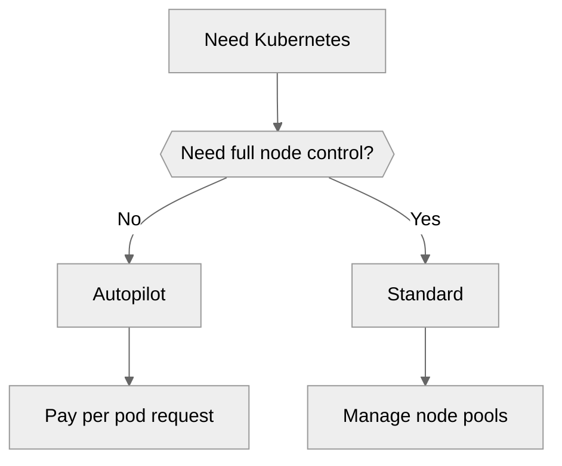
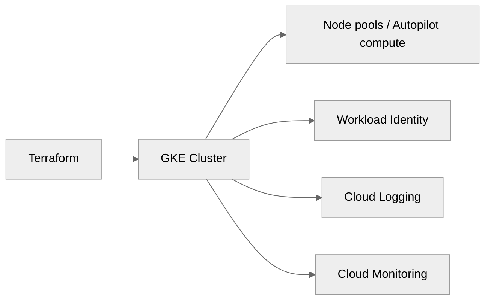
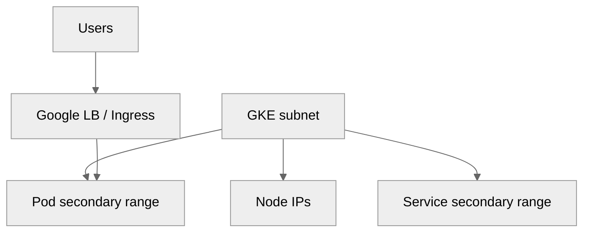
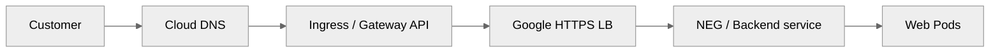
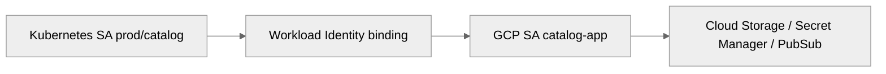

# 04 — GKE Kubernetes on Google Cloud

> Related on-prem AM references: [`../09-kubernetes-deployment.md`](../09-kubernetes-deployment.md), [`../07-containers-and-monitoring.md`](../07-containers-and-monitoring.md)
>
> Related architecture references: [`../../Architecture/02-kubernetes-architecture.md`](../../Architecture/02-kubernetes-architecture.md), [`../../Architecture/03-cloud-infrastructure.md`](../../Architecture/03-cloud-infrastructure.md), [`../../Architecture/10-high-level-design.md`](../../Architecture/10-high-level-design.md)

## Purpose

This document is the GCP equivalent of the AM **Kubernetes deployment** guide. The on-prem version uses kubeadm, HAProxy, keepalived, Calico, MetalLB, and shared storage. On GCP, the preferred model is **GKE Autopilot or GKE Standard**, with **VPC-native networking, Google load balancing, Workload Identity, Artifact Registry, Cloud Operations, and Backup for GKE**.

## GKE modes

| Feature | GKE Standard | GKE Autopilot |
|---------|-------------|---------------|
| Node management | You manage node pools | Google manages nodes |
| Pricing | Pay per node | Pay per pod resource request |
| Node pools | Full control | Automatic |
| GPU/TPU | Supported | Supported |
| System pods | Your cost | Google’s cost |
| Best for | Custom node config and special hardware | Hands-off platform operations |

### Recommendation

- Use **Autopilot for most workloads** because it removes node toil and usually improves cost hygiene.
- Use **Standard** when you need custom daemonsets, special node pools, local SSD, or unusual kernel/node tuning.



## Cluster creation

### Autopilot with gcloud

```bash
gcloud container clusters create-auto ecommerce-auto \
  --region=us-central1 \
  --network=shared-prod-vpc \
  --subnetwork=gke-subnet \
  --release-channel=regular \
  --workload-pool=PROJECT_ID.svc.id.goog
```

### Standard private cluster with gcloud

```bash
gcloud container clusters create ecommerce-standard \
  --region=us-central1 \
  --release-channel=regular \
  --enable-ip-alias \
  --network=shared-prod-vpc \
  --subnetwork=gke-subnet \
  --cluster-secondary-range-name=gke-pods \
  --services-secondary-range-name=gke-services \
  --enable-private-nodes \
  --enable-private-endpoint \
  --master-ipv4-cidr=172.16.0.0/28 \
  --workload-pool=PROJECT_ID.svc.id.goog
```

## Terraform cluster example

```hcl
resource "google_container_cluster" "prod" {
  name     = "ecommerce-prod"
  location = "us-central1"
  network    = google_compute_network.shared.id
  subnetwork = google_compute_subnetwork.gke.id
  release_channel {
    channel = "REGULAR"
  }
  networking_mode = "VPC_NATIVE"
  ip_allocation_policy {
    cluster_secondary_range_name  = "gke-pods"
    services_secondary_range_name = "gke-services"
  }
  private_cluster_config {
    enable_private_nodes    = true
    enable_private_endpoint = false
    master_ipv4_cidr_block  = "172.16.0.0/28"
  }
  workload_identity_config {
    workload_pool = "${var.project_id}.svc.id.goog"
  }
}
```



## Networking for GKE

### VPC-native clusters

- Always use alias IP-based VPC-native clusters.
- Plan pod and service ranges up front.
- This replaces hand-managed overlay CIDR design in kubeadm estates.

### Secondary IP planning

| Range type | Example | Capacity note |
|-----------|---------|---------------|
| Nodes | `/24` | up to 254 node IPs |
| Pods | `/14` | large pod headroom |
| Services | `/20` | thousands of service IPs |

### Network policy

- Use Kubernetes NetworkPolicies for east-west controls.
- Keep cloud firewall and cluster network policy aligned.
- Prefer Dataplane V2 when available.



## Ingress and load balancing

- GKE Ingress creates Google Cloud load balancers.
- Gateway API is the forward-looking path for richer traffic policy.
- Cloud Armor protects at the LB layer.
- Managed certificates remove most manual TLS work.

### ManagedCertificate + BackendConfig + Ingress

```yaml
apiVersion: networking.gke.io/v1
kind: ManagedCertificate
metadata:
  name: web-cert
  namespace: prod
spec:
  domains:
    - shop.example.com
---
apiVersion: cloud.google.com/v1
kind: BackendConfig
metadata:
  name: web-backendconfig
  namespace: prod
spec:
  healthCheck:
    requestPath: /healthz
    port: 8080
    type: HTTP
  securityPolicy:
    name: web-armor-policy
  cdn:
    enabled: true
---
apiVersion: networking.k8s.io/v1
kind: Ingress
metadata:
  name: web-ingress
  namespace: prod
  annotations:
    kubernetes.io/ingress.class: "gce"
    networking.gke.io/managed-certificates: web-cert
spec:
  rules:
    - host: shop.example.com
      http:
        paths:
          - path: /
            pathType: Prefix
            backend:
              service:
                name: web
                port:
                  number: 80
```



## Storage for GKE

| Need | Recommended class |
|------|-------------------|
| Default app PVC | PD-backed `standard-rwo` / `premium-rwo` |
| Faster volume | SSD-backed PD class |
| ReadWriteMany | Filestore CSI |
| Object-style mount | GCS FUSE where justified |

### PVC example

```yaml
apiVersion: v1
kind: PersistentVolumeClaim
metadata:
  name: orders-data
  namespace: prod
spec:
  accessModes:
    - ReadWriteOnce
  storageClassName: premium-rwo
  resources:
    requests:
      storage: 100Gi
```

## Security

### Workload Identity

- Map Kubernetes service accounts to Google service accounts.
- Do not mount long-lived JSON key files in pods.
- Grant only the minimal IAM role required per workload.

```bash
gcloud iam service-accounts add-iam-policy-binding \
  catalog-app@PROJECT_ID.iam.gserviceaccount.com \
  --role=roles/iam.workloadIdentityUser \
  --member="serviceAccount:PROJECT_ID.svc.id.goog[prod/catalog]"
```



### Other controls

- Binary Authorization for signed image enforcement.
- GKE Sandbox for less-trusted workloads.
- Pod Security Standards.
- Secret Manager integration.
- Private cluster + authorized networks.

## Observability and cost optimization

- Cloud Logging auto-collects container logs.
- Cloud Monitoring gives cluster, node, and pod dashboards.
- Managed Prometheus supports PromQL workflows.
- Autopilot bills pod requests, so right-size requests carefully.
- Use Spot Pods or spot-backed node pools for fault-tolerant workers.
- Use HPA, Cluster Autoscaler, and VPA wisely.

## Day-2 operations

- Use maintenance windows and release channels.
- Practice upgrades in stage first.
- Use Backup for GKE for namespace/workload recovery.
- Combine `kubectl`, GKE console, and Cloud Logging during incidents.

## Deploying the ecommerce app on GKE

### Namespace strategy

| Namespace | Purpose |
|-----------|---------|
| `prod` | Customer-facing production workloads |
| `staging` | Pre-production validation |
| `monitoring` | Observability tooling |

### Example manifests

```yaml
apiVersion: v1
kind: Namespace
metadata:
  name: prod
---
apiVersion: apps/v1
kind: Deployment
metadata:
  name: web
  namespace: prod
spec:
  replicas: 3
  selector:
    matchLabels:
      app: web
  template:
    metadata:
      labels:
        app: web
    spec:
      containers:
        - name: web
          image: us-central1-docker.pkg.dev/PROJECT_ID/ecommerce/web:1.0.0
          ports:
            - containerPort: 8080
          resources:
            requests:
              cpu: "500m"
              memory: "512Mi"
---
apiVersion: autoscaling/v2
kind: HorizontalPodAutoscaler
metadata:
  name: web
  namespace: prod
spec:
  scaleTargetRef:
    apiVersion: apps/v1
    kind: Deployment
    name: web
  minReplicas: 3
  maxReplicas: 12
  metrics:
    - type: Resource
      resource:
        name: cpu
        target:
          type: Utilization
          averageUtilization: 65
```

## Mapping back to the AM docs

| AM kubeadm concept | GKE equivalent |
|--------------------|----------------|
| HAProxy + keepalived API VIP | Managed GKE control plane endpoint |
| kubeadm cluster init/join | `gcloud` / Terraform cluster creation |
| Calico / CNI install | GKE-native networking / Dataplane V2 |
| MetalLB | Google Cloud load balancing |
| NFS CSI on VMs | Filestore CSI / PD CSI |
| Service account secrets | Workload Identity |
