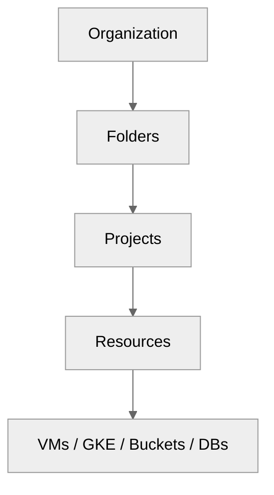
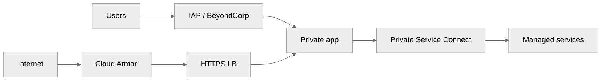
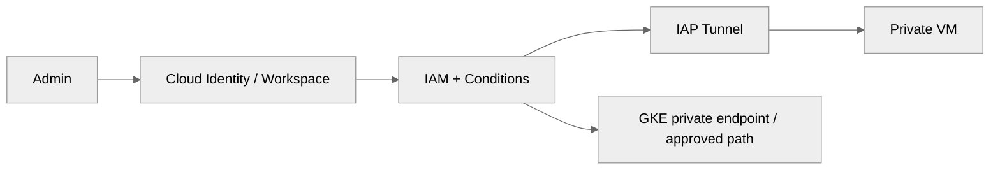
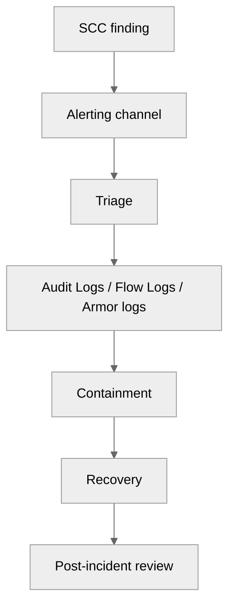

# 05 — Security and IAM on GCP

> Related on-prem AM references: [`../03-firewall-and-security.md`](../03-firewall-and-security.md), [`../06-linux-os-layer.md`](../06-linux-os-layer.md)
>
> Related architecture references: [`../../Architecture/03-cloud-infrastructure.md`](../../Architecture/03-cloud-infrastructure.md), [`../../Architecture/04-onprem-to-cloud-migration.md`](../../Architecture/04-onprem-to-cloud-migration.md)

## Purpose

This document is the GCP equivalent of the AM **firewall + VM hardening** baseline. The cloud-native model centers on **resource hierarchy, IAM, organization policies, IAP, OS Login, Cloud Armor, VPC Service Controls, Secret Manager, Cloud KMS, Audit Logs, and Security Command Center**.

## IAM fundamentals

### Resource hierarchy

- **Organization** is the top security boundary.
- **Folders** group environments or business units.
- **Projects** isolate workloads, quotas, and many billing views.
- **Resources** inherit policy downward.



### Role strategy

| Role type | Guidance |
|----------|----------|
| Basic roles | Avoid in production except controlled break-glass |
| Predefined roles | Use by default |
| Custom roles | Use when predefined roles are too broad |

### Service account rules

- One service account per service or trust boundary where practical.
- Avoid long-lived key files.
- Prefer attached GCE service accounts and GKE Workload Identity.
- Review grants with IAM Recommender.

## IAM Conditions

- Use time-bound elevated access for change windows.
- Use resource-based scoping for sensitive admin actions.
- Tie environment access cleanly to folder/project structure.

## Organization policies

### Recommended baseline controls

- Restrict VM external IPs.
- Restrict public Cloud Storage buckets.
- Require OS Login.
- Restrict allowed resource locations.
- Require Shielded VMs.
- Disable service account key creation when ready.

### Example org policy

```yaml
name: organizations/123456789/policies/compute.requireOsLogin
spec:
  rules:
    - enforce: true
```

## Network security beyond firewall rules

- **VPC Service Controls** reduce data exfiltration risk.
- **Private Google Access** and **Private Service Connect** keep service access private.
- **Cloud Armor** handles DDoS and WAF controls.
- **Certificate Manager** centralizes TLS lifecycle.
- **BeyondCorp Enterprise** supports zero-trust access patterns.



## Identity and access

### OS Login

- SSH authorization is moved to IAM.
- Supports 2FA through identity controls.
- Prevents stale SSH keys from lingering in metadata.

### IAP

- Provides SSH, RDP, and HTTPS access without public IPs.
- Replaces many bastion-host use cases.
- Reduces attack surface for admin paths.

```bash
gcloud compute ssh admin-vm \
  --zone=us-central1-a \
  --tunnel-through-iap
```



## Data security

### Encryption

- At-rest encryption is enabled by default.
- Use **CMEK** with Cloud KMS when key ownership separation matters.
- Use **CSEK** only for edge cases because ops complexity rises sharply.

### Secret Manager

- Store DB passwords, API tokens, signing keys, and third-party credentials here.
- Control access with IAM.
- Rotate on schedule or on demand.

```bash
echo -n "super-secret-value" | gcloud secrets create payment-api-key --data-file=-
```

### DLP API

- Scan buckets, databases, and data flows for PII.
- Use for discovery/redaction programs during migration or compliance work.

## Compliance and audit

| Control area | GCP service |
|-------------|-------------|
| Audit trail | Cloud Audit Logs |
| Threat and posture | Security Command Center |
| Controlled environments | Assured Workloads |
| Key custody | Cloud KMS / HSM |
| Benchmark alignment | CIS GCP benchmark + SCC findings |

### Audit log types

- Admin Activity
- Data Access
- System Event
- Policy Denied

## Incident response

1. Security Command Center finding arrives.
2. Alert routes to pager/Slack/ticket.
3. Triage with Audit Logs, VPC Flow Logs, and Cloud Armor logs.
4. Contain with IAM revoke, firewall change, or LB policy update.
5. Preserve evidence and document timeline.



## Production baseline

- Folder/project separation for prod and non-prod.
- Org policies enforced before first production workload.
- No public IPs on app/database VMs unless there is a reviewed exception.
- IAP + OS Login for admin access.
- Secret Manager + CMEK for sensitive workloads.
- SCC Premium where posture and threat visibility matter.

## Mapping back to the AM docs

| AM concept | GCP equivalent |
|-----------|----------------|
| Bastion host | IAP |
| SSH key distribution | OS Login + IAM |
| Firewall appliance + host rules | VPC firewall + Cloud Armor + org policy |
| Vaulted secrets on hosts | Secret Manager |
| CIS hardening evidence | SCC + org policies + Shielded VMs + audit logs |
