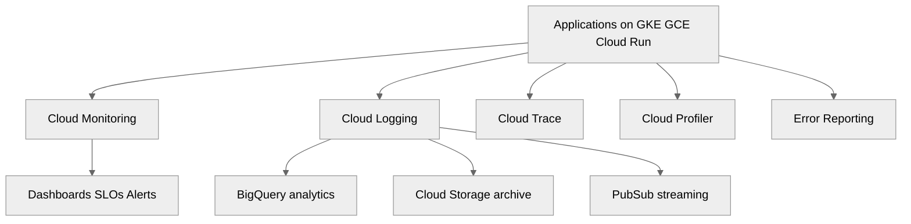
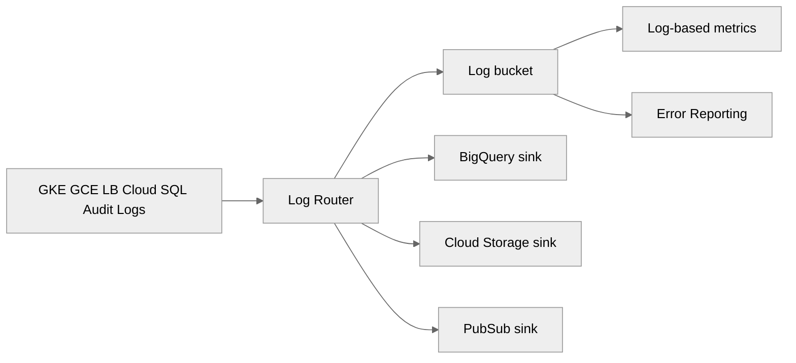
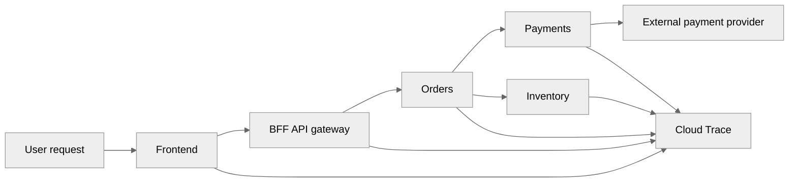
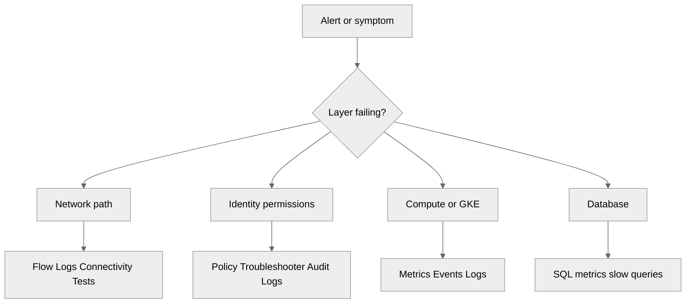
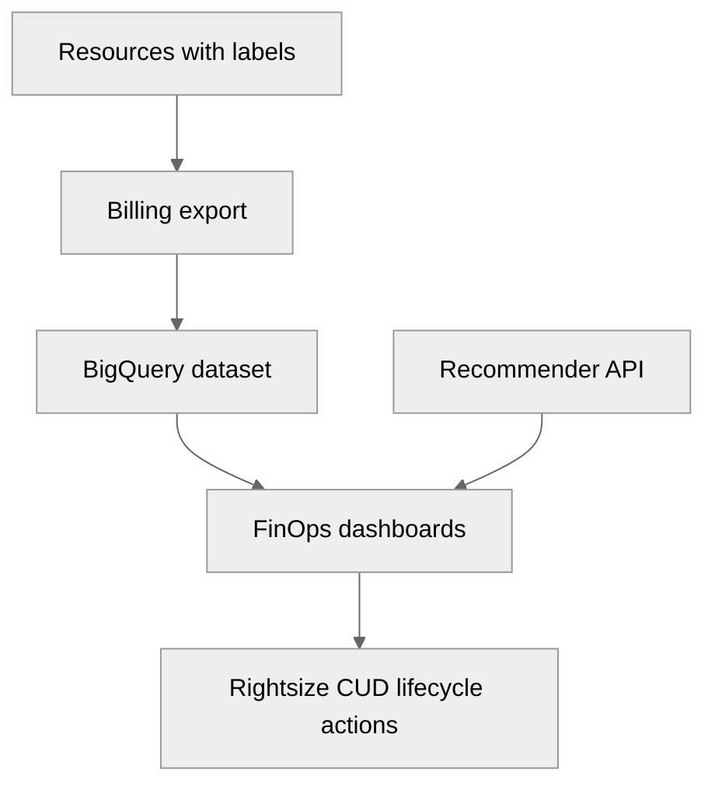
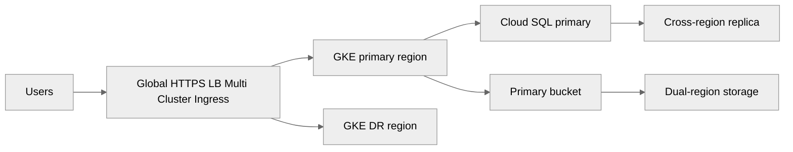

# 06 — Monitoring and Operations on GCP

> Related on-prem AM references: [`../07-containers-and-monitoring.md`](../07-containers-and-monitoring.md), [`../08-troubleshooting-guide.md`](../08-troubleshooting-guide.md), [`../09-kubernetes-deployment.md`](../09-kubernetes-deployment.md)
>
> Related GCP guides in this directory: [`README.md`](./README.md), [`04-gke-kubernetes.md`](./04-gke-kubernetes.md), [`05-security-and-iam.md`](./05-security-and-iam.md)

## Purpose

This document is the GCP equivalent of the AM **containers + monitoring + troubleshooting** baseline.

The on-prem AM pattern uses Prometheus, Grafana, Alertmanager, EFK/OpenSearch, bastion-led troubleshooting, hand-built CI/CD helpers, and storage-backed DR runbooks.

On GCP, the preferred operating model is:

- **Cloud Operations Suite** for metrics, logs, traces, profiling, and error grouping.
- **Managed Service for Prometheus** when teams already use PromQL heavily.
- **Cloud Build + Artifact Registry + Cloud Deploy** for software delivery.
- **Billing export + Budgets + Recommender** for FinOps.
- **Regional design + managed backup features + multi-cluster options** for DR.
- **Terraform first** for repeatable operations.

## Operating principles

- Prefer managed telemetry pipelines over self-hosting Elasticsearch or alert routers unless there is a strong reason not to.
- Keep monitoring global but least-privilege by using a dedicated monitoring host project and metrics scopes.
- Use **structured JSON logs** so filters, log-based metrics, BigQuery analytics, and Error Reporting stay useful.
- Page on **user impact and SLO burn**, not just raw CPU usage.
- Treat **quotas, cost, backup success, and release health** as day-2 operations signals.
- Keep admin paths private with **IAP + IAM**, not permanent bastions.

## Cloud Operations Suite overview

Cloud Operations Suite is the combined operations plane for Google Cloud.

It includes:

- **Cloud Monitoring** for metrics, dashboards, uptime checks, SLOs, and alerting.
- **Cloud Logging** for log collection, routing, analytics, exclusions, and retention.
- **Cloud Trace** for distributed tracing and latency analysis.
- **Cloud Profiler** for continuous CPU and memory profiling.
- **Error Reporting** for automatic error grouping.
- **Managed Service for Prometheus** for PromQL-compatible collection and dashboards.



## Cloud Monitoring

Cloud Monitoring replaces most of the on-prem metrics platform.

It provides:

- GCE metrics for CPU, memory, disk, network, and uptime.
- GKE metrics for clusters, nodes, pods, containers, and workload health.
- Load balancer metrics for request count, latency, backend health, and 5xx rate.
- Cloud SQL metrics for CPU, disk, memory, and connection pool pressure.
- Uptime checks for internet-facing and private endpoints.
- Dashboards, SLOs, alerting policies, service maps, and custom metrics.

### Metrics types

- **System metrics** from Google-managed services.
- **Agent metrics** from the Ops Agent on Compute Engine.
- **Workload metrics** from Managed Service for Prometheus or OpenTelemetry.
- **Custom metrics** for business or application KPIs.
- **Log-based metrics** derived from Cloud Logging.

### Ops Agent on Compute Engine

Install the Ops Agent on VMs when you want host-level metrics and logs.

```bash
gcloud compute ssh app-vm-1 \
  --zone=us-central1-a \
  --tunnel-through-iap \
  --command='curl -sSO https://dl.google.com/cloudagents/add-google-cloud-ops-agent-repo.sh && sudo bash add-google-cloud-ops-agent-repo.sh --also-install'
```

### Metrics scopes

Metrics scopes are the GCP equivalent of a single Prometheus/Grafana pane across many projects.

Recommended pattern:

- one **monitoring host project**,
- prod and non-prod service projects attached to its metrics scope,
- dashboards and alerting owned centrally,
- app teams given viewer rights, not platform-wide editor rights.

```bash
gcloud monitoring metrics-scopes create \
  projects/monitoring-host-123

gcloud monitoring metrics-scopes add-project \
  projects/monitoring-host-123 \
  --project=prod-apps-123

gcloud monitoring metrics-scopes add-project \
  projects/monitoring-host-123 \
  --project=shared-services-123
```

### Custom dashboards

Cloud Monitoring dashboards are the native replacement for Grafana overview boards when deep GCP integration matters more than custom plugins.

Recommended dashboards:

- executive service health,
- edge and traffic,
- GKE platform,
- VM fleet,
- data services,
- hybrid networking,
- DR and backup status,
- FinOps and budget trend.

Typical widget layout:

1. SLO and uptime summary.
2. Request rate, latency, and error rate.
3. Compute saturation.
4. Database health.
5. Recent deployments.
6. Cost and quota trend.

### MQL example

MQL is helpful when native widget selectors are not expressive enough.

```mql
fetch k8s_container
| metric 'kubernetes.io/container/restart_count'
| filter (resource.project_id == 'prod-apps-123')
| group_by [resource.cluster_name, resource.namespace_name, resource.pod_name],
    [restarts: aggregate(value.restart_count)]
| every 5m
| group_by [resource.cluster_name, resource.namespace_name],
    [namespace_restarts: sum(restarts)]
```

### Custom metrics

Publish custom metrics when infrastructure metrics do not describe user impact well.

Examples:

- orders failed,
- payment authorization timeout count,
- checkout latency percentile,
- batch inventory lag,
- messages stuck in queue.

```bash
gcloud monitoring metrics descriptors create custom.googleapis.com/ecommerce/orders_failed \
  --metric-kind=GAUGE \
  --value-type=INT64 \
  --description="Failed order creations per interval"
```

### Uptime checks

Uptime checks replace a large part of Nagios-style reachability tests.

Supported protocol families:

- HTTP,
- HTTPS,
- TCP.

Recommended uptime targets:

- storefront `/healthz`,
- API gateway `/ready`,
- admin portal login path,
- TCP 443 to external load balancer,
- key hybrid dependency endpoints.

```bash
gcloud monitoring uptime create storefront-https \
  --resource-type=uptime-url \
  --hostname=shop.example.com \
  --path=/healthz \
  --port=443 \
  --use-ssl
```

### SLO monitoring

SLOs help teams page on user impact instead of only paging on raw infrastructure saturation.

Use:

- **request-based SLOs** for services with request counts and good/bad classification,
- **windows-based SLOs** for batch, job, or periodic success.

Good starting SLOs:

- storefront availability: **99.95%** over 30 days,
- checkout latency: **99% under 500 ms**,
- auth service success: **99.9%**,
- inventory sync batch windows: **99% good 5-minute windows**.

```yaml
serviceLevelIndicator:
  requestBased:
    goodTotalRatio:
      totalServiceFilter: metric.type="loadbalancing.googleapis.com/https/request_count"
      goodServiceFilter: metric.type="loadbalancing.googleapis.com/https/request_count" AND metric.label.response_code_class!="500"
goal: 0.999
rollingPeriod: 2592000s
```

### Alerting policies

Cloud Monitoring alerting replaces most Alertmanager routes for GCP-first teams.

Main policy parts:

- condition,
- threshold or absence rule,
- evaluation duration,
- trigger threshold,
- documentation,
- severity label,
- notification channels,
- optional auto-close behavior.

Notification channels include:

- PagerDuty,
- Slack via webhook,
- email,
- SMS,
- generic webhook,
- Pub/Sub.

#### Example alerts

| Alert | Metric | Condition |
|------|--------|-----------|
| VM CPU >80% | `compute.googleapis.com/instance/cpu/utilization` | > 0.8 for 10m |
| GKE pod restarts | `kubernetes.io/container/restart_count` | increase > 3 in 15m |
| Cloud SQL pool saturation | `cloudsql.googleapis.com/database/postgresql/num_backends` | > 85% of max |
| LB 5xx rate >1% | `loadbalancing.googleapis.com/https/request_count` | 5xx ratio > 0.01 for 5m |
| Disk usage >85% | `agent.googleapis.com/disk/percent_used` | > 85% for 15m |

```bash
gcloud alpha monitoring channels create \
  --display-name="Prod PagerDuty" \
  --type=pagerduty \
  --channel-labels=service_key=REDACTED

gcloud alpha monitoring channels create \
  --display-name="Ops Email" \
  --type=email \
  --channel-labels=email_address=ops@example.com
```

### Alert routing guidance

Recommended severity model:

- **Sev1**: user outage, checkout failure, auth outage, regional failover.
- **Sev2**: partial degradation, elevated 5xx, database pressure, repeated pod crash loops.
- **Sev3**: single node issues, quota warnings, low backup headroom.
- **Info**: trend-only items, cert expiry in lower env, budget 50% threshold.

### Recommended dashboard pack

Create these before first production cutover:

- executive overview,
- edge and load balancing,
- GKE health,
- VM and OS health,
- Cloud SQL and storage,
- HA VPN / hybrid path,
- cost and billing.

## Cloud Logging

Cloud Logging is the GCP equivalent of the AM centralized EFK/ELK layer.

Every major Google Cloud service already emits logs into the platform.

That means fewer custom shippers, fewer cluster-side parsing agents, and less self-managed indexing overhead for the baseline case.

### Core pieces

- **Log Router** as the central routing point.
- **Log buckets** for online retention.
- **Sinks** to BigQuery, Cloud Storage, or Pub/Sub.
- **Log-based metrics** for turning log events into alertable signals.
- **Exclusion filters** for cost and noise control.

### Retention

- Default log bucket retention is **30 days**.
- User-defined buckets can have custom retention.
- Cloud Storage archive is best for long-term cheap retention.
- BigQuery is best for investigations, analytics, and trend modeling.



### Structured logging

Prefer JSON logging with stable fields.

Recommended fields:

- `severity`,
- `message`,
- `service`,
- `environment`,
- `trace`,
- `spanId`,
- `httpRequest`,
- `release`,
- `tenant`,
- `orderId` when policy allows it.

Example:

```json
{
  "severity": "ERROR",
  "service": "orders-api",
  "environment": "prod",
  "message": "checkout failed because payment authorization timed out",
  "trace": "projects/prod-apps-123/traces/0af7651916cd43dd8448eb211c80319c",
  "orderId": "ORD-10455",
  "release": "2025.09.1"
}
```

### Sink examples

#### BigQuery sink

Use BigQuery sinks for:

- 90+ day retention,
- security investigations,
- release regression analysis,
- cost and error correlation.

```bash
gcloud logging sinks create prod-logs-to-bq \
  bigquery.googleapis.com/projects/monitoring-host-123/datasets/gcp_logs \
  --log-filter='resource.type=("k8s_container" OR "gce_instance" OR "http_load_balancer")'
```

#### Cloud Storage sink

Use this for cheap archive and legal retention.

```bash
gcloud logging sinks create audit-archive \
  storage.googleapis.com/gcp-prod-log-archive \
  --log-filter='logName:"cloudaudit.googleapis.com"'
```

#### Pub/Sub sink

Use this when logs must stream to a SIEM or automation service.

```bash
gcloud logging sinks create secops-stream \
  pubsub.googleapis.com/projects/secops-123/topics/gcp-log-stream \
  --log-filter='severity>=ERROR OR protoPayload.status.code>0'
```

### Log-based metrics

Log-based metrics are useful when the strongest signal exists only in logs.

Good examples:

- payment timeout count,
- repeated image pull failures,
- 401 spikes on admin endpoints,
- checkout exceptions by release,
- policy denied events.

```bash
gcloud logging metrics create payment_timeout_count \
  --description='Count payment timeout exceptions' \
  --log-filter='resource.type="k8s_container" jsonPayload.service="payments" jsonPayload.message:"timed out"'
```

### Exclusion filters

Exclusions protect both usability and cost.

Common candidates:

- verbose health-check success logs,
- dev DEBUG logs,
- duplicated access logs,
- noisy framework startup banners.

```bash
gcloud logging buckets update _Default \
  --location=global \
  --add-exclusion=name=drop-dev-debug,filter='resource.labels.project_id="nonprod-apps-123" AND severity="DEBUG"'
```

### BigQuery analytics example

```sql
SELECT
  resource.labels.project_id AS project_id,
  JSON_VALUE(jsonPayload, '$.service') AS service,
  severity,
  COUNT(*) AS entries
FROM `monitoring_host_123.gcp_logs._AllLogs`
WHERE timestamp >= TIMESTAMP_SUB(CURRENT_TIMESTAMP(), INTERVAL 1 DAY)
GROUP BY 1, 2, 3
ORDER BY entries DESC;
```

## Cloud Trace

Cloud Trace is the managed answer to distributed tracing.

Use it for:

- latency decomposition,
- tracing cross-service dependencies,
- detecting slow downstream calls,
- release regression analysis.

Recommended trace paths for the AM ecommerce workload:

- storefront → catalog,
- storefront → auth,
- checkout → payments → inventory,
- admin reports → DB,
- asynchronous order event flows.



Trace setup guidance:

- use OpenTelemetry SDKs where possible,
- propagate trace headers,
- include trace IDs in logs,
- tag spans with environment and release.

## Cloud Profiler

Cloud Profiler replaces a lot of ad hoc shell-based CPU and heap investigation on long-running services.

Best use cases:

- JVM services with periodic latency spikes,
- Go or Python services with unexplained CPU burn,
- memory growth analysis,
- identifying expensive serialization or ORM code paths.

## Error Reporting

Error Reporting automatically groups repeated application exceptions.

It is especially valuable for:

- new-release regressions,
- repeated stack traces across many pods,
- prioritizing real defects over raw error count.

Use it together with:

- structured logs,
- release labels,
- trace correlation,
- alerting on error bursts.

## Monitoring setup blueprint

### Step 1: Create the observability projects

Recommended projects:

- `monitoring-host-123`,
- `logging-host-123`,
- `prod-apps-123`,
- `nonprod-apps-123`.

### Step 2: Enable APIs

```bash
gcloud services enable \
  monitoring.googleapis.com \
  logging.googleapis.com \
  cloudtrace.googleapis.com \
  cloudprofiler.googleapis.com \
  clouderrorreporting.googleapis.com \
  artifactregistry.googleapis.com \
  cloudbuild.googleapis.com \
  clouddeploy.googleapis.com
```

### Step 3: Install collectors where needed

- Ops Agent on VMs.
- Managed Prometheus on GKE.
- OpenTelemetry SDKs in app services.

### Step 4: Create dashboards and SLOs

Start with customer-facing services first.

### Step 5: Create notification channels

Use PagerDuty for paging and Slack/email for context.

### Step 6: Tune retention and exclusions

Keep the default 30-day bucket lean and intentional.

### Step 7: Run drills

Force non-prod alerts before production launch.

## Managed Service for Prometheus

Managed Service for Prometheus is the bridge from the AM Prometheus model to a managed GCP service.

Use it when:

- teams already have PromQL dashboards,
- kube-state-metrics is part of the operating model,
- exporters are standardized,
- GKE is the main runtime.

```bash
gcloud container clusters update ecommerce-auto \
  --region=us-central1 \
  --enable-managed-prometheus
```

PromQL example:

```promql
sum(rate(container_cpu_usage_seconds_total{namespace="prod"}[5m])) by (pod)
```

## Troubleshooting on GCP

Keep the AM troubleshooting rule from [`../08-troubleshooting-guide.md`](../08-troubleshooting-guide.md):

**start from the failing layer and move outward**.

The difference is that GCP gives stronger managed telemetry at each layer.

### Connectivity

Primary tools:

- VPC Flow Logs,
- Connectivity Tests,
- Packet Mirroring,
- Network Intelligence Center.

#### VPC Flow Logs

Enable them on critical subnets.

```bash
gcloud compute networks subnets update prod-subnet \
  --region=us-central1 \
  --enable-flow-logs
```

#### Connectivity Tests

Use this before changing routes or firewall rules.

```bash
gcloud network-management connectivity-tests create app-to-db \
  --source-instance=projects/prod-apps-123/zones/us-central1-a/instances/orders-vm \
  --destination-instance=projects/prod-apps-123/zones/us-central1-b/instances/postgres-vm \
  --protocol=TCP \
  --destination-port=5432
```

#### Packet Mirroring

Use Packet Mirroring only for targeted cases because cost and traffic volume rise quickly.

#### Network Intelligence Center

Use it to understand topology, route propagation, VPN status, and firewall impact.

### Performance

Primary tools:

- Cloud Trace,
- Cloud Profiler,
- Cloud Monitoring,
- BigQuery log analysis.

Troubleshooting flow:

1. Check SLO burn and user-facing symptoms.
2. Check LB latency and backend health.
3. Open traces for the slow path.
4. Compare with Profiler hotspots.
5. Correlate with release timestamp and error surge.

### GKE

Combine native Kubernetes commands with Cloud Console views.

```bash
gcloud container clusters get-credentials ecommerce-auto --region=us-central1
kubectl get nodes -o wide
kubectl get pods -A
kubectl describe pod checkout-api-6b99f5d9c8-r6l6m -n prod
kubectl get events -A --sort-by=.lastTimestamp
```

Typical GKE checks:

- pod restarts,
- image pull failures,
- node pressure,
- failed health checks,
- Workload Identity permissions,
- HPA anomalies.

### IAM

Primary tools:

- Policy Troubleshooter,
- Policy Analyzer,
- Audit Logs.

```bash
gcloud policy-intelligence troubleshoot iam \
  --principal-email=deploy-bot@prod-apps-123.iam.gserviceaccount.com \
  --full-resource-name=//container.googleapis.com/projects/prod-apps-123/locations/us-central1/clusters/ecommerce-auto \
  --permission=container.clusters.get
```

### Network

Primary tools:

- Firewall Insights,
- Network Analyzer,
- Traffic Director for hybrid mesh scenarios.

### Common GCP issues

| Issue | Symptom | Fastest check | Typical fix |
|------|---------|---------------|-------------|
| Quota limit reached | Instance or IP creation fails | Quotas page / API error | Request quota increase or redesign |
| IAM permission missing | Deploy/build fails with denied error | Policy Troubleshooter | Grant least-privilege role |
| Firewall rule missing | Health checks fail or app unreachable | Connectivity Tests + Flow Logs | Add precise allow rule |
| Service account scoping wrong | App cannot call API | Check attached SA and IAM | Fix Workload Identity or VM SA |
| Cloud SQL max connections | App timeouts | Cloud SQL metrics | Tune pool, add replica or resize |
| NAT exhaustion | Outbound calls fail intermittently | NAT metrics | Add ports or more NAT IPs |
| LB 5xx spike | User errors | Backend health + recent deploy | Roll back or fix app |



## CI/CD pipeline

Cloud Build is the default CI engine.

Artifact Registry is the package and image registry.

Cloud Deploy is the managed CD plane for GKE promotion.

Recommended flow:

1. Developer pushes to GitHub.
2. Cloud Build trigger runs.
3. Build and test container image.
4. Push image to Artifact Registry.
5. Render deployment manifests.
6. Create Cloud Deploy release.
7. Promote to staging.
8. Approve and promote to prod.

```mermaid
%%{init:{"theme":"neutral"}}%%
flowchart LR
    DEV[Developer push] --> GIT[GitHub repo]
    GIT --> CB[Cloud Build trigger]
    CB --> TEST[Test and lint]
    TEST --> BUILD[Build image]
    BUILD --> AR[Artifact Registry]
    AR --> DEPLOY[Cloud Deploy]
    DEPLOY --> STAGE[Staging GKE]
    STAGE --> APPROVAL[Approval]
    APPROVAL --> PROD[Production GKE]
```



### Artifact Registry

Artifact Registry can host:

- Docker images,
- Maven packages,
- npm packages,
- Python packages.

```bash
gcloud artifacts repositories create ecommerce-docker \
  --repository-format=docker \
  --location=us-central1 \
  --description="Docker repo for AM workloads"

gcloud artifacts repositories create ecommerce-maven \
  --repository-format=maven \
  --location=us-central1

gcloud artifacts repositories create ecommerce-npm \
  --repository-format=npm \
  --location=us-central1

gcloud artifacts repositories create ecommerce-python \
  --repository-format=python \
  --location=us-central1
```

### Complete `cloudbuild.yaml`

```yaml
steps:
  - name: gcr.io/cloud-builders/docker
    id: Build image
    args:
      - build
      - -t
      - us-central1-docker.pkg.dev/$PROJECT_ID/ecommerce-docker/storefront:$SHORT_SHA
      - .

  - name: gcr.io/cloud-builders/docker
    id: Unit tests
    entrypoint: bash
    args:
      - -c
      - |
        docker run --rm \
          us-central1-docker.pkg.dev/$PROJECT_ID/ecommerce-docker/storefront:$SHORT_SHA \
          pytest -q

  - name: gcr.io/cloud-builders/docker
    id: Push immutable image
    args:
      - push
      - us-central1-docker.pkg.dev/$PROJECT_ID/ecommerce-docker/storefront:$SHORT_SHA

  - name: gcr.io/cloud-builders/docker
    id: Tag latest
    args:
      - tag
      - us-central1-docker.pkg.dev/$PROJECT_ID/ecommerce-docker/storefront:$SHORT_SHA
      - us-central1-docker.pkg.dev/$PROJECT_ID/ecommerce-docker/storefront:latest

  - name: gcr.io/cloud-builders/docker
    id: Push latest
    args:
      - push
      - us-central1-docker.pkg.dev/$PROJECT_ID/ecommerce-docker/storefront:latest

  - name: gcr.io/cloud-builders/gcloud
    id: Resolve digest
    entrypoint: bash
    args:
      - -c
      - |
        DIGEST=$(gcloud artifacts docker images describe \
          us-central1-docker.pkg.dev/$PROJECT_ID/ecommerce-docker/storefront:$SHORT_SHA \
          --format='value(image_summary.digest)')
        printf 'IMAGE_URI=us-central1-docker.pkg.dev/%s/ecommerce-docker/storefront@%s\n' "$PROJECT_ID" "$DIGEST" > /workspace/deploy.env

  - name: gcr.io/cloud-builders/gcloud
    id: Render manifests
    entrypoint: bash
    args:
      - -c
      - |
        source /workspace/deploy.env
        sed "s|IMAGE_PLACEHOLDER|$IMAGE_URI|g" k8s/deployment.yaml > /workspace/rendered-deployment.yaml

  - name: gcr.io/cloud-builders/gcloud
    id: Create release
    entrypoint: bash
    args:
      - -c
      - |
        gcloud deploy releases create rel-$SHORT_SHA \
          --delivery-pipeline=ecommerce-pipeline \
          --region=us-central1 \
          --skaffold-file=skaffold.yaml \
          --source=. \
          --annotations=commit=$SHORT_SHA

images:
  - us-central1-docker.pkg.dev/$PROJECT_ID/ecommerce-docker/storefront:$SHORT_SHA

options:
  logging: CLOUD_LOGGING_ONLY
  machineType: E2_HIGHCPU_8

timeout: 1800s
```

### Cloud Deploy notes

Use Cloud Deploy when you want:

- promotion history,
- approvals,
- target environments,
- safer staged rollouts.

## Cost Monitoring and FinOps

Cost visibility should exist before the first production cutover.

### Core tools

- Billing reports,
- budgets and alerts,
- billing export to BigQuery,
- Recommender API,
- labels and tags.

### Billing export to BigQuery

Export billing data to BigQuery from day one.

That enables:

- cost by project,
- cost by environment,
- cost by team,
- cost by service,
- anomaly analysis.

```sql
SELECT
  labels.key AS label_key,
  labels.value AS label_value,
  service.description AS gcp_service,
  ROUND(SUM(cost), 2) AS total_cost_usd
FROM `billing_export.gcp_billing_export_v1_*`, UNNEST(labels) AS labels
WHERE usage_start_time >= TIMESTAMP_SUB(CURRENT_TIMESTAMP(), INTERVAL 30 DAY)
GROUP BY 1, 2, 3
ORDER BY total_cost_usd DESC;
```

### Budgets and alerts

Recommended thresholds:

- 50% informational,
- 75% engineering warning,
- 90% management warning,
- 100% action required.

### Recommender API

Useful recommendation families:

- idle VMs,
- rightsizing,
- over-provisioned disks,
- committed use suggestions,
- IAM cleanup.

### Labels strategy

Minimum labels for cost attribution:

- `env`,
- `team`,
- `service`,
- `cost-center`,
- `owner`.

### FinOps practices

- right-size monthly,
- buy 1-year or 3-year CUDs for stable load,
- let sustained use discounts accumulate on long-running compute,
- use Spot VMs for CI and batch,
- apply Cloud Storage lifecycle rules,
- reduce noisy logs.

### Real pricing reference points

These are public USD approximations and should be revalidated in the live calculator.

| Item | Approx public price | Notes |
|------|----------------------|-------|
| Cloud Logging ingestion | ~$0.50 per GiB after free allotment | Default retention is 30 days |
| BigQuery active storage | ~$0.02 per GB-month | Query charges separate |
| BigQuery on-demand queries | ~$5 per TB scanned | Partition and cluster heavily used data |
| Cloud Storage Standard | ~$0.020 to $0.026 per GB-month | Region dependent |
| Archive storage | ~$0.0012 per GB-month | Retrieval charges apply |
| Snapshot storage | usage-based incremental | Cross-region copies cost more |
| HA VPN | tunnel-hour plus egress charges | Two tunnels for SLA |



## Disaster Recovery

DR on GCP starts with choosing the correct regional design.

### Regional vs multi-regional resources

- **Regional** is enough for many business apps when a second region is warm standby.
- **Multi-regional or dual-region** is best for object data durability or global read patterns.
- **Zonal-only** should be limited to lower environments or non-critical systems.

### Cross-region replication

- Cloud SQL: use cross-region replicas or secondary instances.
- Cloud Storage: use dual-region or multi-region buckets and versioning.
- Persistent Disk: snapshot and copy to another region.
- GKE: use multi-cluster or restore-based rehydration depending RTO.

### GKE multi-cluster pattern

Use **Fleet** and **Multi Cluster Ingress** when active/active or active/warm failover is required.



### Backup strategies

| Workload | Primary backup control | Recommended cadence |
|---------|------------------------|---------------------|
| GCE disks | VM snapshots | Daily + weekly retention |
| GKE | Backup for GKE | Daily app/state backup |
| Cloud SQL | Automated backups + PITR | Daily backup, log retention 7-35 days |
| Filestore | Backups | Daily or twice daily |
| Cloud Storage | Versioning + lifecycle + replication | Policy-based |

### RTO and RPO service mapping

| Service area | GCP service | Target RTO | Target RPO | Notes |
|-------------|-------------|------------|------------|-------|
| Stateless web/app | GKE regional + Cloud Deploy | 15-30 min | Near zero | Recreate from image and manifests |
| VM-based app | MIG + template | 30-60 min | < 15 min | Depends on DB state |
| PostgreSQL/MySQL | Cloud SQL HA + cross-region replica | 15-60 min | seconds to minutes | Promote replica in DR |
| Shared files | Filestore backups + Cloud Storage | 1-4 hr | 1-24 hr | Depends on cadence |
| Object assets | Cloud Storage dual-region | minutes | near zero | Best durability option |

### DR drill playbook

1. Define the scenario.
2. Freeze risky changes.
3. Confirm backup and replica health.
4. Trigger failover or recovery in non-prod first.
5. Promote replicas or restore backup if required.
6. Repoint traffic.
7. Validate health, SLOs, and data freshness.
8. Record actual RTO/RPO.
9. Fix gaps.

## Automation and IaC

Terraform is the default IaC path for this repo.

### Terraform with the Google provider

```hcl
terraform {
  required_version = ">= 1.6.0"
  required_providers {
    google = {
      source  = "hashicorp/google"
      version = "~> 5.39"
    }
  }
  backend "gcs" {
    bucket = "am-terraform-state-prod"
    prefix = "gcp-cloud-deployment/ops"
  }
}

provider "google" {
  project = var.project_id
  region  = var.region
}
```

### Example bootstrap state bucket

```hcl
resource "google_storage_bucket" "tf_state" {
  name                        = "am-terraform-state-prod"
  location                    = "US"
  force_destroy               = false
  uniform_bucket_level_access = true
  versioning {
    enabled = true
  }
  lifecycle_rule {
    condition {
      age = 365
    }
    action {
      type          = "SetStorageClass"
      storage_class = "ARCHIVE"
    }
  }
}
```

### Config Connector

Use Config Connector when GKE or GitOps is the main control plane and teams need Kubernetes-native management of GCP resources.

### Deployment Manager

Deployment Manager is GCP-native but no longer the preferred starting point for new greenfield work compared with Terraform.

### Best practices

- use remote state,
- protect state with narrow IAM,
- build reusable modules,
- keep environments separate,
- use workspaces carefully,
- gate production applies with review.

## Production baseline recommendation

For the AM workload mapped to GCP, a sensible production baseline is:

- monitoring host project with metrics scope,
- logging sinks to BigQuery and Cloud Storage,
- Managed Prometheus for GKE,
- SLOs on storefront, checkout, and auth,
- PagerDuty and Slack channels,
- Cloud Build + Artifact Registry + Cloud Deploy,
- billing export, budgets, and Recommender,
- daily backups and quarterly DR drills,
- Terraform state in versioned Cloud Storage.

## Mapping back to AM docs

| AM concept | GCP equivalent |
|-----------|----------------|
| Prometheus + Grafana | Cloud Monitoring dashboards + Managed Prometheus |
| Alertmanager routes | Cloud Monitoring alerting policies + notification channels |
| EFK / OpenSearch | Cloud Logging + BigQuery + sinks |
| Manual SSH troubleshooting | IAP + Cloud Console + Policy Troubleshooter |
| Self-hosted CI | Cloud Build + Artifact Registry + Cloud Deploy |
| Backup scripts and DR notes | Managed backups + regional services + runbooks |
| Ansible Packer Terraform ops pipeline | Terraform + Cloud Build + Config Connector |

## Interview-ready summary

If asked for the GCP replacement of the AM monitoring and troubleshooting stack, the short answer is:

- **Cloud Monitoring** replaces most metrics, dashboards, uptime checks, SLOs, and alerts.
- **Cloud Logging** replaces the central log stack and routes data to BigQuery, Cloud Storage, and Pub/Sub.
- **Cloud Trace**, **Profiler**, and **Error Reporting** add application-level visibility.
- **Cloud Build + Artifact Registry + Cloud Deploy** deliver the managed CI/CD path.
- **Billing export, Budgets, Recommender, and labels** are mandatory for FinOps.
- **Regional design, backups, replicas, and drills** define the DR posture.
