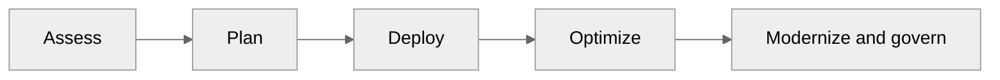
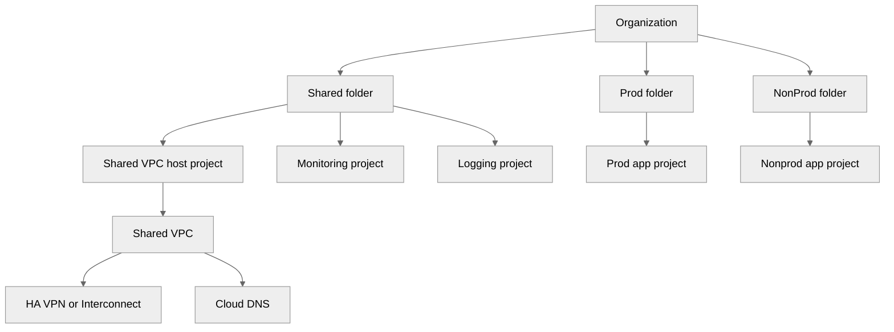
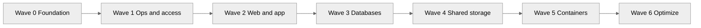
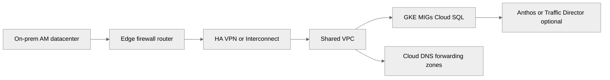
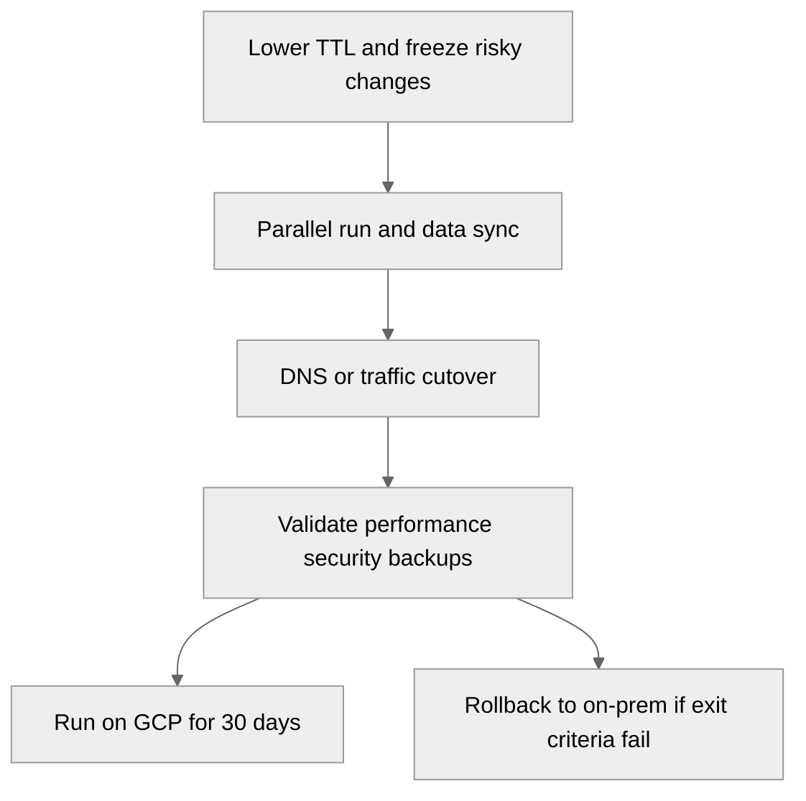

# 07 — Migration and Hybrid for On-Prem AM to GCP

> Related on-prem AM references: [`../README.md`](../README.md), [`../01-hypervisor-layer.md`](../01-hypervisor-layer.md), [`../02-network-design.md`](../02-network-design.md), [`../04-shared-storage.md`](../04-shared-storage.md), [`../07-containers-and-monitoring.md`](../07-containers-and-monitoring.md), [`../09-kubernetes-deployment.md`](../09-kubernetes-deployment.md)
>
> Related GCP guides in this directory: [`README.md`](./README.md), [`02-networking.md`](./02-networking.md), [`03-storage-and-databases.md`](./03-storage-and-databases.md), [`04-gke-kubernetes.md`](./04-gke-kubernetes.md), [`06-monitoring-and-operations.md`](./06-monitoring-and-operations.md)

## Purpose

This guide explains how to move the AM bare-metal platform to Google Cloud.

The target outcome is not only a lift-and-shift.

It is a controlled journey from:

- racks and switches,
- Proxmox/KVM clusters,
- firewall-managed VLANs,
- NFS/iSCSI storage,
- kubeadm Kubernetes,
- self-managed monitoring,

into:

- folder and project hierarchy,
- Shared VPC,
- managed networking,
- GKE,
- Cloud SQL or AlloyDB,
- Cloud Operations,
- Terraform-driven operations.

## Migration goals

- Preserve service continuity during cutover.
- Reduce platform toil compared with on-prem AM.
- Keep hybrid connectivity until inventory, warehouse, and partner dependencies are proven in cloud.
- Modernize where it lowers risk or cost, not just because a service exists.
- Keep rollback options for the first production waves.

## Google's migration framework

Google typically frames migrations in four phases:

1. **Assess**
2. **Plan**
3. **Deploy**
4. **Optimize**



## Phase 1 — Assess

Assessment is where many migrations save or lose most of their later effort.

### What to discover

- server inventory,
- CPU, memory, and storage baselines,
- east-west dependencies,
- internet-facing paths,
- database sizes and replication patterns,
- backup jobs and recovery assumptions,
- license constraints,
- hard-coded IP dependencies,
- data sovereignty requirements.

### Relevant Google tools

- **Migration Center** for inventory, dependency, and cost planning.
- **StratoZone** for estate analysis, rightsizing, and TCO views.

### Assessment outputs

- application dependency map,
- migration complexity score,
- target GCP service recommendation,
- initial TCO model,
- wave candidates,
- risk register.

### Key questions

- Which workloads are stateful versus stateless?
- Which apps can move as VMs first?
- Which databases should land on Cloud SQL versus AlloyDB versus self-managed compute?
- Which integrations need hybrid networking for 30 to 90 days?
- Which apps are safe candidates for GKE or Cloud Run later?

## Phase 2 — Plan

Planning converts discovery into executable migration waves.

### Key planning tasks

- build the landing zone,
- choose org and folder hierarchy,
- define project split and billing structure,
- define Shared VPC and subnet ranges,
- reserve ranges for GKE pods and services,
- define IAM model and org policies,
- decide HA VPN versus Dedicated Interconnect,
- group workloads into migration waves,
- define cutover windows and rollback criteria.

### Dependency mapping guidance

Start with the AM layers:

- network first,
- observability and admin access second,
- stateless compute third,
- databases fourth,
- storage and containers after the foundation is stable.

### Risk themes

- DNS and certificate ownership gaps,
- unsupported OS or kernel versions,
- tight-coupled NFS dependencies,
- oversized VMs that become expensive in cloud,
- legacy apps requiring L2-style assumptions,
- narrow database maintenance windows.

## Phase 3 — Deploy

Deployment is where actual migration execution happens.

### Deploy activities

- build landing zone and connectivity,
- migrate VMs,
- migrate databases,
- transfer bulk data,
- stand up shared storage equivalents,
- configure observability,
- validate security and backup controls,
- run parallel production tests.

### Recommended sequencing

1. Landing zone and connectivity.
2. Monitoring, logging, and admin path.
3. Stateless web and app tiers.
4. Databases and storage.
5. Container workloads.
6. Cleanup and optimization.

## Phase 4 — Optimize

Optimization is where the move starts paying back.

### Optimize actions

- right-size compute and database tiers,
- buy Committed Use Discounts for steady-state capacity,
- reduce logging and egress waste,
- replace VM-based utilities with managed services,
- move select services from VM to GKE or Cloud Run,
- review Well-Architected Framework gaps,
- tighten IAM and org policy after migration settles.

### Modernization staircase

A practical path is:

- VM lift-and-shift,
- VM templates and MIGs,
- containers on GKE,
- jobs and event flows on serverless.

## Migration tools

| Tool | Purpose | Source |
|------|---------|--------|
| Migrate to VMs | Lift-and-shift VM migration | VMware, AWS, Azure, bare-metal |
| Database Migration Service | DB migration with minimal downtime | MySQL, PostgreSQL, SQL Server, Oracle |
| Transfer Appliance | Large offline data transfer (100TB+) | On-prem NAS/SAN |
| Storage Transfer Service | Online data transfer | S3, Azure Blob, HTTP, on-prem |
| Migrate to Containers | Containerize legacy VMs | Linux VMs → GKE containers |
| Migration Center | Discovery & assessment | Any on-prem |

## Landing zone setup

The landing zone replaces the AM combination of switch layout, firewall zones, bastion, monitoring utility hosts, and environment separation.

### Folder hierarchy

Recommended folders:

- `Prod`,
- `NonProd`,
- `Shared`,
- `Security`,
- `Sandbox` optional.

### Project model

Recommended projects:

- `net-host-prod-123` for Shared VPC host project,
- `prod-apps-123` for production services,
- `nonprod-apps-123` for stage and dev,
- `monitoring-host-123` for dashboards and metrics scope,
- `logging-host-123` for sinks and long retention,
- `security-host-123` for SCC, KMS, and central controls.

### Shared VPC

Use one host project and attach service projects.

Benefits:

- centralized network control,
- shared firewall policy,
- easier flow-log standards,
- cleaner separation between network and app ownership.

### Connectivity

For first migrations, pick one of:

- **HA VPN** when bandwidth needs are moderate and speed matters,
- **Dedicated Interconnect** when predictable high throughput or low latency matters,
- **Partner Interconnect** when direct colo is not feasible.

### DNS design

- Use Cloud DNS private zones for cloud-native names.
- Use forwarding or peering so on-prem and GCP can resolve each other.
- Keep split-horizon records aligned during the parallel run.

### Centralized logging and monitoring

- Logging project receives sinks and archives.
- Monitoring project owns dashboards, SLOs, and alerting.
- Security project centralizes SCC and audit analysis.

### Security baseline

- org policies for no public IPs where possible,
- required OS Login,
- region restrictions,
- audit logs enabled,
- IAP for admin access,
- group-based IAM instead of direct user grants.

### Google Cloud Foundation Toolkit

Use Google Cloud Foundation Toolkit modules as the starting point for:

- project factory,
- network factory,
- IAM standards,
- logging sinks,
- budget setup.



## Full Terraform example for landing zone

```hcl
terraform {
  required_version = ">= 1.6.0"
  required_providers {
    google = {
      source  = "hashicorp/google"
      version = "~> 5.39"
    }
  }
  backend "gcs" {
    bucket = "am-terraform-state-prod"
    prefix = "landing-zone"
  }
}

provider "google" {
  project = var.bootstrap_project_id
  region  = var.region
}

variable "org_id" {}
variable "billing_account" {}
variable "region" {
  default = "us-central1"
}
variable "bootstrap_project_id" {}
variable "host_project_id" {
  default = "net-host-prod-123"
}
variable "prod_project_id" {
  default = "prod-apps-123"
}
variable "nonprod_project_id" {
  default = "nonprod-apps-123"
}

resource "google_project" "host" {
  project_id      = var.host_project_id
  name            = "net-host-prod"
  org_id          = var.org_id
  billing_account = var.billing_account
}

resource "google_project" "prod" {
  project_id      = var.prod_project_id
  name            = "prod-apps"
  org_id          = var.org_id
  billing_account = var.billing_account
}

resource "google_project" "nonprod" {
  project_id      = var.nonprod_project_id
  name            = "nonprod-apps"
  org_id          = var.org_id
  billing_account = var.billing_account
}

resource "google_compute_shared_vpc_host_project" "host" {
  project = google_project.host.project_id
}

resource "google_compute_network" "shared" {
  project                 = google_project.host.project_id
  name                    = "shared-prod-vpc"
  auto_create_subnetworks = false
  routing_mode            = "GLOBAL"
}

resource "google_compute_subnetwork" "prod" {
  project       = google_project.host.project_id
  name          = "prod-subnet"
  ip_cidr_range = "10.10.30.0/24"
  region        = var.region
  network       = google_compute_network.shared.id
  private_ip_google_access = true
  log_config {
    aggregation_interval = "INTERVAL_5_SEC"
    flow_sampling        = 0.5
    metadata             = "INCLUDE_ALL_METADATA"
  }
}

resource "google_compute_subnetwork" "gke" {
  project       = google_project.host.project_id
  name          = "gke-subnet"
  ip_cidr_range = "10.10.60.0/24"
  region        = var.region
  network       = google_compute_network.shared.id
  private_ip_google_access = true
  secondary_ip_range {
    range_name    = "gke-pods"
    ip_cidr_range = "10.20.0.0/14"
  }
  secondary_ip_range {
    range_name    = "gke-services"
    ip_cidr_range = "10.24.0.0/20"
  }
}

resource "google_compute_router" "nat_router" {
  project = google_project.host.project_id
  name    = "nat-router"
  region  = var.region
  network = google_compute_network.shared.id
}

resource "google_compute_router_nat" "nat" {
  project                            = google_project.host.project_id
  name                               = "prod-nat"
  region                             = var.region
  router                             = google_compute_router.nat_router.name
  nat_ip_allocate_option             = "AUTO_ONLY"
  source_subnetwork_ip_ranges_to_nat = "ALL_SUBNETWORKS_ALL_IP_RANGES"
}

resource "google_compute_shared_vpc_service_project" "prod_attach" {
  host_project    = google_project.host.project_id
  service_project = google_project.prod.project_id
}

resource "google_compute_shared_vpc_service_project" "nonprod_attach" {
  host_project    = google_project.host.project_id
  service_project = google_project.nonprod.project_id
}

resource "google_organization_policy" "require_os_login" {
  org_id     = var.org_id
  constraint = "compute.requireOsLogin"
  boolean_policy {
    enforced = true
  }
}
```

## Migration waves mapped to AM layers

| Wave | Workloads | Strategy | GCP Target |
|------|-----------|----------|-----------|
| 0 | Networking, DNS, connectivity | Build foundation | VPC, Cloud DNS, HA VPN |
| 1 | Monitoring, logging, bastion | Replace/re-platform | Cloud Ops, IAP (no bastion) |
| 2 | Web/app servers | Lift-and-shift → MIG | Compute Engine MIGs |
| 3 | Databases | Managed migration | Cloud SQL, AlloyDB |
| 4 | Shared storage (NFS) | Migrate data | Filestore, Cloud Storage |
| 5 | Container workloads | Re-platform | GKE Autopilot |
| 6 | Optimize & modernize | Cloud-native | Cloud Run, Pub/Sub, etc. |

### Why this order works

- Wave 0 replaces the AM network underlay first.
- Wave 1 gives visibility and secure access before big moves.
- Wave 2 moves stateless compute with lower data risk.
- Wave 3 handles databases with explicit rollback discipline.
- Wave 4 removes remaining shared-file dependencies.
- Wave 5 shifts kubeadm workloads to GKE.
- Wave 6 lowers cost and ops toil after stability returns.



## Hybrid architecture

Hybrid is usually the real operating state for the first 3 to 12 months.

Keep some workloads on-prem when:

- hardware is already amortized,
- a dependency cannot move yet,
- low latency to a plant or warehouse matters,
- regulation requires staged movement.

### HA VPN

HA VPN is the fastest way to build resilient hybrid connectivity.

Google's target SLA is **99.99%** when built with the required redundant design.

That means:

- two HA VPN gateway interfaces,
- two tunnels,
- BGP through Cloud Router,
- redundant on-prem edge when possible.

### HA VPN gcloud commands

```bash
gcloud compute addresses create am-vpn-gw-ip-1 \
  --region=us-central1

gcloud compute addresses create am-vpn-gw-ip-2 \
  --region=us-central1

gcloud compute routers create am-cr-us-central1 \
  --network=shared-prod-vpc \
  --region=us-central1 \
  --asn=64514

gcloud compute vpn-gateways create am-ha-vpn \
  --network=shared-prod-vpc \
  --region=us-central1

gcloud compute external-vpn-gateways create onprem-edge \
  --interfaces=0=203.0.113.10,1=203.0.113.11 \
  --redundancy-type=TWO_IPS_REDUNDANCY

gcloud compute vpn-tunnels create am-tunnel-1 \
  --region=us-central1 \
  --vpn-gateway=am-ha-vpn \
  --interface=0 \
  --peer-external-gateway=onprem-edge \
  --peer-external-gateway-interface=0 \
  --router=am-cr-us-central1 \
  --shared-secret='replace-with-strong-secret'

gcloud compute vpn-tunnels create am-tunnel-2 \
  --region=us-central1 \
  --vpn-gateway=am-ha-vpn \
  --interface=1 \
  --peer-external-gateway=onprem-edge \
  --peer-external-gateway-interface=1 \
  --router=am-cr-us-central1 \
  --shared-secret='replace-with-strong-secret'

gcloud compute routers add-bgp-peer am-cr-us-central1 \
  --region=us-central1 \
  --peer-name=onprem-peer-1 \
  --interface=if-tunnel-1 \
  --peer-ip-address=169.254.1.2 \
  --ip-address=169.254.1.1 \
  --peer-asn=65001

gcloud compute routers add-bgp-peer am-cr-us-central1 \
  --region=us-central1 \
  --peer-name=onprem-peer-2 \
  --interface=if-tunnel-2 \
  --peer-ip-address=169.254.2.2 \
  --ip-address=169.254.2.1 \
  --peer-asn=65001
```

### Dedicated Interconnect vs Partner Interconnect

| Option | Capacity | Best for | Trade-off |
|-------|----------|----------|-----------|
| Dedicated Interconnect | 10 or 100 Gbps | Large steady traffic, low latency, predictable throughput | Requires colocation presence |
| Partner Interconnect | Flexible provider-mediated bandwidth | Easier procurement when no direct colo exists | More dependency on partner model |

### Anthos for hybrid Kubernetes

Anthos is the right answer when you truly need one operating model across on-prem Kubernetes and GKE.

Use it when:

- clusters remain in both places long term,
- policy and fleet management need one control plane,
- service mesh spans cloud and on-prem.

### Traffic Director

Traffic Director helps when a hybrid service mesh or advanced east-west routing model is required.

### Hybrid DNS resolution

Use Cloud DNS forwarding zones so GCP can resolve on-prem domains.

Use on-prem conditional forwarding or equivalent so local systems can resolve cloud private zones.



## Cost comparison: On-Prem AM vs GCP

The numbers below are planning-level 3-year estimates in USD.

They assume a medium production footprint similar to the AM stack in [`../README.md`](../README.md).

| Category | On-Prem (3yr) | GCP (3yr) | Notes |
|----------|---------------|-----------|-------|
| Hardware (servers, switches, FW, storage) | $50K-100K | $0 | CapEx vs OpEx |
| Power, cooling, space | $15K-30K | $0 | Included in GCP |
| Staffing (2 FTE infra engineers) | $300K-500K | $150K-250K (1 FTE) | Managed services reduce ops |
| Software licenses | $0-25K | $0 | Open-source on both |
| Compute (GCP monthly × 36) | N/A | $108K-180K | CUD pricing |
| Storage (GCP monthly × 36) | N/A | $18K-36K | Lifecycle policies |
| Networking (egress) | $0 | $5K-15K | GCP egress charges |
| **Total** | **$365K-655K** | **$281K-481K** | GCP wins at scale |

### When on-prem can still win

- workload is flat and predictable,
- hardware is already bought,
- data cannot leave a site,
- egress volume is unusually high,
- ops staffing is already sunk cost.

### When cloud tends to win

- demand is variable,
- new environments are created often,
- HA and DR must improve quickly,
- the platform team is small,
- multi-region growth matters.

## Cutover strategy

Use a staged cutover instead of a big-bang move.

### Parallel run

Keep both environments active for **2 to 4 weeks** when practical.

During this period:

- on-prem still serves as the rollback path,
- cloud receives phased or mirrored traffic,
- metrics and logs are compared side by side,
- data consistency is validated repeatedly.

### DNS cutover

- lower TTLs 48 hours ahead,
- validate TLS in GCP,
- repoint records to GCP load balancers,
- monitor propagation and 5xx rates.

### Rollback plan

Keep on-prem running for **30 days** post-migration.

Rollback triggers should be explicit:

- sustained SLO failure,
- unresolved data inconsistency,
- critical security regression,
- unacceptable latency increase.

### Validation checklist

- performance meets or beats baseline,
- connectivity to dependencies is healthy,
- IAM and secrets access works,
- backups complete successfully,
- DR path remains valid,
- cost is within planned variance.



## Post-migration optimization

### Rightsizing

Use Recommender and observed metrics, not guesswork.

Review:

- CPU saturation,
- memory pressure,
- disk queue depth,
- idle instances,
- oversized Cloud SQL tiers,
- load balancer and CDN behavior.

### Committed Use Discounts

Once 30 to 60 days of stable usage exist:

- buy 1-year CUDs for moderate certainty,
- buy 3-year CUDs only for the stable base load.

### Modernization path

A realistic path for AM workloads is:

- Proxmox VM → Compute Engine VM,
- VM → MIG-managed template,
- VM service → GKE deployment,
- cron or batch → Cloud Run job or Cloud Scheduler + Pub/Sub,
- shared middleware → managed services.

### Well-Architected review

Run a Well-Architected review after the first two or three production waves.

Focus on:

- operational excellence,
- security,
- reliability,
- performance efficiency,
- cost optimization,
- sustainability.

## Sample migration decision table

| Current AM workload | Default first target | Later optimization |
|---------------------|----------------------|-------------------|
| Apache/Nginx web VM | MIG behind HTTPS LB | GKE or Cloud Run |
| Java app VM | Compute Engine VM | GKE Autopilot |
| PostgreSQL on VM | Cloud SQL HA | AlloyDB if scale or perf demands |
| Shared upload NFS | Filestore | Cloud Storage if app can change |
| Prometheus/Grafana VM | Cloud Monitoring + MSP | Native SLO-driven ops |
| Bastion VM | IAP | Keep bastion retired |

## Migration risks and mitigations

| Risk | Impact | Mitigation |
|------|--------|------------|
| Hard-coded IPs | App outage after cutover | Use DNS abstraction and config audit |
| Under-sized cloud target | Performance issues | Rightsize from assessment data |
| Missing IAM role | Deploy or app failures | Pre-flight access testing |
| Firewall drift | Broken hybrid connectivity | Connectivity Tests and flow logs |
| Overlooked batch job | Data inconsistency | Full job inventory and dry runs |
| DNS propagation delay | Partial traffic split | Lower TTL early and monitor |

## Governance

- weekly migration steering review,
- wave-by-wave go or no-go checklist,
- shared risk register,
- lightweight CAB for production cutovers,
- business owner sign-off for each wave exit.

## Interview-ready summary

If asked how to move the AM on-prem platform to GCP, the short answer is:

- use **Assess → Plan → Deploy → Optimize**,
- build a **landing zone** before moving apps,
- move **foundation and observability first**,
- keep **hybrid connectivity** with HA VPN or Interconnect,
- group workloads into **migration waves**,
- run **parallel cutover with rollback**,
- then **right-size, buy CUDs, and modernize** once stable.
