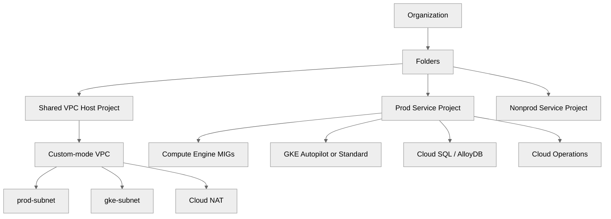
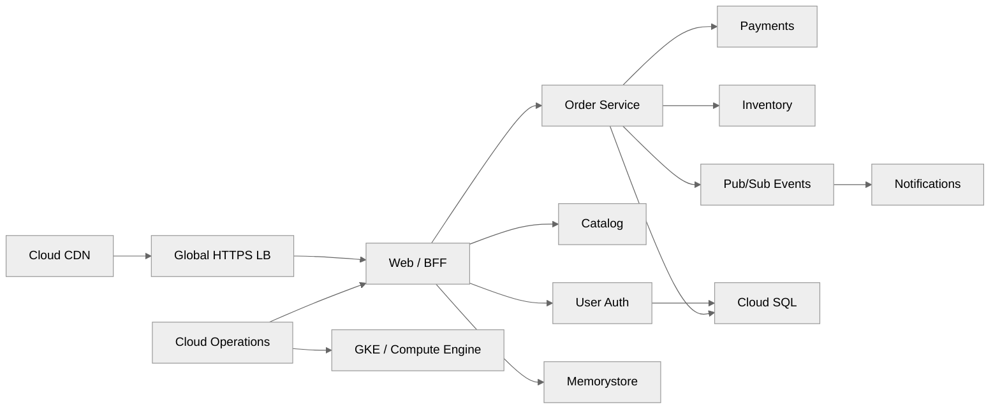
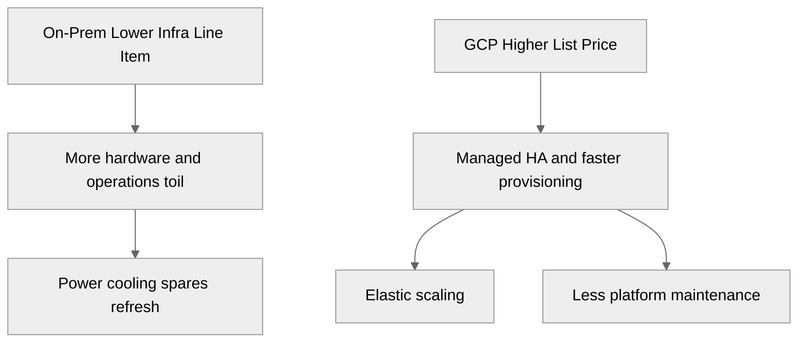

<pre>
┌──────────────────────────────────────────────────────────────┐
│  GCP Cloud Deployment — Infrastructure on Google Cloud       │
│  From On-Prem Bare Metal → Fully Managed Cloud Platform     │
└──────────────────────────────────────────────────────────────┘
</pre>

# GCP Cloud Deployment — High-Level Design (HLD)

> Related on-prem AM references: [`../README.md`](../README.md), [`../01-hypervisor-layer.md`](../01-hypervisor-layer.md), [`../02-network-design.md`](../02-network-design.md), [`../03-firewall-and-security.md`](../03-firewall-and-security.md), [`../04-shared-storage.md`](../04-shared-storage.md), [`../09-kubernetes-deployment.md`](../09-kubernetes-deployment.md)
>
> Related architecture references: [`../../Architecture/README.md`](../../Architecture/README.md), [`../../Architecture/03-cloud-infrastructure.md`](../../Architecture/03-cloud-infrastructure.md), [`../../Architecture/04-onprem-to-cloud-migration.md`](../../Architecture/04-onprem-to-cloud-migration.md), [`../../Architecture/10-high-level-design.md`](../../Architecture/10-high-level-design.md)

## Scenario

- The parent `AM/` directory explains a production on-prem platform built from rack hardware, Proxmox/KVM, VLANs, firewall policy, shared NFS/iSCSI storage, Linux hardening, containers, monitoring, and kubeadm Kubernetes.
- This directory keeps the **same workloads and goals** but remaps each layer to a managed or cloud-native GCP service.
- The target workload is the 10-service ecommerce platform described in `Architecture/`, including production, staging, observability, CI/CD, backup, and migration needs.
- Default target geography is `us-central1` with multi-zone production and optional second-region DR.
- Default operating stance: **private IPs first, no permanent bastion, Terraform first, managed services before self-hosting, and policy-driven security**.

## Design Priorities

| Priority | GCP HLD Decision |
|----------|-------------------|
| Security | IAM least privilege, OS Login, Shielded VMs, Cloud Armor, Secret Manager, org policies |
| High Availability | Zonal spread, regional services, MIG auto-healing, Cloud SQL HA, GKE regional control plane |
| Automation | Terraform + Packer + gcloud + Cloud Build |
| Observability | Cloud Monitoring, Cloud Logging, Cloud Trace, Managed Prometheus |
| Cost | CUDs/SUDs, Autopilot where it fits, right-sizing, lifecycle storage tiering |
| Simplicity | Prefer GKE, Cloud SQL, Filestore, Artifact Registry, IAP, Cloud DNS |

## On-Prem → GCP Mapping

| On-Prem Layer | GCP Equivalent | Key Service |
|--------------|----------------|-------------|
| Bare-metal servers | Compute Engine / Sole-tenant nodes | VMs on Google-managed hardware |
| Hypervisor (Proxmox/KVM) | Compute Engine | No hypervisor management required |
| VLANs / Switches | VPC, Subnets, Cloud Router | Software-defined networking |
| Hardware firewall | Cloud Firewall, Cloud Armor, Cloud NAT | L3/L4/L7 security |
| NFS/iSCSI storage | Persistent Disk, Filestore, Cloud Storage | Managed storage |
| Golden images / Packer | Custom Images, Image Family, Packer+GCE builder | Image pipeline |
| Ansible config mgmt | Ansible + OS Config Agent + startup scripts | Hybrid config |
| Container runtime | Cloud Run, GKE, Artifact Registry | Managed containers |
| Kubernetes | GKE (Autopilot or Standard) | Managed K8s |
| Prometheus/Grafana | Cloud Monitoring, Cloud Logging, Cloud Trace | Managed observability |
| Firewalld/SELinux hardening | OS Login, Shielded VMs, Org Policies, SCC | Cloud-native security baseline |

## Landing Zone Snapshot

| Area | Minimum GCP Pattern | Why it replaces on-prem effort |
|------|---------------------|--------------------------------|
| Organization | Org + folders + prod/non-prod projects | Replaces ad hoc ownership and centralizes policy |
| Networking | Custom-mode VPC, regional subnets, Shared VPC if needed | Replaces switch/VLAN lifecycle |
| Edge | Global HTTPS LB + Cloud CDN + Cloud Armor | Replaces DMZ reverse proxy + WAF stack |
| Compute | Instance templates + MIGs or GKE Autopilot | Replaces hypervisor HA management |
| Data | Cloud SQL / Filestore / Cloud Storage / Memorystore | Replaces SAN/NAS/database VM operations |
| Security | IAM, IAP, OS Login, org policies, Secret Manager | Replaces bastion + SSH key sprawl |
| Operations | Cloud Monitoring, Logging, Trace, budgets | Replaces self-managed monitoring stack |

## Q1: Hypervisor Layer → Compute Engine

- Compute Engine replaces the hypervisor admin plane; you stop patching KVM, worrying about quorum, or handling VM migration mechanics directly.
- Use **instance templates + Managed Instance Groups** as the cloud equivalent of reusable VM templates and HA placement.
- Use **custom images + image families** as the replacement for golden VM images.
- Use **Shielded VMs** for secure boot, vTPM, and integrity monitoring.
- Use **OS Login + IAP** instead of metadata SSH keys and fixed bastions.
- Detailed guide: [01-compute-and-vms.md](./01-compute-and-vms.md)

## Q2: VLANs / Switches / Firewall → VPC / Subnets / Cloud Armor

- A **custom-mode VPC** replaces switch-defined VLAN segmentation.
- Regional subnets map directly to the AM VLAN model for management, prod, dev, DMZ-style ingress, and GKE nodes.
- **Cloud Router + Cloud NAT + HA VPN / Interconnect** replace edge routing and outbound NAT appliances.
- **VPC firewall rules** handle L3/L4 policy; **Cloud Armor** handles WAF, geo controls, and rate limiting.
- **Private Google Access** and **Private Service Connect** reduce public-IP dependency.
- Detailed guide: [02-networking.md](./02-networking.md)

## Q3: Shared Storage → PD / Filestore / Cloud Storage / Managed DBs

- **Persistent Disk** and **Hyperdisk** replace block storage LUNs for VM disks.
- **Filestore** replaces NFS shares for shared POSIX access.
- **Cloud Storage** replaces backup repositories, media stores, and long-term archive targets.
- **Cloud SQL / AlloyDB / Spanner / Firestore / Bigtable** replace self-run database clusters depending on workload type.
- Snapshots, schedules, and lifecycle rules replace many array-level backup workflows.
- Detailed guide: [03-storage-and-databases.md](./03-storage-and-databases.md)

## Q4: kubeadm Kubernetes → GKE

- **GKE Autopilot** is the default for most app namespaces because Google manages nodes and system overhead.
- **GKE Standard** fits GPU, custom node pools, daemon-heavy tuning, or special kernel/config needs.
- **Workload Identity** replaces long-lived service-account key files.
- **Ingress / Gateway API** replace MetalLB + ingress-controller sprawl with Google load balancing.
- **Managed Prometheus** and **Backup for GKE** replace several day-2 add-ons.
- Detailed guide: [04-gke-kubernetes.md](./04-gke-kubernetes.md)

## Q5: Firewall + VM Hardening → IAM + Org Policy + IAP

- IAM hierarchy becomes the new control boundary: org → folder → project → resource.
- **Org policies** enforce “no external IPs”, “require OS Login”, “require Shielded VMs”, and storage/network restrictions centrally.
- **IAP** replaces bastion hosts for SSH, RDP, and internal HTTPS access.
- **Secret Manager + Cloud KMS** replace secrets-on-disk and unmanaged keys.
- **Security Command Center**, **Cloud Audit Logs**, and **VPC Service Controls** provide cloud-native governance.
- Detailed guide: [05-security-and-iam.md](./05-security-and-iam.md)

## Q6: Prometheus / Grafana / EFK → Cloud Operations

- **Cloud Monitoring** replaces most metrics dashboards, uptime checks, alerts, and SLOs.
- **Cloud Logging** replaces most DIY log shipping and storage.
- **Cloud Trace**, **Profiler**, and **Error Reporting** add distributed visibility without extra cluster management.
- **Budgets**, **Billing export**, and **Recommender** replace spreadsheet-only cost control.
- **Cloud Build + Terraform** replace snowflake operations.
- Detailed guide: [06-monitoring-and-operations.md](./06-monitoring-and-operations.md)

## Q7: Migration Model

- Use Google’s four-phase framework: assess, plan, deploy landing zone, optimize.
- Move low-risk shared services and stateless apps first, then databases, then higher-order platform changes.
- Keep hybrid networking alive through **HA VPN** or **Interconnect** until order, inventory, and warehouse dependencies are cut over.
- Replace bastions with **IAP**, not by rehosting them by default.
- Use **Migrate to VMs**, **Database Migration Service**, **Storage Transfer Service**, and **Transfer Appliance** where appropriate.
- Detailed guide: [07-migration-and-hybrid.md](./07-migration-and-hybrid.md)

## Q8: E-Commerce Workload Mapping

| Workload | Recommended GCP Runtime | Notes |
|----------|-------------------------|-------|
| Web frontend | GKE Autopilot or MIG behind global HTTPS LB | Cloud CDN + Cloud Armor at edge |
| BFF / API gateway | GKE or regional MIG | IAP for admin paths |
| Catalog | GKE + Memorystore + search backend | Read-heavy service |
| Orders | GKE + Cloud SQL HA | Strong transactional path |
| Payments | Isolated GKE namespace or dedicated MIG | Stronger IAM/CMEK posture |
| User/Auth | GKE + Workload Identity | Cloud SQL + Secret Manager |
| Inventory | GKE + hybrid connectivity | Cloud SQL or Spanner depending scope |
| Notifications | Cloud Run jobs or GKE workers | Good fit for async scaling |
| Search / analytics | Elastic on GKE / marketplace + BigQuery | Depends on search strategy |
| Monitoring | Cloud Operations + Managed Prometheus | Minimal self-hosted ops |

## Q9: AM VLAN Model → GCP Subnets

| On-Prem VLAN | GCP Subnet | CIDR | Purpose |
|-------------|-----------|------|---------|
| MGMT (10) | `mgmt-subnet` | `10.10.10.0/24` | Admin tools, IAP destinations, ops helpers |
| Storage (20) | n/a | n/a | Managed by PD / Filestore / Cloud Storage |
| VM-Prod (30) | `prod-subnet` | `10.10.30.0/24` | Production GCE workloads |
| VM-Dev (40) | `dev-subnet` | `10.10.40.0/24` | Dev/stage |
| DMZ (50) | `dmz-subnet` | `10.10.50.0/24` | Public-facing appliances only if needed |
| K8S (60) | `gke-subnet` | `10.10.60.0/24` | GKE nodes + secondary pod/service ranges |

- Prefer private VMs without external IPs and route outbound access through Cloud NAT.
- Terminate TLS on the global HTTPS LB and keep backends private.
- Explicitly allow Google health-check ranges in firewall rules.
- Use labels, service accounts, and tags instead of switch-port conventions.
- Detailed guide: [02-networking.md](./02-networking.md)

## Q10: Cost Estimation

| Component | GCP Service | Monthly Est. (3-node equiv) | Notes |
|-----------|------------|---------------------------|-------|
| Compute (3x n2-standard-32) | Compute Engine | $3,000-4,500 | CUD/SUD discounts apply |
| Networking | VPC, Cloud NAT, LB | $200-500 | Egress charges apply |
| Storage (10TB) | Persistent Disk SSD | ~$1,700 | `pd-ssd` about $0.17/GB/mo |
| Filestore (1TB) | Filestore | $160-300 | Tier and region dependent |
| GKE | GKE Standard | ~$220 + node cost | Autopilot is pod-based pricing |
| Monitoring | Cloud Monitoring | $0-500 | Free tier is generous |
| **Total** |  | **$5,500-7,500/mo** | Before CUD/SUD |
| vs On-Prem (amortized 3yr) |  | ~$2,500-3,500/mo | But excludes hardware ops overhead |

## Delivery Phases

| Phase | Outcome | Exit Criteria |
|------|---------|---------------|
| 0 | Org and landing zone | Billing, audit logs, IAM baseline, org policies live |
| 1 | Networking | VPC, DNS, NAT, VPN/Interconnect tested |
| 2 | Compute baseline | Image pipeline, instance templates, MIGs, OS Login, IAP |
| 3 | Data baseline | Cloud SQL / Filestore / backup policies live |
| 4 | GKE platform | Cluster, ingress, Workload Identity, Artifact Registry |
| 5 | Observability | Dashboards, alerts, budgets, logging sinks, SLOs |
| 6 | Migration waves | Production cutover with rollback rehearsed |

## Quick Reference

| Need | Primary Detailed Guide | Closest On-Prem AM Baseline |
|------|------------------------|-----------------------------|
| Compute Engine, images, MIGs | [01-compute-and-vms.md](./01-compute-and-vms.md) | [../01-hypervisor-layer.md](../01-hypervisor-layer.md), [../05-vm-provisioning-and-hardening.md](../05-vm-provisioning-and-hardening.md) |
| VPC, firewall, LB, DNS | [02-networking.md](./02-networking.md) | [../02-network-design.md](../02-network-design.md), [../03-firewall-and-security.md](../03-firewall-and-security.md) |
| PD, Filestore, Cloud SQL | [03-storage-and-databases.md](./03-storage-and-databases.md) | [../04-shared-storage.md](../04-shared-storage.md) |
| GKE and app deployment | [04-gke-kubernetes.md](./04-gke-kubernetes.md) | [../09-kubernetes-deployment.md](../09-kubernetes-deployment.md) |
| IAM, org policy, IAP | [05-security-and-iam.md](./05-security-and-iam.md) | [../03-firewall-and-security.md](../03-firewall-and-security.md) |
| Monitoring, logging, DR, CI/CD | [06-monitoring-and-operations.md](./06-monitoring-and-operations.md) | [../07-containers-and-monitoring.md](../07-containers-and-monitoring.md), [../08-troubleshooting-guide.md](../08-troubleshooting-guide.md) |
| Migration and hybrid | [07-migration-and-hybrid.md](./07-migration-and-hybrid.md) | [../08-troubleshooting-guide.md](../08-troubleshooting-guide.md) |

## Pricing Notes

- Prices in this directory are public USD list-price references and should be revalidated in the live Google Cloud calculator before procurement.
- Region, CUD/SUD enrollment, data egress, log retention, and managed database HA settings have the biggest bill impact.
- Use labels from day one for budget and cost-allocation reporting.
