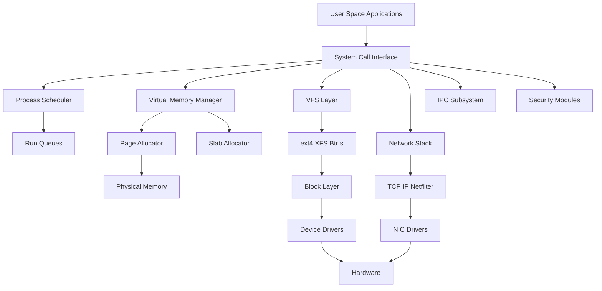
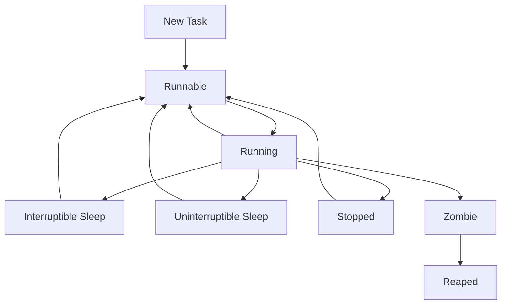
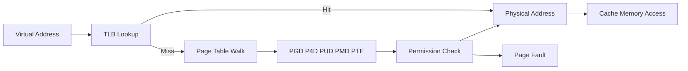
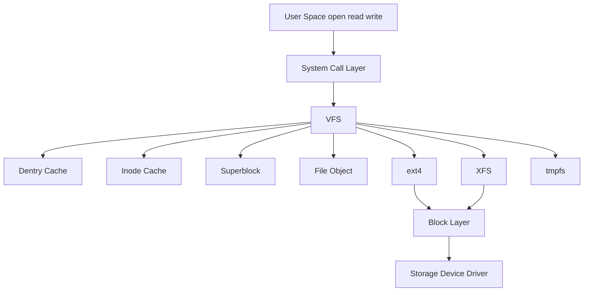
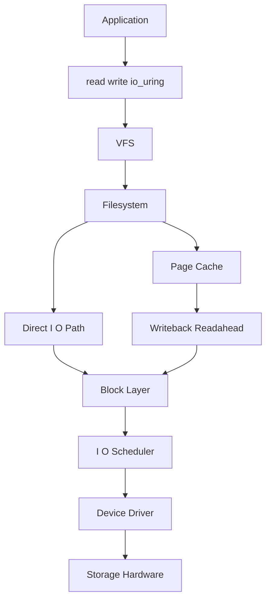
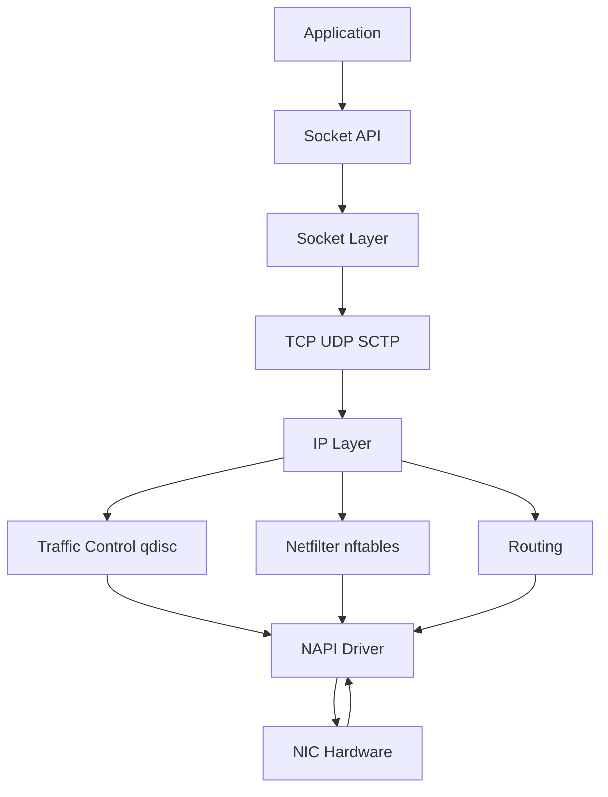
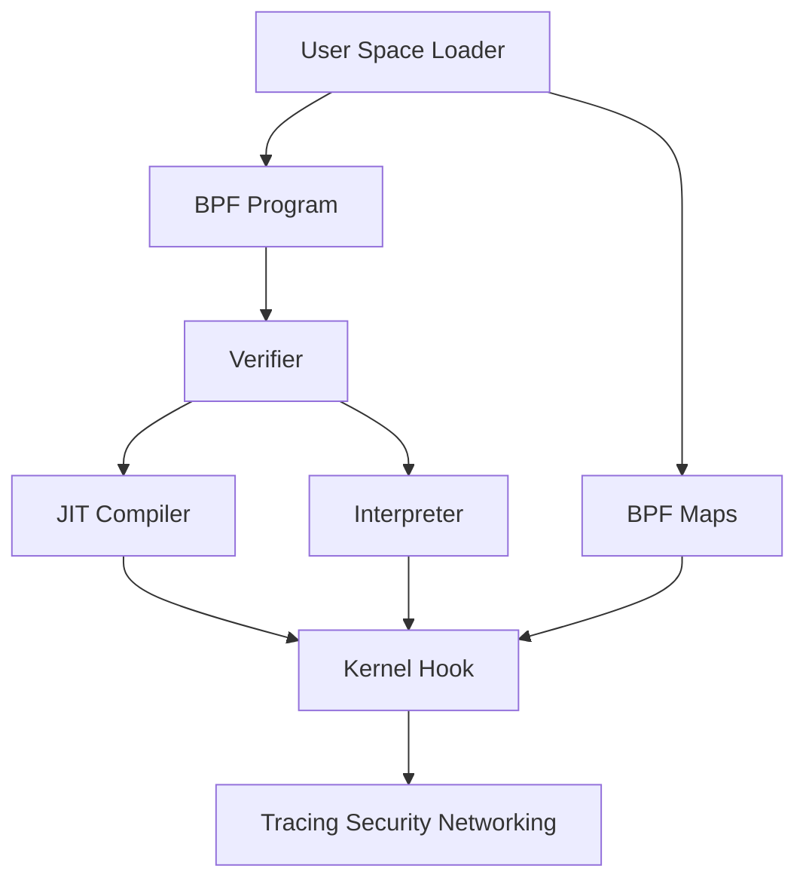
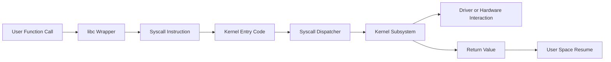

# Advanced Linux Internals

A production-quality, deep technical guide to Linux internals for senior engineers, SREs, platform engineers, systems programmers, kernel enthusiasts, and performance investigators.

This guide focuses on how Linux actually works under the hood: kernel organization, process and memory internals, filesystems, the I/O stack, networking, eBPF, namespaces, cgroups, device drivers, and tracing. It blends conceptual explanation with practical tools, diagrams, tables, examples, and command references.

---

## Table of Contents

1. [Kernel Architecture](#1-kernel-architecture)
2. [Process Internals](#2-process-internals)
3. [Memory Management](#3-memory-management)
4. [File System Internals](#4-file-system-internals)
5. [I-O Subsystem](#5-i-o-subsystem)
6. [Network Stack](#6-network-stack)
7. [eBPF and BPF](#7-ebpf-and-bpf)
8. [Namespaces and Cgroups Deep Dive](#8-namespaces-and-cgroups-deep-dive)
9. [System Calls](#9-system-calls)
10. [Inter-Process Communication](#10-inter-process-communication)
11. [Device Drivers](#11-device-drivers)
12. [Tracing and Debugging](#12-tracing-and-debugging)
13. [Appendix A: Key Kernel Data Structures](#appendix-a-key-kernel-data-structures)
14. [Appendix B: Useful Commands](#appendix-b-useful-commands)
15. [Appendix C: Suggested Reading Path](#appendix-c-suggested-reading-path)

---

## How to Use This Guide

- Read sections 1, 2, and 3 first if you want a solid mental model.
- Jump to section 7 if you care about observability and modern tracing.
- Jump to section 8 if you work with containers and resource isolation.
- Jump to section 12 if you debug production failures.
- Use the tables and command examples as a quick operational reference.

---

## Conventions Used

| Convention | Meaning |
|---|---|
| `code` | Command, file, syscall, or kernel symbol |
| **bold** | Important concept |
| *italic* | Emphasis or nuance |
| `/proc/...` | Runtime kernel and process information |
| `/sys/...` | Sysfs kernel object model |

---

## Prerequisites

You do not need to be a kernel developer to benefit from this guide, but it helps to know:

- Basic C programming concepts
- Unix process model
- Virtual memory basics
- Networking fundamentals
- Shell and command line tools

---

## 1. Kernel Architecture

Linux is a **monolithic kernel with modular capabilities**. That single sentence packs several important ideas.

A pure monolithic kernel places most core operating system services inside kernel space. A microkernel keeps only minimal mechanisms in kernel space and pushes more services into user space. Linux is monolithic because device drivers, filesystems, schedulers, memory management, and networking all execute in kernel mode. However, Linux is also highly modular because many subsystems can be built and loaded as kernel modules.

### 1.1 Why Linux Is Called Monolithic

In Linux, the following typically run in kernel space:

- Process scheduler
- Virtual memory subsystem
- VFS and filesystem implementations
- Networking stack
- Block I/O subsystem
- Device drivers
- Inter-process communication primitives
- Security hooks and LSM integrations

This yields performance advantages because components can call each other directly without message-passing overhead typical of microkernel designs.

### 1.2 Monolithic vs Microkernel

| Property | Monolithic Kernel | Microkernel |
|---|---|---|
| Service location | Mostly kernel space | Minimal kernel, services in user space |
| Performance | Generally lower overhead | More IPC overhead |
| Fault isolation | Lower | Higher |
| Complexity placement | Inside kernel | Shifted to userspace services |
| Example | Linux | MINIX 3, QNX (microkernel style) |

### 1.3 Linux Kernel Design Philosophy

Linux emphasizes:

- Performance on real hardware
- Portability across many CPU architectures
- Incremental evolution rather than academic purity
- Broad hardware support
- Backward compatibility where practical
- Strong tooling and visibility via `/proc`, `/sys`, tracepoints, perf, and eBPF

### 1.4 Kernel Space vs User Space

**User space** is where ordinary applications run with restricted privileges.

**Kernel space** is privileged execution mode where the kernel has direct access to hardware and all memory.

Crossing between the two happens through:

- System calls
- Interrupts
- Exceptions
- Signals and return paths
- Special entry points such as vDSO for some optimized operations

### 1.5 Protection Rings and Privilege

Most modern CPUs implement privilege levels. Linux primarily uses:

- Ring 0 for kernel
- Ring 3 for user space

The hardware enforces permission checks so user applications cannot arbitrarily execute privileged instructions.

### 1.6 Mermaid Diagram: Linux Kernel Subsystems



### 1.7 Kernel Modules

Kernel modules are loadable pieces of kernel code.

They enable:

- Dynamic driver loading
- Filesystem support without rebuilding the kernel
- Optional features activated at runtime
- Easier development and deployment of kernel components

Common commands:

```bash
lsmod
modinfo xfs
sudo modprobe xfs
sudo rmmod xfs
```

Important points:

- Modules execute in kernel space.
- A buggy module can crash the system.
- Modules can export symbols for other modules.
- Module loading may trigger device discovery or subsystem registration.

### 1.8 Built-In vs Loadable Modules

| Type | Description | Typical Use |
|---|---|---|
| Built-in | Linked into kernel image | Core boot-critical features |
| Loadable module | Loaded at runtime | Drivers, optional filesystems, features |

### 1.9 Module Lifecycle

A typical module provides:

- Initialization function
- Exit function
- Metadata such as license and description
- Registration with a subsystem such as netdev, char device, block layer, USB, or platform bus

Minimal example:

```c
#include <linux/init.h>
#include <linux/module.h>

static int __init demo_init(void)
{
    pr_info("demo module loaded\n");
    return 0;
}

static void __exit demo_exit(void)
{
    pr_info("demo module unloaded\n");
}

module_init(demo_init);
module_exit(demo_exit);
MODULE_LICENSE("GPL");
MODULE_DESCRIPTION("Minimal example module");
```

### 1.10 Kernel Source Tree Overview

The Linux source tree is large but methodical.

| Directory | Purpose |
|---|---|
| `arch/` | Architecture-specific code |
| `block/` | Block layer |
| `crypto/` | Cryptographic framework |
| `Documentation/` | Kernel docs |
| `drivers/` | Device drivers |
| `fs/` | Filesystems and VFS pieces |
| `include/` | Header files |
| `init/` | Early boot and init |
| `ipc/` | IPC implementations |
| `kernel/` | Core scheduler, signals, timers, etc. |
| `lib/` | Generic helper code |
| `mm/` | Memory management |
| `net/` | Networking stack |
| `samples/` | Samples and reference code |
| `security/` | Linux Security Modules |
| `sound/` | Audio stack |
| `tools/` | User-space tools such as perf and bpftool |
|
### 1.11 Kernel Build Artifacts

| Artifact | Meaning |
|---|---|
| `vmlinux` | Uncompressed ELF kernel image with symbols |
| `bzImage` | Bootable compressed kernel image |
| `System.map` | Symbol table |
| `initramfs` | Early userspace root image |
| `.config` | Kernel configuration |

### 1.12 Kconfig and Kbuild

Linux uses:

- **Kconfig** for feature selection
- **Kbuild** for build orchestration

Useful commands:

```bash
make menuconfig
make oldconfig
make -j$(nproc)
```

### 1.13 Kernel Configuration Symbols

Examples:

- `CONFIG_PREEMPT`
- `CONFIG_CGROUPS`
- `CONFIG_BPF`
- `CONFIG_KALLSYMS`
- `CONFIG_DEBUG_INFO`

A symbol may be built as:

- `y` built-in
- `m` module
- `n` disabled

### 1.14 Boot Flow at a High Level

1. Firmware initializes hardware.
2. Bootloader loads kernel and initramfs.
3. Kernel decompresses and initializes CPU, memory, and devices.
4. Early init code mounts initramfs.
5. Kernel launches PID 1.
6. User-space init system transitions into normal boot.

### 1.15 System Calls as the Controlled Boundary

Applications cannot directly invoke arbitrary kernel functions. Instead, they use **system calls**.

Examples:

- `open()`
- `read()`
- `write()`
- `mmap()`
- `clone()`
- `ioctl()`
- `epoll_wait()`

A libc wrapper may do one of the following:

- Invoke a real syscall instruction
- Use vDSO for optimized time-related operations
- Compose behavior using multiple syscalls

### 1.16 Syscall Entry Path

On x86_64, user space typically uses `syscall` instruction.

The path is conceptually:

1. Place syscall number and arguments in registers.
2. Execute `syscall`.
3. CPU switches to kernel mode and jumps to kernel entry code.
4. Kernel validates arguments and dispatches to handler.
5. Return value is placed in register.
6. CPU returns to user mode.

### 1.17 Kernel Preemption Models

Linux offers several kernel preemption options.

| Model | Summary |
|---|---|
| None | Lowest overhead, least preemptible |
| Voluntary | Explicit preemption points |
| Preempt | Better responsiveness |
| RT style variants | Very low latency for real-time needs |

### 1.18 SMP and Scalability

Linux is designed for **SMP** systems with multiple CPUs.

Scalability techniques include:

- Per-CPU data structures
- Fine-grained locking
- RCU for read-mostly structures
- Lockless algorithms in hot paths
- NUMA-aware placement

### 1.19 RCU at a Glance

**Read-Copy-Update** is a synchronization mechanism optimized for many readers and fewer updates.

Writers:

- Create a new version
- Publish pointer changes safely
- Wait for grace period before freeing old version

Readers:

- Often avoid heavy locking
- Traverse shared data safely within read-side critical sections

### 1.20 Interrupts and Softirqs

Linux splits work into layers:

- Hard IRQ: immediate interrupt handling
- Softirq: deferred interrupt work
- Tasklets: older deferred mechanism built on softirqs
- Workqueues: process-context deferred work

This prevents doing too much in hard interrupt context.

### 1.21 Important Kernel Execution Contexts

| Context | Can Sleep? | Example |
|---|---|---|
| User context | Yes | Syscall path |
| Process context in kernel | Usually yes | Filesystem operation |
| Softirq context | No | Network receive processing |
| Hard IRQ context | No | Interrupt top half |
| NMI context | No | Performance monitoring interrupt |

### 1.22 Kernel Logging

Kernel messages use the ring buffer.

Commands:

```bash
dmesg --color=always | less -R
journalctl -k
```

### 1.23 Kernel Symbol Resolution

Files and tools:

- `/proc/kallsyms`
- `System.map`
- `nm`
- `objdump`

These are essential for tracing and crash analysis.

### 1.24 Common Operational Questions

| Question | Tool |
|---|---|
| Which modules are loaded? | `lsmod` |
| Which kernel config enabled a feature? | `grep CONFIG_* .config` |
| Which symbols are available? | `/proc/kallsyms` |
| Which subsystem handles a syscall? | `strace`, source tree, perf trace |

### 1.25 Practical Example: Inspect the Running Kernel

```bash
uname -a
uname -r
cat /proc/version
cat /proc/cmdline
zgrep CONFIG_BPF /proc/config.gz
```

### 1.26 Common Misconceptions

- Linux is not a microkernel.
- Kernel modules are not “safe plugins”; they are trusted kernel code.
- `glibc` is not the kernel; it is a user-space library.
- `/proc` is not just files on disk; it is a virtual filesystem exposing kernel state.

### 1.27 Section Summary

Kernel architecture is the foundation of every other topic in this guide. Once you understand where code executes, how privilege changes occur, and how subsystems are organized, the rest of Linux internals becomes much easier to reason about.

---

## 2. Process Internals

Processes are one of the most visible abstractions in Linux, but internally Linux models execution using **tasks** represented primarily by `task_struct`.

### 2.1 Process vs Thread in Linux

Linux treats processes and threads similarly. Both are tasks; the difference comes from what resources are shared.

A “thread” usually means tasks created with `clone()` that share:

- Address space
- File descriptor table
- Signal handlers
- Other process resources

### 2.2 Core Structure: `task_struct`

`task_struct` is the kernel’s central data structure for a task.

It contains or references:

- PID and thread group identifiers
- Scheduling information
- Memory descriptor
- Open file table
- Signal state
- Credentials
- CPU affinity
- Namespace pointers
- Cgroup membership
- Parent and child relations
- Statistics and accounting fields

### 2.3 High-Level Process Creation Paths

Linux supports several creation styles:

- `fork()`
- `vfork()`
- `clone()`
- `execve()` as program image replacement

### 2.4 `fork()`

`fork()` creates a new child task by duplicating the parent’s process context.

But Linux does not immediately copy all memory pages. Instead it uses **copy-on-write**.

What is duplicated or logically inherited?

- Virtual address layout
- File descriptors
- Signal dispositions
- Credentials
- Working directory and root directory references
- Environment and arguments snapshot

What is different?

- PID
- Pending signals
- CPU runtime statistics
- Some timers and accounting fields

### 2.5 `execve()`

`execve()` replaces the current process image.

After a successful `execve()`:

- New executable and memory map are loaded.
- Old userspace memory image is discarded.
- PID stays the same.
- File descriptors remain unless marked `CLOEXEC`.
- Signal dispositions may change according to POSIX rules.

### 2.6 `clone()`

`clone()` is the flexible primitive behind Linux threading.

Flags control which resources are shared, for example:

- `CLONE_VM`
- `CLONE_FILES`
- `CLONE_SIGHAND`
- `CLONE_FS`
- `CLONE_THREAD`
- `CLONE_NEWNS`
- `CLONE_NEWNET`

### 2.7 `vfork()`

`vfork()` is an optimization historically used when the child immediately calls `execve()`.

The parent is suspended until the child execs or exits.

### 2.8 Mermaid Diagram: Process State Machine



### 2.9 Process States in Practice

Linux exposes process states in tools like `ps`, `top`, and `/proc/[pid]/stat`.

Common states:

| State | Meaning |
|---|---|
| `R` | Running or runnable |
| `S` | Interruptible sleep |
| `D` | Uninterruptible sleep, often waiting on I/O |
| `T` | Stopped or traced |
| `Z` | Zombie |
| `I` | Idle kernel thread on some systems |

### 2.10 Zombie Processes

A zombie is a task that has exited but whose exit status has not yet been collected by its parent.

It retains a minimal kernel entry so the parent can call `wait()`.

### 2.11 Orphans and Reparenting

If a parent exits before a child, the child is reparented, usually to PID 1 or a designated subreaper.

### 2.12 Process Hierarchy Fields

Important identifiers:

- `pid`: task ID
- `tgid`: thread group ID, often the process ID users see
- `ppid`: parent PID
- `sid`: session ID
- `pgid`: process group ID

### 2.13 Scheduler Classes

Linux scheduler is not one single algorithm. It has multiple classes.

Examples:

- Fair scheduling class for normal tasks
- Real-time class for `SCHED_FIFO` and `SCHED_RR`
- Deadline scheduling for specific deterministic needs

### 2.14 Completely Fair Scheduler (CFS)

CFS models CPU time as a fairness problem.

Key ideas:

- Each runnable task accumulates **virtual runtime**.
- The scheduler prefers the task with the smallest virtual runtime.
- Tasks are stored in a red-black tree keyed by virtual runtime.
- Nice levels influence weight and thus runtime progression.

### 2.15 CFS Terms

| Term | Meaning |
|---|---|
| `vruntime` | Weighted execution progress |
| Run queue | Per-CPU runnable task set |
| Scheduling entity | Abstract schedulable unit |
| Weight | Priority impact based on nice value |

### 2.16 Nice Values

`nice` affects scheduling weight for normal tasks.

Range:

- `-20` highest priority
- `19` lowest priority

Commands:

```bash
nice -n 10 myjob
renice -n -5 -p 1234
```

### 2.17 Real-Time Scheduling

Linux also supports real-time policies.

#### `SCHED_FIFO`

- Runs until blocked, preempted by higher-priority RT task, or yields
- No timeslice rotation among equal priorities

#### `SCHED_RR`

- Like FIFO but uses round-robin timeslices among equal-priority RT tasks

### 2.18 Deadline Scheduling

`SCHED_DEADLINE` uses concepts such as runtime, deadline, and period.

It is intended for specific latency-sensitive workloads where admission control matters.

### 2.19 Per-CPU Run Queues

Each CPU maintains scheduler state.

Advantages:

- Reduced contention
- Locality of execution
- Better cache warmth

But load balancing is required so one CPU is not overloaded while another is idle.

### 2.20 Scheduler Load Balancing

Linux periodically balances tasks across CPUs and scheduling domains.

Factors include:

- CPU affinity masks
- NUMA topology
- Cache sharing relationships
- Task wakeup behavior
- Real-time constraints

### 2.21 Context Switching

A context switch saves execution state of one task and restores another.

Saved state typically includes:

- CPU registers
- Stack pointer
- Instruction pointer
- Scheduling/accounting state
- Memory context if switching between different address spaces

### 2.22 Why Context Switches Matter

They are necessary but not free.

Costs include:

- CPU cycles for save/restore
- Cache pollution
- TLB effects on address space switches
- Locking and scheduler overhead

### 2.23 User vs Kernel Threads

| Type | Description |
|---|---|
| User thread | Typically managed by user-space runtime atop kernel tasks |
| Kernel thread | Task created by kernel, often no user address space |

Kernel threads often appear in `ps` with names like `[kworker/0:1]`.

### 2.24 Memory Descriptor: `mm_struct`

Each process address space is described by `mm_struct`.

It tracks:

- Virtual memory areas
- Page tables
- Address space stats
- Mapped files
- Anonymous memory
- Executable layout

Threads in the same process usually share the same `mm_struct`.

### 2.25 Open Files and `files_struct`

Open file descriptors are managed through a per-process or shared descriptor table.

Each descriptor points to an open file description with:

- File offset
- Flags
- Operation table
- Underlying inode/dentry references

### 2.26 Signals Internals

Processes have:

- Pending signal queues
- Blocked signal masks
- Disposition tables
- Shared or per-thread signal state depending on threading model

### 2.27 Credentials

Linux credentials include:

- Real UID/GID
- Effective UID/GID
- Saved IDs
- Supplementary groups
- Capability sets
- Security module context

### 2.28 `/proc/[pid]` Deep Dive

The `/proc` filesystem exposes process state.

Important entries:

| Path | Meaning |
|---|---|
| `/proc/[pid]/cmdline` | Command line |
| `/proc/[pid]/environ` | Environment |
| `/proc/[pid]/maps` | Memory mappings |
| `/proc/[pid]/smaps` | Mapping details |
| `/proc/[pid]/fd/` | Open file descriptors |
| `/proc/[pid]/status` | Human-readable summary |
| `/proc/[pid]/stat` | Single-line stats |
| `/proc/[pid]/sched` | Scheduler data |
| `/proc/[pid]/stack` | Kernel stack trace if permitted |
| `/proc/[pid]/ns/` | Namespace references |
| `/proc/[pid]/cgroup` | Cgroup membership |

### 2.29 Practical Example: Inspect a Process

```bash
pid=1234
cat /proc/$pid/status
cat /proc/$pid/sched
ls -l /proc/$pid/fd
cat /proc/$pid/maps | head
```

### 2.30 Understanding `/proc/[pid]/stat`

This file is dense and positional. It includes:

- PID
- Command name
- State
- PPID
- Process group
- Session
- TTY
- Fault counts
- CPU time
- Start time
- RSS
- Processor last executed on

### 2.31 `ps` Output vs Kernel Reality

User-space tools summarize kernel data and sometimes omit nuance.

For example:

- One `ps` line may represent a thread group or thread depending on flags.
- CPU usage is derived over intervals, not a fixed field in the kernel.
- “Memory usage” may refer to RSS, PSS, or virtual memory depending on the tool.

### 2.32 Copy-on-Write During `fork()`

Initially, parent and child share physical pages marked read-only.

On write:

1. CPU raises page fault.
2. Kernel detects COW condition.
3. New physical page is allocated.
4. Data is copied.
5. Page table updated.
6. Write proceeds.

### 2.33 Thread-Local Storage and Threads

User-space thread libraries use per-thread areas and kernel-provided thread IDs to manage thread-local data.

### 2.34 CPU Affinity

A task may be restricted to specific CPUs.

Commands:

```bash
taskset -p 1234
taskset -cp 0-3 1234
```

Reasons:

- Improve cache locality
- Reserve CPUs for latency-sensitive work
- Constrain noisy neighbors

### 2.35 Process Accounting Metrics

Linux tracks:

- User CPU time
- System CPU time
- Voluntary context switches
- Involuntary context switches
- Major and minor faults
- I/O counters in some interfaces

### 2.36 Wait Queues and Sleeping

When a task waits for an event, it may sleep on a wait queue.

This avoids busy waiting and allows efficient wakeup when the event occurs.

### 2.37 Futexes

Fast userspace mutexes use a hybrid model:

- Uncontended path stays in user space
- Contended path enters kernel via `futex()`

This is crucial for efficient threading libraries.

### 2.38 Practical Example: Observe Scheduling

```bash
pidstat -w 1
perf sched record -- sleep 5
perf sched latency
chrt -p 1234
```

### 2.39 Common Failure Modes

| Symptom | Likely Cause |
|---|---|
| Many zombies | Parent not reaping children |
| High context switches | Lock contention or oversubscription |
| Tasks stuck in `D` | Storage, NFS, or driver wait |
| CPU starvation | Priority inversion or bad RT config |

### 2.40 Section Summary

The Linux “process” is really a carefully structured task abstraction built atop shared and unshared kernel objects. Understanding `task_struct`, scheduling classes, context switching, and `/proc` makes performance work and debugging much easier.

---

## 3. Memory Management

Linux memory management is one of the most sophisticated parts of the kernel. It deals with virtual memory, physical page allocation, reclaim, page cache, NUMA locality, huge pages, and out-of-memory behavior.

### 3.1 Why Virtual Memory Exists

Virtual memory provides:

- Isolation between processes
- A contiguous address space illusion
- Demand paging
- File-backed mappings
- Shared memory mechanisms
- Efficient protection and permission control

### 3.2 Virtual vs Physical Addresses

Applications use **virtual addresses**.

The MMU translates virtual addresses to physical addresses using page tables managed by the kernel.

### 3.3 Memory Management Components

| Component | Role |
|---|---|
| MMU | Hardware translation |
| Page tables | Mapping metadata |
| TLB | Translation cache |
| `mm_struct` | Process memory descriptor |
| VMA | Region metadata |
| Page allocator | Physical page allocation |
| Slab allocator | Kernel object caching |
| Reclaim | Free memory recovery |

### 3.4 Virtual Memory Areas

A process address space is composed of VMAs.

Examples:

- Text segment
- Data segment
- Heap
- Stack
- Shared libraries
- Anonymous mappings
- File-backed mappings

Inspect with:

```bash
cat /proc/self/maps
cat /proc/self/smaps
```

### 3.5 Page Tables

Linux uses multi-level page tables on modern architectures.

The exact levels vary by architecture and paging mode, but conceptually the kernel walks tables from upper levels toward a page table entry that describes the mapping.

### 3.6 Mermaid Diagram: Virtual Memory Address Translation



### 3.7 Translation Lookaside Buffer (TLB)

The TLB caches recent address translations.

Benefits:

- Avoid expensive page table walks
- Improve memory access latency

Costs when ineffective:

- TLB misses cause page table walks
- Frequent address space changes may require TLB flushes
- Large working sets may exceed TLB capacity

### 3.8 Page Sizes

Common page sizes:

- 4 KiB base pages on many systems
- 2 MiB huge pages on x86_64
- 1 GiB gigantic pages on some systems

Larger pages can reduce TLB pressure but have tradeoffs.

### 3.9 Demand Paging

Memory is often mapped before pages are physically instantiated.

Actual allocation may occur on first access.

Benefits:

- Faster startup
- Lower memory use for untouched regions
- Lazy loading of executable and shared library pages

### 3.10 Minor vs Major Faults

| Fault Type | Meaning |
|---|---|
| Minor fault | Mapping established without disk I/O |
| Major fault | Disk I/O required to bring page in |

### 3.11 Page Fault Handling Flow

1. CPU detects invalid or permission-failing translation.
2. Trap enters kernel.
3. Kernel inspects VMA and fault reason.
4. If valid and recoverable, kernel allocates page or reads from storage.
5. Page tables are updated.
6. Faulting instruction resumes.

### 3.12 Anonymous Memory

Anonymous memory is not directly backed by a regular file.

Examples:

- Heap allocations
- Stack pages
- Anonymous `mmap()`

### 3.13 File-Backed Memory

File-backed mappings allow pages to be populated from files.

Examples:

- Shared libraries
- Memory-mapped files
- Executable code pages

### 3.14 Copy-on-Write and Fork Efficiency

COW makes `fork()` practical even for large processes.

Without COW, every fork would require immediate duplication of the parent memory image.

### 3.15 Overcommit

Linux can allow memory allocations beyond immediately available RAM plus swap depending on overcommit policy.

Relevant sysctls:

- `vm.overcommit_memory`
- `vm.overcommit_ratio`
- `vm.overcommit_kbytes`

### 3.16 Physical Memory Organization

Linux organizes physical memory into **nodes** and **zones**.

- Nodes represent NUMA domains.
- Zones represent allocation constraints.

### 3.17 Memory Zones

Common zones include:

| Zone | Purpose |
|---|---|
| `ZONE_DMA` | Legacy DMA-constrained memory |
| `ZONE_DMA32` | 32-bit addressable DMA zone |
| `ZONE_NORMAL` | Normal directly mapped memory |
| `ZONE_MOVABLE` | Migratable pages |
| `ZONE_HIGHMEM` | High memory on 32-bit systems |

### 3.18 Buddy Allocator

The buddy allocator manages physical pages in power-of-two blocks.

It supports efficient splitting and coalescing.

### 3.19 Fragmentation

Fragmentation occurs when free memory exists but not in the right contiguous form.

This matters for:

- Huge page allocation
- Large DMA buffers
- Some latency-sensitive allocations

### 3.20 Slab, SLUB, and SLOB

Linux uses specialized allocators for kernel objects.

Modern systems often use **SLUB**.

Benefits:

- Object reuse
- Reduced fragmentation
- Fast allocation of common kernel objects
- Cache coloring and locality considerations

### 3.21 Slab Caches

Examples of objects often cached:

- `task_struct`
- `inode`
- `dentry`
- `kmalloc-*` size classes

Inspect:

```bash
cat /proc/slabinfo | head
slabtop
```

### 3.22 `kmalloc()` vs `vmalloc()`

| API | Properties |
|---|---|
| `kmalloc()` | Physically contiguous, typically for smaller allocations |
| `vmalloc()` | Virtually contiguous, physically non-contiguous |

### 3.23 Page Reclaim

When free memory is low, Linux reclaims pages.

This may involve:

- Dropping clean page cache
- Writing dirty pages back to storage
- Swapping anonymous pages
- Shrinking slab caches

### 3.24 LRU Lists and Reclaim Heuristics

Linux tracks page activity to approximate recency and reclaimability.

Modern internals are more nuanced than a pure textbook LRU, but the essential idea remains: cold pages are better eviction candidates.

### 3.25 Swap

Swap extends apparent memory capacity by moving anonymous pages to swap space.

Tradeoffs:

- Prevents immediate OOM in some cases
- Much slower than RAM
- Can cause latency spikes if heavily used

### 3.26 Swappiness

`vm.swappiness` influences reclaim preference between page cache and anonymous pages.

### 3.27 OOM Killer Internals

When the kernel cannot satisfy allocations and reclaim fails sufficiently, the **OOM killer** may select a victim process.

Factors include:

- Memory footprint
- `oom_score_adj`
- Process role and privileges
- Cgroup-local pressure in cgroup v2 environments

Inspect:

```bash
cat /proc/1234/oom_score
cat /proc/1234/oom_score_adj
```

### 3.28 OOM Killer Flow

1. Allocation fails after reclaim attempts.
2. Kernel determines OOM scope.
3. Badness heuristic scores tasks.
4. Victim is selected.
5. Victim receives kill signal.
6. Memory is freed when it exits.

### 3.29 NUMA

**Non-Uniform Memory Access** means memory latency varies depending on which CPU accesses which memory node.

Goals:

- Keep threads near their data
- Reduce remote node access
- Improve scalability on large servers

Useful tools:

```bash
numactl --hardware
numastat
```

### 3.30 NUMA Policies

Examples:

- Default local allocation
- Interleave across nodes
- Bind to specific nodes
- Preferred node

### 3.31 Transparent Huge Pages (THP)

THP automatically promotes suitable regions to huge pages.

Benefits:

- Fewer TLB misses
- Potential performance gains for large memory workloads

Tradeoffs:

- Allocation and compaction overhead
- Latency spikes in some workloads
- Not universally beneficial

### 3.32 Explicit HugeTLB Pages

Separate from THP, applications can use preallocated huge pages via HugeTLB mechanisms.

### 3.33 Memory Compaction

Compaction rearranges movable pages to create larger contiguous free ranges.

Important for:

- Huge page allocation
- Fragmentation reduction

### 3.34 `mmap()` Internals

`mmap()` creates a new VMA and establishes mapping metadata.

Actual physical pages may not be allocated until accessed.

Common use cases:

- File mapping
- Shared memory
- Allocator arenas
- JIT code regions
- Large data processing

### 3.35 `brk()` vs `mmap()`

Traditional heap growth uses `brk()`.

Modern allocators often use a mix of:

- `brk()` for smaller contiguous heap growth
- `mmap()` for large or specialized allocations

### 3.36 Shared Memory via Mapping

Processes can share pages using:

- POSIX shared memory
- System V shared memory
- Shared file-backed mappings
- `memfd_create()` plus `mmap()`

### 3.37 KSM

**Kernel Samepage Merging** can deduplicate identical anonymous pages across processes.

Useful in virtualization and some memory-dense environments.

### 3.38 Memory Cgroups

Cgroups can account for and limit memory.

This enables:

- Per-container memory isolation
- OOM handling within control group scopes
- Fine-grained resource visibility

### 3.39 Page Cache

The page cache stores cached file data in memory.

It is central to Linux I/O performance and tightly integrated with VM reclaim.

### 3.40 Dirty Pages and Writeback

Dirty pages contain modified file-backed data not yet committed to storage.

The kernel writes them back asynchronously according to policies and thresholds.

### 3.41 Observability Commands

```bash
free -h
vmstat 1
cat /proc/meminfo
cat /proc/vmstat | head
sar -B 1
```

### 3.42 Interpreting `/proc/meminfo`

Important fields:

| Field | Meaning |
|---|---|
| `MemTotal` | Total RAM |
| `MemFree` | Totally unused RAM |
| `MemAvailable` | Estimated allocatable memory without heavy reclaim |
| `Buffers` | Block device metadata buffers |
| `Cached` | File cache |
| `SwapTotal` | Total swap |
| `SwapFree` | Free swap |
| `AnonPages` | Anonymous memory |
| `Dirty` | Dirty data pending writeback |
| `Slab` | Kernel slab memory |

### 3.43 Troubleshooting Patterns

| Symptom | Possible Cause |
|---|---|
| High major faults | Slow storage or cold working set |
| Frequent OOM kills | Underprovisioned memory or leaks |
| High remote NUMA access | Poor placement or CPU pinning |
| THP latency spikes | Compaction or huge page promotion cost |
| Slab growth | Filesystem cache or kernel object leak |

### 3.44 Practical Example: Memory Mapping a File in C

```c
#include <fcntl.h>
#include <sys/mman.h>
#include <sys/stat.h>
#include <unistd.h>

int main(void)
{
    int fd = open("data.bin", O_RDONLY);
    struct stat st;
    fstat(fd, &st);
    void *p = mmap(NULL, st.st_size, PROT_READ, MAP_PRIVATE, fd, 0);
    write(STDOUT_FILENO, p, st.st_size);
    munmap(p, st.st_size);
    close(fd);
    return 0;
}
```

### 3.45 Section Summary

Linux memory management is not just “RAM allocation.” It is a coordinated system spanning hardware translation, page allocation, reclaim, cache management, NUMA placement, and application-visible APIs like `mmap()`.

---

## 4. File System Internals

Linux filesystem internals revolve around the **Virtual Filesystem Switch (VFS)**, which provides a common interface across many filesystem types.

### 4.1 Why VFS Exists

Applications should not need different system calls for ext4, XFS, NFS, tmpfs, or procfs. VFS abstracts filesystem operations behind common objects and methods.

### 4.2 Core VFS Objects

| Object | Purpose |
|---|---|
| Superblock | Mounted filesystem instance metadata |
| Inode | File metadata and object identity |
| Dentry | Directory entry cache object |
| File | Open file instance |

### 4.3 Path Resolution

When you call `open("/var/log/app.log")`, Linux performs pathname lookup:

1. Start from root or current directory.
2. Walk each path component.
3. Use dentry cache where possible.
4. Follow mount points and permissions.
5. Resolve final object and create/open file object.

### 4.4 Mermaid Diagram: VFS Architecture



### 4.5 Inodes

An inode represents filesystem metadata for a file-like object.

Typical inode data:

- File type
- Permissions
- Ownership
- Timestamps
- Size
- Block mapping information
- Link count
- Extended attributes pointers

Notably, the filename is not stored in the inode itself. Filenames live in directory entries.

### 4.6 Dentries

Dentries map names to inodes in directory context.

They are heavily cached because pathname lookup is common and expensive.

### 4.7 Superblock

A superblock represents a mounted filesystem instance.

It contains:

- Filesystem type
- Block size
- Root inode reference
- Operation tables
- Mount options
- State information

### 4.8 File Objects

A file object corresponds to an open file description.

It tracks:

- Current file offset
- Status flags
- File operations table
- References to dentry/inode

### 4.9 VFS Operation Tables

Linux uses function pointer tables such as:

- `file_operations`
- `inode_operations`
- `super_operations`
- `address_space_operations`

This makes VFS polymorphic across filesystem implementations.

### 4.10 The Dentry Cache and Path Performance

The dcache is crucial for performance.

Repeated lookups of hot paths can avoid expensive disk access and filesystem parsing.

### 4.11 Page Cache and Filesystems

Most regular buffered file I/O interacts with the page cache.

Reads:

- May be served from cache
- Otherwise fill cache from storage

Writes:

- Often update cache pages
- Mark pages dirty
- Later write back asynchronously

### 4.12 Buffered vs Direct I/O

| Mode | Characteristics |
|---|---|
| Buffered I/O | Uses page cache |
| Direct I/O | Attempts to bypass page cache |

Direct I/O has alignment and workload-specific tradeoffs.

### 4.13 Journaling Basics

Journaling filesystems record intended metadata changes before final application, improving crash recovery.

Important nuance:

- Journaling usually guarantees metadata consistency.
- It does not necessarily mean user data is fully durable unless sync semantics are used.

### 4.14 ext4 Overview

ext4 is the widely deployed successor to ext3.

Major features:

- Extents instead of only block maps
- Delayed allocation
- Journaling
- Large filesystem support
- Multiblock allocation
- Checksums for some metadata

### 4.15 ext4 Extents

Extents describe ranges of contiguous blocks efficiently.

This reduces metadata overhead compared to individual block mappings for large files.

### 4.16 ext4 Delayed Allocation

Delayed allocation postpones physical block allocation until writeback time.

Benefits:

- Better allocation decisions
- Reduced fragmentation
- Improved throughput

### 4.17 ext4 Journaling Modes

| Mode | Summary |
|---|---|
| `data=journal` | Data and metadata journaled |
| `data=ordered` | Metadata journaled, data written before metadata commit |
| `data=writeback` | Metadata journaled, weaker ordering for data |

### 4.18 XFS Overview

XFS is designed for scalability and large systems.

Characteristics:

- High parallelism
- Allocation groups
- Strong metadata design
- Efficient handling of large files and filesystems
- Delayed allocation and extent-based allocation

### 4.19 XFS Allocation Groups

Allocation groups allow parallel metadata and block allocation work across regions of the filesystem.

### 4.20 Inode Lifecycle

1. Inode loaded from disk or cache
2. Referenced by dentry or file object
3. Metadata updated in memory
4. Dirty inode eventually written back
5. Reclaimed when no longer in use

### 4.21 Directory Internals

Directories map names to inode references.

Large directories often use indexed or hashed schemes for efficient lookup.

### 4.22 Hard Links vs Symlinks

| Type | Behavior |
|---|---|
| Hard link | Another directory entry to same inode |
| Symbolic link | Special file containing path reference |

### 4.23 `unlink()` Semantics

Removing a filename decrements link count.

If link count reaches zero and no file descriptors remain open, storage can be reclaimed.

This explains why deleted files may still occupy space until processes close them.

### 4.24 Useful Diagnostics

```bash
stat file.txt
ls -li file.txt
findmnt
mount | column -t
xfs_info /mountpoint
sudo tune2fs -l /dev/sdX1 | head
```

### 4.25 `/proc` and `/sys` Are Filesystems Too

Linux includes many pseudo-filesystems:

- `procfs`
- `sysfs`
- `tmpfs`
- `devtmpfs`
- `cgroup2`
- `tracefs`
- `debugfs`

### 4.26 Writeback and Durability Caveats

A successful `write()` does not always mean data is on stable storage.

Durability requires combinations such as:

- `fsync()`
- `fdatasync()`
- `O_SYNC`
- Storage with proper flush semantics

### 4.27 `rename()` Guarantees

Within the same filesystem, `rename()` is typically atomic from the namespace perspective.

This is widely used for safe file replacement patterns.

### 4.28 File Locking

Linux supports:

- Advisory locks with `flock()`
- POSIX byte-range locks with `fcntl()`
- Leases and more advanced mechanisms in some cases

### 4.29 Filesystem Caches to Know

| Cache | Purpose |
|---|---|
| Dentry cache | Pathname components |
| Inode cache | Metadata objects |
| Page cache | File content pages |
| Buffer heads or metadata buffers | Block metadata in some paths |

### 4.30 Common Performance Issues

| Symptom | Likely Cause |
|---|---|
| High metadata latency | Dentry misses, slow storage, directory scaling |
| Fragmented large files | Poor allocation patterns |
| Slow sync writes | Journal or device latency |
| Space not reclaimed after delete | Open deleted file handles |

### 4.31 Practical Example: Find Open Deleted Files

```bash
sudo lsof +L1
```

### 4.32 Practical Example: Observe Mounts

```bash
cat /proc/mounts
findmnt -o TARGET,SOURCE,FSTYPE,OPTIONS
```

### 4.33 Section Summary

Filesystem internals make much more sense once you know the VFS object model: dentries for names, inodes for metadata identity, superblocks for mounted instances, and file objects for open state. ext4 and XFS implement the same abstract interface with different internal strategies.

---

## 5. I/O Subsystem

The Linux I/O subsystem bridges filesystem logic, page cache, block layer, device drivers, and storage hardware.

### 5.1 Buffered I/O Path

Typical buffered read path:

1. Process calls `read()`.
2. Kernel resolves file and offset.
3. Page cache checked.
4. If miss, storage request issued.
5. Data loaded into page cache.
6. Bytes copied to user buffer.

Typical buffered write path:

1. Process calls `write()`.
2. Data copied into page cache pages.
3. Pages marked dirty.
4. Writeback later flushes to storage.

### 5.2 Block Layer Role

The block layer manages block device I/O request submission, merging, dispatch, and completion.

### 5.3 Mermaid Diagram: I/O Stack



### 5.4 BIO and Requests

Historically and conceptually:

- BIO structures describe block I/O segments.
- Requests aggregate or schedule I/O for devices.

The exact internals evolve, but this distinction helps reason about the stack.

### 5.5 I/O Schedulers

Schedulers decide request ordering to optimize throughput, latency, or fairness.

Common schedulers in modern Linux vary by kernel and device type.

Examples include:

- `mq-deadline`
- `none`
- `bfq`
- `kyber`

### 5.6 Multi-Queue Block Layer

Modern Linux uses blk-mq for scalable multi-queue I/O.

Benefits:

- Better SMP scalability
- Reduced lock contention
- Better fit for SSDs and NVMe devices

### 5.7 Readahead

Linux performs readahead when sequential access is detected.

Goal:

- Overlap storage latency with future reads
- Improve throughput for sequential workloads

### 5.8 Writeback

Dirty pages are written out by kernel flusher mechanisms.

Important concepts:

- Background writeback
- Dirty thresholds
- Congestion and throttling
- Per-bdi or device-specific behavior depending on kernel generation

### 5.9 Direct I/O

Direct I/O tries to bypass the page cache.

Use cases:

- Databases with own cache management
- Large streaming workloads where page cache pollution is undesirable

Tradeoffs:

- Alignment requirements
- More complex application behavior
- Loss of page-cache-based coalescing benefits

### 5.10 `fsync()` and Durability

`fsync()` requests that dirty data and required metadata be flushed for a file.

Caveat:

- Full durability still depends on device write cache settings and barriers/flushes.

### 5.11 `O_DIRECT`

Open a file with direct I/O semantics:

```c
int fd = open("data.bin", O_RDONLY | O_DIRECT);
```

But ensure proper alignment of buffers, offsets, and sizes.

### 5.12 Asynchronous I/O Models

Linux provides multiple async mechanisms:

- Nonblocking I/O with readiness notification
- POSIX AIO in some environments
- `libaio` for kernel AIO APIs
- `io_uring` for modern high-performance async operations

### 5.13 `libaio`

`libaio` exposes older Linux AIO interfaces, more historically associated with direct I/O and storage-heavy workloads.

### 5.14 `io_uring`

`io_uring` is a modern async interface using shared submission and completion rings between user space and kernel.

Benefits:

- Reduced syscall overhead
- Batched submission
- Efficient async and even sync-like patterns
- Support for many operations beyond basic read/write

### 5.15 `io_uring` Concepts

| Term | Meaning |
|---|---|
| SQ | Submission Queue |
| CQ | Completion Queue |
| SQE | Submission Queue Entry |
| CQE | Completion Queue Entry |
| Registered buffers/files | Optimization to reduce overhead |

### 5.16 Practical `io_uring` Flow

1. Application fills SQE.
2. Kernel consumes submission.
3. Operation executes asynchronously.
4. Completion posted to CQ.
5. Application reads CQE.

### 5.17 Polling vs Interrupt-Driven I/O

Some devices and workloads benefit from polling.

Examples:

- Busy polling in low-latency networking
- NVMe polling modes in specific scenarios

### 5.18 Disk vs SSD vs NVMe Considerations

| Device Type | Characteristics |
|---|---|
| HDD | High seek cost, sequential access matters greatly |
| SATA SSD | Lower latency, no mechanical seek |
| NVMe | Very high parallelism, low latency, multiple queues |

### 5.19 Block Device Observability

```bash
iostat -xz 1
cat /proc/diskstats
lsblk -o NAME,SIZE,ROTA,SCHED,MOUNTPOINT
```

### 5.20 Queue Depth

Queue depth influences throughput and latency.

Too low:

- Device underutilized

Too high:

- Tail latency increases
- Application response times may degrade

### 5.21 Page Cache Effects on Benchmarks

Beware of misleading benchmarks:

- Second run may hit page cache
- Write completion may only mean cache population
- Buffering can mask device limits

### 5.22 Drop Caches Carefully

```bash
sync
echo 3 | sudo tee /proc/sys/vm/drop_caches
```

Use only in controlled testing, not casually in production.

### 5.23 DAX

**Direct Access (DAX)** lets some persistent memory workloads bypass page cache and use direct memory-style access semantics.

### 5.24 I/O Control Groups

Cgroups can limit or weight I/O by device depending on configuration and cgroup version.

### 5.25 Common Bottlenecks

| Symptom | Likely Cause |
|---|---|
| High `%util` on disk | Saturated block device |
| High await latency | Queueing or slow media |
| Large dirty backlog | Writeback lag |
| Good throughput but bad p99 latency | Queue depth too high |

### 5.26 Practical Example: Observe Writeback Pressure

```bash
watch -n 1 'grep -E "Dirty|Writeback" /proc/meminfo'
vmstat 1
```

### 5.27 Section Summary

The Linux I/O subsystem is not just “read from disk” and “write to disk.” It is a layered pipeline involving VFS, page cache, writeback, block scheduling, and hardware queues. Modern performance work often depends on understanding when you are measuring cache effects versus real device behavior.

---

## 6. Network Stack

Linux networking is a rich subsystem spanning socket APIs, protocol stacks, routing, packet filtering, driver mechanics, and programmable fast paths such as XDP.

### 6.1 Layered View

At a high level, Linux networking includes:

- User-space socket API
- Socket layer and protocol families
- Transport protocols like TCP and UDP
- IP layer and routing
- Netfilter hooks and policy
- Queuing disciplines and traffic control
- Network device drivers and NAPI
- Hardware NIC queues

### 6.2 Mermaid Diagram: Linux Network Stack



### 6.3 Sockets as Kernel Objects

A socket is a kernel object representing an endpoint for communication.

Important dimensions:

- Domain: `AF_INET`, `AF_INET6`, `AF_UNIX`, `AF_NETLINK`
- Type: `SOCK_STREAM`, `SOCK_DGRAM`, `SOCK_RAW`
- Protocol: TCP, UDP, etc.

### 6.4 Socket Buffers

Linux uses packet buffer structures often referred to as `sk_buff` or skb.

They carry packet metadata and payload through the stack.

### 6.5 TCP Internals

TCP provides:

- Reliable byte stream
- Sequencing
- Retransmission
- Congestion control
- Flow control
- Connection state machine

### 6.6 TCP State Machine Highlights

Common states:

- `LISTEN`
- `SYN-SENT`
- `SYN-RECEIVED`
- `ESTABLISHED`
- `FIN-WAIT-1`
- `FIN-WAIT-2`
- `CLOSE-WAIT`
- `LAST-ACK`
- `TIME-WAIT`

### 6.7 Listen Queues

A listening socket involves:

- SYN backlog for half-open handshakes
- Accept queue for completed connections pending `accept()`

### 6.8 TCP Congestion Control

Linux supports multiple congestion control algorithms, such as:

- CUBIC
- BBR
- Reno

Inspect:

```bash
sysctl net.ipv4.tcp_congestion_control
sysctl net.ipv4.tcp_available_congestion_control
```

### 6.9 UDP Characteristics

UDP is message-oriented and connectionless.

It provides:

- No reliability guarantees
- No ordering guarantees
- Lower overhead
- Frequent use in DNS, telemetry, streaming, and custom protocols

### 6.10 Routing

The routing subsystem decides packet forwarding based on destination and policy.

Commands:

```bash
ip route show
ip rule show
```

### 6.11 Netfilter and nftables

Linux packet filtering and manipulation pass through netfilter hooks.

Modern rule management usually uses **nftables**.

Capabilities:

- Filtering
- NAT
- Packet mangling
- Connection tracking-based policy

### 6.12 Connection Tracking

Conntrack maintains state for flows.

Important for:

- NAT
- Stateful firewalls
- Service meshes in some designs

### 6.13 Traffic Control

Traffic control uses qdiscs, classes, and filters for:

- Rate limiting
- Queue shaping
- Prioritization
- Packet delay simulation

### 6.14 NAPI

**New API (NAPI)** reduces interrupt overhead under packet load.

Instead of interrupting for every packet, the driver can switch to polling behavior during high traffic.

### 6.15 RSS and Multi-Queue NICs

Receive Side Scaling distributes flows across hardware/software queues and CPUs.

This improves parallel packet processing.

### 6.16 GRO, GSO, TSO, LRO

These are packet aggregation/offload mechanisms.

| Mechanism | Summary |
|---|---|
| GRO | Generic Receive Offload |
| GSO | Generic Segmentation Offload |
| TSO | TCP Segmentation Offload |
| LRO | Large Receive Offload |

They improve throughput but can affect observability and latency characteristics.

### 6.17 XDP

**eXpress Data Path** runs BPF programs very early in packet receive path, often before full skb allocation.

Use cases:

- Fast packet drop
- DDoS filtering
- Load balancing
- Telemetry

### 6.18 Namespaces and Virtual Networking

Linux supports network namespaces with independent:

- Interfaces
- Routing tables
- Firewall rules
- `/proc/net` views

This underpins containers.

### 6.19 Virtual Devices

Examples:

- `veth`
- `bridge`
- `bond`
- `vxlan`
- `tun/tap`
- `dummy`

### 6.20 Useful Files and Commands

```bash
ss -tulpn
ip addr show
ip link show
ethtool eth0
nstat
sar -n DEV 1
```

### 6.21 `/proc/net` and `ss`

Socket and network state are visible through:

- `/proc/net/tcp`
- `/proc/net/udp`
- `/proc/net/dev`
- `ss`
- `netstat` on older systems

### 6.22 Socket Buffer Tuning

Important sysctls and settings include:

- `net.core.rmem_max`
- `net.core.wmem_max`
- TCP autotuning parameters
- backlog sizes
- queue limits

### 6.23 `epoll` for Network Servers

Linux servers commonly rely on `epoll` for scalable readiness notification on large socket sets.

### 6.24 Packet Path Receive Side

1. NIC receives packet.
2. DMA places packet into memory.
3. Interrupt or polling notifies driver.
4. NAPI poll processes packets.
5. Protocol layers inspect headers.
6. Netfilter and routing decisions apply.
7. Packet delivered to socket.

### 6.25 Packet Path Transmit Side

1. Application calls `send()` or equivalent.
2. Data enters socket buffers.
3. TCP/UDP/IP processing occurs.
4. Routing and qdisc logic apply.
5. Driver maps buffers for DMA.
6. NIC transmits frames.

### 6.26 Common Production Issues

| Symptom | Possible Cause |
|---|---|
| High retransmits | Packet loss or congestion |
| SYN backlog overflow | Underprovisioned accept handling |
| High softirq CPU | Packet processing bottleneck |
| Uneven CPU utilization | Poor RSS or IRQ affinity |
| Conntrack exhaustion | Firewall/NAT state overload |

### 6.27 Practical Example: Inspect TCP State

```bash
ss -ti dst :443
cat /proc/net/netstat | head
```

### 6.28 Section Summary

Linux networking combines classic kernel protocol handling with highly optimized paths and programmable hooks. To debug it well, you need to understand not just TCP/IP theory but also driver behavior, offloads, queueing, filtering, and namespaces.

---

## 7. eBPF and BPF

eBPF has transformed Linux observability, security, and networking by allowing safe, verified programs to run inside the kernel in carefully constrained execution contexts.

### 7.1 What Is eBPF

**eBPF** is an in-kernel virtual machine and execution framework.

Programs are:

- Loaded from user space
- Verified for safety
- JIT-compiled on many architectures
- Attached to hooks across kernel subsystems

### 7.2 From Classic BPF to eBPF

Originally, BPF was associated with packet filtering.

Modern eBPF extends the model to many domains:

- Tracing
- Performance analysis
- Security policy
- Networking
- Packet processing
- Cgroup hooks

### 7.3 Core Concepts

| Concept | Meaning |
|---|---|
| Program | Verified bytecode attached to hook |
| Map | Shared kernel data structure |
| Helper | Kernel-provided function callable by BPF |
| Verifier | Safety analysis engine |
| JIT | Native code generation for performance |

### 7.4 Mermaid Diagram: eBPF Architecture



### 7.5 Why eBPF Is Powerful

It enables:

- Dynamic instrumentation without kernel rebuilds
- Fine-grained event collection
- Custom packet policy
- Low-overhead production-safe introspection when used correctly

### 7.6 Safety Model

The verifier ensures programs:

- Terminate safely within model constraints
- Do not dereference invalid pointers
- Respect memory access rules
- Use helpers correctly
- Do not corrupt kernel state

### 7.7 BPF Maps

Maps provide state sharing between user space and BPF programs or among BPF programs.

Common map types:

- Hash map
- Array
- Per-CPU hash
- Per-CPU array
- Ring buffer
- Perf event array
- LRU hash
- Stack trace map

### 7.8 Attach Points

eBPF can attach to many hook types.

Examples:

- kprobes
- uprobes
- tracepoints
- raw tracepoints
- XDP
- tc classifier/action hooks
- cgroup hooks
- LSM hooks
- perf events

### 7.9 Tracing with BPF

Common tasks:

- Measure syscall latency
- Count page faults
- Trace disk I/O
- Observe TCP retransmits
- Capture scheduler events

### 7.10 Security with BPF

BPF can support:

- Policy enforcement at LSM hooks
- Syscall or event auditing
- Container boundary monitoring
- Suspicious behavior detection

### 7.11 Networking with BPF

Use cases:

- XDP packet filtering
- Traffic shaping/classification via tc
- Socket load balancing
- Per-cgroup network controls

### 7.12 BPF Tooling Ecosystem

| Tool | Purpose |
|---|---|
| `bpftool` | Inspect BPF objects and maps |
| `bpftrace` | High-level tracing language |
| `bcc` | Python/Lua/C tooling around BPF |
| `perf` | Performance integration and events |
| `libbpf` | Low-level BPF user-space library |

### 7.13 `bpftool`

Useful examples:

```bash
sudo bpftool prog show
sudo bpftool map show
sudo bpftool net
```

### 7.14 `bpftrace`

`bpftrace` provides concise one-liners for tracing.

Examples:

```bash
sudo bpftrace -e 'tracepoint:syscalls:sys_enter_openat { @[comm] = count(); }'
sudo bpftrace -e 'kprobe:tcp_sendmsg { @[pid, comm] = count(); }'
```

### 7.15 BCC Tools

Popular BCC scripts include:

- `execsnoop`
- `opensnoop`
- `biosnoop`
- `runqlat`
- `tcptop`
- `offcputime`

### 7.16 CO-RE

**Compile Once, Run Everywhere** allows BPF programs to adapt to kernel type layouts using BTF metadata.

This significantly improves portability across kernel versions.

### 7.17 BTF

**BPF Type Format** provides compact type information used by tooling, introspection, and CO-RE relocation.

### 7.18 Performance Considerations

eBPF is powerful, but:

- Too many events can overwhelm systems.
- Per-event map updates can add overhead.
- Stack traces and large maps are costly.
- Trace design matters more than tool choice.

### 7.19 Practical Example: Count Syscalls with `bpftrace`

```bash
sudo bpftrace -e '
tracepoint:syscalls:sys_enter_* 
{ 
    @[probe] = count(); 
}
interval:s:5 
{ 
    print(@); 
    clear(@); 
}'
```

### 7.20 Practical Example: Observe Block I/O Latency

```bash
sudo /usr/share/bcc/tools/biolatency 1 5
```

### 7.21 Common BPF Program Types

| Program Type | Area |
|---|---|
| `kprobe` | Kernel function tracing |
| `tracepoint` | Stable trace hooks |
| `xdp` | Early packet path |
| `sched_cls` | Traffic control classifier |
| `cgroup_skb` | Cgroup networking |
| `lsm` | Security hooks |
| `perf_event` | Sampling and events |

### 7.22 When to Use Which Hook

- Use tracepoints for stable kernel event tracing.
- Use kprobes when no tracepoint exists but symbols are available.
- Use uprobes for user-space function tracing.
- Use XDP for the earliest networking path.
- Use tc when you need skb context and traffic control integration.

### 7.23 Limitations and Caveats

| Limitation | Detail |
|---|---|
| Verifier complexity | Some programs are difficult to make verifier-friendly |
| Kernel feature dependency | Features vary by kernel version |
| Observability impact | Poorly chosen probes can be expensive |
| Privilege requirements | Many operations need elevated privileges |

### 7.24 Production Guidance

- Prefer tracepoints over fragile internal function names when possible.
- Sample or aggregate instead of logging every event.
- Cap map sizes.
- Verify kernel support and BTF availability.
- Test scripts on staging before high-rate production use.

### 7.25 Section Summary

eBPF is one of Linux’s most important modern internals technologies. It gives you programmable, high-fidelity visibility and control across the kernel without requiring custom kernel builds or invasive modules.

---

## 8. Namespaces and Cgroups Deep Dive

Namespaces and cgroups are core building blocks of Linux containers. Namespaces provide isolation. Cgroups provide accounting, control, and resource policy.

### 8.1 Namespaces Overview

Namespaces isolate views of specific global resources.

The canonical Linux namespace types are:

1. Mount namespace
2. PID namespace
3. Network namespace
4. UTS namespace
5. IPC namespace
6. User namespace
7. Cgroup namespace
8. Time namespace

### 8.2 Mount Namespace

Isolates mount points and filesystem view.

Useful for containers so each sees its own root filesystem and mount topology.

### 8.3 PID Namespace

Isolates process ID numbering.

A process may have different PIDs in different namespaces.

### 8.4 Network Namespace

Provides independent network stack instances:

- Interfaces
- Routing tables
- Firewall rules
- Socket spaces
- `/proc/net`

### 8.5 UTS Namespace

Isolates hostname and domain name.

### 8.6 IPC Namespace

Isolates System V IPC and POSIX message queues.

### 8.7 User Namespace

Maps user and group IDs inside the namespace to different IDs outside.

This enables unprivileged container mechanisms and refined privilege models.

### 8.8 Cgroup Namespace

Virtualizes cgroup path visibility.

### 8.9 Time Namespace

Allows isolation of some time-related offsets.

### 8.10 Inspect Namespace Links

```bash
ls -l /proc/self/ns
readlink /proc/self/ns/pid
```

### 8.11 Creating Namespaces

Tools:

```bash
unshare --mount --uts --ipc --net --pid --fork bash
nsenter --target 1234 --mount --uts --ipc --net --pid
```

### 8.12 Namespaces in the Kernel

A task’s namespace membership is represented by namespace-specific structures referenced from its task state.

### 8.13 User Namespace Nuance

User namespaces are powerful and subtle.

Inside a user namespace, a process may appear as UID 0 while being unprivileged on the host.

### 8.14 Cgroups Overview

Control groups organize processes into hierarchical resource management domains.

Cgroups provide:

- Accounting
- Limits
- Weights
- Protection thresholds
- Event reporting
- OOM scoping in modern environments

### 8.15 cgroup v1 vs cgroup v2

| Feature | v1 | v2 |
|---|---|---|
| Hierarchy | Multiple disjoint hierarchies | Unified hierarchy |
| Controller model | Separate mounting often used | Unified and cleaner |
| Modern systemd support | Partial and legacy | Preferred |
| Delegation | More complex | Better defined |

### 8.16 cgroup v2 Design

The unified hierarchy simplifies resource control and accounting.

Mounted typically at:

```bash
/sys/fs/cgroup
```

### 8.17 Important cgroup v2 Controllers

| Controller | Purpose |
|---|---|
| `cpu` | CPU bandwidth and weights |
| `cpuset` | CPU and memory node placement |
| `memory` | Memory accounting and control |
| `io` | I/O control |
| `pids` | Process count limits |
| `rdma` | RDMA resources |
| `hugetlb` | Huge page accounting |

### 8.18 CPU Controller

Examples:

- `cpu.max`
- `cpu.weight`
- `cpu.stat`

### 8.19 Memory Controller

Important files:

- `memory.current`
- `memory.max`
- `memory.high`
- `memory.low`
- `memory.min`
- `memory.stat`
- `memory.events`

### 8.20 I/O Controller

Controls or weights device I/O using cgroup-v2 interfaces.

### 8.21 PID Controller

`pids.max` limits the number of tasks in the cgroup.

### 8.22 Resource Accounting

Cgroups let you answer questions like:

- Which container is consuming memory?
- Which service is causing I/O pressure?
- Which workload is CPU throttled?

### 8.23 systemd Integration

On many modern systems, systemd is the cgroup manager.

Units map into cgroups such as:

- `system.slice`
- `user.slice`
- `machine.slice`

Inspect:

```bash
systemd-cgls
systemd-cgtop
```

### 8.24 Example cgroup Paths

```text
/sys/fs/cgroup/system.slice/sshd.service
/sys/fs/cgroup/user.slice/user-1000.slice
```

### 8.25 CPU Throttling

Quota-based CPU control can throttle tasks when budget is exhausted within a period.

This is a frequent container performance issue.

### 8.26 Memory Protection and Pressure

In cgroup v2, `memory.low` and `memory.min` can protect workloads from reclaim pressure relative to others.

### 8.27 PSI

**Pressure Stall Information** reports time stalled on CPU, memory, and I/O pressure.

Files:

```bash
/proc/pressure/cpu
/proc/pressure/memory
/proc/pressure/io
```

### 8.28 Practical Example: Inspect cgroup Membership

```bash
cat /proc/self/cgroup
systemd-cgls --no-pager | head -100
```

### 8.29 Container Runtime Interactions

Container runtimes combine:

- Namespaces for isolation
- Cgroups for resource policy
- Bind mounts and overlay filesystems for rootfs
- Capabilities and seccomp for security controls

### 8.30 Common Namespace and Cgroup Pitfalls

| Symptom | Cause |
|---|---|
| Container sees PID 1 internally but not on host | PID namespace translation |
| CPU limited despite low host usage | cgroup quota throttling |
| Memory OOM inside container only | cgroup-local memory limit |
| Missing devices or mounts | Namespace or mount propagation issue |

### 8.31 Section Summary

Namespaces and cgroups together provide the isolation-and-control model that makes containers possible. Understanding them deeply is essential for debugging orchestration platforms, systemd services, and multi-tenant Linux environments.

---

## 9. System Calls

System calls are the official entry points from user space into kernel services.

### 9.1 How Syscalls Work

A system call is a controlled privilege transition.

User code requests a kernel service using a designated CPU instruction and ABI convention.

### 9.2 Common Syscall Entry Instructions

Depending on architecture:

- x86_64: `syscall`
- older x86: `int 0x80`, `sysenter`
- arm64: `svc`

### 9.3 Mermaid Diagram: System Call Flow



### 9.4 ABI and Register Conventions

On x86_64 Linux, syscall number and arguments are passed in specific registers. User-space libraries abstract these details.

### 9.5 Syscall Dispatch

The kernel uses a syscall table to map syscall number to handler function.

### 9.6 libc Wrappers vs Raw Syscalls

A libc function may:

- Call exactly one syscall
- Retry on `EINTR`
- Translate ABI details
- Emulate behavior if needed
- Use vDSO for optimized functions

### 9.7 Important Syscalls

| Syscall | Purpose |
|---|---|
| `openat` | Open files relative to directory fd |
| `read` | Read bytes |
| `write` | Write bytes |
| `close` | Close descriptor |
| `mmap` | Create memory mappings |
| `munmap` | Remove mappings |
| `ioctl` | Device or subsystem-specific control |
| `epoll_ctl` | Manage epoll interest |
| `epoll_wait` | Wait for events |
| `poll` | Multiplex readiness |
| `select` | Legacy readiness API |
| `clone` | Create task/thread |
| `execve` | Replace process image |
| `futex` | Synchronization primitive |

### 9.8 `open()` vs `openat()`

Modern Linux code increasingly uses `openat()`-style APIs for race-resistant path handling and directory-relative operations.

### 9.9 `read()` and `write()` Semantics

These operate on file descriptors and may:

- Return fewer bytes than requested
- Block depending on descriptor mode
- Be interrupted by signals
- Interact with page cache or device drivers depending on object type

### 9.10 `ioctl()`

`ioctl()` is a flexible control interface often used by drivers and special files.

It is powerful but less self-describing than dedicated syscalls.

### 9.11 `mmap()`

`mmap()` bridges the syscall and VM worlds by creating mappings that the page-fault subsystem realizes on demand.

### 9.12 `select()`, `poll()`, and `epoll()`

| API | Strength | Limitation |
|---|---|---|
| `select()` | Portable, simple | FD set size and scaling issues |
| `poll()` | Simpler semantics for many fds | O(n) scanning |
| `epoll()` | Scales well for large fd sets | Linux-specific |

### 9.13 `epoll` Internals at a Glance

`epoll` maintains kernel-side interest and ready data structures so applications do not repeatedly rescan all watched descriptors.

### 9.14 `strace` Deep Dive

`strace` traces syscalls by intercepting syscall entry/exit using ptrace or related mechanisms.

Useful examples:

```bash
strace -f -tt -T -o trace.log myapp
strace -p 1234
strace -e trace=openat,read,write -p 1234
```

### 9.15 Reading `strace` Output

Key elements:

- Syscall name
- Arguments
- Return value
- Error codes like `ENOENT` or `EAGAIN`
- Timing if requested

### 9.16 When `strace` Helps

- Missing files or permissions
- Network connection failures
- Hanging syscalls
- Unexpected retries or `EINTR`
- Excessive metadata lookups

### 9.17 When `strace` Distorts Behavior

`strace` adds overhead and may perturb timing-sensitive workloads.

For high-frequency production tracing, eBPF or perf may be better.

### 9.18 `perf trace`

`perf trace` provides syscall tracing using perf infrastructure with lower overhead for some use cases.

### 9.19 vDSO

The **virtual dynamic shared object** exposes some kernel-provided routines in user space, often for time-related calls, reducing syscall overhead.

### 9.20 Restartable Syscalls and `EINTR`

Signals can interrupt blocking syscalls.

Applications need careful handling of:

- `EINTR`
- short reads/writes
- timeout behavior

### 9.21 File Descriptor Model

A descriptor is just an integer index into a process descriptor table. The real open object is kernel-managed and shared across duplicated descriptors.

### 9.22 Syscall Cost

Syscalls are cheaper than they once were in some paths but still nontrivial compared to plain user-space function calls.

Costs include:

- Privilege transition
- Validation and copying
- Security checks
- Potential scheduling or blocking

### 9.23 Example: Raw Syscall in C

```c
#define _GNU_SOURCE
#include <sys/syscall.h>
#include <unistd.h>

int main(void)
{
    const char msg[] = "hello\n";
    syscall(SYS_write, STDOUT_FILENO, msg, sizeof(msg) - 1);
    return 0;
}
```

### 9.24 Common Debugging Questions

| Question | Tool |
|---|---|
| Which files is app opening? | `strace -e openat` |
| Which syscalls are slow? | `strace -T`, eBPF, perf |
| Why is process blocked? | `strace`, `perf`, `/proc/[pid]/stack` |
| Is app polling too often? | `strace -c`, perf, bpftrace |

### 9.25 Section Summary

System calls are the narrow waist of Linux. They connect user intent to kernel machinery. If you understand syscall flow, you can often explain application behavior that otherwise seems mysterious.

---

## 10. Inter-Process Communication

IPC mechanisms let processes exchange data, synchronize, or signal events.

### 10.1 IPC Families

Linux offers many IPC choices:

- Anonymous pipes
- Named pipes (FIFOs)
- Signals
- Shared memory
- Semaphores
- Message queues
- Unix domain sockets
- Netlink
- D-Bus
- Futex-backed synchronization in shared memory

### 10.2 Anonymous Pipes

Created with `pipe()`.

Characteristics:

- Unidirectional byte stream
- Typically used between related processes
- Kernel-managed buffer

Example shell usage:

```bash
ps aux | grep nginx
```

### 10.3 Named Pipes

Created with `mkfifo`.

Useful for unrelated processes needing simple stream IPC.

### 10.4 Message Boundaries vs Streams

| Mechanism | Boundary Model |
|---|---|
| Pipe | Byte stream |
| TCP | Byte stream |
| Unix datagram socket | Message-oriented |
| POSIX message queue | Message-oriented |

### 10.5 Signals

Signals provide asynchronous notifications.

Examples:

- `SIGTERM`
- `SIGKILL`
- `SIGCHLD`
- `SIGUSR1`
- `SIGSEGV`

### 10.6 Signal Delivery Nuances

Signals may be:

- Process-directed
- Thread-directed
- Blocked and pending
- Queued for realtime signal ranges

### 10.7 Shared Memory

Shared memory provides the highest-throughput IPC because processes can access the same physical pages directly.

Mechanisms:

- POSIX shared memory
- System V shared memory
- `mmap()` shared file or `memfd`

### 10.8 Shared Memory Tradeoff

Data movement is cheap, but synchronization becomes your responsibility.

### 10.9 Semaphores

Semaphores coordinate access or count resource availability.

Linux supports:

- POSIX semaphores
- System V semaphores

### 10.10 Message Queues

POSIX and System V message queues allow message-based IPC with priorities in some variants.

### 10.11 Unix Domain Sockets

Unix sockets enable local process communication with rich semantics.

Benefits:

- Stream or datagram mode
- Credential passing in some cases
- File descriptor passing using ancillary data
- Lower overhead than TCP loopback in many scenarios

### 10.12 File Descriptor Passing

Unix domain sockets can pass open file descriptors between processes with `SCM_RIGHTS`.

This is widely used by service managers and brokers.

### 10.13 D-Bus

D-Bus is a higher-level IPC/message bus common on Linux desktops and some system services.

### 10.14 Netlink

Netlink is a kernel-to-user and user-to-kernel messaging interface used for:

- Networking configuration
- Route updates
- Audit messages
- Generic netlink families

### 10.15 `eventfd` and `signalfd`

Linux provides FD-oriented notification mechanisms:

- `eventfd` for event counters
- `signalfd` for signal delivery through file descriptors
- `timerfd` for timer events through file descriptors

### 10.16 Pipes Internals

A pipe uses kernel buffers and wait queues.

Readers sleep when empty. Writers sleep when full, unless nonblocking mode is enabled.

### 10.17 Shared Memory Example in C

```c
#include <fcntl.h>
#include <sys/mman.h>
#include <sys/stat.h>
#include <unistd.h>
#include <string.h>

int main(void)
{
    int fd = shm_open("/demo", O_CREAT | O_RDWR, 0600);
    ftruncate(fd, 4096);
    char *p = mmap(NULL, 4096, PROT_READ | PROT_WRITE, MAP_SHARED, fd, 0);
    strcpy(p, "hello from shared memory\n");
    munmap(p, 4096);
    close(fd);
    return 0;
}
```

### 10.18 Signal Handling Caveats

Signal handlers can only safely call **async-signal-safe** functions.

This is a common source of subtle bugs.

### 10.19 Choosing an IPC Mechanism

| Mechanism | Best For |
|---|---|
| Pipe | Simple parent-child stream |
| Shared memory | High-throughput local exchange |
| Unix socket | Rich local service IPC |
| Message queue | Message-oriented local control paths |
| Signal | Notification, not bulk data |
| D-Bus | Structured system/service messaging |

### 10.20 Common IPC Problems

| Symptom | Cause |
|---|---|
| Pipe deadlock | Both sides blocking with full buffers |
| Lost wakeups | Broken synchronization design |
| Signal races | Masking/order issues |
| Shared memory corruption | Missing locking or memory ordering |

### 10.21 Section Summary

Linux IPC is a toolbox, not a single mechanism. The right choice depends on throughput, latency, reliability, topology, security, and programming model.

---

## 11. Device Drivers

Device drivers are the kernel components that mediate between generic kernel subsystems and hardware-specific behavior.

### 11.1 Driver Categories

| Category | Description |
|---|---|
| Character driver | Stream or byte-oriented interface |
| Block driver | Block device interface for storage |
| Network driver | Packet-oriented NIC integration |
| Platform driver | Non-discoverable platform devices |
| Bus driver | USB, PCI, I2C, SPI, etc. |

### 11.2 Character vs Block Devices

**Character devices** are generally accessed as streams or arbitrary byte operations.

Examples:

- Serial ports
- `/dev/null`
- TTY devices

**Block devices** support block-oriented random access.

Examples:

- Disks
- SSDs
- Loop devices

### 11.3 Device Nodes in `/dev`

Device files under `/dev` provide user-space handles to devices.

Each has:

- Major number identifying driver class
- Minor number identifying device instance/subtype

Inspect:

```bash
ls -l /dev/null
lsblk
```

### 11.4 `udev`

`udev` is the user-space device manager that reacts to kernel uevents and populates `/dev` with device nodes and symlinks.

### 11.5 sysfs

`sysfs` exposes kernel object relationships and device model state under `/sys`.

Examples:

- `/sys/class/net/`
- `/sys/block/`
- `/sys/devices/`
- `/sys/bus/pci/devices/`

### 11.6 Device Model Concepts

Linux device model includes:

- Devices
- Drivers
- Buses
- Classes
- kobjects
- sysfs representation

### 11.7 Device Trees

On many embedded systems, hardware description uses **device tree** data structures to describe buses, devices, and configuration.

### 11.8 PCI and Discovery

On PCs and servers, buses like PCIe support discovery. Kernel enumerates devices and matches them to drivers via IDs.

### 11.9 Driver Binding

A driver binds to a device when supported identifiers or compatible strings match and initialization succeeds.

### 11.10 Common Driver Interfaces

Drivers frequently implement callbacks through subsystem operation tables.

Examples:

- `file_operations` for char devices
- `net_device_ops` for network devices
- block layer request hooks

### 11.11 Mermaid-Free Mental Model for Drivers

Think of a driver as a translator between:

- Generic kernel subsystem contracts
- Register-level or protocol-level device behavior

### 11.12 Minimal Character Device Driver Skeleton

```c
#include <linux/fs.h>
#include <linux/module.h>
#include <linux/uaccess.h>

static ssize_t demo_read(struct file *f, char __user *buf, size_t len, loff_t *off)
{
    return 0;
}

static const struct file_operations demo_fops = {
    .owner = THIS_MODULE,
    .read = demo_read,
};

static int major;

static int __init demo_init(void)
{
    major = register_chrdev(0, "demochr", &demo_fops);
    return major < 0 ? major : 0;
}

static void __exit demo_exit(void)
{
    unregister_chrdev(major, "demochr");
}

module_init(demo_init);
module_exit(demo_exit);
MODULE_LICENSE("GPL");
```

### 11.13 Interrupt Handling in Drivers

Drivers often register interrupt handlers.

Common pattern:

- Top half acknowledges urgent device event
- Deferred work handles heavier processing later

### 11.14 DMA

Devices often transfer data using **Direct Memory Access**.

Drivers must:

- Allocate suitable buffers
- Map/unmap memory for DMA
- Respect device addressing constraints
- Handle cache coherency rules on relevant architectures

### 11.15 Power Management

Modern drivers participate in:

- Suspend/resume
- Runtime power management
- Clock and regulator coordination on embedded platforms

### 11.16 Module Writing Basics

Typical workflow:

1. Write kernel module source.
2. Build against matching kernel headers.
3. Load with `insmod` or `modprobe`.
4. Inspect logs with `dmesg`.
5. Unload with `rmmod` if safe.

### 11.17 Example Makefile for Module

```make
obj-m += demo.o
KDIR ?= /lib/modules/$(shell uname -r)/build
PWD := $(shell pwd)

all:
	$(MAKE) -C $(KDIR) M=$(PWD) modules

clean:
	$(MAKE) -C $(KDIR) M=$(PWD) clean
```

### 11.18 Useful Commands for Driver Work

```bash
lspci -nnk
lsusb
udevadm info -a -p /sys/class/net/eth0
modinfo e1000e
dmesg | tail -100
```

### 11.19 Common Driver Failure Modes

| Symptom | Cause |
|---|---|
| Device not appearing | Enumeration or binding failure |
| Spurious interrupts | Misconfigured IRQ handling |
| DMA corruption | Mapping/coherency bug |
| Kernel oops on unload | Lifetime/reference error |
| Suspend resume issues | Power management callback bug |

### 11.20 Section Summary

Drivers are where Linux meets hardware reality. Even if you never write drivers, understanding their structure helps explain performance anomalies, device failures, and the meaning of `/dev`, `/sys`, and kernel logs.

---

## 12. Tracing and Debugging

Linux provides multiple layers of introspection, from classic logs to powerful dynamic tracing frameworks.

### 12.1 Why Multiple Tracing Tools Exist

No single tool answers every question.

Different tools optimize for:

- Stability
- Overhead
- Depth of visibility
- Ease of use
- Production suitability

### 12.2 Tracing Stack Overview

| Tool | Best For |
|---|---|
| `strace` | Syscalls |
| `ltrace` | Library calls |
| `perf` | Sampling and performance profiling |
| `ftrace` | Kernel tracing |
| eBPF tools | Dynamic low-overhead observability |
| SystemTap | Dynamic instrumentation |
| `crash` | Postmortem kernel analysis |
| core dumps + gdb | User-space postmortem debugging |

### 12.3 ftrace

`ftrace` is a built-in kernel tracing framework.

Capabilities:

- Function tracing
- Function graph tracing
- Event tracing
- Scheduler and latency tracing

It is typically exposed via `tracefs`:

```bash
/sys/kernel/tracing
```

### 12.4 Useful ftrace Files

| File | Meaning |
|---|---|
| `current_tracer` | Active tracer |
| `available_tracers` | Supported tracers |
| `set_ftrace_filter` | Function filter |
| `trace` | Trace output |
| `trace_pipe` | Streaming trace output |

### 12.5 Basic ftrace Example

```bash
cd /sys/kernel/tracing
echo function > current_tracer
echo do_sys_openat2 > set_ftrace_filter
cat trace
```

### 12.6 perf

`perf` uses hardware counters, kernel events, tracepoints, and sampling.

Use it for:

- CPU hot spots
- Cache misses
- Scheduler latency
- Call graphs
- Syscall statistics

### 12.7 Common `perf` Commands

```bash
perf stat -d ./app
perf top
perf record -g -- ./app
perf report
perf trace -p 1234
```

### 12.8 Sampling vs Tracing

| Method | Strength | Weakness |
|---|---|---|
| Sampling | Lower overhead, statistical view | Misses exact every-event detail |
| Tracing | Exact event stream | Higher potential overhead |

### 12.9 Flame Graphs

Flame graphs visualize sampled stack aggregates to reveal where CPU time accumulates.

### 12.10 eBPF for Debugging

eBPF can answer questions such as:

- Which syscall is slow?
- Why is run queue latency high?
- Which block device operations are stalling?
- Which process triggers TCP retransmits?

### 12.11 SystemTap

SystemTap predates much of the current eBPF ecosystem and provides powerful scripting for kernel and user-space instrumentation, though it is less favored in many modern environments.

### 12.12 Crash Dumps: `kdump`

`kdump` reserves memory for a capture kernel.

If the main kernel crashes, the capture kernel boots and saves a vmcore for analysis.

### 12.13 `crash` Utility

The `crash` tool analyzes kernel crash dumps and live kernels.

Typical tasks:

- Inspect panicking task
- View backtraces
- Examine slab caches
- Inspect memory zones
- Inspect kernel structures

### 12.14 Core Dumps for User Space

User-space crashes can produce core files containing process memory state at crash time.

Control with:

```bash
ulimit -c unlimited
cat /proc/sys/kernel/core_pattern
```

### 12.15 Debugging a Core Dump with gdb

```bash
gdb /path/to/binary core.1234
bt
info threads
thread apply all bt
```

### 12.16 Kernel Oops vs Panic

| Event | Meaning |
|---|---|
| Oops | Serious kernel fault, may recover partially |
| Panic | Kernel decides system cannot continue safely |

### 12.17 Useful Kernel Debug Sources

- `dmesg`
- `journalctl -k`
- `/sys/kernel/debug` where enabled
- tracefs events
- perf events
- BPF tools

### 12.18 Lockup Detectors

Linux has mechanisms for:

- soft lockup detection
- hard lockup detection
- hung task detection

These help diagnose stalls and deadlocks.

### 12.19 Practical Debug Workflow Examples

#### High CPU

1. `top` or `pidstat` to identify process.
2. `perf top` or `perf record` for hot code paths.
3. If kernel-heavy, use `perf` or ftrace.
4. Use BPF if detailed latency or event attribution is needed.

#### Process Hung in `D` State

1. Inspect `ps` state.
2. Check `/proc/[pid]/stack`.
3. Inspect storage and NFS health.
4. Use `echo w > /proc/sysrq-trigger` carefully if appropriate.

#### Memory Leak Suspicion

1. Observe RSS/PSS growth.
2. Inspect `/proc/[pid]/smaps_rollup`.
3. Use allocator profiling or BPF malloc tracing if available.
4. Check cgroup memory accounting.

### 12.20 Practical Example: Scheduler Latency with BCC

```bash
sudo /usr/share/bcc/tools/runqlat 1 5
```

### 12.21 Practical Example: Block I/O Trace with `perf`

```bash
sudo perf record -e block:block_rq_issue -e block:block_rq_complete sleep 10
sudo perf script | head -50
```

### 12.22 Choosing the Right Tool

| Question | Best Starting Tool |
|---|---|
| What syscalls happen? | `strace`, `perf trace` |
| Where is CPU time spent? | `perf` |
| Which kernel function path is active? | `ftrace`, eBPF |
| Why did kernel crash? | `kdump` + `crash` |
| Why did user process crash? | core dump + `gdb` |

### 12.23 Section Summary

Linux tracing and debugging are a spectrum. Start with the lowest-cost, highest-signal tool for the question at hand, then escalate to deeper instrumentation if needed.

---

## Appendix A: Key Kernel Data Structures

This appendix gives quick-reference descriptions of important structures mentioned across the guide.

### A.1 `task_struct`

Represents a task.

Contains links or fields for:

- Scheduling state
- Identity
- Credentials
- Signal state
- Open files
- Memory mapping
- Namespace and cgroup linkage

### A.2 `mm_struct`

Represents a process address space.

### A.3 `vm_area_struct`

Represents a contiguous virtual memory area with common permissions and backing semantics.

### A.4 `inode`

Represents filesystem object metadata.

### A.5 `dentry`

Represents a cached directory entry.

### A.6 `file`

Represents an open file object.

### A.7 `super_block`

Represents a mounted filesystem instance.

### A.8 `sk_buff`

Represents packet metadata and payload through network stack paths.

### A.9 `bio`

Represents block I/O segments.

### A.10 `page` and `folio`

Represent memory-backed units in kernel MM internals. Newer kernels increasingly use folio abstractions in some paths.

---

## Appendix B: Useful Commands

### B.1 Kernel and Boot

```bash
uname -a
cat /proc/cmdline
dmesg | tail -100
lsmod
```

### B.2 Processes and Scheduling

```bash
ps -eo pid,ppid,stat,ni,pri,cmd --sort=-%cpu | head
cat /proc/1234/sched
pidstat -w 1
taskset -p 1234
```

### B.3 Memory

```bash
free -h
vmstat 1
cat /proc/meminfo
slabtop
numastat
```

### B.4 Filesystems and Storage

```bash
findmnt
lsblk -o NAME,SIZE,FSTYPE,MOUNTPOINT,SCHED
cat /proc/mounts
iostat -xz 1
```

### B.5 Networking

```bash
ss -tulpn
ip addr show
ip route show
ethtool -k eth0
nstat
```

### B.6 Tracing and Profiling

```bash
strace -c ./app
perf stat -d ./app
perf top
sudo bpftool prog show
```

---

## Appendix C: Suggested Reading Path

### C.1 If You Are a Systems Engineer

Read in this order:

1. Kernel Architecture
2. Process Internals
3. Memory Management
4. I/O Subsystem
5. Tracing and Debugging

### C.2 If You Work on Containers

Read in this order:

1. Process Internals
2. Namespaces and Cgroups Deep Dive
3. System Calls
4. File System Internals
5. Network Stack

### C.3 If You Work on Performance

Read in this order:

1. Process Internals
2. Memory Management
3. I/O Subsystem
4. Network Stack
5. eBPF and BPF
6. Tracing and Debugging

---

## Detailed Deep-Dive Notes

The sections above provide structure. The following extended notes expand the material into operationally useful depth. These notes are intentionally long-form so the guide serves as both tutorial and reference.

### D.1 Kernel Architecture Deep-Dive Notes

- Linux keeps a broad set of services in kernel space because crossing protection boundaries is expensive and because direct subsystem cooperation can be highly efficient.
- “Monolithic” does not mean “static.” Loadable modules give Linux runtime extensibility without changing the fundamental protection model.
- Kernel APIs are not stable for out-of-tree modules in the same way user-space ABIs are stable. This is a deliberate design choice that favors in-tree evolution.
- The Linux kernel is preemptive in many common configurations, meaning a running kernel path may be interrupted in favor of another task under allowed conditions.
- Not all kernel code can sleep. Knowing whether your current context can block is a foundational systems skill.
- Driver code often registers callbacks with bus, network, character, block, or filesystem subsystems rather than exposing ad hoc entry points.
- The kernel build system combines feature selection, dependency enforcement, architecture-specific options, and build orchestration at enormous scale.
- System calls are only part of the interaction boundary. Signals, faults, and device interrupts also move control between user and kernel contexts.
- The kernel exposes rich runtime state through pseudo-filesystems and tracing frameworks because operational transparency matters in production.
- A modern Linux system often includes kernel components that were not present in early Unix-like systems, such as cgroups, namespaces, eBPF, and advanced tracing hooks.

### D.2 Process Internals Deep-Dive Notes

- Linux’s task model is flexible enough that “process” and “thread” are policy distinctions based on shared resources, not entirely separate primitive kinds.
- Parent-child relationships matter for signal delivery, exit handling, and resource cleanup, but threads inside a process share many structures.
- A thread group gives user-space the familiar concept of a process while preserving per-thread scheduling and signal details.
- The scheduler chooses tasks from per-CPU runnable structures. That design is critical for scalability on multi-core systems.
- Load balancing tries to reconcile fairness and locality. Migrating tasks improves balance but can hurt cache warmth and NUMA locality.
- Real-time scheduling can starve ordinary work if configured poorly.
- The `D` state is particularly important operationally because it often indicates a task waiting in uninterruptible sleep for I/O or lower-level completion.
- Zombie tasks are usually not dangerous individually, but large accumulations indicate broken process supervision or wait handling.
- `fork()` plus `execve()` is still a core Unix pattern, though higher-level runtimes may use `posix_spawn()` or specialized process launch paths.
- Watching `/proc/[pid]/sched` and context-switch counters often reveals lock contention or CPU overcommit issues quickly.

### D.3 Memory Management Deep-Dive Notes

- Memory performance is often more important than raw CPU instruction throughput in modern systems.
- Virtual memory lets processes believe they own contiguous ranges, but actual physical layout may be fragmented and dynamically managed.
- TLB efficiency is a first-order performance issue for some workloads, especially with large memory footprints and random access patterns.
- Page faults are not necessarily “errors”; they are the mechanism by which lazy allocation and demand paging work.
- Major faults are more expensive because they typically require storage I/O.
- The page cache is a memory consumer and a performance accelerator at the same time.
- Reclaim policy is a balancing act between preserving cache usefulness and satisfying new allocations.
- NUMA effects become more pronounced as systems scale in socket count and memory size.
- THP can improve throughput but may worsen tail latency in some applications due to compaction or fault handling behavior.
- `mmap()` enables elegant zero-copy-like patterns conceptually, but page faults and writeback semantics still matter.

### D.4 Filesystem Internals Deep-Dive Notes

- Path lookup is a major source of filesystem overhead in metadata-heavy workloads.
- The dentry cache exists because names are expensive to resolve repeatedly.
- Inode and file objects are not the same thing. One inode can have many open file objects, and multiple pathnames may link to one inode.
- Journaling improves recoverability but does not eliminate the need for explicit durability calls when application correctness depends on persistence.
- ext4 balances broad compatibility and strong performance for general-purpose workloads.
- XFS often excels in parallel and large-scale environments.
- File deletion semantics in Unix-like systems are often misunderstood; namespace removal and storage reclamation are related but distinct.
- Filesystem performance is tightly coupled to page cache and memory pressure behavior.
- `rename()`-based atomic replacement is fundamental to robust software update and config-write patterns.
- Pseudo-filesystems are not second-class citizens; they are central to Linux observability and control.

### D.5 I/O Subsystem Deep-Dive Notes

- Buffered I/O means applications frequently interact with RAM first and storage later.
- Benchmark methodology must account for cache effects, queue depth, and sync behavior.
- blk-mq reflects the reality that modern storage devices expose much more parallelism than legacy single-queue assumptions allowed.
- I/O schedulers matter differently on HDDs, SATA SSDs, and NVMe devices.
- `io_uring` is not merely “faster async I/O”; it is a flexible interface that reduces submission/completion overhead and broadens async design options.
- Direct I/O can reduce cache pollution but increases application responsibility.
- Dirty-page accumulation and writeback throttling can create surprising latency spikes.
- Device saturation can appear as good throughput with unacceptable p99 latency.
- Readahead helps sequential readers but can hurt or waste memory on random workloads.
- Observability should combine application timings with kernel and device statistics.

### D.6 Network Stack Deep-Dive Notes

- Packet processing cost is shared across hardware offload, driver, softirq, protocol, filtering, and application wakeup paths.
- Network performance work often reduces to careful queue management and CPU affinity tuning.
- NAPI exists because interrupt-per-packet behavior does not scale under load.
- Offloads improve throughput but can obscure packet-level troubleshooting and affect latency characteristics.
- The socket API provides a stable abstraction, but the path from `send()` to wire or wire to `recv()` is highly layered.
- Network namespaces make Linux’s networking stack effectively cloneable per container or sandbox.
- Netfilter hooks enable stateful firewalls and NAT but add processing cost and state complexity.
- XDP is powerful because it moves decision-making earlier in the receive path.
- Conntrack tables are operationally important limits in many Kubernetes and firewall-heavy environments.
- `ss`, `ethtool`, `ip`, `nstat`, and BPF tools together provide a strong practical toolkit.

### D.7 eBPF Deep-Dive Notes

- eBPF is best understood as a constrained in-kernel execution environment plus data-sharing primitives, not just a tracing gimmick.
- The verifier’s restrictions are what make production use feasible.
- High-rate event tracing needs aggregation strategies to stay safe and useful.
- BPF maps enable shared state but can themselves become performance bottlenecks if misused.
- BTF and CO-RE greatly improved portability, moving BPF from expert-only to broadly deployable.
- Tracing, networking, and security are now first-class BPF domains.
- High-level tools like `bpftrace` accelerate exploration, while `libbpf` supports production-grade tooling.
- Stable tracepoints are usually preferable to brittle kprobes when available.
- XDP programs trade generality for very early packet processing efficiency.
- BPF is part of the modern Linux platform engineer’s core toolkit.

### D.8 Namespaces and Cgroups Deep-Dive Notes

- Namespaces answer “what can this process see?”
- Cgroups answer “what can this process use, and how much is it using?”
- Containers are composition, not magic: namespaces, cgroups, mounts, capabilities, seccomp, and often overlay filesystems.
- User namespaces complicate privilege reasoning in a powerful but subtle way.
- cgroup v2 significantly improved coherence of resource control.
- systemd is not separate from cgroups on modern Linux systems; it is often the main orchestrator of them.
- CPU throttling from quotas is a common hidden cause of latency problems in containers.
- Memory pressure inside a cgroup can lead to container-local OOM even when the host still has memory elsewhere.
- PSI is extremely valuable for understanding saturation, not just instantaneous usage.
- cpusets influence both scheduler placement and NUMA memory locality, making them powerful but easy to misuse.

### D.9 System Call Deep-Dive Notes

- Syscalls are not merely “functions implemented by the kernel”; they are ABI-stable boundaries with architectural calling conventions.
- `openat()` style syscalls exist partly to improve race resistance and capability-style directory-relative operations.
- `epoll()` scales by maintaining kernel-side state instead of forcing repeated full scans.
- `ioctl()` exists because dedicated syscalls for every device-specific action would be unwieldy, but it comes with discoverability drawbacks.
- Syscall tracing is a wonderful first step because it shows what a program asks the kernel to do, not what developers think it does.
- vDSO exists because even optimized syscalls are still more expensive than in-process function calls for some fast paths.
- Error codes are a core part of Linux design; robust software treats `EAGAIN`, `EINTR`, and partial results as normal cases, not exceptions.
- One file descriptor integer can hide surprisingly rich kernel state and sharing behavior.
- Descriptor inheritance across fork/exec boundaries is a common source of subtle bugs and leaks.
- Tracing syscalls often reveals inefficient polling, excessive metadata churn, or unnecessary sync patterns.

### D.10 IPC Deep-Dive Notes

- Shared memory is usually the fastest local IPC for bulk data, but it shifts complexity into synchronization and memory ordering.
- Pipes and Unix sockets are easy to reason about and integrate naturally with the fd model.
- Unix domain sockets are significantly more capable than many developers realize because they can pass credentials and descriptors.
- Message queues preserve boundaries, which simplifies some protocols.
- Signals are best for notification, not payload transport.
- `eventfd` and friends integrate events into pollable fd-based loops, reducing special-case designs.
- D-Bus is effectively a structured brokered IPC layer, not just “desktop stuff.”
- Many IPC bugs are really protocol design bugs.
- Blocking semantics matter; deadlocks often arise from full buffers, circular waits, or mismatched framing assumptions.
- Local IPC choices influence security boundaries, observability, and failure handling as much as they influence throughput.

### D.11 Device Driver Deep-Dive Notes

- Drivers sit on subsystem contracts. Very little kernel code is truly standalone.
- sysfs reflects the Linux device model and is often the fastest way to understand how the kernel sees hardware relationships.
- `udev` is a user-space companion that turns kernel events into usable device nodes and policy.
- DMA bugs are among the hardest classes of driver problems because they involve device, CPU, memory, and cache coherency assumptions.
- Power management is no longer optional in many classes of devices.
- Interrupt handling must balance urgency with minimal top-half work.
- Character drivers are conceptually simpler than block or network drivers, which is why they are common teaching examples.
- Driver lifetimes and reference counts are critical; unload paths often expose bugs hidden during steady state.
- The kernel module model makes experimentation possible but does not sandbox mistakes.
- Even for non-driver engineers, understanding how hardware gets surfaced through `/sys` and `/dev` improves troubleshooting dramatically.

### D.12 Tracing and Debugging Deep-Dive Notes

- Start with the narrowest, cheapest tool that can answer the question.
- Logs tell you what components chose to say. Tracing tells you what actually happened.
- Sampling shows where time is spent. Tracing shows when and why events occur.
- `perf` is foundational because it bridges hardware counters, kernel events, and call-graph profiling.
- ftrace is indispensable for kernel path inspection.
- eBPF often provides the sweet spot between specificity and production safety.
- Crash dumps are slow-path gold: when the system is gone, vmcore analysis preserves reality.
- User-space core dumps remain essential despite modern tracing.
- Tool overhead and observer effect are real. Always interpret results with instrumentation cost in mind.
- A disciplined workflow beats tool enthusiasm every time.

---

## Advanced Reference Tables

### R.1 Process State Reference

| Code | Meaning | Typical Cause |
|---|---|---|
| `R` | Runnable/running | On CPU or ready queue |
| `S` | Interruptible sleep | Waiting for event or timeout |
| `D` | Uninterruptible sleep | Waiting on I/O or kernel completion |
| `T` | Stopped | Signal or debugger stop |
| `Z` | Zombie | Exited, not yet reaped |
|
### R.2 Scheduling Policy Reference

| Policy | Area | Notes |
|---|---|---|
| `SCHED_OTHER` | Normal | CFS-based |
| `SCHED_BATCH` | Throughput | Batch-oriented |
| `SCHED_IDLE` | Very low priority | Background work |
| `SCHED_FIFO` | RT | No timeslice among equals |
| `SCHED_RR` | RT | Round-robin among equals |
| `SCHED_DEADLINE` | RT/Deadline | Runtime-deadline-period model |

### R.3 Memory Reference

| Topic | Key File or Tool |
|---|---|
| Overall memory | `/proc/meminfo` |
| Per-process maps | `/proc/[pid]/maps` |
| Detailed map stats | `/proc/[pid]/smaps` |
| NUMA stats | `numastat` |
| Slab usage | `/proc/slabinfo`, `slabtop` |
| Pressure | `/proc/pressure/memory` |

### R.4 Filesystem Reference

| Topic | Key Object |
|---|---|
| Mounted instance | Superblock |
| File metadata identity | Inode |
| Name lookup | Dentry |
| Open state | File |
| Cached contents | Page cache |

### R.5 Networking Reference

| Topic | Tool |
|---|---|
| Sockets | `ss` |
| Routes | `ip route` |
| Links | `ip link` |
| NIC features | `ethtool` |
| Net stats | `nstat` |
| Queueing | `tc` |

### R.6 Tracing Reference

| Need | Tool |
|---|---|
| Syscalls | `strace`, `perf trace` |
| CPU profile | `perf` |
| Kernel functions | `ftrace`, eBPF |
| Block latency | BCC/eBPF, `perf` |
| Crash dump | `crash` |

---

## Practical Walkthroughs

### W.1 Investigating a Slow File Read

1. Verify whether data is page-cache hot.
2. Use `strace -T` to see syscall timing.
3. Use `iostat -xz 1` to inspect device latency.
4. Use `perf` or eBPF to trace block request latency.
5. Check filesystem mount options and readahead behavior.
6. Confirm whether the process is blocked in `D` state or just CPU-bound copying data.

### W.2 Diagnosing Container CPU Throttling

1. Identify service cgroup path.
2. Read `cpu.stat` and `cpu.max`.
3. Compare request rate with throttling counters.
4. Inspect PSI CPU pressure.
5. Reduce quota or increase period/weight according to workload characteristics.
6. Re-measure tail latency, not just average CPU usage.

### W.3 Understanding a Burst of OOM Kills

1. Read kernel logs for OOM messages.
2. Determine whether OOM was global or cgroup-local.
3. Inspect `memory.current`, `memory.max`, and `memory.events`.
4. Check swap availability and reclaim pressure.
5. Evaluate leak, cache growth, or overcommit pattern.
6. Use per-process `oom_score` and memory maps to identify victim rationale.

### W.4 Debugging High Softirq CPU in Networking

1. Check CPU utilization split in `top` or `mpstat`.
2. Inspect NIC interrupts and affinity.
3. Review NAPI, GRO, and offload settings with `ethtool`.
4. Use `perf top` or eBPF on network receive paths.
5. Verify RSS queue distribution.
6. Check firewall, conntrack, and traffic control complexity.

### W.5 Debugging a Process Stuck in `D`

1. Confirm process state with `ps`.
2. Inspect `/proc/[pid]/stack` if permitted.
3. Correlate with storage, NFS, or device logs.
4. Use `echo w > /proc/sysrq-trigger` only with care and proper access.
5. Inspect blocked kernel path using ftrace or eBPF when feasible.
6. Treat persistent `D` state as a kernel or lower-level subsystem symptom, not merely an application bug.

---

## Frequently Asked Advanced Questions

### Q.1 Is Linux really monolithic if it supports modules?

Yes. Modules are dynamically loadable kernel-space code, not user-space servers. The protection boundary remains monolithic.

### Q.2 Is a thread just a lightweight process?

Conceptually yes, but in Linux the deeper truth is that both are tasks with different resource-sharing relationships.

### Q.3 Why does deleting a large file not free space immediately?

Because open file descriptors may still reference the inode after the pathname is removed.

### Q.4 Why does `free` show little free memory on Linux?

Because Linux aggressively uses available RAM for useful caching. `MemAvailable` is usually the more relevant field.

### Q.5 Why can a container OOM when the host still has memory?

Because memory cgroups can enforce local limits independent of total host free memory.

### Q.6 Why is `strace` sometimes misleading for performance?

Because it adds overhead and sees syscalls, not all CPU-intensive user-space work or kernel background activity.

### Q.7 Why do databases often prefer direct I/O?

To avoid double caching and to maintain tighter control over flushing and memory use.

### Q.8 Why is XDP faster than ordinary packet processing?

Because it can act on packets very early, often before skb allocation and higher-level stack processing.

### Q.9 Why are huge pages useful?

They reduce TLB pressure and page-table overhead for suitable workloads.

### Q.10 Is `/proc` a real filesystem?

Yes, but it is virtual and generated by the kernel rather than backed by ordinary disk files.

---

## Key Takeaways by Domain

### Kernel Architecture Takeaways

- Linux is monolithic and modular.
- System calls are controlled entry points.
- Subsystems cooperate inside kernel space for speed.
- Source tree organization mirrors subsystem boundaries.

### Process Takeaways

- `task_struct` is central.
- Threads are tasks with shared resources.
- Scheduling is class-based, not one-size-fits-all.
- `/proc` is your live process microscope.

### Memory Takeaways

- Virtual memory is the core abstraction.
- Page faults and TLB behavior matter in practice.
- NUMA and THP can radically affect performance.
- OOM decisions are policy plus pressure, not random events.

### Filesystem Takeaways

- VFS is the common layer.
- Inodes, dentries, superblocks, and files are distinct concepts.
- Journaling improves consistency, not magical durability.
- Buffered I/O and page cache dominate many workloads.

### I/O Takeaways

- Cache effects can invalidate naive benchmarks.
- blk-mq and NVMe changed storage assumptions.
- `io_uring` is a major modern interface.
- Tail latency matters more than headline throughput in many systems.

### Networking Takeaways

- NAPI, offloads, and queueing are part of the stack story.
- Namespaces make networking per-container.
- Netfilter and conntrack are powerful but stateful and costly.
- XDP and eBPF bring programmability into packet paths.

### eBPF Takeaways

- eBPF is an in-kernel programmable platform.
- Verifier safety is central.
- Use stable hooks when possible.
- Great power requires careful event-rate discipline.

### Namespaces and Cgroups Takeaways

- Namespaces isolate views.
- Cgroups control and account for resources.
- systemd commonly manages cgroups on modern systems.
- PSI is essential for saturation analysis.

### System Call Takeaways

- Syscalls define the user-kernel contract.
- `strace` and friends reveal real behavior quickly.
- ABI details matter for low-level tooling.
- `epoll` and `io_uring` are key scaling primitives.

### IPC Takeaways

- Pick IPC based on workload and semantics.
- Shared memory is fast but synchronization-heavy.
- Unix sockets are far more capable than simple streams.
- Signals are notifications, not data channels.

### Driver Takeaways

- Drivers attach devices to subsystem contracts.
- `/sys` explains device topology.
- `/dev` exposes access handles, not the whole model.
- DMA, interrupts, and power management are recurring themes.

### Tracing Takeaways

- Start simple, escalate carefully.
- `perf` is foundational.
- eBPF is the modern observability powerhouse.
- Crash analysis remains indispensable.

---

## Extended Command Cookbook

### CPU and Scheduling

```bash
ps -Leo pid,tid,psr,ni,pri,stat,comm --sort=psr
chrt -p 1234
perf sched record -- sleep 10
perf sched map
```

### Memory

```bash
grep -E 'Mem|Swap|Dirty|Writeback|Slab' /proc/meminfo
cat /proc/zoneinfo | head -100
cat /proc/buddyinfo
cat /sys/kernel/mm/transparent_hugepage/enabled
```

### Filesystems

```bash
stat -f .
findmnt -no TARGET,SOURCE,FSTYPE,OPTIONS /
cat /proc/sys/vm/dirty_ratio
cat /proc/sys/vm/dirty_background_ratio
```

### Storage I/O

```bash
cat /sys/block/nvme0n1/queue/scheduler
cat /sys/block/nvme0n1/queue/nr_requests
iostat -xz 1
```

### Networking

```bash
cat /proc/softirqs
cat /proc/interrupts | egrep 'eth|ens|eno'
ethtool -S eth0 | head -50
ss -s
```

### eBPF

```bash
sudo bpftool prog show
sudo bpftool map show
sudo bpftrace -l 'tracepoint:syscalls:*'
```

### Cgroups and Pressure

```bash
cat /proc/pressure/cpu
cat /proc/pressure/memory
cat /proc/pressure/io
systemd-cgtop
```

### Crash and Core Dumps

```bash
ulimit -c unlimited
coredumpctl list
coredumpctl info PID
```

---

## Mini Case Studies

### Case Study 1: The Hidden Cost of Forking a Large Process

A service process with a large address space periodically forks to launch helper commands. Average launch time appears acceptable, but p99 latency spikes occur under memory pressure.

What is happening?

- `fork()` uses COW and does not copy all pages immediately.
- But the kernel must still duplicate page tables and metadata.
- If memory pressure is high, page table allocation or related reclaim can be slow.
- If child or parent quickly writes to many shared pages, COW faults multiply.

Lessons:

- Large-memory forking is not free.
- `posix_spawn()` or worker pools may reduce cost.
- Measure page faults and process launch latency under realistic pressure.

### Case Study 2: “Disk Is Slow” but the Device Is Fine

An application reports slow writes. Device metrics show healthy throughput.

Investigation reveals:

- Application uses buffered I/O.
- Dirty pages accumulate.
- Later `fsync()` calls stall waiting for writeback.
- The problem is perceived at sync boundaries, not every write call.

Lessons:

- Buffered write latency is often deferred.
- Per-call behavior and durability behavior can differ drastically.
- Observe dirty/writeback state and device flush latency.

### Case Study 3: Container Latency Despite Low Host CPU

A containerized API shows high response latency even though host CPU usage is moderate.

Investigation reveals:

- `cpu.max` quota is tight.
- The workload bursts heavily.
- It gets throttled within each quota period.

Lessons:

- Average host CPU is the wrong metric.
- Cgroup throttling can cause severe p99 latency at low average utilization.
- Inspect `cpu.stat`, especially throttling counters.

### Case Study 4: Deleted Log File Still Filling Disk

A log rotation script removes a file, but disk usage stays high.

Investigation reveals:

- The logging process still holds the old file open.
- Namespace entry is gone, but inode remains referenced.

Lessons:

- `unlink()` removes a name, not necessarily the underlying storage immediately.
- Use `lsof +L1` to find open deleted files.
- Reopen logs correctly on rotation.

### Case Study 5: High Packet Loss During Traffic Surge

A service sees drops during burst traffic.

Investigation reveals:

- IRQ affinity is imbalanced.
- RSS queues are not well distributed.
- One CPU handles too many receive queues.

Lessons:

- Networking bottlenecks are often CPU and queue-topology problems, not just bandwidth limits.
- NAPI, RSS, and softirq placement matter.

---

## Advanced Glossary

### ABI

Application Binary Interface. Defines low-level calling conventions and binary compatibility rules.

### CFS

Completely Fair Scheduler. Linux’s primary scheduler for normal tasks.

### COW

Copy-on-write. Optimization where memory is shared until modified.

### Dentry

Directory entry cache object used in path lookup.

### DMA

Direct Memory Access. Hardware data transfer without CPU copying each byte.

### IRQ

Interrupt Request. Hardware or virtual signal indicating an event.

### MMU

Memory Management Unit. Hardware component performing virtual-to-physical translation.

### NAPI

Linux mechanism combining interrupt and polling behavior for efficient network receive processing.

### NUMA

Non-Uniform Memory Access. Memory latency varies by node locality.

### OOM

Out of Memory. Kernel condition where memory cannot be sufficiently reclaimed.

### PSI

Pressure Stall Information. Time-based view of resource stall pressure.

### RCU

Read-Copy-Update. Synchronization primitive optimized for read-heavy access patterns.

### RSS

Receive Side Scaling in networking, and also resident set size in memory discussions. Context matters.

### skb

Socket buffer structure representing a packet in kernel networking.

### THP

Transparent Huge Pages. Automatic huge page promotion mechanism.

### TLB

Translation Lookaside Buffer. Cache of virtual-to-physical translations.

### VFS

Virtual Filesystem Switch. Abstraction layer across filesystem implementations.

### VMA

Virtual Memory Area. Region in a process address space with uniform mapping attributes.

---

## Final Notes

Linux internals reward layered understanding.

If you remember nothing else, remember these principles:

1. **The kernel is a set of cooperating subsystems, not a black box.**
2. **Performance problems are usually boundary problems:** CPU to memory, user to kernel, cache to device, packet to queue, task to scheduler.
3. **Most abstractions leak under pressure.** `/proc`, `/sys`, perf, ftrace, and eBPF help you see the leaks.
4. **Containers do not remove internals; they compose them.**
5. **Correctness and performance both depend on understanding durability, synchronization, and resource isolation semantics.**

Keep this guide nearby when debugging production Linux systems, designing low-level software, or reading kernel source.

---

## Line-Fill Reference Addendum

The following concise bullets intentionally expand topic coverage so this guide can serve as a long-form reference document.

### Addendum 1: Kernel Architecture Bullets

- Kernel boot parameters strongly influence runtime behavior.
- Initramfs bridges early boot and real root filesystem mount.
- Architecture code under `arch/` defines low-level entry, interrupt, and memory setup behavior.
- The scheduler relies on clocks and timers implemented through architecture and timer subsystems.
- Security modules hook many kernel decision points.
- Namespaces, cgroups, and BPF each have hooks spread across multiple core subsystems.
- Some kernel threads exist solely to perform deferred housekeeping work.
- Workqueues allow sleepable deferred processing unlike softirqs.
- RCU callbacks often run asynchronously after grace periods.
- Lock debugging options can change kernel performance characteristics.
- Symbol visibility and export policy matter for modules.
- `/boot/config-*` often preserves the running kernel configuration.
- `modprobe` resolves module dependencies while `insmod` does not.
- Kernel taint flags indicate unsupported or risky runtime conditions.
- `panic_on_oops` and related settings influence failure mode policy.
- `kexec` allows booting another kernel without full firmware reset.
- Live patching exists in some enterprise environments.
- Interrupt affinity affects overall system balance.
- Per-CPU variables avoid global contention on hot paths.
- Lockless algorithms are common where contention would be disastrous.

### Addendum 2: Process Internals Bullets

- PID allocation is namespace-aware.
- Thread IDs differ from process IDs in multi-threaded programs.
- Scheduler statistics can show wait time vs run time.
- Kernel threads often lack user-space mappings.
- `clone3()` adds a more extensible interface in newer kernels.
- CPU affinity changes may interact with cpuset cgroups.
- CFS fairness is weighted, not equal by task count alone.
- Wakeup placement attempts to preserve locality.
- High run queue latency can exist without high total CPU usage.
- PID recycling can confuse naive tooling.
- `ptrace` affects signal and syscall behavior.
- `seccomp` can filter or trap syscalls per task.
- `prctl()` exposes many per-task configuration knobs.
- Session and process group semantics matter for job control.
- TTY ownership influences signal delivery like `SIGINT`.
- `waitid()` offers richer child status reporting than simple `wait()`.
- `RLIMIT_NPROC` and cgroup pids limits both constrain task creation.
- Thread stacks are ordinary mappings with guard pages.
- `pthread_create()` usually ends up in `clone()`-family syscalls.
- `execve()` resets more process state than many developers assume.

### Addendum 3: Memory Bullets

- Anonymous pages and page cache pages compete for reclaim priority.
- Dirty throttling may directly slow writers.
- Swapin readahead can influence anonymous memory performance.
- Page reclaim behavior differs for clean cache vs dirty or unevictable pages.
- Mlocked memory resists reclaim.
- `mlock()` is powerful but dangerous in excess.
- Overcommit heuristics are workload-dependent.
- THP defrag policy can influence latency.
- Page migration helps NUMA balancing and compaction.
- Automatic NUMA balancing can move pages based on access sampling.
- Page table memory itself can be substantial in huge processes.
- KSM trades CPU for RAM savings.
- `MADV_DONTNEED` and `MADV_FREE` change reclaim behavior.
- `mprotect()` changes VMA permissions and may trigger TLB shootdowns.
- TLB shootdowns are cross-CPU coordination events with real cost.
- Forking many threads duplicates page tables for the shared address space just once per process, but task metadata still grows.
- Memory hotplug exists on some platforms.
- `ZONE_MOVABLE` helps with migration and hotplug scenarios.
- `vmstat` counters are cumulative and need interval interpretation.
- Page fault rates must be read in context of workload phase.

### Addendum 4: Filesystem Bullets

- `atime` update policy affects metadata write frequency.
- `relatime` is a common compromise.
- Delayed allocation complicates direct mapping from write call to physical placement.
- Sparse files may have large logical size with little actual allocated storage.
- `fallocate()` can reserve space efficiently.
- Extent fragmentation can still occur under adverse patterns.
- Metadata-intensive workloads may be CPU-bound more than disk-bound.
- Directory indexing strategies matter for large maildir-style trees.
- Case sensitivity is usually preserved in Linux filesystems.
- `fsnotify` underpins inotify and fanotify mechanisms.
- Overlay filesystems add additional lookup and copy-up semantics.
- `tmpfs` is memory-backed and swap-backed rather than disk-backed.
- `procfs` entries often compute results on demand.
- `debugfs` is powerful but not designed as a stable ABI.
- Filesystem freeze mechanisms exist for snapshots and backup coordination.
- Quotas add accounting and enforcement overhead.
- Extended attributes support ACLs, SELinux labels, and application metadata.
- Inode exhaustion can occur before block exhaustion on some layouts.
- Mount propagation controls matter heavily in containers.
- Bind mounts are fundamental namespace tools.

### Addendum 5: I/O Bullets

- HDDs suffer dramatically from random seek workloads.
- SSDs remove seek cost but still have internal erase/program behavior.
- NVMe emphasizes queues and parallel submission/completion.
- IO scheduler selection should match workload and hardware.
- Merging adjacent requests matters more on rotational media.
- Latency percentiles matter more than averages for user experience.
- Write amplification exists below the filesystem in flash translation layers.
- Flush and barrier semantics are critical for durability-sensitive apps.
- `fio` is the standard workload generator for storage benchmarking.
- `direct=1` in `fio` changes cache interaction drastically.
- Submission queue polling can reduce latency in tuned environments.
- Read-after-write timing can be misleading with page cache.
- Background discard or trim may affect SSD behavior.
- Queue depth tuning is workload-specific.
- Single-thread benchmarks may underutilize modern storage.
- Readahead windows can be tuned per block device.
- Per-process I/O priority exists via `ionice` in some contexts.
- `io.cost` and related cgroup controls may appear in tuned environments.
- Filesystem journaling interacts with device flush behavior.
- Metadata sync patterns can dominate small-write workloads.

### Addendum 6: Networking Bullets

- Loopback traffic still traverses much of the stack.
- TCP small queue mechanisms help control bufferbloat in local stack behavior.
- Nagle’s algorithm and delayed ACKs can interact badly for latency-sensitive tiny writes.
- `SO_REUSEPORT` enables scalable listener sharding.
- Accept queue depth matters for bursty traffic.
- SYN cookies protect under backlog pressure with tradeoffs.
- Reverse path filtering affects multihomed routing behavior.
- Policy routing enables source-based or mark-based decisions.
- VRFs provide routing-domain separation.
- `tc` qdiscs shape egress and some ingress-adjacent paths.
- BQL helps with NIC driver queue sizing.
- GRO can reduce per-packet overhead at the cost of some immediacy.
- Busy-polling can reduce latency but consumes CPU.
- Netlink is the canonical interface for modern network configuration.
- Bridge, veth, and overlay devices build container networking topologies.
- Conntrack timeouts influence state table pressure.
- UDP receive buffer overruns can silently drop telemetry.
- TCP autotuning grows buffers with workload demand.
- IRQ and RPS/XPS tuning influence multi-core packet distribution.
- Packet capture tools may observe pre- or post-offload views differently.

### Addendum 7: eBPF Bullets

- Always verify kernel support before assuming a BPF feature exists.
- `bpftool feature` is invaluable on heterogeneous fleets.
- BPF ring buffers simplify efficient event delivery.
- Per-CPU maps reduce contention for hot counters.
- Stack trace capture is powerful but expensive.
- Uprobes bridge user-space visibility gaps.
- LSM hooks enable policy and audit extensions.
- Tail calls let BPF programs compose larger logic.
- Verifier log output is often essential for development.
- Object pinning allows persistent BPF objects in bpffs.
- bpffs is commonly mounted at `/sys/fs/bpf`.
- Cgroup hooks allow policy by workload boundary.
- Tracepoint arguments are more stable than internal struct layouts.
- CO-RE depends on BTF availability and correct relocation use.
- kretprobes can capture return values and latency.
- Histogram aggregation is often more useful than raw event logging.
- Sampling can be more production-friendly than exhaustive tracing.
- Use per-event stack capture sparingly.
- BPF observability must be designed, not just attached.
- The best BPF script is often the one that aggregates near the source and exports little.

### Addendum 8: Namespaces and Cgroups Bullets

- Mount propagation bugs are common in nested container setups.
- PID namespace init process has special semantics.
- User namespace mappings are written via uid_map and gid_map interfaces.
- Network namespace cleanup depends on reference lifetimes of interfaces and sockets.
- Cgroup delegation must preserve safe subtree control rules.
- `memory.high` throttles before `memory.max` kills.
- `memory.events` is a goldmine for pressure diagnosis.
- cgroup I/O controls may behave differently across device types and kernels.
- systemd slices structure large service trees cleanly.
- Transient units create transient cgroups automatically.
- `systemd-run --scope` is useful for experimentation.
- cpuset constraints influence scheduler load balancing.
- `pids.max` protects against fork bombs.
- Cgroup namespaces affect what paths a process sees for itself.
- PSI can show saturation even when raw utilization appears modest.
- Container runtimes often create layered cgroup subtrees.
- Unified hierarchy semantics differ meaningfully from v1 mental models.
- Resource protection can be as important as resource limits.
- `oom.group` influences cgroup kill behavior in some setups.
- Delegation mistakes can create confusing accounting gaps.

### Addendum 9: System Calls Bullets

- Syscall tables are architecture-specific.
- Compat syscalls handle 32-bit user space on 64-bit kernels.
- `copy_from_user()` and `copy_to_user()` embody the need for explicit safe boundary copying.
- Invalid user pointers must be detected safely by the kernel.
- Many syscalls can sleep, and that influences lock rules inside implementations.
- `restart_syscall` machinery exists for interrupted blocking operations.
- `openat2()` adds richer path resolution controls.
- `pidfd_*` syscalls modernize process handle semantics.
- `memfd_create()` enables anonymous in-memory file semantics.
- `splice()`, `vmsplice()`, and `sendfile()` support zero-copy-like data movement patterns.
- `ioctl()` command encoding often includes direction and size metadata.
- `seccomp` operates at the syscall boundary.
- Audit and tracing frameworks also hook syscall activity.
- Some library calls never invoke syscalls if data is already buffered in user space.
- Repeated small syscalls can dominate workload overhead.
- Batched interfaces often exist to reduce syscall count.
- `epoll` edge-triggered mode requires disciplined drain loops.
- `poll()` and `select()` readiness are not guarantees that large operations will complete fully.
- Syscall timing outliers often point to deeper subsystem behavior, not the syscall mechanism itself.
- Understanding return codes is essential to writing robust low-level software.

### Addendum 10: IPC Bullets

- Pipe buffer sizes can matter for throughput and deadlock behavior.
- `socketpair()` is a handy full-duplex local IPC primitive.
- POSIX shared memory objects live in a filesystem-like namespace.
- `memfd_create()` avoids persistent filesystem paths for shared-memory-like designs.
- Semaphore misuse often causes liveness bugs rather than crashes.
- Realtime signals can queue, unlike many traditional signals.
- Signal disposition is inherited across fork and partly reset on exec.
- `signalfd` can simplify event-loop integration.
- `timerfd` similarly avoids signal-based timers in many designs.
- D-Bus traffic can be inspected with dedicated tooling for debugging service interactions.
- Netlink message formats can be nested and family-specific.
- Ancillary data in Unix sockets supports much more than plain payload bytes.
- Message framing must be explicit on byte-stream channels.
- Shared memory requires cache-coherent synchronization design, not just locking.
- Ring buffers in shared memory are common high-throughput IPC structures.
- Security labeling and credentials may affect IPC permission semantics.
- Namespaces change visibility of some IPC objects.
- Resource limits apply to queues, shm segments, and open fds.
- IPC debugging often benefits from both syscall tracing and application logs.
- Many “networking” control operations on Linux are actually local netlink IPC.

### Addendum 11: Device Driver Bullets

- Device major/minor numbers are part of the user-kernel interface.
- `mknod` can create device nodes manually, though `udev` usually handles it.
- Platform devices are common on SoCs without discoverable buses.
- Device tree `compatible` strings drive binding on many embedded systems.
- ACPI plays a similar descriptive role in many PC/server contexts.
- Probe and remove callbacks define driver lifecycle around binding.
- Deferred probing resolves dependency ordering problems.
- Interrupt storms can cripple a system rapidly.
- MSI/MSI-X changed interrupt handling characteristics on modern PCIe devices.
- Runtime PM lets drivers suspend idle hardware dynamically.
- Sysfs attributes often provide useful knobs and state exposure.
- Debugfs may expose additional driver internals when enabled.
- Error handling paths are as important as happy-path probe logic.
- Hotplug safety requires robust reference counting.
- DMA mask configuration matters for addressing constraints.
- IOMMU presence changes DMA and isolation behavior.
- Character driver `read()` and `write()` callbacks are only the surface of a broader lifetime model.
- Block drivers integrate deeply with blk-mq.
- Network drivers integrate deeply with NAPI, queues, and offloads.
- Driver bugs can manifest as filesystem, memory, or network anomalies far above the hardware layer.

### Addendum 12: Tracing and Debugging Bullets

- `perf stat` is an excellent first stop for hardware counter perspective.
- `perf record -g` plus call graphs often reveals real bottlenecks quickly.
- Frame pointers improve stack quality in some environments.
- DWARF unwinding can add overhead but improve stack fidelity.
- ftrace function graph tracer shows call nesting and duration patterns.
- Tracepoints are stable and structured.
- `trace_pipe` provides live consumption of ftrace output.
- Dynamic debug can selectively enable kernel log statements.
- `sysrq` keys provide emergency debugging hooks.
- Hung task detector points toward blocked kernel paths.
- `lockdep` can detect locking issues in debug kernels.
- `kmemleak` helps with kernel memory leak debugging in appropriate kernels.
- `drgn` is another modern introspection option in some environments.
- `coredumpctl` integrates user-space core dump management with systemd.
- Reproducing issues under controlled load is often the hardest part of debugging.
- Always correlate traces with workload phase and environment conditions.
- Measuring both rate and latency distributions yields better insight than a single average.
- Observer effect can invalidate tight latency investigations if ignored.
- Build IDs and symbols matter for trustworthy postmortem analysis.
- A saved trace without timestamps, environment, and reproduction details is often far less valuable later.

---

## Ultra-Concise Recap Lines

- Linux is monolithic but modular.
- Tasks, not magical “process objects,” are the core execution abstraction.
- Virtual memory is the illusion; page tables and faults are the machinery.
- VFS hides filesystem diversity behind common objects.
- The page cache is everywhere.
- Block I/O is layered and queue-driven.
- Networking is queueing and policy as much as protocol.
- eBPF is programmable kernel observability and control.
- Namespaces isolate views; cgroups isolate resources.
- Syscalls are the narrow waist of Linux.
- IPC choices shape system behavior.
- Drivers map hardware into kernel abstractions.
- Tracing tools turn mystery into mechanics.

---

## Supplemental Command Index

1. `uname -a`
2. `lsmod`
3. `modinfo`
4. `cat /proc/cmdline`
5. `ps -ef`
6. `pidstat -w 1`
7. `taskset -p`
8. `chrt -p`
9. `cat /proc/[pid]/sched`
10. `cat /proc/[pid]/maps`
11. `cat /proc/meminfo`
12. `vmstat 1`
13. `slabtop`
14. `numastat`
15. `findmnt`
16. `stat`
17. `iostat -xz 1`
18. `lsblk`
19. `ss -tulpn`
20. `ip addr`
21. `ip route`
22. `ethtool`
23. `nstat`
24. `bpftool prog show`
25. `bpftrace -l`
26. `systemd-cgls`
27. `systemd-cgtop`
28. `strace -f -tt -T`
29. `perf stat`
30. `perf record -g`
31. `perf report`
32. `cat /proc/pressure/cpu`
33. `cat /proc/pressure/memory`
34. `cat /proc/pressure/io`
35. `coredumpctl list`
36. `journalctl -k`
37. `dmesg`
38. `lspci -nnk`
39. `udevadm info`
40. `readlink /proc/self/ns/pid`

---

## Closing Summary

Advanced Linux internals are best learned as a connected system:

- Process behavior depends on scheduler and memory state.
- Filesystem behavior depends on page cache and writeback.
- Networking behavior depends on queues, offloads, and CPU topology.
- Containers depend on namespaces, cgroups, mounts, capabilities, and syscalls.
- Modern observability depends on perf, tracepoints, and eBPF.

Master the relationships, not just the terms.

End of guide.
