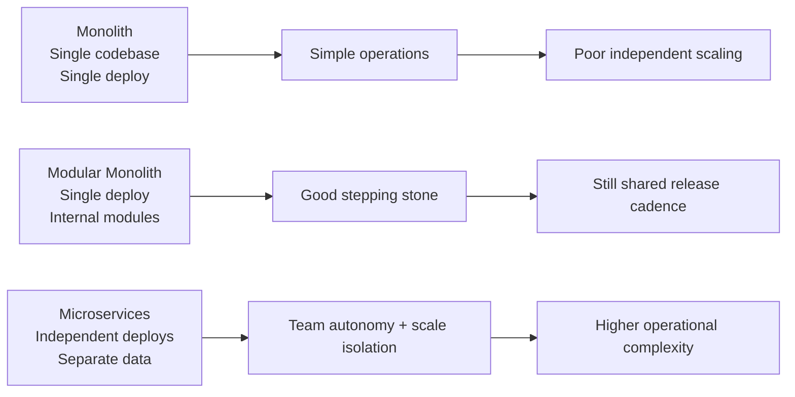
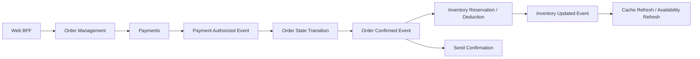
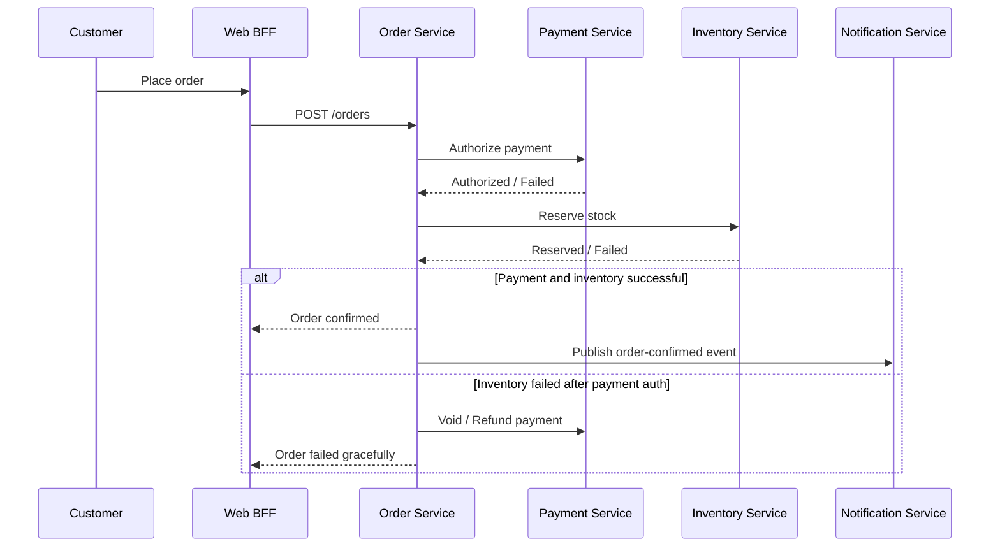
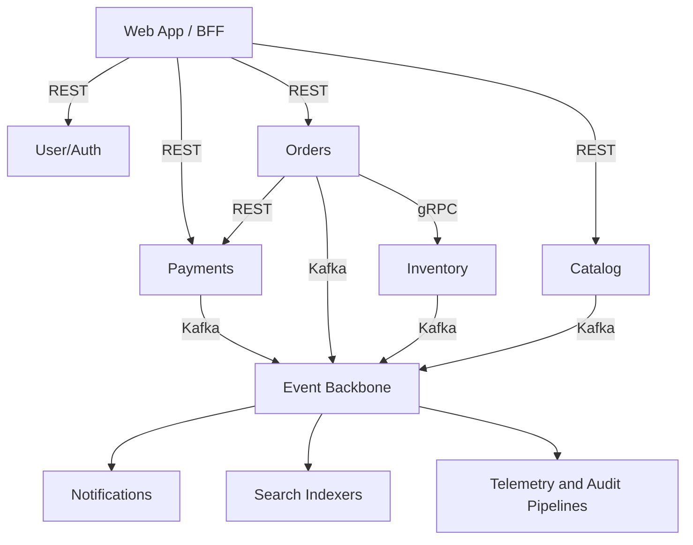
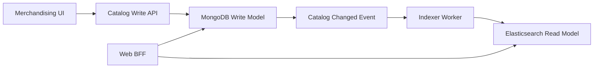
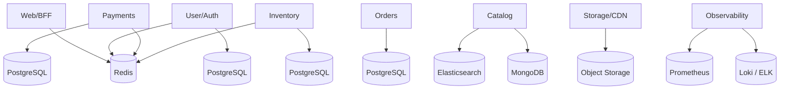
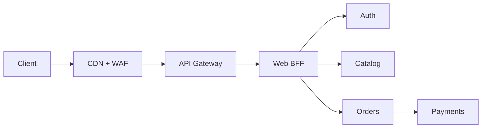

# 01 — System Overview and Design Decisions

> Detailed architecture style, service decomposition, communication strategy, data model, and technology selection rationale for the 10-application ecommerce system.

Cross-read with [`README.md`](./README.md) for the directory overview, [`02-kubernetes-architecture.md`](./02-kubernetes-architecture.md) for runtime deployment design, and [`03-cloud-infrastructure.md`](./03-cloud-infrastructure.md) for cloud provider mapping.

---

## 1. Architecture style decision

### Comparison: monolith vs modular monolith vs microservices

| Dimension | Monolith | Modular monolith | Microservices |
|-----------|----------|------------------|---------------|
| Deployment unit | Single | Single | Many |
| Team autonomy | Low | Medium | High |
| Runtime overhead | Low | Low-medium | High |
| Scale by feature area | Poor | Medium | Excellent |
| Data ownership boundaries | Weak | Medium | Strong |
| Local development simplicity | Excellent | Good | Harder |
| Operational complexity | Lowest | Medium | Highest |
| Best fit | Early product, small team | Medium-scale product with good module discipline | Multi-team, high-growth platform with distinct domains |

### Why microservices for this ecommerce scenario

- Ten applications already map to distinct bounded contexts with different throughput and risk profiles.
- Payments and auth have stronger compliance and security requirements than catalog browsing.
- Product catalog and web traffic are read-heavy, while orders and payments demand stronger consistency.
- Independent scaling prevents the company from scaling the entire platform just because browse traffic spikes.
- Team autonomy matters: frontend, payments, platform, and data teams can release on different cadences.
- Polyglot persistence is justified because search, cache, transactions, and flexible product schemas are not equally served by one datastore.

### When microservices is the wrong choice

- The team is too small to own platform engineering, observability, CI/CD, and distributed debugging.
- The product is still proving product-market fit and the domain boundaries may change drastically every month.
- The organization cannot support an event backbone, contract versioning, and API governance yet.
- Most traffic and logic are simple CRUD with little divergence in scalability or compliance needs.

### Recommendation

For this company, **microservices are appropriate** because there are already ten functionally distinct applications and the business requires differential scaling, stricter isolation for sensitive domains, and a path to platform-level operability.

### Decision drivers and weights

| Driver | Weight | Why it matters here |
|--------|--------|---------------------|
| Checkout reliability | Very high | Orders and payments must degrade gracefully and isolate failures |
| Search flexibility | High | Catalog schema changes frequently and search quality drives conversion |
| Security segmentation | Very high | Payments and identity cannot share weak trust boundaries |
| Team autonomy | High | Multiple teams need independent delivery without serial coordination |
| Operating cost | Medium | Complexity is acceptable if it improves throughput, uptime, and release speed |
| Vendor flexibility | Medium | Cloud-managed services are preferred, but open standards reduce lock-in |

## 2. Application-by-application design decisions

## 1. Payments Service

**What it does:** Processes credit cards, UPI, wallets, refunds, and settlement events with PCI-aware controls.

### Scope and bounded context

Money movement is isolated because the failure modes, compliance scope, and data-retention rules are materially different from the rest of the commerce platform.

Responsibilities:

- Authorize, capture, void, refund, and reconcile payment transactions.
- Persist payment intent, transaction status, gateway reference IDs, and audit evidence.
- Integrate with card acquirers, UPI PSPs, and internal fraud/risk checks.
- Publish payment status events for downstream order and notification processing.

### Technology stack chosen

- **Chosen stack:** Java 21 + Spring Boot 3 + PostgreSQL + Redis + Kafka producer + OpenTelemetry

Why this stack:

- Java and Spring Boot were chosen over lighter frameworks because payment gateways, tokenization SDKs, and PCI tooling are richer and battle-tested in the JVM ecosystem.
- Strong typing and transaction support are more valuable here than startup speed, so Java wins over Node.js for financial correctness.
- The team can enforce idempotency, retries, and connection pooling consistently with Spring patterns.

### Communication pattern and WHY

- **Synchronous pattern:** REST for north-south traffic from the BFF and admin consoles; gRPC only for tightly controlled internal low-latency calls such as fraud scoring or token validation.
- **Asynchronous pattern:** Kafka events for payment-authorized, payment-failed, refund-completed, and reconciliation-completed because order and notification workflows must continue even when consumers are temporarily unavailable.
- **REST vs gRPC decision:** Expose REST externally because browser clients and external partners already expect JSON/HTTPS; keep gRPC optional for internal adapters.
- **Queue/event backbone decision:** Kafka over RabbitMQ for payment event history because replayability and long retention matter for reconciliation and audit.

### Data store and WHY

- **Chosen datastore mix:** PostgreSQL for ACID transaction history, Redis for idempotency keys and short-lived gateway session metadata.
- **Reasoning:** PostgreSQL is preferred over MongoDB because payment rows need foreign keys, strict constraints, immutable audit trails, and consistent ledger-style updates.

### Scaling and SLO profile

- **Scaling characteristic:** Mostly I/O-bound with bursty CPU during signature verification and encryption; horizontal scaling is limited by external PSP rate limits rather than by application logic.
- **Dominant scaling type:** I/O-bound with compliance-sensitive spikes
- **Target SLA:** 99.99%
- **Availability design cue:** Multi-AZ by default, horizontal scale where stateless, managed failover where stateful.

### Security and operability notes

- Sensitive configuration must come from external secrets or workload identity, never from baked container images.
- All write APIs require idempotency strategy so retries are safe during ingress, service mesh, or queue redelivery events.
- Every service emits structured logs, RED metrics, and trace spans using OpenTelemetry.
- Runbooks must define degraded-mode behavior when dependencies are slow or unavailable.
- Payments additionally require tokenization boundaries, HSM/KMS-backed key management, and network isolation from non-PCI workloads.

### Technology decision matrix

| Decision area | Preferred option | Alternatives considered | Why preferred here |
|---------------|------------------|-------------------------|--------------------|
| Runtime / framework | Java 21 | See alternatives below | Best balance of team skill, ecosystem maturity, and operational risk for this domain |
| Persistence | PostgreSQL for ACID transaction history | PostgreSQL, MongoDB, Redis, Elasticsearch as relevant | Aligns storage behavior with domain consistency and query patterns |
| Synchronous API style | REST + optional gRPC | REST-only, gRPC-only | External compatibility remains easy while internal optimization stays possible |
| Event backbone | Kafka | RabbitMQ, direct callbacks, cron polling | Supports decoupling, resilience, and replay where needed |

### Alternatives rejected

- **Node.js:** Excellent I/O but weaker fit for strict transaction workflows and some enterprise-grade payment SDKs.
- **Go:** Fast and simple, but the organization already has more mature JVM payment patterns and compliance libraries.
- **MongoDB:** Flexible, yet weaker for cross-table consistency and relational settlement reports.

### Failure handling model

- Timeouts, retries with backoff, and circuit breaking protect upstream dependencies.
- Idempotent event consumers prevent duplicate side effects after redelivery.
- The service keeps a clear distinction between user-facing errors, retryable infrastructure errors, and operator-action-required failures.
- SLO burn alerts are tied to user impact, not just CPU or memory saturation.

### Cross references

- Runtime and cluster patterns are expanded in [`02-kubernetes-architecture.md`](./02-kubernetes-architecture.md).
- Managed cloud service mapping is covered in [`03-cloud-infrastructure.md`](./03-cloud-infrastructure.md).
- Migration sequencing for this service is described in [`04-onprem-to-cloud-migration.md`](./04-onprem-to-cloud-migration.md).
- DR, RPO, and RTO treatment are documented in [`05-disaster-recovery-and-ha.md`](./05-disaster-recovery-and-ha.md).

---

## 2. E-Commerce Web App

**What it does:** Customer-facing storefront using React/Next.js plus a Backend for Frontend (BFF) for web experience orchestration.

### Scope and bounded context

The storefront changes faster than core domain services, so the BFF isolates UX-driven composition, caching, and response shaping from core business services.

Responsibilities:

- Render category pages, product detail pages, cart, checkout, and account screens.
- Aggregate APIs from catalog, auth, order, payments, and promotions for browser-friendly responses.
- Handle SEO, server-side rendering, personalization, and edge caching concerns.
- Own the browser contract so backend teams can evolve internal APIs without breaking clients.

### Technology stack chosen

- **Chosen stack:** Next.js 14 + React 18 + TypeScript + Node.js 20 BFF + Redis cache + Kong or cloud API gateway in front

Why this stack:

- Next.js is chosen over plain React SPA because ecommerce needs SEO, fast first paint, and route-level SSR/ISR for product discovery.
- TypeScript is favored over untyped JavaScript because the BFF must orchestrate many backend contracts safely.
- A Node.js BFF is a better fit than exposing every service directly because it reduces chatty client traffic and centralizes UI-specific concerns.

### Communication pattern and WHY

- **Synchronous pattern:** REST/JSON to browsers, REST or gRPC to internal services depending on the downstream contract; the BFF shields clients from protocol diversity.
- **Asynchronous pattern:** Subscribes to Kafka or WebSocket push topics for cart updates, order status changes, and personalization refresh triggers when real-time UX is needed.
- **REST vs gRPC decision:** Keep REST for browsers and partner integrations; use gRPC selectively inside the cluster for low-latency high-volume fan-out.
- **Queue/event backbone decision:** Kafka for analytics and event fan-out; avoid RabbitMQ in the page request path because user flows need non-blocking async side effects, not synchronous queue waits.

### Data store and WHY

- **Chosen datastore mix:** Redis for session fragments and edge-friendly cache metadata; no durable system-of-record database inside the BFF.
- **Reasoning:** The BFF should stay stateless where possible, so Redis is preferred over a relational database for ephemeral response caching and rate-limit state.

### Scaling and SLO profile

- **Scaling characteristic:** Read-heavy, latency-sensitive, and moderately CPU-bound during SSR; it scales horizontally behind CDN and ingress.
- **Dominant scaling type:** Read-heavy with bursty CPU for SSR
- **Target SLA:** 99.95%
- **Availability design cue:** Multi-AZ by default, horizontal scale where stateless, managed failover where stateful.

### Security and operability notes

- Sensitive configuration must come from external secrets or workload identity, never from baked container images.
- All write APIs require idempotency strategy so retries are safe during ingress, service mesh, or queue redelivery events.
- Every service emits structured logs, RED metrics, and trace spans using OpenTelemetry.
- Runbooks must define degraded-mode behavior when dependencies are slow or unavailable.

### Technology decision matrix

| Decision area | Preferred option | Alternatives considered | Why preferred here |
|---------------|------------------|-------------------------|--------------------|
| Runtime / framework | Next.js 14 | See alternatives below | Best balance of team skill, ecosystem maturity, and operational risk for this domain |
| Persistence | Redis for session fragments and edge-friendly cache metadata; no durable system-of-record database inside the BFF. | PostgreSQL, MongoDB, Redis, Elasticsearch as relevant | Aligns storage behavior with domain consistency and query patterns |
| Synchronous API style | REST + optional gRPC | REST-only, gRPC-only | External compatibility remains easy while internal optimization stays possible |
| Event backbone | Kafka | RabbitMQ, direct callbacks, cron polling | Supports decoupling, resilience, and replay where needed |

### Alternatives rejected

- **Pure SPA:** Cheaper to host, but weaker SEO and slower first render for discovery and checkout funnels.
- **GraphQL gateway only:** Flexible, but often overcomplicates caching and browser contracts if teams are early in maturity.
- **Direct-to-service calls:** Increases frontend coupling and duplicates auth, pagination, and aggregation logic in the browser.

### Failure handling model

- Timeouts, retries with backoff, and circuit breaking protect upstream dependencies.
- Idempotent event consumers prevent duplicate side effects after redelivery.
- The service keeps a clear distinction between user-facing errors, retryable infrastructure errors, and operator-action-required failures.
- SLO burn alerts are tied to user impact, not just CPU or memory saturation.

### Cross references

- Runtime and cluster patterns are expanded in [`02-kubernetes-architecture.md`](./02-kubernetes-architecture.md).
- Managed cloud service mapping is covered in [`03-cloud-infrastructure.md`](./03-cloud-infrastructure.md).
- Migration sequencing for this service is described in [`04-onprem-to-cloud-migration.md`](./04-onprem-to-cloud-migration.md).
- DR, RPO, and RTO treatment are documented in [`05-disaster-recovery-and-ha.md`](./05-disaster-recovery-and-ha.md).

---

## 3. Product Catalog Service

**What it does:** Stores product listings, categories, attributes, and search-facing content for browse and discovery.

### Scope and bounded context

Catalog changes frequently and has flexible product schemas that vary by category, which makes it a separate bounded context from transactional order data.

Responsibilities:

- Manage product master data, category trees, variants, and merchandising attributes.
- Provide browse APIs, merchandising filters, and category navigation metadata.
- Publish catalog change events for search indexing, cache invalidation, and downstream merchandising tools.
- Maintain read models tuned for search and high-cardinality attribute filtering.

### Technology stack chosen

- **Chosen stack:** TypeScript + NestJS + MongoDB + Elasticsearch + Redis cache + Kafka

Why this stack:

- NestJS brings structure and testability without the heavier JVM footprint, useful for a service that evolves schema often.
- MongoDB is chosen over PostgreSQL for product authoring because category-specific attributes change frequently and should not require repeated schema migrations.
- Elasticsearch complements MongoDB by serving search, faceting, and typo tolerance faster than relational queries.

### Communication pattern and WHY

- **Synchronous pattern:** REST for admin and public catalog APIs; gRPC can be added for internal fan-out reads from the BFF when latency budgets tighten.
- **Asynchronous pattern:** Kafka catalog-updated and product-published events drive search indexing, recommendation refresh, and cache invalidation.
- **REST vs gRPC decision:** REST remains the default because search APIs evolve rapidly and are easier to expose through gateways and CDN caches.
- **Queue/event backbone decision:** Kafka over RabbitMQ because replayable product change streams are valuable when rebuilding search indexes.

### Data store and WHY

- **Chosen datastore mix:** MongoDB as write store, Elasticsearch as read/search store, Redis for hot product fragments.
- **Reasoning:** This is a classic CQRS-friendly domain where document writes and search-optimized reads have different access patterns.

### Scaling and SLO profile

- **Scaling characteristic:** Read-heavy, memory- and I/O-sensitive because search, faceting, and cache hit rate dominate performance.
- **Dominant scaling type:** Memory- and I/O-heavy with index pressure
- **Target SLA:** 99.95%
- **Availability design cue:** Multi-AZ by default, horizontal scale where stateless, managed failover where stateful.

### Security and operability notes

- Sensitive configuration must come from external secrets or workload identity, never from baked container images.
- All write APIs require idempotency strategy so retries are safe during ingress, service mesh, or queue redelivery events.
- Every service emits structured logs, RED metrics, and trace spans using OpenTelemetry.
- Runbooks must define degraded-mode behavior when dependencies are slow or unavailable.

### Technology decision matrix

| Decision area | Preferred option | Alternatives considered | Why preferred here |
|---------------|------------------|-------------------------|--------------------|
| Runtime / framework | TypeScript | See alternatives below | Best balance of team skill, ecosystem maturity, and operational risk for this domain |
| Persistence | MongoDB as write store | PostgreSQL, MongoDB, Redis, Elasticsearch as relevant | Aligns storage behavior with domain consistency and query patterns |
| Synchronous API style | REST + optional gRPC | REST-only, gRPC-only | External compatibility remains easy while internal optimization stays possible |
| Event backbone | Kafka | RabbitMQ, direct callbacks, cron polling | Supports decoupling, resilience, and replay where needed |

### Alternatives rejected

- **PostgreSQL JSONB:** Works initially, but complex filtering and synonym search become harder at scale.
- **Solr:** Strong search engine, yet Elasticsearch has broader managed-service availability and team familiarity.
- **Graph database:** Interesting for recommendation edges, but not necessary for the core catalog authoring path.

### Failure handling model

- Timeouts, retries with backoff, and circuit breaking protect upstream dependencies.
- Idempotent event consumers prevent duplicate side effects after redelivery.
- The service keeps a clear distinction between user-facing errors, retryable infrastructure errors, and operator-action-required failures.
- SLO burn alerts are tied to user impact, not just CPU or memory saturation.

### Cross references

- Runtime and cluster patterns are expanded in [`02-kubernetes-architecture.md`](./02-kubernetes-architecture.md).
- Managed cloud service mapping is covered in [`03-cloud-infrastructure.md`](./03-cloud-infrastructure.md).
- Migration sequencing for this service is described in [`04-onprem-to-cloud-migration.md`](./04-onprem-to-cloud-migration.md).
- DR, RPO, and RTO treatment are documented in [`05-disaster-recovery-and-ha.md`](./05-disaster-recovery-and-ha.md).

---

## 4. Order Management Service

**What it does:** Owns cart checkout outcome, order lifecycle, fulfillment status, returns, and customer-visible order state.

### Scope and bounded context

Order data is a transactional core domain with strong consistency needs, explicit state machines, and auditable lifecycle changes.

Responsibilities:

- Create orders, reserve status transitions, and persist the source-of-truth lifecycle record.
- Coordinate fulfillment, cancellation, returns, and customer service state changes.
- Expose order history and status APIs for BFF, support, and downstream analytics.
- Consume payment, inventory, and shipment events to advance lifecycle transitions.

### Technology stack chosen

- **Chosen stack:** Java 21 + Spring Boot 3 + PostgreSQL + Kafka + Redis cache

Why this stack:

- Spring Boot is chosen because saga orchestration, retry semantics, and state-machine patterns are well understood in the JVM ecosystem.
- PostgreSQL is favored for strict consistency, reporting joins, and transactional state changes.
- Redis accelerates read-mostly order lookups and idempotency checks during retries.

### Communication pattern and WHY

- **Synchronous pattern:** REST for query and admin operations; gRPC for low-latency internal calls such as synchronous stock checks when required by checkout.
- **Asynchronous pattern:** Kafka events drive downstream shipping, notification, analytics, and compensating actions.
- **REST vs gRPC decision:** Keep REST where human-facing and partner-facing APIs dominate; use gRPC internally when strict latency and schema contracts matter.
- **Queue/event backbone decision:** Kafka because order timelines benefit from immutable event logs and downstream replay.

### Data store and WHY

- **Chosen datastore mix:** PostgreSQL primary store with Redis for cache and idempotency.
- **Reasoning:** Order state transitions and return workflows need ACID semantics, row-level locking, and strong referential integrity.

### Scaling and SLO profile

- **Scaling characteristic:** Write-sensitive and I/O-bound with moderate CPU during promotions, tax, or fraud enrichment.
- **Dominant scaling type:** Write-sensitive and I/O-bound
- **Target SLA:** 99.99%
- **Availability design cue:** Multi-AZ by default, horizontal scale where stateless, managed failover where stateful.

### Security and operability notes

- Sensitive configuration must come from external secrets or workload identity, never from baked container images.
- All write APIs require idempotency strategy so retries are safe during ingress, service mesh, or queue redelivery events.
- Every service emits structured logs, RED metrics, and trace spans using OpenTelemetry.
- Runbooks must define degraded-mode behavior when dependencies are slow or unavailable.

### Technology decision matrix

| Decision area | Preferred option | Alternatives considered | Why preferred here |
|---------------|------------------|-------------------------|--------------------|
| Runtime / framework | Java 21 | See alternatives below | Best balance of team skill, ecosystem maturity, and operational risk for this domain |
| Persistence | PostgreSQL primary store with Redis for cache and idempotency. | PostgreSQL, MongoDB, Redis, Elasticsearch as relevant | Aligns storage behavior with domain consistency and query patterns |
| Synchronous API style | REST + optional gRPC | REST-only, gRPC-only | External compatibility remains easy while internal optimization stays possible |
| Event backbone | Kafka | RabbitMQ, direct callbacks, cron polling | Supports decoupling, resilience, and replay where needed |

### Alternatives rejected

- **Workflow engine only:** Useful for orchestration, but the service still needs a durable order model and APIs.
- **MongoDB:** Flexible, yet weaker for complex lifecycle reporting and relational integrity.
- **RabbitMQ:** Good for task queues, but Kafka better fits event history and replay for order state rebuilds.

### Failure handling model

- Timeouts, retries with backoff, and circuit breaking protect upstream dependencies.
- Idempotent event consumers prevent duplicate side effects after redelivery.
- The service keeps a clear distinction between user-facing errors, retryable infrastructure errors, and operator-action-required failures.
- SLO burn alerts are tied to user impact, not just CPU or memory saturation.

### Cross references

- Runtime and cluster patterns are expanded in [`02-kubernetes-architecture.md`](./02-kubernetes-architecture.md).
- Managed cloud service mapping is covered in [`03-cloud-infrastructure.md`](./03-cloud-infrastructure.md).
- Migration sequencing for this service is described in [`04-onprem-to-cloud-migration.md`](./04-onprem-to-cloud-migration.md).
- DR, RPO, and RTO treatment are documented in [`05-disaster-recovery-and-ha.md`](./05-disaster-recovery-and-ha.md).

---

## 5. User/Auth Service

**What it does:** Handles registration, login, OAuth/OIDC federation, token issuance, sessions, and account security controls.

### Scope and bounded context

Identity is a foundational capability with unique security, auditing, and privacy requirements that should not be embedded in the storefront.

Responsibilities:

- Manage identities, credentials, MFA, password resets, and OAuth/OIDC federation.
- Issue JWTs or opaque tokens and validate sessions for BFF and internal APIs.
- Publish account events such as user-created, password-reset, and consent-updated.
- Store profile and preference data that is not better owned by marketing or CRM systems.

### Technology stack chosen

- **Chosen stack:** Go 1.22 + Gin or Fiber + PostgreSQL + Redis + Keycloak/OIDC integration + OpenTelemetry

Why this stack:

- Go is chosen over heavier runtimes because auth traffic is latency-sensitive and highly concurrent.
- A thin Go service around standards-based OIDC keeps custom logic focused on business-specific identity needs rather than reinventing a full IAM suite.
- Redis provides fast session and token revocation checks that would be inefficient in a relational database alone.

### Communication pattern and WHY

- **Synchronous pattern:** REST/OIDC endpoints for browsers and mobile clients; internal token introspection may use gRPC if service mesh identity checks need lower latency.
- **Asynchronous pattern:** Kafka account events feed analytics, notification, and personalization systems without coupling them to login flows.
- **REST vs gRPC decision:** REST/OIDC externally because standards matter; gRPC remains an internal optimization only.
- **Queue/event backbone decision:** Kafka because identity events may be replayed into customer data platforms and audit pipelines.

### Data store and WHY

- **Chosen datastore mix:** PostgreSQL for identity records and consent audit, Redis for sessions, revocation lists, and rate-limit counters.
- **Reasoning:** Identity needs transactional integrity and privacy controls; Redis augments, not replaces, the relational source of truth.

### Scaling and SLO profile

- **Scaling characteristic:** I/O-bound, latency-sensitive, and cache-heavy with spike patterns around campaigns or flash sales.
- **Dominant scaling type:** Latency-sensitive, cache-heavy I/O
- **Target SLA:** 99.99%
- **Availability design cue:** Multi-AZ by default, horizontal scale where stateless, managed failover where stateful.

### Security and operability notes

- Sensitive configuration must come from external secrets or workload identity, never from baked container images.
- All write APIs require idempotency strategy so retries are safe during ingress, service mesh, or queue redelivery events.
- Every service emits structured logs, RED metrics, and trace spans using OpenTelemetry.
- Runbooks must define degraded-mode behavior when dependencies are slow or unavailable.
- Auth additionally requires MFA support, suspicious login telemetry, brute-force protection, and privacy-aware audit retention.

### Technology decision matrix

| Decision area | Preferred option | Alternatives considered | Why preferred here |
|---------------|------------------|-------------------------|--------------------|
| Runtime / framework | Go 1.22 | See alternatives below | Best balance of team skill, ecosystem maturity, and operational risk for this domain |
| Persistence | PostgreSQL for identity records and consent audit | PostgreSQL, MongoDB, Redis, Elasticsearch as relevant | Aligns storage behavior with domain consistency and query patterns |
| Synchronous API style | REST + optional gRPC | REST-only, gRPC-only | External compatibility remains easy while internal optimization stays possible |
| Event backbone | Kafka | RabbitMQ, direct callbacks, cron polling | Supports decoupling, resilience, and replay where needed |

### Alternatives rejected

- **Custom auth inside web app:** Fast to start, but quickly becomes unmanageable for OAuth, MFA, and security reviews.
- **Pure managed IAM only:** Great for workforce identity, yet customer-facing commerce usually still needs custom profile, consent, and integration logic.
- **MongoDB:** Not ideal for strong account consistency and auditable credential workflows.

### Failure handling model

- Timeouts, retries with backoff, and circuit breaking protect upstream dependencies.
- Idempotent event consumers prevent duplicate side effects after redelivery.
- The service keeps a clear distinction between user-facing errors, retryable infrastructure errors, and operator-action-required failures.
- SLO burn alerts are tied to user impact, not just CPU or memory saturation.

### Cross references

- Runtime and cluster patterns are expanded in [`02-kubernetes-architecture.md`](./02-kubernetes-architecture.md).
- Managed cloud service mapping is covered in [`03-cloud-infrastructure.md`](./03-cloud-infrastructure.md).
- Migration sequencing for this service is described in [`04-onprem-to-cloud-migration.md`](./04-onprem-to-cloud-migration.md).
- DR, RPO, and RTO treatment are documented in [`05-disaster-recovery-and-ha.md`](./05-disaster-recovery-and-ha.md).

---

## 6. Inventory Service

**What it does:** Tracks stock, reservations, warehouse synchronization, and availability decisions across fulfillment locations.

### Scope and bounded context

Inventory combines transactional reservation logic with batch synchronization from warehouses, so it requires its own scaling and integration strategy.

Responsibilities:

- Manage on-hand, reserved, in-transit, and safety stock quantities per SKU and location.
- Synchronize inventory deltas with warehouse management systems and ERP feeds.
- Serve availability APIs to checkout, product detail pages, and customer support tools.
- Publish stock-changed and reservation-expired events to downstream consumers.

### Technology stack chosen

- **Chosen stack:** Go 1.22 + gRPC/REST + PostgreSQL + Redis + Kafka + scheduled sync jobs

Why this stack:

- Go is selected because the service performs many concurrent warehouse adapter calls and benefits from low memory overhead.
- PostgreSQL handles reservation correctness and relational warehouse mappings.
- Redis is ideal for short-lived reservation tokens and hot availability cache entries.

### Communication pattern and WHY

- **Synchronous pattern:** gRPC for low-latency reservation checks from order management, REST for admin and warehouse adapter endpoints.
- **Asynchronous pattern:** Kafka for stock-updated and reservation-released events; batch sync jobs push deltas without holding checkout requests open.
- **REST vs gRPC decision:** gRPC internally because availability checks are called at high volume and benefit from compact payloads.
- **Queue/event backbone decision:** Kafka for durable stock history and downstream rebuilds; RabbitMQ may still be used by warehouse adapter tasks if strict work queue semantics are required.

### Data store and WHY

- **Chosen datastore mix:** PostgreSQL for source-of-truth stock records, Redis for availability cache and reservation TTL state.
- **Reasoning:** Inventory errors are expensive, so strong consistency on writes beats the convenience of schema-free stores.

### Scaling and SLO profile

- **Scaling characteristic:** Mixed workload: CPU during reconciliation, I/O during warehouse sync, and low-latency reads during browse/checkout peaks.
- **Dominant scaling type:** Mixed CPU/I-O with burst reads
- **Target SLA:** 99.95%
- **Availability design cue:** Multi-AZ by default, horizontal scale where stateless, managed failover where stateful.

### Security and operability notes

- Sensitive configuration must come from external secrets or workload identity, never from baked container images.
- All write APIs require idempotency strategy so retries are safe during ingress, service mesh, or queue redelivery events.
- Every service emits structured logs, RED metrics, and trace spans using OpenTelemetry.
- Runbooks must define degraded-mode behavior when dependencies are slow or unavailable.

### Technology decision matrix

| Decision area | Preferred option | Alternatives considered | Why preferred here |
|---------------|------------------|-------------------------|--------------------|
| Runtime / framework | Go 1.22 | See alternatives below | Best balance of team skill, ecosystem maturity, and operational risk for this domain |
| Persistence | PostgreSQL for source-of-truth stock records | PostgreSQL, MongoDB, Redis, Elasticsearch as relevant | Aligns storage behavior with domain consistency and query patterns |
| Synchronous API style | REST + optional gRPC | REST-only, gRPC-only | External compatibility remains easy while internal optimization stays possible |
| Event backbone | Kafka | RabbitMQ, direct callbacks, cron polling | Supports decoupling, resilience, and replay where needed |

### Alternatives rejected

- **In-memory only:** Fast but unsafe for durable reservations and auditability.
- **MongoDB:** Flexible yet weaker for reservation consistency.
- **RabbitMQ only:** Good for task dispatch, but Kafka is better for durable stock event fan-out and replay.

### Failure handling model

- Timeouts, retries with backoff, and circuit breaking protect upstream dependencies.
- Idempotent event consumers prevent duplicate side effects after redelivery.
- The service keeps a clear distinction between user-facing errors, retryable infrastructure errors, and operator-action-required failures.
- SLO burn alerts are tied to user impact, not just CPU or memory saturation.

### Cross references

- Runtime and cluster patterns are expanded in [`02-kubernetes-architecture.md`](./02-kubernetes-architecture.md).
- Managed cloud service mapping is covered in [`03-cloud-infrastructure.md`](./03-cloud-infrastructure.md).
- Migration sequencing for this service is described in [`04-onprem-to-cloud-migration.md`](./04-onprem-to-cloud-migration.md).
- DR, RPO, and RTO treatment are documented in [`05-disaster-recovery-and-ha.md`](./05-disaster-recovery-and-ha.md).

---

## 7. Notification Service

**What it does:** Sends email, SMS, and push notifications based on domain events and customer communication preferences.

### Scope and bounded context

Notification workloads are asynchronous, provider-driven, and best modeled as queue consumers rather than synchronous APIs.

Responsibilities:

- Template and send transactional notifications for order updates, payment outcomes, and account activity.
- Enforce customer preferences, throttling, and provider failover logic.
- Track delivery receipts, bounces, and suppression lists.
- Provide admin APIs for template versioning and communication audit.

### Technology stack chosen

- **Chosen stack:** Node.js 20 + TypeScript workers + Kafka consumers + Redis + provider SDK adapters

Why this stack:

- Node.js is excellent for I/O-heavy adapter fan-out to SMTP, SMS, and push APIs.
- TypeScript improves template contract safety and event payload validation.
- A worker-centric model is simpler than exposing many synchronous notification APIs.

### Communication pattern and WHY

- **Synchronous pattern:** Lightweight REST only for template management and delivery-status lookup.
- **Asynchronous pattern:** Kafka or queue-first processing for notification-requested events; optionally RabbitMQ for retry/dead-letter routing if the team wants stronger queue semantics for provider delivery attempts.
- **REST vs gRPC decision:** REST is enough because external traffic is minimal and the hot path is event consumption, not API throughput.
- **Queue/event backbone decision:** RabbitMQ can be attractive for retry and DLQ semantics, but Kafka is preferred if the broader platform already standardizes on event streams and replay.

### Data store and WHY

- **Chosen datastore mix:** Redis for rate limiting and deduplication, PostgreSQL or document store for template metadata and audit records.
- **Reasoning:** Most state is ephemeral or append-only; storing templates separately keeps the worker fleet stateless.

### Scaling and SLO profile

- **Scaling characteristic:** Purely I/O-bound and elastic; scale based on queue depth instead of CPU alone.
- **Dominant scaling type:** Elastic I/O-bound queue workers
- **Target SLA:** 99.9%
- **Availability design cue:** Multi-AZ by default, horizontal scale where stateless, managed failover where stateful.

### Security and operability notes

- Sensitive configuration must come from external secrets or workload identity, never from baked container images.
- All write APIs require idempotency strategy so retries are safe during ingress, service mesh, or queue redelivery events.
- Every service emits structured logs, RED metrics, and trace spans using OpenTelemetry.
- Runbooks must define degraded-mode behavior when dependencies are slow or unavailable.

### Technology decision matrix

| Decision area | Preferred option | Alternatives considered | Why preferred here |
|---------------|------------------|-------------------------|--------------------|
| Runtime / framework | Node.js 20 | See alternatives below | Best balance of team skill, ecosystem maturity, and operational risk for this domain |
| Persistence | Redis for rate limiting and deduplication | PostgreSQL, MongoDB, Redis, Elasticsearch as relevant | Aligns storage behavior with domain consistency and query patterns |
| Synchronous API style | REST | REST-only, gRPC-only | External compatibility remains easy while internal optimization stays possible |
| Event backbone | Kafka | RabbitMQ, direct callbacks, cron polling | Supports decoupling, resilience, and replay where needed |

### Alternatives rejected

- **Cron-based mailer:** Simple, but too slow and opaque for real-time transactional communication.
- **Serverless only:** Attractive for sporadic load, but long-tail provider retries and template control can become harder to manage.
- **Synchronous notifications from order service:** Would extend checkout latency and tightly couple downstream providers to core flows.

### Failure handling model

- Timeouts, retries with backoff, and circuit breaking protect upstream dependencies.
- Idempotent event consumers prevent duplicate side effects after redelivery.
- The service keeps a clear distinction between user-facing errors, retryable infrastructure errors, and operator-action-required failures.
- SLO burn alerts are tied to user impact, not just CPU or memory saturation.

### Cross references

- Runtime and cluster patterns are expanded in [`02-kubernetes-architecture.md`](./02-kubernetes-architecture.md).
- Managed cloud service mapping is covered in [`03-cloud-infrastructure.md`](./03-cloud-infrastructure.md).
- Migration sequencing for this service is described in [`04-onprem-to-cloud-migration.md`](./04-onprem-to-cloud-migration.md).
- DR, RPO, and RTO treatment are documented in [`05-disaster-recovery-and-ha.md`](./05-disaster-recovery-and-ha.md).

---

## 8. Database Layer

**What it does:** Platform data tier spanning relational stores, document stores, cache, search, backups, and data protection controls.

### Scope and bounded context

Although data stores support all domains, the platform data layer is treated as its own architecture concern because operational controls and sizing decisions span the whole system.

Responsibilities:

- Provide managed PostgreSQL, MongoDB-compatible, Redis, and Elasticsearch/OpenSearch data services.
- Enforce backup, encryption, retention, patching, and access control guardrails.
- Support read replicas, cross-region replication, maintenance windows, and performance monitoring.
- Offer service-by-service logical isolation using separate schemas, databases, or clusters as required.

### Technology stack chosen

- **Chosen stack:** Managed PostgreSQL + managed MongoDB-compatible service + managed Redis + managed Elasticsearch/OpenSearch

Why this stack:

- Managed databases are chosen over self-managed StatefulSets for production because backups, failover, patching, and storage tuning are offloaded to the provider.
- Polyglot persistence is intentional because a single engine is rarely optimal for transactions, search, and cache simultaneously.
- Separation by workload reduces blast radius and lets each team scale independently.

### Communication pattern and WHY

- **Synchronous pattern:** Data access is never exposed directly to clients; application services remain the only supported ingress path.
- **Asynchronous pattern:** Replication streams, CDC, and snapshot pipelines feed analytics and DR environments.
- **REST vs gRPC decision:** Not applicable at the client edge; protocols are internal library or driver choices owned by each service.
- **Queue/event backbone decision:** CDC pipelines and Kafka integration are preferred for downstream projections and DR replay.

### Data store and WHY

- **Chosen datastore mix:** PostgreSQL, MongoDB, Redis, Elasticsearch/OpenSearch, plus object storage for backups and large assets.
- **Reasoning:** Each engine exists because the business has distinct consistency, query, and retention needs.

### Scaling and SLO profile

- **Scaling characteristic:** Varies by engine: PostgreSQL write-bound, MongoDB document/index-heavy, Redis memory-bound, search CPU and I/O-bound.
- **Dominant scaling type:** Mixed: write-, memory-, and index-bound
- **Target SLA:** 99.99%
- **Availability design cue:** Multi-AZ by default, horizontal scale where stateless, managed failover where stateful.

### Security and operability notes

- Sensitive configuration must come from external secrets or workload identity, never from baked container images.
- All write APIs require idempotency strategy so retries are safe during ingress, service mesh, or queue redelivery events.
- Every service emits structured logs, RED metrics, and trace spans using OpenTelemetry.
- Runbooks must define degraded-mode behavior when dependencies are slow or unavailable.

### Technology decision matrix

| Decision area | Preferred option | Alternatives considered | Why preferred here |
|---------------|------------------|-------------------------|--------------------|
| Runtime / framework | Managed PostgreSQL | See alternatives below | Best balance of team skill, ecosystem maturity, and operational risk for this domain |
| Persistence | PostgreSQL | PostgreSQL, MongoDB, Redis, Elasticsearch as relevant | Aligns storage behavior with domain consistency and query patterns |
| Synchronous API style | REST | REST-only, gRPC-only | External compatibility remains easy while internal optimization stays possible |
| Event backbone | Kafka | RabbitMQ, direct callbacks, cron polling | Supports decoupling, resilience, and replay where needed |

### Alternatives rejected

- **Single PostgreSQL cluster for everything:** Operationally simpler but eventually inefficient for search, caching, and flexible product schemas.
- **Self-managed on Kubernetes:** Possible, but the day-2 burden is high for a commerce production platform.
- **Cloud-native NoSQL only:** Would weaken ACID guarantees for payments and orders.

### Failure handling model

- Timeouts, retries with backoff, and circuit breaking protect upstream dependencies.
- Idempotent event consumers prevent duplicate side effects after redelivery.
- The service keeps a clear distinction between user-facing errors, retryable infrastructure errors, and operator-action-required failures.
- SLO burn alerts are tied to user impact, not just CPU or memory saturation.

### Cross references

- Runtime and cluster patterns are expanded in [`02-kubernetes-architecture.md`](./02-kubernetes-architecture.md).
- Managed cloud service mapping is covered in [`03-cloud-infrastructure.md`](./03-cloud-infrastructure.md).
- Migration sequencing for this service is described in [`04-onprem-to-cloud-migration.md`](./04-onprem-to-cloud-migration.md).
- DR, RPO, and RTO treatment are documented in [`05-disaster-recovery-and-ha.md`](./05-disaster-recovery-and-ha.md).

---

## 9. Storage/CDN

**What it does:** Stores images, videos, static assets, user uploads, and distributes them globally through a CDN edge layer.

### Scope and bounded context

Object storage and CDN are shared platform capabilities with different durability, latency, and security concerns than application services.

Responsibilities:

- Persist product media, marketing assets, downloadable invoices, and customer uploads.
- Serve static web assets, optimized images, and edge-cached content globally.
- Apply retention, lifecycle, antivirus scanning, and signed URL policies.
- Support media transformation and origin shielding patterns.

### Technology stack chosen

- **Chosen stack:** S3/Blob/GCS object storage + CloudFront/Azure CDN/Cloud CDN + image optimization workers + signed URLs

Why this stack:

- Object storage beats block storage for durability, lifecycle policies, and large-scale static content.
- A CDN is essential because global asset latency cannot be solved by scaling the web app alone.
- Signed URLs and origin access controls reduce the need for app servers to proxy large uploads and downloads.

### Communication pattern and WHY

- **Synchronous pattern:** HTTPS origin fetch via CDN and pre-signed upload workflows from the BFF.
- **Asynchronous pattern:** Event notifications on object creation trigger virus scans, thumbnail generation, and metadata extraction.
- **REST vs gRPC decision:** HTTPS and pre-signed URLs are the right fit because browsers and mobile apps must upload directly.
- **Queue/event backbone decision:** Event notifications into Kafka or cloud queue services support asynchronous media processing.

### Data store and WHY

- **Chosen datastore mix:** Object storage as system of record, CDN edge caches for distribution.
- **Reasoning:** Binary asset workloads are cost-optimized and operationally simpler in object storage than in relational or document databases.

### Scaling and SLO profile

- **Scaling characteristic:** Bandwidth-heavy and globally distributed; scale is dominated by throughput and cache hit ratio, not app CPU.
- **Dominant scaling type:** Bandwidth- and cache-hit driven
- **Target SLA:** 99.95%
- **Availability design cue:** Multi-AZ by default, horizontal scale where stateless, managed failover where stateful.

### Security and operability notes

- Sensitive configuration must come from external secrets or workload identity, never from baked container images.
- All write APIs require idempotency strategy so retries are safe during ingress, service mesh, or queue redelivery events.
- Every service emits structured logs, RED metrics, and trace spans using OpenTelemetry.
- Runbooks must define degraded-mode behavior when dependencies are slow or unavailable.

### Technology decision matrix

| Decision area | Preferred option | Alternatives considered | Why preferred here |
|---------------|------------------|-------------------------|--------------------|
| Runtime / framework | S3/Blob/GCS object storage | See alternatives below | Best balance of team skill, ecosystem maturity, and operational risk for this domain |
| Persistence | Object storage as system of record | PostgreSQL, MongoDB, Redis, Elasticsearch as relevant | Aligns storage behavior with domain consistency and query patterns |
| Synchronous API style | REST | REST-only, gRPC-only | External compatibility remains easy while internal optimization stays possible |
| Event backbone | Kafka | RabbitMQ, direct callbacks, cron polling | Supports decoupling, resilience, and replay where needed |

### Alternatives rejected

- **Serve assets from web pods:** Simple but expensive, slow, and operationally fragile.
- **NFS only:** Useful for shared files, but poor for internet-scale media distribution.
- **Database BLOBs:** Expensive and operationally inefficient at large media volume.

### Failure handling model

- Timeouts, retries with backoff, and circuit breaking protect upstream dependencies.
- Idempotent event consumers prevent duplicate side effects after redelivery.
- The service keeps a clear distinction between user-facing errors, retryable infrastructure errors, and operator-action-required failures.
- SLO burn alerts are tied to user impact, not just CPU or memory saturation.

### Cross references

- Runtime and cluster patterns are expanded in [`02-kubernetes-architecture.md`](./02-kubernetes-architecture.md).
- Managed cloud service mapping is covered in [`03-cloud-infrastructure.md`](./03-cloud-infrastructure.md).
- Migration sequencing for this service is described in [`04-onprem-to-cloud-migration.md`](./04-onprem-to-cloud-migration.md).
- DR, RPO, and RTO treatment are documented in [`05-disaster-recovery-and-ha.md`](./05-disaster-recovery-and-ha.md).

---

## 10. Monitoring & Observability

**What it does:** Collects metrics, logs, traces, SLOs, dashboards, and alerting for platform and business health.

### Scope and bounded context

Observability is its own platform product because every service depends on it but no single domain team should own its standards or tooling alone.

Responsibilities:

- Scrape service and infrastructure metrics, collect logs, and aggregate traces.
- Provide dashboards for platform SRE metrics and ecommerce business KPIs.
- Alert on golden signals, queue lag, payment errors, checkout conversion, and infrastructure saturation.
- Support post-incident analysis, synthetic checks, and cost visibility.

### Technology stack chosen

- **Chosen stack:** Prometheus + Grafana + Loki/ELK + Tempo/Jaeger + OpenTelemetry + Alertmanager + cloud-native monitors

Why this stack:

- Prometheus and Grafana remain the default because they integrate cleanly with Kubernetes and are widely understood.
- OpenTelemetry is chosen over proprietary tracing libraries to avoid vendor lock-in and keep instrumentation portable.
- Combining platform and cloud-native observability avoids blind spots across Kubernetes, managed services, and CDN edges.

### Communication pattern and WHY

- **Synchronous pattern:** Read-only dashboards and API queries; no latency-critical synchronous business path depends on observability components.
- **Asynchronous pattern:** Metrics scraping, log shipping, trace export, and alert routing are all asynchronous pipelines by design.
- **REST vs gRPC decision:** Not a key design variable; standard scrape endpoints and OTLP exports matter more.
- **Queue/event backbone decision:** Kafka can buffer telemetry bursts, but many teams start with agent-based shipping and add Kafka only when scale requires it.

### Data store and WHY

- **Chosen datastore mix:** Prometheus TSDB, Loki or Elasticsearch for logs, Tempo/Jaeger for traces, object storage for long retention.
- **Reasoning:** Observability data is high volume and append-only, so specialized engines are more efficient than general-purpose databases.

### Scaling and SLO profile

- **Scaling characteristic:** Write-heavy, I/O- and storage-bound with predictable ingestion bursts during incidents.
- **Dominant scaling type:** Write-heavy and storage-bound
- **Target SLA:** 99.9%
- **Availability design cue:** Multi-AZ by default, horizontal scale where stateless, managed failover where stateful.

### Security and operability notes

- Sensitive configuration must come from external secrets or workload identity, never from baked container images.
- All write APIs require idempotency strategy so retries are safe during ingress, service mesh, or queue redelivery events.
- Every service emits structured logs, RED metrics, and trace spans using OpenTelemetry.
- Runbooks must define degraded-mode behavior when dependencies are slow or unavailable.

### Technology decision matrix

| Decision area | Preferred option | Alternatives considered | Why preferred here |
|---------------|------------------|-------------------------|--------------------|
| Runtime / framework | Prometheus | See alternatives below | Best balance of team skill, ecosystem maturity, and operational risk for this domain |
| Persistence | Prometheus TSDB | PostgreSQL, MongoDB, Redis, Elasticsearch as relevant | Aligns storage behavior with domain consistency and query patterns |
| Synchronous API style | REST | REST-only, gRPC-only | External compatibility remains easy while internal optimization stays possible |
| Event backbone | Kafka | RabbitMQ, direct callbacks, cron polling | Supports decoupling, resilience, and replay where needed |

### Alternatives rejected

- **Single vendor APM only:** Fast to start, but lock-in and cost growth can become painful.
- **Logs only:** Insufficient for latency and dependency analysis.
- **Prometheus only:** Metrics alone miss request traces and rich search over logs.

### Failure handling model

- Timeouts, retries with backoff, and circuit breaking protect upstream dependencies.
- Idempotent event consumers prevent duplicate side effects after redelivery.
- The service keeps a clear distinction between user-facing errors, retryable infrastructure errors, and operator-action-required failures.
- SLO burn alerts are tied to user impact, not just CPU or memory saturation.

### Cross references

- Runtime and cluster patterns are expanded in [`02-kubernetes-architecture.md`](./02-kubernetes-architecture.md).
- Managed cloud service mapping is covered in [`03-cloud-infrastructure.md`](./03-cloud-infrastructure.md).
- Migration sequencing for this service is described in [`04-onprem-to-cloud-migration.md`](./04-onprem-to-cloud-migration.md).
- DR, RPO, and RTO treatment are documented in [`05-disaster-recovery-and-ha.md`](./05-disaster-recovery-and-ha.md).

---

## 3. Inter-service communication

### Synchronous communication: REST vs gRPC

| Attribute | REST/JSON | gRPC/Protobuf | Use it when |
|-----------|-----------|---------------|-------------|
| Browser friendliness | Excellent | Poor without proxying | External web/mobile-facing APIs prefer REST |
| Latency overhead | Higher payload size | Lower payload size | High-throughput internal service calls prefer gRPC |
| Tooling familiarity | Universal | Good but more specialized | REST wins when many consumers exist |
| Contract strictness | Medium | High with generated clients | gRPC wins when schemas and SLAs are strict |
| Debuggability | Excellent with curl/browser tools | Good with grpcurl and generated clients | REST wins for support and partner ecosystems |

#### Rule of thumb used in this architecture

- Use **REST** for north-south APIs, partner integration, administrative APIs, and any contract that browser tooling must inspect easily.
- Use **gRPC** for east-west high-volume, low-latency calls such as inventory checks or auth introspection when benchmark data proves the gain is worthwhile.
- Do not force gRPC everywhere; protocol diversity is acceptable if the gateway and observability model remain consistent.

### Asynchronous communication: RabbitMQ vs Kafka

| Attribute | RabbitMQ | Kafka | Use it when |
|-----------|----------|-------|-------------|
| Delivery model | Queue/work distribution | Durable event log/stream | RabbitMQ for task dispatch, Kafka for event history |
| Replay support | Limited compared to log brokers | Excellent | Kafka wins for rebuilding projections or auditing timelines |
| Ordering guarantees | Queue-focused, can be good per queue | Excellent per partition | Kafka is strong for ordered domain event streams |
| Operational profile | Queue semantics, routing flexibility | High-throughput append log | RabbitMQ for work queues, Kafka for event-driven architecture |

#### Recommendation used here

- Standardize on **Kafka** as the primary event backbone for business domain events.
- Allow **RabbitMQ** tactically for notification retry workflows or work-queue semantics where task routing is more important than replay.
- Avoid synchronous dependency chains for non-critical side effects such as notifications, search indexing, analytics, or media processing.

### Event-driven order → inventory → notification flow

### Saga pattern for distributed transactions

Checkout spans multiple services, but we should **not** use two-phase commit across payments, orders, and inventory because it increases lock duration, reduces availability, and couples failure domains.

Instead, use an **orchestrated saga** owned by Order Management:

1. Create `PENDING_PAYMENT` order.
2. Request payment authorization.
3. Reserve inventory.
4. Confirm order and emit notification event.
5. If inventory reservation fails, trigger payment void/refund compensation.
6. If payment authorization fails, cancel order without touching inventory.

### Communication pattern map

## 4. Data architecture

### Database-per-service pattern

- Payments owns its PostgreSQL schema and never allows other services to read tables directly.
- Orders owns its own relational data model and exposes status through APIs or events.
- Catalog owns MongoDB documents and the Elasticsearch projection.
- Auth owns identity tables and session materialization patterns.
- Shared database servers may exist physically, but logical ownership remains separate.

### Polyglot persistence strategy

| Data engine | Primary owning domains | WHY it is chosen | Alternative considered |
|-------------|------------------------|------------------|-----------------------|
| PostgreSQL | Users, Orders, Payments, Inventory | ACID, relational integrity, mature replication, rich reporting | MongoDB, MySQL, CockroachDB |
| MongoDB | Product Catalog write model | Flexible schema for category-specific attributes | PostgreSQL JSONB |
| Redis | Sessions, cache, rate limiting, idempotency | Microsecond reads, TTL, atomic counters | Memcached, DB tables |
| Elasticsearch/OpenSearch | Product search and observability logs | Full-text search, faceting, relevance tuning | Solr, PostgreSQL FTS |
| Object storage | Images, assets, backups | Cheap, durable, lifecycle-aware storage | NFS, block storage, DB BLOBs |

### Data consistency strategy

- **Strong consistency** for payment authorization outcomes, order state transitions, and inventory reservations.
- **Eventual consistency** for search indexes, analytics projections, notification delivery state, and cache refreshes.
- **Read-after-write** expectations must be explicit in UX flows; for example, order history should read from the order service, not from analytics replicas.

### CQRS for product catalog

- Writes land in MongoDB where the product authoring schema remains flexible.
- Catalog change events trigger index updates into Elasticsearch.
- Browse/search APIs read from Elasticsearch for speed and rich filters.
- Product detail APIs can combine search projection with source-of-truth MongoDB fields when freshness is critical.

### Data architecture map

## 5. API gateway and BFF pattern

### Why use an API gateway

- Centralized TLS termination and certificate rotation.
- AuthN/AuthZ enforcement for north-south APIs.
- Rate limiting, request normalization, header injection, and IP allow/deny policies.
- Canary routing and traffic shaping for safer releases.
- Reduced duplication compared with embedding these concerns in every app.

### Why use a BFF

- Web and mobile clients rarely want identical response shapes or caching rules.
- The BFF hides internal topology and prevents the browser from becoming a distributed systems coordinator.
- UI teams can evolve page composition without forcing backend domain APIs to become presentation-specific.

### Web BFF vs mobile BFF

| Dimension | Web BFF | Mobile BFF |
|-----------|---------|------------|
| Primary focus | SEO, SSR, browser session orchestration | Payload minimization, mobile latency, offline-friendly contracts |
| Caching strategy | Edge cache + ISR/SSR | API-level caching and compact DTOs |
| Release cadence | Often aligned to frontend web releases | Often aligned to mobile app versioning and backwards compatibility windows |

### Kong vs AWS API Gateway vs Nginx comparison

| Option | Strengths | Weaknesses | Verdict for this architecture |
|--------|-----------|------------|-----------------------------|
| Kong | Kubernetes-friendly, plugin ecosystem, good for hybrid multi-cloud | Requires operating the control plane | Best fit when platform wants cloud portability and in-cluster governance |
| AWS API Gateway | Deep AWS integration, managed scaling, great for public APIs | Less portable, per-request cost grows fast at high volume | Good if the company goes all-in on AWS and prefers managed gateway operations |
| Nginx only | Simple, fast, ubiquitous | Less full-featured for API management and plugin lifecycle | Good as ingress, weaker as the only full API management layer |

**Recommendation:** use **Nginx Ingress Controller** for Kubernetes ingress and a dedicated **Kong** or cloud-native gateway for API governance. This separates L7 ingress from richer API lifecycle concerns.

## 6. Final design summary

- Choose **microservices** because the domain boundaries, risk profile, and team structure justify the extra complexity.
- Use **REST externally** and **gRPC selectively internally** instead of enforcing one protocol everywhere.
- Use **Kafka as the core event backbone** and allow **RabbitMQ tactically** for queue-specific retry semantics.
- Use **polyglot persistence** because payments/orders/auth need ACID, catalog needs schema flexibility, search needs inverted indexes, and sessions need in-memory TTL semantics.
- Use **API gateway + BFF** to keep clients simple and preserve internal autonomy.
- Carry these choices into [`02-kubernetes-architecture.md`](./02-kubernetes-architecture.md) and [`03-cloud-infrastructure.md`](./03-cloud-infrastructure.md).
