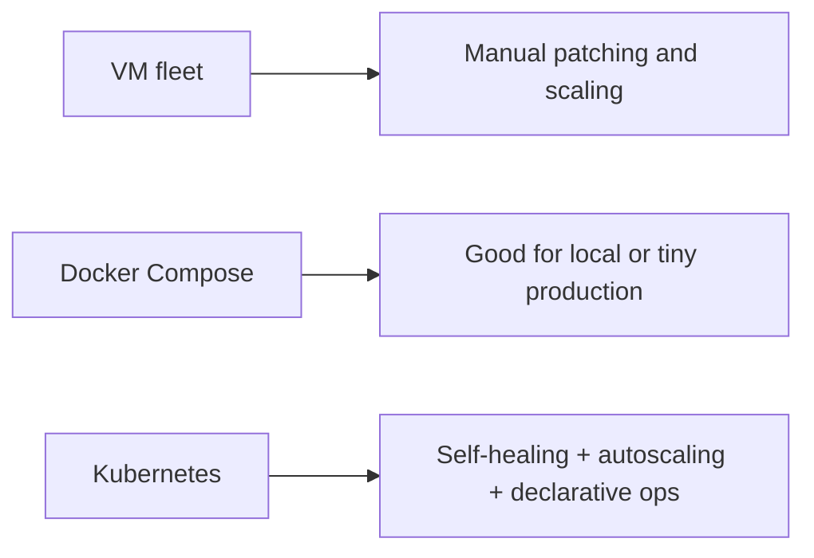
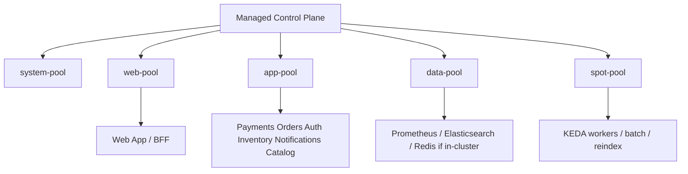
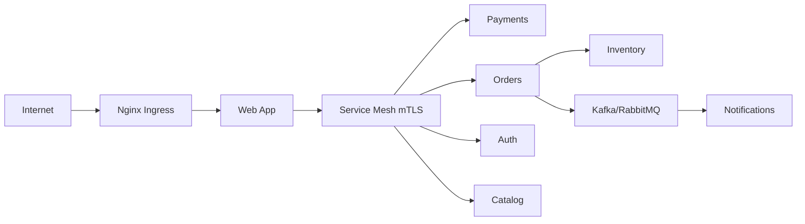
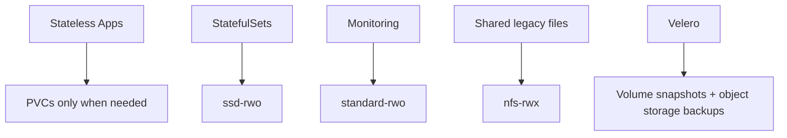
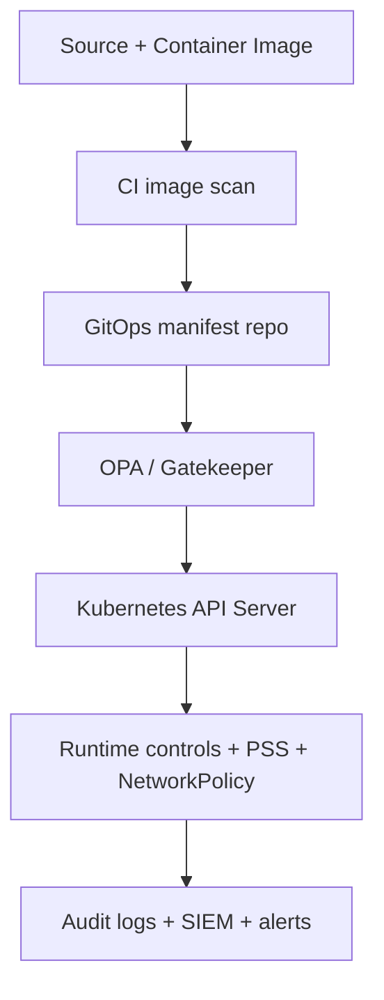
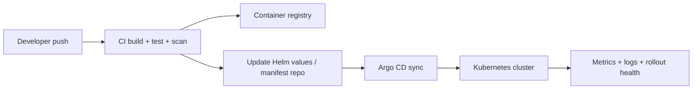

# 02 — Kubernetes Architecture

> Detailed Kubernetes runtime design for the ecommerce platform, including node pools, namespaces, networking, security controls, GitOps, and workload-specific manifests.

See [`01-system-overview-and-design-decisions.md`](./01-system-overview-and-design-decisions.md) for the reasoning behind service decomposition and [`03-cloud-infrastructure.md`](./03-cloud-infrastructure.md) for the cloud services that surround the cluster.

---

## 1. Why Kubernetes instead of VMs or Docker Compose

- **Self-healing:** Pods are restarted automatically after crashes and can be rescheduled away from failed nodes.
- **Autoscaling:** HPA, cluster autoscaler, and KEDA help match flash-sale demand without manual intervention.
- **Rolling updates:** Controlled rollout and rollback are built in, which reduces deployment risk.
- **Service discovery:** Services get stable virtual IPs and DNS names without external glue.
- **Declarative operations:** Desired state in Git is easier to audit and reproduce than hand-managed VMs.

| Criterion | VMs | Docker Compose | Kubernetes | Verdict |
|----------|-----|----------------|------------|---------|
| Self-healing | Manual or custom scripts | Minimal | Built-in | Kubernetes wins for production |
| Service discovery | Manual | Local only | Built-in | Kubernetes wins for 10 services |
| Rolling updates | Custom | Weak | Native | Kubernetes wins |
| Autoscaling | Coarse | None | Native | Kubernetes wins |
| Secrets and config | Manual | Basic | Mature ecosystem | Kubernetes wins |
| Operational overhead | Low | Very low | Higher | VMs/Compose win only for small setups |

### Cost comparison: 10 services at different scales

| Scale scenario | VM-heavy design | Kubernetes design | Commentary |
|---------------|-----------------|------------------|------------|
| Development | Slightly cheaper | Slightly higher | K8s overhead is acceptable if environments mirror production |
| Normal production | Similar to moderately better | Better utilization | Packing services onto nodes improves efficiency |
| Peak sale burst | Expensive overprovisioning | Better elasticity | Autoscaling avoids always-on headroom everywhere |

### When NOT to use Kubernetes

- Fewer than three to four services with very stable traffic patterns.
- No team available to own cluster lifecycle, security posture, or incident response.
- State-heavy workloads dominate and the team still lacks confidence in container operations.



## 2. Cluster architecture decision

### Managed Kubernetes vs self-managed

| Option | Strengths | Weaknesses | Decision |
|--------|-----------|------------|----------|
| EKS / AKS / GKE | Managed control plane, cloud IAM integration, upgrade support | More cloud coupling | **Preferred for production** |
| kubeadm / Rancher | Maximum flexibility and potential cost control | Higher operational risk and staffing burden | Better for labs or strict sovereign/on-prem environments |

**Why managed for production:** the company already has ten application areas and should spend engineering effort on domain capabilities, not on operating etcd, control-plane patching, or Kubernetes distribution lifecycle work.

### Single cluster vs multi-cluster

- Start with **one production cluster per region** plus separate staging and development clusters when the team is still building muscle.
- Move to **multi-cluster** when blast-radius isolation, regulatory segmentation, or team autonomy requirements exceed the value of shared platform management.

| Decision trigger | Stay single-cluster | Move multi-cluster |
|------------------|--------------------|-------------------|
| Team count | Small to medium | Large platform with many independent teams |
| Compliance zones | Uniform | Strong segmentation required |
| Traffic profile | Similar workloads | Very different workloads or regions |
| Upgrade risk tolerance | Shared acceptable | Independent lifecycles needed |

### Node pool strategy

| Node pool | Workloads | Example size | Why separate |
|----------|-----------|--------------|-------------|
| system-pool | CoreDNS, CNI, ingress helpers, Argo CD | 3 x 2 vCPU / 8 GiB | Keeps platform-critical pods away from noisy tenants |
| web-pool | Web app and edge-adjacent BFF pods | 3-10 x 4 vCPU / 16 GiB | SSR and bursty web traffic need fast scale-out |
| app-pool | Payments, orders, auth, inventory, notifications | 4-20 x 4-8 vCPU / 16-32 GiB | General stateless business services |
| data-pool | Stateful observability or in-cluster caches where unavoidable | 3-6 x 8 vCPU / 32 GiB + SSD | Stateful workloads need predictable storage and anti-affinity |
| spot-pool | Queue consumers, batch jobs, replay jobs | 0-20 x 4 vCPU / 16 GiB | Cheap elasticity for interruptible workloads |



## 3. Namespace strategy

```text
ecommerce-prod/
ecommerce-staging/
ecommerce-dev/
monitoring/
ingress-system/
cert-manager/
```

| Namespace | Primary contents | Access model |
|-----------|------------------|-------------|
| ecommerce-prod | Production app workloads | Platform ops write, app teams limited deploy rights via GitOps |
| ecommerce-staging | Pre-production app workloads | App teams and QA |
| ecommerce-dev | Dev/test workloads | Broad dev access, lower blast radius |
| monitoring | Prometheus, Grafana, log agents | SRE/platform only |
| ingress-system | Ingress controllers, gateway data plane | Platform only |
| cert-manager | Certificate automation | Platform/security only |

### RBAC model

- Developers can read production logs and metrics but cannot mutate production resources directly.
- GitOps controllers are the primary write path into production namespaces.
- Platform team owns cluster-wide RBAC, network policies, admission controllers, and node pools.
- Security team gets read access to audit trails, image scan results, and policy reports.

## 4. Deployment strategy per service

### 1. Payments Service

```yaml
apiVersion: apps/v1
kind: Deployment
metadata:
  name: payments
  namespace: ecommerce-prod
  labels:
    app: payments
spec:
  replicas: 3
  selector:
    matchLabels:
      app: payments
  template:
    metadata:
      labels:
        app: payments
    spec:
      serviceAccountName: payments-sa
      affinity:
        podAntiAffinity:
          requiredDuringSchedulingIgnoredDuringExecution:
            - labelSelector:
                matchExpressions:
                  - key: app
                    operator: In
                    values: [payments]
              topologyKey: kubernetes.io/hostname
      containers:
        - name: payments
          image: ghcr.io/shasi-linux/payments:1.0.0
          ports:
            - containerPort: 8080
          resources:
            requests:
              cpu: "500m"
              memory: "512Mi"
            limits:
              cpu: "1000m"
              memory: "1Gi"
          envFrom:
            - secretRef:
                name: payments-secrets
          readinessProbe:
            httpGet:
              path: /actuator/health/readiness
              port: 8080
          livenessProbe:
            httpGet:
              path: /actuator/health/liveness
              port: 8080
```

**Why `Deployment` here:** Deployment is used for stateless or mostly stateless pods because it supports rolling updates, easy replica management, and horizontal scaling.

```yaml
apiVersion: policy/v1
kind: PodDisruptionBudget
metadata:
  name: payments-pdb
  namespace: ecommerce-prod
  labels:
    app: payments
spec:
  minAvailable: 2
  selector:
    matchLabels:
      app: payments
```

**Why `PodDisruptionBudget` here:** PDB is used to keep voluntary disruptions from taking too many replicas offline during node maintenance or upgrades.

---

### 2. E-Commerce Web App

```yaml
apiVersion: apps/v1
kind: Deployment
metadata:
  name: web-app
  namespace: ecommerce-prod
  labels:
    app: web-app
spec:
  replicas: 3
  selector:
    matchLabels:
      app: web-app
  template:
    metadata:
      labels:
        app: web-app
    spec:
      containers:
        - name: web-app
          image: ghcr.io/shasi-linux/web-app:1.0.0
          ports:
            - containerPort: 3000
          resources:
            requests:
              cpu: "300m"
              memory: "512Mi"
            limits:
              cpu: "1500m"
              memory: "2Gi"
          readinessProbe:
            httpGet:
              path: /api/health
              port: 3000
          env:
            - name: NEXT_TELEMETRY_DISABLED
              value: "1"
```

**Why `Deployment` here:** Deployment is used for stateless or mostly stateless pods because it supports rolling updates, easy replica management, and horizontal scaling.

```yaml
apiVersion: autoscaling/v2
kind: HorizontalPodAutoscaler
metadata:
  name: web-app-hpa
  namespace: ecommerce-prod
  labels:
    app: web-app
spec:
  scaleTargetRef:
    apiVersion: apps/v1
    kind: Deployment
    name: web-app
  minReplicas: 3
  maxReplicas: 20
  metrics:
    - type: Resource
      resource:
        name: cpu
        target:
          type: Utilization
          averageUtilization: 60
```

**Why `HorizontalPodAutoscaler` here:** HPA is used where demand correlates with CPU or request volume and the workload can scale horizontally.

```yaml
apiVersion: networking.k8s.io/v1
kind: Ingress
metadata:
  name: web-ingress
  namespace: ecommerce-prod
  annotations:
    nginx.ingress.kubernetes.io/limit-rps: "20"
    nginx.ingress.kubernetes.io/proxy-body-size: "20m"
spec:
  ingressClassName: nginx
  rules:
    - host: shop.example.com
      http:
        paths:
          - path: /
            pathType: Prefix
            backend:
              service:
                name: web-app
                port:
                  number: 80
```

**Why `Ingress` here:** Ingress is used for north-south HTTP routing so URL paths and hostnames can map cleanly to backend services.

---

### 3. Product Catalog Service

```yaml
apiVersion: apps/v1
kind: Deployment
metadata:
  name: catalog
  namespace: ecommerce-prod
  labels:
    app: catalog
spec:
  replicas: 3
  selector:
    matchLabels:
      app: catalog
  template:
    metadata:
      labels:
        app: catalog
    spec:
      containers:
        - name: catalog
          image: ghcr.io/shasi-linux/catalog:1.0.0
          ports:
            - containerPort: 8080
          resources:
            requests:
              cpu: "400m"
              memory: "768Mi"
            limits:
              cpu: "2000m"
              memory: "2Gi"
          envFrom:
            - secretRef:
                name: catalog-secrets
```

**Why `Deployment` here:** Deployment is used for stateless or mostly stateless pods because it supports rolling updates, easy replica management, and horizontal scaling.

```yaml
apiVersion: autoscaling/v2
kind: HorizontalPodAutoscaler
metadata:
  name: catalog-hpa
  namespace: ecommerce-prod
  labels:
    app: catalog
spec:
  scaleTargetRef:
    apiVersion: apps/v1
    kind: Deployment
    name: catalog
  minReplicas: 3
  maxReplicas: 15
  metrics:
    - type: Pods
      pods:
        metric:
          name: http_requests_per_second
        target:
          type: AverageValue
          averageValue: "120"
```

**Why `HorizontalPodAutoscaler` here:** HPA is used where demand correlates with CPU or request volume and the workload can scale horizontally.

---

### 4. Order Management Service

```yaml
apiVersion: apps/v1
kind: Deployment
metadata:
  name: orders
  namespace: ecommerce-prod
  labels:
    app: orders
spec:
  replicas: 3
  selector:
    matchLabels:
      app: orders
  template:
    metadata:
      labels:
        app: orders
    spec:
      containers:
        - name: orders
          image: ghcr.io/shasi-linux/orders:1.0.0
          ports:
            - containerPort: 8080
          resources:
            requests:
              cpu: "500m"
              memory: "768Mi"
            limits:
              cpu: "1500m"
              memory: "2Gi"
```

**Why `Deployment` here:** Deployment is used for stateless or mostly stateless pods because it supports rolling updates, easy replica management, and horizontal scaling.

```yaml
apiVersion: autoscaling/v2
kind: HorizontalPodAutoscaler
metadata:
  name: orders-hpa
  namespace: ecommerce-prod
  labels:
    app: orders
spec:
  scaleTargetRef:
    apiVersion: apps/v1
    kind: Deployment
    name: orders
  minReplicas: 3
  maxReplicas: 12
  metrics:
    - type: Resource
      resource:
        name: cpu
        target:
          type: Utilization
          averageUtilization: 65
```

**Why `HorizontalPodAutoscaler` here:** HPA is used where demand correlates with CPU or request volume and the workload can scale horizontally.

```yaml
apiVersion: policy/v1
kind: PodDisruptionBudget
metadata:
  name: orders-pdb
  namespace: ecommerce-prod
  labels:
    app: orders
spec:
  minAvailable: 2
  selector:
    matchLabels:
      app: orders
```

**Why `PodDisruptionBudget` here:** PDB is used to keep voluntary disruptions from taking too many replicas offline during node maintenance or upgrades.

---

### 5. User/Auth Service

```yaml
apiVersion: apps/v1
kind: Deployment
metadata:
  name: auth
  namespace: ecommerce-prod
  labels:
    app: auth
spec:
  replicas: 3
  selector:
    matchLabels:
      app: auth
  template:
    metadata:
      labels:
        app: auth
    spec:
      containers:
        - name: auth
          image: ghcr.io/shasi-linux/auth:1.0.0
          ports:
            - containerPort: 8080
          env:
            - name: SESSION_STORE
              value: redis
          resources:
            requests:
              cpu: "250m"
              memory: "512Mi"
            limits:
              cpu: "1000m"
              memory: "1Gi"
```

**Why `Deployment` here:** Deployment is used for stateless or mostly stateless pods because it supports rolling updates, easy replica management, and horizontal scaling.

- **Session affinity consideration:** prefer token-based stateless auth first; only enable sticky sessions for legacy flows that still depend on server-side session data in Redis.

---

### 6. Inventory Service

```yaml
apiVersion: apps/v1
kind: Deployment
metadata:
  name: inventory
  namespace: ecommerce-prod
  labels:
    app: inventory
spec:
  replicas: 3
  selector:
    matchLabels:
      app: inventory
  template:
    metadata:
      labels:
        app: inventory
    spec:
      containers:
        - name: inventory
          image: ghcr.io/shasi-linux/inventory:1.0.0
          ports:
            - containerPort: 8080
          resources:
            requests:
              cpu: "300m"
              memory: "512Mi"
            limits:
              cpu: "1500m"
              memory: "1Gi"
```

**Why `Deployment` here:** Deployment is used for stateless or mostly stateless pods because it supports rolling updates, easy replica management, and horizontal scaling.

```yaml
apiVersion: batch/v1
kind: CronJob
metadata:
  name: inventory-warehouse-sync
  namespace: ecommerce-prod
  labels:
    app: inventory
spec:
  schedule: "*/15 * * * *"
  jobTemplate:
    spec:
      template:
        spec:
          restartPolicy: OnFailure
          containers:
            - name: warehouse-sync
              image: ghcr.io/shasi-linux/inventory-sync:1.0.0
              args: ["sync-warehouse"]
```

**Why `CronJob` here:** CronJob is the right choice for periodic warehouse synchronization because the work is scheduled and discrete.

---

### 7. Notification Service

```yaml
apiVersion: apps/v1
kind: Deployment
metadata:
  name: notifications
  namespace: ecommerce-prod
  labels:
    app: notifications
spec:
  replicas: 2
  selector:
    matchLabels:
      app: notifications
  template:
    metadata:
      labels:
        app: notifications
    spec:
      containers:
        - name: notifications
          image: ghcr.io/shasi-linux/notifications:1.0.0
          ports:
            - containerPort: 8080
          resources:
            requests:
              cpu: "200m"
              memory: "256Mi"
            limits:
              cpu: "1000m"
              memory: "1Gi"
```

**Why `Deployment` here:** Deployment is used for stateless or mostly stateless pods because it supports rolling updates, easy replica management, and horizontal scaling.

```yaml
apiVersion: autoscaling/v2
kind: HorizontalPodAutoscaler
metadata:
  name: notifications-keda-like-note
  namespace: ecommerce-prod
  labels:
    app: notifications
spec:
  scaleTargetRef:
    apiVersion: apps/v1
    kind: Deployment
    name: notifications
  minReplicas: 2
  maxReplicas: 30
  metrics:
    - type: External
      external:
        metric:
          name: queue_depth
        target:
          type: AverageValue
          averageValue: "50"
```

**Why `HorizontalPodAutoscaler` here:** HPA is used where demand correlates with CPU or request volume and the workload can scale horizontally.

- **KEDA note:** in production, replace or augment the example HPA with KEDA so queue depth, lag, or event backlog directly drives worker count.

---

### 8. Database Layer

```yaml
apiVersion: apps/v1
kind: StatefulSet
metadata:
  name: postgres
  namespace: ecommerce-prod
  labels:
    app: postgres
spec:
  serviceName: postgres
  replicas: 3
  selector:
    matchLabels:
      app: postgres
  template:
    metadata:
      labels:
        app: postgres
    spec:
      initContainers:
        - name: init-permissions
          image: busybox:1.36
          command: ["sh", "-c", "chown -R 999:999 /var/lib/postgresql/data"]
          volumeMounts:
            - name: data
              mountPath: /var/lib/postgresql/data
      containers:
        - name: postgres
          image: postgres:16
          ports:
            - containerPort: 5432
          volumeMounts:
            - name: data
              mountPath: /var/lib/postgresql/data
          resources:
            requests:
              cpu: "1000m"
              memory: "2Gi"
            limits:
              cpu: "2000m"
              memory: "4Gi"
  volumeClaimTemplates:
    - metadata:
        name: data
      spec:
        accessModes: ["ReadWriteOnce"]
        storageClassName: ssd-rwo
        resources:
          requests:
            storage: 200Gi
```

**Why `StatefulSet` here:** StatefulSet is used where stable pod identity, ordered rollout, and persistent volume attachment matter.

```yaml
apiVersion: apps/v1
kind: StatefulSet
metadata:
  name: redis
  namespace: ecommerce-prod
  labels:
    app: redis
spec:
  serviceName: redis
  replicas: 3
  selector:
    matchLabels:
      app: redis
  template:
    metadata:
      labels:
        app: redis
    spec:
      containers:
        - name: redis
          image: redis:7.2
          args: ["--appendonly", "yes"]
          ports:
            - containerPort: 6379
          volumeMounts:
            - name: data
              mountPath: /data
  volumeClaimTemplates:
    - metadata:
        name: data
      spec:
        accessModes: ["ReadWriteOnce"]
        storageClassName: ssd-rwo
        resources:
          requests:
            storage: 50Gi
```

**Why `StatefulSet` here:** StatefulSet is used where stable pod identity, ordered rollout, and persistent volume attachment matter.

- **Production note:** managed databases remain the default recommendation, but the StatefulSet examples are included because teams often need them in isolated or cost-constrained environments.

---

### 9. Storage/CDN

This service primarily consumes managed cloud data services, but the surrounding applications still access it through Kubernetes secrets, service accounts, and network policies.

---

### 10. Monitoring & Observability

```yaml
apiVersion: apps/v1
kind: DaemonSet
metadata:
  name: node-exporter
  namespace: monitoring
  labels:
    app: node-exporter
spec:
  selector:
    matchLabels:
      app: node-exporter
  template:
    metadata:
      labels:
        app: node-exporter
    spec:
      hostNetwork: true
      containers:
        - name: node-exporter
          image: prom/node-exporter:v1.8.1
          ports:
            - containerPort: 9100
```

**Why `DaemonSet` here:** DaemonSet is used for node-level agents because exactly one pod per node is desired.

```yaml
apiVersion: apps/v1
kind: DaemonSet
metadata:
  name: fluentd
  namespace: monitoring
  labels:
    app: fluentd
spec:
  selector:
    matchLabels:
      app: fluentd
  template:
    metadata:
      labels:
        app: fluentd
    spec:
      containers:
        - name: fluentd
          image: fluent/fluentd:v1.16
          volumeMounts:
            - name: varlog
              mountPath: /var/log
      volumes:
        - name: varlog
          hostPath:
            path: /var/log
```

**Why `DaemonSet` here:** DaemonSet is used for node-level agents because exactly one pod per node is desired.

```yaml
apiVersion: apps/v1
kind: StatefulSet
metadata:
  name: prometheus
  namespace: monitoring
  labels:
    app: prometheus
spec:
  serviceName: prometheus
  replicas: 1
  selector:
    matchLabels:
      app: prometheus
  template:
    metadata:
      labels:
        app: prometheus
    spec:
      containers:
        - name: prometheus
          image: prom/prometheus:v2.54.0
          ports:
            - containerPort: 9090
          volumeMounts:
            - name: prometheus-data
              mountPath: /prometheus
  volumeClaimTemplates:
    - metadata:
        name: prometheus-data
      spec:
        accessModes: ["ReadWriteOnce"]
        storageClassName: standard-rwo
        resources:
          requests:
            storage: 200Gi
```

**Why `StatefulSet` here:** StatefulSet is used where stable pod identity, ordered rollout, and persistent volume attachment matter.

- **Why DaemonSet plus StatefulSet:** collection agents must land on every node, while Prometheus and Elasticsearch require stable storage and identities.

---

## 5. Networking architecture

### CNI decision: Calico vs Cilium

| Option | Strengths | Weaknesses | Recommendation |
|--------|-----------|------------|----------------|
| Calico | Mature network policies, BGP support, broad adoption | Less eBPF-native optimization than Cilium | Best fit if hybrid or on-prem routing matters strongly |
| Cilium | eBPF performance, rich observability, advanced policy | Slightly steeper learning curve for some teams | Best fit when high-performance datapath and service observability are key |

**Recommendation:** choose **Cilium** for cloud-first clusters where eBPF-based visibility, performance, and service mesh integration matter most. Choose **Calico** if BGP-heavy hybrid networking is a stronger requirement.

### Ingress routing example

```yaml
apiVersion: networking.k8s.io/v1
kind: Ingress
metadata:
  name: ecommerce-api
  namespace: ecommerce-prod
  annotations:
    nginx.ingress.kubernetes.io/ssl-redirect: "true"
    nginx.ingress.kubernetes.io/limit-rps: "20"
spec:
  ingressClassName: nginx
  rules:
    - host: shop.example.com
      http:
        paths:
          - path: /
            pathType: Prefix
            backend:
              service:
                name: web-app
                port:
                  number: 80
          - path: /api/v1/payments
            pathType: Prefix
            backend:
              service:
                name: payments
                port:
                  number: 8080
          - path: /api/v1/orders
            pathType: Prefix
            backend:
              service:
                name: orders
                port:
                  number: 8080
          - path: /api/v1/catalog
            pathType: Prefix
            backend:
              service:
                name: catalog
                port:
                  number: 8080
```

### Network policy examples

```yaml
apiVersion: networking.k8s.io/v1
kind: NetworkPolicy
metadata:
  name: default-deny
  namespace: ecommerce-prod
spec:
  podSelector: {}
  policyTypes: [Ingress, Egress]
---
apiVersion: networking.k8s.io/v1
kind: NetworkPolicy
metadata:
  name: payments-allow-orders-and-db
  namespace: ecommerce-prod
spec:
  podSelector:
    matchLabels:
      app: payments
  ingress:
    - from:
        - podSelector:
            matchLabels:
              app: orders
  egress:
    - to:
        - podSelector:
            matchLabels:
              app: postgres
  policyTypes: [Ingress, Egress]
---
apiVersion: networking.k8s.io/v1
kind: NetworkPolicy
metadata:
  name: notifications-only-from-queue
  namespace: ecommerce-prod
spec:
  podSelector:
    matchLabels:
      app: notifications
  ingress:
    - from:
        - namespaceSelector:
            matchLabels:
              name: messaging
  policyTypes: [Ingress]
```

### Service mesh

- **Why use a mesh:** mTLS, traffic policy, retries, and rich telemetry become standardized instead of reimplemented in every app.
- **Istio vs Linkerd:** Istio offers richer traffic management and policy; Linkerd is lighter and easier to run. For a multi-team ecommerce platform with canary needs, **Istio** is usually the stronger fit.



## 6. Storage architecture

| StorageClass | Workload | Why |
|--------------|----------|-----|
| ssd-rwo | PostgreSQL, Redis, stateful observability | Low latency and predictable IOPS |
| standard-rwo | Logs, Prometheus, medium-performance stores | Lower cost for general stateful storage |
| nfs-rwx | Shared assets or legacy shared file needs | ReadWriteMany capability when object storage is not enough |

- Prefer managed storage services for production databases whenever possible.
- Use PVCs only where the cluster must own the stateful workload directly.
- Back up cluster metadata and PV snapshots with **Velero** and cloud-native snapshot integrations.



## 7. Kubernetes security model

- Apply **Pod Security Standards** with `restricted` for business workloads and `baseline` only where observability agents require broader host access.
- Use **Workload Identity / IRSA / managed identity** so pods access cloud services without static credentials.
- Manage secrets with **External Secrets Operator** or **Sealed Secrets**; avoid raw opaque secret manifests in Git.
- Enforce admission controls with **OPA Gatekeeper** or Kyverno.

### Example policies to enforce

- No `latest` image tags.
- No privileged containers unless explicitly exempted.
- CPU and memory requests/limits required.
- Read-only root filesystem where possible.
- Mandatory liveness and readiness probes for production workloads.



## 8. CI/CD for Kubernetes

- Use **GitOps with Argo CD** so every service has an application definition and desired state stays versioned in Git.
- Package workloads with **Helm charts** so environment-specific values remain controlled and reusable.
- Use **canary deployments** for payments and other high-risk services.
- Use **rolling updates** for most stateless services with strong readiness gates.

### Example Helm chart layout

```text
charts/
  payments/
    Chart.yaml
    values.yaml
    templates/deployment.yaml
    templates/service.yaml
    templates/pdb.yaml
  web-app/
  orders/
  catalog/
  inventory/
  notifications/
```

### GitOps flow



## 9. Final Kubernetes recommendation

- Choose **managed Kubernetes** for production.
- Keep **one cluster per environment/region** until regulation or team scale forces multi-cluster segmentation.
- Separate **system**, **web**, **app**, **data**, and **spot** node pools.
- Standardize on **GitOps + Helm + policy enforcement**.
- Use **NetworkPolicies**, **workload identity**, and **restricted pod security** as defaults.
- Use **managed databases** where possible and reserve StatefulSets for justified exceptions or isolated environments.
