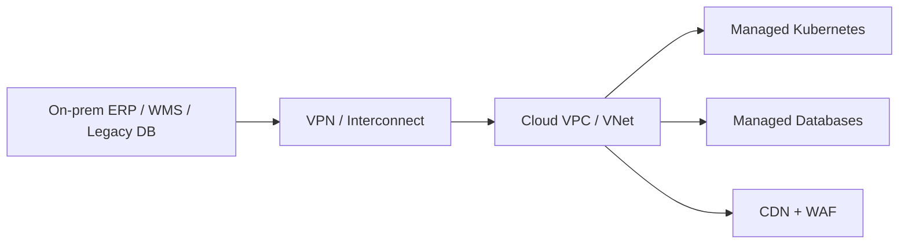
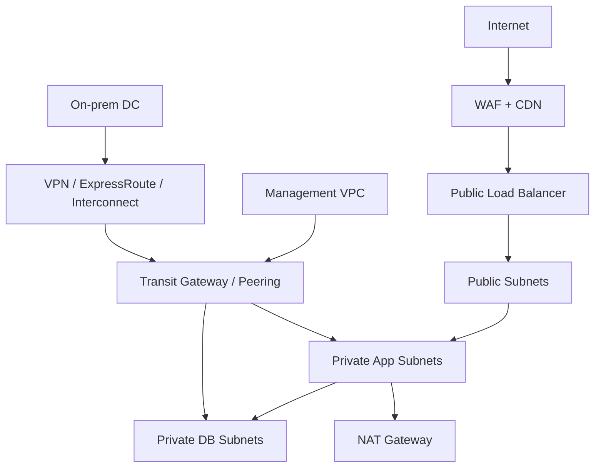
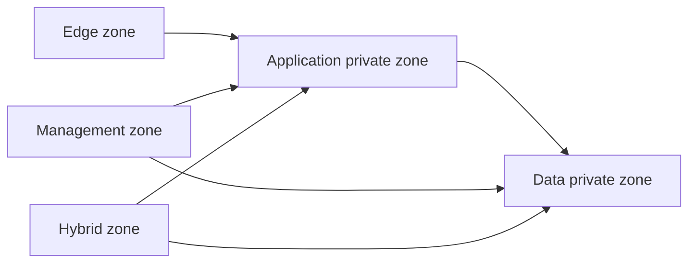
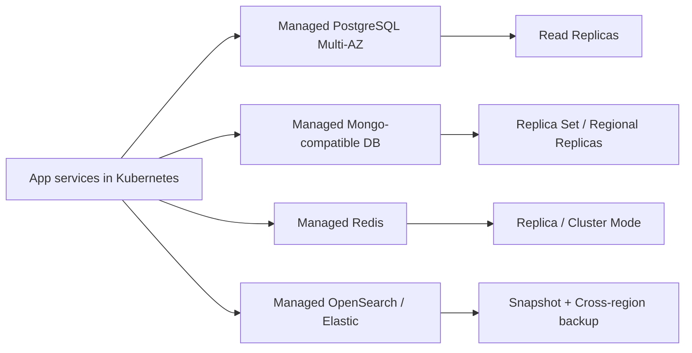
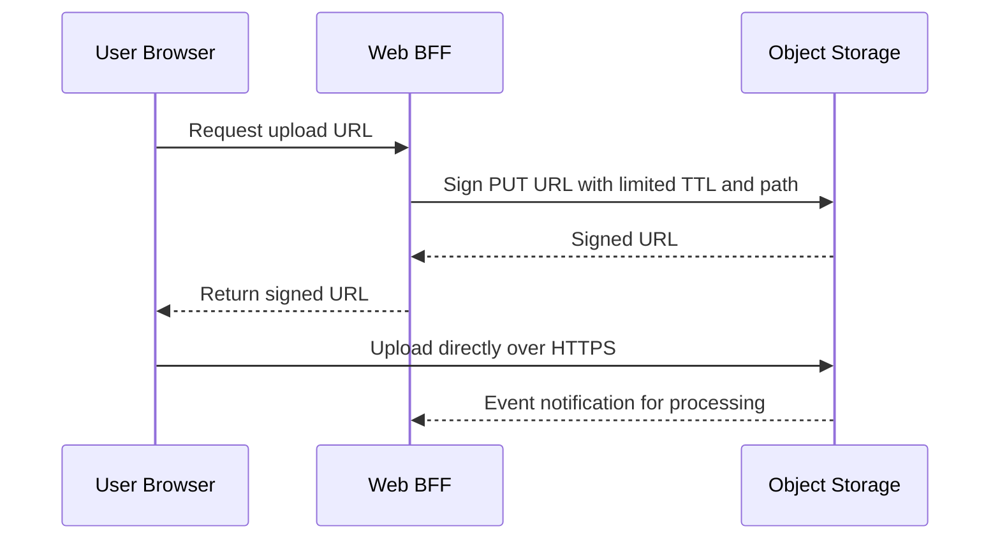
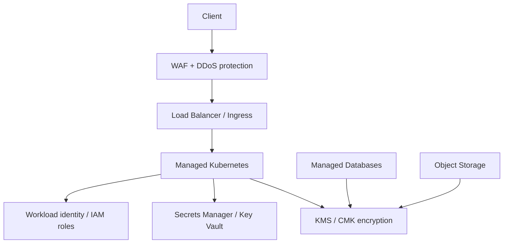
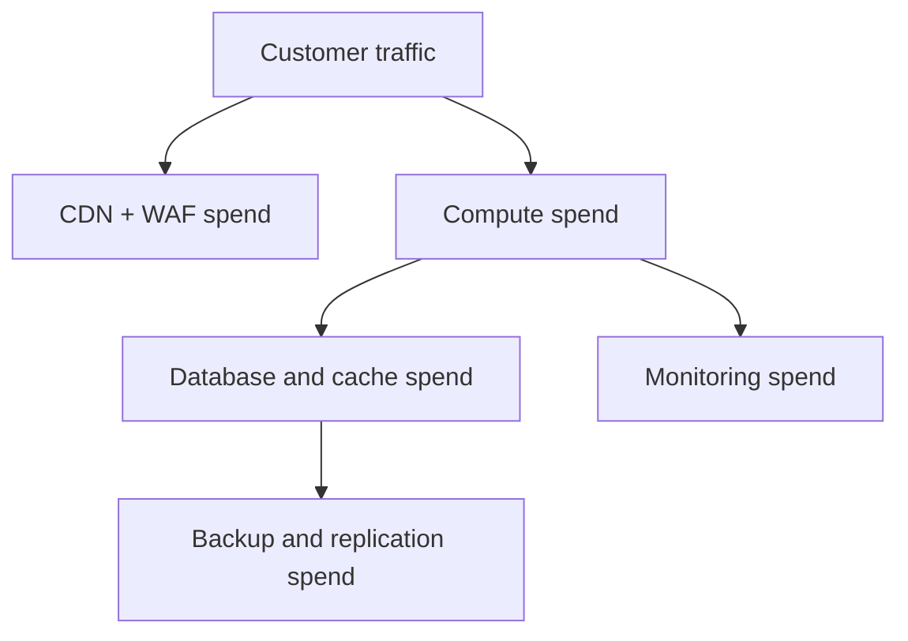

# 03 — Cloud Infrastructure

> **📌 Disclaimer**: Any third-party logos, screenshots, or diagrams referenced in this document are used for educational purposes only. All trademarks belong to their respective owners.


> Multi-cloud infrastructure design for the ecommerce platform, including provider selection, network topology, compute, managed data services, storage, CDN, security, observability, and cost.

This document complements the Kubernetes view in [`02-kubernetes-architecture.md`](./02-kubernetes-architecture.md) and the system decisions in [`01-system-overview-and-design-decisions.md`](./01-system-overview-and-design-decisions.md).

---

## 1. Cloud provider decision

| Provider | Strengths | Weaknesses | Fit for ecommerce workloads |
|----------|-----------|------------|-----------------------------|
| AWS | Broadest managed-service breadth, mature ecommerce ecosystem, strong IAM and edge options. | Can become expensive quickly; many overlapping services increase cognitive load. | Best default when the team wants the widest option set and marketplace integrations. |
| Azure | Strong enterprise identity, hybrid networking, and Microsoft ecosystem alignment. | Service naming and networking patterns can be less intuitive for Kubernetes-first teams. | Best when enterprise identity, Windows estates, or Azure agreements already exist. |
| GCP | Excellent Kubernetes heritage, strong data/analytics tooling, simple network model. | Regional availability and service breadth can be narrower for some regulated workloads. | Best when platform teams are K8s-heavy and analytics/search integration is a priority. |

### Single-cloud vs multi-cloud

| Strategy | Benefits | Risks | Decision guidance |
|----------|----------|-------|-------------------|
| Single-cloud | Faster delivery, simpler IAM/networking, deeper managed-service adoption | Higher vendor concentration | Best default for most teams |
| Multi-cloud | Reduced concentration risk, negotiating leverage, regional flexibility | Higher complexity, duplicated skills, weaker standardization | Use only when regulation or business risk justifies it |

**Recommendation:** run the platform primarily on **one cloud provider** per production region, while keeping architecture choices portable enough that a second cloud remains feasible for DR, acquisition integration, or future diversification.

### Hybrid cloud considerations

- Hybrid is often necessary during migration because warehouses, ERP systems, or payment appliances remain on-prem initially.
- Keep hybrid links private and explicit; do not depend on internet VPN latency for checkout-critical paths once migration is complete.



## 2. Network architecture

### Landing zone VPC/VNet model

| Network | Purpose | Typical contents |
|---------|---------|------------------|
| Production VPC/VNet | Customer traffic and critical workloads | K8s nodes, managed DB private endpoints, NAT, load balancers |
| Staging VPC/VNet | Pre-production validation | Staging cluster, test data services, synthetic checks |
| Management VPC/VNet | Shared ops services | Bastion alternatives, CI runners, SIEM, backup tooling, VPN/Direct Connect landing |

### Subnet design

| Subnet tier | Example CIDR | Purpose |
|-------------|--------------|---------|
| Public | 10.10.0.0/24 | Load balancers, NAT gateways, public edge endpoints |
| Private app | 10.10.10.0/23 | Kubernetes nodes and internal services |
| Private DB | 10.10.20.0/24 | Managed databases and private endpoints |
| Private K8s control integrations | 10.10.30.0/24 | Controllers, CI runners, shared services |

### Connectivity components

- **Internet Gateway** for public load balancers and CDN origins.
- **NAT Gateway** for private subnets reaching the internet for image pulls and outbound APIs without exposing inbound surfaces.
- **Transit Gateway / hub-spoke** connectivity when multiple VPCs/VNets must share controlled east-west traffic.
- **VPN / ExpressRoute / Cloud Interconnect** for hybrid connectivity to on-prem ERP, WMS, identity, or reporting systems.



### IP planning table

| Environment | VPC/VNet CIDR | Public | App | DB | Notes |
|------------|---------------|--------|-----|----|-------|
| Production | 10.10.0.0/16 | 10.10.0.0/24 | 10.10.10.0/23 | 10.10.20.0/24 | Leave headroom for node pools and private endpoints |
| Staging | 10.20.0.0/16 | 10.20.0.0/24 | 10.20.10.0/23 | 10.20.20.0/24 | Mirrors prod for realistic validation |
| Management | 10.30.0.0/16 | 10.30.0.0/24 | 10.30.10.0/24 | 10.30.20.0/24 | Shared ops and security services |

### Example Terraform (AWS-style VPC excerpt)

```hcl
resource "aws_vpc" "prod" {
  cidr_block           = "10.10.0.0/16"
  enable_dns_support   = true
  enable_dns_hostnames = true
  tags = {
    Name = "ecommerce-prod"
  }
}

resource "aws_subnet" "private_app_a" {
  vpc_id            = aws_vpc.prod.id
  cidr_block        = "10.10.10.0/24"
  availability_zone = "us-east-1a"
}
```


### Provider-specific reference blueprints

#### AWS reference blueprint

- Edge: CloudFront + AWS WAF + ALB.
- Compute: EKS managed node groups for web/app/system pools.
- Data: RDS/Aurora PostgreSQL, ElastiCache Redis, Amazon OpenSearch Service, MongoDB Atlas or DocumentDB depending compatibility needs.
- Security: IAM Roles for Service Accounts (IRSA), KMS CMKs, Secrets Manager.
- Hybrid: Direct Connect preferred over long-lived internet VPN for steady enterprise traffic.

Why AWS over Azure/GCP in some ecommerce programs:

- Broadest partner ecosystem for payments, fraud, and marketplace integrations.
- Rich edge stack and strong IAM policy language for complex multi-team estates.
- Mature managed-service coverage reduces the chance of building missing platform components.

#### Azure reference blueprint

- Edge: Azure Front Door + WAF + Application Gateway.
- Compute: AKS with managed identity and Azure CNI or overlay networking.
- Data: Azure Database for PostgreSQL, Azure Cache for Redis, Azure-managed Elastic or Elastic Cloud, Cosmos DB Mongo API where it fits.
- Security: Entra ID, managed identities, Key Vault, Defender for Cloud.
- Hybrid: ExpressRoute is compelling when the enterprise already uses Microsoft networking and identity stacks.

Why Azure over AWS/GCP in some ecommerce programs:

- Enterprise IAM integration is often easier where Microsoft 365 and Entra already dominate.
- Hybrid networking and governance align well with existing Windows-heavy estates.
- Commercial agreements and enterprise support models may make Azure the cheaper practical choice.

#### GCP reference blueprint

- Edge: Cloud CDN + Cloud Armor + global HTTPS load balancing.
- Compute: GKE Autopilot or standard GKE depending control needs.
- Data: Cloud SQL or AlloyDB for PostgreSQL, Memorystore for Redis, Elastic Cloud or marketplace search, Atlas where Mongo compatibility is needed.
- Security: Workload Identity Federation, Secret Manager, Cloud KMS, VPC Service Controls where appropriate.
- Hybrid: Cloud Interconnect keeps latency predictable for ERP and warehouse links.

Why GCP over AWS/Azure in some ecommerce programs:

- Kubernetes operational experience is strong and often simpler for platform teams.
- Network model is clean and globally consistent.
- Data and analytics tooling is attractive when search, recommendations, and event analytics are strategic differentiators.

### Detailed network architecture for each cloud

| Concern | AWS | Azure | GCP | Decision note |
|---------|-----|-------|-----|---------------|
| Public edge | CloudFront + ALB/NLB | Front Door + Application Gateway | Global HTTPS LB + Cloud CDN | Pick the cloud-native global edge unless a third-party CDN already exists |
| Private connectivity | Transit Gateway + Direct Connect/VPN | Virtual WAN / hub-spoke + ExpressRoute/VPN | Cloud Router + Interconnect/VPN | Prefer private over internet paths for ERP and settlement traffic |
| Private service access | PrivateLink / VPC endpoints | Private Link | Private Service Connect | Keeps managed services off the public internet |
| East-west segmentation | Security groups + NACL + K8s policies | NSG + UDR + K8s policies | Firewall rules + hierarchical policy + K8s policies | Cloud and cluster controls should reinforce each other |
| Multi-VPC networking | Peering or TGW | VNet peering or Virtual WAN | VPC peering or Shared VPC | Avoid ad hoc mesh peering sprawl |

### Network security zones

- **Zone 1 — Edge:** CDN, WAF, public load balancers, DDoS services.
- **Zone 2 — Application private zone:** Kubernetes nodes, internal services, service mesh, queue clients.
- **Zone 3 — Data private zone:** managed databases, cache, search, backup endpoints, private service endpoints.
- **Zone 4 — Management zone:** CI runners, bastion alternatives, SIEM, backup control plane, privileged admin tooling.
- **Zone 5 — Hybrid zone:** VPN/ExpressRoute/Interconnect attachments and traffic inspection controls.



## 3. Compute design

| Tier | Example instance profile | Why | Purchase model |
|------|--------------------------|-----|----------------|
| Web nodes | 4 vCPU / 16 GiB general-purpose | SSR and gateway workloads need balanced CPU and memory | Mostly on-demand or reserved |
| App nodes | 4-8 vCPU / 16-32 GiB general-purpose | Business services are mixed CPU/I/O | Mix of reserved and on-demand |
| Data nodes for in-cluster stateful exceptions | 8 vCPU / 32+ GiB memory or storage optimized | Stable IOPS and lower noisy-neighbor risk | Reserved |
| Spot/batch nodes | 4 vCPU / 16 GiB | Queue workers and replay jobs tolerate interruption | Spot / low-priority |

- Use **reserved capacity** for steady baseline nodes.
- Use **spot** for stateless workers, reindex jobs, and non-critical batch tasks.
- Use **on-demand** for unpredictable spikes and managed node groups that need reliability.


### Per-service infrastructure mapping

| Application | Primary cloud components | Why this mapping works |
|-------------|--------------------------|------------------------|
| Payments Service | EKS/AKS/GKE deployment + managed PostgreSQL + private NAT + KMS + WAF rules | Keeps the payment app stateless while giving the data plane stronger HA and encryption controls |
| E-Commerce Web App | CDN + WAF + ingress + web node pool + Redis cache | Optimizes latency and offloads asset traffic from app pods |
| Product Catalog Service | K8s deployment + Mongo-compatible service + OpenSearch/Elastic + Redis | Supports flexible writes and search-optimized reads |
| Order Management Service | K8s deployment + managed PostgreSQL + Kafka | Aligns strongly consistent order state with durable event propagation |
| User/Auth Service | K8s deployment + OIDC provider + PostgreSQL + Redis + Secrets Manager | Keeps identity central, secure, and low latency |
| Inventory Service | K8s deployment + PostgreSQL + Redis + private hybrid links to WMS | Balances reservation correctness with warehouse integration |
| Notification Service | K8s workers + queue/event service + provider secrets + spot-friendly node pool | Keeps asynchronous delivery elastic and inexpensive |
| Database Layer | Managed data services with private endpoints and backup buckets | Moves heavy operational lifting to the provider |
| Storage/CDN | Object storage + CDN + origin access controls + lifecycle policies | Best cost/performance for large static asset footprints |
| Monitoring & Observability | Prometheus/Grafana on K8s + cloud-native logs/metrics + alert routing | Blends open observability with provider-native visibility |

### Compute sizing by application

| Application | Baseline replica or node need | Burst behavior | Cost optimization |
|-------------|-------------------------------|----------------|-------------------|
| Payments Service | 3 replicas on app nodes | Scale modestly because PSP dependencies limit throughput | Reserve baseline, avoid spot for writer path |
| E-Commerce Web App | 3-20 replicas on web nodes | Spikes heavily during campaigns and search traffic | CDN caching + autoscaling reduce cost |
| Product Catalog Service | 3-15 replicas | Search and browse can spike on launches | Scale with request metrics, not only CPU |
| Order Management Service | 3-12 replicas | Moderate bursts during checkout events | Reserve baseline because it is business-critical |
| User/Auth Service | 3-10 replicas | Login spikes during campaigns | Cache session and token checks aggressively |
| Inventory Service | 3-8 replicas + CronJobs | Sync jobs add periodic load | Run non-critical sync on spot/batch if safe |
| Notification Service | 2-30 workers | Queue depth can explode after sale or outage recovery | Excellent fit for KEDA + spot nodes |
| Database Layer | Managed capacity units | Growth is more gradual but persistent | Right-size continuously and use read replicas wisely |
| Storage/CDN | No fixed replica count | Bandwidth-heavy bursts | Use CDN and lifecycle policies |
| Monitoring & Observability | Ingestion-based scaling | Incident spikes increase logs/traces sharply | Sample traces and retain logs by tier |

## 4. Managed database services

### Why managed instead of self-managed

- Automated backups and point-in-time recovery.
- Easier Multi-AZ failover.
- Patching and engine maintenance with less operational toil.
- Built-in metrics, parameter groups, encryption, and scaling options.

| Data need | AWS | Azure | GCP | Why managed |
|-----------|-----|-------|-----|-------------|
| PostgreSQL | RDS / Aurora PostgreSQL | Azure Database for PostgreSQL | Cloud SQL for PostgreSQL / AlloyDB | Strong HA, backups, read replicas, patch automation |
| Product document store | DocumentDB or Atlas on AWS | Cosmos DB (Mongo API) or Atlas | Firestore / Atlas / MongoDB Atlas | Flexible schema and easier operations |
| Redis | ElastiCache | Azure Cache for Redis | Memorystore | Managed replication, failover, patching |
| Search | OpenSearch Service | Elastic Cloud / Azure-managed Elastic | Elastic Cloud / OpenSearch via marketplace | Managed scaling and operations |

### Database architecture view



- Payments, orders, and auth should use Multi-AZ relational primaries with at least one read replica for reporting or failover readiness.
- Catalog should use regional replication plus search index backups; search can be rebuilt, but product source data cannot be casually lost.
- Redis should run with replica(s) and persistence tuned for session and rate-limit semantics.


### Managed-vs-self-managed decision matrix by engine

| Engine | Managed recommendation | Self-managed fallback | Why managed wins here |
|--------|------------------------|-----------------------|-----------------------|
| PostgreSQL | RDS / Azure PG / Cloud SQL or AlloyDB | StatefulSet with Patroni or similar | Failover, backup, patching, and storage tuning are painful to own long term |
| MongoDB | Atlas / Cosmos DB Mongo API / managed service | StatefulSet replica set | Schema flexibility matters, but DB operations still need specialists |
| Redis | ElastiCache / Azure Cache / Memorystore | Redis StatefulSet + Sentinel | Cache outages are common pain points; managed service lowers toil |
| Search | OpenSearch Service / Elastic Cloud | Elasticsearch cluster in Kubernetes | Search clusters are operationally noisy and costly to mismanage |

### Multi-AZ and read-replica design by domain

| Domain | Writer topology | Read topology | Why |
|--------|-----------------|--------------|-----|
| Payments | Single writer Multi-AZ with fast failover | Optional reporting replica | Protect correctness first |
| Orders | Single writer Multi-AZ | One or more read replicas for support/reporting | Avoid read load on primary |
| Auth | Single writer Multi-AZ | Replica for reporting and DR readiness | Low-latency token and account reads still need reliability |
| Catalog | Regional primary or sharded doc store | Search cluster + read replicas | Browse reads dominate and can scale independently |
| Inventory | Single writer Multi-AZ | Limited replicas for analytics | Reservation correctness is more important than broad read fan-out |

## 5. Storage and CDN

- Use **S3 / Azure Blob / GCS** for product images, videos, downloadable statements, logs, and backup exports.
- Use **CloudFront / Azure CDN / Cloud CDN** for edge caching of static content and optimized media delivery.
- Apply lifecycle policies to shift stale media or long-term archives to colder storage after 90 days.
- Use **pre-signed URLs** for browser and mobile uploads so application pods do not proxy large files.

### Example object lifecycle policy (AWS-style)

```json
{
  "Rules": [
    {
      "ID": "move-old-assets-to-infrequent-access",
      "Status": "Enabled",
      "Filter": { "Prefix": "assets/" },
      "Transitions": [
        { "Days": 90, "StorageClass": "STANDARD_IA" },
        { "Days": 180, "StorageClass": "GLACIER" }
      ]
    }
  ]
}
```


### Example pre-signed upload flow



### CDN and origin protection decisions

- Use **origin access controls** so buckets are not directly public.
- Cache HTML selectively; cache immutable media aggressively with versioned URLs.
- Offload image resizing and thumbnailing to edge or asynchronous media workers instead of the storefront path.
- Keep invoice or user-upload URLs signed and short-lived because these assets may contain customer data.

## 6. Security architecture

- Use **IAM roles/policies per service account** instead of shared credentials.
- Encrypt data **at rest** with KMS-managed keys and **in transit** with TLS everywhere.
- Protect the storefront with **WAF** and provider-native **DDoS** controls such as Shield, Azure DDoS Protection, or Cloud Armor.
- Store secrets in **Secrets Manager / Key Vault / Secret Manager** and sync them into Kubernetes using external secret operators.
- Use cloud-native certificate management for public TLS and service mesh mTLS inside the cluster.




### IAM role model by service

| Service | Minimum cloud permissions |
|---------|---------------------------|
| Payments | Read payment secrets, write payment logs/traces, access tokenization/KMS APIs, access DB private endpoint |
| Web App | Read CDN signing keys or config, read public asset metadata, call internal APIs |
| Catalog | Read/write document store, write search indexes, read cache |
| Orders | Read/write order DB, publish/consume Kafka topics, emit metrics |
| Auth | Read OIDC secrets, read/write auth DB, read/write session cache |
| Inventory | Read/write inventory DB, call private WMS APIs, publish stock events |
| Notifications | Read provider secrets, consume events, write delivery audit records |
| Observability | Read cloud metrics APIs and write alert events |

### WAF rule priorities

1. Block known malicious IPs and bot signatures.
2. Rate-limit login, cart, and checkout endpoints separately.
3. Inspect common OWASP Top 10 payload patterns.
4. Allow trusted payment-provider callbacks only from validated CIDR ranges where possible.
5. Log and challenge rather than instantly block for uncertain bot behavior during campaigns.

### Example IAM-style policy fragment

```json
{
  "Version": "2012-10-17",
  "Statement": [
    {
      "Effect": "Allow",
      "Action": ["secretsmanager:GetSecretValue", "kms:Decrypt"],
      "Resource": [
        "arn:aws:secretsmanager:us-east-1:123456789012:secret:payments/*",
        "arn:aws:kms:us-east-1:123456789012:key/abcd-1234"
      ]
    }
  ]
}
```

## 7. Monitoring and observability

| Need | AWS | Azure | GCP | Notes |
|------|-----|-------|-----|-------|
| Infrastructure monitoring | CloudWatch | Azure Monitor | Cloud Operations | Use native service metrics plus Prometheus scrape where needed |
| Logs | CloudWatch Logs | Log Analytics | Cloud Logging | Centralize alongside cluster logs |
| Traces | X-Ray / OTEL collector | App Insights / OTEL | Cloud Trace / OTEL | Keep OpenTelemetry as instrumentation standard |
| Alerting | SNS/PagerDuty | Action Groups/OpsGenie | Alerting/PagerDuty | Route critical incidents to on-call tools |

### Ecommerce KPI dashboards

- Checkout success rate.
- Payment authorization success rate by provider.
- Add-to-cart to conversion ratio.
- Search latency and zero-result rate.
- Inventory reservation failures.
- Notification delivery lag and bounce rate.
- CDN cache hit ratio and asset egress cost.


### Alert routing model

- Page immediately for checkout outage, payment authorization collapse, auth outage, or database failover failure.
- Open ticket or Slack alert for cache efficiency drift, moderate queue lag, or cost anomalies below hard thresholds.
- Route security detections to both on-call engineering and the security operations channel.

### Sample SLO-focused dashboard sections

- Golden signals per service: latency, traffic, errors, saturation.
- Revenue path metrics: browse-to-cart, cart-to-checkout, checkout-to-payment success.
- Dependency metrics: PSP success by provider, WMS sync lag, search indexing lag.
- Platform efficiency metrics: node utilization, pod churn, cache hit ratio, CDN offload.

## 8. Cost estimation and FinOps

### Monthly cost comparison (illustrative production baseline)

| Cost area | AWS (USD) | Azure (USD) | GCP (USD) | Commentary |
|-----------|-----------|-------------|-----------|------------|
| Managed Kubernetes + nodes | 4,500 | 4,400 | 4,200 | GCP often slightly stronger for K8s economics, but discounts vary |
| Managed PostgreSQL | 2,500 | 2,600 | 2,400 | Depends heavily on HA topology and IOPS |
| Mongo-compatible / NoSQL | 1,400 | 1,600 | 1,300 | Cosmos DB can be powerful but cost-sensitive |
| Redis | 600 | 650 | 550 | Memory size dominates cost |
| Search | 1,200 | 1,300 | 1,250 | Search cost rises quickly with logs and replicas |
| Object storage + CDN | 1,100 | 1,150 | 1,050 | Strongly traffic-dependent |
| Monitoring and alerting | 900 | 1,000 | 850 | Log ingestion volume is a major lever |
| Network egress and NAT | 1,000 | 1,100 | 950 | Optimize aggressively with CDN and private links |
| Approximate total | 13,200 | 13,800 | 12,550 | Use commitments, right-sizing, and cache strategy to reduce materially |

### Cost optimization strategies

- Buy baseline capacity with reserved instances or committed use discounts.
- Push elastic worker pools onto spot/low-priority nodes.
- Right-size database IOPS and avoid over-replicating log/search clusters prematurely.
- Improve CDN hit rates to lower origin egress and app node load.
- Use budget alerts and anomaly detection for sudden spend changes.

### FinOps practices

- Tag every workload by team, environment, cost center, and product.
- Review idle resources weekly.
- Tie platform cost to business metrics like orders per minute and gross merchandise volume.


### Per-service monthly cost breakdown (illustrative)

| Service | AWS | Azure | GCP | Main cost drivers |
|---------|-----|-------|-----|-------------------|
| Payments Service | 1,100 | 1,150 | 1,050 | App replicas, secure egress, PostgreSQL writer, audit storage |
| E-Commerce Web App | 1,600 | 1,650 | 1,500 | CDN, web node autoscaling, SSR compute |
| Product Catalog Service | 1,750 | 1,900 | 1,700 | Mongo-compatible store, search cluster, cache |
| Order Management Service | 1,300 | 1,350 | 1,250 | PostgreSQL writer, Kafka, app replicas |
| User/Auth Service | 950 | 1,000 | 900 | Redis session cache, auth DB, OIDC integration |
| Inventory Service | 900 | 950 | 880 | DB, sync jobs, hybrid connectivity |
| Notification Service | 550 | 600 | 520 | Queue consumers, provider callbacks, audit storage |
| Database Layer shared overhead | 2,700 | 2,850 | 2,600 | Managed engines, backups, replicas, storage |
| Storage/CDN | 1,100 | 1,150 | 1,050 | Object storage, egress, CDN requests |
| Monitoring & Observability | 1,250 | 1,300 | 1,100 | Log ingestion, trace retention, dashboards |

### Cost breakdown view



### FinOps operating cadence

| Cadence | Review focus |
|---------|--------------|
| Weekly | Idle resources, orphaned disks/IPs, oversized nodes, noisy log sources |
| Monthly | Reserved/committed use coverage, cost per order, service-team attribution |
| Quarterly | Architecture optimization, provider discount negotiations, storage tiering review |


## 9. Provider implementation playbooks

### AWS implementation notes

#### Core service mapping

| Need | AWS service choice | Why |
|------|--------------------|-----|
| Kubernetes | EKS | Mature managed control plane and strong ecosystem support |
| Edge | CloudFront + ALB + WAF | Strong global edge, caching, and application filtering |
| PostgreSQL | RDS or Aurora PostgreSQL | High availability and fast storage scaling |
| Redis | ElastiCache | Mature managed Redis with replication and failover |
| Search | OpenSearch Service | Good integration and managed operations |
| Secrets | Secrets Manager | Native rotation patterns and IAM integration |
| Keys | KMS | Central key policy management |

#### AWS CLI examples

```bash
aws ec2 create-vpc --cidr-block 10.10.0.0/16
aws eks create-cluster --name ecommerce-prod --region us-east-1 --role-arn arn:aws:iam::123456789012:role/eks-cluster-role --resources-vpc-config subnetIds=subnet-a,subnet-b,subnet-c
aws rds create-db-instance --db-instance-identifier orders-prod --engine postgres --multi-az --db-instance-class db.r6g.large
aws elasticache create-replication-group --replication-group-id auth-redis --engine redis --cache-node-type cache.r7g.large --num-cache-clusters 2
```

#### AWS caveats

- NAT gateway and inter-AZ traffic can become expensive if the architecture is careless.
- IAM and networking are powerful but require deliberate guardrails to avoid drift.
- Aurora can be excellent, but do not adopt it purely because it is available; use it only if the workload benefits from its scale or failover features.

### Azure implementation notes

#### Core service mapping

| Need | Azure service choice | Why |
|------|----------------------|-----|
| Kubernetes | AKS | Managed control plane with enterprise integration |
| Edge | Front Door + Application Gateway + WAF | Strong global routing and app-layer controls |
| PostgreSQL | Azure Database for PostgreSQL Flexible Server | Managed HA and private networking |
| Redis | Azure Cache for Redis | Well-integrated managed cache |
| Search | Elastic Cloud on Azure or Azure-managed Elastic | Mature search stack without self-managing clusters |
| Secrets | Key Vault | Strong secret and certificate governance |
| Identity | Entra ID + managed identities | Excellent for enterprise SSO and workload identity |

#### Azure CLI examples

```bash
az group create --name ecommerce-prod-rg --location eastus
az network vnet create --resource-group ecommerce-prod-rg --name ecommerce-prod-vnet --address-prefix 10.10.0.0/16
az aks create --resource-group ecommerce-prod-rg --name ecommerce-prod --node-count 3 --enable-managed-identity --network-plugin azure
az postgres flexible-server create --resource-group ecommerce-prod-rg --name orders-prod --sku-name Standard_D4ds_v5 --storage-size 256 --high-availability ZoneRedundant
```

#### Azure caveats

- Networking choices in AKS should be decided early because late changes can be painful.
- Cosmos DB is powerful but cost modeling must be explicit; RU-based surprises are common.
- Keep Front Door, Application Gateway, and CDN responsibilities clear to avoid duplicate spend.

### GCP implementation notes

#### Core service mapping

| Need | GCP service choice | Why |
|------|--------------------|-----|
| Kubernetes | GKE | Strong Kubernetes operations and autoscaling |
| Edge | Global HTTPS LB + Cloud CDN + Cloud Armor | Clean global edge model |
| PostgreSQL | Cloud SQL or AlloyDB | Managed HA with good integration |
| Redis | Memorystore | Managed Redis with simple operations |
| Search | Elastic Cloud marketplace or managed OpenSearch partner | Avoid self-managing search clusters |
| Secrets | Secret Manager | Straightforward secret distribution |
| Identity | Workload Identity | Minimizes static credentials |

#### GCP CLI examples

```bash
gcloud compute networks create ecommerce-prod --subnet-mode=custom
gcloud compute networks subnets create ecommerce-prod-app --network ecommerce-prod --region us-central1 --range 10.10.10.0/24
gcloud container clusters create ecommerce-prod --region us-central1 --num-nodes 3
gcloud sql instances create orders-prod --database-version=POSTGRES_16 --tier=db-custom-4-16384 --region=us-central1 --availability-type=REGIONAL
```

#### GCP caveats

- Some teams need additional partner products for search or MongoDB compatibility.
- Region/service availability should be checked carefully for regulated or data-sovereignty workloads.
- Cost governance still matters; simplicity does not automatically mean cheaper operations.

## 10. Security control matrix by application

| Application | Data sensitivity | Primary cloud controls | Why these controls |
|-------------|------------------|------------------------|--------------------|
| Payments Service | PCI, financial events, tokens | Private subnets, KMS, Secrets Manager, WAF rules, egress control, audit logs | Payment blast radius and compliance scope must remain tight |
| E-Commerce Web App | Session and browsing data | CDN/WAF, bot control, TLS, CSP headers, secret injection | Most exposed public surface needs strongest edge protections |
| Product Catalog Service | Merchandising data and public content | Private endpoints, signed deploys, search access control | Public reads do not imply public admin paths |
| Order Management Service | Orders, returns, status history | Private DB, IAM least privilege, audit logs, queue ACLs | Order correctness and customer support evidence matter |
| User/Auth Service | Credentials, tokens, consent, PII | OIDC, MFA, KMS, secret rotation, anomaly monitoring | Identity compromise cascades everywhere |
| Inventory Service | Warehouse stock and reservation data | Private hybrid links, DB encryption, queue ACLs | Incorrect stock can create direct revenue impact |
| Notification Service | Contact data, templates, provider keys | Secret isolation, provider credential rotation, outbound controls | Messaging providers are external trust boundaries |
| Database Layer | All persistent data | KMS, backups, private service endpoints, privileged access review | Shared platform tier must be highly governed |
| Storage/CDN | Media, uploads, invoices | Bucket policy, signed URLs, malware scanning, lifecycle controls | Public assets and private documents need different controls |
| Monitoring & Observability | Logs, traces, metrics, incident data | RBAC, SIEM export, retention controls, redaction | Telemetry often contains sensitive context |

### Security layering principles

- Cloud edge controls stop opportunistic traffic before it reaches the cluster.
- IAM and workload identity prevent secret sprawl.
- Network segmentation limits lateral movement if a pod is compromised.
- KMS-backed encryption and audit logs preserve evidence quality.
- Observability pipelines must scrub sensitive fields before export where possible.

## 11. Operational readiness checklist

### Before production launch

- Landing zone approved by security, networking, and platform teams.
- Terraform or equivalent IaC reviewed and applied through CI/CD.
- Private connectivity to ERP/WMS validated under load.
- Backup, restore, and failover drills passed at least once.
- Budget alerts and cost-allocation tags enabled.
- Synthetic monitoring and business KPI dashboards live.

### Day-2 operations checklist

- Monthly patch windows defined for node images and managed data services.
- Quarterly IAM access review completed.
- Weekly review of WAF blocks, bot traffic, and DDoS alerts.
- Search and log cluster retention tuned to avoid runaway storage costs.
- CDN cache policies reviewed after major frontend changes.
- Reserved/committed usage coverage reviewed monthly.

### Environment parity checklist

| Item | Dev | Staging | Production |
|------|-----|---------|------------|
| Managed Kubernetes | Smaller but same distribution | Same as prod | Full scale |
| Network policy | Enabled | Enabled | Enforced strictly |
| Secrets integration | Enabled | Enabled | Enabled with tighter RBAC |
| WAF and CDN | Optional simplified | Enabled | Fully enabled |
| Database topology | Smaller HA or single node | Prod-like | Multi-AZ / replicas |
| Observability | Reduced retention | Near-prod | Full retention and alerting |


## 12. Environment bill of materials

| Environment | Cluster shape | Data tier posture | Edge posture | Operational goal |
|-------------|---------------|-------------------|--------------|------------------|
| Development | 1 small cluster or shared dev cluster | Reduced-size managed DBs, shorter retention | Minimal CDN/WAF if needed | Fast iteration with representative patterns |
| Staging | Dedicated cluster mirroring prod topology | Prod-like replicas and backups where affordable | CDN/WAF enabled | Release validation and game days |
| Production | Dedicated regional clusters | Full HA, backups, replicas, private endpoints | Full CDN/WAF/DDoS controls | Customer traffic and business continuity |
| DR region | Warm standby or pilot-light cluster | Replicas, backup restore paths, promoted endpoints | DNS failover ready | Recover within target RTO |

### Environment-specific differences that are acceptable

- Development can use smaller instance sizes and shorter log retention.
- Staging may run reduced payment provider integration limits or sandbox credentials.
- Production must keep strict IAM, network policy, and backup standards.
- DR can be cheaper than primary, but only if scale-up time still meets RTO.

### Sample production bill of materials

- 1 production VPC/VNet with three AZ-spanning private app subnets.
- 1 staging VPC/VNet with matching topology.
- 1 management VPC/VNet for CI, SIEM, and backup control plane.
- 1 managed Kubernetes cluster per active region.
- 4 managed data services: PostgreSQL, Mongo-compatible, Redis, search.
- 1 object storage bucket set for assets, logs, and backups.
- 1 global or regional CDN/WAF stack.
- 1 secrets platform and 1 KMS footprint.
- 1 observability platform combining open and cloud-native tools.

## 13. Cloud decision framework

### Use single-cloud when

- The organization wants faster delivery and fewer operational variants.
- Most skills and support agreements already center on one provider.
- DR can be achieved cross-region without introducing a second provider.

### Consider multi-cloud when

- Regulation or customer contracts require provider diversification.
- Mergers or business units already operate in separate clouds and consolidation is not practical.
- A single provider cannot meet geographic or product requirements for a critical domain.

### Consider hybrid long term only when

- Low-latency ERP or warehouse systems cannot be migrated yet.
- Specialized hardware or regulated appliances must stay on-prem.
- The organization can afford the operational overhead of two network/security models.

### Decision checklist

| Question | If yes | If no |
|----------|--------|-------|
| Do we have a strong reason for provider diversity now? | Evaluate multi-cloud only for the affected domain | Stay single-cloud |
| Are on-prem ERP/WMS systems on the checkout path? | Keep private hybrid links and migrate carefully | Reduce hybrid dependency quickly |
| Can the team operate complex IAM and networking across clouds? | Portability is feasible | Standardize on one provider first |
| Do we need cloud-specific differentiators such as analytics or identity? | Bias toward the provider strongest in that area | Favor operational simplicity |

## 14. Final cloud recommendation


- Pick **one primary cloud** first and optimize deeply for it.
- Use **managed Kubernetes**, **managed databases**, **object storage**, and **CDN** instead of rebuilding commodity platform services.
- Keep **network topology private-by-default** with public exposure limited to edge services.
- Standardize **IAM, KMS, WAF, Secrets Manager, and cloud-native monitoring** across all services.
- Revisit multi-cloud only when concrete business or regulatory drivers outweigh the operational complexity.
