# 04 — On-Prem to Cloud Migration

> **📌 Disclaimer**: Any third-party logos, screenshots, or diagrams referenced in this document are used for educational purposes only. All trademarks belong to their respective owners.


> Detailed migration guide for moving the 10-application ecommerce system from on-premises infrastructure to a cloud + Kubernetes target state.

Use this document with [`03-cloud-infrastructure.md`](./03-cloud-infrastructure.md) for landing-zone design and [`05-disaster-recovery-and-ha.md`](./05-disaster-recovery-and-ha.md) for post-migration resilience posture.

---

## 1. Current on-prem architecture assessment

### Inventory table

| App | Current infra assumption | CPU / RAM | Storage | Key dependencies | Criticality |
|-----|-------------------------|-----------|---------|------------------|-------------|
| Payments Service | VM or bare-metal service on RHEL/Ubuntu, often fronted by internal load balancers | 4-8 vCPU / 8-16 GiB | Local disk + SAN/NAS attachment | Depends on database, internal DNS, secrets, and network connectivity | Tier 1 |
| E-Commerce Web App | VM or bare-metal service on RHEL/Ubuntu, often fronted by internal load balancers | 4-8 vCPU / 8-16 GiB | Local disk + SAN/NAS attachment | Depends on database, internal DNS, secrets, and network connectivity | Tier 2 |
| Product Catalog Service | VM or bare-metal service on RHEL/Ubuntu, often fronted by internal load balancers | 4-8 vCPU / 8-16 GiB | Local disk + SAN/NAS attachment | Depends on database, internal DNS, secrets, and network connectivity | Tier 2 |
| Order Management Service | VM or bare-metal service on RHEL/Ubuntu, often fronted by internal load balancers | 4-8 vCPU / 8-16 GiB | Local disk + SAN/NAS attachment | Depends on database, internal DNS, secrets, and network connectivity | Tier 1 |
| User/Auth Service | VM or bare-metal service on RHEL/Ubuntu, often fronted by internal load balancers | 4-8 vCPU / 8-16 GiB | Local disk + SAN/NAS attachment | Depends on database, internal DNS, secrets, and network connectivity | Tier 1 |
| Inventory Service | VM or bare-metal service on RHEL/Ubuntu, often fronted by internal load balancers | 4-8 vCPU / 8-16 GiB | Local disk + SAN/NAS attachment | Depends on database, internal DNS, secrets, and network connectivity | Tier 2 |
| Notification Service | VM or bare-metal service on RHEL/Ubuntu, often fronted by internal load balancers | 4-8 vCPU / 8-16 GiB | Local disk + SAN/NAS attachment | Depends on database, internal DNS, secrets, and network connectivity | Tier 2 |
| Database Layer | VM or bare-metal service on RHEL/Ubuntu, often fronted by internal load balancers | Higher and variable | Local disk + SAN/NAS attachment | Depends on database, internal DNS, secrets, and network connectivity | Tier 1 |
| Storage/CDN | VM or bare-metal service on RHEL/Ubuntu, often fronted by internal load balancers | Higher and variable | NAS / object-like file appliance | Depends on database, internal DNS, secrets, and network connectivity | Tier 2 |
| Monitoring & Observability | VM or bare-metal service on RHEL/Ubuntu, often fronted by internal load balancers | Higher and variable | Local disk + SAN/NAS attachment | Depends on database, internal DNS, secrets, and network connectivity | Tier 2 |

### Dependency mapping

- The web app depends on auth, catalog, orders, payments, storage/CDN, and observability.
- Orders depend on payments, inventory, and the relational data tier.
- Notifications depend on the event backbone and provider connectivity.
- Inventory depends on warehouse/ERP adapters that may remain on-prem for a period.
- Monitoring depends on log, metric, and trace exporters from every other component.

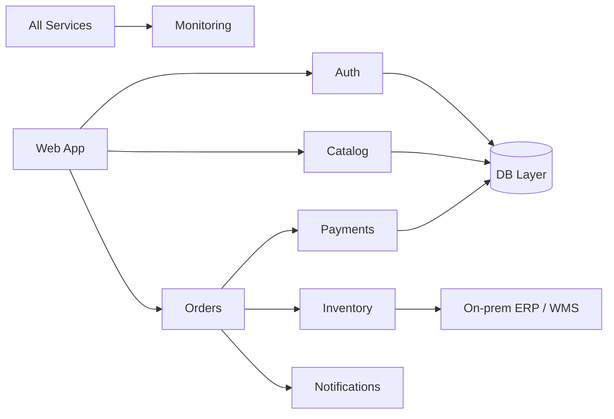

## 2. Migration strategy selection using the 7 Rs

| App | Strategy | Reason | Target |
|-----|----------|--------|--------|
| Payments Service | Refactor | Need cloud-native security controls, tokenization, and PCI segmentation rather than a lift-and-shift clone of the current stack. | Kubernetes + managed PostgreSQL + managed Kafka + KMS-backed secrets |
| E-Commerce Web App | Replatform | Containerize and modernize edge/CDN delivery while keeping most application code intact. | Kubernetes + CDN + Redis + managed TLS and WAF |
| Product Catalog Service | Refactor | Target managed NoSQL plus managed search and adopt event-driven indexing instead of tight DB coupling. | Kubernetes + managed MongoDB-compatible service + managed Elasticsearch/OpenSearch |
| Order Management Service | Replatform | Containerize existing domain logic while moving the data tier to managed PostgreSQL. | Kubernetes + managed PostgreSQL + Kafka |
| User/Auth Service | Refactor | Need tighter cloud IAM integration, workload identity, and modern token/session controls. | Kubernetes + managed PostgreSQL + Redis + OIDC provider |
| Inventory Service | Replatform | Containerize and externalize batch sync while preserving core domain logic. | Kubernetes + managed PostgreSQL + Redis + Kafka + CronJobs |
| Notification Service | Refactor | Shift from tightly coupled in-app emails to cloud messaging and queue-driven workers. | Kubernetes + Kafka/RabbitMQ + external email/SMS providers |
| Database Layer | Replatform | Move from on-prem databases to managed data services with automated HA, backup, and patching. | Managed RDS/Cloud SQL, managed MongoDB-compatible service, Redis, OpenSearch |
| Storage/CDN | Rehost then optimize | Move files first to object storage, then add lifecycle, CDN, and transformation pipelines. | Object storage + CDN + event-driven media processors |
| Monitoring & Observability | Repurchase | Replace fragmented on-prem tooling with cloud-native monitoring plus standardized open observability stack. | Prometheus/Grafana/Loki/Tempo + cloud-native monitoring services |

### Why the strategies differ

- Payments and auth are **refactored** because security, identity, and compliance controls must improve, not just relocate.
- Web, orders, and inventory can often be **replatformed** first by containerizing existing logic and redirecting their data dependencies.
- Monitoring is often best **repurchased/replaced** with a better managed or standardized stack rather than migrated verbatim.
- Storage usually starts as **rehost then optimize** because bulk file movement is simpler than immediate workflow redesign.

## 3. Pre-migration phase

### 3.1 Discovery and assessment

1. Inventory all servers, IPs, DNS names, OS versions, cron jobs, certificates, and backup routines.
2. Identify application owners, runbooks, and current deployment procedures.
3. Map north-south and east-west dependencies, especially hidden batch jobs and file shares.
4. Capture baseline performance and error-rate metrics before any change begins.

Useful tooling examples:

- AWS Migration Hub / Application Discovery Service
- Azure Migrate
- Google Migrate to Virtual Machines / discovery tooling
- CMDB exports, `nmap`, `ansible -m setup`, `lscpu`, `free -m`, and DB inventory scripts

### 3.2 TCO analysis

| Cost component | On-prem pattern | Cloud pattern | Insight |
|----------------|----------------|--------------|---------|
| Hardware refresh | Periodic CAPEX | OPEX consumption | Cloud removes refresh spikes but needs spend governance |
| Power/cooling | Hidden in facilities cost | Included in service pricing | Easier to attribute by workload in cloud |
| Staff time | More hands-on for patching and failover | More automation, different skills | Operations work shifts but does not disappear |
| DR site | Expensive duplicate hardware | Pay for standby and replication | Often a strong cloud advantage |

### 3.3 Network planning

- Determine bandwidth needed for database seeding, file replication, and log export.
- Stand up VPN or private interconnect before moving any dependent service.
- Define split-horizon DNS and TTL reductions well before cutover.

### 3.4 Security and compliance review

- Validate PCI scope reduction strategy for payments.
- Classify PII, secrets, tokens, and regulated exports.
- Define target IAM roles, key management, and audit requirements.

### 3.5 Team training plan

- Platform engineers: Kubernetes operations, GitOps, cloud IAM, incident response.
- Application engineers: containerization, secrets externalization, health probes, telemetry.
- DBAs: managed database operations, migration tooling, replication monitoring.
- Security: cloud-native controls, workload identity, SIEM integration.

### 3.6 Migration runbook creation

- Create service-level cutover checklists and rollback criteria before migration starts.
- Pre-assign ownership for DNS, database, networking, security, and incident response tasks.

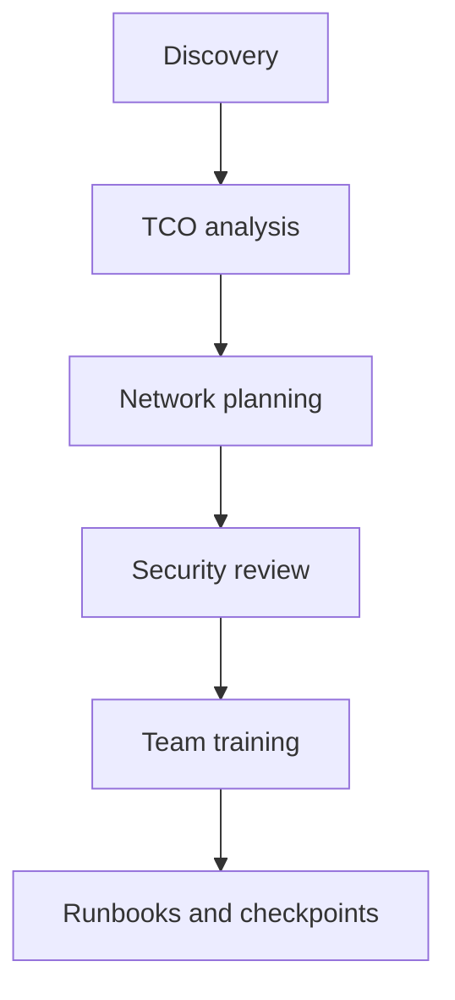

## 4. Migration waves

### Wave 1 — Foundation (Week 1-4)

Objectives:

- Build the cloud landing zone.
- Establish IAM, logging, networking, and registry foundations.
- Create initial Kubernetes clusters and baseline observability.

Detailed steps:

1. Create production, staging, and management VPC/VNet structures.
2. Establish VPN or private connectivity back to the data center.
3. Set up container registry, artifact storage, and GitOps repositories.
4. Deploy ingress, cert-manager, observability agents, and baseline policies.
5. Validate DNS architecture and certificate issuance.

Example CLI snippets:

```bash
# AWS EKS example
eksctl create cluster --name ecommerce-staging --region us-east-1 --nodes 3 --managed

# Azure AKS example
az aks create --resource-group ecommerce-staging-rg --name ecommerce-staging --node-count 3 --enable-managed-identity

# GKE example
gcloud container clusters create ecommerce-staging --region us-central1 --num-nodes 3
```

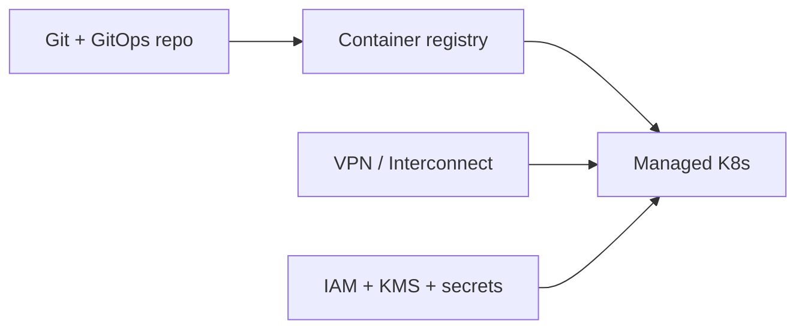

### Wave 2 — Data layer (Week 5-8)

Objectives:

- Migrate relational, document, cache, and file-storage data first.
- Keep continuous replication running until cutover to reduce downtime.

#### PostgreSQL migration options

Option A — offline/export-import for lower criticality:

```bash
pg_dump -Fc -h onprem-pg.internal -U ecommerce orders_db > orders_db.dump
pg_restore -h managed-pg.cloud -U ecommerce -d orders_db --no-owner --no-privileges orders_db.dump
```

Option B — continuous replication for near-zero downtime:

- AWS DMS / Azure Database Migration Service / GCP Database Migration Service.
- Native logical replication for PostgreSQL 13+ where appropriate.

```sql
-- on source PostgreSQL
CREATE PUBLICATION ecommerce_pub FOR ALL TABLES;
-- on target PostgreSQL
CREATE SUBSCRIPTION ecommerce_sub CONNECTION host=source dbname=orders_db user=replicator password=*** PUBLICATION ecommerce_pub;
```

#### MongoDB migration options

```bash
mongodump --host onprem-mongo.internal --db catalog --archive=catalog.archive
mongorestore --host managed-mongo.cloud --archive=catalog.archive --nsInclude="catalog.*"
```

- Use change streams or managed migration tooling to keep deltas flowing until cutover.

#### Redis migration options

```bash
redis-cli -h onprem-redis.internal --rdb redis-export.rdb
# Restore into a managed environment using provider-supported import path or replica sync
```

#### Storage migration

```bash
# Generic rsync for staging file server to migration host
rsync -avh /mnt/legacy-assets/ ./legacy-assets/

# AWS example
aws s3 sync ./legacy-assets s3://ecommerce-prod-assets/assets

# Azure example
azcopy copy "./legacy-assets/*" "https://account.blob.core.windows.net/assets?<sas>" --recursive=true

# GCP example
gsutil -m rsync -r ./legacy-assets gs://ecommerce-prod-assets/assets
```

#### Data validation checklist

- Row counts, checksums, and sample query comparison complete.
- Primary keys, indexes, and constraints re-created on target.
- Performance smoke tests against target databases completed.
- Backup and restore tested in target environment before application cutover.

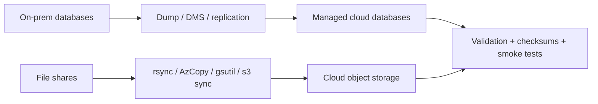

### Wave 3 — Stateless services (Week 9-12)

Objectives:

- Containerize web, catalog, notification, and selected APIs.
- Push images to cloud registry and deploy them to Kubernetes.

#### Containerization baseline

```dockerfile
FROM node:20-alpine AS build
WORKDIR /app
COPY package*.json ./
RUN npm ci
COPY . .
RUN npm run build

FROM node:20-alpine
WORKDIR /app
COPY --from=build /app .
EXPOSE 3000
CMD ["npm", "start"]
```

```yaml
version: "3.9"
services:
  web-app:
    build: .
    ports: ["3000:3000"]
    environment:
      API_BASE_URL: http://localhost:8080
```

#### Registry push examples

```bash
docker build -t ghcr.io/shasi-linux/web-app:1.0.0 .
docker push ghcr.io/shasi-linux/web-app:1.0.0
```

#### Kubernetes deployment steps

1. Create namespaces and service accounts.
2. Externalize config to ConfigMaps and secrets to secret manager integrations.
3. Deploy services behind ingress and internal Services.
4. Validate probes, autoscaling, and logging.
5. Run integration tests from staging traffic generators.

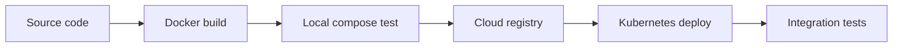

### Wave 4 — Stateful services and payments (Week 13-16)

Objectives:

- Cut over order, payment, auth, and inventory services onto cloud-managed data tiers.
- Complete PCI-aware hardening for payments.

Detailed focus areas:

- Validate TLS, tokenization, and audit logging for payments.
- Validate session and token migration behavior for auth.
- Validate reservation correctness and warehouse sync lag for inventory.
- Re-run performance baselines and compare against on-prem numbers.

Performance baseline checklist:

- p95 latency before/after migration.
- Payment authorization success rate before/after.
- Order throughput at peak sale simulation.
- Inventory sync lag and search freshness window.

### Wave 5 — Cutover (Week 17-18)

Objectives:

- Shift customer traffic gradually using weighted DNS or load balancer routing.
- Keep rollback windows open until data sync and SLOs are verified.

Cutover steps:

1. Lower DNS TTL at least 48 hours in advance.
2. Confirm replication lag is within threshold.
3. Route a small percentage of traffic to cloud.
4. Validate payments, orders, login, search, and notification success rates.
5. Increase to 25%, 50%, 75%, then 100% if error budgets remain healthy.
6. Freeze on-prem writes when final cutover occurs if dual-write is not enabled.
7. Keep rollback criteria time-boxed and explicit.

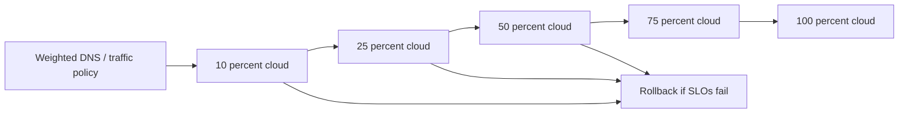

## 5. Per-application migration playbooks

### 1. Payments Service

- **Chosen migration strategy:** Refactor
- **Target state:** Kubernetes + managed PostgreSQL + managed Kafka + KMS-backed secrets
- **Why not a simpler rehost-only move:** Need cloud-native security controls, tokenization, and PCI segmentation rather than a lift-and-shift clone of the current stack.

Current-state assumptions:

- Running on a VM or bare-metal host with environment-specific configuration and local service management.
- Logging, secrets, and health checks are inconsistent or partially manual.
- Deployment rollback depends on VM snapshots, packages, or handwritten scripts rather than declarative release artifacts.

Detailed migration steps:

1. Freeze undocumented dependencies and capture a clean versioned deployment artifact.
2. Externalize configuration, secrets, certificates, and connection strings.
3. Containerize the runtime and add health, metrics, and structured logs.
4. Create staging traffic and integration tests for realistic validation.
5. Redirect the service to cloud-managed backing services while still on staging traffic.
6. Run dual validation against on-prem and cloud outputs before production cutover.
7. Cut over with rollback criteria tied to business KPIs, not just pod health.

Validation points:

- Functional regression checks passed.
- Latency and error rate are within agreed thresholds.
- Logs, metrics, traces, and alerts are visible in the target observability stack.
- Backup and restore posture is confirmed for any stateful dependency.

Rollback trigger examples:

- Checkout, login, or payment SLOs exceed thresholds for two consecutive observation windows.
- Replication lag or data validation failures threaten data correctness.
- Security controls or secret access fail in the target environment.
- Third-party providers reject traffic because source IPs, certs, or DNS are incorrect.

Payments-specific controls:

- Revalidate PCI segmentation and tokenization before any production traffic shift.
- Keep PSP allowlists updated with cloud egress addresses or NAT gateways.
- Run synthetic authorization and refund tests before enabling real money movement.

---

### 2. E-Commerce Web App

- **Chosen migration strategy:** Replatform
- **Target state:** Kubernetes + CDN + Redis + managed TLS and WAF
- **Why not a simpler rehost-only move:** Containerize and modernize edge/CDN delivery while keeping most application code intact.

Current-state assumptions:

- Running on a VM or bare-metal host with environment-specific configuration and local service management.
- Logging, secrets, and health checks are inconsistent or partially manual.
- Deployment rollback depends on VM snapshots, packages, or handwritten scripts rather than declarative release artifacts.

Detailed migration steps:

1. Freeze undocumented dependencies and capture a clean versioned deployment artifact.
2. Externalize configuration, secrets, certificates, and connection strings.
3. Containerize the runtime and add health, metrics, and structured logs.
4. Create staging traffic and integration tests for realistic validation.
5. Redirect the service to cloud-managed backing services while still on staging traffic.
6. Run dual validation against on-prem and cloud outputs before production cutover.
7. Cut over with rollback criteria tied to business KPIs, not just pod health.

Validation points:

- Functional regression checks passed.
- Latency and error rate are within agreed thresholds.
- Logs, metrics, traces, and alerts are visible in the target observability stack.
- Backup and restore posture is confirmed for any stateful dependency.

Rollback trigger examples:

- Checkout, login, or payment SLOs exceed thresholds for two consecutive observation windows.
- Replication lag or data validation failures threaten data correctness.
- Security controls or secret access fail in the target environment.
- Third-party providers reject traffic because source IPs, certs, or DNS are incorrect.

---

### 3. Product Catalog Service

- **Chosen migration strategy:** Refactor
- **Target state:** Kubernetes + managed MongoDB-compatible service + managed Elasticsearch/OpenSearch
- **Why not a simpler rehost-only move:** Target managed NoSQL plus managed search and adopt event-driven indexing instead of tight DB coupling.

Current-state assumptions:

- Running on a VM or bare-metal host with environment-specific configuration and local service management.
- Logging, secrets, and health checks are inconsistent or partially manual.
- Deployment rollback depends on VM snapshots, packages, or handwritten scripts rather than declarative release artifacts.

Detailed migration steps:

1. Freeze undocumented dependencies and capture a clean versioned deployment artifact.
2. Externalize configuration, secrets, certificates, and connection strings.
3. Containerize the runtime and add health, metrics, and structured logs.
4. Create staging traffic and integration tests for realistic validation.
5. Redirect the service to cloud-managed backing services while still on staging traffic.
6. Run dual validation against on-prem and cloud outputs before production cutover.
7. Cut over with rollback criteria tied to business KPIs, not just pod health.

Validation points:

- Functional regression checks passed.
- Latency and error rate are within agreed thresholds.
- Logs, metrics, traces, and alerts are visible in the target observability stack.
- Backup and restore posture is confirmed for any stateful dependency.

Rollback trigger examples:

- Checkout, login, or payment SLOs exceed thresholds for two consecutive observation windows.
- Replication lag or data validation failures threaten data correctness.
- Security controls or secret access fail in the target environment.
- Third-party providers reject traffic because source IPs, certs, or DNS are incorrect.

---

### 4. Order Management Service

- **Chosen migration strategy:** Replatform
- **Target state:** Kubernetes + managed PostgreSQL + Kafka
- **Why not a simpler rehost-only move:** Containerize existing domain logic while moving the data tier to managed PostgreSQL.

Current-state assumptions:

- Running on a VM or bare-metal host with environment-specific configuration and local service management.
- Logging, secrets, and health checks are inconsistent or partially manual.
- Deployment rollback depends on VM snapshots, packages, or handwritten scripts rather than declarative release artifacts.

Detailed migration steps:

1. Freeze undocumented dependencies and capture a clean versioned deployment artifact.
2. Externalize configuration, secrets, certificates, and connection strings.
3. Containerize the runtime and add health, metrics, and structured logs.
4. Create staging traffic and integration tests for realistic validation.
5. Redirect the service to cloud-managed backing services while still on staging traffic.
6. Run dual validation against on-prem and cloud outputs before production cutover.
7. Cut over with rollback criteria tied to business KPIs, not just pod health.

Validation points:

- Functional regression checks passed.
- Latency and error rate are within agreed thresholds.
- Logs, metrics, traces, and alerts are visible in the target observability stack.
- Backup and restore posture is confirmed for any stateful dependency.

Rollback trigger examples:

- Checkout, login, or payment SLOs exceed thresholds for two consecutive observation windows.
- Replication lag or data validation failures threaten data correctness.
- Security controls or secret access fail in the target environment.
- Third-party providers reject traffic because source IPs, certs, or DNS are incorrect.

---

### 5. User/Auth Service

- **Chosen migration strategy:** Refactor
- **Target state:** Kubernetes + managed PostgreSQL + Redis + OIDC provider
- **Why not a simpler rehost-only move:** Need tighter cloud IAM integration, workload identity, and modern token/session controls.

Current-state assumptions:

- Running on a VM or bare-metal host with environment-specific configuration and local service management.
- Logging, secrets, and health checks are inconsistent or partially manual.
- Deployment rollback depends on VM snapshots, packages, or handwritten scripts rather than declarative release artifacts.

Detailed migration steps:

1. Freeze undocumented dependencies and capture a clean versioned deployment artifact.
2. Externalize configuration, secrets, certificates, and connection strings.
3. Containerize the runtime and add health, metrics, and structured logs.
4. Create staging traffic and integration tests for realistic validation.
5. Redirect the service to cloud-managed backing services while still on staging traffic.
6. Run dual validation against on-prem and cloud outputs before production cutover.
7. Cut over with rollback criteria tied to business KPIs, not just pod health.

Validation points:

- Functional regression checks passed.
- Latency and error rate are within agreed thresholds.
- Logs, metrics, traces, and alerts are visible in the target observability stack.
- Backup and restore posture is confirmed for any stateful dependency.

Rollback trigger examples:

- Checkout, login, or payment SLOs exceed thresholds for two consecutive observation windows.
- Replication lag or data validation failures threaten data correctness.
- Security controls or secret access fail in the target environment.
- Third-party providers reject traffic because source IPs, certs, or DNS are incorrect.

---

### 6. Inventory Service

- **Chosen migration strategy:** Replatform
- **Target state:** Kubernetes + managed PostgreSQL + Redis + Kafka + CronJobs
- **Why not a simpler rehost-only move:** Containerize and externalize batch sync while preserving core domain logic.

Current-state assumptions:

- Running on a VM or bare-metal host with environment-specific configuration and local service management.
- Logging, secrets, and health checks are inconsistent or partially manual.
- Deployment rollback depends on VM snapshots, packages, or handwritten scripts rather than declarative release artifacts.

Detailed migration steps:

1. Freeze undocumented dependencies and capture a clean versioned deployment artifact.
2. Externalize configuration, secrets, certificates, and connection strings.
3. Containerize the runtime and add health, metrics, and structured logs.
4. Create staging traffic and integration tests for realistic validation.
5. Redirect the service to cloud-managed backing services while still on staging traffic.
6. Run dual validation against on-prem and cloud outputs before production cutover.
7. Cut over with rollback criteria tied to business KPIs, not just pod health.

Validation points:

- Functional regression checks passed.
- Latency and error rate are within agreed thresholds.
- Logs, metrics, traces, and alerts are visible in the target observability stack.
- Backup and restore posture is confirmed for any stateful dependency.

Rollback trigger examples:

- Checkout, login, or payment SLOs exceed thresholds for two consecutive observation windows.
- Replication lag or data validation failures threaten data correctness.
- Security controls or secret access fail in the target environment.
- Third-party providers reject traffic because source IPs, certs, or DNS are incorrect.

Inventory-specific controls:

- Keep on-prem warehouse sync operational until cloud adapters prove stable.
- Compare stock deltas and reservation ledgers between old and new systems during shadow mode.

---

### 7. Notification Service

- **Chosen migration strategy:** Refactor
- **Target state:** Kubernetes + Kafka/RabbitMQ + external email/SMS providers
- **Why not a simpler rehost-only move:** Shift from tightly coupled in-app emails to cloud messaging and queue-driven workers.

Current-state assumptions:

- Running on a VM or bare-metal host with environment-specific configuration and local service management.
- Logging, secrets, and health checks are inconsistent or partially manual.
- Deployment rollback depends on VM snapshots, packages, or handwritten scripts rather than declarative release artifacts.

Detailed migration steps:

1. Freeze undocumented dependencies and capture a clean versioned deployment artifact.
2. Externalize configuration, secrets, certificates, and connection strings.
3. Containerize the runtime and add health, metrics, and structured logs.
4. Create staging traffic and integration tests for realistic validation.
5. Redirect the service to cloud-managed backing services while still on staging traffic.
6. Run dual validation against on-prem and cloud outputs before production cutover.
7. Cut over with rollback criteria tied to business KPIs, not just pod health.

Validation points:

- Functional regression checks passed.
- Latency and error rate are within agreed thresholds.
- Logs, metrics, traces, and alerts are visible in the target observability stack.
- Backup and restore posture is confirmed for any stateful dependency.

Rollback trigger examples:

- Checkout, login, or payment SLOs exceed thresholds for two consecutive observation windows.
- Replication lag or data validation failures threaten data correctness.
- Security controls or secret access fail in the target environment.
- Third-party providers reject traffic because source IPs, certs, or DNS are incorrect.

---

### 8. Database Layer

- **Chosen migration strategy:** Replatform
- **Target state:** Managed RDS/Cloud SQL, managed MongoDB-compatible service, Redis, OpenSearch
- **Why not a simpler rehost-only move:** Move from on-prem databases to managed data services with automated HA, backup, and patching.

Current-state assumptions:

- Running on a VM or bare-metal host with environment-specific configuration and local service management.
- Logging, secrets, and health checks are inconsistent or partially manual.
- Deployment rollback depends on VM snapshots, packages, or handwritten scripts rather than declarative release artifacts.

Detailed migration steps:

1. Freeze undocumented dependencies and capture a clean versioned deployment artifact.
2. Externalize configuration, secrets, certificates, and connection strings.
3. Containerize the runtime and add health, metrics, and structured logs.
4. Create staging traffic and integration tests for realistic validation.
5. Redirect the service to cloud-managed backing services while still on staging traffic.
6. Run dual validation against on-prem and cloud outputs before production cutover.
7. Cut over with rollback criteria tied to business KPIs, not just pod health.

Validation points:

- Functional regression checks passed.
- Latency and error rate are within agreed thresholds.
- Logs, metrics, traces, and alerts are visible in the target observability stack.
- Backup and restore posture is confirmed for any stateful dependency.

Rollback trigger examples:

- Checkout, login, or payment SLOs exceed thresholds for two consecutive observation windows.
- Replication lag or data validation failures threaten data correctness.
- Security controls or secret access fail in the target environment.
- Third-party providers reject traffic because source IPs, certs, or DNS are incorrect.

---

### 9. Storage/CDN

- **Chosen migration strategy:** Rehost then optimize
- **Target state:** Object storage + CDN + event-driven media processors
- **Why not a simpler rehost-only move:** Move files first to object storage, then add lifecycle, CDN, and transformation pipelines.

Current-state assumptions:

- Running on a VM or bare-metal host with environment-specific configuration and local service management.
- Logging, secrets, and health checks are inconsistent or partially manual.
- Deployment rollback depends on VM snapshots, packages, or handwritten scripts rather than declarative release artifacts.

Detailed migration steps:

1. Freeze undocumented dependencies and capture a clean versioned deployment artifact.
2. Externalize configuration, secrets, certificates, and connection strings.
3. Containerize the runtime and add health, metrics, and structured logs.
4. Create staging traffic and integration tests for realistic validation.
5. Redirect the service to cloud-managed backing services while still on staging traffic.
6. Run dual validation against on-prem and cloud outputs before production cutover.
7. Cut over with rollback criteria tied to business KPIs, not just pod health.

Validation points:

- Functional regression checks passed.
- Latency and error rate are within agreed thresholds.
- Logs, metrics, traces, and alerts are visible in the target observability stack.
- Backup and restore posture is confirmed for any stateful dependency.

Rollback trigger examples:

- Checkout, login, or payment SLOs exceed thresholds for two consecutive observation windows.
- Replication lag or data validation failures threaten data correctness.
- Security controls or secret access fail in the target environment.
- Third-party providers reject traffic because source IPs, certs, or DNS are incorrect.

---

### 10. Monitoring & Observability

- **Chosen migration strategy:** Repurchase
- **Target state:** Prometheus/Grafana/Loki/Tempo + cloud-native monitoring services
- **Why not a simpler rehost-only move:** Replace fragmented on-prem tooling with cloud-native monitoring plus standardized open observability stack.

Current-state assumptions:

- Running on a VM or bare-metal host with environment-specific configuration and local service management.
- Logging, secrets, and health checks are inconsistent or partially manual.
- Deployment rollback depends on VM snapshots, packages, or handwritten scripts rather than declarative release artifacts.

Detailed migration steps:

1. Freeze undocumented dependencies and capture a clean versioned deployment artifact.
2. Externalize configuration, secrets, certificates, and connection strings.
3. Containerize the runtime and add health, metrics, and structured logs.
4. Create staging traffic and integration tests for realistic validation.
5. Redirect the service to cloud-managed backing services while still on staging traffic.
6. Run dual validation against on-prem and cloud outputs before production cutover.
7. Cut over with rollback criteria tied to business KPIs, not just pod health.

Validation points:

- Functional regression checks passed.
- Latency and error rate are within agreed thresholds.
- Logs, metrics, traces, and alerts are visible in the target observability stack.
- Backup and restore posture is confirmed for any stateful dependency.

Rollback trigger examples:

- Checkout, login, or payment SLOs exceed thresholds for two consecutive observation windows.
- Replication lag or data validation failures threaten data correctness.
- Security controls or secret access fail in the target environment.
- Third-party providers reject traffic because source IPs, certs, or DNS are incorrect.

Observability-specific controls:

- Cut over monitoring early enough that it can observe later waves.
- Preserve historical dashboards and alert mappings as code where possible.

---

## 6. Post-migration phase

### Decommission checklist

- Confirm no production traffic still depends on on-prem endpoints.
- Archive configuration, backups, certificates, and support artifacts.
- Remove obsolete firewall rules and DNS records.
- Terminate unused hardware, VMs, or licenses only after rollback windows expire.

### Optimization tasks after go-live

- Right-size nodes and managed databases after two weeks of production metrics.
- Tune HPA, KEDA, and cache TTLs using actual traffic patterns.
- Review WAF rules, IAM privileges, and observability cost drivers.
- Finalize DR automation in the cloud once the primary path is stable.

## 7. Risk register

| Risk | Impact | Mitigation |
|------|--------|------------|
| Data loss during migration | Severe | Continuous replication, backups, validation checksums, rollback gates |
| Excess downtime | Severe | Weighted cutover, staging rehearsals, low-TTL DNS, explicit rollback plans |
| Performance degradation | High | Baseline measurements, performance tests, right-sizing, cache review |
| Security gap in target cloud | Severe | Early security review, IAM least privilege, secret rotation, WAF and logging validation |
| Cost overrun | Medium-high | TCO model, budget alerts, reserved baseline, post-cutover right-sizing |
| Team readiness gap | High | Training plan, game days, paired wave ownership |

## 8. Migration timeline (Gantt-style table)

| Wave | Weeks | Major outcomes |
|------|-------|----------------|
| Wave 1 | 1-4 | Landing zone, IAM, networking, cluster bootstrap, registry, GitOps |
| Wave 2 | 5-8 | Managed databases, storage replication, data validation |
| Wave 3 | 9-12 | Containerized stateless apps in staging and then production-ready |
| Wave 4 | 13-16 | Stateful app integration, payments hardening, performance testing |
| Wave 5 | 17-18 | Weighted cutover, rollback window, production validation |

## 9. Rollback procedures by wave

### Wave 1 rollback

- Keep on-prem production untouched; simply stop using the new landing zone if foundational validation fails.

### Wave 2 rollback

- Leave cloud databases populated but return applications to on-prem primaries until replication issues are resolved.

### Wave 3 rollback

- Shift ingress or DNS back to on-prem app endpoints; keep cloud deployments available for debugging only.

### Wave 4 rollback

- Restore payment and order traffic to on-prem services, freeze cloud writes, and reconcile any dual-run deltas before retry.

### Wave 5 rollback

- Use weighted DNS to swing traffic back gradually or immediately depending on incident severity; only execute after confirming on-prem capacity remains intact.

## 10. Architecture evolution during migration

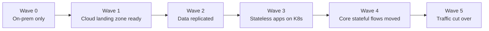

### Wave-by-wave state diagrams

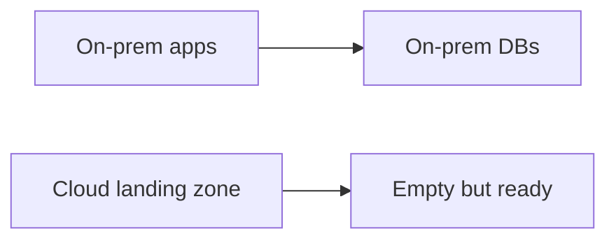

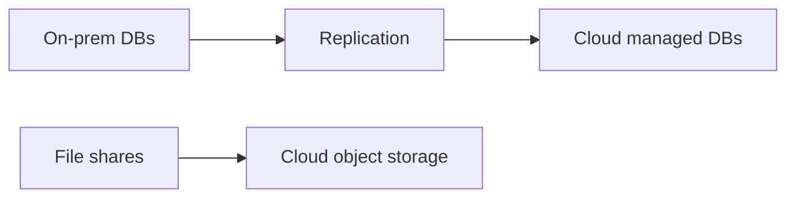

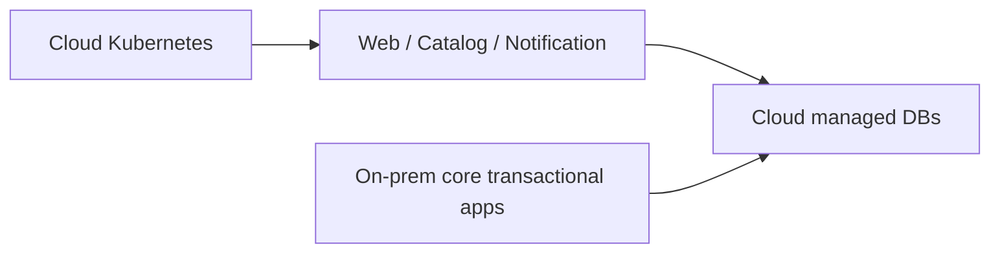

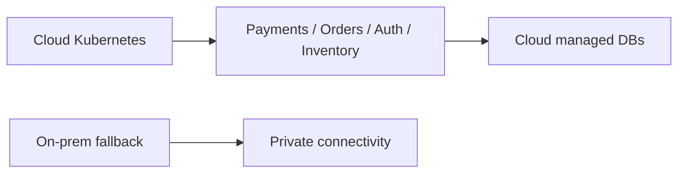

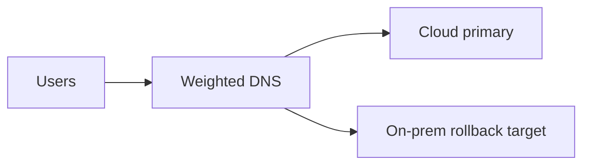

## 11. Final migration recommendation

- Move in **waves**, not with a big-bang weekend rewrite.
- Migrate **data foundations before application traffic**.
- Put **observability and security controls in place early** so later waves are measurable and auditable.
- Treat **payments, auth, and order correctness** as the highest-risk workstreams and staff them accordingly.
