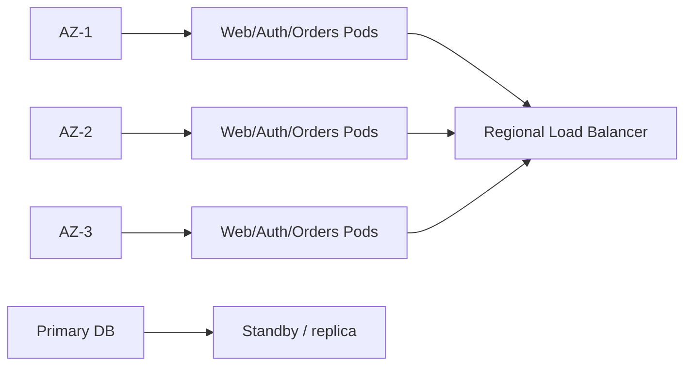
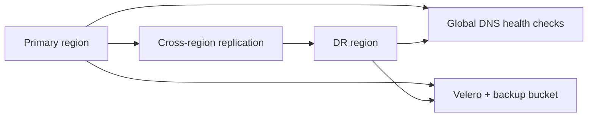
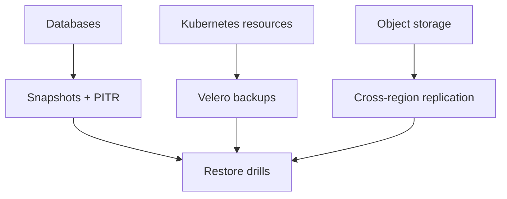
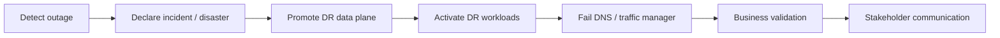
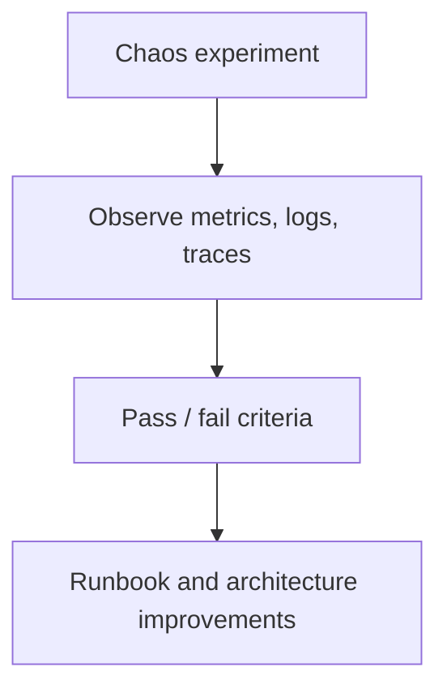

# 05 — Disaster Recovery and High Availability

> **📌 Disclaimer**: Any third-party logos, screenshots, or diagrams referenced in this document are used for educational purposes only. All trademarks belong to their respective owners.


> High availability and disaster recovery plan for the 10-application ecommerce system, including per-service RPO/RTO, failover runbooks, drills, and chaos testing.

This document should be read after [`02-kubernetes-architecture.md`](./02-kubernetes-architecture.md) and [`03-cloud-infrastructure.md`](./03-cloud-infrastructure.md), because HA and DR depend on the chosen cluster, network, and managed-service topology.

---

## 1. High availability architecture

- Run workloads across at least three availability zones in the primary region where the cloud provider supports it.
- Use PodDisruptionBudgets, anti-affinity, and topology-spread constraints for business-critical stateless services.
- Place managed databases in Multi-AZ mode and keep read replicas warm where failover speed matters.
- Use load balancer health checks and readiness gates so bad pods do not receive traffic.



### HA controls by layer

| Layer | HA control | Why it matters |
|-------|------------|----------------|
| Web/API | Multi-AZ pods + ingress health checks | Keeps customer traffic flowing during node/AZ issues |
| Messaging | Durable broker replication | Prevents event loss and enables retry after broker/node failure |
| Database | Multi-AZ primary + replicas | Preserves correctness and failover ability |
| Cache | Redis replicas / cluster mode | Avoids mass login/session failure on node loss |
| Storage/CDN | Multi-origin and replicated object storage | Protects assets and lowers edge failures |


### Kubernetes HA manifest patterns

```yaml
apiVersion: apps/v1
kind: Deployment
metadata:
  name: orders
  namespace: ecommerce-prod
spec:
  replicas: 3
  selector:
    matchLabels:
      app: orders
  template:
    metadata:
      labels:
        app: orders
    spec:
      affinity:
        podAntiAffinity:
          preferredDuringSchedulingIgnoredDuringExecution:
            - weight: 100
              podAffinityTerm:
                labelSelector:
                  matchLabels:
                    app: orders
                topologyKey: kubernetes.io/hostname
      topologySpreadConstraints:
        - maxSkew: 1
          topologyKey: topology.kubernetes.io/zone
          whenUnsatisfiable: ScheduleAnyway
          labelSelector:
            matchLabels:
              app: orders
```

```yaml
apiVersion: policy/v1
kind: PodDisruptionBudget
metadata:
  name: orders-pdb
  namespace: ecommerce-prod
spec:
  minAvailable: 2
  selector:
    matchLabels:
      app: orders
```

Why these controls matter:

- Anti-affinity avoids losing all replicas to a single node failure.
- Topology spread reduces AZ concentration risk.
- PDB prevents maintenance events from collapsing critical capacity.

## 2. DR strategy per service

| Service | RPO | RTO | DR strategy |
|---------|-----|-----|-------------|
| Payments Service | 0 | 5 minutes | Active-active across regions for authorization traffic; settlement jobs can fail over active-passive. |
| E-Commerce Web App | 1 hour | 15 minutes | Active-passive with fast image rollout because the app is stateless and content can be rehydrated from source services. |
| Product Catalog Service | 15 minutes | 30 minutes | Cross-region data replication plus rebuildable search indexes from Kafka and product exports. |
| Order Management Service | 0 | 10 minutes | Active-passive application failover with cross-region PostgreSQL replication and Kafka mirroring. |
| User/Auth Service | 5 minutes | 10 minutes | Active-passive with rapid session cache warm-up and replicated identity database. |
| Inventory Service | 5 minutes | 15 minutes | Warm standby in DR region with resynchronization from WMS and event replay. |
| Notification Service | 15 minutes | 30 minutes | Replay queued events and fail over provider credentials to a secondary region. |
| Database Layer | 0 | 5 minutes | Cross-region replication and tested restore automation for each engine. |
| Storage/CDN | 15 minutes | 30 minutes | Cross-region bucket replication and DNS-based CDN failover. |
| Monitoring & Observability | 1 hour | 30 minutes | Secondary region telemetry sink with dashboard-as-code restore and sampled trace fallback. |

### Interpretation of targets

- **RPO 0** is reserved for data where no loss is acceptable, typically requiring synchronous or near-synchronous replication and careful write-path design.
- **RTO 5-15 minutes** assumes automated failover, warm infrastructure, and tested runbooks.
- Less critical capabilities such as notifications or some storefront edges can accept slightly higher RPO/RTO as long as customers are informed and retries are safe.

## 3. DR setup

- Maintain a **secondary region** with a warm standby Kubernetes cluster or at minimum infrastructure-as-code plus pre-created networking and registries.
- Replicate databases cross-region according to engine capabilities and data criticality.
- Enable cross-region replication for object storage and backup repositories.
- Use DNS failover (Route 53, Traffic Manager, Cloud DNS policy, or GSLB) with health checks.
- Back up Kubernetes objects and volumes with **Velero**.



### Backup model

| Asset | Frequency | Retention | Restore test cadence |
|-------|-----------|-----------|----------------------|
| PostgreSQL | PITR + daily snapshots | 35-90 days based on domain | Monthly |
| MongoDB | Continuous or frequent snapshots | 14-35 days | Monthly |
| Redis | Snapshot + replication | 7-14 days | Quarterly |
| Kubernetes objects | Daily or on change | 30 days | Monthly |
| Object storage critical assets | Continuous replication | 90+ days | Quarterly |




### Cross-region component strategy

| Component | Primary mode | DR mode | Operational note |
|-----------|--------------|---------|------------------|
| Kubernetes cluster | Active in primary | Warm standby or pilot-light in DR | Keep baseline node groups ready for rapid scale-up |
| PostgreSQL | Multi-AZ writer | Cross-region replica / promoted writer | Test application reconnect behavior quarterly |
| Kafka / messaging | Replicated cluster or topic mirroring | Mirrored topics in DR | Consumer groups must tolerate replay after promotion |
| Redis | Primary with replicas | Recreated/warmed or replicated depending feature criticality | Sessions may be degraded briefly after DR activation |
| Object storage | Regional bucket with replication | Secondary bucket | Validate signed URL and CDN origin behavior in DR |
| Monitoring | Full in primary | Reduced but usable in DR | Enough telemetry must survive to debug the disaster itself |

### DNS failover operating model

- Use health checks from at least three external vantage points.
- Keep TTL low enough for practical failover but not so low that resolver churn becomes expensive.
- Separate public storefront failover from internal service discovery failover.
- Document manual override if health checks are wrong during partial dependency outages.

## 4. Failover procedures

### Scenario A — Single node or single AZ failure

1. Kubernetes reschedules pods automatically according to PDB and affinity rules.
2. Confirm that remaining zones still satisfy minimum capacity.
3. Watch error budget burn and autoscaler behavior.
4. Replace failed nodes and rebalance if needed.

### Scenario B — Managed database primary failure

1. Validate cloud-provider failover status.
2. Freeze risky writes only if application semantics require operator confirmation.
3. Confirm application pools reconnect to new writer endpoint automatically.
4. Run reconciliation for orders/payments if any in-flight transactions were uncertain.

### Scenario C — Primary region outage

1. Declare disaster and assign incident commander.
2. Verify primary region health-check failure from multiple observers.
3. Promote DR region databases or writer endpoints as documented per engine.
4. Sync or enable DR cluster workloads.
5. Flip DNS/global traffic manager to DR region.
6. Validate payments, login, browse, orders, and notification pipelines.
7. Communicate externally and internally with status cadence.

### Scenario D — Messaging backbone disruption

1. Preserve producer durability and do not drop events silently.
2. Pause non-critical consumers if ordering or consistency is at risk.
3. Rebuild from mirrored cluster, backups, or retained partitions as required.
4. Reconcile downstream projections after service restoration.



## 5. Service-specific failover notes

### 1. Payments Service

- **Target RPO/RTO:** 0 / 5 minutes.
- **Primary DR posture:** Active-active across regions for authorization traffic; settlement jobs can fail over active-passive.

Failover checklist:

1. Confirm dependency health in both primary and DR topology.
2. Verify secrets, certificates, and external endpoints are valid in the target region.
3. Scale or unpause the DR deployment and confirm readiness checks.
4. Run business-level smoke tests, not only infrastructure probes.
5. Record any data reconciliation required after failback.

Failback checklist:

1. Re-establish replication back to the original primary region.
2. Validate data convergence before routing traffic back.
3. Shift traffic gradually unless the business requires immediate return.
4. Review incident metrics and update the runbook with real findings.

Payments note:

- Coordinate with payment providers regarding source IPs, certificates, and regional routing before activating DR authorizations.

---

### 2. E-Commerce Web App

- **Target RPO/RTO:** 1 hour / 15 minutes.
- **Primary DR posture:** Active-passive with fast image rollout because the app is stateless and content can be rehydrated from source services.

Failover checklist:

1. Confirm dependency health in both primary and DR topology.
2. Verify secrets, certificates, and external endpoints are valid in the target region.
3. Scale or unpause the DR deployment and confirm readiness checks.
4. Run business-level smoke tests, not only infrastructure probes.
5. Record any data reconciliation required after failback.

Failback checklist:

1. Re-establish replication back to the original primary region.
2. Validate data convergence before routing traffic back.
3. Shift traffic gradually unless the business requires immediate return.
4. Review incident metrics and update the runbook with real findings.

---

### 3. Product Catalog Service

- **Target RPO/RTO:** 15 minutes / 30 minutes.
- **Primary DR posture:** Cross-region data replication plus rebuildable search indexes from Kafka and product exports.

Failover checklist:

1. Confirm dependency health in both primary and DR topology.
2. Verify secrets, certificates, and external endpoints are valid in the target region.
3. Scale or unpause the DR deployment and confirm readiness checks.
4. Run business-level smoke tests, not only infrastructure probes.
5. Record any data reconciliation required after failback.

Failback checklist:

1. Re-establish replication back to the original primary region.
2. Validate data convergence before routing traffic back.
3. Shift traffic gradually unless the business requires immediate return.
4. Review incident metrics and update the runbook with real findings.

---

### 4. Order Management Service

- **Target RPO/RTO:** 0 / 10 minutes.
- **Primary DR posture:** Active-passive application failover with cross-region PostgreSQL replication and Kafka mirroring.

Failover checklist:

1. Confirm dependency health in both primary and DR topology.
2. Verify secrets, certificates, and external endpoints are valid in the target region.
3. Scale or unpause the DR deployment and confirm readiness checks.
4. Run business-level smoke tests, not only infrastructure probes.
5. Record any data reconciliation required after failback.

Failback checklist:

1. Re-establish replication back to the original primary region.
2. Validate data convergence before routing traffic back.
3. Shift traffic gradually unless the business requires immediate return.
4. Review incident metrics and update the runbook with real findings.

---

### 5. User/Auth Service

- **Target RPO/RTO:** 5 minutes / 10 minutes.
- **Primary DR posture:** Active-passive with rapid session cache warm-up and replicated identity database.

Failover checklist:

1. Confirm dependency health in both primary and DR topology.
2. Verify secrets, certificates, and external endpoints are valid in the target region.
3. Scale or unpause the DR deployment and confirm readiness checks.
4. Run business-level smoke tests, not only infrastructure probes.
5. Record any data reconciliation required after failback.

Failback checklist:

1. Re-establish replication back to the original primary region.
2. Validate data convergence before routing traffic back.
3. Shift traffic gradually unless the business requires immediate return.
4. Review incident metrics and update the runbook with real findings.

---

### 6. Inventory Service

- **Target RPO/RTO:** 5 minutes / 15 minutes.
- **Primary DR posture:** Warm standby in DR region with resynchronization from WMS and event replay.

Failover checklist:

1. Confirm dependency health in both primary and DR topology.
2. Verify secrets, certificates, and external endpoints are valid in the target region.
3. Scale or unpause the DR deployment and confirm readiness checks.
4. Run business-level smoke tests, not only infrastructure probes.
5. Record any data reconciliation required after failback.

Failback checklist:

1. Re-establish replication back to the original primary region.
2. Validate data convergence before routing traffic back.
3. Shift traffic gradually unless the business requires immediate return.
4. Review incident metrics and update the runbook with real findings.

---

### 7. Notification Service

- **Target RPO/RTO:** 15 minutes / 30 minutes.
- **Primary DR posture:** Replay queued events and fail over provider credentials to a secondary region.

Failover checklist:

1. Confirm dependency health in both primary and DR topology.
2. Verify secrets, certificates, and external endpoints are valid in the target region.
3. Scale or unpause the DR deployment and confirm readiness checks.
4. Run business-level smoke tests, not only infrastructure probes.
5. Record any data reconciliation required after failback.

Failback checklist:

1. Re-establish replication back to the original primary region.
2. Validate data convergence before routing traffic back.
3. Shift traffic gradually unless the business requires immediate return.
4. Review incident metrics and update the runbook with real findings.

---

### 8. Database Layer

- **Target RPO/RTO:** 0 / 5 minutes.
- **Primary DR posture:** Cross-region replication and tested restore automation for each engine.

Failover checklist:

1. Confirm dependency health in both primary and DR topology.
2. Verify secrets, certificates, and external endpoints are valid in the target region.
3. Scale or unpause the DR deployment and confirm readiness checks.
4. Run business-level smoke tests, not only infrastructure probes.
5. Record any data reconciliation required after failback.

Failback checklist:

1. Re-establish replication back to the original primary region.
2. Validate data convergence before routing traffic back.
3. Shift traffic gradually unless the business requires immediate return.
4. Review incident metrics and update the runbook with real findings.

---

### 9. Storage/CDN

- **Target RPO/RTO:** 15 minutes / 30 minutes.
- **Primary DR posture:** Cross-region bucket replication and DNS-based CDN failover.

Failover checklist:

1. Confirm dependency health in both primary and DR topology.
2. Verify secrets, certificates, and external endpoints are valid in the target region.
3. Scale or unpause the DR deployment and confirm readiness checks.
4. Run business-level smoke tests, not only infrastructure probes.
5. Record any data reconciliation required after failback.

Failback checklist:

1. Re-establish replication back to the original primary region.
2. Validate data convergence before routing traffic back.
3. Shift traffic gradually unless the business requires immediate return.
4. Review incident metrics and update the runbook with real findings.

Storage/CDN note:

- Pre-create secondary origins and CDN failover policies so asset delivery does not wait for manual edge reconfiguration.

---

### 10. Monitoring & Observability

- **Target RPO/RTO:** 1 hour / 30 minutes.
- **Primary DR posture:** Secondary region telemetry sink with dashboard-as-code restore and sampled trace fallback.

Failover checklist:

1. Confirm dependency health in both primary and DR topology.
2. Verify secrets, certificates, and external endpoints are valid in the target region.
3. Scale or unpause the DR deployment and confirm readiness checks.
4. Run business-level smoke tests, not only infrastructure probes.
5. Record any data reconciliation required after failback.

Failback checklist:

1. Re-establish replication back to the original primary region.
2. Validate data convergence before routing traffic back.
3. Shift traffic gradually unless the business requires immediate return.
4. Review incident metrics and update the runbook with real findings.

---


## 6. Business validation matrix during failover

| Service | Smoke test after failover | Success signal |
|---------|---------------------------|----------------|
| Payments Service | Authorize and void a synthetic payment | Transaction recorded with correct provider callback and audit log |
| E-Commerce Web App | Browse homepage, search, cart, checkout page load | p95 latency within DR threshold and no broken assets |
| Product Catalog Service | Search for top SKUs and load PDPs | Search results and product detail data are fresh enough |
| Order Management Service | Place synthetic order and fetch order history | State transitions complete and event fan-out works |
| User/Auth Service | Login with MFA test user and refresh token | Token issuance and session validation succeed |
| Inventory Service | Reserve and release stock on test SKU | Stock counts and reservation ledger remain correct |
| Notification Service | Trigger email/SMS/push sandbox message | Delivery request exits queue and receipt is logged |
| Database Layer | Run read/write health checks on each engine | Writer and replica roles are correct |
| Storage/CDN | Fetch image and signed download URL | Asset served from healthy origin / cache path |
| Monitoring & Observability | View incident dashboard and receive test alert | Operators can still see the platform during the disaster |

## 7. Tooling and command examples

### Velero backup and restore

```bash
velero backup create ecommerce-prod-$(date +%Y%m%d)   --include-namespaces ecommerce-prod,monitoring,ingress-system   --snapshot-volumes

velero restore create --from-backup ecommerce-prod-20250604
```

### Kubernetes zone-failure preparation checks

```bash
kubectl -n ecommerce-prod get pdb
kubectl -n ecommerce-prod get pods -o wide
kubectl get nodes -L topology.kubernetes.io/zone
```

### Managed database failover validation checklist

```bash
# Pseudocode examples; adapt to provider tooling
psql "$ORDER_DB_URL" -c 'select now();'
redis-cli -u "$REDIS_URL" ping
curl -sf https://shop.example.com/healthz
```

## 8. DR drills and testing cadence


| Drill | Frequency | Success criteria |
|-------|-----------|------------------|
| Pod/node failure game day | Monthly | No user-visible impact beyond agreed transient thresholds |
| DB failover rehearsal | Quarterly | Automatic reconnect works; reconciliation runbook validated |
| Regional failover tabletop | Quarterly | Stakeholders can execute runbook and communications flow |
| Full regional failover test | Semi-annual | Traffic served from DR within target RTO and business KPIs healthy |
| Restore-from-backup test | Monthly | Service can rebuild from backups inside documented RTO |

### DR drill checklist

- Incident commander assigned.
- Start and end timestamps captured.
- Business KPI checks included, not just ping tests.
- Known deviations documented with owners and due dates.


### Communication runbook essentials

- Incident commander, communications lead, and service owners must be named before a disaster happens.
- Customer communication templates should exist for checkout degradation, payment instability, and full regional failover.
- Internal updates should include current impact, next checkpoint, rollback/failback decision, and known unknowns.

### Failback decision criteria

- Primary region root cause is understood and remediated.
- Data convergence is verified for every stateful dependency.
- Business leadership approves the risk window for moving back.
- Observability and synthetic checks are green in both regions.

## 7. Chaos engineering

- Inject pod kills, node drains, DNS failures, queue lag, and database failover simulations in lower environments first.
- Use controlled blast radius and explicit abort conditions.
- Measure not just system recovery but also alert quality and operator response time.

### Suggested chaos scenarios

| Layer | Example experiment | Expected outcome |
|------|--------------------|------------------|
| Web | Kill 30% of web pods | HPA and load balancer absorb without significant error spike |
| Orders/Payments | Inject payment latency | Circuit breakers and graceful degradation protect checkout |
| Inventory | Break warehouse sync link | Cached availability and retry logic prevent immediate checkout collapse |
| Database | Simulate writer failover | Clients reconnect, replay, and maintain data integrity |
| CDN | Disable primary origin | Secondary origin or cache continues asset delivery |




### Example controlled chaos commands

```bash
# Drain a non-critical node in staging to validate pod rescheduling
kubectl drain <node-name> --ignore-daemonsets --delete-emptydir-data

# Restart a deployment to validate readiness and PDB behavior
kubectl -n ecommerce-staging rollout restart deployment/orders
```

### Chaos success criteria

- Alerts fire once, not hundreds of times.
- Runbooks are followed without improvising core steps.
- User-visible SLOs stay within the predefined experiment budget.
- The team can explain why the system recovered, not just that it recovered.


### Backup restore validation matrix

| Restore type | Who runs it | Frequency | Evidence retained |
|--------------|-------------|-----------|-------------------|
| Single-table PostgreSQL restore | DBA / platform data owner | Monthly | Query screenshots, timings, checksum notes |
| Full namespace Velero restore | Platform team | Monthly in staging | Restore logs and smoke-test results |
| Object storage point-in-time file restore | Platform or storage owner | Quarterly | Retrieved object hash and access validation |
| Search index rebuild | Search/platform owner | Quarterly | Reindex duration and search correctness checks |

### Observability during disasters

- Preserve a slim but reliable telemetry path in the DR region even if full log retention is reduced.
- Prefer dashboards that answer business questions first: can customers log in, browse, pay, and receive confirmation?
- Keep one dashboard per critical flow so incident responders do not waste time correlating dozens of low-value charts.
- Route DR-specific alerts with distinct labels so teams know the platform is already in a degraded operating mode.

### Post-incident review expectations

- Capture timeline, decision points, tool outputs, and communications artifacts.
- Document whether RPO and RTO targets were actually met.
- Identify manual steps that should be automated before the next drill or real event.
- Feed architecture improvements back into [`02-kubernetes-architecture.md`](./02-kubernetes-architecture.md) and [`03-cloud-infrastructure.md`](./03-cloud-infrastructure.md).

## 8. Final HA/DR recommendation


- Build **HA in the primary region by default** so routine failures never become disasters.
- Keep a **warm DR region** for critical services with explicit, tested promotion paths.
- Tie **RPO/RTO targets to business impact**, not generic infrastructure labels.
- Rehearse **drills regularly** and treat failures in exercises as valuable design feedback.
