# 06 Detailed Architecture Diagrams

Complete Visual Architecture Reference — Cloud plus 10-App System

This guide is the visual companion for the cloud-target architecture. It emphasizes large, reference-grade Mermaid diagrams that can be reused in design reviews, migration planning, operations, and security conversations.
Each section stays intentionally brief outside the diagrams: a concise explanation, a usage cue, the diagram itself, and a short set of takeaways that highlight the main design decisions.

---

## Diagram 1 — Complete 10-App System Architecture (The Big Picture)

This is the main system map for the cloud-native ecommerce platform, showing user entrypoints, the web-facing BFF, all ten application domains, their data stores, asynchronous messaging, and the shared observability layer.
Solid arrows indicate synchronous request paths such as REST or gRPC, while dashed arrows show asynchronous event publication and side-effect processing.

**When to use:** Use this as the primary reference when you need one diagram that explains the whole platform to engineering, operations, security, and product stakeholders.

```mermaid
%%{init:{"theme":"neutral"}}%%
graph TB
    shoppers[Users / Browsers / Mobile Apps] --> cdn_edge[CDN + Edge Cache]
    cdn_edge --> api_gateway[API Gateway / WAF / Rate Limits]
    api_gateway --> web_bff[Web App BFF]

    subgraph app_domain[10 Application Domains]
        auth_service[User / Auth Service]
        catalog_service[Product Catalog Service]
        search_service[Search Service]
        cart_service[Cart Service]
        order_service[Order Service]
        inventory_service[Inventory Service]
        payment_service[Payments Service]
        notification_service[Notification Service]
        shipping_service[Shipping Service]
        admin_service[Admin / Backoffice Service]
    end

    subgraph data_domain[Databases and State]
        postgres_orders[PostgreSQL Orders DB]
        postgres_users[PostgreSQL Users DB]
        postgres_inventory[PostgreSQL Inventory DB]
        mongo_catalog[MongoDB Catalog DB]
        redis_cache_main[Redis Cache + Sessions]
        elastic_search_idx[Elasticsearch Search Index]
        kafka_bus[Kafka Event Bus]
        object_storage[S3 / Blob Storage]
    end

    subgraph integration_domain[External and Shared]
        payment_gateway_ext[Stripe / Razorpay]
        email_provider[Email Provider]
        sms_provider[SMS Provider]
        carrier_api[Shipping Carrier APIs]
        fraud_api[Fraud Scoring API]
    end

    subgraph observability_domain[Monitoring and Logging]
        prom_arch[Prometheus]
        graf_arch[Grafana]
        elk_arch[ELK Stack]
        otel_arch[OpenTelemetry Collector]
    end

    web_bff -->|REST| auth_service
    web_bff -->|REST| catalog_service
    web_bff -->|REST| search_service
    web_bff -->|REST| cart_service
    web_bff -->|REST| order_service
    web_bff -->|REST| admin_service
    order_service -->|gRPC| inventory_service
    order_service -->|REST| payment_service
    order_service -.->|order.created| notification_service
    order_service -.->|order.created| shipping_service
    catalog_service -.->|catalog.updated| search_service
    auth_service --> postgres_users
    catalog_service --> mongo_catalog
    search_service --> elastic_search_idx
    cart_service --> redis_cache_main
    order_service --> postgres_orders
    inventory_service --> postgres_inventory
    payment_service --> postgres_orders
    admin_service --> mongo_catalog
    admin_service --> object_storage
    catalog_service --> object_storage
    cart_service --> redis_cache_main
    order_service -.->|Kafka events| kafka_bus
    inventory_service -.->|stock.reserved| kafka_bus
    payment_service -.->|payment.captured| kafka_bus
    notification_service -.->|consume events| kafka_bus
    shipping_service -.->|consume events| kafka_bus
    search_service -.->|consume events| kafka_bus
    payment_service --> payment_gateway_ext
    payment_service --> fraud_api
    notification_service --> email_provider
    notification_service --> sms_provider
    shipping_service --> carrier_api
    auth_service -.-> prom_arch
    catalog_service -.-> prom_arch
    order_service -.-> prom_arch
    payment_service -.-> prom_arch
    inventory_service -.-> prom_arch
    auth_service -.-> otel_arch
    order_service -.-> otel_arch
    payment_service -.-> otel_arch
    web_bff -.-> elk_arch
    order_service -.-> elk_arch
    notification_service -.-> elk_arch
    prom_arch --> graf_arch
    recommendation_cache[Recommendation Cache]
    analytics_lake[Analytics Lakehouse]
    dead_letter_queue[Kafka DLQ / Retry Topics]
    auth_service --> redis_cache_main
    catalog_service --> redis_cache_main
    web_bff --> recommendation_cache
    search_service -.->|top search analytics| analytics_lake
    order_service -.->|checkout analytics| analytics_lake
    kafka_bus ==> dead_letter_queue
    kafka_bus ==> analytics_lake
```

**Key takeaways**
- The BFF coordinates customer-facing workflows, but business capabilities remain separate behind it for scaling and ownership clarity.
- PostgreSQL, MongoDB, Redis, Elasticsearch, Kafka, and object storage each support different data access patterns in the same system.
- Async messaging reduces coupling for notifications, shipping, and search updates while preserving strong write paths for orders and payments.

## Diagram 2 — Cloud VPC and Network Architecture

This network diagram maps the cloud landing zone for the ecommerce platform, including public, app, database, and management subnets inside a single VPC.
It also includes route tables, security layers, and VPN attachment so readers can see how the cloud environment connects to external users and on-prem infrastructure.

**When to use:** Use this when defining cloud network boundaries, subnet placement, and security controls for a production deployment.

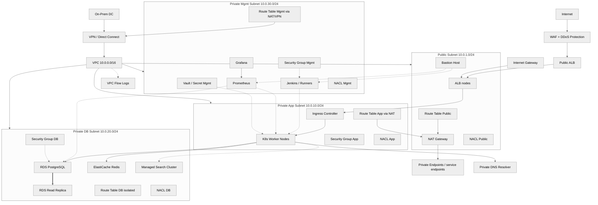

**Key takeaways**
- Public exposure is limited to the ALB, bastion, and NAT path; application and data services remain in private subnets.
- Security groups model workload relationships while NACLs provide an additional subnet-level filter layer.
- VPN or Direct Connect provides hybrid continuity for migration or shared operations with on-prem systems.

## Diagram 3 — Order Placement End-to-End Flow

This sequence diagram follows the most critical business transaction in the platform: placing an order and confirming payment while protecting stock accuracy.
It also captures the failure path where payment is rejected and inventory reservations must be rolled back cleanly.

**When to use:** Use this during domain modeling, incident review, or checkout latency analysis because it makes service responsibilities and rollback points explicit.

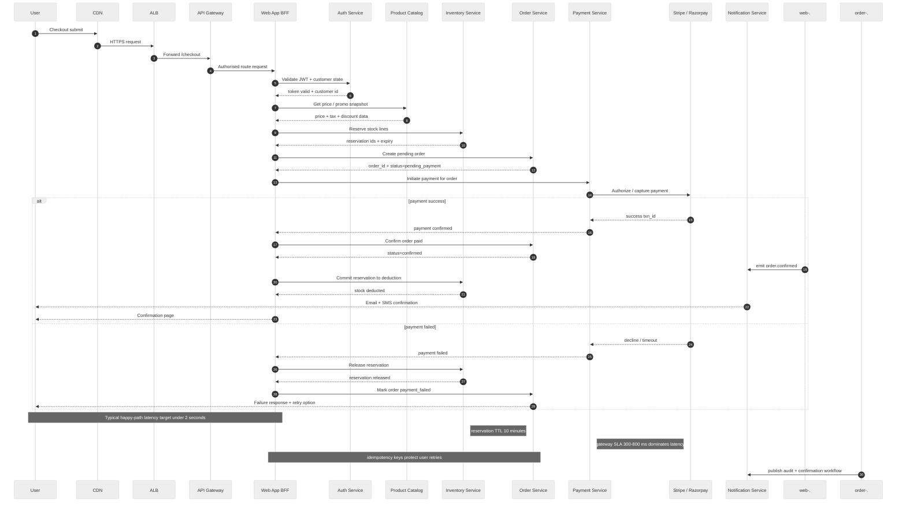

**Key takeaways**
- Inventory reservation must happen before payment capture to prevent overselling during spikes.
- Order confirmation is only final after both payment success and inventory commitment are complete.
- Rollback paths should be modeled explicitly, because checkout failures are business-critical flows too.

## Diagram 4 — Data Flow Architecture (CQRS plus Event Sourcing)

This diagram separates write and read responsibilities so the platform can keep transactional correctness on the command side while optimizing search and dashboards on the query side.
It also shows how events leave the write database through CDC and feed downstream projections such as Elasticsearch and Redis-backed read models.

**When to use:** Use this when designing high-read ecommerce systems where order integrity and fast product discovery must coexist.

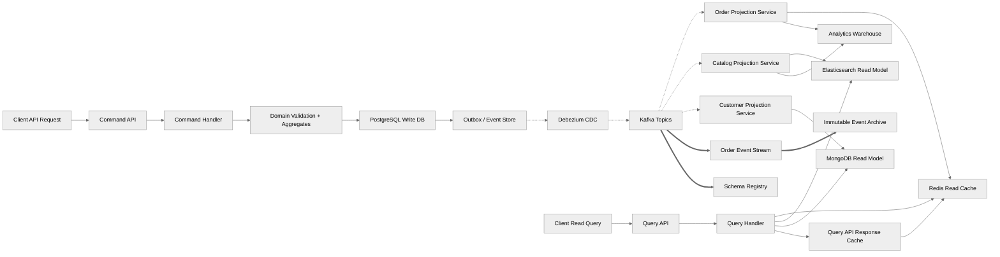

**Key takeaways**
- The command path prioritizes transactional correctness, while the query path prioritizes speed and tailored read models.
- CDC plus an outbox pattern avoids dual-write problems when publishing events from a relational write store.
- Event archives create a durable history that supports replay, audit, and new projection creation later.

## Diagram 5 — Cloud Security Architecture

This security architecture layers edge protection, cluster isolation, service identity, secret distribution, and encryption controls across the whole platform.
It connects IAM roles, Vault, External Secrets, mesh mTLS, and managed database encryption into one zero-trust oriented design.

**When to use:** Use this when documenting how cloud-native controls combine to protect internet-facing ecommerce workloads and sensitive payment-adjacent data.

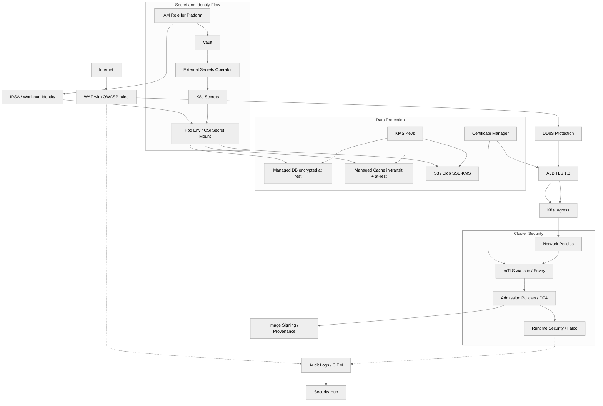

**Key takeaways**
- Security is a chain from the edge to the pod, not a single WAF or firewall control.
- Secrets should move through managed operators and short-lived identity rather than manual secret injection.
- Encryption in transit and at rest must be paired with authorization boundaries such as IAM and network policy.

## Diagram 6 — Monitoring and Observability Stack

This observability view combines technical telemetry with business-facing dashboards so platform health and ecommerce outcomes are visible together.
Metrics, logs, traces, synthetic checks, and alert routing are connected as one operating system for the platform rather than isolated tools.

**When to use:** Use this when defining SLOs, dashboards, and incident response paths for production cloud workloads.

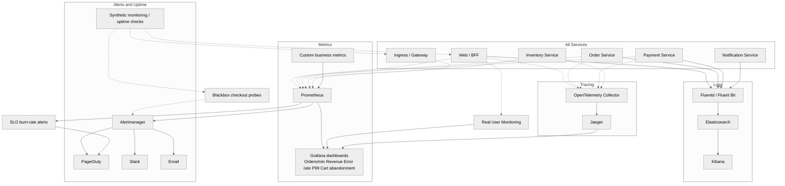

**Key takeaways**
- Business metrics belong beside infrastructure metrics because incidents are often first seen as checkout or revenue anomalies.
- Tracing is essential for multi-service flows such as checkout where latency may span several internal and external calls.
- Synthetic checks catch customer-visible failures that can remain hidden when internal health endpoints still look green.

## Diagram 7 — On-Prem versus Cloud Architecture Comparison

This side-by-side comparison maps traditional on-prem components to their cloud-native equivalents so the migration target is easy to understand.
It makes the operational shift visible: from hardware-managed capacity and manual scaling to managed services, automation, and elastic infrastructure.

**When to use:** Use this when explaining migration rationale, target-state design, or platform operating model changes to mixed audiences.

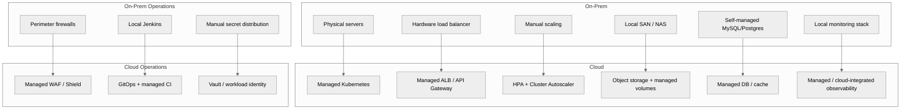

**Key takeaways**
- The biggest change is operational responsibility, not only runtime location.
- Cloud architecture replaces manual provisioning and appliance management with APIs, policies, and managed services.
- Mapping legacy components to cloud equivalents helps de-risk migration planning.

## Diagram 8 — 5-Wave Migration Timeline

This gantt chart breaks the modernization program into five waves so infrastructure, data, application, and cutover work can be sequenced realistically.
Parallel activities are shown inside each wave to reflect how platform and product workstreams typically overlap during migration.

**When to use:** Use this when coordinating teams, budgets, and delivery expectations across a multi-month migration effort.

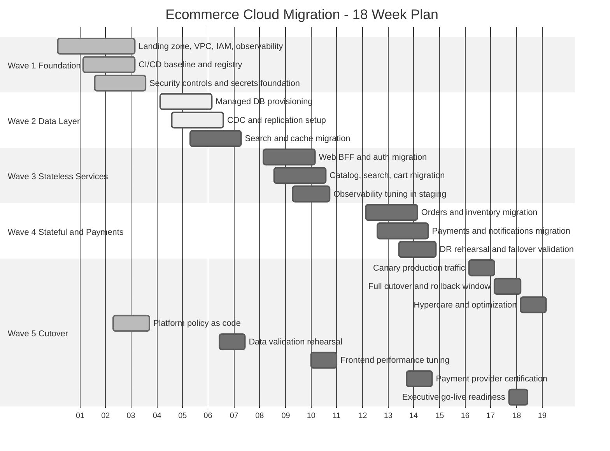

**Key takeaways**
- Foundation and data migration must start before stateless service movement can be low-risk.
- Stateful services and payments deserve a later wave because their failure cost is higher.
- Cutover should include both a canary phase and an explicit rollback window, not a single irreversible switch.

## Diagram 9 — Multi-Region DR Architecture

This diagram shows primary and disaster recovery regions with global traffic steering, replicated platform services, and cross-region data flows for all critical stateful components.
It makes the standby design and replication methods visible so teams can align failover procedures with actual platform topology.

**When to use:** Use this when you need a clear production DR reference that spans compute, databases, cache, and object storage across regions.

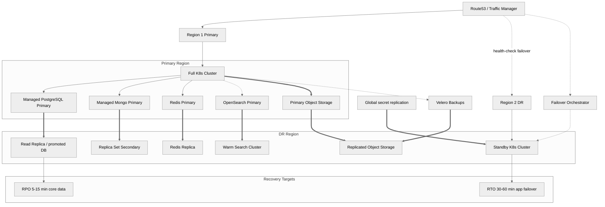

**Key takeaways**
- DR requires both replicated data and enough standby compute to actually serve traffic after promotion.
- Different data stores replicate differently, so a single DR statement rarely fits the whole platform.
- Health-checked global DNS is the final control point that makes recovery reachable by customers.

## Diagram 10 — Cost Architecture Where Money Goes

This pie chart gives a simplified view of cost concentration areas so platform decisions can be discussed in economic as well as technical terms.
It is intentionally high-level, making it useful for governance reviews, budget planning, and optimization prioritization.

**When to use:** Use this when communicating cost distribution to stakeholders deciding where optimization work will have the biggest impact.

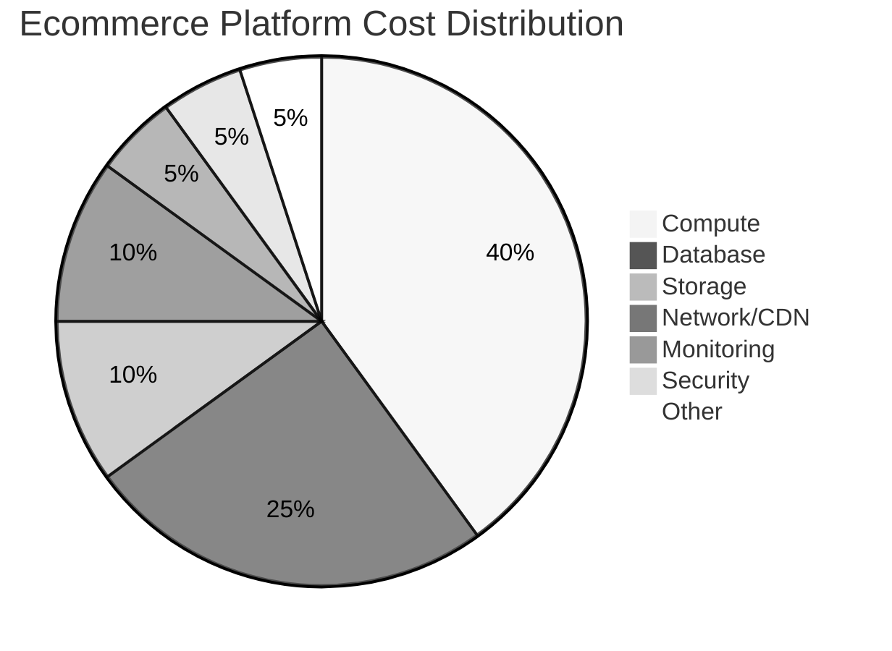

**Key takeaways**
- Compute and database spend usually dominate the bill for a multi-service ecommerce platform.
- Storage and network costs look smaller individually but grow quickly with search, backups, media, and cross-region traffic.
- A cost diagram helps teams prioritize autoscaling, data retention, and architecture simplification work.

## Diagram 11 — Technology Decision Tree

This decision tree turns common architecture choices into explicit branching logic so the team can explain why particular technologies fit specific problem shapes.
It covers persistence, messaging, ingress, and orchestration choices rather than presenting one stack as universally correct.

**When to use:** Use this when standardizing technology selection or reviewing whether a new workload should follow the platform defaults.

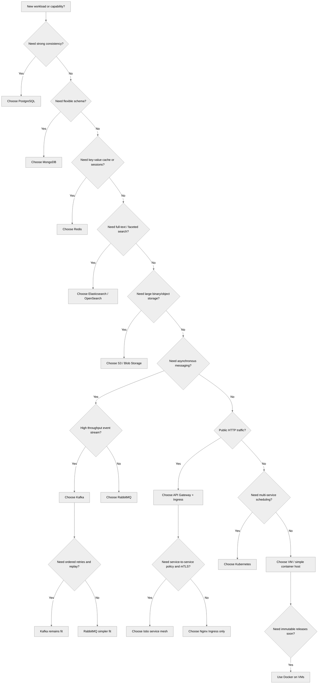

**Key takeaways**
- Decision trees are useful because they encode platform rationale, not just preferences.
- Different storage and messaging systems are selected for different access and consistency needs.
- Standard branching logic reduces architecture drift across teams.

## Diagram 12 — Deployment Strategy Decision

This decision graph explains when rolling, canary, or blue-green deployment strategies are appropriate and how traffic moves during each one.
It links release criticality and blast radius to the actual deployment pattern instead of leaving rollout choice to ad hoc judgment.

**When to use:** Use this when defining release policy for different classes of services such as payments, customer-facing web, and major version upgrades.

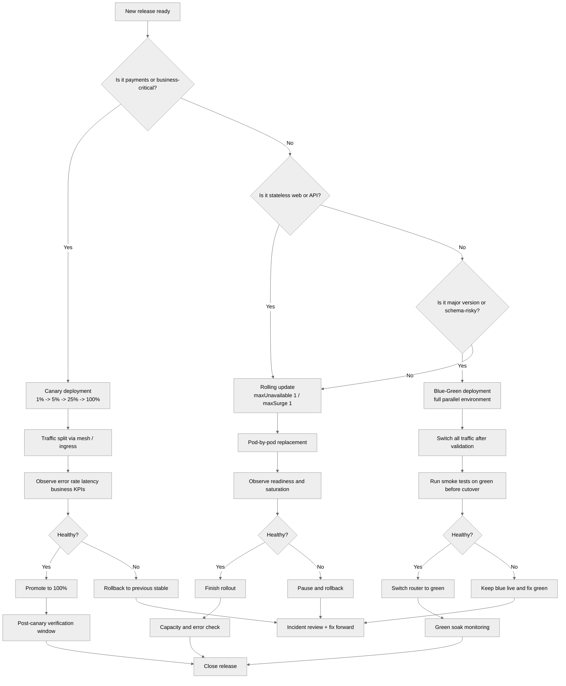

**Key takeaways**
- Criticality and change risk should drive rollout strategy selection, not habit alone.
- Canary is ideal for high-risk but live-traffic-tolerant services, while blue-green suits large compatibility jumps.
- Every strategy needs an explicit observation and rollback step to be operationally safe.
