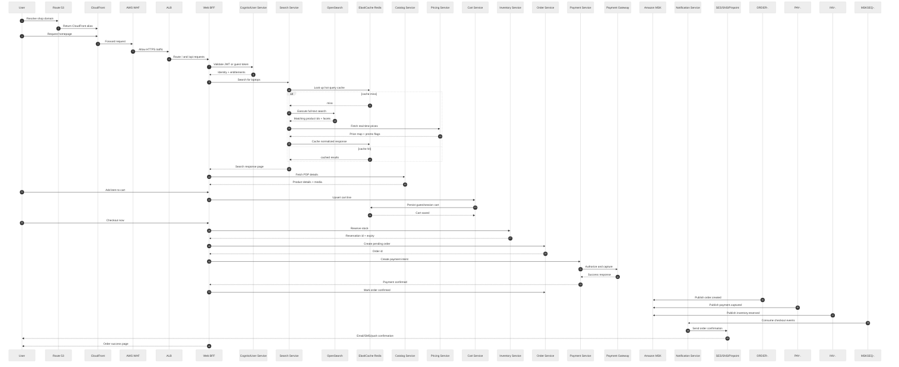
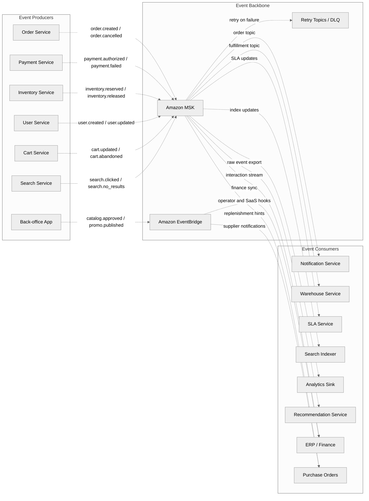
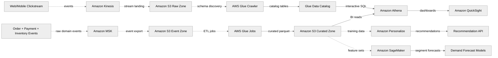
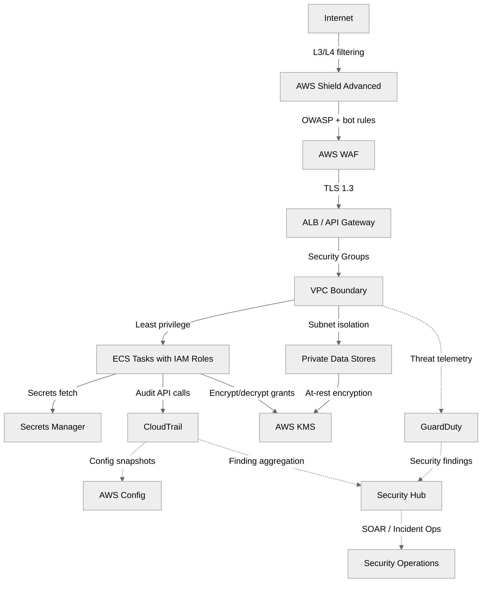

# 07 — AWS Reference Architecture

> AWS-style ecommerce reference implementation for the 10-application platform defined in [01-system-overview-and-design-decisions.md](./01-system-overview-and-design-decisions.md), deployed with the runtime patterns from [02-kubernetes-architecture.md](./02-kubernetes-architecture.md), the infrastructure choices from [03-cloud-infrastructure.md](./03-cloud-infrastructure.md), and the recovery principles from [05-disaster-recovery-and-ha.md](./05-disaster-recovery-and-ha.md).

This guide turns the existing architecture track into a concrete AWS realization modeled after real reference architectures used for enterprise ecommerce estates. It combines the customer-facing stack, the back-office stack, the operational landing zone, the event backbone, the analytics plane, and the security controls required for regulated payment and PII-heavy workloads.

---

## 1. Scope and assumptions

- **Traffic profile:** 100K daily users, 6K–8K peak concurrent shoppers, and 10x traffic bursts during campaigns.
- **Availability target:** 99.95% for browse/search, 99.99% for checkout-critical transaction paths.
- **Deployment target:** Multi-AZ in one primary region with optional warm standby in a secondary region.
- **Application scope:** Payments, web storefront, product catalog, orders, user/auth, inventory, notification, data/search, storage/CDN, and observability.
- **Integration scope:** Payment gateways, fraud providers, warehouse systems, ERP, supplier feeds, and back-office operators.

### Reference principles

1. Prefer **managed AWS services** when they reduce operational toil without sacrificing architecture clarity.
2. Keep **checkout-critical data strongly consistent** and everything else explicitly eventual.
3. Use **database-per-service** and exchange data through APIs and events instead of shared tables.
4. Make the **edge fast**, the **core isolated**, and the **data tier private-by-default**.
5. Treat **security, observability, and cost** as architecture primitives rather than platform afterthoughts.

---

## 2. Complete AWS architecture for the 10-app ecommerce system

The diagram below is the master AWS view. It shows the public edge, the web tier, the separate back-office path, the microservice estate, the polyglot data tier, the event backbone, and the analytics/ML plane.

```mermaid
%%{init:{"theme":"neutral"}}%%
graph TB
    shopper_web[Web Shoppers]
    shopper_mobile[Mobile App Users]
    partner_api[Partner API Clients]
    merch_team[Merchandising Team]
    ops_team[Operations Team]

    shopper_web -->|DNS lookup| route53[Amazon Route 53]
    shopper_mobile -->|DNS lookup| route53
    partner_api -->|Public API DNS| route53
    merch_team -->|Operator DNS| route53
    ops_team -->|Health dashboards| route53

    route53 -->|Static + dynamic edge routing| cloudfront[Amazon CloudFront]
    route53 -->|API custom domain| apigw[Amazon API Gateway]
    route53 -->|Admin access policy| admin_alb[Admin ALB]

    cloudfront -->|HTTP(S) inspect| waf[AWS WAF]
    waf -->|DDoS protected traffic| shield[AWS Shield Advanced]
    shield -->|TLS 1.3| public_alb[Public ALB]

    subgraph edge_layer[Edge and Web Layer]
        public_alb -->|Web routes| web_asg[EC2 Auto Scaling Web Frontend]
        public_alb -->|BFF routes| web_bff[ECS Fargate Web BFF]
        cloudfront -->|Static assets| s3_static[Amazon S3 Static Assets]
        web_asg -->|Image/media URLs| s3_media[Amazon S3 Product Media]
        admin_alb -->|Back-office UI| backoffice_ui[ECS Fargate Back-office App]
    end

    apigw -->|JWT authorizer| cognito[Amazon Cognito]
    apigw -->|Public/mobile APIs| web_bff
    web_bff -->|Validate token| cognito

    subgraph commerce_services[Commerce Microservices on ECS Fargate]
        catalog_svc[Product Catalog Service]
        search_svc[Search Service]
        cart_svc[Cart Service]
        wishlist_svc[Wishlist Service]
        order_svc[Order Service]
        payment_svc[Payment Service]
        user_svc[User Profile Service]
        inventory_svc[Inventory Service]
        pricing_svc[Pricing Service]
        recommendation_svc[Recommendation Service]
        notification_svc[Notification Service]
        warehouse_svc[Warehouse Service]
        sla_svc[SLA Service]
        purchase_order_svc[Purchase Order Service]
        search_indexer[Search Indexer Worker]
    end

    web_bff -->|Browse APIs| catalog_svc
    web_bff -->|Search APIs| search_svc
    web_bff -->|Cart APIs| cart_svc
    web_bff -->|Wishlist APIs| wishlist_svc
    web_bff -->|Checkout APIs| order_svc
    web_bff -->|Profile APIs| user_svc
    web_bff -->|Price quote| pricing_svc
    web_bff -->|Recommendations| recommendation_svc
    backoffice_ui -->|Inventory admin| inventory_svc
    backoffice_ui -->|Merch updates| catalog_svc
    backoffice_ui -->|Supplier workflows| purchase_order_svc

    order_svc -->|Reserve stock| inventory_svc
    order_svc -->|Create payment intent| payment_svc
    order_svc -->|Shipment SLA lookup| sla_svc
    order_svc -->|Fulfillment request| warehouse_svc
    payment_svc -->|Risk checks| fraud_ext[Fraud Detection SaaS]
    payment_svc -->|Card capture| payment_gateway[External Payment Gateway]
    warehouse_svc -->|Carrier booking| carrier_api[Carrier APIs]
    purchase_order_svc -->|Supplier EDI/API| supplier_api[Supplier Integration]

    subgraph data_layer[Polyglot Data Stores]
        ddb_catalog[Amazon DynamoDB Catalog]
        ddb_session[Amazon DynamoDB Session Metadata]
        rds_orders[Amazon RDS PostgreSQL Orders]
        rds_users[Amazon RDS PostgreSQL Users]
        rds_inventory[Amazon RDS PostgreSQL Inventory]
        redis_cluster[Amazon ElastiCache Redis]
        os_domain[Amazon OpenSearch Service]
        s3_events[Amazon S3 Event Archive]
        s3_lake[Amazon S3 Data Lake]
        personalize_dataset[Amazon Personalize Dataset Group]
    end

    catalog_svc -->|Product docs| ddb_catalog
    user_svc -->|Profiles + addresses| rds_users
    order_svc -->|Orders + order_items| rds_orders
    payment_svc -->|Transactions + refunds| rds_orders
    inventory_svc -->|Stock + reservations| rds_inventory
    cart_svc -->|Guest carts + sessions| redis_cluster
    wishlist_svc -->|Wishlists cache| redis_cluster
    search_svc -->|Search index query| os_domain
    search_indexer -->|Bulk index writes| os_domain
    recommendation_svc -->|Training + inference data| personalize_dataset
    web_bff -->|Session read/write| ddb_session
    web_bff -->|Session acceleration| redis_cluster
    s3_static ==> |Cross-region replication| s3_static_dr[S3 Static Assets DR]
    s3_media ==> |Cross-region replication| s3_media_dr[S3 Media DR]

    subgraph eventing_and_analytics[Events, Analytics, and ML]
        msk[Amazon MSK]
        eventbridge[Amazon EventBridge]
        kinesis[Amazon Kinesis Data Streams]
        glue[AWS Glue]
        athena[Amazon Athena]
        quicksight[Amazon QuickSight]
        sagemaker[Amazon SageMaker]
        pinpoint[Amazon Pinpoint]
    end

    order_svc -.->|order events| msk
    payment_svc -.->|payment events| msk
    inventory_svc -.->|inventory events| msk
    user_svc -.->|user events| msk
    cart_svc -.->|cart events| msk
    search_svc -.->|search clickstream| kinesis
    msk -.->|fan-out business events| notification_svc
    msk -.->|fulfillment updates| warehouse_svc
    msk -.->|SLA recalculation| sla_svc
    msk -.->|index updates| search_indexer
    msk -.->|analytics sink| s3_events
    kinesis -.->|streaming clicks| s3_lake
    s3_events -.->|batch ETL| glue
    s3_lake -.->|catalog + click analytics| glue
    glue -->|queryable tables| athena
    athena -->|business dashboards| quicksight
    s3_lake -.->|feature engineering| sagemaker
    s3_lake -.->|interaction import| personalize_dataset
    recommendation_svc -->|fallback models| sagemaker
    notification_svc -->|journeys + campaigns| pinpoint
    eventbridge -.->|ERP, CRM, SaaS hooks| erp_crm[ERP / CRM / Back-office]
    msk -.->|selected domain events| eventbridge

    subgraph operations_and_security[Observability, Security, and Platform]
        cloudwatch[Amazon CloudWatch]
        xray[AWS X-Ray]
        grafana[Amazon Managed Grafana]
        cloudtrail[AWS CloudTrail]
        securityhub[AWS Security Hub]
        guardduty[Amazon GuardDuty]
        secrets[AWS Secrets Manager]
        kms[AWS KMS]
        ecr[Amazon ECR]
        codepipeline[AWS CodePipeline]
        codebuild[AWS CodeBuild]
    end

    web_asg -.->|logs + metrics| cloudwatch
    web_bff -.->|traces + metrics| xray
    catalog_svc -.->|service metrics| cloudwatch
    order_svc -.->|service metrics| cloudwatch
    payment_svc -.->|trace spans| xray
    inventory_svc -.->|trace spans| xray
    cloudwatch -->|shared dashboards| grafana
    codepipeline -->|build + scan| codebuild
    codebuild -->|container images| ecr
    ecr -->|deploy images| web_bff
    ecr -->|deploy images| catalog_svc
    ecr -->|deploy images| order_svc
    secrets -->|runtime secrets| payment_svc
    secrets -->|runtime secrets| user_svc
    kms -->|encrypt data| rds_orders
    kms -->|encrypt data| ddb_catalog
    kms -->|encrypt data| s3_lake
    cloudtrail -.->|audit events| securityhub
    guardduty -.->|threat findings| securityhub
```

### Why every major AWS service exists in this architecture

### Route 53

- **Role:** Authoritative DNS, health checks, latency-based routing, and disaster failover entry point.
- **Why it matters:** It reduces undifferentiated platform work while fitting the scaling pattern of a high-traffic ecommerce business.
- **Operational note:** Keep tagging, budgets, dashboards, and security guardrails consistent across all accounts using Control Tower and IaC.

### CloudFront

- **Role:** Global edge cache for storefront HTML, product images, API edge protection, and signed URL delivery.
- **Why it matters:** It reduces undifferentiated platform work while fitting the scaling pattern of a high-traffic ecommerce business.
- **Operational note:** Keep tagging, budgets, dashboards, and security guardrails consistent across all accounts using Control Tower and IaC.

### AWS WAF

- **Role:** OWASP filtering, geo rules, bot mitigation, and sale-event rate limiting before traffic reaches origin.
- **Why it matters:** It reduces undifferentiated platform work while fitting the scaling pattern of a high-traffic ecommerce business.
- **Operational note:** Keep tagging, budgets, dashboards, and security guardrails consistent across all accounts using Control Tower and IaC.

### Shield Advanced

- **Role:** L3/L4 DDoS response and cost protection for public endpoints.
- **Why it matters:** It reduces undifferentiated platform work while fitting the scaling pattern of a high-traffic ecommerce business.
- **Operational note:** Keep tagging, budgets, dashboards, and security guardrails consistent across all accounts using Control Tower and IaC.

### Amazon API Gateway

- **Role:** Public/mobile/partner APIs with throttling, JWT authorizers, usage plans, and versioning.
- **Why it matters:** It reduces undifferentiated platform work while fitting the scaling pattern of a high-traffic ecommerce business.
- **Operational note:** Keep tagging, budgets, dashboards, and security guardrails consistent across all accounts using Control Tower and IaC.

### Application Load Balancer

- **Role:** Path-based HTTP routing into frontend and internal service tiers.
- **Why it matters:** It reduces undifferentiated platform work while fitting the scaling pattern of a high-traffic ecommerce business.
- **Operational note:** Keep tagging, budgets, dashboards, and security guardrails consistent across all accounts using Control Tower and IaC.

### ECS Fargate

- **Role:** Managed runtime for stateless services that need predictable container isolation without node ops.
- **Why it matters:** It reduces undifferentiated platform work while fitting the scaling pattern of a high-traffic ecommerce business.
- **Operational note:** Keep tagging, budgets, dashboards, and security guardrails consistent across all accounts using Control Tower and IaC.

### EC2 Auto Scaling

- **Role:** Frontend fleet for SSR, image optimization, and back-office UI rendering peaks.
- **Why it matters:** It reduces undifferentiated platform work while fitting the scaling pattern of a high-traffic ecommerce business.
- **Operational note:** Keep tagging, budgets, dashboards, and security guardrails consistent across all accounts using Control Tower and IaC.

### Amazon Cognito

- **Role:** Managed login, MFA, risk signals, user pools, and token lifecycle.
- **Why it matters:** It reduces undifferentiated platform work while fitting the scaling pattern of a high-traffic ecommerce business.
- **Operational note:** Keep tagging, budgets, dashboards, and security guardrails consistent across all accounts using Control Tower and IaC.

### Amazon RDS PostgreSQL

- **Role:** Relational source of truth for orders, users, inventory, and financial events.
- **Why it matters:** It reduces undifferentiated platform work while fitting the scaling pattern of a high-traffic ecommerce business.
- **Operational note:** Keep tagging, budgets, dashboards, and security guardrails consistent across all accounts using Control Tower and IaC.

### DynamoDB

- **Role:** Flexible catalog, session metadata, and high-volume key-value workloads.
- **Why it matters:** It reduces undifferentiated platform work while fitting the scaling pattern of a high-traffic ecommerce business.
- **Operational note:** Keep tagging, budgets, dashboards, and security guardrails consistent across all accounts using Control Tower and IaC.

### ElastiCache Redis

- **Role:** Guest carts, sessions, search cache, and distributed coordination primitives.
- **Why it matters:** It reduces undifferentiated platform work while fitting the scaling pattern of a high-traffic ecommerce business.
- **Operational note:** Keep tagging, budgets, dashboards, and security guardrails consistent across all accounts using Control Tower and IaC.

### OpenSearch Service

- **Role:** Search index, autocomplete, facets, ranking signals, and synonym dictionaries.
- **Why it matters:** It reduces undifferentiated platform work while fitting the scaling pattern of a high-traffic ecommerce business.
- **Operational note:** Keep tagging, budgets, dashboards, and security guardrails consistent across all accounts using Control Tower and IaC.

### Amazon MSK

- **Role:** Partitioned event streaming backbone for order, inventory, payment, and analytics events.
- **Why it matters:** It reduces undifferentiated platform work while fitting the scaling pattern of a high-traffic ecommerce business.
- **Operational note:** Keep tagging, budgets, dashboards, and security guardrails consistent across all accounts using Control Tower and IaC.

### Amazon EventBridge

- **Role:** Cross-domain integration layer for SaaS hooks, back-office workflows, and coarse-grained event routing.
- **Why it matters:** It reduces undifferentiated platform work while fitting the scaling pattern of a high-traffic ecommerce business.
- **Operational note:** Keep tagging, budgets, dashboards, and security guardrails consistent across all accounts using Control Tower and IaC.

### Kinesis Data Streams

- **Role:** High-volume clickstream capture and near-real-time analytics fan-out.
- **Why it matters:** It reduces undifferentiated platform work while fitting the scaling pattern of a high-traffic ecommerce business.
- **Operational note:** Keep tagging, budgets, dashboards, and security guardrails consistent across all accounts using Control Tower and IaC.

### Amazon S3

- **Role:** Static media, event archive, analytics lake, backups, exports, and snapshots.
- **Why it matters:** It reduces undifferentiated platform work while fitting the scaling pattern of a high-traffic ecommerce business.
- **Operational note:** Keep tagging, budgets, dashboards, and security guardrails consistent across all accounts using Control Tower and IaC.

### AWS Glue

- **Role:** Schema crawler and ETL metadata/catalog for analytics users.
- **Why it matters:** It reduces undifferentiated platform work while fitting the scaling pattern of a high-traffic ecommerce business.
- **Operational note:** Keep tagging, budgets, dashboards, and security guardrails consistent across all accounts using Control Tower and IaC.

### Amazon Athena

- **Role:** Serverless SQL for lakehouse reporting without standing clusters.
- **Why it matters:** It reduces undifferentiated platform work while fitting the scaling pattern of a high-traffic ecommerce business.
- **Operational note:** Keep tagging, budgets, dashboards, and security guardrails consistent across all accounts using Control Tower and IaC.

### Amazon QuickSight

- **Role:** Business dashboards for merchandising, finance, and operations teams.
- **Why it matters:** It reduces undifferentiated platform work while fitting the scaling pattern of a high-traffic ecommerce business.
- **Operational note:** Keep tagging, budgets, dashboards, and security guardrails consistent across all accounts using Control Tower and IaC.

### Amazon Personalize

- **Role:** Managed recommendation models for homepage, PDP, and cart suggestions.
- **Why it matters:** It reduces undifferentiated platform work while fitting the scaling pattern of a high-traffic ecommerce business.
- **Operational note:** Keep tagging, budgets, dashboards, and security guardrails consistent across all accounts using Control Tower and IaC.

### Amazon Pinpoint

- **Role:** Journey orchestration, segmentation, and campaign analytics for customer engagement.
- **Why it matters:** It reduces undifferentiated platform work while fitting the scaling pattern of a high-traffic ecommerce business.
- **Operational note:** Keep tagging, budgets, dashboards, and security guardrails consistent across all accounts using Control Tower and IaC.

### CloudWatch

- **Role:** Metrics, logs, dashboards, SLO alarms, and automated remediation hooks.
- **Why it matters:** It reduces undifferentiated platform work while fitting the scaling pattern of a high-traffic ecommerce business.
- **Operational note:** Keep tagging, budgets, dashboards, and security guardrails consistent across all accounts using Control Tower and IaC.

### AWS X-Ray

- **Role:** Trace stitching across synchronous checkout and asynchronous event flows.
- **Why it matters:** It reduces undifferentiated platform work while fitting the scaling pattern of a high-traffic ecommerce business.
- **Operational note:** Keep tagging, budgets, dashboards, and security guardrails consistent across all accounts using Control Tower and IaC.

### Amazon Managed Grafana

- **Role:** Cross-account operational dashboards for platform and business teams.
- **Why it matters:** It reduces undifferentiated platform work while fitting the scaling pattern of a high-traffic ecommerce business.
- **Operational note:** Keep tagging, budgets, dashboards, and security guardrails consistent across all accounts using Control Tower and IaC.

### AWS KMS

- **Role:** Envelope encryption for data stores, secrets, snapshots, and event archives.
- **Why it matters:** It reduces undifferentiated platform work while fitting the scaling pattern of a high-traffic ecommerce business.
- **Operational note:** Keep tagging, budgets, dashboards, and security guardrails consistent across all accounts using Control Tower and IaC.

### AWS Secrets Manager

- **Role:** Database credentials, API tokens, webhook secrets, and automated rotation.
- **Why it matters:** It reduces undifferentiated platform work while fitting the scaling pattern of a high-traffic ecommerce business.
- **Operational note:** Keep tagging, budgets, dashboards, and security guardrails consistent across all accounts using Control Tower and IaC.

### Transit Gateway

- **Role:** Multi-VPC routing between prod, shared services, analytics, and DR environments.
- **Why it matters:** It reduces undifferentiated platform work while fitting the scaling pattern of a high-traffic ecommerce business.
- **Operational note:** Keep tagging, budgets, dashboards, and security guardrails consistent across all accounts using Control Tower and IaC.

### VPC Endpoints

- **Role:** Private access to S3, DynamoDB, ECR, and Secrets Manager without crossing the internet.
- **Why it matters:** It reduces undifferentiated platform work while fitting the scaling pattern of a high-traffic ecommerce business.
- **Operational note:** Keep tagging, budgets, dashboards, and security guardrails consistent across all accounts using Control Tower and IaC.


---

## 3. Service-by-service AWS mapping

| Ecommerce Service | AWS Service | Why This Choice | Alternative Considered |
|---|---|---|---|
| Web Frontend | CloudFront + S3 + EC2 Auto Scaling | Global CDN, origin shielding, burst-friendly web scaling, and cheap static asset delivery. | AWS Amplify — faster to start, but less control over edge, SSR, and blue/green operations. |
| API Gateway | Amazon API Gateway | Built-in throttling, JWT/Cognito authorizers, request validation, and partner API governance. | Application Load Balancer — cheaper for pure HTTP routing, but fewer API management features. |
| Payments | Amazon ECS Fargate | Isolated PCI-scoped containers, predictable networking, and no node management for highly regulated traffic. | AWS Lambda — very fast to launch features, but cold starts and package limits can be awkward for payment SDKs. |
| Product Catalog | Amazon ECS Fargate + DynamoDB | Catalog attributes vary by category, so flexible schema and auto scaling fit better than rigid joins. | RDS PostgreSQL — stronger joins, but slower iteration on highly variable product attributes. |
| Orders | Amazon ECS Fargate + Amazon RDS for PostgreSQL | Orders need ACID writes, foreign keys, rich status queries, and auditable history. | DynamoDB — excellent scale, but less natural for relational reporting and multi-step order workflows. |
| User/Auth | Amazon Cognito + Amazon ECS Fargate | Managed user pools, MFA, social sign-in, adaptive auth, and custom profile APIs. | Custom auth service only — flexible, but far more maintenance and security burden. |
| Inventory | Amazon ECS Fargate + Amazon RDS for PostgreSQL | Stock reservations need strong consistency, transaction semantics, and warehouse reconciliation. | DynamoDB — can work with careful conditional writes, but SQL auditing is easier for operations teams. |
| Notifications | Amazon SNS + Amazon SES + Amazon Pinpoint | Managed fan-out, email delivery, campaigns, and customer-journey orchestration. | Custom SMTP / SMS integrations — possible, but fragile under bursty order spikes. |
| Search | Amazon OpenSearch Service | Full-text search, analyzers, facets, typo tolerance, aggregations, and relevance tuning. | Amazon CloudSearch — simpler, but much less flexible for modern ecommerce search. |
| Recommendations | Amazon Personalize + Amazon SageMaker | Managed recommendation models with batch + real-time inference and experimentation support. | Custom ML stack only — possible, but longer build time and heavier ops burden. |
| Session/Cache | Amazon ElastiCache for Redis | Sub-millisecond reads for sessions, carts, hot search queries, and rate limits. | Amazon DAX — great for DynamoDB acceleration, but too narrow for general cache use cases. |
| Storage/CDN | Amazon S3 + CloudFront | 11 9s durability, lifecycle tiering, signed URLs, and globally cached product media. | Amazon EFS — shared filesystem semantics, but higher cost and worse global caching story. |
| Monitoring | Amazon CloudWatch + AWS X-Ray + Amazon Managed Grafana | Native metrics, logs, traces, alarms, dashboards, and team-friendly AWS integration. | Datadog — strong product, but often materially more expensive at large telemetry volumes. |
| Event Streaming | Amazon MSK + Amazon EventBridge | Durable event replay, partitioned throughput, schema evolution, and SaaS/event bus integration. | Amazon SQS/SNS — excellent building blocks, but no Kafka-style replay log. |
| CI/CD | AWS CodePipeline + AWS CodeBuild + Amazon ECR | Managed pipelines, private registry, IAM integration, and simple promotion across accounts. | Jenkins — extremely flexible, but self-managed and harder to standardize securely. |
| Back Office | Amazon ECS Fargate + AWS Verified Access | Separate operator-facing application path with stronger access controls and lower public exposure. | Reusing the customer frontend stack — simpler, but mixes trust boundaries. |

### Extended mapping notes by application

#### Payments service

- Runs on **ECS Fargate** inside private subnets so PCI scope is constrained to only the services that really need payment connectivity.
- Stores payment intent references, settlement state, and refund metadata in **RDS PostgreSQL** because the team needs immutable ledger-friendly tables, referential integrity, and strong auditing.
- Publishes `payment.authorized`, `payment.captured`, and `payment.failed` events to **MSK** so downstream order, notification, and analytics services can react asynchronously.
- Uses **AWS KMS**, **Secrets Manager**, **WAF**, and **Shield Advanced** to shrink operational risk at the public edge.

#### Web storefront and mobile APIs

- **CloudFront + S3** absorb the read-heavy asset load for JS bundles, images, CSS, and cached HTML.
- **EC2 Auto Scaling** handles server-side rendering, image optimization, and other stateful web workloads where fixed instances still offer better operational control.
- **API Gateway** gives the platform a formal contract for public/mobile APIs, throttling, and consumer-aware auth policies.
- **Cognito** centralizes auth while the web BFF still owns channel-specific orchestration.

#### Catalog, search, recommendation, and merchandising

- **DynamoDB** supports highly variable product shapes across electronics, apparel, books, groceries, and marketplace listings.
- **OpenSearch Service** maintains searchable projections with analyzers, facets, synonyms, and ranking fields.
- **Personalize** serves recommendation use cases like “similar items,” “frequently bought together,” and “homepage hero rail.”
- **Back-office Fargate services** keep merchandising, supplier, and catalog administration separate from customer-facing traffic.

#### Orders, inventory, and fulfillment

- **RDS PostgreSQL** remains the source of truth for orders and stock because reservation logic, state transitions, and reporting all benefit from transactional semantics.
- **MSK** is the backbone for order events, inventory movement events, and warehouse-facing orchestration.
- **EventBridge** is layered on top where integration consumers need coarse-grained events without joining the Kafka ecosystem directly.
- **Pinpoint/SNS/SES** are intentionally outside the checkout critical path; order placement succeeds even if customer communication is delayed.

---

## 4. Network architecture

This network design builds on the cloud concepts introduced in [03-cloud-infrastructure.md](./03-cloud-infrastructure.md), but narrows them to a single AWS-first implementation. The emphasis is on private data planes, edge isolation, and clean multi-account routing.

### Landing zone account model

| AWS Account | Purpose | Key services | Notes |
|---|---|---|---|
| Shared Network | Route 53, Transit Gateway, centralized VPC endpoints, inspection | Shared routing, DNS, egress, and controls | Keeps networking policies centralized. |
| Shared Security | CloudTrail Lake, Config, GuardDuty, Security Hub | Audit and detective controls | Reduces tampering risk from workload accounts. |
| Production | Customer-facing and back-office production workloads | ECS, RDS, DynamoDB, Redis, OpenSearch, MSK | Strict SCPs and limited break-glass access. |
| Non-Production | Dev, QA, performance, sandbox | Lower-cost mirrors of production services | Use quotas and budgets aggressively. |
| Analytics | Glue, Athena, QuickSight, S3 lake, SageMaker | Data products and reporting | Separate retention and IAM boundaries help governance. |
| DR | Warm standby workloads in second region | Route 53 failover, S3 replicas, restored databases | Activated during regional evacuation or failover drills. |

### Detailed VPC layout with CIDR blocks

```mermaid
%%{init:{"theme":"neutral"}}%%
graph TB
    internet[Internet] -->|Public DNS| route53_net[Route 53]
    corp[Corporate WAN] -->|Private WAN| tgw[Transit Gateway]
    route53_net -->|HTTPS traffic| cloudfront_net[CloudFront]
    cloudfront_net -->|WAF inspected requests| waf_net[AWS WAF]
    waf_net -->|TLS offload| alb_net[Public ALB]
    corp -->|Admin access| admin_alb_net[Admin ALB]

    subgraph vpc[VPC 10.40.0.0/16]
        subgraph pub_a[Public AZ-a 10.40.0.0/24]
            alb_a[ALB ENI-a]
            nat_a[NAT Gateway-a]
            igw_a[Internet Gateway Path-a]
        end
        subgraph pub_b[Public AZ-b 10.40.1.0/24]
            alb_b[ALB ENI-b]
            nat_b[NAT Gateway-b]
            igw_b[Internet Gateway Path-b]
        end
        subgraph pub_c[Public AZ-c 10.40.2.0/24]
            alb_c[ALB ENI-c]
            nat_c[NAT Gateway-c]
            igw_c[Internet Gateway Path-c]
        end

        subgraph app_a[Private App AZ-a 10.40.10.0/24]
            web_a[EC2 Web ASG-a]
            ecs_a[ECS Fargate ENI-a]
            vpce_s3_a[S3 Endpoint-a]
        end
        subgraph app_b[Private App AZ-b 10.40.11.0/24]
            web_b[EC2 Web ASG-b]
            ecs_b[ECS Fargate ENI-b]
            vpce_ddb_b[DynamoDB Endpoint-b]
        end
        subgraph app_c[Private App AZ-c 10.40.12.0/24]
            web_c[EC2 Web ASG-c]
            ecs_c[ECS Fargate ENI-c]
            vpce_ecr_c[ECR Endpoint-c]
        end

        subgraph data_a[Private Data AZ-a 10.40.20.0/24]
            rds_writer[RDS Writer]
            redis_primary[Redis Primary]
            msk_broker1[MSK Broker-1]
        end
        subgraph data_b[Private Data AZ-b 10.40.21.0/24]
            rds_reader1[RDS Reader-1]
            redis_replica1[Redis Replica-1]
            msk_broker2[MSK Broker-2]
        end
        subgraph data_c[Private Data AZ-c 10.40.22.0/24]
            rds_reader2[RDS Reader-2]
            redis_replica2[Redis Replica-2]
            msk_broker3[MSK Broker-3]
        end

        subgraph search_subnets[Search / Shared Services 10.40.30.0/24-10.40.32.0/24]
            opensearch_nodes[OpenSearch Domain]
            cloudwatch_agent[VPC Flow Logs]
            secrets_vpce[Secrets Manager Endpoint]
        end
    end

    alb_net -->|HTTP/HTTPS| alb_a
    alb_net -->|HTTP/HTTPS| alb_b
    alb_net -->|HTTP/HTTPS| alb_c
    admin_alb_net -->|Operator traffic| ecs_a
    admin_alb_net -->|Operator traffic| ecs_b
    admin_alb_net -->|Operator traffic| ecs_c
    alb_a -->|Forward web| web_a
    alb_b -->|Forward web| web_b
    alb_c -->|Forward web| web_c
    web_a -->|Private API calls| ecs_a
    web_b -->|Private API calls| ecs_b
    web_c -->|Private API calls| ecs_c
    ecs_a -->|SQL write| rds_writer
    ecs_b -->|SQL read| rds_reader1
    ecs_c -->|SQL read| rds_reader2
    ecs_a -->|Cache| redis_primary
    ecs_b -->|Cache| redis_replica1
    ecs_c -->|Cache| redis_replica2
    ecs_a -.->|Search query| opensearch_nodes
    ecs_b -.->|Events| msk_broker2
    ecs_c -.->|Events| msk_broker3
    rds_writer ==> |Multi-AZ replication| rds_reader1
    rds_writer ==> |Multi-AZ replication| rds_reader2
    redis_primary ==> |Replication| redis_replica1
    redis_primary ==> |Replication| redis_replica2
    tgw -->|Shared services routing| vpc
    nat_a -->|Controlled egress| igw_a
    nat_b -->|Controlled egress| igw_b
    nat_c -->|Controlled egress| igw_c
    web_a -->|Private S3 access| vpce_s3_a
    ecs_b -->|Private DynamoDB access| vpce_ddb_b
    ecs_c -->|Private ECR pulls| vpce_ecr_c
    ecs_a -->|Secrets fetch| secrets_vpce
    cloudwatch_agent -.->|Network telemetry| route53_net
```



### Why the network is structured this way

- **Public subnets** contain only the minimum components that must terminate public traffic: ALB and NAT.
- **Private app subnets** run web and API workloads with no direct inbound internet path.
- **Private data subnets** keep RDS, Redis, Kafka, and search off the public internet entirely.
- **VPC endpoints** reduce NAT dependence, improve security, and lower egress exposure for S3, DynamoDB, ECR, and secrets.
- **Transit Gateway** enables a multi-VPC estate where analytics, security, and DR can evolve separately.

---

## 5. Data flow diagrams

### End-to-end customer journey



### Event-driven architecture view



### Data pipeline for analytics and ML



---

## 6. Security architecture

Security in this AWS design is layered from edge to workload identity to data encryption. The architecture assumes public internet exposure for the storefront, restricted operator access for back-office systems, and strong auditing for PCI and privacy programs.



### Security layers and intent

| Layer | AWS control | What it protects | Design note |
|---|---|---|---|
| Edge | Shield Advanced + WAF + ACM | DDoS, bots, injection, TLS termination | Keep rules versioned and tested like code. |
| Network | Private subnets, SGs, NACLs, VPC endpoints | East-west exposure and egress paths | Prefer SG references over wide CIDR rules. |
| Identity | IAM roles, IRSA/Fargate task roles, Cognito | Human and workload authN/authZ | Avoid long-lived access keys. |
| Secrets | Secrets Manager, KMS | API keys, DB passwords, webhook secrets | Rotate credentials automatically where possible. |
| Data | KMS encryption, RDS/Aurora encryption, S3 SSE-KMS | PII, payment metadata, backups | Separate CMKs for high-sensitivity domains if required. |
| Detection | CloudTrail, Config, GuardDuty, Security Hub | Governance drift and compromise signals | Route findings to on-call and SIEM. |
| Compliance | Audit trails, tagging, retention policies | PCI, privacy, financial controls | Keep payment and customer data retention explicit. |

### PCI and privacy scoping notes

- Isolate **payment service**, **payment webhooks**, and **sensitive order/payment tables** into tighter security groups and dedicated IAM boundaries.
- Use **tokenization** so the platform never stores raw PAN data beyond what the PSP or vaulting provider is contractually designed to hold.
- Keep **customer PII** in relational stores with clear field-level governance, retention, and deletion workflows.
- Log enough to investigate fraud and incidents, but avoid writing full secrets, tokens, or card-like data to logs.

---

## 7. High availability and failure tolerance

### Multi-AZ patterns

| Component | HA pattern | Failure behavior | Notes |
|---|---|---|---|
| CloudFront | Global edge POPs | Users fail over to alternate edge automatically | The origin must still be healthy. |
| ALB | Multi-AZ load balancer | Keeps routing to healthy targets | Health checks must reflect real readiness. |
| EC2 web ASG | At least 2 instances per AZ | Auto Scaling replaces failed instances | Warm pools help during campaign spikes. |
| ECS Fargate services | Minimum tasks spread across 3 AZs | Scheduler replaces failed tasks | Use deployment circuit breakers. |
| RDS PostgreSQL | Multi-AZ writer + readers | Automatic failover to standby | Keep application retry policy idempotent. |
| ElastiCache Redis | Primary + replicas + Multi-AZ | Automatic promotion on primary loss | Validate failover latency with cart/session semantics. |
| OpenSearch | Dedicated masters + replicas | Cluster continues through single-node loss | Size heap, shards, and snapshots carefully. |
| MSK | 3 brokers across 3 AZs | Partition leadership shifts on broker loss | Producers should use idempotent writes. |
| S3 | Regional durability + CRR | Data remains durable; DR copy available | Versioning is mandatory. |
| Route 53 | Health checks + failover routing | DNS steers users away from failed region | Tune TTL for realistic failover speed. |

### Regional resilience

- Primary region is **active** for all storefront traffic.
- DR region keeps **warm copies** of static content, container images, critical schemas, and infrastructure code.
- **Route 53 failover routing** points users to DR if regional health checks fail.
- **S3 cross-region replication** and **database snapshot shipping / logical replication** shrink RPO.
- **Back-office traffic** can fail over separately from the storefront if operator latency tolerance is different.

### Route 53 failover flow

1. Health checks observe ALB, API health endpoints, and synthetic checkout probes.
2. Route 53 marks the primary record unhealthy.
3. CloudFront origin groups or DNS failover redirect to the standby region.
4. Database promotion, cache warmup, and queue consumer resume happen from the DR runbook.
5. Operators validate payments, order placement, and notification delivery before declaring full recovery.

---

## 8. Cost breakdown for 100K daily users

The table below assumes a production-grade AWS footprint rather than a “minimum viable demo.” It includes multi-AZ data stores, real observability, a Kafka backbone, and enough headroom to survive campaign spikes without emergency resizing.

| AWS Service / Layer | Estimated Monthly Cost | What Drives This Spend |
|---|---|---|
| Route 53 + health checks | $75 | Public hosted zones, failover checks, weighted routing for blue/green cutovers. |
| CloudFront + data transfer | $3,600 | Global CDN for product pages, JS bundles, images, and partial API edge caching. |
| AWS WAF + Shield Advanced | $1,250 | Managed rules, custom rate limiting, bot controls, and DDoS posture. |
| ALB + API Gateway | $1,380 | Public ingress for browser, mobile, partner, and admin traffic. |
| ECS Fargate services | $7,400 | Core microservices across three AZs with baseline headroom for sale events. |
| EC2 Auto Scaling web tier | $2,250 | SSR/web nodes, image optimization, and admin preview environments. |
| Amazon RDS PostgreSQL Multi-AZ | $5,800 | Orders, users, payments, and inventory transactional data plus read replicas. |
| DynamoDB | $1,250 | Catalog documents, session metadata, and high-volume lookup tables. |
| ElastiCache Redis | $1,450 | Guest carts, search cache, sessions, distributed locks, and rate limits. |
| OpenSearch Service | $2,900 | Three data nodes, dedicated masters, snapshots, and replica shards. |
| Amazon MSK | $2,350 | Three brokers, multi-AZ storage, and replay-capable event backbone. |
| Kinesis + Glue + Athena + QuickSight | $1,650 | Analytics ingestion, ETL, ad hoc queries, and BI dashboards. |
| Amazon Personalize + SageMaker | $1,800 | Recommendation training, batch imports, and online inference endpoints. |
| SNS + SES + Pinpoint | $950 | Transactional emails, SMS, campaigns, and retry buffers. |
| CloudWatch + X-Ray + Managed Grafana | $2,100 | Metrics, traces, logs, dashboards, alarms, and SLO reporting. |
| Security services | $1,275 | GuardDuty, Security Hub, Config, CloudTrail Lake, and KMS requests. |
| S3 storage + backups | $925 | Static assets, data lake, database snapshots, and archive tiers. |
| NAT Gateways + VPC endpoints | $1,240 | Outbound control plus private connectivity to S3, DynamoDB, and ECR. |

### Estimated total

- **Approximate monthly total:** **$39,620/month**
- **Reasonable range:** **$32K–$55K/month** depending on traffic shape, image/video egress, telemetry retention, and whether DR stays cold, warm, or pilot-light.
- **Peak-event warning:** Black Friday or festival traffic can temporarily push spend significantly higher if cache hit rate drops or OpenSearch/MSK are under-provisioned.

### Cost optimization tips

1. Push the **CloudFront cache hit rate** as high as possible; every miss cascades into ALB, EC2, and origin spend.
2. Keep **Redis** and **OpenSearch** right-sized; they are easy to overprovision “just in case.”
3. Use **Graviton-based EC2/Fargate** profiles where supported to improve price/performance.
4. Archive verbose logs to **S3 + Athena** instead of keeping everything hot in CloudWatch forever.
5. Export old Kafka events to **S3** and reduce hot-cluster retention when replay needs allow it.
6. Treat **Pinpoint**, **SES**, and **SMS** traffic as variable cost centers and monitor business-trigger volume closely.
7. Use **Savings Plans / Reserved Instances** for stable RDS and baseline compute capacity.
8. Prefer **VPC endpoints** for heavy S3/DynamoDB traffic to lower NAT processing charges.

---

## 9. Implementation roadmap

### Phase 1 — Foundational landing zone

- Create AWS accounts, SCPs, IAM Identity Center, billing tags, and baseline CloudTrail/Config/GuardDuty.
- Build Route 53 zones, CloudFront distributions, WAF policies, ALBs, and the core VPC with three AZs.
- Stand up S3 buckets, ECR repositories, and CodePipeline/CodeBuild foundations.

### Phase 2 — Transaction platform

- Deploy web/frontend, auth, catalog, orders, inventory, and payments.
- Provision RDS PostgreSQL, DynamoDB, Redis, and OpenSearch.
- Add Cognito flows, Secrets Manager rotation, KMS keys, and alerting.

### Phase 3 — Eventing and intelligence

- Introduce MSK, event schemas, outbox patterns, notification workers, and warehouse integration.
- Land clickstream and domain events into S3 with Glue, Athena, and QuickSight.
- Add Personalize and SageMaker features for recommendations, demand forecasting, and campaign segmentation.

### Phase 4 — Enterprise hardening

- Expand DR, cross-region replication, and Route 53 failover.
- Add Security Hub automation, budget alarms, capacity testing, and incident runbooks.
- Formalize performance tests for search relevance, checkout latency, and event backlog recovery.

---

## 10. Cross-reference matrix to Architecture 01–06

| Need | Reference |
|---|---|
| Understand why the 10 services exist | [01-system-overview-and-design-decisions.md](./01-system-overview-and-design-decisions.md) |
| Map AWS services to Kubernetes-era runtime decisions | [02-kubernetes-architecture.md](./02-kubernetes-architecture.md) |
| Compare AWS with Azure and GCP patterns | [03-cloud-infrastructure.md](./03-cloud-infrastructure.md) |
| Plan phased migration into the AWS target state | [04-onprem-to-cloud-migration.md](./04-onprem-to-cloud-migration.md) |
| Turn AWS HA claims into runbooks and drills | [05-disaster-recovery-and-ha.md](./05-disaster-recovery-and-ha.md) |
| Reuse generic visual narratives next to this AWS-specific set | [06-detailed-architecture-diagrams.md](./06-detailed-architecture-diagrams.md) |

### Final design summary

- Route 53, CloudFront, WAF, Shield, ALB, and S3 make the **edge fast and resilient**.
- ECS Fargate, EC2 Auto Scaling, RDS, DynamoDB, Redis, OpenSearch, and MSK make the **core modular and scalable**.
- Kinesis, Glue, Athena, QuickSight, Personalize, and Pinpoint make the **analytics and growth loops actionable**.
- KMS, IAM, Secrets Manager, CloudTrail, GuardDuty, and Security Hub make the architecture **operable in an enterprise context**.
