# 08 — System Design Deep Dive

> Internal design playbook for the ecommerce platform, focusing on how the major subsystems actually work under real traffic, failure, and scaling pressure. This document complements the service boundaries from [01-system-overview-and-design-decisions.md](./01-system-overview-and-design-decisions.md), the runtime choices from [02-kubernetes-architecture.md](./02-kubernetes-architecture.md), the infrastructure mapping from [03-cloud-infrastructure.md](./03-cloud-infrastructure.md), and the diagram-focused companion in [09-complete-system-diagrams.md](./09-complete-system-diagrams.md).

This is intentionally closer to a staff-engineer or interview-style design review than a pure platform overview. It explains the internals of search, order processing, inventory reservation, event streaming, analytics, recommendations, pricing, and notifications with explicit trade-offs.

---

## 1. Problem framing

### Functional requirements

- Browse categories, search products, filter, sort, and compare.
- Add/remove items from cart, persist carts across sessions, and merge carts on login.
- Maintain wishlists, recent views, and recommendation rails.
- Complete checkout with payment, inventory reservation, shipping choice, tax, and fraud checks.
- Track order status, cancellations, refunds, delivery SLA, and return workflows.
- Notify users through email, SMS, push, and in-app channels.
- Feed analytics, personalization, operations dashboards, and supplier replenishment workflows.

### Non-functional requirements

| Requirement | Target |
|---|---|
| Search latency | p95 < 250 ms |
| Product page latency | p95 < 300 ms when cached |
| Checkout API latency | p95 < 800 ms excluding third-party PSP delay |
| Order durability | No confirmed order loss |
| Inventory accuracy | Prevent oversell for critical SKUs |
| Availability | 99.95% browse/search, 99.99% checkout core |
| Event durability | Replayable event log for at least 7–14 days |
| Analytics freshness | Real-time dashboards under 60 seconds, batch models daily |

### Capacity assumptions

| Metric | Normal | Sale event |
|---|---|---|
| Daily active users | 100K | 250K |
| Peak read RPS | 1,200 | 8,000 |
| Peak checkout RPS | 80 | 500 |
| Search QPS | 250 | 2,500 |
| Event throughput | 2K events/sec | 20K events/sec |
| Clickstream rate | 5K events/sec | 50K events/sec |

### Bounded contexts

- **Experience layer:** web app, mobile BFF, admin panel.
- **Commerce core:** catalog, search, pricing, cart, wishlist, order, payment, inventory.
- **Fulfillment layer:** warehouse, SLA, shipment, purchase orders.
- **Engagement layer:** notification, recommendation, segmentation.
- **Data platform:** Kafka, stream processing, analytics storage, BI.
- **Shared platform:** auth, rate limiting, observability, secrets, CI/CD.

---

## 2. User search flow

The search path is one of the highest-volume and most customer-visible flows in the system. The design goal is to keep result pages fast while still incorporating dynamic price, availability, popularity, and personalization signals.

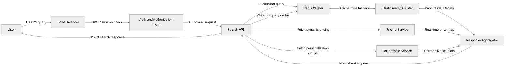

### Search request pipeline

1. The user enters a query like `nike running shoes red`.
2. The load balancer and auth layer validate identity, region, and experiment flags.
3. Search API normalizes spelling, locale, device context, and page/sort parameters.
4. Redis is checked for exact hot-query hits keyed by normalized query plus filter set.
5. If there is no cache hit, Elasticsearch executes the query against the product index.
6. Pricing service enriches product ids with current promotions, taxes, and region-specific price lists.
7. Profile or recommendation services optionally add personalization weights.
8. Aggregator returns ranked products, facets, pagination tokens, and sponsored placements.

### Product index design

| Field | Type | Why |
|---|---|---|
| `product_id` | keyword | Exact retrieval and joins to source catalog |
| `title` | text + keyword subfield | Full-text match plus exact boosts |
| `brand` | keyword | Facets and filter aggregation |
| `category_path` | keyword | Hierarchical browse + query filters |
| `description` | text | Recall for long-tail search terms |
| `attributes.color` | keyword | Structured filters |
| `attributes.size` | keyword | Variant filtering |
| `price_min` | scaled_float | Range queries and sorting |
| `inventory_status` | keyword | In-stock only filters |
| `popularity_score` | float | Behavioral ranking boost |
| `conversion_score` | float | Business relevance tuning |
| `embedding_vector` | dense_vector | Semantic reranking / ANN search |

### Example index mapping

```json
{
  "settings": {
    "analysis": {
      "analyzer": {
        "product_text": {
          "tokenizer": "standard",
          "filter": ["lowercase", "asciifolding", "product_synonyms"]
        },
        "autocomplete": {
          "tokenizer": "autocomplete_tokenizer",
          "filter": ["lowercase"]
        }
      },
      "tokenizer": {
        "autocomplete_tokenizer": {
          "type": "edge_ngram",
          "min_gram": 2,
          "max_gram": 15,
          "token_chars": ["letter", "digit"]
        }
      },
      "filter": {
        "product_synonyms": {
          "type": "synonym_graph",
          "synonyms": [
            "tv, television",
            "sneakers, shoes, trainers",
            "mobile, smartphone, phone"
          ]
        }
      }
    }
  },
  "mappings": {
    "properties": {
      "title": {
        "type": "text",
        "analyzer": "product_text",
        "fields": {
          "raw": {"type": "keyword"},
          "autocomplete": {"type": "text", "analyzer": "autocomplete", "search_analyzer": "standard"}
        }
      }
    }
  }
}
```

### Autocomplete design with edge-ngram

- Use a dedicated `autocomplete` analyzer rather than the full ranking analyzer.
- Build suggestions from title, brand, category names, and high-conversion query logs.
- Keep autocomplete responses under 50 ms by querying a lightweight index and caching top prefixes.
- Measure suggestion quality with CTR, query reformulation rate, and add-to-cart conversion.

### Faceted search

| Facet | Source | Notes |
|---|---|---|
| Brand | keyword aggregation | Often needs category-aware filtering so counts remain accurate. |
| Price range | numeric histogram / range agg | Compute against current region-currency price view. |
| Color | keyword aggregation | Watch high-cardinality values from marketplace sellers. |
| Size | keyword aggregation | Variant normalization is critical. |
| Availability | keyword filter | Prefer from search index, but refresh from inventory events. |
| Rating | numeric range | Backed by denormalized review summary fields. |

### Search ranking algorithm

A practical ecommerce ranking formula looks like this:

`final_score = lexical_relevance * w1 + popularity * w2 + margin_score * w3 + personalization * w4 + availability_boost * w5`

Typical behavior:

- **Lexical relevance** keeps the result set truthful to the query.
- **Popularity** boosts products with proven CTR and conversion.
- **Margin score** can slightly favor profitable products, but should never overwhelm relevance.
- **Personalization** uses affinity, brand preference, and price sensitivity.
- **Availability boost** demotes low-stock or backordered SKUs for impatient shopper flows.

### Redis search caching strategy

| Cache key | TTL | Invalidation trigger |
|---|---|---|
| Normalized search query + filters | 60–180 sec | Product update, inventory update, promo price change |
| Autocomplete prefix | 15–60 sec | Search analytics refresh, synonym change |
| Facet metadata | 5–15 min | Category schema change |
| Popular queries | 5–30 min | Traffic or merchandising refresh |

#### Cache invalidation rules

- Invalidate brand/category-specific keys when catalog updates land.
- Use event-driven busting from `product.updated`, `inventory.changed`, and `promotion.changed` topics.
- Keep small TTLs for fast-changing prices while allowing longer TTLs for static metadata.
- Guard against cache stampede with request coalescing and jittered expiry.

### Search failure modes

- **Elasticsearch node loss:** fall back to replica shards and temporarily reduce complex aggregations.
- **Redis outage:** bypass cache and accept slightly higher query latency.
- **Pricing service slowdown:** return search results with stale-but-safe price snapshot and mark them for refresh on PDP.
- **Hot query storm:** rate-limit expensive sorts and precompute top query results.

---

## 3. Order processing system

Checkout is the most correctness-sensitive flow. The system must preserve order integrity, stock accuracy, customer trust, and auditability while still performing quickly enough to avoid abandonment.

```mermaid
%%{init:{"theme":"neutral"}}%%
flowchart LR
    place_order[Order Placement]
    reserve_stock[Inventory Reservation<br/>Pessimistic Lock]
    process_payment[Payment Processing]
    confirm_order[Order Confirmation]
    warehouse_notify[Warehouse Notification]
    ship_order[Shipping]
    deliver_order[Delivery]
    track_sla[SLA Tracking]
    place_order -->|checkout submitted| reserve_stock
    reserve_stock -->|reservation success| process_payment
    process_payment -->|payment captured| confirm_order
    confirm_order -.->|order.confirmed event| warehouse_notify
    warehouse_notify -->|pick pack ship| ship_order
    ship_order -->|carrier updates| deliver_order
    deliver_order -->|milestone events| track_sla
```

### Order state machine

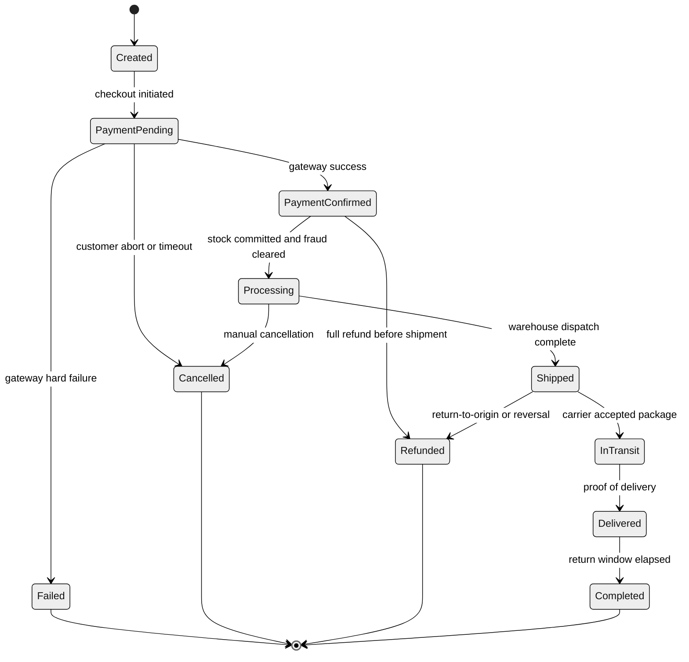

### Order write path

1. Web app calls checkout API with cart snapshot, shipping address, payment instrument token, and idempotency key.
2. Order service validates cart version and recomputes final payable amount using pricing service.
3. Inventory service creates a short-lived reservation for each SKU.
4. Order service inserts a pending order row and order items row set in a single transaction.
5. Payment service authorizes/captures payment against the order id and idempotency key.
6. If payment succeeds, order transitions to `PaymentConfirmed` and inventory is committed.
7. Order outbox publishes `order.confirmed` so notifications, warehouse, and analytics can proceed asynchronously.

### Saga pattern for distributed transaction

| Step | Service | Action | Compensation |
|---|---|---|---|
| 1 | Order | Create pending order | Mark order cancelled |
| 2 | Inventory | Reserve stock | Release reservation |
| 3 | Payment | Authorize/capture payment | Void auth or issue refund |
| 4 | Order | Confirm order | Mark failed/compensated |
| 5 | Warehouse | Create fulfillment task | Cancel pick request |
| 6 | Notification | Send confirmation | Send apology/update if rollback occurs |

#### Why saga instead of two-phase commit

- External systems like PSPs and warehouse systems do not participate cleanly in a single ACID transaction.
- The business prefers **reliable compensation** over trying to coordinate a fragile distributed lock across every dependency.
- Saga state is inspectable and matches how support teams reason about real customer incidents.

### Compensation flow when payment fails

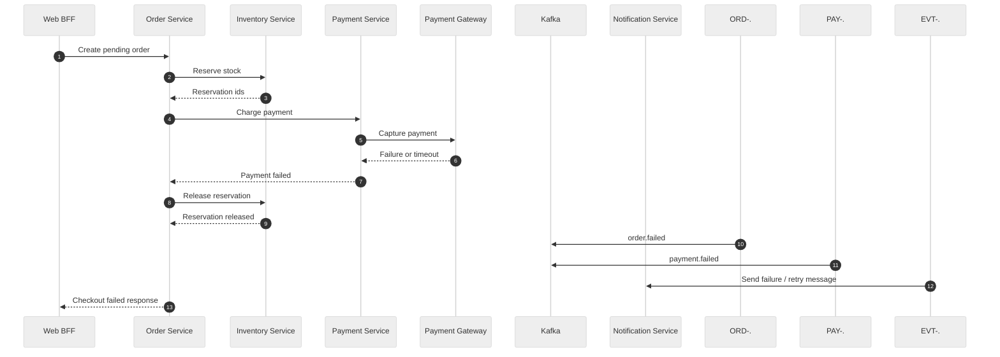

### Idempotency and payment retries

- Require an **idempotency key per checkout attempt** from web/mobile clients.
- Persist key → order/payment mapping for at least the PSP retry horizon.
- Distinguish **transport retry** from **customer retry** with a stable order id and a new payment attempt id.
- If the PSP is ambiguous after timeout, move the order into `PaymentPending` plus reconciliation rather than double-charging.

### Hot tables in the order database

| Table | Purpose |
|---|---|
| `orders` | Canonical order header, status, totals, fraud flags, audit timestamps |
| `order_items` | Line items, quantity, unit price, discounts, tax, warehouse assignment |
| `payments` | Payment intent, PSP txn ids, statuses, reconciliation results |
| `returns` | Return requests, refund amounts, disposition states |
| `order_outbox` | Event records waiting for Kafka publication |
| `shipment_events` | Carrier milestones and SLA checkpoints |

### Order service failure scenarios

- **Payment gateway timeout:** keep order pending and reconcile asynchronously.
- **Inventory race on last item:** fail reservation cleanly and offer alternatives.
- **Kafka publication lag:** use outbox polling so order confirmation never depends on broker synchronicity.
- **Warehouse API outage:** hold order in processing while retries and operator alerts fire.

---

## 4. Cart and wishlist architecture

Cart and wishlist patterns look simple on the surface but have surprisingly important implications for conversion, storage cost, and user experience continuity.

### Cart storage strategy

| User type | Primary store | TTL / retention | Why |
|---|---|---|---|
| Guest user | Redis | 7 days | Cheap, fast, and acceptable if some old carts expire naturally |
| Logged-in user | MySQL / PostgreSQL | Persistent | Supports cross-device recovery and account history |
| Recently merged cart | Redis + SQL | 24 hours shadow copy | Eases rollback and troubleshooting during login merges |

### Wishlist storage strategy

| Store | Why |
|---|---|
| MongoDB / document DB | Flexible product snapshots, tags, and user-organized lists |
| Redis cache | Fast retrieval for top lists, counters, and PDP badges |

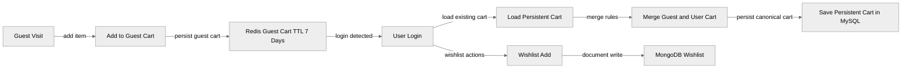

### Cart merge algorithm on login

1. Read guest cart from Redis and persistent cart from SQL.
2. Normalize product variants and remove invalid SKUs.
3. If the same SKU exists in both carts, apply deterministic quantity rules.
4. Re-run pricing and coupon eligibility.
5. Write merged cart to SQL and cache the merged view in Redis.
6. Emit `cart.merged` event for analytics and recommendation signals.

### Cart business rules

- Maximum quantity per SKU can be category-specific.
- Soft reservation can optionally begin on add-to-cart for ultra-scarce products.
- Cart coupons are validated on every checkout attempt, not only when first applied.
- Persistent carts should survive app reinstalls, browser changes, and multi-device use.

### Wishlist read model notes

- Store a small product snapshot so the wishlist page remains responsive even if catalog service is degraded.
- Refresh wishlist snapshots asynchronously on `product.updated` events.
- Precompute “wishlist count by product” for merchandising popularity metrics.

---

## 5. Inventory management

Inventory is where ecommerce systems either feel trustworthy or fail visibly. The design needs to prevent oversell without turning every browse and cart action into a slow distributed transaction.

### Inventory model

| Entity | Purpose |
|---|---|
| `stock_levels` | Available, reserved, damaged, inbound quantities per SKU and warehouse |
| `reservations` | Short-lived holds with TTL, order/cart reference, status |
| `warehouse_priority` | SLA, shipping zone, and cost ranking by destination |
| `replenishment` | Supplier lead times, reorder points, purchase order references |

### Reservation pattern

- **Soft reserve on add-to-cart** only for scarce or high-demand items where oversell risk is expensive.
- **Hard reserve on checkout** for all items in the order just before payment capture.
- If payment fails or times out, release reservations quickly via compensation events.

```mermaid
%%{init:{"theme":"neutral"}}%%
flowchart LR
    checkout_inv[Checkout Request]
    locate_inv[Nearest Warehouse Selection]
    lock_inv[Redis Distributed Lock]
    reserve_inv[Create Hard Reservation]
    payment_inv[Payment Result]
    commit_inv[Commit Stock Deduction]
    release_inv[Release Reservation]
    warehouse_sync[Warehouse Sync]
    checkout_inv -->|destination + sku list| locate_inv
    locate_inv -->|candidate warehouses| lock_inv
    lock_inv -->|lock acquired| reserve_inv
    reserve_inv -->|reservation id| payment_inv
    payment_inv -->|success| commit_inv
    payment_inv -->|failure| release_inv
    commit_inv -.->|inventory.changed| warehouse_sync
    release_inv -.->|inventory.released| warehouse_sync
```

### Multiple-warehouse selection logic

Scoring factors:

- Distance to destination / expected delivery SLA
- In-stock quantity and pick-pack workload
- Shipping cost
- Hazard, cold-chain, or oversized handling constraints
- Marketplace seller-owned inventory versus company-owned inventory

### Overselling prevention techniques

| Technique | Use case | Trade-off |
|---|---|---|
| SQL row lock | Checkout on critical SKUs | Strong correctness, lower throughput |
| Redis distributed lock | Cross-service coordination | Fast, but must handle expiry and lock loss correctly |
| Conditional update | NoSQL counters | High throughput, but harder analytics story |
| Reservation TTL | Flash sale control | Requires cleanup and clear UX |
| Queue-based serial processing | Ultra-scarce inventory | Predictable but increases latency |

### Warehouse synchronization

- Inventory service consumes WMS stock adjustments and shipment confirmations from Kafka.
- Warehouse systems publish `picked`, `packed`, `shipped`, `damaged`, and `returned_to_stock` events.
- Inventory projections in search are eventually consistent, but checkout uses the transactional source of truth.
- Daily reconciliation compares warehouse counts, order deductions, returns, and open reservations.

---

## 6. Recommendation engine

Recommendations combine offline learning, real-time stream features, and simple fallback heuristics so the storefront never renders an empty recommendation rail.

### Major recommendation strategies

| Strategy | Example use | Strength |
|---|---|---|
| Collaborative filtering | “Users who bought X also bought Y” | Learns cross-product behavior well |
| Content-based filtering | “Similar products” | Works even with sparse user history |
| Session-based rules | “Continue browsing” / “Related accessories” | Great for anonymous users |
| Popularity fallback | “Trending now” | Safe default under cold start |

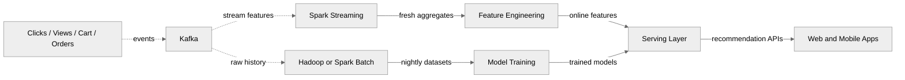

### Real-time recommendations via streaming

- Kafka captures page views, searches, cart updates, and purchases.
- Spark Streaming computes rolling co-visitation counts, cart affinity, and session recency features.
- Updated features are written into a low-latency store used by the recommendation API.
- This path supports “frequently bought together” and “customers also viewed” within minutes.

### Batch recommendations via Hadoop/Spark

- Nightly jobs compute matrix factorization, embeddings, or graph relationships from full history.
- Output is versioned so experiments can compare model generations cleanly.
- Batch models feed homepage and email personalization where ultra-low-latency freshness is less critical.

### Cold-start strategy

- New user: use geo, referral source, device class, and trending products.
- New product: use content attributes, category similarity, margin, and merchandising overrides.
- Empty history or low-confidence result: fall back to best sellers, campaigns, or manually curated collections.

### Recommendation API contract

| Endpoint | Purpose |
|---|---|
| `GET /recommendations/home` | Homepage personalized rails |
| `GET /recommendations/product/{id}` | Similar items and complementary items |
| `GET /recommendations/cart/{cartId}` | Cross-sell during cart and checkout |
| `POST /recommendations/feedback` | Impression / click / dismiss feedback |

---

## 7. Event streaming architecture

Kafka is the nervous system of the platform. It carries domain events, supports replay, decouples slow side effects, and feeds both operational consumers and analytics pipelines.

### Core topics

| Topic | Typical producers | Typical consumers |
|---|---|---|
| `order-events` | Order service | Inventory, notification, analytics, warehouse |
| `payment-events` | Payment service | Order, finance, notification, analytics |
| `inventory-events` | Inventory service | Order, warehouse, search indexer, analytics |
| `user-events` | User/auth service | Recommendation, notification, analytics |
| `notification-events` | Any service | Email worker, SMS worker, push worker |
| `search-index-events` | Catalog, back-office | Search indexer |
| `clickstream-events` | Web/mobile | Analytics, recommendation |

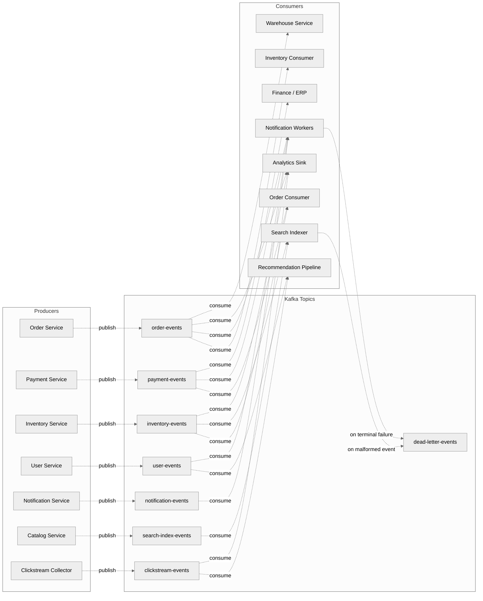

### CloudEvents-style event schema

```json
{
  "specversion": "1.0",
  "id": "evt-01J0ORDER123",
  "source": "order-service",
  "type": "order.confirmed",
  "subject": "order/ORD-102948",
  "time": "2026-01-10T08:15:30Z",
  "datacontenttype": "application/json",
  "traceparent": "00-4bf92f3577b34da6a3ce929d0e0e4736-00f067aa0ba902b7-01",
  "data": {
    "orderId": "ORD-102948",
    "userId": "USR-7731",
    "currency": "USD",
    "totalAmount": 249.99,
    "paymentStatus": "captured",
    "lineItems": [
      {"sku": "SKU-RED-42", "qty": 1}
    ]
  }
}
```

### Exactly-once processing, realistically

- Producers should be **idempotent** and use stable keys per business entity.
- Consumers should use **transactional offset commits** only when the sink supports it.
- In most business systems, “exactly once” is achieved through **idempotent consumers plus dedupe keys**, not magical absence of duplicates.
- Order, payment, and notification side effects all need independent dedupe logic.

### Dead-letter queue handling

| Failure type | Action |
|---|---|
| Deserialization failure | Move to DLQ immediately with schema version metadata |
| Downstream timeout | Retry with backoff, then DLQ after max attempts |
| Business validation failure | DLQ plus operator alert for correction |
| Poison event | Quarantine topic / DLQ and halt only the impacted consumer group |

### Replay strategy

- Rebuild search index from `search-index-events` plus catalog snapshots.
- Replay order or payment topics into a sandbox consumer group for incident analysis.
- Export older topics to object storage to keep hot Kafka retention reasonable.

---

## 8. Data pipeline and analytics

The platform uses a Lambda-style data architecture: a speed layer for real-time dashboards, a batch layer for historical truth, and a serving layer for BI and ML consumers.

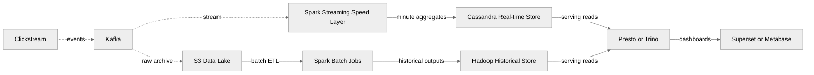

### Speed layer

- Supports near-real-time dashboards: search trends, active carts, checkout conversion, payment success rate.
- Writes denormalized aggregates to Cassandra for low-latency reads.
- Prefers simple append or increment patterns to avoid state explosion.

### Batch layer

- Stores raw immutable events in S3/object storage.
- Runs Spark batch jobs for cohort analysis, demand forecasting, basket analysis, and anomaly detection.
- Produces canonical historical datasets for finance, merchandising, and ML.

### Serving layer

- Presto/Trino queries both fresh Cassandra-derived aggregates and historical batch outputs.
- Dashboards in Superset/Metabase expose operational and business metrics.
- Data contracts are owned jointly by analytics engineering and service teams so KPI definitions do not drift.

### Analytics use cases

| Use case | Data path |
|---|---|
| Real-time campaign dashboard | Kafka → Spark Streaming → Cassandra → BI |
| Search no-result analysis | Kafka → S3 → Spark batch → BI |
| Recommendation training | Kafka/S3 → Spark/Hadoop → model store |
| Inventory anomaly detection | Inventory events → streaming aggregates → alerting |
| Supplier reorder forecast | Historical orders + stock → batch ML pipeline |

---

## 9. Pricing service

Pricing is not just “read a price column.” It is a composition engine that merges list price, customer segment, active promotions, taxes, shipping implications, and currency conversion into one quote.

```mermaid
%%{init:{"theme":"neutral"}}%%
flowchart LR
    req_price[Price Request]
    base_price[Base Price Lookup]
    promo_price[Coupon and Promotion Rules]
    tax_price[Tax Engine]
    currency_price[Currency Conversion]
    final_price[Final Price Response]
    req_price -->|sku + qty + region| base_price
    base_price -->|catalog price| promo_price
    promo_price -->|discounted subtotal| tax_price
    tax_price -->|taxed amount| currency_price
    currency_price -->|localized final amount| final_price
```

### Pricing calculation order

1. Resolve base price from price list or merchant-specific offer.
2. Apply catalog markdowns and campaign overrides.
3. Evaluate coupons, loyalty discounts, and stackability rules.
4. Compute taxes using ship-to region and product tax codes.
5. Convert currency for display or settlement if needed.
6. Return a breakdown so the cart and order services can show line-level explanation.

### Discount and coupon engine

| Rule type | Example |
|---|---|
| Percentage off | 10% off apparel over $100 |
| Buy X get Y | Buy two shirts, get one cap 50% off |
| Free shipping | Free delivery above $49 |
| Loyalty tier | Gold members get extra 5% |
| Bank offer | Specific card gets cashback |

### Dynamic pricing inputs

- Demand elasticity by SKU/category
- Competitor price feeds
- Inventory age and overstock risk
- Margin floor and MAP constraints
- Geo/marketplace channel strategy

### Pricing correctness rules

- The quote used for checkout must be versioned and referenced by order service.
- Promotion engines must be deterministic for the same input snapshot.
- Admin overrides should have clear audit history and time windows.

---

## 10. Notification service

Notifications should be asynchronous, preference-aware, and resilient to provider failures. They inform the customer without becoming part of the synchronous checkout critical path.

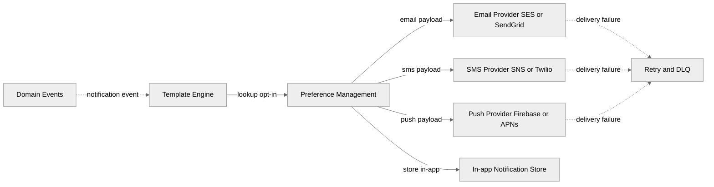

### Channel strategy

| Channel | Best for | Notes |
|---|---|---|
| Email | Order confirmation, shipment updates, receipts | Rich templates and legal archive value |
| SMS | OTP, urgent delivery changes | Expensive, but high attention |
| Push | Mobile app engagement | Great for app-installed cohort |
| In-app | Non-urgent alerts and message history | Cheap and persistent |

### Delivery pipeline details

- Templates are parameterized with locale, brand, and campaign data.
- Preference service enforces opt-in/opt-out and quiet hours.
- Provider responses are normalized into a common delivery event schema.
- Retries use exponential backoff; terminal failures go to DLQ plus reporting.

### User preference management

- Preferences are scoped by channel and notification category.
- Transactional messages may be mandatory while promotional messages remain opt-in.
- Admin tools need consent history for compliance investigations.

---

## 11. Cross-cutting consistency, resilience, and operability

### Outbox pattern

For order, payment, inventory, and catalog writes, store the business row change and the outbound event record in the same local transaction. A background publisher drains the outbox into Kafka. This avoids “DB commit succeeded but event publish failed” drift.

### Rate limiting and backpressure

- Apply gateway-level limits by user, IP, partner key, and route.
- Protect search and checkout from expensive bot traffic.
- Use bounded queues and consumer lag alarms for Kafka-driven workloads.
- Degrade gracefully: return cached recommendations, omit low-priority widgets, pause promotional sends.

### Observability model

| Signal | Examples |
|---|---|
| Latency | Search p95, checkout p95, price quote p95 |
| Errors | Payment failure rate, search timeout rate, notification DLQ growth |
| Saturation | CPU, JVM heap, DB connections, Kafka lag |
| Business KPIs | Add-to-cart rate, checkout conversion, refund rate, no-result search rate |

### Security notes

- Validate JWTs at the edge and again on sensitive service boundaries.
- Keep service-to-service auth explicit; avoid blindly trusting network location.
- Encrypt PII and payment-adjacent data at rest and in transit.
- Audit admin actions like price overrides, stock adjustments, and manual refunds.

### Why these patterns over simpler alternatives

| Choice | Why it wins here | Alternative downside |
|---|---|---|
| Kafka | Replay, partition scaling, many consumers | Simple queues lack durable replay semantics |
| Elasticsearch/OpenSearch | Full-text + facets + analyzers | RDBMS search becomes brittle at scale |
| Redis | Sub-ms cache and lock patterns | DB-only design cannot absorb browse/search burst well |
| Saga | Practical correctness across many systems | 2PC does not fit PSP and warehouse boundaries well |
| Cassandra for analytics | High write throughput and denormalized read patterns | RDBMS becomes expensive for clickstream-scale writes |
| Batch + stream analytics | Fresh dashboards plus historical truth | Stream-only or batch-only leaves a major gap |

### Final mental model

- **Search** is optimized for recall, ranking, and speed.
- **Checkout** is optimized for correctness and compensation.
- **Inventory** is optimized for trust and oversell prevention.
- **Recommendations** are optimized for learning loops and graceful fallback.
- **Kafka + analytics** turn operational events into business intelligence.
- **Pricing and notifications** translate core commerce events into customer-facing value.
