# 09 — Complete System Diagrams

> **📌 Disclaimer**: Any third-party logos, screenshots, or diagrams referenced in this document are used for educational purposes only. All trademarks belong to their respective owners.

> Enterprise ecommerce visual reference pack. Use this document when you need large, complete Mermaid diagrams that show the platform from the perspective of architecture review, incident response, scaling, security, or migration planning. Cross-reference the narrative guidance in [06-detailed-architecture-diagrams.md](./06-detailed-architecture-diagrams.md), the AWS mapping in [07-aws-reference-architecture.md](./07-aws-reference-architecture.md), and the internals in [08-system-design-deep-dive.md](./08-system-design-deep-dive.md).

## How to read the diagrams

- `-->` means synchronous request/response or direct dependency.
- `-.->` means asynchronous event, background processing, or eventually consistent propagation.
- `==>` means replication, mirrored state, or DR copy.

---

## Diagram 1 — Complete System Architecture (The Master Diagram)

This is the densest all-in-one view of the enterprise ecommerce platform. It shows customer entry points, edge controls, experience services, domain services, event streaming, databases, analytics, and operational tooling in one place.

Reference this diagram first when introducing the platform to new engineers, when preparing a review board, or when tracing dependencies during major incidents.

```mermaid
%%{init:{"theme":"neutral"}}%%
graph TB
    subgraph external[External Clients]
        user_web[Web Users]
        user_mobile[Mobile Users]
        partner_clients[Partner APIs]
        admin_users[Admin Users]
    end

    subgraph edge[Edge Layer]
        dns[Route 53]
        cdn[CloudFront CDN]
        waf[WAF]
        ddos[Shield]
        api_gw[API Gateway]
        public_lb[Public ALB]
        admin_lb[Admin ALB]
        rate_limiter[Rate Limiter]
    end

    subgraph frontend[Experience Layer]
        web_app[React Web App]
        mobile_bff[Mobile BFF]
        web_bff[Web BFF]
        admin_panel[Admin Panel]
        auth_gateway[JWT Validation Layer]
    end

    subgraph core[Core Services]
        user_svc[User Auth Service]
        product_svc[Product Catalog Service]
        search_svc[Search Service]
        cart_svc[Cart Service]
        wishlist_svc[Wishlist Service]
        order_svc[Order Service]
        payment_svc[Payment Service]
        inventory_svc[Inventory Service]
        pricing_svc[Pricing Service]
        recommendation_svc[Recommendation Service]
        notification_svc[Notification Service]
        warehouse_svc[Warehouse Service]
        sla_svc[SLA Service]
        purchase_order_svc[Purchase Order Service]
        interaction_svc[User Interaction Service]
    end

    subgraph eventing[Event Backbone]
        kafka_cluster[Kafka Cluster]
        schema_registry[Schema Registry]
        dlq[DLQ Topics]
        stream_workers[Stream Workers]
    end

    subgraph data[Polyglot Data Stores]
        postgres_users[PostgreSQL Users]
        postgres_orders[PostgreSQL Orders]
        postgres_payments[PostgreSQL Payments]
        postgres_inventory[PostgreSQL Inventory]
        mongodb_products[MongoDB Products]
        mongodb_wishlist[MongoDB Wishlists]
        mysql_carts[MySQL Persistent Carts]
        redis_cluster[Redis Cluster]
        elastic_cluster[Elasticsearch Cluster]
        cassandra_cluster[Cassandra Analytics]
        s3_lake[S3 Data Lake]
        encrypted_vault[Encrypted Payment Vault]
    end

    subgraph analytics[Analytics and ML]
        spark_stream[Spark Streaming]
        hadoop_batch[Hadoop Batch]
        feature_store[Feature Store]
        bi_dashboard[BI Dashboard]
        ml_training[ML Training]
    end

    subgraph ops[Infrastructure and Operations]
        prometheus[Prometheus]
        grafana[Grafana]
        efk[EFK Logging]
        jaeger[Jaeger]
        jenkins[Jenkins or GitHub Actions]
        argocd[ArgoCD]
    end

    user_web -->|DNS query| dns
    user_mobile -->|DNS query| dns
    partner_clients -->|API DNS| dns
    admin_users -->|Admin DNS| dns
    dns -->|Web traffic| cdn
    dns -->|API traffic| api_gw
    dns -->|Admin traffic| admin_lb
    cdn -->|HTTP inspect| waf
    waf -->|DDoS protected request| ddos
    ddos -->|HTTPS request| public_lb
    api_gw -->|Throttled APIs| rate_limiter
    rate_limiter -->|Authorized API calls| auth_gateway
    public_lb -->|Web routes| web_app
    public_lb -->|BFF routes| web_bff
    auth_gateway -->|Mobile APIs| mobile_bff
    admin_lb -->|Operator routes| admin_panel
    web_app -->|AJAX and SSR| web_bff
    mobile_bff -->|Identity calls| user_svc
    web_bff -->|Identity calls| user_svc
    web_bff -->|Catalog browse| product_svc
    web_bff -->|Search query| search_svc
    web_bff -->|Cart actions| cart_svc
    web_bff -->|Wishlist actions| wishlist_svc
    web_bff -->|Checkout| order_svc
    web_bff -->|Price quote| pricing_svc
    web_bff -->|Personalized rails| recommendation_svc
    web_bff -->|User events| interaction_svc
    admin_panel -->|Merchandising admin| product_svc
    admin_panel -->|Inventory admin| inventory_svc
    admin_panel -->|Supplier ops| purchase_order_svc
    order_svc -->|Reserve stock| inventory_svc
    order_svc -->|Capture funds| payment_svc
    order_svc -->|Fulfillment request| warehouse_svc
    order_svc -->|Delivery SLA lookup| sla_svc
    search_svc -->|Catalog source lookup| product_svc
    search_svc -->|Dynamic price enrich| pricing_svc
    search_svc -->|Session features| interaction_svc
    cart_svc -->|Price refresh| pricing_svc
    recommendation_svc -->|User affinity lookup| interaction_svc
    warehouse_svc -->|Replenishment signal| purchase_order_svc
    user_svc -->|User tables| postgres_users
    order_svc -->|Order tables| postgres_orders
    payment_svc -->|Transaction tables| postgres_payments
    payment_svc -->|Token store| encrypted_vault
    inventory_svc -->|Stock tables| postgres_inventory
    product_svc -->|Product docs| mongodb_products
    wishlist_svc -->|Wishlist docs| mongodb_wishlist
    cart_svc -->|Persistent carts| mysql_carts
    cart_svc -->|Guest carts and sessions| redis_cluster
    search_svc -->|Search index query| elastic_cluster
    recommendation_svc -->|Analytics features| cassandra_cluster
    interaction_svc -->|Behavior counters| redis_cluster
    interaction_svc -.->|clickstream| kafka_cluster
    order_svc -.->|order events| kafka_cluster
    payment_svc -.->|payment events| kafka_cluster
    inventory_svc -.->|inventory events| kafka_cluster
    user_svc -.->|user events| kafka_cluster
    notification_svc -.->|delivery events| kafka_cluster
    product_svc -.->|search index events| kafka_cluster
    kafka_cluster -.->|schema governance| schema_registry
    kafka_cluster -.->|stream processing| stream_workers
    stream_workers -.->|bad events| dlq
    kafka_cluster -.->|notify users| notification_svc
    kafka_cluster -.->|update search| search_svc
    kafka_cluster -.->|analytics sink| spark_stream
    kafka_cluster -.->|warehouse updates| warehouse_svc
    spark_stream -->|real-time aggregates| cassandra_cluster
    kafka_cluster -.->|raw event archive| s3_lake
    s3_lake -->|batch ETL| hadoop_batch
    hadoop_batch -->|training datasets| ml_training
    hadoop_batch -->|curated marts| bi_dashboard
    ml_training -->|fresh models| feature_store
    feature_store -->|online features| recommendation_svc
    prometheus -.->|metrics scrape| web_bff
    prometheus -.->|metrics scrape| order_svc
    prometheus -.->|metrics scrape| payment_svc
    grafana -->|dashboards| prometheus
    efk -.->|logs ingest| web_bff
    efk -.->|logs ingest| kafka_cluster
    jaeger -.->|traces ingest| web_bff
    jaeger -.->|traces ingest| order_svc
    jenkins -->|build and test| argocd
    argocd -->|deploy workloads| web_bff
    argocd -->|deploy workloads| order_svc
    argocd -->|deploy workloads| notification_svc
```

**Key takeaways**
- The architecture deliberately separates customer channels, domain services, event processing, and analytics so each layer can scale independently.
- Polyglot persistence is not incidental: each store exists because a specific access pattern dominates that domain.
- Kafka sits at the center of change propagation, while direct APIs remain reserved for low-latency customer flows.

---

## Diagram 2 — User Purchase Journey (Complete Sequence)

This sequence follows a full purchase from the first request through confirmation, event publication, and warehouse notification. It is the best reference when reasoning about latency, responsibility boundaries, or failure compensation points.

Use it in design reviews for checkout, incident retrospectives, or discussions about synchronous versus asynchronous work.

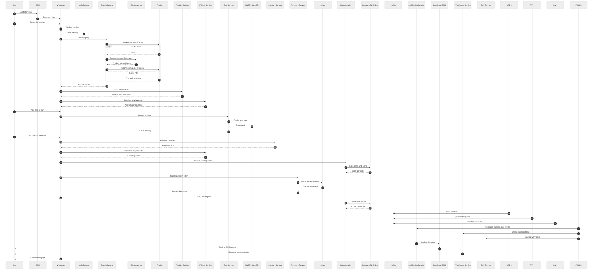

**Key takeaways**
- Customer-visible latency stops at order confirmation; notifications and fulfillment start asynchronously afterward.
- Search, pricing, cart, inventory, payment, and order each contribute a specialized step rather than one large monolith handling everything.
- Kafka decouples downstream reactions so checkout stays focused on correctness and speed.

---

## Diagram 3 — Event-Driven Architecture (All Event Flows)

This diagram isolates the event mesh and makes producers, topics, and consumers explicit. It is the best reference when designing new consumers, replaying incidents, or reasoning about eventual consistency.

Read it alongside the Kafka internals section in [08-system-design-deep-dive.md](./08-system-design-deep-dive.md).

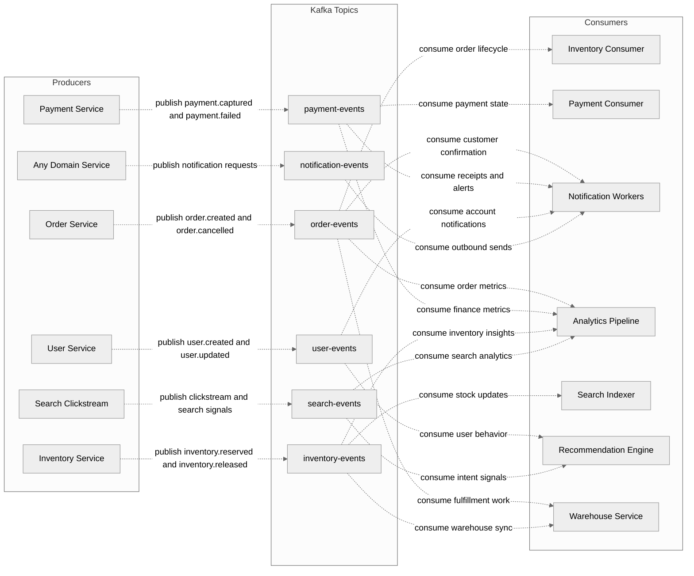

**Key takeaways**
- Producers own event facts; consumers own derived behavior.
- Search, recommendation, notification, and analytics become easier to evolve because they are downstream of the transaction path.
- Topic ownership and schema governance matter as much as broker availability.

---

## Diagram 4 — Database Architecture (Polyglot Persistence)

This view explains why different services write to different storage engines. It is most useful when discussing performance tuning, schema ownership, or data migration boundaries.

Use it whenever someone asks, “Why not just use one database for everything?”

```mermaid
%%{init:{"theme":"neutral"}}%%
graph TB
    user_service_db[User Service] -->|users addresses preferences| user_pg[PostgreSQL Users]
    order_service_db[Order Service] -->|orders order_items returns| order_pg[PostgreSQL Orders]
    payment_service_db[Payment Service] -->|transactions refunds| payment_pg[PostgreSQL Payments]
    payment_service_db -->|vault tokens| payment_vault[Encrypted Vault]
    catalog_service_db[Product Catalog] -->|products variants reviews| product_mongo[MongoDB Products]
    cart_service_db[Cart Service] -->|guest carts sessions| cart_redis[Redis Guest Carts]
    cart_service_db -->|persistent carts| cart_mysql[MySQL Persistent Carts]
    wishlist_service_db[Wishlist Service] -->|user_wishlists| wishlist_mongo[MongoDB Wishlists]
    inventory_service_db[Inventory Service] -->|warehouses stock_levels reservations| inventory_pg[PostgreSQL Inventory]
    search_service_db[Search Service] -->|title description tags facets| search_es[Elasticsearch product_index]
    recommendation_service_db[Recommendations] -->|user_interactions item_similarities| reco_cassandra[Cassandra Recommendations]
    analytics_service_db[Analytics] -->|clickstream aggregates| analytics_cassandra[Cassandra Analytics]
    analytics_service_db -->|raw immutable events| analytics_s3[S3 Data Lake]
    session_service_db[Sessions] -->|session:user_id metadata| session_redis[Redis Sessions]
```

**Key takeaways**
- Transactional domains stay relational, browse/search domains stay document or index oriented, and cache/state domains stay in-memory.
- Each service owns its schema and exposes data outward via APIs or events.
- Polyglot persistence is justified by access pattern diversity, not novelty.

---

## Diagram 5 — Infrastructure and DevOps Architecture

This diagram shows the delivery and runtime control plane from source code to cluster deployment, plus monitoring and tracing. It is the best reference for platform, DevOps, and SRE conversations.

Use it when explaining how releases move safely into production and how the platform is observed afterward.

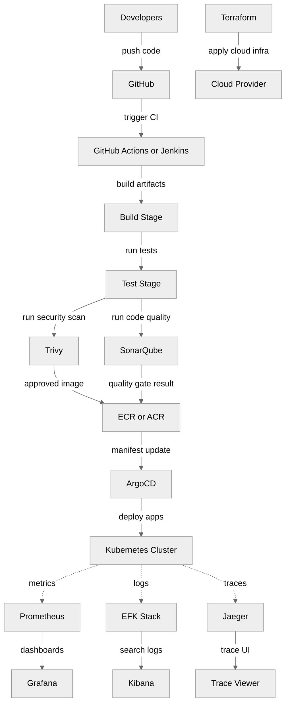

**Key takeaways**
- Delivery is automated end to end: code, tests, scans, registry, GitOps deploy.
- Terraform and GitOps divide responsibilities cleanly between infrastructure provisioning and workload rollout.
- Observability is first-class, not retrofitted after deployment.

---

## Diagram 6 — Scaling Architecture (How Each Layer Scales)

This diagram explains which knobs scale at the edge, app, data, and stream layers. It is useful during capacity planning, performance tests, or campaign readiness reviews.

Use it when you need to show how traffic growth changes each tier differently.

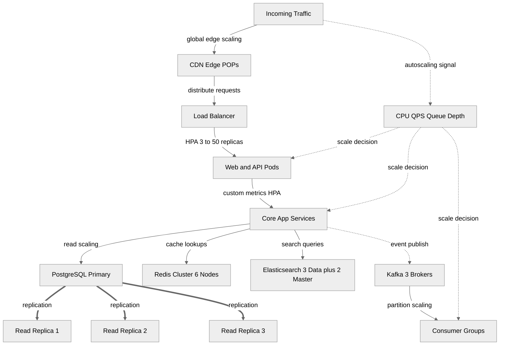

**Key takeaways**
- Stateless layers scale horizontally; stateful layers scale through replicas, partitions, shards, and careful capacity planning.
- Different metrics trigger scaling at different tiers: QPS for edge, queue lag for consumers, and connection pressure for databases.
- Read-heavy browse traffic is cheap only when CDN, Redis, and Elasticsearch absorb the majority of requests.

---

## Diagram 7 — Security Architecture (Zero Trust Model)

This diagram focuses on trust boundaries and control layering rather than business logic. It is best used during security reviews, compliance discussions, and threat modeling sessions.

Reference it when explaining why “inside the cluster” is not automatically a trusted zone.

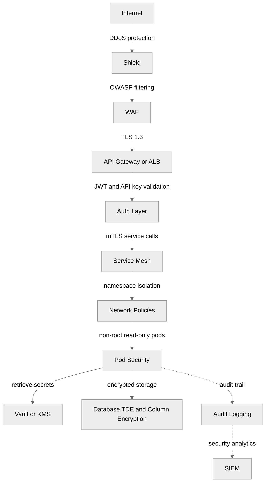

**Key takeaways**
- Zero trust is a chain: edge protection, identity verification, mutual TLS, policy isolation, secret management, and auditability.
- Sensitive data protection requires both storage encryption and careful runtime access control.
- Audit pipelines are part of the architecture, not just compliance paperwork.

---

## Diagram 8 — Disaster Recovery Architecture

This is the region-level resilience view for a primary/DR deployment. It shows what is fully active, what is replicated, and where failover decisions are made.

Use it when discussing RPO/RTO, tabletop exercises, or production readiness sign-off.

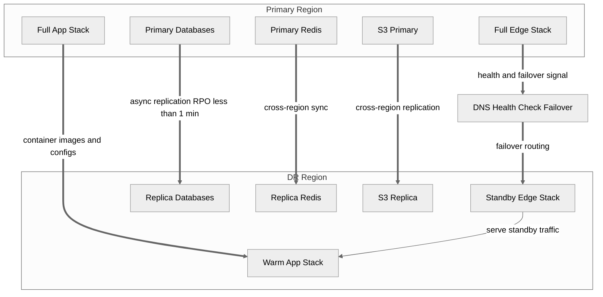

**Key takeaways**
- Not every tier needs the same DR posture; customer paths usually recover first, followed by back-office and analytics.
- Replication design should be explicit about acceptable data loss and recovery time, not just “multi-region” as a slogan.
- DNS health checks and runbooks matter as much as data replication.

---

## Diagram 9 — On-Prem to Cloud Migration (Architecture Evolution)

This diagram shows how the platform evolves through four recognizable stages rather than jumping directly from monolith to cloud-native. It helps stakeholders understand migration sequencing and organizational change.

Use it during roadmap planning, budgeting, or enterprise architecture review.

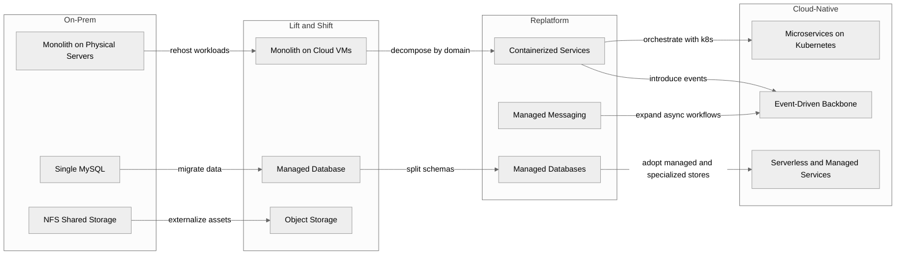

**Key takeaways**
- Migration is a sequence of capability unlocks, not a single rewrite event.
- Rehosting buys time; replatforming and decomposition deliver the long-term architecture gains.
- Data ownership and operational maturity usually become the hardest parts of the transition.

---

## Diagram 10 — Cost Architecture (Resource Allocation)

This final diagram pair shows where enterprise ecommerce spend usually concentrates and how architecture choices should change as traffic grows. It is useful during budget reviews and platform right-sizing conversations.

Use it when deciding whether the full enterprise stack is justified for current scale.

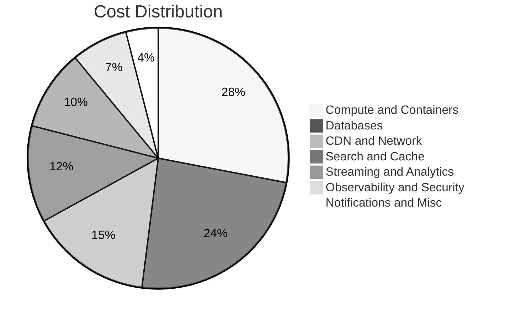

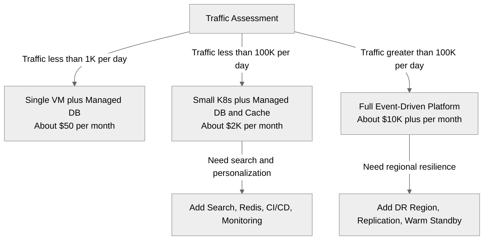

**Key takeaways**
- Architecture should match traffic, operational maturity, and business criticality rather than copying a hyperscale pattern too early.
- Databases, compute, and network egress usually dominate spend before “fancy” components do.
- The enterprise stack pays off when concurrency, integrations, and uptime expectations are all high.
