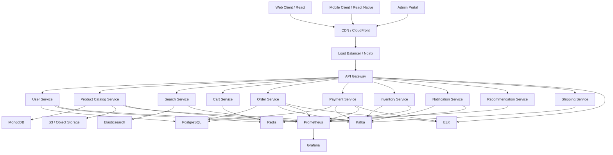
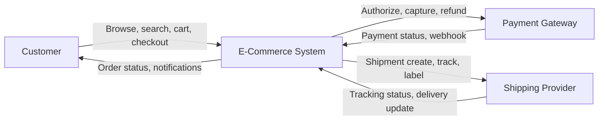
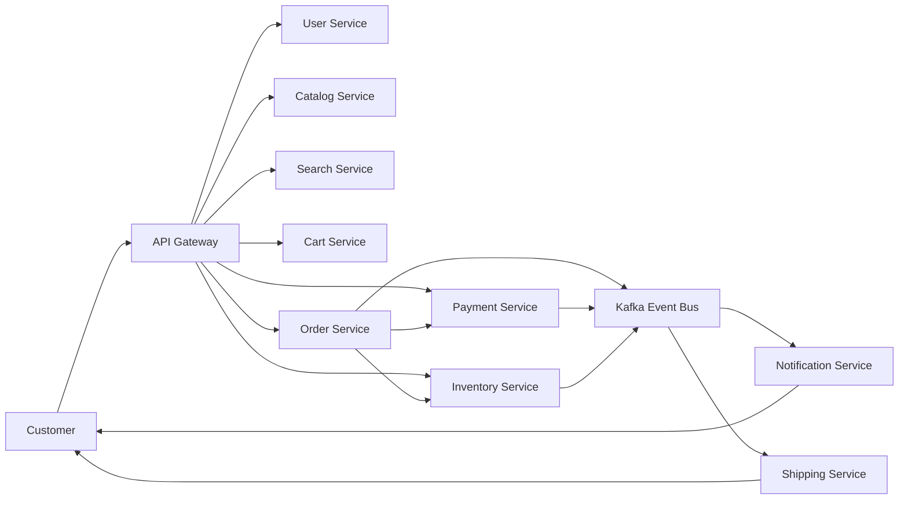
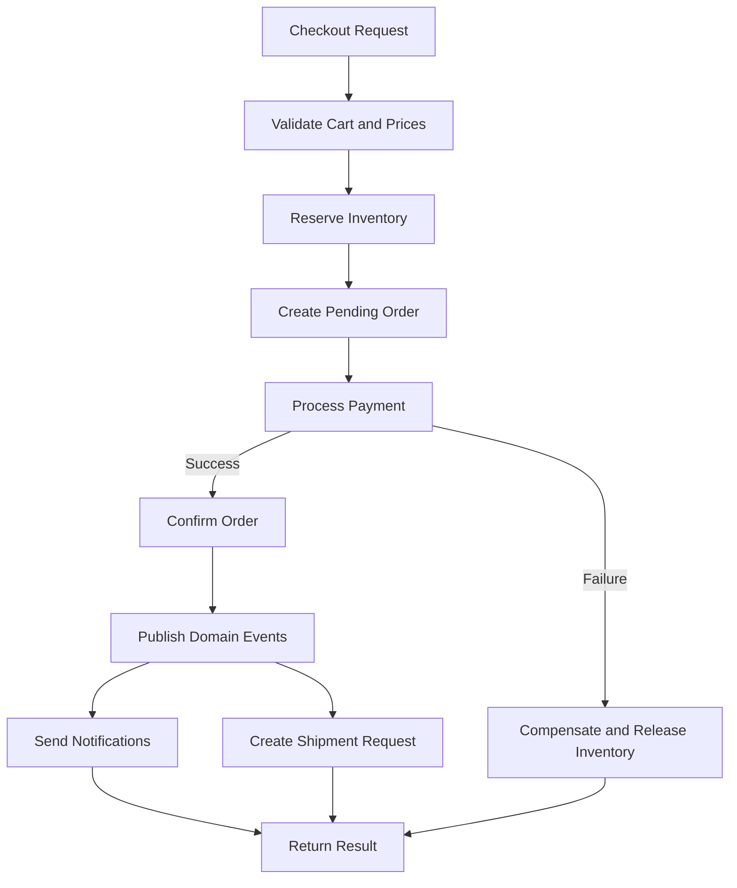
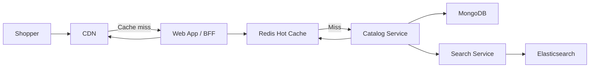
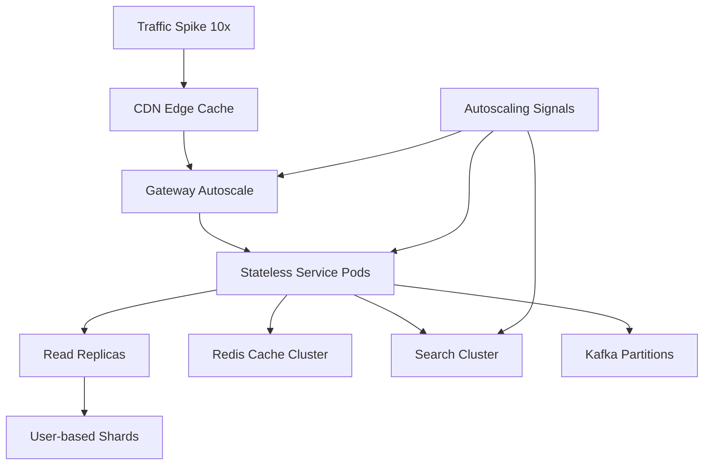

# 10 High-Level Design — E-Commerce Platform

> Architecture series continuation after [01 — System overview and design decisions](./01-system-overview-and-design-decisions.md), [02 — Kubernetes architecture](./02-kubernetes-architecture.md), [03 — Cloud infrastructure](./03-cloud-infrastructure.md), [04 — On-prem to cloud migration](./04-onprem-to-cloud-migration.md), [05 — Disaster recovery and high availability](./05-disaster-recovery-and-ha.md), [06 — Detailed architecture diagrams](./06-detailed-architecture-diagrams.md), [07 — AWS reference architecture](./07-aws-reference-architecture.md), [08 — System design deep dive](./08-system-design-deep-dive.md), and [09 — Complete system diagrams](./09-complete-system-diagrams.md).

This document explains how to describe an ecommerce platform at the **high-level design (HLD)** layer. It is intentionally written for architecture reviews, stakeholder alignment, and platform planning rather than for direct code implementation. The examples use an internet-scale storefront with web, mobile, admin, order processing, catalog management, payments, inventory, notifications, recommendations, and shipping integrations.

---

## Table of contents
- [What HLD means](#what-hld-means)
- [When to create HLD](#when-to-create-hld)
- [HLD deliverables](#hld-deliverables)
- [Requirements framing](#requirements-framing)
- [Capacity estimation assumptions](#capacity-estimation-assumptions)
- [Capacity estimation calculations](#capacity-estimation-calculations)
- [Component architecture](#component-architecture)
- [Subsystem responsibilities](#subsystem-responsibilities)
- [Data flow diagrams](#data-flow-diagrams)
- [Communication patterns](#communication-patterns)
- [Resiliency patterns](#resiliency-patterns)
- [Scalability strategy](#scalability-strategy)
- [Technology stack decision matrix](#technology-stack-decision-matrix)
- [Security and compliance posture](#security-and-compliance-posture)
- [Observability model](#observability-model)
- [Deployment topology](#deployment-topology)
- [Operational scenarios](#operational-scenarios)
- [Architecture checklist](#architecture-checklist)

---

## What HLD means
- High-level design is the architecture view that explains **what major building blocks exist, why they exist, and how they collaborate**.
- It abstracts away method names, entity constructors, and line-by-line implementation detail.
- It focuses on domains, boundaries, integrations, scale assumptions, platform choices, and system trade-offs.
- It is usually consumed by architects, senior engineers, delivery leads, infrastructure teams, security reviewers, SREs, and stakeholders who need to approve budgets or operating models.
- It is the bridge between product requirements and low-level design.
- It answers questions such as:
  - Which services are needed?
  - Which data stores are the best fit for each workload?
  - Which requests must stay synchronous?
  - Which operations should be event-driven?
  - Where do we terminate TLS, authenticate users, and apply rate limits?
  - How do we scale for peak sale events and protect core checkout paths during partial outages?
- In this architecture track, the HLD complements the broader platform narrative across files 01-09 and prepares the detailed implementation decisions in [11 — Low-Level Design](./11-low-level-design.md) and [12 — Checkout System Design](./12-checkout-system-design.md).

## When to create HLD
1. Before budget approval, so cloud, CDN, storage, and database costs are visible early.
2. Before team boundaries are finalized, so service ownership is not invented ad hoc during implementation.
3. Before integration with external parties such as payment gateways and shipping partners, because failure handling changes the platform shape.
4. Before non-functional requirements are locked, because latency, throughput, availability, and compliance targets influence technology choices.
5. Before large migrations, because HLD provides the target-state map used by migration waves.

## HLD deliverables
- A short problem statement that defines users, business goals, and scale assumptions.
- A bounded-context map showing major services and external systems.
- Capacity estimates for traffic, storage, bandwidth, and growth.
- A component architecture diagram that identifies client, edge, gateway, service, data, and event layers.
- Data flow diagrams that move from context-level view to subsystem view to detailed workflow view.
- Resiliency, scalability, security, and observability decisions with clear ownership.
- A technology decision matrix that explains why the chosen tools fit the workload better than alternatives.

## Requirements framing
### Functional requirements
- Users can browse and search 10 million catalog items from web and mobile clients.
- Customers can add products to cart, apply promotions, complete checkout, and track shipments.
- Admins can create products, update prices, manage inventory, and view order operations.
- The platform integrates with payment providers, shipping carriers, notification channels, and recommendation workflows.

### Non-functional requirements
- Support 1 million daily active users.
- Absorb 10x peak traffic during flash sales without rewriting the application model.
- Keep user-facing reads fast with aggressive caching and CDN offload.
- Protect payment and order accuracy with strong transactional guarantees for critical writes.
- Remain observable and resilient during dependency failures.

### Architectural constraints
- Prefer cloud-native managed services where operational overhead is not a differentiator.
- Keep business services stateless when possible so horizontal scaling remains simple.
- Use event-driven integration for side effects and downstream projections.
- Limit shared database coupling between domains.
- Preserve PCI-aware boundaries around payment flows.

## HLD process
### Step 1 — Gather requirements
- Objective: Turn product goals into traffic assumptions, critical user journeys, and failure budgets.
- Inputs: requirements, historical metrics, compliance constraints, organizational ownership model.
- Outputs: assumptions, decisions, open questions, and trade-offs recorded for the next design level.

### Step 2 — Estimate capacity
- Objective: Calculate requests per second, storage growth, bandwidth, cache footprint, and service replicas.
- Inputs: requirements, historical metrics, compliance constraints, organizational ownership model.
- Outputs: assumptions, decisions, open questions, and trade-offs recorded for the next design level.

### Step 3 — Identify high-level components
- Objective: Define client channels, edge services, gateways, bounded contexts, data stores, and external systems.
- Inputs: requirements, historical metrics, compliance constraints, organizational ownership model.
- Outputs: assumptions, decisions, open questions, and trade-offs recorded for the next design level.

### Step 4 — Map data flow
- Objective: Show how browse, cart, checkout, payment, fulfillment, and notification flows move through the platform.
- Inputs: requirements, historical metrics, compliance constraints, organizational ownership model.
- Outputs: assumptions, decisions, open questions, and trade-offs recorded for the next design level.

### Step 5 — Choose technologies
- Objective: Pick the minimum set of databases, queues, meshes, and observability tools needed to meet the workload.
- Inputs: requirements, historical metrics, compliance constraints, organizational ownership model.
- Outputs: assumptions, decisions, open questions, and trade-offs recorded for the next design level.

### Step 6 — Stress the design
- Objective: Add resiliency, scaling, recovery, rate limiting, and fallback mechanisms.
- Inputs: requirements, historical metrics, compliance constraints, organizational ownership model.
- Outputs: assumptions, decisions, open questions, and trade-offs recorded for the next design level.

### Step 7 — Review and iterate
- Objective: Validate the design with product, platform, security, operations, and finance stakeholders.
- Inputs: requirements, historical metrics, compliance constraints, organizational ownership model.
- Outputs: assumptions, decisions, open questions, and trade-offs recorded for the next design level.

## Capacity estimation assumptions
| Metric | Value |
|---|---|
| Daily active users | 1,000,000 |
| Peak multiplier | 10x above steady state |
| Orders per day | 100,000 |
| Read:write ratio | 100:1 |
| Catalog size | 10,000,000 items |
| Average catalog metadata per item | 5 KB |
| Average image footprint per item | 500 KB |
| Average order data size | 2 KB per order record |
| Peak read bandwidth target | 10 Gbps from edge/CDN |
| Architecture stance | Read-heavy, cache-friendly, event-driven ecommerce workload |

- A typical active user generates about 20 browse/search/detail/cart reads per day.
- The average checkout creates about one order plus associated payment, inventory, and event writes.
- Only a small portion of the catalog is hot at any time, so Redis is sized for the hot working set rather than the full catalog.
- Static images and JS bundles should be served predominantly from the CDN; origin egress should be a minority path.

## Capacity estimation calculations
### Traffic math
- Browse and search reads per day = 1,000,000 users × 20 reads = **20,000,000 reads/day**.
- Average read throughput = 20,000,000 ÷ 86,400 seconds ≈ **231 RPS**.
- Peak read throughput with 10x burst = **2,315 RPS**.
- Average order creation rate = 100,000 ÷ 86,400 ≈ **1.16 orders/second**.
- With a 100:1 read:write mix, average write throughput is about **2.3 RPS** and peak write throughput is **23 RPS**.
- Peak total request volume for the core platform is roughly **2,338 RPS** before internal fan-out.

### Storage math
- Product catalog metadata = 10,000,000 × 5 KB = **47.7 GB**, usually rounded to **50 GB raw** before indexes and replicas.
- Product images = 10,000,000 × 500 KB = **4.66 TB**, usually rounded to **5 TB raw object storage**.
- Orders per year = 100,000 × 365 × 2 KB ≈ **69.6 GB/year raw**, usually rounded to **73 GB/year** before indexes, replicas, and related payment/order-item records.
- PostgreSQL transactional footprint should budget at least 2.5x raw order data to cover indexes, order items, payment rows, refunds, and operational slack.
- MongoDB catalog footprint should budget around 1.3x raw metadata for indexes and schema overhead.
- Elasticsearch search storage commonly needs about 1.5x to 2x source document size depending on analyzers and replicas.
- Redis hot data can target the top 2% of catalog reads plus active sessions and carts rather than the full dataset.

### Server sizing
| Tier | Assumption | Estimated need at peak | Recommended production shape |
|---|---|---:|---|
| API gateway | One gateway node handles ~5,000 RPS with headroom | 1 | 3 nodes minimum across zones |
| Web/BFF and stateless APIs | One node/pod handles ~500 RPS at target CPU | 7 | 24-32 pods across autoscaling groups |
| Search cluster | One search node handles ~2500 query-heavy RPS | 1 | 5-6 nodes with one replica |
| Redis cache | One shard sized for hot keys, sessions, cart, and bursty reads | 3 | 3 primary + 3 replica nodes |
| Kafka brokers | Durable event backbone across zones | 3 | 3 brokers + schema registry + mirror/backup strategy |
| PostgreSQL | Write primary plus read scale-out | 4 | 1 primary + 3 read replicas |
| MongoDB catalog | Replica set for high read volume | 3 | 3-node replica set with autoscaled application cache |
| Observability | Metrics, logs, and tracing need separate ingestion tier | 3 | Dedicated monitoring cluster or managed services |

- If one stateless application server sustains about 500 RPS, the core platform needs roughly **7 server-equivalents** after adding 30% headroom.
- In practice, deploy more smaller pods than fewer large nodes so horizontal pod autoscaling reacts faster to flash-sale spikes.
- Separate customer-facing traffic from admin traffic with independent autoscaling policies and rate limits.
- If the CDN serves 10 Gbps peak and keeps an 80% cache hit ratio, origin services only absorb about **2.0 Gbps** from static content, which materially reduces web tier pressure.
- The CDN should be sized for multi-region edge delivery, image resizing variants, and cache purge propagation during promotions.

### Database and CDN sizing summary
| Concern | Raw size | Practical production budget | Notes |
|---|---:|---:|---|
| Catalog metadata in MongoDB | 50 GB | 70-100 GB | Includes indexes and one replica |
| Order and payment records in PostgreSQL (year 1) | 73 GB | 180-250 GB | Includes indexes, order items, and replicas |
| Search index in Elasticsearch | 50 GB source | 100-150 GB | Replica, faceting, analyzers, and denormalized fields |
| Redis hot set | N/A | 50-150 GB | Sessions, cart, popular products, price cache |
| Images in object storage | 5 TB | 5-7 TB | Allow for variants, thumbnails, and operational buffer |
| CDN edge throughput | 10 Gbps peak | 10-15 Gbps contracted | Plan burst, invalidation, and regional redundancy |

## Component architecture

### Client layer
- React web serves storefront browsing, account, cart, and checkout journeys.
- React Native mobile clients reuse API contracts but can cache locally and handle push notifications.
- Admin portal is segmented because back-office throughput, RBAC, and usage patterns differ from customer traffic.

### Edge layer
- CloudFront or equivalent CDN terminates most static delivery, image acceleration, and edge caching.
- Nginx or managed load balancers fan requests across gateway instances and can enforce WAF policies.

### Gateway layer
- API Gateway centralizes authentication handoff, token validation, routing, quotas, and request normalization.
- It also provides per-client policies so admin, mobile, and partner integrations can be throttled differently.

### Service layer
- Each service owns a bounded context and a data model.
- Order, payment, and inventory participate in the checkout-critical path.
- Notifications, recommendations, and analytics are downstream consumers that should not block the user flow.

### Data layer
- PostgreSQL stores transactional data requiring ACID guarantees.
- MongoDB serves flexible product catalog documents and rich merchandising attributes.
- Redis keeps session, cart, and hot-key data close to the application.
- Elasticsearch provides full-text and faceted search.
- S3 or equivalent object storage handles images and downloadable assets.

### Event and observability layer
- Kafka decouples order lifecycle events from secondary side effects.
- Prometheus, Grafana, and ELK expose metrics, dashboards, logs, and troubleshooting context.

## Subsystem responsibilities
### User Service
- Owns: Owns user profile, credentials, account status, MFA preferences, and address references.
- Primary data: PostgreSQL + Redis
- Hot path interactions: Registration, login, profile reads, token introspection.
- Architecture notes: JWT/OIDC, session validation, account lockout, password reset.
- Scaling lever: horizontally scale the service independently behind the gateway or service mesh.
- Failure stance: the platform should degrade this subsystem without losing transactional integrity in adjacent services.

### Product Catalog Service
- Owns: Owns product data, categories, brands, attributes, pricing snapshots, and image references.
- Primary data: MongoDB + S3
- Hot path interactions: Product detail pages, listing pages, merchandising rules.
- Architecture notes: Catalog changes emit search and recommendation refresh events.
- Scaling lever: horizontally scale the service independently behind the gateway or service mesh.
- Failure stance: the platform should degrade this subsystem without losing transactional integrity in adjacent services.

### Search Service
- Owns: Owns query parsing, autocomplete, ranking, facets, and search analytics.
- Primary data: Elasticsearch
- Hot path interactions: Search result queries, filters, sort, typo tolerance.
- Architecture notes: Consumes catalog updates and hot-trend analytics.
- Scaling lever: horizontally scale the service independently behind the gateway or service mesh.
- Failure stance: the platform should degrade this subsystem without losing transactional integrity in adjacent services.

### Cart Service
- Owns: Owns active cart state, cart item mutations, cart TTLs, and checkout preconditions.
- Primary data: Redis
- Hot path interactions: Add to cart, update quantity, view cart.
- Architecture notes: Uses short-latency reads and ephemeral persistence.
- Scaling lever: horizontally scale the service independently behind the gateway or service mesh.
- Failure stance: the platform should degrade this subsystem without losing transactional integrity in adjacent services.

### Order Service
- Owns: Owns order aggregate creation, status changes, totals, and post-checkout orchestration.
- Primary data: PostgreSQL
- Hot path interactions: Checkout, order history, order detail reads.
- Architecture notes: Publishes order events and drives saga steps.
- Scaling lever: horizontally scale the service independently behind the gateway or service mesh.
- Failure stance: the platform should degrade this subsystem without losing transactional integrity in adjacent services.

### Payment Service
- Owns: Owns payment intents, authorization, capture, refunds, and reconciliation metadata.
- Primary data: PostgreSQL
- Hot path interactions: Payment initiation, callbacks, refund flows.
- Architecture notes: Applies circuit breakers to external gateways.
- Scaling lever: horizontally scale the service independently behind the gateway or service mesh.
- Failure stance: the platform should degrade this subsystem without losing transactional integrity in adjacent services.

### Inventory Service
- Owns: Owns stock levels, reservations, warehouse availability, and release rules.
- Primary data: PostgreSQL or dedicated inventory store
- Hot path interactions: Reservation checks, stock deduction, restock flows.
- Architecture notes: Supports soft reserve, hard reserve, and committed stock states.
- Scaling lever: horizontally scale the service independently behind the gateway or service mesh.
- Failure stance: the platform should degrade this subsystem without losing transactional integrity in adjacent services.

### Notification Service
- Owns: Owns channel templates, send preferences, retries, and delivery status.
- Primary data: Kafka consumer + template store
- Hot path interactions: Email, SMS, push notifications.
- Architecture notes: Async by default so it never blocks checkout.
- Scaling lever: horizontally scale the service independently behind the gateway or service mesh.
- Failure stance: the platform should degrade this subsystem without losing transactional integrity in adjacent services.

### Recommendation Service
- Owns: Owns related product suggestions, collaborative filtering outputs, and personalization cache.
- Primary data: Redis + offline feature store
- Hot path interactions: Home page, PDP recommendations, cart upsell.
- Architecture notes: Can degrade gracefully without breaking order paths.
- Scaling lever: horizontally scale the service independently behind the gateway or service mesh.
- Failure stance: the platform should degrade this subsystem without losing transactional integrity in adjacent services.

### Shipping Service
- Owns: Owns carrier quote requests, shipment creation, tracking sync, and delivery ETA projection.
- Primary data: PostgreSQL + external carrier APIs
- Hot path interactions: Rate lookup, label generation, shipment tracking.
- Architecture notes: Mostly async after payment confirmation.
- Scaling lever: horizontally scale the service independently behind the gateway or service mesh.
- Failure stance: the platform should degrade this subsystem without losing transactional integrity in adjacent services.

## Data flow diagrams
### DFD Level 0 — System context

This level is intentionally simple. It answers who exchanges data with the platform without revealing internal complexity.

### DFD Level 1 — Subsystem decomposition

This level shows how customer requests enter through the gateway, how checkout coordinates inventory and payment, and how event consumers handle side effects.

### DFD Level 2 — Order processing detail

The most important detail at Level 2 is the compensation branch. The platform must never charge a customer and leave inventory locked indefinitely.

### Browse and cache flow

This browse flow highlights the read-heavy nature of ecommerce traffic and shows why caching and search projections matter so much to perceived speed.

### Scalability view

This diagram is useful during flash-sale planning because it makes clear that not every tier scales in the same way. Some tiers scale with replicas, others with shards or partitions.

## Communication patterns
| Interaction | Pattern | Why | Typical latency target | Failure handling |
|---|---|---|---|---|
| Cart read/update | Synchronous REST | The user expects immediate feedback for quantity changes. | <150 ms p95 | Retry once client-side for idempotent reads. |
| Checkout create order | Synchronous REST or gRPC hop chain | The customer must know whether the order was accepted. | <800 ms p95 | Timeout + compensation if downstream steps fail. |
| Payment gateway callback | Synchronous webhook | Gateway confirmation must reach the platform reliably. | <2 s end-to-end | Idempotency key and webhook retry signature validation. |
| Send email/SMS | Asynchronous Kafka event | Notification is not part of the critical path. | Seconds | Retry topic, DLQ, and provider fallback. |
| Analytics updates | Asynchronous Kafka event | Business reporting should never slow checkout. | Near real time | Replay from durable log. |
| Recommendation refresh | Asynchronous event + batch jobs | Personalization can lag slightly without harming correctness. | Minutes | Backfill/recompute pipeline. |
| Inventory sync from warehouse | Asynchronous event stream | Warehouse systems often operate independently and burst updates. | Seconds to minutes | Reconciliation jobs and alerting. |
| Service-to-service lookups requiring tight contract | gRPC or internal REST | Better typed contracts or standardization depending on team preference. | <100 ms network hop | Circuit breaker, timeout, fallback cache. |

### When to use synchronous communication
- Use synchronous calls when the user is waiting for a direct answer and the upstream caller cannot continue without the result.
- Examples: cart total recalculation, shipping rate preview, checkout submission, payment initiation token exchange.
- Keep payloads small, version contracts carefully, and set explicit timeouts per dependency.

### When to use asynchronous communication
- Use asynchronous messaging when the work is a side effect, fan-out, or projection rather than part of the user-visible commit path.
- Examples: order confirmation email, analytics counters, search index refresh, recommendation model updates, fraud review queues.
- Kafka is preferred here because events are durable, replayable, partitionable, and high throughput.

## Resiliency patterns
### Circuit breaker
- Where used: Applied around payment and shipping provider calls.
- Why it matters: Stops endless retries against an unhealthy dependency and preserves worker capacity.
- Implementation notes: expose metrics, set sensible thresholds, and test the failure mode during game days.

### Retry with exponential backoff
- Where used: Used for transient network failures, message delivery, and webhook callbacks.
- Why it matters: Improves success rate without creating synchronized retry storms.
- Implementation notes: expose metrics, set sensible thresholds, and test the failure mode during game days.

### Bulkhead isolation
- Where used: Separates thread pools, connection pools, and queues for critical services.
- Why it matters: Prevents a noisy or blocked dependency from taking down unrelated request classes.
- Implementation notes: expose metrics, set sensible thresholds, and test the failure mode during game days.

### Timeout policies
- Where used: Set short deadlines on user-facing internal hops.
- Why it matters: Protects p95 latency and limits resource exhaustion.
- Implementation notes: expose metrics, set sensible thresholds, and test the failure mode during game days.

### Fallback cache
- Where used: Return cached product details or last-known search results when catalog services are degraded.
- Why it matters: Preserves browsing even if freshness is slightly reduced.
- Implementation notes: expose metrics, set sensible thresholds, and test the failure mode during game days.

### Idempotency
- Where used: Used on checkout and payment requests.
- Why it matters: Prevents duplicate charges and duplicate order creation from retries or double-clicks.
- Implementation notes: expose metrics, set sensible thresholds, and test the failure mode during game days.

### Dead-letter queues
- Where used: Captures poison events after retry exhaustion.
- Why it matters: Keeps the event pipeline moving while preserving failed payloads for recovery.
- Implementation notes: expose metrics, set sensible thresholds, and test the failure mode during game days.

### Read-only mode
- Where used: Optional operating mode when write systems are impaired.
- Why it matters: Allows users to browse products even during partial transactional outages.
- Implementation notes: expose metrics, set sensible thresholds, and test the failure mode during game days.

## Scalability strategy
### Horizontal scaling
- Keep API services stateless so pods can be replicated behind the load balancer without sticky sessions.
- Autoscale on CPU, memory, in-flight requests, and queue lag instead of CPU alone for burst-sensitive services.
- Scale catalog, search, and cart independently because their usage profiles differ.

### Database scaling
- Use PostgreSQL primary/replica topology for read-heavy order history and account reads.
- Partition or shard transactional data by user_id or tenant boundary when single-cluster limits appear.
- Keep cross-shard transactions out of the hot path by aligning domain boundaries with ownership.

### Caching
- Use Redis for hot product summaries, session tokens, cart state, and price snapshots.
- Cache invalidation should be event-driven for product updates and TTL-driven for ephemeral state.
- Keep the hot set intentionally small and measure hit ratios per endpoint.

### CDN and object delivery
- Serve images, JS bundles, CSS, and downloadable assets through the CDN.
- Use multiple image derivatives and modern formats to reduce origin egress.
- Purge selectively by product or path, not by full distribution, during merchandising updates.

### Data pipeline scaling
- Increase Kafka partitions for order and payment topics as consumer groups multiply.
- Size consumer concurrency per downstream SLA and retry profile.
- Separate business-critical topics from analytical or recommendation topics.

## Technology stack decision matrix
| Component | Choice | Why | Alternatives |
|---|---|---|---|
| API Gateway | Kong | Rich plugin ecosystem, Kubernetes friendly, and strong auth/rate-limit support. | AWS API Gateway, Nginx |
| Service mesh | Istio | mTLS, traffic shaping, policy control, and observability hooks for microservices. | Linkerd |
| DB (transactional) | PostgreSQL | ACID, mature indexing, JSON support, and operational familiarity. | MySQL |
| DB (catalog) | MongoDB | Flexible product schema and high read performance for diverse attributes. | DynamoDB |
| Cache | Redis | Sub-millisecond latency, TTLs, and strong support for cart/session patterns. | Memcached |
| Search | Elasticsearch | Full-text, facets, ranking, and near-real-time indexing. | Algolia |
| Queue / event bus | Kafka | Durability, replay, throughput, partitioning, and consumer isolation. | RabbitMQ |
| Monitoring | Prometheus + Grafana | Kubernetes-native metrics and strong dashboarding without license lock-in. | Datadog |

### API Gateway
- Choice: **Kong**
- Why this wins here: Kong offers portable policy enforcement and avoids cloud lock-in for a multi-environment reference architecture.
- Alternatives considered: AWS API Gateway and Nginx remain strong alternatives when managed service preference or ultra-simple ingress is more important.

### Service mesh
- Choice: **Istio**
- Why this wins here: Istio is justified when the platform team needs mTLS, canary traffic shaping, retries, and policy without hand-coding each service.
- Alternatives considered: Linkerd is appealing when simplicity is valued more than feature depth.

### PostgreSQL
- Choice: **PostgreSQL**
- Why this wins here: Orders, users, and payments demand consistency and transactional semantics that fit PostgreSQL naturally.
- Alternatives considered: MySQL would also work, but JSONB and ecosystem comfort tilt the decision here.

### MongoDB
- Choice: **MongoDB**
- Why this wins here: Catalog data evolves frequently with seasonal attributes, making flexible documents valuable.
- Alternatives considered: DynamoDB becomes attractive if a fully managed cloud-specific design is preferred.

### Redis
- Choice: **Redis**
- Why this wins here: Cart, session, and hot-product caching benefit from TTLs and rich data structures.
- Alternatives considered: Memcached works for simple cache keys but lacks the same versatility.

### Elasticsearch
- Choice: **Elasticsearch**
- Why this wins here: Faceted search, typo tolerance, and ranking explainability are core ecommerce needs.
- Alternatives considered: Algolia simplifies operations but changes control and cost trade-offs.

### Kafka
- Choice: **Kafka**
- Why this wins here: Replayable event logs help analytics, notifications, and recovery workflows.
- Alternatives considered: RabbitMQ is simpler for queue patterns but less compelling for durable event streams.

### Prometheus + Grafana
- Choice: **Prometheus + Grafana**
- Why this wins here: These tools fit Kubernetes-native monitoring and give teams dashboard ownership.
- Alternatives considered: Datadog is attractive when managed observability and SaaS operations are preferred.

## Security and compliance posture
- Terminate TLS at the edge and re-encrypt service-to-service traffic through the mesh for zero-trust alignment.
- Centralize authentication and authorization policies at the gateway while still enforcing service-level authorization for sensitive APIs.
- Never store raw card data. Use tokenization and provider-hosted payment collection flows to reduce PCI scope.
- Encrypt data at rest for PostgreSQL, MongoDB, Redis, Kafka volumes, and object storage.
- Segment admin traffic, enforce MFA, and keep admin audit trails separate from customer activity logs.
- Use secrets management, short-lived credentials, and regular key rotation.

## Observability model
- **Metrics:** Request rate, latency, error rate, saturation, payment success, inventory reservation lag, Kafka consumer lag, cache hit ratio.
- **Logs:** Structured JSON logs with correlation IDs, order IDs, payment intent IDs, and user IDs where privacy policy allows.
- **Tracing:** Distributed tracing across gateway, order, payment, inventory, and notification hops.
- **Dashboards:** Separate views for business KPIs, platform health, and dependency status.
- **Alerts:** Page on checkout failure spikes, payment callback backlog, search cluster unavailability, and replica lag breaches.

## Deployment topology
- Deploy across at least three availability zones for gateway, stateless services, Kafka brokers, and databases where supported.
- Keep write-primary databases in one region with replicas in-region; add cross-region replicas for disaster recovery depending on RPO/RTO targets.
- Use blue-green or canary rollout patterns for gateway and customer-facing APIs.
- Package services as containers and use Kubernetes HPA/VPA and cluster autoscaler as the default elasticity controls.

## Operational scenarios
### Flash sale traffic surge
- CDN absorbs static traffic growth.
- Gateway and stateless APIs autoscale on request count.
- Search and Redis tiers scale ahead of the event.
- Rate limits protect admin and bot abuse vectors.

### Payment gateway degradation
- Circuit breaker opens after threshold breaches.
- Checkout shows graceful retry messaging.
- Orders remain pending only for a bounded timeout.
- Ops dashboard highlights provider health and failover mode.

### Catalog service partial outage
- Serve cached PDP summaries from Redis.
- Preserve search index reads if fresh catalog writes are delayed.
- Disable some merchandising widgets while core browsing remains online.

### Kafka backlog growth
- Add consumer capacity.
- Throttle non-critical consumers before core order-related consumers.
- Replay once downstream dependency stabilizes.

### Regional failure
- Fail traffic to secondary region for browse flows if enabled.
- Preserve durable backups and replication for transactional stores.
- Follow DR runbook from file 05 for full service recovery.

## Architecture checklist
- [x] Requirements are linked to scale numbers rather than vague traffic labels.
- [x] Each service has a clear owner and a clear data boundary.
- [x] Critical synchronous paths are short and explicit.
- [x] Async events are durable, replayable, and observable.
- [x] Failure modes for payment, inventory, search, and notification are documented.
- [x] Capacity estimates include growth, replicas, and operational headroom.
- [x] Security controls are visible at edge, service, and data layers.
- [x] This HLD can be handed to delivery teams as the input for LLD and implementation planning.

## Appendix — Service-by-service sizing and operating notes
### Appendix entry — User Service
1. User Service participates in the broader architecture described in files 01-06 and should inherit platform guardrails from those documents.
2. The main responsibility is: Owns user profile, credentials, account status, MFA preferences, and address references.
3. The primary persistence choice is: PostgreSQL + Redis
4. Hot-path usage centers on: Registration, login, profile reads, token introspection.
5. Important operating note: JWT/OIDC, session validation, account lockout, password reset.
6. SLO thought process: set availability and latency targets based on whether the service is checkout-critical or experience-enhancing.
7. Primary scaling trigger: request concurrency, queue lag, or storage pressure depending on workload type.
8. Preferred failure mode: fail fast for non-essential features and preserve correctness for transactional flows.
9. Observability focus: surface red metrics, dependency latency, saturation, and business counters.
10. Operational ownership: application team owns behavior, platform team owns runtime, and SREs own reliability posture.

### Appendix entry — Product Catalog Service
1. Product Catalog Service participates in the broader architecture described in files 01-06 and should inherit platform guardrails from those documents.
2. The main responsibility is: Owns product data, categories, brands, attributes, pricing snapshots, and image references.
3. The primary persistence choice is: MongoDB + S3
4. Hot-path usage centers on: Product detail pages, listing pages, merchandising rules.
5. Important operating note: Catalog changes emit search and recommendation refresh events.
6. SLO thought process: set availability and latency targets based on whether the service is checkout-critical or experience-enhancing.
7. Primary scaling trigger: request concurrency, queue lag, or storage pressure depending on workload type.
8. Preferred failure mode: fail fast for non-essential features and preserve correctness for transactional flows.
9. Observability focus: surface red metrics, dependency latency, saturation, and business counters.
10. Operational ownership: application team owns behavior, platform team owns runtime, and SREs own reliability posture.

### Appendix entry — Search Service
1. Search Service participates in the broader architecture described in files 01-06 and should inherit platform guardrails from those documents.
2. The main responsibility is: Owns query parsing, autocomplete, ranking, facets, and search analytics.
3. The primary persistence choice is: Elasticsearch
4. Hot-path usage centers on: Search result queries, filters, sort, typo tolerance.
5. Important operating note: Consumes catalog updates and hot-trend analytics.
6. SLO thought process: set availability and latency targets based on whether the service is checkout-critical or experience-enhancing.
7. Primary scaling trigger: request concurrency, queue lag, or storage pressure depending on workload type.
8. Preferred failure mode: fail fast for non-essential features and preserve correctness for transactional flows.
9. Observability focus: surface red metrics, dependency latency, saturation, and business counters.
10. Operational ownership: application team owns behavior, platform team owns runtime, and SREs own reliability posture.

### Appendix entry — Cart Service
1. Cart Service participates in the broader architecture described in files 01-06 and should inherit platform guardrails from those documents.
2. The main responsibility is: Owns active cart state, cart item mutations, cart TTLs, and checkout preconditions.
3. The primary persistence choice is: Redis
4. Hot-path usage centers on: Add to cart, update quantity, view cart.
5. Important operating note: Uses short-latency reads and ephemeral persistence.
6. SLO thought process: set availability and latency targets based on whether the service is checkout-critical or experience-enhancing.
7. Primary scaling trigger: request concurrency, queue lag, or storage pressure depending on workload type.
8. Preferred failure mode: fail fast for non-essential features and preserve correctness for transactional flows.
9. Observability focus: surface red metrics, dependency latency, saturation, and business counters.
10. Operational ownership: application team owns behavior, platform team owns runtime, and SREs own reliability posture.

### Appendix entry — Order Service
1. Order Service participates in the broader architecture described in files 01-06 and should inherit platform guardrails from those documents.
2. The main responsibility is: Owns order aggregate creation, status changes, totals, and post-checkout orchestration.
3. The primary persistence choice is: PostgreSQL
4. Hot-path usage centers on: Checkout, order history, order detail reads.
5. Important operating note: Publishes order events and drives saga steps.
6. SLO thought process: set availability and latency targets based on whether the service is checkout-critical or experience-enhancing.
7. Primary scaling trigger: request concurrency, queue lag, or storage pressure depending on workload type.
8. Preferred failure mode: fail fast for non-essential features and preserve correctness for transactional flows.
9. Observability focus: surface red metrics, dependency latency, saturation, and business counters.
10. Operational ownership: application team owns behavior, platform team owns runtime, and SREs own reliability posture.

### Appendix entry — Payment Service
1. Payment Service participates in the broader architecture described in files 01-06 and should inherit platform guardrails from those documents.
2. The main responsibility is: Owns payment intents, authorization, capture, refunds, and reconciliation metadata.
3. The primary persistence choice is: PostgreSQL
4. Hot-path usage centers on: Payment initiation, callbacks, refund flows.
5. Important operating note: Applies circuit breakers to external gateways.
6. SLO thought process: set availability and latency targets based on whether the service is checkout-critical or experience-enhancing.
7. Primary scaling trigger: request concurrency, queue lag, or storage pressure depending on workload type.
8. Preferred failure mode: fail fast for non-essential features and preserve correctness for transactional flows.
9. Observability focus: surface red metrics, dependency latency, saturation, and business counters.
10. Operational ownership: application team owns behavior, platform team owns runtime, and SREs own reliability posture.

### Appendix entry — Inventory Service
1. Inventory Service participates in the broader architecture described in files 01-06 and should inherit platform guardrails from those documents.
2. The main responsibility is: Owns stock levels, reservations, warehouse availability, and release rules.
3. The primary persistence choice is: PostgreSQL or dedicated inventory store
4. Hot-path usage centers on: Reservation checks, stock deduction, restock flows.
5. Important operating note: Supports soft reserve, hard reserve, and committed stock states.
6. SLO thought process: set availability and latency targets based on whether the service is checkout-critical or experience-enhancing.
7. Primary scaling trigger: request concurrency, queue lag, or storage pressure depending on workload type.
8. Preferred failure mode: fail fast for non-essential features and preserve correctness for transactional flows.
9. Observability focus: surface red metrics, dependency latency, saturation, and business counters.
10. Operational ownership: application team owns behavior, platform team owns runtime, and SREs own reliability posture.

### Appendix entry — Notification Service
1. Notification Service participates in the broader architecture described in files 01-06 and should inherit platform guardrails from those documents.
2. The main responsibility is: Owns channel templates, send preferences, retries, and delivery status.
3. The primary persistence choice is: Kafka consumer + template store
4. Hot-path usage centers on: Email, SMS, push notifications.
5. Important operating note: Async by default so it never blocks checkout.
6. SLO thought process: set availability and latency targets based on whether the service is checkout-critical or experience-enhancing.
7. Primary scaling trigger: request concurrency, queue lag, or storage pressure depending on workload type.
8. Preferred failure mode: fail fast for non-essential features and preserve correctness for transactional flows.
9. Observability focus: surface red metrics, dependency latency, saturation, and business counters.
10. Operational ownership: application team owns behavior, platform team owns runtime, and SREs own reliability posture.

### Appendix entry — Recommendation Service
1. Recommendation Service participates in the broader architecture described in files 01-06 and should inherit platform guardrails from those documents.
2. The main responsibility is: Owns related product suggestions, collaborative filtering outputs, and personalization cache.
3. The primary persistence choice is: Redis + offline feature store
4. Hot-path usage centers on: Home page, PDP recommendations, cart upsell.
5. Important operating note: Can degrade gracefully without breaking order paths.
6. SLO thought process: set availability and latency targets based on whether the service is checkout-critical or experience-enhancing.
7. Primary scaling trigger: request concurrency, queue lag, or storage pressure depending on workload type.
8. Preferred failure mode: fail fast for non-essential features and preserve correctness for transactional flows.
9. Observability focus: surface red metrics, dependency latency, saturation, and business counters.
10. Operational ownership: application team owns behavior, platform team owns runtime, and SREs own reliability posture.

### Appendix entry — Shipping Service
1. Shipping Service participates in the broader architecture described in files 01-06 and should inherit platform guardrails from those documents.
2. The main responsibility is: Owns carrier quote requests, shipment creation, tracking sync, and delivery ETA projection.
3. The primary persistence choice is: PostgreSQL + external carrier APIs
4. Hot-path usage centers on: Rate lookup, label generation, shipment tracking.
5. Important operating note: Mostly async after payment confirmation.
6. SLO thought process: set availability and latency targets based on whether the service is checkout-critical or experience-enhancing.
7. Primary scaling trigger: request concurrency, queue lag, or storage pressure depending on workload type.
8. Preferred failure mode: fail fast for non-essential features and preserve correctness for transactional flows.
9. Observability focus: surface red metrics, dependency latency, saturation, and business counters.
10. Operational ownership: application team owns behavior, platform team owns runtime, and SREs own reliability posture.

## Glossary
- **BFF:** Backend for Frontend tailored to a specific client channel.
- **CDN:** Content delivery network used to cache and serve static and media assets globally.
- **Read replica:** A database replica intended to scale read traffic away from the write primary.
- **Shard:** A horizontal partition of data, often grouped by customer or key range.
- **Circuit breaker:** A protection mechanism that stops calls to an unhealthy dependency.
- **Bulkhead:** Isolation strategy that keeps one overloaded dependency from consuming all shared resources.
- **DLQ:** Dead-letter queue or topic used to capture failed asynchronous messages.
- **Idempotency key:** A client-supplied or server-generated key that prevents duplicate processing of retries.
- **Event replay:** Re-consuming durable event logs to rebuild downstream state or recover from failures.
- **Hot set:** The subset of data frequently accessed enough to justify memory caching.
