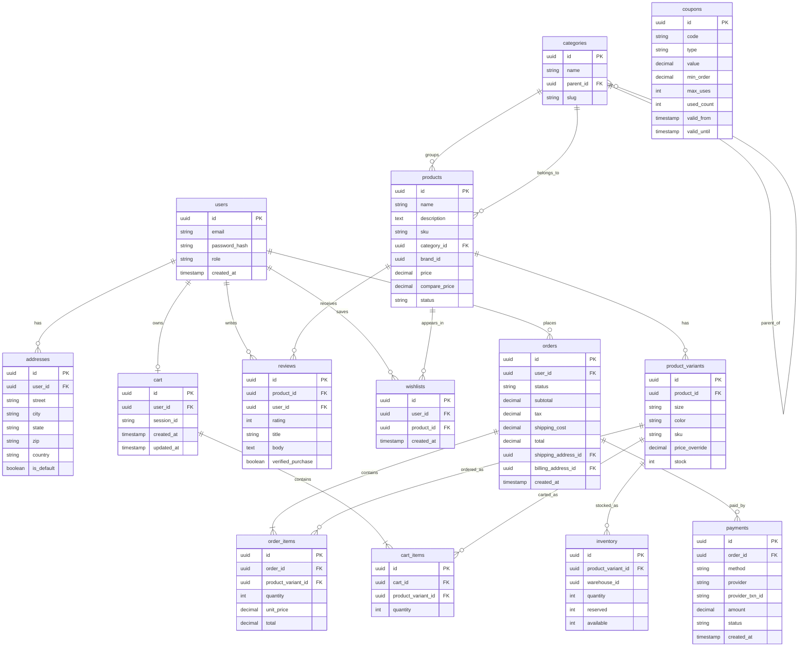
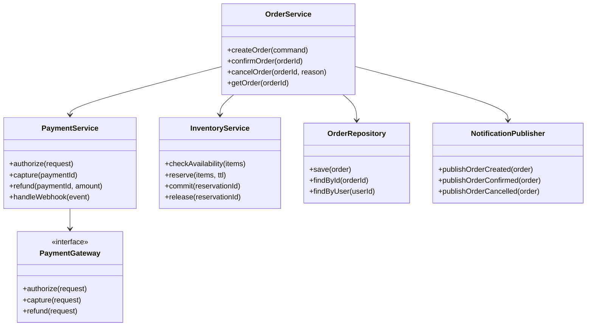
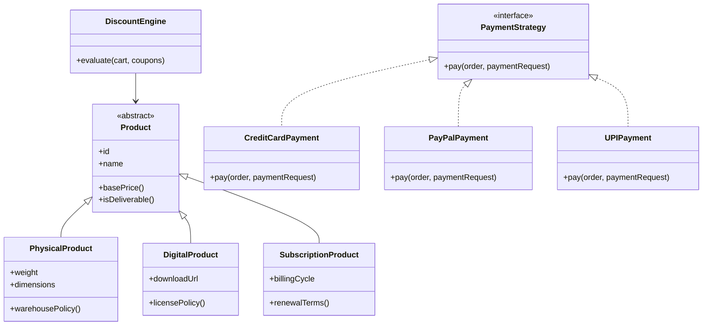
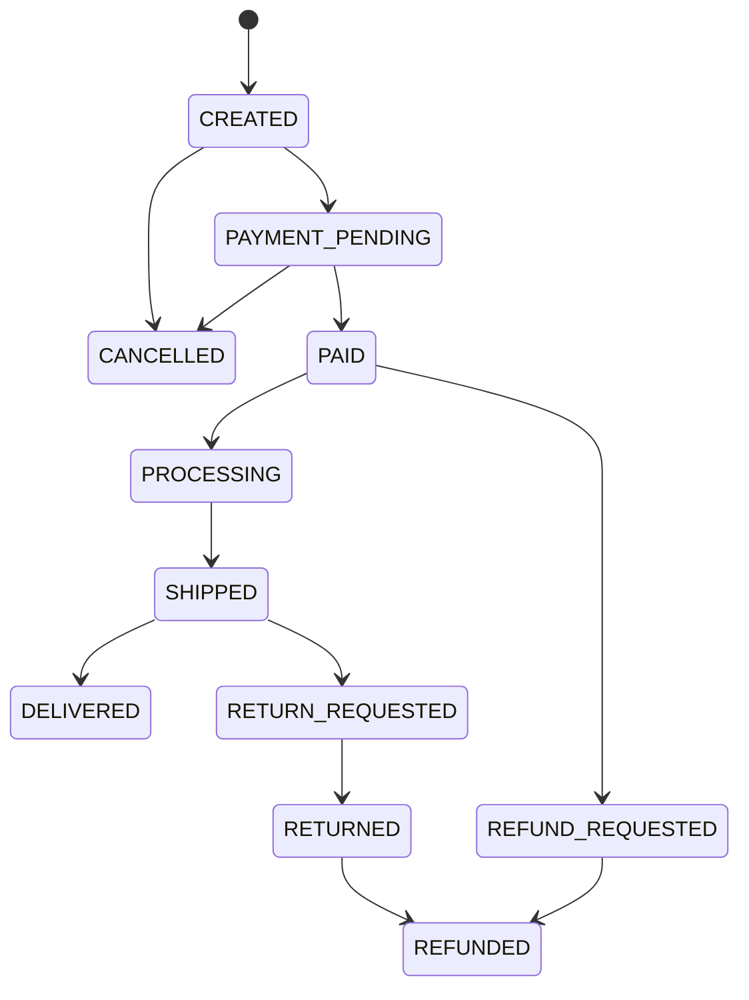
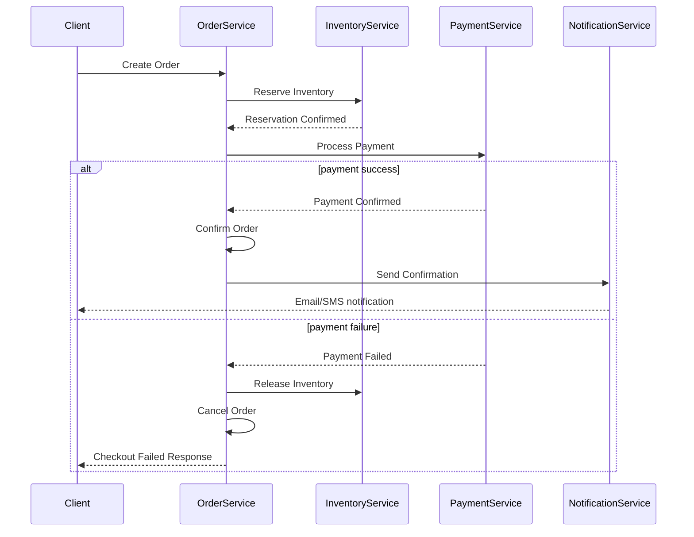
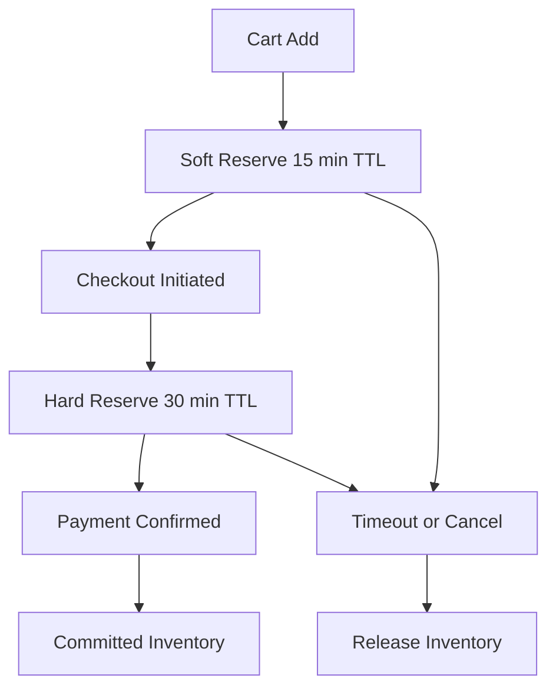

# 11 Low-Level Design — E-Commerce Platform

> This LLD maps the architecture direction from [10 — High-Level Design](./10-high-level-design.md) into classes, tables, APIs, state machines, and code-facing responsibilities. It also builds on the system map established across [01](./01-system-overview-and-design-decisions.md) through [09](./09-complete-system-diagrams.md).

This document is intended for developers and technical leads who need to turn the platform shape into implementable modules. It stays language-agnostic but concrete enough that Java, Kotlin, Node.js, Go, or Python teams could derive services from the same design.

---

## What is LLD
- Low-level design translates service boundaries into domain models, interfaces, repositories, workflows, and API contracts.
- Its main audience is developers, reviewers, and technical leads who need to implement and maintain the code.
- If HLD explains the city map, LLD explains the street layout, building structure, and traffic rules inside each district.
- A useful LLD should reduce ambiguity without overfitting to one framework.

## Design principles
### Single Responsibility Principle
- E-commerce example: OrderService only handles order lifecycle orchestration and does not directly implement payment gateway logic.
- Why it matters: This keeps changes in payment processing from forcing unrelated edits in order code.
- Code impact: interfaces stay stable while implementations remain replaceable.

### Open/Closed Principle
- E-commerce example: DiscountEngine accepts new discount strategies without changing existing checkout orchestration.
- Why it matters: New promotion types can be added by implementing a common contract.
- Code impact: interfaces stay stable while implementations remain replaceable.

### Liskov Substitution Principle
- E-commerce example: PremiumUser can stand in for User without breaking authorization or pricing logic.
- Why it matters: Subtype-specific perks should extend behavior, not violate core user expectations.
- Code impact: interfaces stay stable while implementations remain replaceable.

### Interface Segregation Principle
- E-commerce example: Use IPayable and IShippable rather than one giant IOrderOperations interface.
- Why it matters: Consumers implement only the capabilities they truly need.
- Code impact: interfaces stay stable while implementations remain replaceable.

### Dependency Inversion Principle
- E-commerce example: OrderService depends on IPaymentGateway, not on StripePayment directly.
- Why it matters: This enables provider swaps, mocking, and cleaner tests.
- Code impact: interfaces stay stable while implementations remain replaceable.

## Design patterns used
| Pattern | Where Used | Why |
|---|---|---|
| Strategy | Payment processing and discount calculation | Support multiple payment methods and discount types cleanly. |
| Observer | Order status changes trigger notifications and analytics | Decouple domain changes from side effects. |
| Factory | Product creation for physical, digital, and subscription products | Instantiate different product types behind one interface. |
| Saga | Checkout across order, inventory, and payment | Coordinate distributed transactions with compensations. |
| Repository | Data access layer for users, products, orders, and payments | Keep business logic independent from persistence details. |
| CQRS | Product read APIs vs admin write workflows | Optimize read and write models independently. |
| Circuit Breaker | Payment and shipping integrations | Prevent cascading failures from external dependencies. |

### Pattern deep dive — Strategy
- Where it appears: Payment processing and discount calculation
- Why it is used: Support multiple payment methods and discount types cleanly.
- Testing implication: validate both the happy path and the substitution/compensation path.

### Pattern deep dive — Observer
- Where it appears: Order status changes trigger notifications and analytics
- Why it is used: Decouple domain changes from side effects.
- Testing implication: validate both the happy path and the substitution/compensation path.

### Pattern deep dive — Factory
- Where it appears: Product creation for physical, digital, and subscription products
- Why it is used: Instantiate different product types behind one interface.
- Testing implication: validate both the happy path and the substitution/compensation path.

### Pattern deep dive — Saga
- Where it appears: Checkout across order, inventory, and payment
- Why it is used: Coordinate distributed transactions with compensations.
- Testing implication: validate both the happy path and the substitution/compensation path.

### Pattern deep dive — Repository
- Where it appears: Data access layer for users, products, orders, and payments
- Why it is used: Keep business logic independent from persistence details.
- Testing implication: validate both the happy path and the substitution/compensation path.

### Pattern deep dive — CQRS
- Where it appears: Product read APIs vs admin write workflows
- Why it is used: Optimize read and write models independently.
- Testing implication: validate both the happy path and the substitution/compensation path.

### Pattern deep dive — Circuit Breaker
- Where it appears: Payment and shipping integrations
- Why it is used: Prevent cascading failures from external dependencies.
- Testing implication: validate both the happy path and the substitution/compensation path.

## Domain modules
- **auth:** registration, login, token issuance, password reset, profile access.
- **catalog:** product CRUD, category tree, brand metadata, search projection publishing.
- **cart:** cart lifecycle, cart item mutations, price snapshots, reservation hints.
- **order:** checkout orchestration, order aggregate, order status transitions.
- **payment:** gateway adapters, payment intent lifecycle, refunds, reconciliation.
- **inventory:** stock read, reserve, commit, release, warehouse balancing.
- **notification:** email/SMS/push send orchestration, template rendering, retry handling.
- **shipping:** shipping option lookup, label creation, tracking sync.
- **promotion:** coupon validation, discount calculation, stackability rules.
- **review:** product reviews, verified purchase validation, moderation hooks.

## Database schema design


- **users:** Stores identity, credential hash, and role metadata. Email is unique and indexed.
- **addresses:** Keeps multiple shipping/billing addresses per user; one may be marked as default.
- **products:** Stores parent product metadata and default pricing.
- **product_variants:** Stores purchasable SKU-level detail such as size and color.
- **categories:** Models a hierarchical catalog tree through parent_id.
- **orders:** Represents the order aggregate root and financial totals.
- **order_items:** Stores line items so each product variant and quantity is preserved historically.
- **payments:** Stores payment attempts and provider references independently of order status.
- **cart:** Stores active shopping cart identity for user or session scope.
- **cart_items:** Stores current in-cart variants and quantities.
- **inventory:** Stores stock by variant and warehouse with reserved vs available quantities.
- **reviews:** Captures user product feedback and verified purchase indicator.
- **coupons:** Stores reusable promotion rules and validity windows.
- **wishlists:** Stores wishlisted products per user for future purchase intent.

### Suggested indexes
- `users(email)` unique index for authentication lookups.
- `products(category_id, status)` composite index for listing pages.
- `product_variants(product_id, sku)` unique/covering index for SKU fetches.
- `orders(user_id, created_at desc)` for account order history.
- `payments(order_id, status)` for payment resolution queries.
- `cart(user_id)` and `cart(session_id)` for anonymous-to-authenticated cart merge.
- `inventory(product_variant_id, warehouse_id)` for reservation lookups.
- `coupons(code)` unique index for coupon redemption checks.

## API design
### Products API
- Endpoint: `GET /products`
- Purpose: List products with pagination, filtering, and sorting.
- Rate limit: 200 requests/minute/IP
- Pagination/filtering/sorting: supported where relevant for list endpoints.
#### Example request
```json
{
  "page": 1,
  "pageSize": 20,
  "category": "shoes",
  "sort": "price_asc"
}
```

#### Example response
```json
{
  "items": [
    {
      "id": "prod_101",
      "name": "Trail Runner",
      "price": 79.99,
      "status": "ACTIVE"
    }
  ],
  "page": 1,
  "pageSize": 20,
  "total": 12540
}
```

#### Notes
- Supports category, brand, price range, rating, and availability filters.
- Sorting options include relevance, newest, price ascending, price descending, and top-rated.

### Product detail API
- Endpoint: `GET /products/:id`
- Purpose: Return product details, variants, images, and review summary.
- Rate limit: 300 requests/minute/IP
- Pagination/filtering/sorting: supported where relevant for list endpoints.
#### Example request
```json
{
  "path": "/products/prod_101"
}
```

#### Example response
```json
{
  "id": "prod_101",
  "name": "Trail Runner",
  "variants": [{"id": "var_1", "size": "9", "color": "Blue"}],
  "rating": 4.6
}
```

#### Notes
- Cacheable for short TTLs with ETags.
- Variant availability may come from a near-real-time inventory projection.

### Search API
- Endpoint: `GET /products/search?q=`
- Purpose: Full-text search with faceting and typo tolerance.
- Rate limit: 120 requests/minute/IP
- Pagination/filtering/sorting: supported where relevant for list endpoints.
#### Example request
```json
{
  "q": "running shoes",
  "page": 1,
  "filters": {"brand": ["Nike"], "price": {"lte": 100}}
}
```

#### Example response
```json
{
  "items": [{"id": "prod_101", "score": 0.98}],
  "facets": {"brand": [{"name": "Nike", "count": 124}]},
  "total": 3200
}
```

#### Notes
- Backed by Elasticsearch.
- Log popular terms for search analytics and recommendation signals.

### Cart read API
- Endpoint: `GET /cart`
- Purpose: Return current cart including computed totals and warnings.
- Rate limit: 180 requests/minute/user
- Pagination/filtering/sorting: supported where relevant for list endpoints.
#### Example request
```json
{
  "headers": {"Authorization": "Bearer <token>"}
}
```

#### Example response
```json
{
  "id": "cart_1",
  "items": [{"variantId": "var_1", "quantity": 2, "unitPrice": 79.99}],
  "subtotal": 159.98
}
```

#### Notes
- Supports authenticated carts and session carts.
- May include stale-price warnings before checkout.

### Cart add item API
- Endpoint: `POST /cart/items`
- Purpose: Add an item to the cart or increase quantity.
- Rate limit: 120 requests/minute/user
- Pagination/filtering/sorting: supported where relevant for list endpoints.
#### Example request
```json
{
  "productVariantId": "var_1",
  "quantity": 1
}
```

#### Example response
```json
{
  "cartItemId": "ci_1",
  "quantity": 1,
  "message": "Item added to cart"
}
```

#### Notes
- Validate stock hint, max quantity, and purchase restrictions.
- Generate soft reservation only if the business wants short-term hold behavior.

### Cart update API
- Endpoint: `PUT /cart/items/:id`
- Purpose: Change quantity of an existing cart item.
- Rate limit: 120 requests/minute/user
- Pagination/filtering/sorting: supported where relevant for list endpoints.
#### Example request
```json
{
  "quantity": 3
}
```

#### Example response
```json
{
  "cartItemId": "ci_1",
  "quantity": 3,
  "subtotal": 239.97
}
```

#### Notes
- Reject negative or zero quantity using validation rules.
- Trigger cart recalculation and price snapshot refresh.

### Cart delete API
- Endpoint: `DELETE /cart/items/:id`
- Purpose: Remove an item from the cart.
- Rate limit: 120 requests/minute/user
- Pagination/filtering/sorting: supported where relevant for list endpoints.
#### Example request
```json
{
  "path": "/cart/items/ci_1"
}
```

#### Example response
```json
{
  "message": "Item removed"
}
```

#### Notes
- If soft reserve is enabled, release the hold immediately.
- Audit removals only when useful for analytics, not for every noise event.

### Orders checkout API
- Endpoint: `POST /orders`
- Purpose: Create order from cart during checkout.
- Rate limit: 20 requests/minute/user
- Pagination/filtering/sorting: supported where relevant for list endpoints.
#### Example request
```json
{
  "cartId": "cart_1",
  "shippingAddressId": "addr_1",
  "billingAddressId": "addr_1",
  "paymentMethod": "CARD",
  "couponCodes": ["SAVE10"]
}
```

#### Example response
```json
{
  "orderId": "ord_1",
  "status": "PAYMENT_PENDING",
  "paymentIntentId": "pi_123"
}
```

#### Notes
- Uses idempotency key header to prevent duplicate orders.
- Runs validation, reservation, and payment-initiation workflow.

### Orders list API
- Endpoint: `GET /orders`
- Purpose: Return paginated order history for the user.
- Rate limit: 60 requests/minute/user
- Pagination/filtering/sorting: supported where relevant for list endpoints.
#### Example request
```json
{
  "page": 1,
  "pageSize": 10,
  "status": "DELIVERED"
}
```

#### Example response
```json
{
  "items": [{"id": "ord_1", "status": "DELIVERED", "total": 149.99}],
  "total": 18
}
```

#### Notes
- Sort by created_at descending by default.
- Support filters by status and date range.

### Order detail API
- Endpoint: `GET /orders/:id`
- Purpose: Return full order details including items and payment summary.
- Rate limit: 60 requests/minute/user
- Pagination/filtering/sorting: supported where relevant for list endpoints.
#### Example request
```json
{
  "path": "/orders/ord_1"
}
```

#### Example response
```json
{
  "id": "ord_1",
  "status": "SHIPPED",
  "items": [{"name": "Trail Runner", "quantity": 2}],
  "tracking": {"carrier": "UPS", "code": "1Z..."}
}
```

#### Notes
- Authorization must ensure only the owner or an admin can access the order.
- Partial fulfillment and refund summaries may appear when applicable.

### Payments process API
- Endpoint: `POST /payments`
- Purpose: Process or confirm a payment attempt.
- Rate limit: 30 requests/minute/user + tighter anti-abuse rules
- Pagination/filtering/sorting: supported where relevant for list endpoints.
#### Example request
```json
{
  "orderId": "ord_1",
  "method": "CARD",
  "paymentToken": "tok_abc"
}
```

#### Example response
```json
{
  "paymentId": "pay_1",
  "status": "AUTHORIZED",
  "provider": "stripe"
}
```

#### Notes
- Validate idempotency, fraud signals, and order total checksum.
- Never accept raw PAN storage fields.

### Payment detail API
- Endpoint: `GET /payments/:id`
- Purpose: Return payment attempt details.
- Rate limit: 60 requests/minute/user
- Pagination/filtering/sorting: supported where relevant for list endpoints.
#### Example request
```json
{
  "path": "/payments/pay_1"
}
```

#### Example response
```json
{
  "id": "pay_1",
  "status": "CAPTURED",
  "amount": 149.99,
  "providerTxnId": "ch_123"
}
```

#### Notes
- Used by order detail pages and support tooling.
- Mask provider details when exposing to customers.

### Register API
- Endpoint: `POST /auth/register`
- Purpose: Create a user account.
- Rate limit: 10 requests/minute/IP
- Pagination/filtering/sorting: supported where relevant for list endpoints.
#### Example request
```json
{
  "email": "user@example.com",
  "password": "StrongPassw0rd!",
  "name": "Alex"
}
```

#### Example response
```json
{
  "userId": "usr_1",
  "status": "ACTIVE"
}
```

#### Notes
- Apply CAPTCHA or anti-bot controls if abuse is suspected.
- Hash passwords using a strong adaptive function.

### Login API
- Endpoint: `POST /auth/login`
- Purpose: Authenticate user and issue access token.
- Rate limit: 10 requests/minute/IP with progressive lockout
- Pagination/filtering/sorting: supported where relevant for list endpoints.
#### Example request
```json
{
  "email": "user@example.com",
  "password": "StrongPassw0rd!"
}
```

#### Example response
```json
{
  "accessToken": "jwt",
  "refreshToken": "rft",
  "expiresIn": 3600
}
```

#### Notes
- Support MFA challenge flow when enabled.
- Track device and IP metadata for anomaly detection.

### User profile API
- Endpoint: `GET /users/me`
- Purpose: Return current authenticated user profile.
- Rate limit: 60 requests/minute/user
- Pagination/filtering/sorting: supported where relevant for list endpoints.
#### Example request
```json
{
  "headers": {"Authorization": "Bearer <token>"}
}
```

#### Example response
```json
{
  "id": "usr_1",
  "email": "user@example.com",
  "role": "CUSTOMER"
}
```

#### Notes
- Pull profile and address summary for checkout prefill.
- Cache briefly if token revocation rules permit.

## Class diagrams




## Order lifecycle state machine


The state machine should be enforced centrally inside the order aggregate or a dedicated transition policy object so invalid transitions cannot be performed through scattered service methods.

## Saga pattern for checkout


### Compensation rules
- If inventory reservation fails, the order remains unconfirmed and the client receives a stock error before payment starts.
- If payment fails after reservation succeeds, inventory is released and the order is cancelled or returned to retryable pending state.
- If notification fails, the order still remains confirmed because notification is a side effect, not a core transactional step.
- If the shipping request fails after payment confirmation, create a retriable fulfillment task rather than reversing the order automatically.

## Inventory reservation model


- Soft reserve is optional and should be limited to scarce inventory or high-demand events because it can reduce sell-through efficiency.
- Hard reserve begins once checkout is initiated and stronger payment intent exists.
- Committed inventory is reduced permanently after payment is confirmed.
- Expired or cancelled holds must be released by background sweeper jobs in addition to event-driven release logic.

## Repository interfaces
```text
interface UserRepository {
    User findByEmail(String email);
    User findById(UUID id);
    void save(User user);
}

interface ProductRepository {
    Product findById(UUID id);
    Page<Product> search(ProductQuery query);
    void save(Product product);
}

interface OrderRepository {
    Order findById(UUID id);
    Page<Order> findByUser(UUID userId, OrderFilter filter);
    void save(Order order);
}

interface InventoryRepository {
    InventoryRecord findByVariant(UUID variantId);
    void reserve(UUID variantId, int quantity, Duration ttl);
    void release(UUID variantId, int quantity);
    void commit(UUID variantId, int quantity);
}
```

Repositories hide SQL or document-store details and keep the domain layer focused on rules rather than persistence APIs.

## Validation rules
- **Registration:** email uniqueness, password strength, optional CAPTCHA, consent flags.
- **Cart item add:** positive quantity, variant exists, product active, quantity below max purchase limit.
- **Checkout:** cart belongs to caller, addresses valid, items still purchasable, totals recomputed server-side.
- **Payment confirm:** idempotency key present, order status eligible, amount matches order total, fraud checks within thresholds.
- **Coupon apply:** date valid, usage not exhausted, user eligible, cart minimum satisfied, product inclusion rules satisfied.
- **Review submit:** rating between 1 and 5, verified purchase rule if badge requested, profanity/moderation pipeline.

## Error model
```json
{
  "error": {
    "code": "CHECKOUT_STOCK_CHANGED",
    "message": "One or more items are no longer available in the requested quantity.",
    "correlationId": "corr_123",
    "details": {
      "variantId": "var_1",
      "available": 2,
      "requested": 5
    }
  }
}
```

- Use stable machine-readable error codes so clients can present appropriate UI actions.
- Always include a correlation ID for tracing across services.
- Avoid leaking internal provider or database details through public APIs.

## Additional implementation notes
### Module note — auth
- Responsibilities: registration, login, token issuance, password reset, profile access.
- Public contracts should be versioned semantically and backward compatibility should be preserved for external clients.
- Domain events should be explicit and named after business facts, not technical actions.
- Unit tests cover domain rules; integration tests cover repository and external adapter boundaries.

### Module note — catalog
- Responsibilities: product CRUD, category tree, brand metadata, search projection publishing.
- Public contracts should be versioned semantically and backward compatibility should be preserved for external clients.
- Domain events should be explicit and named after business facts, not technical actions.
- Unit tests cover domain rules; integration tests cover repository and external adapter boundaries.

### Module note — cart
- Responsibilities: cart lifecycle, cart item mutations, price snapshots, reservation hints.
- Public contracts should be versioned semantically and backward compatibility should be preserved for external clients.
- Domain events should be explicit and named after business facts, not technical actions.
- Unit tests cover domain rules; integration tests cover repository and external adapter boundaries.

### Module note — order
- Responsibilities: checkout orchestration, order aggregate, order status transitions.
- Public contracts should be versioned semantically and backward compatibility should be preserved for external clients.
- Domain events should be explicit and named after business facts, not technical actions.
- Unit tests cover domain rules; integration tests cover repository and external adapter boundaries.

### Module note — payment
- Responsibilities: gateway adapters, payment intent lifecycle, refunds, reconciliation.
- Public contracts should be versioned semantically and backward compatibility should be preserved for external clients.
- Domain events should be explicit and named after business facts, not technical actions.
- Unit tests cover domain rules; integration tests cover repository and external adapter boundaries.

### Module note — inventory
- Responsibilities: stock read, reserve, commit, release, warehouse balancing.
- Public contracts should be versioned semantically and backward compatibility should be preserved for external clients.
- Domain events should be explicit and named after business facts, not technical actions.
- Unit tests cover domain rules; integration tests cover repository and external adapter boundaries.

### Module note — notification
- Responsibilities: email/SMS/push send orchestration, template rendering, retry handling.
- Public contracts should be versioned semantically and backward compatibility should be preserved for external clients.
- Domain events should be explicit and named after business facts, not technical actions.
- Unit tests cover domain rules; integration tests cover repository and external adapter boundaries.

### Module note — shipping
- Responsibilities: shipping option lookup, label creation, tracking sync.
- Public contracts should be versioned semantically and backward compatibility should be preserved for external clients.
- Domain events should be explicit and named after business facts, not technical actions.
- Unit tests cover domain rules; integration tests cover repository and external adapter boundaries.

### Module note — promotion
- Responsibilities: coupon validation, discount calculation, stackability rules.
- Public contracts should be versioned semantically and backward compatibility should be preserved for external clients.
- Domain events should be explicit and named after business facts, not technical actions.
- Unit tests cover domain rules; integration tests cover repository and external adapter boundaries.

### Module note — review
- Responsibilities: product reviews, verified purchase validation, moderation hooks.
- Public contracts should be versioned semantically and backward compatibility should be preserved for external clients.
- Domain events should be explicit and named after business facts, not technical actions.
- Unit tests cover domain rules; integration tests cover repository and external adapter boundaries.

## Checklist for implementation readiness
- [x] Entities and aggregates are identified.
- [x] Repositories abstract persistence details.
- [x] Order transitions are protected by a state machine.
- [x] Checkout uses a saga instead of a distributed ACID transaction.
- [x] Inventory reservation semantics are explicit.
- [x] Public APIs have request/response examples, limits, and validation rules.
- [x] Failure codes and compensation rules are documented.

## Appendix — Endpoint quick reference
### Quick reference — GET /products
- Domain: Products API
- Purpose summary: List products with pagination, filtering, and sorting.
- Rate limit: 200 requests/minute/IP
- Auth posture: public, authenticated user, or admin depending on route classification.
- Idempotency expectation: required for mutating payment/order endpoints; optional elsewhere.
- Caching posture: apply only to safe read endpoints with explicit invalidation or TTL strategy.

### Quick reference — GET /products/:id
- Domain: Product detail API
- Purpose summary: Return product details, variants, images, and review summary.
- Rate limit: 300 requests/minute/IP
- Auth posture: public, authenticated user, or admin depending on route classification.
- Idempotency expectation: required for mutating payment/order endpoints; optional elsewhere.
- Caching posture: apply only to safe read endpoints with explicit invalidation or TTL strategy.

### Quick reference — GET /products/search?q=
- Domain: Search API
- Purpose summary: Full-text search with faceting and typo tolerance.
- Rate limit: 120 requests/minute/IP
- Auth posture: public, authenticated user, or admin depending on route classification.
- Idempotency expectation: required for mutating payment/order endpoints; optional elsewhere.
- Caching posture: apply only to safe read endpoints with explicit invalidation or TTL strategy.

### Quick reference — GET /cart
- Domain: Cart read API
- Purpose summary: Return current cart including computed totals and warnings.
- Rate limit: 180 requests/minute/user
- Auth posture: public, authenticated user, or admin depending on route classification.
- Idempotency expectation: required for mutating payment/order endpoints; optional elsewhere.
- Caching posture: apply only to safe read endpoints with explicit invalidation or TTL strategy.

### Quick reference — POST /cart/items
- Domain: Cart add item API
- Purpose summary: Add an item to the cart or increase quantity.
- Rate limit: 120 requests/minute/user
- Auth posture: public, authenticated user, or admin depending on route classification.
- Idempotency expectation: required for mutating payment/order endpoints; optional elsewhere.
- Caching posture: apply only to safe read endpoints with explicit invalidation or TTL strategy.

### Quick reference — PUT /cart/items/:id
- Domain: Cart update API
- Purpose summary: Change quantity of an existing cart item.
- Rate limit: 120 requests/minute/user
- Auth posture: public, authenticated user, or admin depending on route classification.
- Idempotency expectation: required for mutating payment/order endpoints; optional elsewhere.
- Caching posture: apply only to safe read endpoints with explicit invalidation or TTL strategy.

### Quick reference — DELETE /cart/items/:id
- Domain: Cart delete API
- Purpose summary: Remove an item from the cart.
- Rate limit: 120 requests/minute/user
- Auth posture: public, authenticated user, or admin depending on route classification.
- Idempotency expectation: required for mutating payment/order endpoints; optional elsewhere.
- Caching posture: apply only to safe read endpoints with explicit invalidation or TTL strategy.

### Quick reference — POST /orders
- Domain: Orders checkout API
- Purpose summary: Create order from cart during checkout.
- Rate limit: 20 requests/minute/user
- Auth posture: public, authenticated user, or admin depending on route classification.
- Idempotency expectation: required for mutating payment/order endpoints; optional elsewhere.
- Caching posture: apply only to safe read endpoints with explicit invalidation or TTL strategy.

### Quick reference — GET /orders
- Domain: Orders list API
- Purpose summary: Return paginated order history for the user.
- Rate limit: 60 requests/minute/user
- Auth posture: public, authenticated user, or admin depending on route classification.
- Idempotency expectation: required for mutating payment/order endpoints; optional elsewhere.
- Caching posture: apply only to safe read endpoints with explicit invalidation or TTL strategy.

### Quick reference — GET /orders/:id
- Domain: Order detail API
- Purpose summary: Return full order details including items and payment summary.
- Rate limit: 60 requests/minute/user
- Auth posture: public, authenticated user, or admin depending on route classification.
- Idempotency expectation: required for mutating payment/order endpoints; optional elsewhere.
- Caching posture: apply only to safe read endpoints with explicit invalidation or TTL strategy.

### Quick reference — POST /payments
- Domain: Payments process API
- Purpose summary: Process or confirm a payment attempt.
- Rate limit: 30 requests/minute/user + tighter anti-abuse rules
- Auth posture: public, authenticated user, or admin depending on route classification.
- Idempotency expectation: required for mutating payment/order endpoints; optional elsewhere.
- Caching posture: apply only to safe read endpoints with explicit invalidation or TTL strategy.

### Quick reference — GET /payments/:id
- Domain: Payment detail API
- Purpose summary: Return payment attempt details.
- Rate limit: 60 requests/minute/user
- Auth posture: public, authenticated user, or admin depending on route classification.
- Idempotency expectation: required for mutating payment/order endpoints; optional elsewhere.
- Caching posture: apply only to safe read endpoints with explicit invalidation or TTL strategy.

### Quick reference — POST /auth/register
- Domain: Register API
- Purpose summary: Create a user account.
- Rate limit: 10 requests/minute/IP
- Auth posture: public, authenticated user, or admin depending on route classification.
- Idempotency expectation: required for mutating payment/order endpoints; optional elsewhere.
- Caching posture: apply only to safe read endpoints with explicit invalidation or TTL strategy.

### Quick reference — POST /auth/login
- Domain: Login API
- Purpose summary: Authenticate user and issue access token.
- Rate limit: 10 requests/minute/IP with progressive lockout
- Auth posture: public, authenticated user, or admin depending on route classification.
- Idempotency expectation: required for mutating payment/order endpoints; optional elsewhere.
- Caching posture: apply only to safe read endpoints with explicit invalidation or TTL strategy.

### Quick reference — GET /users/me
- Domain: User profile API
- Purpose summary: Return current authenticated user profile.
- Rate limit: 60 requests/minute/user
- Auth posture: public, authenticated user, or admin depending on route classification.
- Idempotency expectation: required for mutating payment/order endpoints; optional elsewhere.
- Caching posture: apply only to safe read endpoints with explicit invalidation or TTL strategy.
