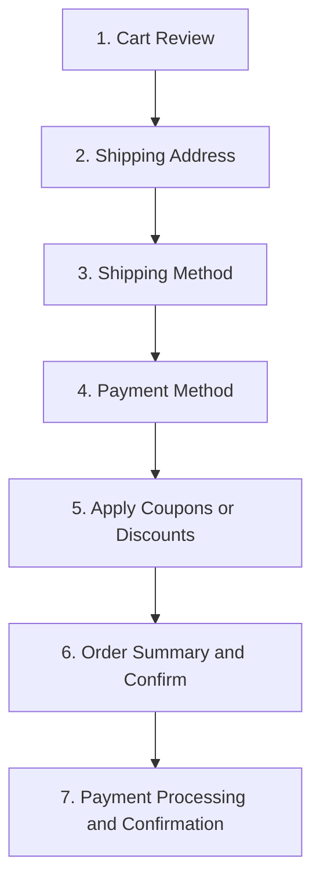
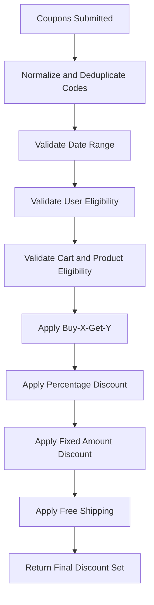
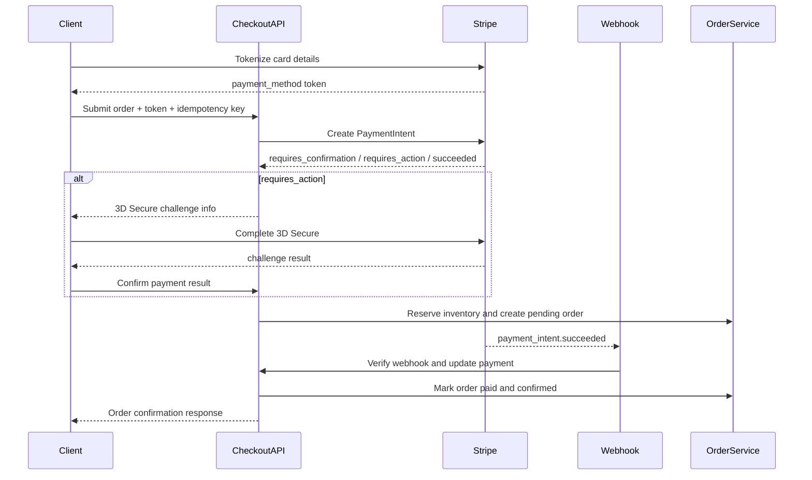
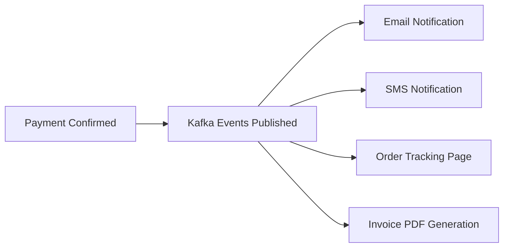
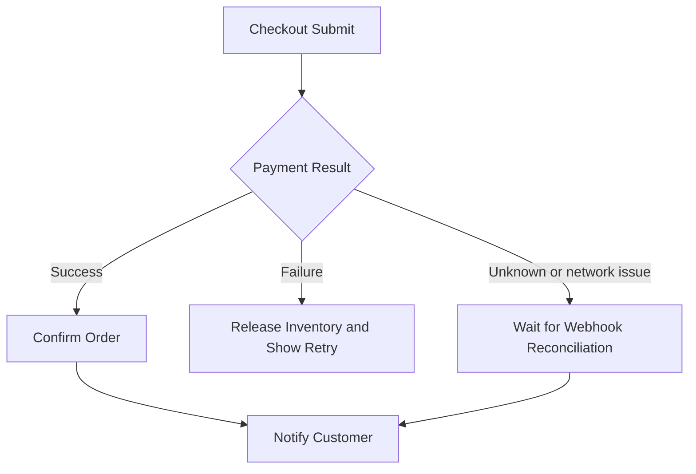
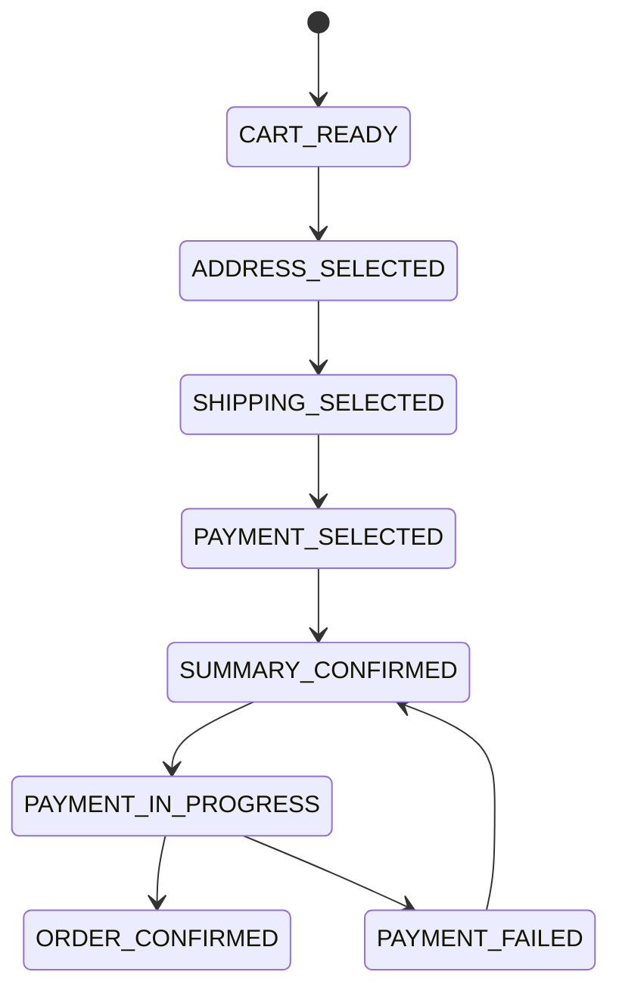
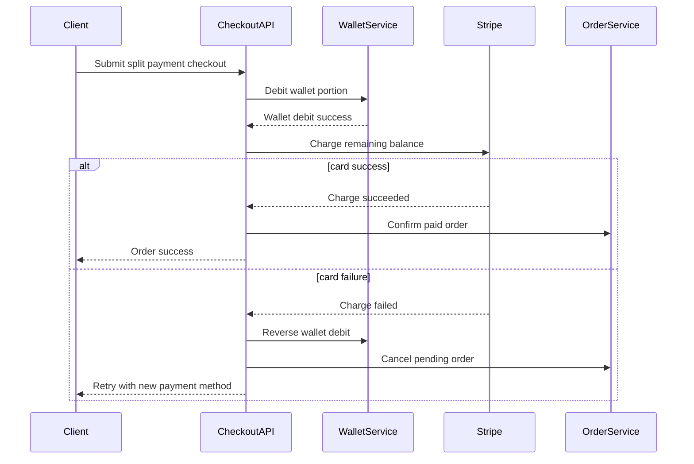
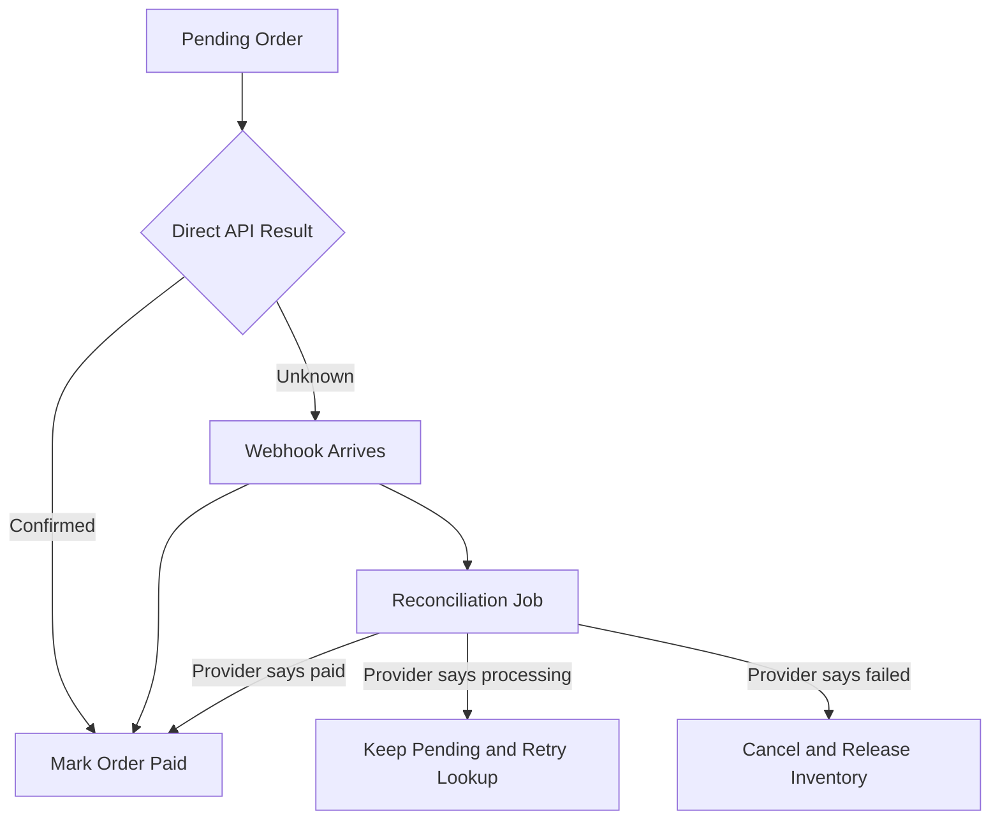

# 12 Checkout System Design — E-Commerce Platform

> This design zooms into the most business-critical workflow in the architecture series: checkout. It complements [10 — High-Level Design](./10-high-level-design.md), [11 — Low-Level Design](./11-low-level-design.md), and the platform context established across [01](./01-system-overview-and-design-decisions.md) through [09](./09-complete-system-diagrams.md).

Checkout is where cart correctness, pricing, discounts, payment, inventory, fraud checks, customer experience, and post-purchase operations all intersect. The design therefore prioritizes correctness first, then user experience, then downstream side effects.

---

## 7-step checkout flow


### Step 1 — Cart Review
- What happens: Validate item presence, quantity, and product status.
- Primary API calls: GET /cart
- Error handling focus: Surface stale-price warnings, remove unavailable items, and show delivery constraints.
- UX goal: keep the customer informed about what changed and what action is required next.

### Step 2 — Shipping Address
- What happens: Capture or select a shipping address and validate postal reachability.
- Primary API calls: GET /users/me + POST/PUT address endpoints
- Error handling focus: Reject unsupported regions and normalize address format.
- UX goal: keep the customer informed about what changed and what action is required next.

### Step 3 — Shipping Method
- What happens: Calculate available delivery methods for the chosen address and cart contents.
- Primary API calls: POST /shipping/options
- Error handling focus: Handle oversized, restricted, or digital-only carts by filtering methods.
- UX goal: keep the customer informed about what changed and what action is required next.

### Step 4 — Payment Method
- What happens: Collect payment choice and tokenize sensitive payment data.
- Primary API calls: POST /payments/intents or provider SDK calls
- Error handling focus: Handle unsupported methods by region, currency, or risk policy.
- UX goal: keep the customer informed about what changed and what action is required next.

### Step 5 — Apply Coupons/Discounts
- What happens: Validate coupon codes and compute all eligible promotions.
- Primary API calls: POST /checkout/discounts/validate
- Error handling focus: Show invalid, expired, or conflicting coupon errors immediately.
- UX goal: keep the customer informed about what changed and what action is required next.

### Step 6 — Order Summary & Confirm
- What happens: Recompute prices, tax, shipping, and discounts on the server and present final total.
- Primary API calls: POST /checkout/summary
- Error handling focus: Require re-confirmation if totals changed since cart review.
- UX goal: keep the customer informed about what changed and what action is required next.

### Step 7 — Payment Processing & Confirmation
- What happens: Create order, reserve stock, confirm payment, and return a final result.
- Primary API calls: POST /orders + payment provider confirm
- Error handling focus: Use idempotency keys and webhook recovery to survive retries or network failure.
- UX goal: keep the customer informed about what changed and what action is required next.

## Cart to order transformation
- The cart is not the source of truth for final pricing; the server must recalculate everything during checkout.
- Product prices are revalidated so stale client-side cart totals cannot be submitted blindly.
- Inventory is rechecked at SKU level to prevent overselling.
- Tax is recalculated based on the shipping destination and product taxability rules.
- Shipping cost is recomputed from method, package weight, dimensions, destination, and seller/warehouse constraints.
- Discount rules are applied in a deterministic order so totals remain auditable.

```mermaid
flowchart LR
    Cart[Cart Snapshot]
    PriceCheck[Price Validation]
    StockCheck[Stock Validation]
    TaxCalc[Tax Calculation]
    ShipCalc[Shipping Calculation]
    DiscountCalc[Discount Engine]
    Summary[Checkout Summary]
    Order[Order Aggregate]

    Cart --> PriceCheck
    PriceCheck --> StockCheck
    StockCheck --> TaxCalc
    TaxCalc --> ShipCalc
    ShipCalc --> DiscountCalc
    DiscountCalc --> Summary
    Summary --> Order
```



- **Price validation:** Lookup current product and variant prices from authoritative pricing storage or cache with fallback to source of truth.
- **Stock validation:** Check sellable quantity after subtracting hard reservations and safety stock.
- **Tax calculation:** Use shipping address, destination rules, and product tax categories.
- **Shipping cost calculation:** Use carrier/method matrix, destination zone, package weight, and dimensional thresholds.
- **Discount engine:** Apply stackability, priority, and eligibility rules before final total is locked.
- **Order creation:** Persist a pending order snapshot so later price changes do not mutate historical totals retroactively.

## Discount engine design
- Supported discount types: percentage, fixed amount, free shipping, and buy-X-get-Y.
- Stackability rule: allow at most one percentage discount, one fixed discount, and free shipping together.
- Priority order: buy-X-get-Y first, then percentage, then fixed amount, then free shipping.
- Validation includes minimum order, product eligibility, user eligibility, date range, and usage limits.



### Percentage discount
- Rule summary: SAVE10 gives 10% off eligible merchandise subtotal after buy-X-get-Y adjustments.
- Audit requirement: store coupon code, rule version, and computed monetary effect on the order snapshot.

### Fixed amount discount
- Rule summary: FLAT500 subtracts a fixed amount once the minimum order threshold is reached.
- Audit requirement: store coupon code, rule version, and computed monetary effect on the order snapshot.

### Free shipping
- Rule summary: FREESHIP zeroes the selected shipping charge but should not stack with carrier-specific exclusions unless approved.
- Audit requirement: store coupon code, rule version, and computed monetary effect on the order snapshot.

### Buy-X-get-Y
- Rule summary: BUY2GET1 adds a free or discounted item only when qualifying SKU groups are present.
- Audit requirement: store coupon code, rule version, and computed monetary effect on the order snapshot.

## Payment integration
- Use Stripe as the reference PSP integration for card payments while keeping the payment domain abstract enough to support PayPal, UPI, and wallet flows.
- Card data should be tokenized on the client via Stripe.js or mobile SDKs.
- The backend creates a PaymentIntent, confirms it, and reacts to synchronous status plus webhook confirmation.
- Idempotency keys are mandatory on payment creation and order submission to prevent duplicate charges.
- 3D Secure or SCA challenges must be supported by surfacing next_action information to the client.



### Multiple payment methods
- **Credit card:** Tokenized card flow with optional 3D Secure challenge.
- **PayPal:** Redirect or popup-based approval with callback confirmation.
- **UPI:** Collect UPI intent or VPA and wait for PSP confirmation.
- **Wallet:** Internal stored-value or third-party wallet applied as balance deduction before external charge.
- **Split payment:** Apply wallet balance first, then charge remaining amount to card or another provider.

### Idempotency strategy
- Client generates an idempotency key per checkout attempt and sends it with POST /orders and POST /payments.
- The backend stores the key, request hash, and resulting order/payment identifiers.
- If the same key is received again with the same semantic request, return the original result.
- If the same key is reused with a different request body, reject it as a conflict.

## Order confirmation and post-checkout
- After payment is confirmed, publish Kafka events such as OrderCreated, PaymentConfirmed, and InventoryReserved.
- Notification service sends transactional email through SES or SendGrid.
- SMS service can send concise order confirmation and shipping updates.
- Order tracking page reads order timeline and shipment tracking status from order and shipping projections.
- Invoice generation is asynchronous and can render a PDF once the order is finalized.



## Error handling and edge cases
| Scenario | Handling |
|---|---|
| Payment fails | Release inventory, preserve cart, and show retry options with failure reason normalized for the UI. |
| Partial stock, ordered 5 but only 3 available | Offer partial fulfillment if policy allows; otherwise require the customer to revise the cart. |
| Price changed during checkout | Show updated price and require explicit reconfirmation before charging. |
| Coupon expired during checkout | Remove discount, explain reason, and recompute summary. |
| Session timeout | Persist cart server-side and restore after re-login. |
| Double-click submit | Use idempotency key to return the original order/payment result instead of duplicating work. |
| Network error after payment | Webhook remains the ultimate source of truth and can mark order as paid even if the client missed the direct response. |



## Performance optimization
- Cache product price and summary data in Redis for 5 minutes, but always revalidate at checkout submit.
- Pre-compute shipping rate tables for common destinations and common cart shapes.
- Move email, analytics, invoice generation, and recommendation updates to asynchronous processing.
- Use read replicas for product/query-heavy reads while sending order writes to the primary database.
- Batch downstream event consumers where strict real-time updates are not required.

## Security
- PCI DSS: never store card numbers or CVV; rely on tokenization and PSP-hosted sensitive flows.
- CSRF protection: enforce anti-CSRF tokens and same-site protections for browser-based checkout forms.
- Rate limiting: apply strict thresholds and anomaly detection to payment endpoints.
- Fraud detection: use velocity checks, IP geolocation, device fingerprint, and account-age heuristics.
- Auditability: log checkout attempts, payment decisions, and admin interventions with correlation IDs.

## Checkout order states


## Operational notes
- **Monitoring:** Track checkout funnel drop-off, payment success rate, step latency, and coupon failure reasons.
- **Support tooling:** Expose order lookup by correlation ID, payment intent ID, and user email for support staff.
- **Reconciliation:** Run daily reconciliation between orders, payments, and gateway settlements.
- **Recovery:** If the payment webhook arrives late, move the order from uncertain to paid without creating duplicates.

## Appendix — Detailed step playbook
### Playbook — Step 1 — Cart Review
1. Purpose: Validate item presence, quantity, and product status.
2. Main API interaction: GET /cart
3. Validation focus: identity, cart ownership, product status, and rule eligibility as relevant to the step.
4. Failure focus: Surface stale-price warnings, remove unavailable items, and show delivery constraints.
5. Logging focus: include order draft ID, cart ID, coupon codes, and correlation ID.
6. UX focus: tell the customer what changed and how to continue without losing work.

### Playbook — Step 2 — Shipping Address
1. Purpose: Capture or select a shipping address and validate postal reachability.
2. Main API interaction: GET /users/me + POST/PUT address endpoints
3. Validation focus: identity, cart ownership, product status, and rule eligibility as relevant to the step.
4. Failure focus: Reject unsupported regions and normalize address format.
5. Logging focus: include order draft ID, cart ID, coupon codes, and correlation ID.
6. UX focus: tell the customer what changed and how to continue without losing work.

### Playbook — Step 3 — Shipping Method
1. Purpose: Calculate available delivery methods for the chosen address and cart contents.
2. Main API interaction: POST /shipping/options
3. Validation focus: identity, cart ownership, product status, and rule eligibility as relevant to the step.
4. Failure focus: Handle oversized, restricted, or digital-only carts by filtering methods.
5. Logging focus: include order draft ID, cart ID, coupon codes, and correlation ID.
6. UX focus: tell the customer what changed and how to continue without losing work.

### Playbook — Step 4 — Payment Method
1. Purpose: Collect payment choice and tokenize sensitive payment data.
2. Main API interaction: POST /payments/intents or provider SDK calls
3. Validation focus: identity, cart ownership, product status, and rule eligibility as relevant to the step.
4. Failure focus: Handle unsupported methods by region, currency, or risk policy.
5. Logging focus: include order draft ID, cart ID, coupon codes, and correlation ID.
6. UX focus: tell the customer what changed and how to continue without losing work.

### Playbook — Step 5 — Apply Coupons/Discounts
1. Purpose: Validate coupon codes and compute all eligible promotions.
2. Main API interaction: POST /checkout/discounts/validate
3. Validation focus: identity, cart ownership, product status, and rule eligibility as relevant to the step.
4. Failure focus: Show invalid, expired, or conflicting coupon errors immediately.
5. Logging focus: include order draft ID, cart ID, coupon codes, and correlation ID.
6. UX focus: tell the customer what changed and how to continue without losing work.

### Playbook — Step 6 — Order Summary & Confirm
1. Purpose: Recompute prices, tax, shipping, and discounts on the server and present final total.
2. Main API interaction: POST /checkout/summary
3. Validation focus: identity, cart ownership, product status, and rule eligibility as relevant to the step.
4. Failure focus: Require re-confirmation if totals changed since cart review.
5. Logging focus: include order draft ID, cart ID, coupon codes, and correlation ID.
6. UX focus: tell the customer what changed and how to continue without losing work.

### Playbook — Step 7 — Payment Processing & Confirmation
1. Purpose: Create order, reserve stock, confirm payment, and return a final result.
2. Main API interaction: POST /orders + payment provider confirm
3. Validation focus: identity, cart ownership, product status, and rule eligibility as relevant to the step.
4. Failure focus: Use idempotency keys and webhook recovery to survive retries or network failure.
5. Logging focus: include order draft ID, cart ID, coupon codes, and correlation ID.
6. UX focus: tell the customer what changed and how to continue without losing work.

## Appendix — Edge-case resolution patterns
### Resolution — Payment fails
- Baseline handling: Release inventory, preserve cart, and show retry options with failure reason normalized for the UI.
- System rule: never compromise correctness to preserve an optimistic UI illusion.
- Support rule: provide enough traceability for operations teams to answer “was I charged?” quickly.

### Resolution — Partial stock, ordered 5 but only 3 available
- Baseline handling: Offer partial fulfillment if policy allows; otherwise require the customer to revise the cart.
- System rule: never compromise correctness to preserve an optimistic UI illusion.
- Support rule: provide enough traceability for operations teams to answer “was I charged?” quickly.

### Resolution — Price changed during checkout
- Baseline handling: Show updated price and require explicit reconfirmation before charging.
- System rule: never compromise correctness to preserve an optimistic UI illusion.
- Support rule: provide enough traceability for operations teams to answer “was I charged?” quickly.

### Resolution — Coupon expired during checkout
- Baseline handling: Remove discount, explain reason, and recompute summary.
- System rule: never compromise correctness to preserve an optimistic UI illusion.
- Support rule: provide enough traceability for operations teams to answer “was I charged?” quickly.

### Resolution — Session timeout
- Baseline handling: Persist cart server-side and restore after re-login.
- System rule: never compromise correctness to preserve an optimistic UI illusion.
- Support rule: provide enough traceability for operations teams to answer “was I charged?” quickly.

### Resolution — Double-click submit
- Baseline handling: Use idempotency key to return the original order/payment result instead of duplicating work.
- System rule: never compromise correctness to preserve an optimistic UI illusion.
- Support rule: provide enough traceability for operations teams to answer “was I charged?” quickly.

### Resolution — Network error after payment
- Baseline handling: Webhook remains the ultimate source of truth and can mark order as paid even if the client missed the direct response.
- System rule: never compromise correctness to preserve an optimistic UI illusion.
- Support rule: provide enough traceability for operations teams to answer “was I charged?” quickly.

## Checkout APIs and payload contracts

### POST /checkout/summary
- Purpose: recompute authoritative totals before final confirmation.
- Auth: authenticated user or authenticated guest session token.
- Rate limit: 30 requests/minute/user.
- Validation:
  - cart ownership must match caller identity or guest session.
  - all line items must still be active and purchasable.
  - shipping address and shipping method must be compatible.
  - coupons must still be valid at evaluation time.

#### Example request
```json
{
  "cartId": "cart_1",
  "shippingAddressId": "addr_1",
  "billingAddressId": "addr_1",
  "shippingMethodCode": "EXPRESS",
  "couponCodes": ["SAVE10", "FREESHIP"],
  "currency": "USD"
}
```

#### Example response
```json
{
  "cartId": "cart_1",
  "subtotal": 199.98,
  "discountTotal": 19.99,
  "shippingCost": 0,
  "tax": 14.40,
  "grandTotal": 194.39,
  "pricingVersion": "pv_20260604_01",
  "warnings": []
}
```

### POST /shipping/options
- Purpose: return valid shipping methods for the resolved cart and destination.
- Rate limit: 60 requests/minute/user.
- Source inputs: destination, weight, dimensions, warehouse availability, seller SLAs.
- Error posture: degrade to cached rate card if carrier API latency is high.

#### Example request
```json
{
  "cartId": "cart_1",
  "shippingAddressId": "addr_1"
}
```

#### Example response
```json
{
  "options": [
    {
      "code": "STANDARD",
      "label": "Standard Delivery",
      "estimatedDays": "4-6",
      "cost": 5.99
    },
    {
      "code": "EXPRESS",
      "label": "Express Delivery",
      "estimatedDays": "1-2",
      "cost": 12.99
    }
  ]
}
```

### POST /checkout/discounts/validate
- Purpose: validate coupon codes and return the exact computed discount set.
- Rate limit: 40 requests/minute/user.
- Determinism rule: use the same rules engine for summary generation and final order creation.

#### Example request
```json
{
  "cartId": "cart_1",
  "couponCodes": ["BUY2GET1", "SAVE10", "FREESHIP"]
}
```

#### Example response
```json
{
  "accepted": [
    {
      "code": "BUY2GET1",
      "type": "BUY_X_GET_Y",
      "discountAmount": 39.99
    },
    {
      "code": "SAVE10",
      "type": "PERCENTAGE",
      "discountAmount": 16.00
    },
    {
      "code": "FREESHIP",
      "type": "FREE_SHIPPING",
      "discountAmount": 5.99
    }
  ],
  "rejected": []
}
```

### POST /payments/intents
- Purpose: create a payment intent before final confirmation when the provider flow requires a pre-created payment object.
- Rate limit: 20 requests/minute/user with device/IP controls.
- Idempotency: required.

#### Example request
```json
{
  "orderDraftId": "od_1",
  "method": "CARD",
  "amount": 194.39,
  "currency": "USD",
  "paymentMethodToken": "pm_123"
}
```

#### Example response
```json
{
  "paymentIntentId": "pi_123",
  "provider": "stripe",
  "status": "requires_confirmation",
  "clientSecret": "pi_123_secret_abc"
}
```

### POST /orders
- Purpose: atomically create the pending order snapshot and start the final checkout saga.
- Rate limit: 20 requests/minute/user.
- Idempotency: mandatory.
- Authorization: caller must own the cart.

#### Example request
```json
{
  "cartId": "cart_1",
  "shippingAddressId": "addr_1",
  "billingAddressId": "addr_1",
  "shippingMethodCode": "EXPRESS",
  "couponCodes": ["SAVE10", "FREESHIP"],
  "payment": {
    "method": "CARD",
    "paymentIntentId": "pi_123"
  }
}
```

#### Example response
```json
{
  "orderId": "ord_1",
  "status": "PAYMENT_PENDING",
  "grandTotal": 194.39,
  "nextAction": null
}
```

### POST /payments/webhooks/stripe
- Purpose: accept asynchronous payment confirmations from Stripe.
- Verification: validate Stripe signature, event timestamp, and replay tolerance.
- Processing rule: webhook updates payment state idempotently, then triggers order reconciliation.

#### Example webhook body
```json
{
  "type": "payment_intent.succeeded",
  "data": {
    "object": {
      "id": "pi_123",
      "status": "succeeded",
      "amount_received": 19439
    }
  }
}
```

## Split payment design
- Split payment supports scenarios such as wallet balance plus card, store credit plus UPI, or gift card plus card.
- The system must define a strict debit order so financial reconciliation remains deterministic.
- Recommended order: promotional credits first, internal wallet second, external provider last.
- If the external leg fails, internal temporary debits should be rolled back unless explicit hold semantics exist.



## Webhook reconciliation flow
- Direct client response is not the only truth source.
- Payment webhooks protect the system from browser closes, flaky mobile networks, and timeout races.
- Reconciliation workers should run periodically to compare pending orders against provider state.



## Step-by-step validation matrix
| Step | Primary validations | Blocking errors | Recovery path |
|---|---|---|---|
| Cart Review | item active, quantity allowed, price snapshot freshness | item removed, stock unavailable | remove item or update quantity |
| Shipping Address | postal code valid, country supported, deliverable zone | unsupported location | ask for different address |
| Shipping Method | method available for destination and package constraints | no eligible methods | downgrade to pickup or standard |
| Payment Method | token valid, method allowed for currency/region, risk not blocked | payment method unsupported | prompt alternative payment |
| Coupons | code valid, not expired, not over-used, user eligible | coupon invalid or conflicting | remove coupon and recalc total |
| Summary | server total matches latest data, customer accepted changes | price or tax changed | require reconfirmation |
| Confirmation | idempotency key unique, order still pending, payment resolvable | duplicate submit or uncertain payment | return existing result or reconcile |

## Fraud and risk controls
| Signal | Why it matters | Example action |
|---|---|---|
| Velocity by card, IP, device, and account | catches burst abuse and card testing | throttle or require step-up authentication |
| IP geolocation mismatch | identifies unusual country or impossible travel patterns | send to manual review or deny |
| Device fingerprint reuse | detects bot farms and credential stuffing side effects | increase friction or block |
| New account placing high-value order | flags risky first-purchase patterns | require 3DS or manual review |
| Multiple payment failures followed by success | indicates testing behavior | lower limits or suspend checkout temporarily |
| Shipping and billing mismatch | can be legitimate but often correlates with fraud | increase risk score and watch list |
| Excessive coupon use | detects promotion abuse | disable coupon application for the session |

### Risk decision policy
- Low risk: allow checkout with standard payment flow.
- Medium risk: require 3D Secure, CAPTCHA, or additional OTP verification.
- High risk: decline payment attempt, preserve cart, and expose a support workflow.
- Very high risk: hard block account or device until support review.

### Manual review lane
- High-value orders can be routed to a fraud queue after payment authorization but before shipment release.
- Inventory remains committed only if the business is comfortable holding stock during the review window.
- Notifications should clearly say “order received” rather than “order shipped” until review completes.

## Payment failure taxonomy
| Failure class | Example | Customer-facing action | System action |
|---|---|---|---|
| Hard decline | stolen card, blocked card | ask for another method | keep order pending briefly, then cancel |
| Soft decline | temporary issuer issue | allow retry | retry if provider guidance allows |
| Authentication required | 3DS challenge needed | present challenge | wait for provider result |
| Network timeout | client or API timeout | show “we are confirming” page | wait for webhook/reconcile |
| Fraud reject | internal or provider risk engine | generic decline message | flag account/session for review |
| Duplicate submit | double-click or client retry | show existing order result | return idempotent response |

## Shipping calculation notes
- Shipping cost should be based on authoritative package modeling, not naive SKU count.
- Use the heaviest warehouse-fulfillable package assumption when exact packaging is unknown.
- Precompute common lane rates by zone, carrier, and service level.
- Re-run rate selection if address, quantity, or coupon state changes.
- Free-shipping coupons should zero out only eligible shipping methods according to policy.

### Shipping rules examples
- Digital-only carts skip shipping address and shipping method steps entirely.
- Oversized or hazardous items can remove express options.
- Multi-warehouse carts may offer split shipment or consolidated shipment depending on SLA and cost policy.
- Same-day delivery should only appear when current time and warehouse cutoffs allow it.

## Order summary presentation rules
- Show subtotal, discount total, shipping, tax, and grand total as separate line items.
- Show crossed-out original shipping or subtotal only when discounts apply to avoid misleading customers.
- Show coupon-level contribution so support and analytics can explain final totals.
- If any amount changes after the last customer interaction, visually highlight the difference.
- Require an explicit final confirmation after material changes.

## Performance budgets
| Area | Target | Notes |
|---|---:|---|
| GET /cart | 150 ms p95 | mostly cache-backed |
| POST /shipping/options | 250 ms p95 | may use precomputed rate cache |
| POST /checkout/discounts/validate | 200 ms p95 | deterministic rules engine |
| POST /checkout/summary | 300 ms p95 | includes pricing, tax, shipping, discount recompute |
| POST /orders | 800 ms p95 | includes reservation and payment-initiation handoff |
| Webhook processing | 2 s p95 | idempotent update and event publish |

## Observability for checkout
### Metrics
- step-to-step conversion rate.
- discount acceptance rate by coupon code.
- payment success rate by provider and method.
- inventory reservation failure rate.
- webhook lag and pending-order reconciliation backlog.

### Logs
- include cartId, orderId, paymentIntentId, coupon list, shipping method, and correlationId.
- mask PII and never log raw payment instrument details.
- sample verbose logs on hot paths carefully so observability cost stays bounded.

### Traces
- start trace at the client-facing checkout call.
- propagate correlation IDs to shipping, tax, inventory, payment, and notification dependencies.
- mark compensation spans clearly so failure drills are easy to reconstruct.

### Alerts
- page when payment success rate drops below threshold.
- alert when pending-order backlog exceeds expected webhook confirmation window.
- alert when inventory release jobs accumulate expired holds.
- alert when coupon validation errors spike unusually during campaign windows.

## Customer experience rules
- Save progress between steps so mobile users can resume checkout.
- Do not clear the cart on payment failure unless the customer explicitly abandons the cart.
- Keep form validation inline and immediate where possible.
- Provide clear CTAs: retry payment, edit address, edit cart, or contact support.
- Show a neutral “we are confirming your payment” screen for uncertain network outcomes.

## Accessibility and localization
- Checkout labels, error messages, and button text must be localizable.
- Currency, tax labels, and date formats should respect locale.
- Screen-reader announcements should surface step changes and blocking validation errors.
- Focus management should move users to the next actionable field after validation failures.
- Payment and address forms should support autofill and mobile keyboard optimization.

## Test scenarios
- happy-path card checkout with one percentage coupon.
- wallet plus card split payment.
- card checkout requiring 3D Secure challenge.
- coupon expires between summary and confirm.
- stock drops between cart review and confirm.
- network timeout after payment but before client receives response.
- webhook arrives twice and must remain idempotent.
- guest cart restored after login during timeout recovery.

## Support and operations playbook
- Search by correlation ID first, then order ID, then payment intent ID.
- If payment is uncertain, check provider state before asking the customer to retry.
- If payment succeeded but order is still pending, run or trigger reconciliation rather than creating a new order.
- If inventory remains reserved after cancellation, run release job with audit trail.
- If coupon logic is disputed, inspect the stored discount breakdown attached to the order snapshot.
