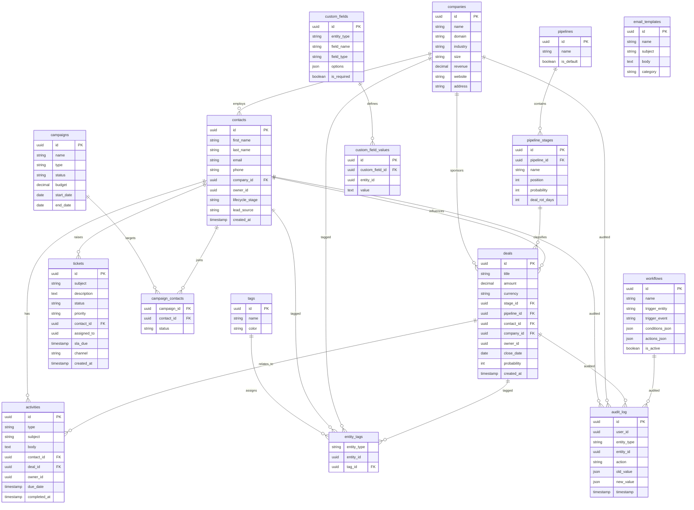
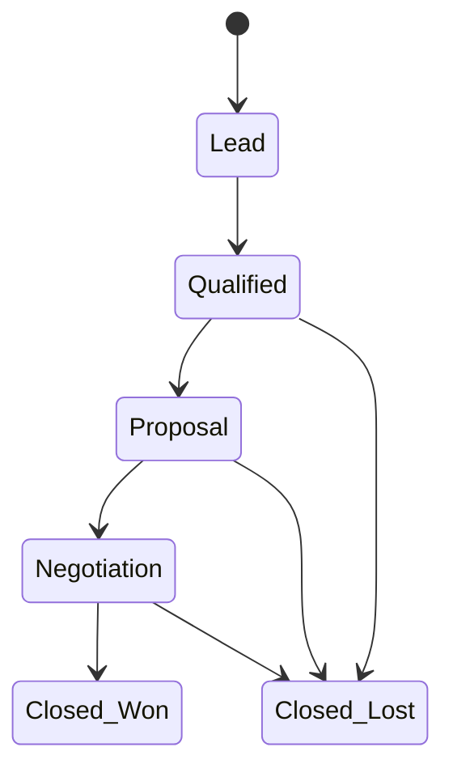
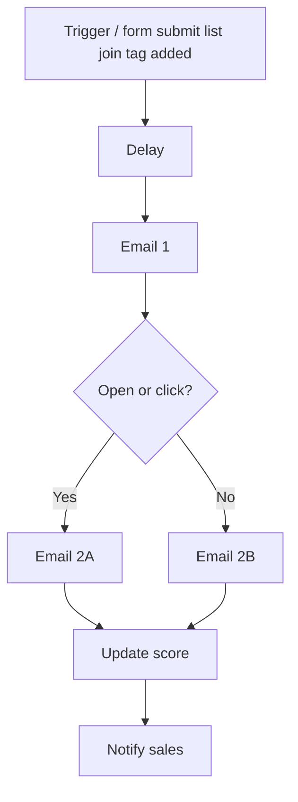
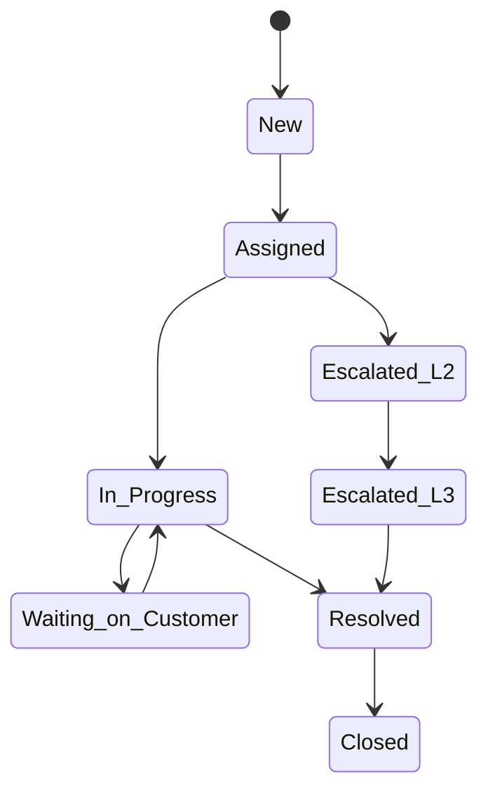
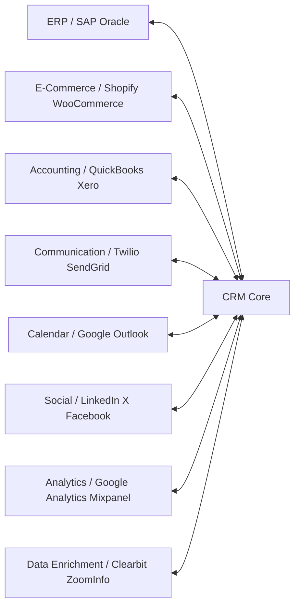
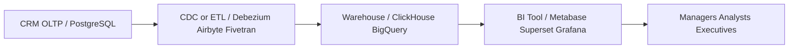
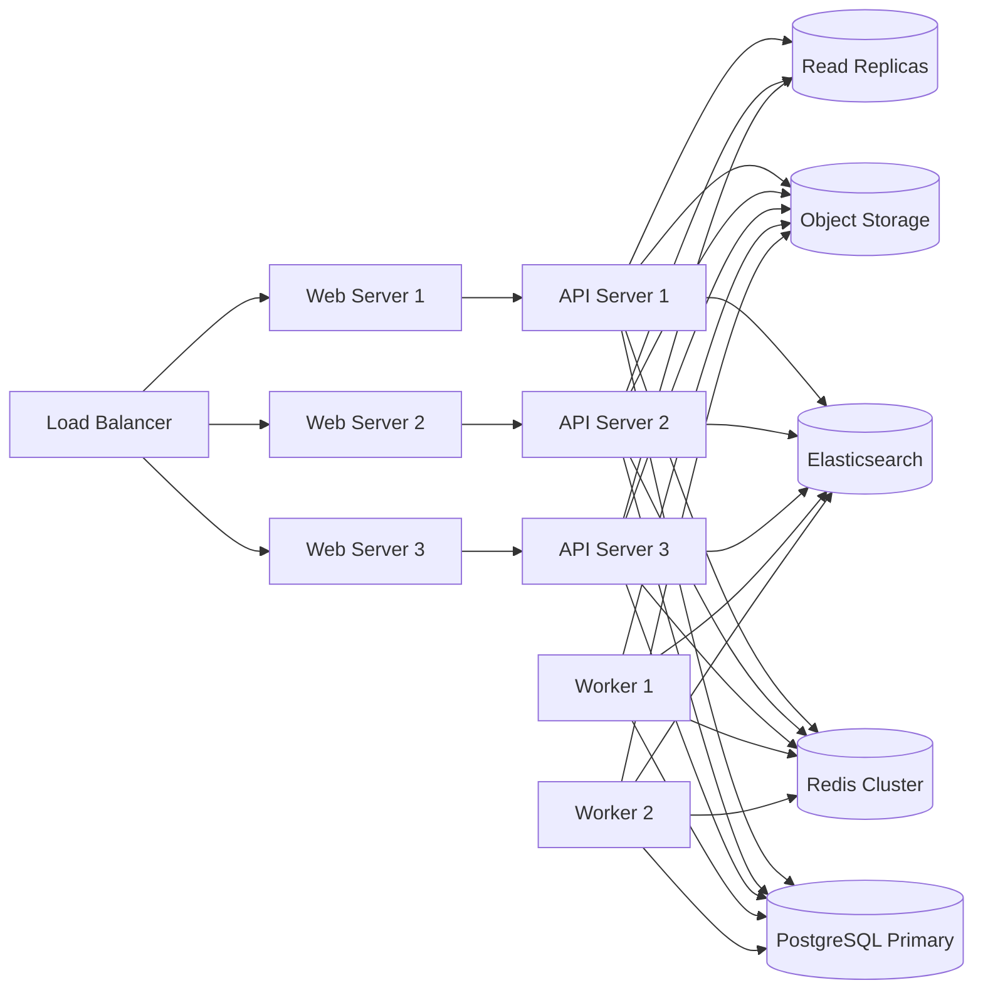
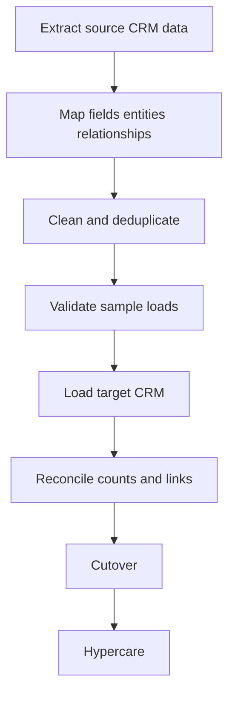
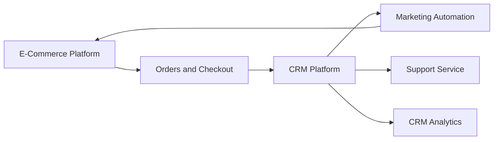

# 13 CRM System Architecture

> **📌 Disclaimer**: Any third-party logos, screenshots, or diagrams referenced in this document are used for educational purposes only. All trademarks belong to their respective owners.

> This document extends the architecture series after [01 — System Overview and Design Decisions](./01-system-overview-and-design-decisions.md), [02 — Kubernetes Architecture](./02-kubernetes-architecture.md), [03 — Cloud Infrastructure](./03-cloud-infrastructure.md), [04 — On-Prem to Cloud Migration](./04-onprem-to-cloud-migration.md), [05 — Disaster Recovery and HA](./05-disaster-recovery-and-ha.md), [06 — Detailed Architecture Diagrams](./06-detailed-architecture-diagrams.md), [07 — AWS Reference Architecture](./07-aws-reference-architecture.md), [08 — System Design Deep Dive](./08-system-design-deep-dive.md), [09 — Complete System Diagrams](./09-complete-system-diagrams.md), [10 — High-Level Design](./10-high-level-design.md), [11 — Low-Level Design](./11-low-level-design.md), and [12 — Checkout System Design](./12-checkout-system-design.md).
A CRM is the business system that holds customer identity, ownership, touchpoints, pipeline state, support conversations, campaign history, documents, consent, and operational analytics. In a company that also runs the e-commerce platform from [10](./10-high-level-design.md), [11](./11-low-level-design.md), and [12](./12-checkout-system-design.md), the CRM becomes the control plane for acquisition, conversion, support, retention, and expansion.
This file follows the same style as the earlier Architecture series: practical, production-oriented, and explicit about trade-offs.
---
## 1. What is CRM and why it matters
A **Customer Relationship Management** system is software for managing customer interactions, sales pipeline, support cases, and marketing execution. It gives the company one customer record instead of fragmented spreadsheets, ticket inboxes, campaign tools, and manual forecast decks.
A serious CRM usually manages contacts, leads, companies, deals, tasks, calls, meetings, tickets, campaigns, templates, consent, analytics, and integrations. Its value is not just storage; it creates operational discipline, reliable forecasting, better customer handoffs, and measurable lifecycle reporting.
### CRM types

| Type | Focus | Typical modules | Primary users |
|---|---|---|---|
| Operational CRM | daily execution | contacts, deals, tasks, tickets, workflows | sales, support, success |
| Analytical CRM | insight and reporting | dashboards, attribution, cohorts, forecasting | leadership, RevOps, finance |
| Collaborative CRM | shared customer context | omnichannel timeline, notes, mentions, team handoffs | all customer-facing teams |

### Popular platforms

| Platform | Strengths | Typical fit | Trade-offs |
|---|---|---|---|
| Salesforce | deep ecosystem, enterprise security, AppExchange | large enterprise | costly and admin-heavy |
| HubSpot | strong inbound marketing, good UX | SMB and mid-market growth teams | advanced customization limits |
| Microsoft Dynamics 365 | Microsoft ecosystem integration | Microsoft-first enterprises | implementation complexity |
| Zoho CRM | lower cost, broad suite | SMB and cost-sensitive teams | lighter ecosystem depth |
| SugarCRM | deployment flexibility | mid-market with control needs | more self-managed complexity |

### Build vs buy decision matrix

| Factor | Build Custom | Buy SaaS | Self-Host OSS (SuiteCRM/vtiger) |
|--------|-------------|----------|--------------------------------|
| Cost | High upfront, low recurring | Low upfront, high recurring | Medium upfront, low recurring |
| Customization | Unlimited | Limited by platform | High |
| Time to market | 6-12 months | 1-4 weeks | 2-3 months |
| Maintenance | Your team | Vendor | Your team |
| Data control | Full | Vendor-hosted | Full |
| Integration | Custom APIs | Marketplace/APIs | APIs + custom |

### Practical decision guidance
Build custom when CRM behavior is part of your competitive advantage, when data residency or workflow control is mandatory, or when deep coupling with commerce/ERP is unavoidable. Buy SaaS when speed matters more than architectural control. Self-host open source when you want ownership and moderate customization without funding a full platform team. The rest of this file assumes a production-grade build or self-host path and should be read alongside [03](./03-cloud-infrastructure.md), [05](./05-disaster-recovery-and-ha.md), and [10](./10-high-level-design.md).
---
## 2. CRM system architecture — high-level design
The CRM should be split into channel applications, an API edge, domain services, a data layer, an event backbone, and integration adapters. That keeps interactive requests fast, isolates provider failures, and lets search, workflows, and analytics scale independently.
### High-level component diagram

```mermaid
flowchart TD
    Web[Web Portal / React or Angular]
    Mobile[Mobile App]
    Admin[Admin Dashboard]
    APIGW[API Gateway]
    Auth[Authentication]
    Rate[Rate Limiting]
    Router[Routing]
    ContactSvc[Contact Management Service]
    SalesSvc[Sales Pipeline Service]
    MarketingSvc[Marketing Automation Service]
    SupportSvc[Customer Support Service]
    CommSvc[Communication Service]
    AnalyticsSvc[Analytics and Reporting Service]
    IntegrationSvc[Integration Service]
    WorkflowSvc[Workflow Engine]
    DocSvc[Document Management]
    UserSvc[User and Role Management]
    Postgres[(PostgreSQL)]
    Elastic[(Elasticsearch)]
    Redis[(Redis)]
    Object[(S3 or Blob Storage)]
    Warehouse[(ClickHouse or TimescaleDB)]
    MQ[(Kafka or RabbitMQ)]
    SendGrid[SendGrid or SES]
    Twilio[Twilio]
    Stripe[Stripe]
    Social[Social APIs]
    Calendar[Google or Outlook]
    ERP[ERP]
    Ecommerce[E-Commerce Platform]
    Web --> APIGW
    Mobile --> APIGW
    Admin --> APIGW
    APIGW --> Auth
    APIGW --> Rate
    APIGW --> Router
    Router --> ContactSvc
    Router --> SalesSvc
    Router --> MarketingSvc
    Router --> SupportSvc
    Router --> CommSvc
    Router --> AnalyticsSvc
    Router --> IntegrationSvc
    Router --> WorkflowSvc
    Router --> DocSvc
    Router --> UserSvc
    ContactSvc --> Postgres
    SalesSvc --> Postgres
    MarketingSvc --> Postgres
    SupportSvc --> Postgres
    UserSvc --> Postgres
    ContactSvc --> Elastic
    SupportSvc --> Elastic
    MarketingSvc --> Redis
    AnalyticsSvc --> Warehouse
    DocSvc --> Object
    ContactSvc --> MQ
    SalesSvc --> MQ
    MarketingSvc --> MQ
    SupportSvc --> MQ
    WorkflowSvc --> MQ
    IntegrationSvc --> MQ
    CommSvc --> SendGrid
    CommSvc --> Twilio
    IntegrationSvc --> Stripe
    IntegrationSvc --> Social
    IntegrationSvc --> Calendar
    IntegrationSvc --> ERP
    IntegrationSvc --> Ecommerce
```

### Layer responsibilities

| Layer | Main responsibility | Real technologies |
|---|---|---|
| Frontend | portals for reps, agents, managers, admins | React, Angular, Next.js, Flutter |
| API gateway | auth, rate limits, routing, request policies | Kong, NGINX, Envoy |
| Core services | domain-specific business logic | Spring Boot, NestJS, Go, Kotlin |
| OLTP data | authoritative writes and relationships | PostgreSQL |
| Search | full-text, faceting, autocomplete, KB search | Elasticsearch, OpenSearch |
| Cache/sessions | hot lookups, dedup keys, locks | Redis |
| Objects | attachments, PDFs, imports, exports | S3, Azure Blob, GCS |
| Analytics | heavy aggregations and dashboards | ClickHouse, TimescaleDB, BigQuery |
| Messaging | async events and jobs | Kafka, RabbitMQ |

### Service boundaries

| Service | Scope | Important caution |
|---|---|---|
| Contact Management | contacts, leads, companies, merge, dedup | identity mistakes ripple everywhere |
| Sales Pipeline | deals, stages, quotas, forecasts, territories | stage changes must be auditable |
| Marketing Automation | campaigns, templates, segments, scores | sending must be async and rate-aware |
| Customer Support | tickets, queues, SLA, KB links | timer correctness matters |
| Communication | email, SMS, call logs, notifications | provider failures must be isolated |
| Analytics | dashboards, exports, rollups | do not query OLTP naively |
| Integration | connectors, webhooks, sync jobs | requires replay and dedup |
| Workflow Engine | triggers, conditions, actions, schedules | guard against loops and retries |
| Document Management | proposals, contracts, attachments | needs signed URLs and malware scanning |
| User and Role Management | users, teams, territories, RBAC, SSO | central authorization backbone |

### Data and event notes
Keep PostgreSQL authoritative for transactional records, Elasticsearch for search, Redis for short-lived operational acceleration, and ClickHouse or a warehouse path for analytics. Use Kafka when replay and fan-out matter; use RabbitMQ for classic worker queues; use both if the organization is large enough to justify separate patterns.
Example event names: `crm.contact.created`, `crm.deal.stage_changed`, `crm.ticket.created`, `crm.ticket.sla_breach_warning`, `crm.campaign.email_sent`, `crm.integration.sync_failed`, `crm.workflow.action_executed`.
### Gateway config example
```yaml
routes:
  - name: crm-public-api
    path: /api/public/*
    rateLimit:
      requestsPerMinute: 300
      burst: 100
  - name: crm-internal-api
    path: /api/*
    rateLimit:
      requestsPerMinute: 3000
      burst: 500
security:
  requireTls: true
  correlationHeader: X-Correlation-Id
  tenantHeader: X-Tenant-Id
```
### Multi-tenant stance and targets
Default to shared schema with `tenant_id` on all business rows, strict policy enforcement, and a migration path toward dedicated clusters for large enterprise tenants. Reasonable NFR targets: P95 common reads under 250 ms, P95 search under 500 ms, workflow trigger latency under 5 seconds, 99.9% availability, RPO under 15 minutes, and RTO under 1 hour.
---
## 3. Database schema design
The CRM data model must support relational integrity, configurable fields, tagging, auditability, and timeline behavior. The relational core stays clean while search and analytics receive denormalized projections.
### Core ER diagram

### Additional production tables

| Table | Reason |
|---|---|
| `users` | owners, agents, managers, admins |
| `teams` | team visibility and rollups |
| `territories` | routing and access segmentation |
| `ticket_comments` | threaded support discussion |
| `attachments` | files linked to tickets, deals, and activities |
| `consents` | GDPR and campaign permission history |
| `lead_scores` | model output and history |
| `webhook_deliveries` | connector retries and replay audit |
| `import_jobs` | spreadsheet load lifecycle |
| `merge_history` | dedup lineage and recovery |

### Schema rules
Use UUIDs, add `tenant_id` consistently, keep hot fields typed, validate dynamic fields through `custom_fields` and `custom_field_values`, and push complex free-text search into Elasticsearch rather than abusing PostgreSQL.
### Example DDL pattern
```sql
CREATE TABLE contacts (
    id UUID PRIMARY KEY,
    tenant_id UUID NOT NULL,
    first_name VARCHAR(100) NOT NULL,
    last_name VARCHAR(100) NOT NULL,
    email CITEXT,
    phone VARCHAR(30),
    company_id UUID,
    owner_id UUID NOT NULL,
    lifecycle_stage VARCHAR(50) NOT NULL,
    lead_source VARCHAR(50),
    created_at TIMESTAMPTZ NOT NULL DEFAULT now(),
    updated_at TIMESTAMPTZ NOT NULL DEFAULT now(),
    deleted_at TIMESTAMPTZ NULL,
    UNIQUE (tenant_id, email)
);
CREATE INDEX idx_contacts_owner_stage ON contacts (tenant_id, owner_id, lifecycle_stage);
CREATE INDEX idx_contacts_company ON contacts (tenant_id, company_id);
CREATE INDEX idx_contacts_created_at ON contacts (tenant_id, created_at DESC);
```
### Indexing, partitioning, and quality

| Entity | Index examples | Operational note |
|---|---|---|
| contacts | `(tenant_id, email)`, `(tenant_id, owner_id, lifecycle_stage)` | normalize email and phone |
| deals | `(tenant_id, pipeline_id, stage_id)`, `(tenant_id, owner_id, close_date)` | fast board/filter queries |
| activities | `(tenant_id, contact_id, created_at DESC)` | month partition when large |
| tickets | `(tenant_id, status, priority, sla_due)` | queue and SLA views |
| audit_log | `(tenant_id, entity_type, entity_id, timestamp DESC)` | partition by month |

Normalize email to lowercase, phone to E.164, and company domains to canonical form. Enforce lifecycle stages and ticket states through controlled enums. Audit all create, update, merge, delete, export, and permission-sensitive actions. For search, project flattened contact documents similar to the search model discussed in [11](./11-low-level-design.md) for the e-commerce platform.
---
## 4. Sales pipeline architecture
Sales architecture is about turning prospects into forecastable revenue with explicit stage definitions, ownership, activity expectations, and routing rules.
### Pipeline stages

### Example pipeline

| Stage | Entry criteria | Probability | Target duration |
|---|---|---:|---:|
| Lead | prospect exists | 10% | 3 days |
| Qualified | ICP and need confirmed | 25% | 7 days |
| Proposal | quote or deck shared | 50% | 10 days |
| Negotiation | pricing/legal/procurement active | 75% | 14 days |
| Closed Won | contract or order confirmed | 100% | Done |
| Closed Lost | no budget, competitor, no decision, disqualified | 0% | Done |

### Lead scoring
Lead scoring should combine demographic fit and behavioral intent.

| Demographic signal | Points |
|---|---:|
| VP or above | 20 |
| Company size 200-2000 | 15 |
| Target industry | 10 |
| Priority region | 5 |
| Behavioral signal | Points |
|---|---:|
| 3+ email opens | 8 |
| Pricing email click | 12 |
| Pricing page revisits | 10 |
| Demo request | 30 |
| Trial start | 25 |

```text
lead_score = demographic_score * 0.45 + behavioral_score * 0.55
MQL >= 45
SQL >= 70 plus at least one high-intent event
```
Decay behavioral score over time so stale activity does not inflate current intent. Keep model version and score history so RevOps can compare predicted quality with closed-won outcomes.
### Forecasting and territories
Weighted pipeline uses `deal amount × stage probability`. AI-assisted forecasting can add historical win rates by segment, rep, product line, deal age, meeting count, and prior stage velocity. Territory design can be geographic, industry-based, account-size-based, or named-account-based. Routing should filter by territory, language, skill, capacity, and availability, then apply round-robin or weighted assignment with a recorded routing reason.
### Sales workflow examples
- Create follow-up task when a deal enters Qualified.
- Require approval when discount exceeds threshold.
- Notify manager if amount changes after proposal.
- Force structured loss reason on Closed Lost.
- Trigger onboarding handoff on Closed Won.
---
## 5. Marketing automation architecture
Marketing automation turns events and segments into timely, personalized outreach. It must be event-driven, privacy-aware, and designed for large asynchronous volume.
### Campaign workflow

### Core concepts

| Concept | Examples |
|---|---|
| Trigger | form submit, list join, tag added, trial started, page visit |
| Condition | geography, product interest, prior engagement, score threshold |
| Action | send email, wait, branch, add tag, create task, webhook |
| Goal | stop sequence after conversion |
| Suppression | unsubscribe, hard bounce, competitor, legal exclusion |

### Deliverability
Use SPF, DKIM, and DMARC; suppress bounces and complaints immediately; and keep transactional and marketing sending separated where possible.
```dns
example.com.        TXT   "v=spf1 include:amazonses.com include:sendgrid.net -all"
s1._domainkey.example.com. CNAME s1.domainkey.u123456.wl.sendgrid.net.
_dmarc.example.com. TXT   "v=DMARC1; p=quarantine; rua=mailto:dmarc@example.com; adkim=s; aspf=s"
```
Warm new domains gradually, start with engaged recipients, monitor complaint/bounce rates, and enforce unsubscribe state in real time. Support email sequences, SMS, social audience sync, and web/in-app behavioral triggers, but put all channel events on a unified contact timeline.
### Example workflow definition
```json
{
  "name": "trial-activation-nurture",
  "trigger": {"entity": "contact", "event": "trial_started"},
  "steps": [
    {"type": "delay", "duration": "PT2H"},
    {"type": "send_email", "template": "trial-welcome"},
    {"type": "wait_for", "event": "email_clicked", "timeout": "P2D"},
    {"type": "branch", "if": "clicked == true", "then": ["increase_score:15"], "else": ["send_email:trial-reminder"]},
    {"type": "notify_owner", "channel": "slack"}
  ]
}
```
Support first-touch, last-touch, and multi-touch attribution in analytics, apply frequency caps, and respect time zones and quiet hours.
---
## 6. Customer support architecture
The support side of CRM manages case intake, ownership, response obligations, knowledge reuse, and satisfaction feedback. It should behave like a proper service desk, not merely a comment field on a contact.
### Ticket lifecycle

### SLA table

| Priority | First Response | Resolution |
|----------|---------------|-----------|
| Critical | 15 min | 4 hours |
| High | 1 hour | 8 hours |
| Medium | 4 hours | 24 hours |
| Low | 8 hours | 48 hours |

### Omnichannel support

| Channel | Intake pattern | Operational note |
|---|---|---|
| Email | provider webhook or mailbox sync | preserve thread IDs |
| Chat | web/app widget | tie conversation to customer identity |
| Phone | telephony integration | store recording reference and wrap-up |
| Social | mention/DM sync | often triaged into standard queues |
| Portal | authenticated self-service | best with KB deflection |

Route by language, product line, account tier, region, queue, and issue category. Start SLA timers on creation, optionally pause while waiting on customer, and emit both warning and breach events. Knowledge-base articles should be versioned, searchable, tagged, and linked to tickets so the business can measure deflection and resolution quality.
### Feedback loop
Send CSAT after resolution and NPS on a recurring or milestone cadence. Poor scores should create review tasks or escalation workflows. Support dashboards should track first response time, resolution time, backlog, reopen rate, SLA compliance, and CSAT by queue and category.
---
## 7. Integration architecture
A CRM usually sits between acquisition, revenue, finance, and support systems. Integration design therefore needs clear source-of-truth rules, replayable sync, conflict handling, and strong security.
### CRM as hub

### Integration patterns

| Pattern | Good for | Risk |
|---|---|---|
| Webhook-based | real-time updates | retries and dedup complexity |
| Polling/sync | systems without strong events | lag and cursor drift |
| iPaaS | low-code quick wins | weaker governance at scale |
| Native connector | strategic high-volume sync | more engineering effort |

### Source of truth and conflict rules

| Entity | Source of truth | CRM role |
|---|---|---|
| Contact profile | CRM | authoritative |
| Marketing consent | CRM | authoritative for sends |
| Orders | e-commerce or ERP | mirrored context |
| Invoice/payment status | accounting or ERP | read model |
| Usage events | product analytics | enrichment |

Use source precedence for sensitive fields, last-write-wins only for low-risk enrichment, and a manual merge queue for medium-confidence conflicts. Dedup should combine exact email match, normalized phone match, company domain, and fuzzy company-name similarity.
### Webhook processing pattern
1. verify signature or HMAC;
2. compute provider event idempotency key;
3. persist raw payload for audit;
4. publish normalized event to Kafka or queue;
5. ack only after durable persistence;
6. replay from archive when downstream consumers fail.
Store secrets in Vault or a cloud secret manager, respect provider rate limits, expose sync health dashboards, and version connector mappings so field changes are deliberate.
---
## 8. Analytics and reporting
Operational CRM screens tell a rep what to do next; analytics tells leadership what is happening across the business. Keep the analytics path separate enough that dashboard traffic never harms OLTP behavior.
### KPI areas

| Function | Example KPIs |
|---|---|
| Sales | pipeline value, conversion by stage, avg deal size, cycle length, win rate by rep |
| Marketing | CAC, LTV, open/click rates, ROI, lead source attribution |
| Support | CSAT, NPS, avg resolution time, SLA compliance, ticket volume trend |

### Analytics data flow

### Architecture notes
Model facts such as deals, campaign events, tickets, and activities; dimensions such as contacts, companies, owners, and dates; and snapshots such as daily pipeline state. The custom report builder should support filter/group/aggregate on standard and custom fields, scheduled report delivery, and export to CSV/PDF. Large exports should run asynchronously and be fully audited.
### Freshness targets

| Dashboard | Target |
|---|---|
| Sales pipeline board | under 1 minute |
| Support SLA board | 5 minutes |
| Campaign performance | 15 minutes to 1 hour |
| Executive summary | hourly |
| Board pack | daily |

---
## 9. Security and compliance
CRM security must cover identity, authorization, privacy, encryption, auditability, and export control. The platform contains PII, commercial forecasts, communication logs, and often sensitive attachments.
### RBAC model
Standard roles are Admin, Sales Manager, Sales Rep, Marketing Manager, Support Agent, and Read-Only. Access must combine object-level rights, record-level scope, field-level security, and action-level restrictions.
### Example permission matrix

| Role | Contacts | Deals | Campaigns | Tickets | Reports | Admin Settings |
|---|---|---|---|---|---|---|
| Admin | Full | Full | Full | Full | Full | Full |
| Sales Manager | Team/all | Team/all | View | View | Team/all | Limited |
| Sales Rep | Own/team view, own edit | Own/team view, own edit | View | View | Own | None |
| Marketing Manager | View | View | Full | View | Full | Limited |
| Support Agent | View | View | None | Own/team full | Team | None |
| Read-Only | View allowed | View allowed | View allowed | View allowed | View allowed | None |

### Privacy and protection
Support GDPR consent tracking, right to erasure, data portability, and retention policies. Encrypt data at rest with AES-256 and in transit with TLS 1.3. Use SAML 2.0 or OAuth 2.0 / OIDC for SSO and TOTP or WebAuthn for MFA. Require step-up auth for exports, role changes, bulk deletes, and impersonation.
### Audit and detection
Audit all important field changes, imports, exports, role updates, integration changes, and impersonation. Field-level security must apply to APIs, exports, search indexes, and BI extracts, not only to the UI. Forward security events to SIEM and detect impossible travel, abnormal exports, token misuse, and repeated webhook signature failures.
### Example security policy
```yaml
security:
  auth:
    type: oauth2
    issuer: https://login.example.com
    audience: crm-api
  mfa:
    requiredFor:
      - export_contacts
      - bulk_delete
      - role_assignment
  encryption:
    tlsMinVersion: "1.3"
    atRest: "AES-256"
  audit:
    enabled: true
    immutableStore: s3://crm-audit-archive
```
### Relevant compliance frames
GDPR and CCPA/CPRA apply to privacy. SOC 2 and ISO 27001 guide SaaS controls. HIPAA matters only if PHI is in scope. PCI DSS should ideally stay out of CRM by never storing card data directly.
---
## 10. Deployment architecture
Deployment should follow the same operational discipline used in [02](./02-kubernetes-architecture.md), [03](./03-cloud-infrastructure.md), [05](./05-disaster-recovery-and-ha.md), and [07](./07-aws-reference-architecture.md): stateless services scale horizontally; stateful systems get stronger protection and backup strategy.
### Self-hosted deployment

### Kubernetes shape
Use Helm, HPA for APIs and workers, PDBs for critical pods, and Ingress with TLS. Separate workers from APIs so imports, campaign sends, and report generation cannot starve interactive traffic.
### Helm chart structure
```text
helm/
  crm/
    Chart.yaml
    values.yaml
    templates/
      api-deployment.yaml
      worker-deployment.yaml
      web-deployment.yaml
      service.yaml
      ingress.yaml
      hpa.yaml
      pdb.yaml
      configmap.yaml
      secret-ref.yaml
```
### Example HPA
```yaml
apiVersion: autoscaling/v2
kind: HorizontalPodAutoscaler
metadata:
  name: crm-api
spec:
  scaleTargetRef:
    apiVersion: apps/v1
    kind: Deployment
    name: crm-api
  minReplicas: 3
  maxReplicas: 20
  metrics:
    - type: Resource
      resource:
        name: cpu
        target:
          type: Utilization
          averageUtilization: 65
    - type: Resource
      resource:
        name: memory
        target:
          type: Utilization
          averageUtilization: 75
```
### Example ingress
```yaml
apiVersion: networking.k8s.io/v1
kind: Ingress
metadata:
  name: crm-ingress
  annotations:
    cert-manager.io/cluster-issuer: letsencrypt-prod
    nginx.ingress.kubernetes.io/proxy-body-size: 20m
spec:
  tls:
    - hosts:
        - crm.example.com
      secretName: crm-tls
  rules:
    - host: crm.example.com
      http:
        paths:
          - path: /
            pathType: Prefix
            backend:
              service:
                name: crm-web
                port:
                  number: 80
```
### Cloud options

| Cloud | Compute | Database | Cache | Search | Object storage |
|---|---|---|---|---|---|
| AWS | ECS or EKS | RDS PostgreSQL | ElastiCache | OpenSearch | S3 |
| Azure | AKS | Azure Database for PostgreSQL | Azure Cache for Redis | Azure Cognitive Search or Elastic Cloud | Blob Storage |
| GCP | GKE | Cloud SQL PostgreSQL | Memorystore | Elastic Cloud or equivalent | Cloud Storage |

Back up PostgreSQL continuously, replicate backups cross-region, keep object versioning on for critical attachments, and document restore runbooks. Search is rebuildable; transactional data is not.
---
## 11. Migration and data import
CRM migration is mostly a data-quality problem. Old systems contain duplicates, dead owners, inconsistent enums, orphaned notes, and undocumented custom fields. The target architecture should therefore include migration controls and import jobs as real product features.
### Migration workflow

### Recommended sequence
1. Users
2. Companies
3. Contacts
4. Deals
5. Activities
6. Tickets
### Migration checklist

| Area | What to validate |
|---|---|
| Field mapping | standard fields, custom fields, enum mapping |
| Relationships | company-contact, deal-stage, ticket-owner |
| Ownership | user mapping and inactive-user strategy |
| Data quality | duplicate emails, malformed phones, bad domains |
| Attachments | checksum, existence, access policy |
| Auditability | source IDs and import job IDs |

### Imports and cutover
Provide CSV templates, dry-run validation, row-level error reporting, dedup checks, and asynchronous import jobs with progress states such as Uploaded, Validating, Ready to Import, Importing, Completed, Completed with Warnings, and Rolled Back. Use **parallel run** when risk tolerance is low and dual-operation complexity is acceptable; use **big bang** only after strong rehearsal and reconciliation confidence.
### CSV example
```csv
first_name,last_name,email,phone,company_name,owner_email,lifecycle_stage,lead_source
Alicia,Gomez,alicia@example.com,+14155550123,Northwind Labs,rep1@example.com,mql,webinar
Noah,Patel,noah@example.com,+14155550124,Contoso Health,rep2@example.com,lead,ads
```
### Validation and rollback
Validate required fields, format, referential integrity, duplicate likelihood, and enum correctness before committing. Track every created or updated record by import job ID and retain a rollback window with pre-change snapshots for update operations.
---
## 12. Scaling and performance
CRM performance depends on keeping interactive reads predictable, search responsive, and heavy background work isolated.
### Core strategy
- Redis for hot contact/company lookup and permission cache.
- Elasticsearch for full-text and faceted search.
- PostgreSQL read replicas for read-heavy reports.
- Date partitioning for activities and audit logs.
- PgBouncer or equivalent for connection pooling.
- Dedicated queues for campaign sends, imports, exports, notifications, and connector sync.
### API patterns
Use per-user and per-key rate limiting, cursor pagination for large lists, and bulk create/update APIs with async processing when volume is high. GraphQL is useful for flexible frontends but only with depth limits, complexity budgets, and strict auth checks.
### SLO targets

| Capability | Target |
|---|---|
| Contact detail fetch | P95 < 200 ms |
| Search contacts | P95 < 500 ms |
| Save contact | P95 < 300 ms |
| Update deal stage | P95 < 250 ms |
| Ticket create | P95 < 300 ms |
| Standard report load | P95 < 2 s |
| Export completion | 95% under 10 min |

### Anti-patterns to avoid
Do not run dashboard joins on the write primary, do not send campaign email inline in request threads, do not rely on PostgreSQL `ILIKE` scans for global search, and do not allow one large tenant’s imports or connectors to starve the rest of the platform.
---
## 13. CRM for e-commerce integration
The CRM should integrate directly with the e-commerce design from [10](./10-high-level-design.md), [11](./11-low-level-design.md), and [12](./12-checkout-system-design.md). That integration makes customer records commercially meaningful instead of static.
### E-commerce to CRM data flow

### Key use cases

| Flow | CRM outcome |
|---|---|
| e-commerce user -> CRM | user becomes contact/account-contact |
| order history -> CRM timeline | reps and agents see commercial context |
| cart abandonment -> workflow | reminder email/SMS sequence |
| post-purchase event -> support | ticket or follow-up task created |
| order stream -> analytics | LTV, repeat purchase, retention metrics |
| purchase behavior -> campaigns | segmentation and personalization |

### Data model implications
The CRM contact should display order history, last purchase date, refund count, total spend, favorite categories, open support issues, and lifecycle stage in one place. Identity stitching should support anonymous-to-known transitions after login or checkout capture, while keeping event consumption idempotent and replayable.
### Example commerce events
- `order.created`
- `order.paid`
- `order.shipped`
- `order.return_requested`
- `checkout.abandoned`
- `payment.failed`
- `refund.completed`
- `product.review_submitted`
### Example event contract
```json
{
  "event_type": "checkout.abandoned",
  "occurred_at": "2025-03-10T11:00:00Z",
  "contact": {
    "email": "alicia@example.com",
    "phone": "+14155550123"
  },
  "cart": {
    "currency": "USD",
    "subtotal": 149.99,
    "items": [
      {"sku": "SKU-100", "qty": 1, "price": 99.99},
      {"sku": "SKU-200", "qty": 1, "price": 50.00}
    ]
  },
  "tenant_id": "t_123"
}
```
### Closed-loop examples
Abandoned cart can trigger recovery flows; delivered order can trigger CSAT or review requests; repeated refunds can trigger retention intervention; high-LTV customers can be routed into VIP support. Keep the commerce event pipeline durable so CRM incidents never block checkout, payment, or order creation.
### Final note
A production-grade CRM is a revenue operations platform, not just a database with forms. It must combine clean data models, strong authorization, reliable workflow automation, durable integrations, useful analytics, and disciplined deployment. When connected to the earlier Architecture files, it becomes the system that turns customer activity into coordinated business action.
