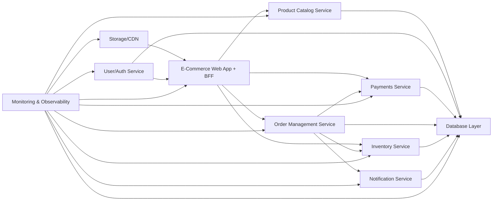
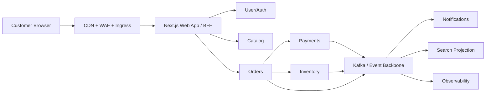
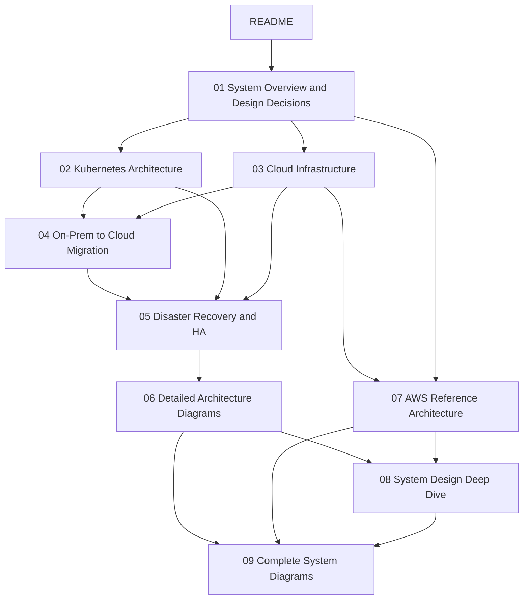

<pre>
┌──────────────────────────────────────────────────────────────────────┐
│                                                                      │
│               E-Commerce Architecture — 10 Applications             │
│                                                                      │
│                  Cloud + Kubernetes + Migration + DR                │
│                                                                      │
├──────────────────────────────────────────────────────────────────────┤
│                                                                      │
│        Reference track for platform, app, and operations teams      │
│                                                                      │
└──────────────────────────────────────────────────────────────────────┘
</pre>

# E-Commerce Architecture — 10 Applications

> Comprehensive architecture documentation for a 10-application ecommerce platform designed for cloud-native deployment on Kubernetes.

This directory extends the repo foundations from the physical, virtualized, and Kubernetes learning tracks into a production-style ecommerce reference architecture.

---

## What this architecture track covers

- System decomposition for ten bounded-context applications.
- Technology choices with explicit **why this over alternatives** reasoning.
- Kubernetes runtime design, networking, security, GitOps, and scaling policy.
- Cloud infrastructure patterns across AWS, Azure, and GCP.
- Step-by-step on-premises to cloud migration guidance.
- Disaster recovery, high availability, drills, and failover operating model.

## Relationship to the rest of this repository

- Foundation labs: [`../Virtual-Setup/05-kubernetes-fundamentals.md`](../Virtual-Setup/05-kubernetes-fundamentals.md)
- Ecommerce deployment primer: [`../Virtual-Setup/06-kubernetes-ecommerce-deployment.md`](../Virtual-Setup/06-kubernetes-ecommerce-deployment.md)
- Production cluster guidance: [`../Virtual-Setup/07-production-kubernetes-setup.md`](../Virtual-Setup/07-production-kubernetes-setup.md)
- Physical network baseline: [`../Physical-Setup/03-network-architecture.md`](../Physical-Setup/03-network-architecture.md)
- Monitoring baseline: [`../Physical-Setup/07-monitoring-and-observability.md`](../Physical-Setup/07-monitoring-and-observability.md)
- Backup and DR baseline: [`../Physical-Setup/08-backup-and-disaster-recovery.md`](../Physical-Setup/08-backup-and-disaster-recovery.md)

These documents assume the reader already understands Linux, networking, storage, Docker, Kubernetes basics, and backup fundamentals covered in the referenced sections above.

---

## The 10 applications

| # | Application | One-line description |
|---|-------------|----------------------|
| 1 | [Payments Service](./01-system-overview-and-design-decisions.md#payments-service) | Processes credit cards, UPI, wallets, refunds, and settlement events with PCI-aware controls. |
| 2 | [E-Commerce Web App](./01-system-overview-and-design-decisions.md#web-app) | Customer-facing storefront using React/Next.js plus a Backend for Frontend (BFF) for web experience orchestration. |
| 3 | [Product Catalog Service](./01-system-overview-and-design-decisions.md#product-catalog-service) | Stores product listings, categories, attributes, and search-facing content for browse and discovery. |
| 4 | [Order Management Service](./01-system-overview-and-design-decisions.md#order-management-service) | Owns cart checkout outcome, order lifecycle, fulfillment status, returns, and customer-visible order state. |
| 5 | [User/Auth Service](./01-system-overview-and-design-decisions.md#user-auth-service) | Handles registration, login, OAuth/OIDC federation, token issuance, sessions, and account security controls. |
| 6 | [Inventory Service](./01-system-overview-and-design-decisions.md#inventory-service) | Tracks stock, reservations, warehouse synchronization, and availability decisions across fulfillment locations. |
| 7 | [Notification Service](./01-system-overview-and-design-decisions.md#notification-service) | Sends email, SMS, and push notifications based on domain events and customer communication preferences. |
| 8 | [Database Layer](./01-system-overview-and-design-decisions.md#database-layer) | Platform data tier spanning relational stores, document stores, cache, search, backups, and data protection controls. |
| 9 | [Storage/CDN](./01-system-overview-and-design-decisions.md#storage-cdn) | Stores images, videos, static assets, user uploads, and distributes them globally through a CDN edge layer. |
| 10 | [Monitoring & Observability](./01-system-overview-and-design-decisions.md#monitoring-observability) | Collects metrics, logs, traces, SLOs, dashboards, and alerting for platform and business health. |

---

## High-level system overview

### Request and event flow view

### Document map

---

## Table of contents

- [01 — System overview and design decisions](./01-system-overview-and-design-decisions.md)
- [02 — Kubernetes architecture](./02-kubernetes-architecture.md)
- [03 — Cloud infrastructure](./03-cloud-infrastructure.md)
- [04 — On-prem to cloud migration](./04-onprem-to-cloud-migration.md)
- [05 — Disaster recovery and high availability](./05-disaster-recovery-and-ha.md)
- [06 — Detailed architecture diagrams](./06-detailed-architecture-diagrams.md)
- [07 — AWS reference architecture](./07-aws-reference-architecture.md)
- [08 — System design deep dive](./08-system-design-deep-dive.md)
- [09 — Complete system diagrams](./09-complete-system-diagrams.md)

---

## Architecture principles

### 1. Microservices where bounded contexts are clear

- Payments, orders, catalog, auth, inventory, and notifications change at different rates.
- They need different data models, SLAs, and scaling profiles.
- A shared deployment unit would create release coupling and scale inefficiency.

### 2. 12-factor application discipline

- Code and config are separated.
- Backing services are attached resources.
- Services are disposable and horizontally scalable.
- Logs are event streams, not local files.
- Admin tasks run as one-off jobs or pipelines.

### 3. API-first and event-driven by default

- Browser-friendly APIs remain simple and explicit.
- Internal services use gRPC only where measurable latency benefits justify it.
- Domain events decouple slow or failure-prone downstream work from checkout-critical flows.

### 4. Database-per-service

- Avoid shared schema coupling.
- Let each bounded context choose the right storage engine.
- Exchange data through APIs and events instead of direct table access.

### 5. CAP theorem relevance

- Orders and payments favor **consistency + partition tolerance** for core transaction writes.
- Catalog search and notification pipelines can favor **availability + partition tolerance** with eventual consistency.
- The architecture intentionally mixes consistency models based on business impact.

### 6. Security as a platform capability

- Identity, secrets, encryption, image scanning, network policies, and audit logging are not optional add-ons.
- Payments and auth run with stricter controls and tighter blast-radius boundaries.

### 7. Operability before elegance

- Prefer managed services for stateful systems in production.
- Prefer boring defaults where they reduce operational risk.
- Introduce complexity only when it clearly improves resilience, scale, or team autonomy.

---

## Recommended reading path

1. Start with [`01-system-overview-and-design-decisions.md`](./01-system-overview-and-design-decisions.md).
2. Move to [`02-kubernetes-architecture.md`](./02-kubernetes-architecture.md) for runtime design.
3. Read [`03-cloud-infrastructure.md`](./03-cloud-infrastructure.md) for network and managed-service layout.
4. Use [`04-onprem-to-cloud-migration.md`](./04-onprem-to-cloud-migration.md) for execution planning.
5. Finish with [`05-disaster-recovery-and-ha.md`](./05-disaster-recovery-and-ha.md) to operationalize resilience.

## Decision shorthand used in the rest of this directory

| Term | Meaning in these documents |
|------|---------------------------|
| BFF | Backend for Frontend tailored to a specific client experience |
| North-south traffic | Client-to-platform traffic entering through CDN/WAF/Ingress/Gateway |
| East-west traffic | Service-to-service traffic inside the platform |
| SLO | Internal service-level objective used to drive alerting and error budgets |
| RPO | Maximum acceptable data loss during a disaster |
| RTO | Maximum acceptable time to recover a service |

## Design assumptions

- Peak sale events can reach 10x normal traffic.
- Checkout latency target is less than 300 ms p95 for cached browse pages and less than 800 ms p95 for payment initiation APIs.
- The company has separate application, platform, data, and security teams.
- Compliance requirements include PCI DSS for payments and general privacy controls for customer data.

## Outcome of this architecture set

By the end of this directory, the reader should be able to justify not only **what** the platform looks like, but also **why each major technology choice is better than the realistic alternatives for this specific ecommerce scenario**.
