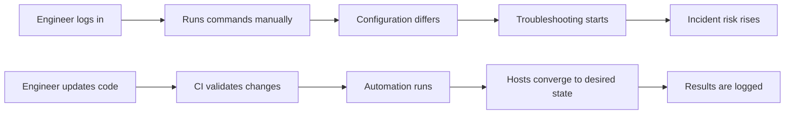
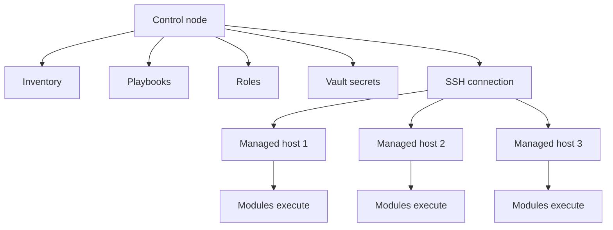
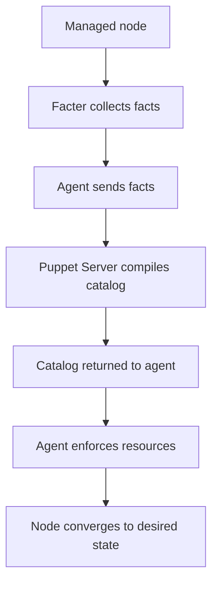

# Linux Automation & Configuration Management Guide

## Table of Contents

1. [Automation Fundamentals](#1-automation-fundamentals)
2. [Ansible](#2-ansible)
3. [Terraform for Linux](#3-terraform-for-linux)
4. [Puppet](#4-puppet)
5. [Chef](#5-chef)
6. [SaltStack](#6-saltstack)
7. [Cloud-Init](#7-cloud-init)
8. [Packer](#8-packer)
9. [CI/CD for Infrastructure](#9-cicd-for-infrastructure)
10. [Advanced Patterns](#10-advanced-patterns)
11. [Monitoring Automation](#11-monitoring-automation)
12. [Appendix A: Example Repository Layout](#appendix-a-example-repository-layout)
13. [Appendix B: Troubleshooting Checklists](#appendix-b-troubleshooting-checklists)
14. [Appendix C: Security Checklist](#appendix-c-security-checklist)
15. [Appendix D: Glossary](#appendix-d-glossary)

---

# 1. Automation Fundamentals

Automation is the disciplined use of repeatable processes, code, and tooling to reduce manual work in system administration and infrastructure operations.

A mature Linux automation strategy improves:

- Reliability
- Repeatability
- Security
- Speed
- Auditability
- Scalability
- Recovery time

## 1.1 Why Automate

Manual administration does not scale well.

When teams manage servers manually, they often face:

- Inconsistent configuration between environments
- Human error during routine changes
- Slow recovery during incidents
- Poor visibility into what changed and why
- Difficulty onboarding new engineers
- Fragile runbooks that depend on tribal knowledge

Automation addresses these problems by turning operational tasks into controlled, versioned workflows.

### Benefits of automation

| Benefit | Description | Example |
|---|---|---|
| Consistency | Same process runs every time | Standard package installation on all web servers |
| Speed | Tasks complete faster than manual execution | Provisioning 50 VMs in minutes |
| Auditability | Changes are stored in Git and CI logs | Reviewing a pull request for firewall updates |
| Safety | Validations and approvals reduce risk | CI tests a Terraform plan before apply |
| Recovery | Rebuild systems quickly after failure | Recreating a compromised node from code |
| Compliance | Security baselines are enforced | Enforcing SSH hardening using Ansible |

## 1.2 Manual vs Automated Operations

A simple comparison:

| Dimension | Manual Workflow | Automated Workflow |
|---|---|---|
| Change execution | Performed by admins | Performed by code and pipelines |
| Repeatability | Low to medium | High |
| Error rate | Higher | Lower |
| Documentation | Often separate from execution | Embedded in code and pipeline logs |
| Scaling | Hard | Easier |
| Rollback | Ad hoc | Planned and scripted |

### Mermaid diagram: Manual vs automated workflow



## 1.3 Idempotency

Idempotency means applying the same automation multiple times produces the same desired result without causing harmful side effects.

This is a core property of configuration management.

### Why idempotency matters

- Safe re-runs after partial failure
- Easier drift correction
- Predictable outcomes in CI/CD
- Fewer conditional hacks in scripts

### Non-idempotent example

```bash
useradd deploy
echo "Password123" | passwd --stdin deploy
```

This may fail on subsequent runs because the user already exists.

### More idempotent shell example

```bash
id deploy >/dev/null 2>&1 || useradd deploy
install -d -m 0750 /opt/app
```

### Better example with Ansible

```yaml
- name: Ensure deploy user exists
  ansible.builtin.user:
    name: deploy
    shell: /bin/bash
    state: present

- name: Ensure application directory exists
  ansible.builtin.file:
    path: /opt/app
    state: directory
    mode: '0750'
```

## 1.4 Declarative vs Imperative Automation

Two broad models exist.

### Declarative

You declare the desired end state.

The tool figures out how to achieve it.

Examples:

- Ansible task modules
- Terraform resources
- Puppet resources
- Salt states

### Imperative

You explicitly define the steps to execute.

Examples:

- Bash scripts
- Remote shell sequences
- Procedural deployment scripts

### Comparison table

| Approach | Focus | Strength | Weakness |
|---|---|---|---|
| Declarative | Desired state | Easier drift correction | Abstract behavior can hide internals |
| Imperative | Exact steps | Full control | Harder to maintain and make idempotent |

## 1.5 Infrastructure as Code

Infrastructure as Code, or IaC, is the practice of managing infrastructure through version-controlled definitions rather than manual console operations.

IaC applies to:

- Servers
- Networks
- Security groups
- DNS
- Load balancers
- Storage
- Kubernetes objects
- Monitoring rules
- User accounts and policies

### IaC principles

1. Store infrastructure definitions in Git.
2. Review changes through pull requests.
3. Validate syntax and policy before apply.
4. Use environments and modules for reuse.
5. Track state where appropriate.
6. Prefer immutable replacements over uncontrolled in-place mutation when risk is high.

## 1.6 Configuration Drift

Configuration drift occurs when systems diverge from their intended baseline.

Common causes:

- Manual SSH changes
- Ad hoc package installs
- Emergency fixes not codified later
- Different package repositories per environment
- Missing automation coverage

### Drift examples

| Resource | Desired State | Drifted State |
|---|---|---|
| SSH config | Root login disabled | Root login enabled manually |
| Nginx | TLS 1.2+ only | Legacy ciphers re-enabled |
| Package set | Standard baseline packages | Extra debug tools installed |
| Firewall | Limited ports allowed | Temporary port left open |

### Drift control methods

- Frequent convergence runs with configuration management
- Golden images built from source templates
- Prohibiting manual production changes
- File integrity monitoring
- Continuous compliance scans
- GitOps pull-based reconciliation

## 1.7 The Automation Lifecycle

A practical lifecycle looks like this:

1. Define requirements.
2. Model desired state in code.
3. Validate syntax and policy.
4. Test in isolated environments.
5. Promote through stages.
6. Deploy changes.
7. Observe results.
8. Correct drift and improve code.

## 1.8 Layers of Automation

Linux automation spans multiple layers.

| Layer | Scope | Typical Tools |
|---|---|---|
| Bootstrap | First-boot setup | Cloud-Init, shell, systemd |
| Configuration | Package and service state | Ansible, Puppet, Chef, Salt |
| Provisioning | Infrastructure resources | Terraform |
| Image building | Machine images | Packer |
| Delivery | Orchestration pipelines | GitHub Actions, GitLab CI, Jenkins |
| Reconciliation | Desired-state enforcement | GitOps controllers, config mgmt agents |
| Remediation | Event-driven recovery | Alertmanager, Rundeck, Salt Reactor |

## 1.9 Choosing the Right Tool

There is no single best tool for all use cases.

Choose based on:

- Team skills
- Environment size
- Cloud/on-prem mix
- Need for agentless or agent-based operation
- Compliance and audit requirements
- Existing ecosystem integration
- State handling requirements

### Quick decision guide

| Need | Good Fit |
|---|---|
| Agentless server configuration | Ansible |
| Declarative infrastructure provisioning | Terraform |
| Strong continuous agent enforcement | Puppet, Chef, Salt |
| First-boot instance customization | Cloud-Init |
| Golden image creation | Packer |
| Pipeline-driven change promotion | Jenkins, GitHub Actions, GitLab CI |

## 1.10 Core Automation Design Principles

### Principle 1: Keep code simple

Prefer readable modules and explicit naming over clever one-liners.

### Principle 2: Make changes reversible

Design with rollback or replacement strategies.

### Principle 3: Fail early

Validate inputs, templates, syntax, and dependencies before production rollout.

### Principle 4: Separate data from logic

Store environment values separately from reusable code.

### Principle 5: Minimize secrets exposure

Use secret management systems and encryption.

### Principle 6: Build observability into automation

Log what changed, where, and why.

## 1.11 Example: From Script Sprawl to Managed Automation

A common maturity path:

### Stage 1: Ad hoc scripts

- One-off Bash files
- No version control discipline
- Stored on jump hosts

### Stage 2: Structured automation

- Scripts in Git
- Code reviews
- Parameterization added

### Stage 3: Configuration management and IaC

- Ansible or Puppet for configuration
- Terraform for infrastructure
- Packer for images

### Stage 4: CI/CD and policy controls

- Pull request validation
- Security scanning
- Environment promotion workflows

### Stage 5: Continuous reconciliation and auto-remediation

- GitOps controllers
- Alert-triggered remediation
- Compliance dashboards

## 1.12 Automation Anti-Patterns

Avoid these common mistakes:

| Anti-pattern | Why It Hurts | Better Alternative |
|---|---|---|
| Using SSH scripts for everything | Hard to maintain and test | Use purpose-built modules |
| Embedding secrets in code | Security risk | Vault, KMS, secret stores |
| Mixing environment data into reusable logic | Poor reuse | Separate vars, pillars, Hiera, tfvars |
| Manual hotfixes left undocumented | Drift and outages | Backport emergency fixes into code |
| No rollback strategy | Increased blast radius | Plan replacements and rollbacks |
| Single massive playbook or manifest | Hard to review | Modular roles and modules |

## 1.13 Automation Maturity Checklist

| Capability | Beginner | Intermediate | Advanced |
|---|---|---|---|
| Version control | Some scripts in Git | Most infra code in Git | Everything managed through GitOps |
| Validation | Manual checks | Linting and syntax tests | Policy, security, integration tests |
| Promotion | Direct to prod | Stage-based | Progressive delivery with approvals |
| Drift control | Manual | Periodic convergence | Continuous reconciliation |
| Secrets | Flat files | Encrypted files | Centralized secret backends |
| Reuse | Copy-paste | Modules and roles | Standardized internal platforms |

## 1.14 Recommended Learning Path

1. Learn Bash scripting fundamentals.
2. Learn Linux services, packages, networking, and permissions.
3. Learn YAML, JSON, and HCL basics.
4. Start with Ansible for configuration.
5. Learn Terraform for provisioning.
6. Add image building with Packer.
7. Introduce CI/CD and policy testing.
8. Learn advanced patterns like GitOps and immutable infrastructure.

---

# 2. Ansible

Ansible is an agentless automation platform commonly used for configuration management, application deployment, orchestration, and operational tasks.

It communicates primarily over SSH for Linux hosts.

## 2.1 Ansible Architecture

Core characteristics:

- Agentless by default
- Uses SSH for transport
- Executes modules remotely
- Can target many hosts from a control node
- Stores host and group data in inventory

### Components

| Component | Description |
|---|---|
| Control node | System where Ansible runs |
| Inventory | List of hosts and groups |
| Playbook | YAML definition of automation tasks |
| Module | Unit of work such as package install |
| Role | Reusable automation structure |
| Handler | Task triggered by change notifications |
| Vault | Secret encryption feature |

### Mermaid diagram: Ansible architecture



## 2.2 Installing Ansible

### On Ubuntu or Debian

```bash
sudo apt update
sudo apt install -y ansible
```

### On RHEL or Rocky Linux

```bash
sudo dnf install -y epel-release
sudo dnf install -y ansible
```

### With pip

```bash
python3 -m pip install --user ansible
```

### Verify installation

```bash
ansible --version
ansible-playbook --version
```

## 2.3 Inventory Basics

Inventory defines target hosts.

### INI-style inventory

```ini
[web]
web1.example.com
web2.example.com

[db]
db1.example.com

[prod:children]
web
db

[all:vars]
ansible_user=automation
ansible_python_interpreter=/usr/bin/python3
```

### YAML inventory

```yaml
all:
  vars:
    ansible_user: automation
    ansible_python_interpreter: /usr/bin/python3
  children:
    web:
      hosts:
        web1.example.com:
        web2.example.com:
    db:
      hosts:
        db1.example.com:
```

### Host variables

```yaml
all:
  children:
    web:
      hosts:
        web1.example.com:
          http_port: 80
        web2.example.com:
          http_port: 8080
```

## 2.4 Inventory Best Practices

- Group hosts by role and environment.
- Keep common variables in group_vars.
- Avoid hardcoding secrets in inventory.
- Prefer YAML for readability in larger inventories.
- Use dynamic inventory for cloud environments.

## 2.5 Ad Hoc Commands

Ad hoc commands are useful for quick operational tasks.

### Ping all hosts

```bash
ansible all -i inventory.ini -m ping
```

### Gather uptime

```bash
ansible all -i inventory.ini -a 'uptime'
```

### Restart a service

```bash
ansible web -i inventory.ini -b -a 'systemctl restart nginx'
```

### Install a package using a module

```bash
ansible web -i inventory.ini -b -m ansible.builtin.package -a 'name=nginx state=present'
```

## 2.6 Playbook Structure

A playbook contains one or more plays.

A play maps hosts to tasks.

### Minimal playbook

```yaml
---
- name: Configure web servers
  hosts: web
  become: true
  tasks:
    - name: Install nginx
      ansible.builtin.package:
        name: nginx
        state: present

    - name: Ensure nginx is running
      ansible.builtin.service:
        name: nginx
        state: started
        enabled: true
```

## 2.7 Playbook Keywords

| Keyword | Purpose |
|---|---|
| hosts | Target group |
| become | Privilege escalation |
| vars | Play-level variables |
| tasks | List of actions |
| handlers | Change-triggered tasks |
| roles | Reusable automation units |
| tags | Selective execution |
| gather_facts | Collect system facts |

## 2.8 Common Modules

| Module | Use Case |
|---|---|
| ansible.builtin.package | Install packages |
| ansible.builtin.service | Manage services |
| ansible.builtin.file | Manage files and directories |
| ansible.builtin.copy | Copy static files |
| ansible.builtin.template | Render Jinja2 templates |
| ansible.builtin.user | Manage users |
| ansible.builtin.group | Manage groups |
| ansible.builtin.lineinfile | Update lines in files |
| ansible.builtin.blockinfile | Insert managed blocks |
| ansible.builtin.command | Run commands |
| ansible.builtin.shell | Run shell commands |
| ansible.posix.firewalld | Manage firewalld rules |
| ansible.builtin.apt | APT package management |
| ansible.builtin.dnf | DNF package management |

## 2.9 Command vs Shell vs Module

Use modules first.

Only use command or shell when no module exists.

| Method | Preferred? | Notes |
|---|---|---|
| Purpose-built module | Yes | Best idempotency and readability |
| command | Sometimes | Safer than shell for direct commands |
| shell | Last resort | Needed for pipes, redirects, shell features |

## 2.10 Variables in Ansible

Variables can be defined in several places.

### Play vars

```yaml
vars:
  app_name: inventory-api
  app_port: 9000
```

### group_vars example

```yaml
# group_vars/web.yml
nginx_worker_processes: auto
app_user: deploy
```

### host_vars example

```yaml
# host_vars/web1.example.com.yml
http_port: 8080
```

### Extra vars

```bash
ansible-playbook site.yml -e env=prod -e release_tag=v1.4.2
```

## 2.11 Variable Precedence

Variable precedence in Ansible can be complex.

A practical rule:

- Role defaults are weakest.
- Inventory and play vars override defaults.
- Extra vars are strongest in most common workflows.

Use precedence carefully to avoid surprising behavior.

## 2.12 Facts

Facts are system information gathered from hosts.

Example facts:

- ansible_os_family
- ansible_distribution
- ansible_default_ipv4
- ansible_memory_mb
- ansible_processor_vcpus

### Example usage

```yaml
- name: Install Apache on Debian family
  ansible.builtin.package:
    name: apache2
    state: present
  when: ansible_os_family == 'Debian'
```

## 2.13 Conditionals

```yaml
- name: Install Nginx on RedHat family
  ansible.builtin.package:
    name: nginx
    state: present
  when: ansible_os_family == 'RedHat'
```

## 2.14 Loops

```yaml
- name: Install common packages
  ansible.builtin.package:
    name: "{{ item }}"
    state: present
  loop:
    - vim
    - curl
    - git
```

## 2.15 Registered Variables

```yaml
- name: Check nginx status
  ansible.builtin.command: systemctl is-active nginx
  register: nginx_status
  changed_when: false
  failed_when: false

- name: Show nginx status
  ansible.builtin.debug:
    var: nginx_status.stdout
```

## 2.16 Handlers

Handlers run when notified by tasks that changed.

```yaml
handlers:
  - name: Restart nginx
    ansible.builtin.service:
      name: nginx
      state: restarted
```

Task notifying a handler:

```yaml
- name: Deploy nginx config
  ansible.builtin.template:
    src: nginx.conf.j2
    dest: /etc/nginx/nginx.conf
    mode: '0644'
  notify: Restart nginx
```

## 2.17 Templates with Jinja2

Jinja2 templates allow dynamic configuration generation.

### Template file example

```jinja2
user {{ nginx_user }};
worker_processes {{ nginx_worker_processes }};

events {
  worker_connections 1024;
}

http {
  server {
    listen {{ http_port }};
    server_name {{ inventory_hostname }};
    root /var/www/html;
  }
}
```

### Task using the template

```yaml
- name: Render nginx config
  ansible.builtin.template:
    src: nginx.conf.j2
    dest: /etc/nginx/nginx.conf
    owner: root
    group: root
    mode: '0644'
  notify: Restart nginx
```

## 2.18 Includes and Imports

| Feature | Description |
|---|---|
| import_tasks | Static include evaluated at parse time |
| include_tasks | Dynamic include evaluated at runtime |
| import_role | Static role import |
| include_role | Dynamic role inclusion |

## 2.19 Roles

Roles are the preferred way to organize reusable Ansible content.

### Standard role layout

```text
roles/
└── nginx/
    ├── defaults/
    │   └── main.yml
    ├── files/
    ├── handlers/
    │   └── main.yml
    ├── meta/
    │   └── main.yml
    ├── tasks/
    │   └── main.yml
    ├── templates/
    │   └── nginx.conf.j2
    ├── vars/
    │   └── main.yml
    └── tests/
```

### Using a role

```yaml
- name: Configure web tier
  hosts: web
  become: true
  roles:
    - role: nginx
```

## 2.20 Role Variable Strategy

A common approach:

- defaults/main.yml for overridable defaults
- vars/main.yml only for values rarely meant to be overridden
- group_vars and host_vars for environment data

## 2.21 Ansible Galaxy

Ansible Galaxy provides reusable community and internal roles or collections.

### Install a collection

```bash
ansible-galaxy collection install community.general
```

### Install a role

```bash
ansible-galaxy role install geerlingguy.nginx
```

### requirements.yml example

```yaml
collections:
  - name: community.general
  - name: ansible.posix

roles:
  - name: geerlingguy.nginx
    version: 3.2.0
```

## 2.22 Tags

Tags allow selective execution.

```yaml
- name: Install packages
  ansible.builtin.package:
    name:
      - nginx
      - git
    state: present
  tags:
    - packages

- name: Deploy app config
  ansible.builtin.template:
    src: app.conf.j2
    dest: /etc/app/app.conf
  tags:
    - config
```

### Running tagged tasks

```bash
ansible-playbook site.yml --tags config
ansible-playbook site.yml --skip-tags updates
```

## 2.23 Vault

Ansible Vault encrypts secrets stored in files or strings.

### Create encrypted vars file

```bash
ansible-vault create group_vars/prod/vault.yml
```

### Edit an encrypted file

```bash
ansible-vault edit group_vars/prod/vault.yml
```

### Example vault content

```yaml
vault_db_password: super-secret-value
vault_api_token: another-secret-value
```

### Use vault vars in playbooks

```yaml
vars:
  db_password: "{{ vault_db_password }}"
```

## 2.24 Become and Privilege Escalation

```yaml
- name: Install packages with sudo
  hosts: all
  become: true
  tasks:
    - name: Ensure rsync exists
      ansible.builtin.package:
        name: rsync
        state: present
```

## 2.25 Managing Files

### Copy a static file

```yaml
- name: Copy MOTD file
  ansible.builtin.copy:
    src: motd
    dest: /etc/motd
    owner: root
    group: root
    mode: '0644'
```

### Create a directory

```yaml
- name: Create app directory
  ansible.builtin.file:
    path: /opt/myapp
    state: directory
    owner: deploy
    group: deploy
    mode: '0755'
```

### Manage a symlink

```yaml
- name: Link current release
  ansible.builtin.file:
    src: /opt/myapp/releases/current
    dest: /opt/myapp/current
    state: link
```

## 2.26 Service Management

```yaml
- name: Enable and start nginx
  ansible.builtin.service:
    name: nginx
    state: started
    enabled: true
```

## 2.27 User and Group Management

```yaml
- name: Ensure admin group exists
  ansible.builtin.group:
    name: adminops
    state: present

- name: Ensure deploy user exists
  ansible.builtin.user:
    name: deploy
    groups: adminops
    append: true
    shell: /bin/bash
    create_home: true
    state: present
```

## 2.28 Managing Authorized Keys

```yaml
- name: Install SSH key for deploy user
  ansible.posix.authorized_key:
    user: deploy
    state: present
    key: "{{ lookup('file', 'files/deploy.pub') }}"
```

## 2.29 Error Handling

### block, rescue, always example

```yaml
- name: Risky operation with cleanup
  hosts: app
  become: true
  tasks:
    - block:
        - name: Stop app service
          ansible.builtin.service:
            name: myapp
            state: stopped

        - name: Perform maintenance command
          ansible.builtin.command: /usr/local/bin/myapp-maintenance
      rescue:
        - name: Start app service after failure
          ansible.builtin.service:
            name: myapp
            state: started
      always:
        - name: Ensure audit marker exists
          ansible.builtin.file:
            path: /var/log/myapp_maintenance_attempted
            state: touch
            mode: '0644'
```

## 2.30 Check Mode and Diff Mode

### Dry run

```bash
ansible-playbook site.yml --check
```

### Show diffs

```bash
ansible-playbook site.yml --check --diff
```

Use check mode in CI for safe validation when supported by tasks.

## 2.31 Strategy and Serial Execution

### Rolling changes

```yaml
- name: Rolling restart of web servers
  hosts: web
  become: true
  serial: 1
  tasks:
    - name: Restart nginx one server at a time
      ansible.builtin.service:
        name: nginx
        state: restarted
```

## 2.32 Delegation

```yaml
- name: Add web node to load balancer pool
  hosts: web
  tasks:
    - name: Run API call from controller
      ansible.builtin.uri:
        url: "https://lb.example.com/api/pool/add?host={{ inventory_hostname }}"
        method: POST
      delegate_to: localhost
```

## 2.33 Dynamic Inventory

Dynamic inventory scripts or plugins allow Ansible to discover cloud hosts automatically.

Popular sources:

- AWS EC2
- Azure
- GCP
- VMware
- OpenStack

### Example inventory plugin file

```yaml
plugin: amazon.aws.aws_ec2
regions:
  - us-east-1
keyed_groups:
  - key: tags.Role
    prefix: role
hostnames:
  - private-ip-address
```

## 2.34 Fact Caching

Fact caching improves performance in larger environments.

Example options:

- jsonfile
- redis
- memory

## 2.35 Ansible Configuration

Example ansible.cfg:

```ini
[defaults]
inventory = ./inventory
roles_path = ./roles
host_key_checking = True
retry_files_enabled = False
gathering = smart
fact_caching = jsonfile
fact_caching_connection = .ansible_facts_cache
stdout_callback = yaml
forks = 20

[privilege_escalation]
become = True
become_method = sudo
become_ask_pass = False
```

## 2.36 Example Playbook: Web Server Setup

```yaml
---
- name: Configure nginx web servers
  hosts: web
  become: true
  vars:
    nginx_packages:
      - nginx
      - curl
    web_root: /var/www/html
  tasks:
    - name: Install web packages
      ansible.builtin.package:
        name: "{{ nginx_packages }}"
        state: present

    - name: Ensure web root exists
      ansible.builtin.file:
        path: "{{ web_root }}"
        state: directory
        owner: root
        group: root
        mode: '0755'

    - name: Deploy index page
      ansible.builtin.copy:
        dest: "{{ web_root }}/index.html"
        content: |
          <html>
          <body>
          <h1>Provisioned by Ansible</h1>
          </body>
          </html>
        mode: '0644'
      notify: Restart nginx

    - name: Enable and start nginx
      ansible.builtin.service:
        name: nginx
        state: started
        enabled: true

  handlers:
    - name: Restart nginx
      ansible.builtin.service:
        name: nginx
        state: restarted
```

## 2.37 Example Playbook: User Management

```yaml
---
- name: Manage Linux users
  hosts: all
  become: true
  vars:
    managed_users:
      - name: deploy
        shell: /bin/bash
        groups:
          - sudo
      - name: appsvc
        shell: /usr/sbin/nologin
        groups:
          - www-data
  tasks:
    - name: Ensure users exist
      ansible.builtin.user:
        name: "{{ item.name }}"
        shell: "{{ item.shell }}"
        groups: "{{ item.groups | join(',') }}"
        append: true
        create_home: true
        state: present
      loop: "{{ managed_users }}"
```

## 2.38 Example Playbook: Security Hardening

```yaml
---
- name: Apply baseline hardening
  hosts: all
  become: true
  tasks:
    - name: Disable root SSH login
      ansible.builtin.lineinfile:
        path: /etc/ssh/sshd_config
        regexp: '^PermitRootLogin'
        line: 'PermitRootLogin no'
        create: false
      notify: Restart ssh

    - name: Disable password authentication
      ansible.builtin.lineinfile:
        path: /etc/ssh/sshd_config
        regexp: '^PasswordAuthentication'
        line: 'PasswordAuthentication no'
        create: false
      notify: Restart ssh

    - name: Ensure unattended upgrades package exists on Debian
      ansible.builtin.package:
        name: unattended-upgrades
        state: present
      when: ansible_os_family == 'Debian'

  handlers:
    - name: Restart ssh
      ansible.builtin.service:
        name: sshd
        state: restarted
```

## 2.39 Example Playbook: Package Updates

```yaml
---
- name: Patch Linux systems
  hosts: all
  become: true
  tasks:
    - name: Update apt cache on Debian
      ansible.builtin.apt:
        update_cache: true
      when: ansible_os_family == 'Debian'

    - name: Upgrade packages on Debian
      ansible.builtin.apt:
        upgrade: dist
      when: ansible_os_family == 'Debian'

    - name: Upgrade packages on RedHat
      ansible.builtin.dnf:
        name: '*'
        state: latest
      when: ansible_os_family == 'RedHat'
```

## 2.40 Example Role: Nginx

### defaults/main.yml

```yaml
nginx_user: nginx
nginx_worker_processes: auto
nginx_listen_port: 80
```

### tasks/main.yml

```yaml
- name: Install nginx
  ansible.builtin.package:
    name: nginx
    state: present

- name: Deploy nginx config
  ansible.builtin.template:
    src: nginx.conf.j2
    dest: /etc/nginx/nginx.conf
    mode: '0644'
  notify: Restart nginx

- name: Ensure nginx is started
  ansible.builtin.service:
    name: nginx
    state: started
    enabled: true
```

### handlers/main.yml

```yaml
- name: Restart nginx
  ansible.builtin.service:
    name: nginx
    state: restarted
```

## 2.41 Ansible Project Layout Example

```text
ansible/
├── ansible.cfg
├── inventory/
│   ├── prod.yml
│   └── stage.yml
├── group_vars/
│   ├── all.yml
│   ├── web.yml
│   └── prod/
│       └── vault.yml
├── host_vars/
├── playbooks/
│   ├── site.yml
│   ├── web.yml
│   ├── users.yml
│   └── patch.yml
├── roles/
│   ├── common/
│   ├── nginx/
│   └── hardening/
└── requirements.yml
```

## 2.42 Best Practices for Ansible

1. Prefer modules over shell commands.
2. Keep playbooks small and role-driven.
3. Use descriptive task names.
4. Encrypt secrets with Vault or external secret backends.
5. Use group_vars and host_vars intentionally.
6. Test with --check and linting in CI.
7. Use serial deployment for critical services.
8. Pin collection versions.
9. Keep inventories environment-specific.
10. Use handlers for restarts instead of unconditional service bounces.

## 2.43 Common Ansible Pitfalls

| Pitfall | Impact | Mitigation |
|---|---|---|
| Overusing shell | Poor idempotency | Use proper modules |
| Too many play-level vars | Hard to trace precedence | Keep data in inventory vars |
| Unclear role boundaries | Low reuse | Separate roles by concern |
| Restarting services on every run | Unnecessary disruption | Notify handlers only on change |
| Storing vault password poorly | Secret exposure | Use secure CI secret injection |

## 2.44 Ansible Testing Approaches

- ansible-playbook --syntax-check
- ansible-lint
- Molecule for role testing
- Container-based test targets
- Staging validation before production

### Syntax check example

```bash
ansible-playbook -i inventory/prod.yml playbooks/site.yml --syntax-check
```

## 2.45 Production Use Cases

- Web server provisioning
- Patch management
- User lifecycle management
- OS baseline hardening
- Service restarts during maintenance
- Certificate deployment
- Log agent rollout
- Database configuration updates

## 2.46 When to Use Ansible

Use Ansible when you want:

- Agentless operations
- Fast operational adoption
- Strong Linux ecosystem support
- Good readability for admins and SREs
- Both orchestration and configuration management in one tool

## 2.47 When Not to Use Only Ansible

Consider combining with Terraform or Packer when you need:

- Cloud resource provisioning
- Strong stateful infrastructure dependency management
- Image pipelines
- Immutable deployment workflows

## 2.48 Example End-to-End Playbook

```yaml
---
- name: Full baseline for app servers
  hosts: app
  become: true
  vars:
    baseline_packages:
      - git
      - curl
      - vim
      - rsync
    app_user: appsvc
  tasks:
    - name: Install baseline packages
      ansible.builtin.package:
        name: "{{ baseline_packages }}"
        state: present

    - name: Ensure app user exists
      ansible.builtin.user:
        name: "{{ app_user }}"
        shell: /usr/sbin/nologin
        create_home: false
        state: present

    - name: Create app directories
      ansible.builtin.file:
        path: "{{ item }}"
        state: directory
        owner: "{{ app_user }}"
        group: "{{ app_user }}"
        mode: '0755'
      loop:
        - /opt/myapp
        - /var/log/myapp

    - name: Deploy environment file
      ansible.builtin.copy:
        dest: /opt/myapp/.env
        content: |
          APP_ENV=production
          APP_PORT=9000
        owner: "{{ app_user }}"
        group: "{{ app_user }}"
        mode: '0640'

    - name: Deploy systemd service file
      ansible.builtin.copy:
        dest: /etc/systemd/system/myapp.service
        content: |
          [Unit]
          Description=MyApp Service
          After=network.target

          [Service]
          User={{ app_user }}
          Group={{ app_user }}
          ExecStart=/usr/local/bin/myapp
          Restart=always

          [Install]
          WantedBy=multi-user.target
        mode: '0644'
      notify:
        - Reload systemd
        - Restart myapp

    - name: Enable and start app
      ansible.builtin.service:
        name: myapp
        state: started
        enabled: true

  handlers:
    - name: Reload systemd
      ansible.builtin.command: systemctl daemon-reload
      changed_when: true

    - name: Restart myapp
      ansible.builtin.service:
        name: myapp
        state: restarted
```

## 2.49 Example Inventory by Environment

```text
inventory/
├── dev/
│   ├── hosts.yml
│   └── group_vars/
│       └── all.yml
├── stage/
│   ├── hosts.yml
│   └── group_vars/
│       └── all.yml
└── prod/
    ├── hosts.yml
    └── group_vars/
        ├── all.yml
        └── vault.yml
```

## 2.50 Ansible Summary

Ansible excels at agentless Linux configuration and operational orchestration.

It is often most effective when paired with:

- Terraform for provisioning
- Packer for golden image creation
- CI/CD systems for governed rollout

---

# 3. Terraform for Linux

Terraform is an Infrastructure as Code tool used to provision and manage infrastructure resources declaratively.

For Linux automation, Terraform commonly manages:

- Compute instances
- Networks
- Security groups
- Disks and volumes
- DNS records
- Load balancers
- IAM and access policies

## 3.1 Terraform Core Concepts

| Concept | Description |
|---|---|
| Provider | Plugin that talks to a platform API |
| Resource | Managed infrastructure object |
| Data source | Read-only lookup of external data |
| Module | Reusable set of Terraform code |
| State | Mapping between config and real resources |
| Plan | Preview of proposed changes |
| Apply | Execution of changes |
| Output | Exposed values from a configuration |

## 3.2 Why Terraform for Linux Environments

Terraform is not a replacement for all configuration management.

It is strongest at provisioning infrastructure.

Examples:

- Create a VPC and subnets
- Launch Linux instances
- Attach storage volumes
- Create security groups
- Generate DNS records for services

Then a tool like Ansible or Cloud-Init can perform instance configuration.

## 3.3 Installation

### Example on Linux

```bash
curl -fsSL https://releases.hashicorp.com/terraform/1.9.0/terraform_1.9.0_linux_amd64.zip -o terraform.zip
unzip terraform.zip
sudo install terraform /usr/local/bin/terraform
terraform version
```

## 3.4 Basic Workflow

```bash
terraform init
terraform fmt
terraform validate
terraform plan
terraform apply
```

## 3.5 Provider Configuration

### AWS example

```hcl
terraform {
  required_version = ">= 1.6.0"

  required_providers {
    aws = {
      source  = "hashicorp/aws"
      version = "~> 5.0"
    }
  }
}

provider "aws" {
  region = var.aws_region
}
```

### Variables file

```hcl
variable "aws_region" {
  type        = string
  description = "AWS region"
  default     = "us-east-1"
}
```

## 3.6 Resources

A resource represents something Terraform manages.

### Example: security group

```hcl
resource "aws_security_group" "web" {
  name        = "web-sg"
  description = "Allow HTTP and SSH"
  vpc_id      = aws_vpc.main.id

  ingress {
    from_port   = 22
    to_port     = 22
    protocol    = "tcp"
    cidr_blocks = ["10.0.0.0/8"]
  }

  ingress {
    from_port   = 80
    to_port     = 80
    protocol    = "tcp"
    cidr_blocks = ["0.0.0.0/0"]
  }

  egress {
    from_port   = 0
    to_port     = 0
    protocol    = "-1"
    cidr_blocks = ["0.0.0.0/0"]
  }
}
```

## 3.7 Example: Linux Compute Instance

```hcl
resource "aws_instance" "web" {
  ami                    = var.ami_id
  instance_type          = var.instance_type
  subnet_id              = aws_subnet.public_a.id
  vpc_security_group_ids = [aws_security_group.web.id]
  key_name               = var.key_name
  user_data              = file("cloud-init/web.yaml")

  tags = {
    Name = "web-01"
    Role = "web"
    Env  = var.environment
  }
}
```

## 3.8 Networking Example

```hcl
resource "aws_vpc" "main" {
  cidr_block = "10.10.0.0/16"
  tags = {
    Name = "prod-vpc"
  }
}

resource "aws_subnet" "public_a" {
  vpc_id                  = aws_vpc.main.id
  cidr_block              = "10.10.1.0/24"
  availability_zone       = "us-east-1a"
  map_public_ip_on_launch = true

  tags = {
    Name = "prod-public-a"
  }
}
```

## 3.9 Provisioners

Provisioners can run commands or copy files, but should be used sparingly.

HashiCorp generally recommends relying more on image building and configuration management than provisioners.

### remote-exec example

```hcl
resource "null_resource" "bootstrap" {
  triggers = {
    instance_id = aws_instance.web.id
  }

  connection {
    type        = "ssh"
    host        = aws_instance.web.public_ip
    user        = "ec2-user"
    private_key = file(var.private_key_path)
  }

  provisioner "remote-exec" {
    inline = [
      "sudo dnf install -y nginx",
      "sudo systemctl enable --now nginx"
    ]
  }
}
```

### file provisioner example

```hcl
provisioner "file" {
  source      = "files/app.conf"
  destination = "/home/ec2-user/app.conf"
}
```

## 3.10 Terraform Modules

Modules allow reuse and standardization.

### Root module calling a child module

```hcl
module "web_stack" {
  source        = "./modules/web-stack"
  vpc_cidr      = "10.20.0.0/16"
  subnet_cidr   = "10.20.1.0/24"
  instance_type = "t3.micro"
  environment   = "stage"
}
```

### Example module inputs

```hcl
variable "vpc_cidr" {
  type = string
}

variable "subnet_cidr" {
  type = string
}

variable "instance_type" {
  type = string
}
```

## 3.11 State Management

State is critical in Terraform.

It records the relationship between your code and real infrastructure.

### Local state

Suitable for experiments or very small projects.

### Remote state

Recommended for teams.

Benefits:

- Centralized state storage
- Locking support
- Better collaboration
- Reduced risk of conflicting applies

### Example remote backend on S3

```hcl
terraform {
  backend "s3" {
    bucket         = "company-terraform-state"
    key            = "linux/prod/terraform.tfstate"
    region         = "us-east-1"
    dynamodb_table = "terraform-state-locks"
    encrypt        = true
  }
}
```

## 3.12 Workspaces

Workspaces can separate state instances but are not always the best way to model environments.

For larger organizations, separate directories or repositories per environment are often clearer.

## 3.13 Outputs

```hcl
output "web_public_ip" {
  value = aws_instance.web.public_ip
}
```

## 3.14 Data Sources

Data sources fetch existing information.

```hcl
data "aws_ami" "amazon_linux" {
  most_recent = true
  owners      = ["amazon"]

  filter {
    name   = "name"
    values = ["al2023-ami-*-x86_64"]
  }
}
```

## 3.15 Variables and tfvars

### variables.tf

```hcl
variable "environment" {
  type = string
}

variable "instance_type" {
  type    = string
  default = "t3.micro"
}
```

### prod.tfvars

```hcl
environment   = "prod"
instance_type = "t3.small"
```

### Run with tfvars

```bash
terraform plan -var-file=prod.tfvars
terraform apply -var-file=prod.tfvars
```

## 3.16 Locals

```hcl
locals {
  name_prefix = "${var.environment}-web"
  common_tags = {
    Env     = var.environment
    Managed = "terraform"
  }
}
```

## 3.17 Dependency Graph

Terraform builds a dependency graph automatically from references.

You can use explicit `depends_on` only when needed.

```hcl
resource "aws_instance" "web" {
  ami           = data.aws_ami.amazon_linux.id
  instance_type = var.instance_type
  subnet_id     = aws_subnet.public_a.id

  depends_on = [aws_internet_gateway.main]
}
```

## 3.18 Lifecycle Meta-Arguments

```hcl
resource "aws_instance" "web" {
  ami           = data.aws_ami.amazon_linux.id
  instance_type = var.instance_type

  lifecycle {
    create_before_destroy = true
  }
}
```

Useful lifecycle controls:

- create_before_destroy
- prevent_destroy
- ignore_changes

Use ignore_changes carefully to avoid masking drift.

## 3.19 for_each and count

### for_each example

```hcl
variable "web_hosts" {
  type = map(string)
  default = {
    web01 = "t3.micro"
    web02 = "t3.micro"
  }
}

resource "aws_instance" "web" {
  for_each      = var.web_hosts
  ami           = data.aws_ami.amazon_linux.id
  instance_type = each.value

  tags = {
    Name = each.key
  }
}
```

## 3.20 Example Repository Layout

```text
terraform/
├── main.tf
├── providers.tf
├── variables.tf
├── outputs.tf
├── versions.tf
├── prod.tfvars
├── stage.tfvars
├── modules/
│   ├── network/
│   └── compute/
└── cloud-init/
    └── web.yaml
```

## 3.21 Terraform and Linux Bootstrap

A common pattern:

1. Terraform creates the instance.
2. Cloud-Init bootstraps the OS.
3. Ansible applies full configuration.
4. Monitoring validates health.

## 3.22 Example: Instance with Cloud-Init

```hcl
resource "aws_instance" "app" {
  ami                    = data.aws_ami.amazon_linux.id
  instance_type          = "t3.small"
  subnet_id              = aws_subnet.public_a.id
  vpc_security_group_ids = [aws_security_group.web.id]
  user_data              = file("cloud-init/app.yaml")

  tags = {
    Name = "app-01"
  }
}
```

### app.yaml

```yaml
#cloud-config
package_update: true
packages:
  - nginx
write_files:
  - path: /var/www/html/index.html
    content: |
      Provisioned with Terraform and Cloud-Init
runcmd:
  - systemctl enable --now nginx
```

## 3.23 State Security

Protect Terraform state because it may contain:

- Resource IDs
- IP addresses
- Potentially sensitive rendered values
- Provider metadata

Best practices:

- Use encrypted remote backends.
- Restrict backend access.
- Avoid storing secrets in plain variables.
- Use secret managers and provider integrations.

## 3.24 Importing Existing Resources

If infrastructure already exists, Terraform can import resources.

```bash
terraform import aws_instance.web i-0123456789abcdef0
```

After import, write matching configuration and validate the plan carefully.

## 3.25 Plan Review Practices

Never apply unreviewed changes in production.

Recommended workflow:

1. Run `terraform fmt`.
2. Run `terraform validate`.
3. Generate a plan.
4. Review the plan in CI.
5. Require approval.
6. Apply with controlled credentials.

## 3.26 Testing and Policy

Common checks:

- terraform fmt -check
- terraform validate
- tflint
- tfsec or other security scanners
- OPA or Sentinel policy checks
- Integration tests in ephemeral environments

## 3.27 Common Pitfalls

| Pitfall | Impact | Mitigation |
|---|---|---|
| Manual cloud console changes | Drift | Import or revert through code |
| Shared local state | Corruption risk | Use remote backend with locking |
| Overuse of provisioners | Fragile builds | Prefer images and config management |
| Giant root module | Hard reuse | Split into modules |
| Sensitive values in outputs | Exposure | Mark outputs sensitive and restrict access |

## 3.28 Example Production Pattern

- Network module creates VPC and subnets.
- Security module defines security groups.
- Compute module creates instances.
- Cloud-Init performs first boot.
- Ansible configures applications.
- CI runs plan on pull request and apply on approval.

## 3.29 Terraform Summary

Terraform is the provisioning backbone for many Linux environments.

Use it to manage infrastructure resources predictably, and pair it with configuration tools for full lifecycle automation.

---

# 4. Puppet

Puppet is a configuration management platform designed around declarative desired state enforcement.

It commonly uses a master-agent model, though agentless and standalone workflows also exist.

## 4.1 Puppet Architecture

| Component | Purpose |
|---|---|
| Puppet Server | Compiles catalogs |
| Agent | Collects facts and applies catalogs |
| Catalog | Desired resource state for a node |
| Manifest | Puppet code file |
| Module | Reusable package of Puppet content |
| Hiera | Externalized data lookup |
| Facter | System fact collection |

### Mermaid diagram: Puppet master-agent flow



## 4.2 Puppet Workflow

1. Agent gathers facts.
2. Agent sends facts to Puppet Server.
3. Server compiles a node-specific catalog.
4. Agent receives catalog.
5. Agent enforces package, file, service, and other resources.
6. Report is sent back for visibility.

## 4.3 Installation Concepts

Puppet deployments typically include:

- Puppet Server on a central node
- Puppet Agent on managed nodes
- Optional PuppetDB and reporting stack

## 4.4 Basic Manifest Syntax

A manifest uses resources.

```puppet
package { 'nginx':
  ensure => installed,
}

file { '/var/www/html/index.html':
  ensure  => file,
  content => "Managed by Puppet\n",
  mode    => '0644',
  require => Package['nginx'],
}

service { 'nginx':
  ensure => running,
  enable => true,
  require => Package['nginx'],
}
```

## 4.5 Resources

Common resource types:

- package
- file
- service
- user
- group
- cron
- exec
- mount
- notify

## 4.6 Resource Relationships

Relationships help order operations.

### Arrow syntax

```puppet
Package['nginx'] -> File['/etc/nginx/nginx.conf'] ~> Service['nginx']
```

Meaning:

- Package before file
- File change notifies service

## 4.7 Classes

Classes organize manifests.

```puppet
class profile::web {
  package { 'nginx':
    ensure => installed,
  }

  service { 'nginx':
    ensure => running,
    enable => true,
  }
}

include profile::web
```

## 4.8 Modules

Modules package classes, files, templates, facts, and metadata.

### Typical module structure

```text
modules/
└── profile/
    ├── manifests/
    │   └── web.pp
    ├── templates/
    ├── files/
    └── metadata.json
```

## 4.9 Hiera

Hiera separates data from code.

This is one of Puppet's strongest patterns.

### Example Hiera hierarchy

```yaml
version: 5
hierarchy:
  - name: "Per-node data"
    path: "nodes/%{trusted.certname}.yaml"
  - name: "Per-environment data"
    path: "env/%{facts.environment}.yaml"
  - name: "Common data"
    path: "common.yaml"
```

### Example Hiera data

```yaml
profile::web::listen_port: 8080
profile::web::server_name: web1.example.com
```

## 4.10 Facts and Facter

Facts are system data collected by Facter.

Examples:

- operating system
- network interfaces
- memory size
- IP addresses
- virtualization info

### Conditional example

```puppet
if $facts['os']['family'] == 'Debian' {
  package { 'apache2':
    ensure => installed,
  }
}
```

## 4.11 Templates in Puppet

Puppet supports templates for configuration files.

ERB and EPP are common template approaches.

### EPP example

```epp
server {
  listen <%= $listen_port %>;
  server_name <%= $server_name %>;
}
```

### Using the template

```puppet
file { '/etc/nginx/conf.d/site.conf':
  ensure  => file,
  content => epp('profile/site.conf.epp', {
    'listen_port' => 80,
    'server_name' => 'example.com',
  }),
}
```

## 4.12 Exec Resources

Exec should be used carefully.

```puppet
exec { 'reload-systemd':
  command     => '/bin/systemctl daemon-reload',
  refreshonly => true,
}
```

Prefer native resources over exec where possible.

## 4.13 Node Definitions

```puppet
node 'web1.example.com' {
  include role::webserver
}
```

Many teams now prefer classification through external node classifiers or data-driven patterns instead of many explicit node blocks.

## 4.14 Roles and Profiles Pattern

A common design pattern in Puppet:

- Profiles define technology-specific implementation details.
- Roles define what a node should be.

Example:

- role::webserver includes profile::nginx and profile::monitoring
- role::db includes profile::postgresql and profile::backup

## 4.15 Puppet Forge

Puppet Forge is a repository of modules.

Use community modules carefully:

- Review maintenance quality.
- Pin versions.
- Validate compatibility.
- Prefer wrapping them in your own profiles.

## 4.16 Example Class: SSH Hardening

```puppet
class profile::ssh_hardening {
  file_line { 'disable_root_login':
    path  => '/etc/ssh/sshd_config',
    line  => 'PermitRootLogin no',
    match => '^PermitRootLogin',
  }

  file_line { 'disable_password_auth':
    path  => '/etc/ssh/sshd_config',
    line  => 'PasswordAuthentication no',
    match => '^PasswordAuthentication',
  }

  service { 'sshd':
    ensure => running,
    enable => true,
    subscribe => [
      File_line['disable_root_login'],
      File_line['disable_password_auth'],
    ],
  }
}
```

## 4.17 Example Class: User Management

```puppet
class profile::users {
  group { 'adminops':
    ensure => present,
  }

  user { 'deploy':
    ensure     => present,
    managehome => true,
    shell      => '/bin/bash',
    groups     => ['adminops'],
  }
}
```

## 4.18 Package and Service Example

```puppet
class profile::node_exporter {
  package { 'prometheus-node-exporter':
    ensure => installed,
  }

  service { 'prometheus-node-exporter':
    ensure  => running,
    enable  => true,
    require => Package['prometheus-node-exporter'],
  }
}
```

## 4.19 Environments

Puppet environments allow isolated code versions.

Typical examples:

- development
- testing
- production

## 4.20 Reports and Compliance

Puppet's reporting model helps answer:

- Which nodes failed recent runs?
- Which resources changed?
- Which nodes are drifting?
- How often do agents converge?

## 4.21 Best Practices for Puppet

1. Use roles and profiles.
2. Keep data in Hiera.
3. Prefer native resource types over exec.
4. Pin Forge module versions.
5. Test manifests before rollout.
6. Keep modules small and focused.
7. Avoid deep inheritance patterns.

## 4.22 Common Pitfalls

| Pitfall | Impact | Mitigation |
|---|---|---|
| Too much logic in manifests | Hard to understand | Move data to Hiera |
| Direct use of Forge modules everywhere | Upgrade complexity | Wrap them in profiles |
| Overuse of exec | Fragile idempotency | Prefer package/file/service resources |
| Poor environment separation | Risky changes | Use distinct Puppet environments |

## 4.23 When Puppet Fits Well

Puppet is strong when you need:

- Continuous agent-based convergence
- Data-driven classification
- Large fleets with stable policy enforcement
- Strong desired-state management over time

## 4.24 Puppet Summary

Puppet is a mature, declarative configuration management platform suited for continuously managed Linux fleets.

---

# 5. Chef

Chef is a configuration management platform that uses cookbooks and recipes to define system state and operational behavior.

Chef has historically used a client-server architecture, though local modes also exist.

## 5.1 Chef Architecture

| Component | Description |
|---|---|
| Workstation | Where cookbooks are authored |
| Chef Server | Stores cookbooks, node data, policies |
| Chef Client | Runs on nodes and applies recipes |
| Cookbook | Collection of recipes and files |
| Recipe | Ruby-based configuration instructions |
| Resource | Declarative unit like package or service |
| Attribute | Node data for configuration |
| Data Bag | Secure or structured data storage |

## 5.2 Basic Workflow

1. Author cookbooks on a workstation.
2. Upload cookbooks and policies to Chef Server.
3. Chef Client runs on nodes.
4. Node converges according to assigned roles or policyfiles.

## 5.3 Cookbook Structure

```text
cookbooks/
└── webserver/
    ├── attributes/
    │   └── default.rb
    ├── files/
    ├── recipes/
    │   └── default.rb
    ├── templates/
    ├── metadata.rb
    └── README.md
```

## 5.4 Resources in Chef

Common resources include:

- package
- service
- file
- template
- user
- group
- directory
- execute
- cron

## 5.5 Basic Recipe Example

```ruby
package 'nginx' do
  action :install
end

directory '/var/www/html' do
  owner 'root'
  group 'root'
  mode '0755'
  action :create
end

file '/var/www/html/index.html' do
  content "Managed by Chef\n"
  mode '0644'
  action :create
end

service 'nginx' do
  action [:enable, :start]
end
```

## 5.6 Attributes

Attributes provide configurable values.

### attributes/default.rb

```ruby
default['webserver']['port'] = 80
default['webserver']['server_name'] = 'localhost'
```

### Using attributes in a template

```ruby
template '/etc/nginx/conf.d/site.conf' do
  source 'site.conf.erb'
  variables(
    port: node['webserver']['port'],
    server_name: node['webserver']['server_name']
  )
  notifies :restart, 'service[nginx]', :delayed
end
```

## 5.7 Template Example

### templates/default/site.conf.erb

```erb
server {
  listen <%= @port %>;
  server_name <%= @server_name %>;
}
```

## 5.8 Notifications

Chef resources can notify other resources.

```ruby
service 'nginx' do
  action [:enable, :start]
end

file '/etc/nginx/nginx.conf' do
  content 'worker_processes auto;'
  notifies :restart, 'service[nginx]', :delayed
end
```

## 5.9 Roles

Roles can group recipes and attributes for node types.

```ruby
name 'webserver'
description 'Role for web nodes'
run_list 'recipe[webserver]'
default_attributes(
  'webserver' => {
    'port' => 80
  }
)
```

## 5.10 Data Bags

Data bags store structured data.

Examples:

- User account lists
- Application secrets
- Environment-specific settings

Encrypted data bags can protect sensitive content.

## 5.11 Chef Supermarket

Chef Supermarket is a repository of cookbooks.

Guidelines:

- Review community cookbooks carefully.
- Pin versions.
- Wrap generic cookbooks with internal policy.

## 5.12 Policyfiles

Policyfiles are a modern way to define cookbook sets and versions.

They can reduce some of the complexity of roles and environments.

## 5.13 Example: User Management Recipe

```ruby
group 'adminops' do
  action :create
end

user 'deploy' do
  manage_home true
  shell '/bin/bash'
  group 'adminops'
  action :create
end
```

## 5.14 Example: Security Hardening Recipe

```ruby
package 'openssh-server' do
  action :install
end

ruby_block 'disable_root_ssh' do
  block do
    file = Chef::Util::FileEdit.new('/etc/ssh/sshd_config')
    file.search_file_replace_line(/^PermitRootLogin/, 'PermitRootLogin no')
    file.write_file
  end
  notifies :restart, 'service[sshd]', :delayed
end

service 'sshd' do
  action [:enable, :start]
end
```

## 5.15 Example: Package Baseline

```ruby
%w(curl vim git rsync).each do |pkg|
  package pkg do
    action :install
  end
end
```

## 5.16 Test Kitchen

Chef ecosystems often use Test Kitchen for testing cookbooks in isolated environments.

## 5.17 InSpec

InSpec is commonly used for compliance and infrastructure validation.

Example test concepts:

- Check package installed
- Check service enabled
- Check config file contents
- Check ports listening

## 5.18 Best Practices for Chef

1. Prefer declarative resources over raw execute.
2. Use Policyfiles where appropriate.
3. Test cookbooks with Test Kitchen.
4. Store secrets securely.
5. Use templates and attributes for reuse.
6. Keep recipes focused.
7. Use notifications for controlled service restarts.

## 5.19 Common Pitfalls

| Pitfall | Impact | Mitigation |
|---|---|---|
| Overusing ruby_block and execute | Harder to reason about | Prefer native resources |
| Attribute sprawl | Hard to manage | Use a clear attribute strategy |
| Large monolithic cookbooks | Low reuse | Split by concern |
| No test coverage | Higher drift risk | Use Kitchen and InSpec |

## 5.20 When Chef Fits Well

Chef is a strong fit when teams are comfortable with Ruby-based DSLs and want rich configuration modeling with strong testing practices.

## 5.21 Chef Summary

Chef provides flexible, code-centric configuration management for Linux systems, especially where cookbook ecosystems and compliance testing are important.

---

# 6. SaltStack

SaltStack, often referred to as Salt, is an automation and configuration management platform that supports remote execution, desired-state configuration, event-driven automation, and large-scale orchestration.

## 6.1 Salt Architecture

Salt commonly uses a master-minion architecture.

| Component | Description |
|---|---|
| Master | Central coordinator |
| Minion | Managed node agent |
| State | Desired configuration definition |
| Pillar | Sensitive or targeted data |
| Grain | Static or discovered system metadata |
| Formula | Reusable Salt state package |
| Reactor | Event-driven automation engine |

## 6.2 Master-Minion Model

- Minions connect to the master.
- Commands can be executed remotely.
- States enforce desired configuration.
- Events can trigger automated reactions.

## 6.3 Remote Execution

### Ping all minions

```bash
salt '*' test.ping
```

### Run uptime on web minions

```bash
salt 'web*' cmd.run 'uptime'
```

## 6.4 States

States define desired configuration.

### nginx state example

```yaml
nginx:
  pkg.installed: []

nginx_service:
  service.running:
    - name: nginx
    - enable: True
    - require:
      - pkg: nginx
```

## 6.5 Applying States

```bash
salt 'web*' state.apply nginx
```

## 6.6 Top File

The top file maps minions to states.

```yaml
base:
  'web*':
    - nginx
  'db*':
    - mysql
```

## 6.7 Pillars

Pillars hold targeted data, often including sensitive configuration.

### pillar example

```yaml
app:
  env: production
  port: 9000
```

Use pillars for:

- Secrets
- Environment-specific variables
- Target-specific settings

## 6.8 Grains

Grains provide system information.

Examples:

- os
- roles
- ipv4
- cpuarch
- virtual

### Grain-based conditional state

```yaml

nginx:
  pkg.installed:
    - name: nginx

```

## 6.9 Jinja in States

Salt states often use Jinja templating.

```yaml
/etc/myapp/config.ini:
  file.managed:
    - source: salt://myapp/files/config.ini.j2
    - template: jinja
    - context:
        app_port: {{ pillar['app']['port'] }}
```

## 6.10 Formulas

Formulas are reusable Salt state collections similar to Ansible roles or Puppet modules.

## 6.11 Reactor System

Salt Reactor listens for events and triggers actions.

Use cases:

- Auto-remediation on service failure
- Security response actions
- Scaling workflows
- Pipeline integration

## 6.12 Orchestration

Salt can coordinate multi-node workflows.

Examples:

- Drain node from load balancer
- Apply state to node
- Verify health
- Rejoin load balancer

## 6.13 Example: User Management State

```yaml
adminops:
  group.present: []

deploy:
  user.present:
    - shell: /bin/bash
    - groups:
      - adminops
    - require:
      - group: adminops
```

## 6.14 Example: SSH Hardening State

```yaml
/etc/ssh/sshd_config:
  file.replace:
    - pattern: '^PermitRootLogin\s+.*'
    - repl: 'PermitRootLogin no'
    - append_if_not_found: True

sshd_service:
  service.running:
    - name: sshd
    - enable: True
    - watch:
      - file: /etc/ssh/sshd_config
```

## 6.15 Example: Package Baseline

```yaml
common_packages:
  pkg.installed:
    - pkgs:
      - curl
      - vim
      - git
      - rsync
```

## 6.16 Salt File Server

Salt can serve files from the master using `salt://` URLs.

Example:

```yaml
/opt/myapp/app.conf:
  file.managed:
    - source: salt://myapp/files/app.conf
```

## 6.17 Scheduling

Salt can schedule jobs on minions.

Use cases:

- Periodic state runs
- Log cleanup tasks
- Health checks

## 6.18 Salt SSH

Salt also supports an agentless mode with Salt SSH.

This is useful when installing minions is not desirable.

## 6.19 Best Practices for Salt

1. Keep states modular.
2. Use pillars for environment data.
3. Use grains for targeting.
4. Test top file targeting carefully.
5. Prefer formulas for reuse.
6. Use reactor carefully for controlled automation.

## 6.20 Common Pitfalls

| Pitfall | Impact | Mitigation |
|---|---|---|
| Overcomplicated Jinja | Hard debugging | Keep state logic simple |
| Too much secret data in plain files | Security risk | Use secured pillar handling |
| Broad target patterns | Large blast radius | Use precise targeting |
| Event loops in reactor | Unstable automation | Add filtering and guard conditions |

## 6.21 When Salt Fits Well

Salt is particularly effective when you need both configuration management and powerful event-driven remote execution at scale.

## 6.22 Salt Summary

SaltStack combines configuration enforcement, orchestration, and event-driven automation in a single platform.

---

# 7. Cloud-Init

Cloud-Init is a first-boot initialization system used widely in cloud images.

It configures instances early in their lifecycle based on metadata and user-provided data.

## 7.1 Common Use Cases

- Create users and SSH keys
- Install packages
- Write configuration files
- Run bootstrap commands
- Configure hostname
- Grow disks and filesystems
- Execute early instance customization

## 7.2 User-Data Types

Common user-data formats include:

- Shell scripts
- cloud-config YAML
- MIME multi-part archives
- Boothooks
- Include files

## 7.3 Basic Shell Script Example

```bash
#!/bin/bash
set -euxo pipefail
apt-get update
apt-get install -y nginx
systemctl enable --now nginx
```

## 7.4 cloud-config YAML Example

```yaml
#cloud-config
package_update: true
packages:
  - nginx
  - curl
users:
  - name: deploy
    groups: [sudo]
    shell: /bin/bash
    sudo: ['ALL=(ALL) NOPASSWD:ALL']
    ssh_authorized_keys:
      - ssh-ed25519 AAAAC3NzaC1lZDI1NTE5AAAA... user@example
write_files:
  - path: /var/www/html/index.html
    permissions: '0644'
    content: |
      Provisioned by Cloud-Init
runcmd:
  - systemctl enable --now nginx
```

## 7.5 Useful cloud-config Modules

| Module | Purpose |
|---|---|
| users | Create users |
| ssh_authorized_keys | Configure SSH keys |
| packages | Install packages |
| write_files | Create files |
| runcmd | Run commands late in boot |
| bootcmd | Run early boot commands |
| growpart | Expand partition |
| resizefs | Resize filesystem |
| apt | Configure apt behavior |
| yum_repos | Configure yum repos |

## 7.6 bootcmd vs runcmd

| Directive | Timing | Typical Use |
|---|---|---|
| bootcmd | Early boot | Low-level setup |
| runcmd | Late in boot | Service enablement and final commands |

## 7.7 Example: Baseline Host Bootstrap

```yaml
#cloud-config
hostname: web-01
manage_etc_hosts: true
package_update: true
packages:
  - nginx
  - fail2ban
users:
  - default
  - name: deploy
    shell: /bin/bash
    groups: [sudo]
    ssh_authorized_keys:
      - ssh-ed25519 AAAAC3NzaC1lZDI1NTE5AAAA... deploy@example
write_files:
  - path: /etc/motd
    permissions: '0644'
    content: |
      Managed by Cloud-Init
runcmd:
  - systemctl enable --now nginx
  - systemctl enable --now fail2ban
```

## 7.8 Multi-Part MIME Archives

Multi-part user-data lets you combine several content types.

Example use cases:

- cloud-config plus shell script
- cloud-config plus custom part handlers
- Separate app bootstrap and system bootstrap

## 7.9 Debugging Cloud-Init

Important files and commands:

```bash
cloud-init status --long
cloud-init analyze show
cloud-init analyze blame
journalctl -u cloud-init -u cloud-config -u cloud-final
cat /var/log/cloud-init.log
cat /var/log/cloud-init-output.log
```

## 7.10 Re-running Cloud-Init for Testing

Be careful with this in non-ephemeral systems.

```bash
sudo cloud-init clean
sudo reboot
```

## 7.11 Best Practices for Cloud-Init

1. Keep first boot concise.
2. Use it for bootstrap, not long-term convergence.
3. Prefer cloud-config over large opaque shell scripts.
4. Log outputs clearly.
5. Test on the target distribution image.
6. Avoid complex app deployments directly in user-data when better handled elsewhere.

## 7.12 Common Pitfalls

| Pitfall | Impact | Mitigation |
|---|---|---|
| Huge shell-only scripts | Hard debugging | Use structured cloud-config |
| Using Cloud-Init for long-term state | Limited reconciliation | Hand off to config management |
| Distribution-specific assumptions | Boot failures | Test per image family |
| Silent bootstrap failures | Hidden drift | Review logs and health checks |

## 7.13 Cloud-Init with Terraform

Cloud-Init is commonly embedded as `user_data` or rendered templates in Terraform.

This is an excellent combination for Linux provisioning pipelines.

## 7.14 Cloud-Init Summary

Use Cloud-Init for fast, repeatable first-boot customization, then hand over ongoing configuration to other tools when needed.

---

# 8. Packer

Packer builds machine images from automated templates.

For Linux environments, Packer is used to create:

- Cloud VM images
- Virtual machine templates
- Golden AMIs
- Base images with security baselines
- Prebaked application images

## 8.1 Why Packer Matters

Golden images reduce:

- Provisioning time
- Configuration drift
- Dependency on long bootstrap scripts
- Patch inconsistency across instances

## 8.2 Core Concepts

| Concept | Description |
|---|---|
| Builder | Creates the base machine image |
| Provisioner | Configures the image during build |
| Post-processor | Transforms or publishes artifacts |
| Source | Declares the image source definition |
| Template | HCL2 or JSON build definition |

## 8.3 HCL2 Template Structure

```hcl
packer {
  required_plugins {
    amazon = {
      source  = "github.com/hashicorp/amazon"
      version = ">= 1.2.0"
    }
  }
}

source "amazon-ebs" "al2023" {
  region        = "us-east-1"
  instance_type = "t3.micro"
  ssh_username  = "ec2-user"
  ami_name      = "al2023-nginx-{{timestamp}}"
  source_ami_filter {
    filters = {
      name                = "al2023-ami-*-x86_64"
      root-device-type    = "ebs"
      virtualization-type = "hvm"
    }
    owners      = ["amazon"]
    most_recent = true
  }
}

build {
  name    = "linux-nginx"
  sources = ["source.amazon-ebs.al2023"]

  provisioner "shell" {
    inline = [
      "sudo dnf update -y",
      "sudo dnf install -y nginx",
      "sudo systemctl enable nginx"
    ]
  }
}
```

## 8.4 Builders

Common builders:

- amazon-ebs
- azure-arm
- googlecompute
- vmware-iso
- virtualbox-iso
- qemu

## 8.5 Provisioners

Common provisioners:

- shell
- ansible
- ansible-local
- file
- powershell

### shell provisioner example

```hcl
provisioner "shell" {
  script = "scripts/hardening.sh"
}
```

### ansible provisioner example

```hcl
provisioner "ansible" {
  playbook_file = "ansible/playbooks/image.yml"
}
```

## 8.6 Post-Processors

Post-processors can:

- Compress artifacts
- Create manifests
- Publish images
- Chain outputs to downstream tools

## 8.7 Example: Baseline Linux Image

```hcl
build {
  name    = "baseline-linux"
  sources = ["source.amazon-ebs.al2023"]

  provisioner "shell" {
    inline = [
      "sudo dnf update -y",
      "sudo dnf install -y curl vim git",
      "sudo dnf clean all"
    ]
  }

  provisioner "shell" {
    inline = [
      "sudo useradd -r -s /sbin/nologin node_exporter || true"
    ]
  }

  post-processor "manifest" {
    output = "manifest.json"
  }
}
```

## 8.8 Packer Workflow

```bash
packer init .
packer fmt .
packer validate .
packer build image.pkr.hcl
```

## 8.9 Image Strategy

Use Packer when you want:

- Faster instance launch times
- Pre-installed packages and agents
- Reduced first-boot complexity
- More controlled immutable deployments

## 8.10 Packer and Ansible

A common pattern is using Ansible as the image provisioner.

Benefits:

- Reuse configuration logic
- Standardize image content
- Validate roles before runtime

## 8.11 Best Practices for Packer

1. Keep images minimal but useful.
2. Apply security baseline packages and config.
3. Clean package caches and temporary files.
4. Tag images clearly with version and build date.
5. Test images before promotion.
6. Avoid embedding environment-specific secrets.
7. Use CI to build on merge, not manually.

## 8.12 Common Pitfalls

| Pitfall | Impact | Mitigation |
|---|---|---|
| Bloated images | Slow builds and patching | Keep images focused |
| Embedding secrets | Security incident | Fetch secrets at runtime |
| Unvalidated image changes | Broken fleet rollout | Test before publish |
| Long shell scripts | Hard maintenance | Use Ansible or modular scripts |

## 8.13 Packer Summary

Packer is the image factory for Linux automation, especially valuable in immutable and large-scale provisioning models.

---

# 9. CI/CD for Infrastructure

Infrastructure automation should be governed by CI/CD pipelines just like application code.

A strong pipeline provides:

- Syntax validation
- Unit and policy checks
- Plan generation
- Peer review
- Controlled deployment
- Audit history

### Mermaid diagram: CI/CD pipeline for infrastructure


## 9.1 Pipeline Stages for Infrastructure Code

| Stage | Purpose |
|---|---|
| Lint | Formatting and style checks |
| Validate | Syntax and schema validation |
| Security | Static security checks |
| Plan | Proposed change preview |
| Approval | Manual or policy-based gate |
| Apply | Execute infrastructure changes |
| Verify | Post-deployment health checks |

## 9.2 Jenkins for Infrastructure Automation

Jenkins can orchestrate infrastructure workflows with pipeline-as-code.

### Example Jenkinsfile for Terraform

```groovy
pipeline {
  agent any

  environment {
    TF_IN_AUTOMATION = 'true'
  }

  stages {
    stage('Checkout') {
      steps {
        checkout scm
      }
    }

    stage('Fmt') {
      steps {
        sh 'terraform fmt -check -recursive'
      }
    }

    stage('Validate') {
      steps {
        sh 'terraform init -backend=false'
        sh 'terraform validate'
      }
    }

    stage('Plan') {
      steps {
        sh 'terraform init'
        sh 'terraform plan -out=tfplan'
      }
    }

    stage('Approval') {
      steps {
        input message: 'Approve Terraform apply?'
      }
    }

    stage('Apply') {
      steps {
        sh 'terraform apply -auto-approve tfplan'
      }
    }
  }
}
```

## 9.3 GitHub Actions for Infrastructure

GitHub Actions is widely used for repo-native infrastructure workflows.

### Example workflow

```yaml
name: terraform

on:
  pull_request:
  push:
    branches:
      - main

jobs:
  validate:
    runs-on: ubuntu-latest
    steps:
      - uses: actions/checkout@v4

      - uses: hashicorp/setup-terraform@v3

      - name: Terraform format check
        run: terraform fmt -check -recursive

      - name: Terraform init without backend
        run: terraform init -backend=false

      - name: Terraform validate
        run: terraform validate

  plan:
    if: github.event_name == 'pull_request'
    runs-on: ubuntu-latest
    steps:
      - uses: actions/checkout@v4

      - uses: hashicorp/setup-terraform@v3

      - name: Terraform init
        run: terraform init

      - name: Terraform plan
        run: terraform plan -no-color
```

## 9.4 GitLab CI for Infrastructure

GitLab CI provides integrated pipelines, environments, and approvals.

### Example `.gitlab-ci.yml`

```yaml
stages:
  - validate
  - plan
  - apply

validate:
  stage: validate
  image: hashicorp/terraform:1.9
  script:
    - terraform fmt -check -recursive
    - terraform init -backend=false
    - terraform validate

plan:
  stage: plan
  image: hashicorp/terraform:1.9
  script:
    - terraform init
    - terraform plan -out=tfplan
  artifacts:
    paths:
      - tfplan

apply:
  stage: apply
  image: hashicorp/terraform:1.9
  when: manual
  script:
    - terraform init
    - terraform apply -auto-approve tfplan
```

## 9.5 CI for Ansible

Ansible pipelines commonly include:

- YAML validation
- ansible-lint
- syntax checks
- role tests with Molecule
- optional check mode against staging targets

### Example GitHub Actions workflow for Ansible

```yaml
name: ansible

on:
  pull_request:

jobs:
  lint:
    runs-on: ubuntu-latest
    steps:
      - uses: actions/checkout@v4
      - name: Install Ansible
        run: pip install ansible ansible-lint
      - name: Lint playbooks
        run: ansible-lint
      - name: Syntax check
        run: ansible-playbook -i inventory/stage.yml playbooks/site.yml --syntax-check
```

## 9.6 Secret Handling in Pipelines

Do not hardcode credentials in pipeline YAML.

Use:

- GitHub Actions secrets
- GitLab CI variables
- Jenkins credentials store
- Vault or cloud-native secret managers
- OIDC federation to cloud providers

## 9.7 Approval Models

Common patterns:

| Pattern | Use Case |
|---|---|
| Automatic apply to dev | Low risk or ephemeral environments |
| Manual approval to stage | Shared validation environment |
| Manual approval plus change window for prod | High-risk production environments |
| Policy-controlled apply | Regulated systems |

## 9.8 Drift Detection Pipelines

A useful CI pattern is scheduled drift detection.

Examples:

- Nightly Terraform plan against production state
- Weekly Ansible check mode audit
- Scheduled compliance scans with InSpec or OpenSCAP

## 9.9 Artifact Strategy

Pipeline artifacts may include:

- Terraform plans
- Packer manifests
- Validation reports
- Security scan results
- Rendered documentation

## 9.10 Best Practices for Infrastructure CI/CD

1. Require code review for production changes.
2. Separate plan from apply.
3. Store logs and artifacts centrally.
4. Use short-lived credentials.
5. Tag releases and artifacts.
6. Add post-deployment verification.
7. Roll forward by code, not by console clicks.
8. Limit who can trigger production apply.

## 9.11 Common Pitfalls

| Pitfall | Impact | Mitigation |
|---|---|---|
| Apply directly from laptops | Poor auditability | Use CI runners |
| Shared long-lived secrets | Security risk | Use federated or ephemeral auth |
| No verification stage | Silent failure | Add health checks and smoke tests |
| Same credentials for all environments | Blast radius | Use environment-scoped identities |

## 9.12 CI/CD Summary

Infrastructure pipelines turn automation code into governed operational practice.

---

# 10. Advanced Patterns

As teams mature, they adopt patterns that improve safety, speed, and reliability at scale.

These patterns often build on the tools covered earlier.

## 10.1 Immutable Infrastructure

Immutable infrastructure means replacing servers rather than modifying them heavily in place.

Benefits:

- Reduced drift
- Predictable rollback
- Cleaner audit model
- Better alignment with image pipelines

Typical flow:

1. Build new image with Packer.
2. Provision new instances with Terraform.
3. Bootstrap minimally.
4. Shift traffic.
5. Retire old instances.

## 10.2 Blue-Green Deployments

Blue-green deployment uses two environments:

- Blue: current production
- Green: new version

Traffic is switched when green is verified.

Benefits:

- Fast rollback
- Reduced downtime
- Clear verification boundary

## 10.3 Canary Releases

Canary releases expose a small subset of traffic or hosts to the new version before full rollout.

Benefits:

- Reduced blast radius
- Better early detection of issues
- Data-driven progression

## 10.4 GitOps

GitOps treats Git as the source of truth for system state.

Automated controllers reconcile the real environment to match the repository.

### Mermaid diagram: GitOps workflow


## 10.5 Pull vs Push Models

| Model | Description | Example |
|---|---|---|
| Push | CI system pushes changes outward | Ansible from runner over SSH |
| Pull | Agents/controllers fetch desired state | Puppet agents, GitOps reconcilers |

## 10.6 Progressive Delivery for Infrastructure

Progressive delivery can apply to infrastructure too.

Examples:

- Rolling patch deployments by host batch
- Canary rollout of new AMI versions
- Gradual activation of a new firewall ruleset
- Progressive expansion of a GitOps change scope

## 10.7 Event-Driven Automation

Event-driven automation reacts to system signals.

Examples:

- Auto-scale based on queue depth
- Restart a failed service based on alert rules
- Isolate a host based on security telemetry
- Re-run convergence after package repository recovery

## 10.8 Policy as Code

Policy as Code ensures infrastructure changes meet standards before deployment.

Examples:

- Block public S3 buckets
- Require encryption tags
- Deny unrestricted SSH ingress
- Enforce approved base images

Tools and approaches:

- Open Policy Agent
- Sentinel
- Conftest
- Custom CI checks

## 10.9 Drift Detection and Reconciliation

Drift detection answers:

- Has anything changed outside code?
- Did a previous run partially fail?
- Is the live state compliant with the intended state?

Strategies:

- Scheduled Terraform plans
- Agent convergence runs
- File integrity monitoring
- GitOps reconciliation loops

## 10.10 Service Discovery and Automation

Advanced environments integrate automation with service registries and load balancers.

Typical workflow:

1. Provision host.
2. Bootstrap service.
3. Register in service discovery.
4. Run health checks.
5. Add to load balancer target group.

## 10.11 Immutable vs Mutable Comparison

| Characteristic | Immutable | Mutable |
|---|---|---|
| Change style | Replace hosts | Modify hosts in place |
| Drift risk | Lower | Higher |
| Rollback | Easier | Often harder |
| Build time | Higher upfront | Lower upfront |
| Operational repair | Replace node | Repair node |

## 10.12 Golden Image Pipelines

A mature image pipeline usually includes:

- Base image selection
- Packer build
- Security hardening
- CIS baseline checks
- Vulnerability scan
- Integration tests
- Promotion tags
- Controlled consumption in Terraform

## 10.13 GitOps for Linux Hosts

GitOps is often discussed for Kubernetes, but its principles also apply to Linux hosts.

Examples:

- Hosts periodically pull configuration bundles
- Agent-based tools converge against Git-derived policies
- CI builds signed configuration releases consumed by nodes

## 10.14 Secrets Management Patterns

Never let automation maturity outpace secrets management maturity.

Recommended patterns:

- Central secret managers
- Short-lived credentials
- OIDC for CI to cloud auth
- Encrypted at rest and in transit
- Strict RBAC for production secrets

## 10.15 Change Safety Patterns

- Serial deployments
- Maintenance windows
- Pre-flight validation
- Host drains before change
- Automated rollback triggers
- Health-based progression gates

## 10.16 Disaster Recovery Automation

Advanced automation should include DR procedures.

Examples:

- Rebuild from Terraform state and Packer images
- Restore configs from Git
- Restore backups using scripted workflows
- Rehydrate monitoring and alerting automatically

## 10.17 Advanced Pattern Summary

Advanced patterns turn automation from a convenience into an operating model.

---

# 11. Monitoring Automation

Automation without observability is risky.

Monitoring systems validate whether automated changes produced healthy outcomes.

They can also trigger remediation workflows.

## 11.1 Why Monitoring Matters in Automation

Monitoring answers:

- Did the service come up after deployment?
- Did latency or error rates worsen?
- Did a configuration change break health checks?
- Are hosts conforming to expected package and service states?

## 11.2 Prometheus + Grafana Overview

Prometheus collects metrics.

Grafana visualizes them.

Common Linux monitoring signals:

- CPU usage
- Memory usage
- Disk space
- Filesystem inodes
- Network throughput
- Process counts
- Service availability
- HTTP response metrics

## 11.3 Node Exporter Setup Example

### Install node_exporter manually

```bash
sudo useradd -r -s /usr/sbin/nologin node_exporter
curl -LO https://github.com/prometheus/node_exporter/releases/download/v1.8.1/node_exporter-1.8.1.linux-amd64.tar.gz
tar -xzf node_exporter-1.8.1.linux-amd64.tar.gz
sudo install node_exporter-1.8.1.linux-amd64/node_exporter /usr/local/bin/node_exporter
```

### systemd service

```ini
[Unit]
Description=Prometheus Node Exporter
After=network.target

[Service]
User=node_exporter
Group=node_exporter
ExecStart=/usr/local/bin/node_exporter
Restart=always

[Install]
WantedBy=multi-user.target
```

## 11.4 Ansible Example: Deploy Node Exporter

```yaml
- name: Install node exporter
  hosts: all
  become: true
  tasks:
    - name: Ensure node_exporter user exists
      ansible.builtin.user:
        name: node_exporter
        system: true
        shell: /usr/sbin/nologin
        create_home: false

    - name: Copy node_exporter binary
      ansible.builtin.copy:
        src: files/node_exporter
        dest: /usr/local/bin/node_exporter
        mode: '0755'
      notify: Restart node_exporter

    - name: Install service unit
      ansible.builtin.copy:
        dest: /etc/systemd/system/node_exporter.service
        content: |
          [Unit]
          Description=Prometheus Node Exporter
          After=network.target

          [Service]
          User=node_exporter
          Group=node_exporter
          ExecStart=/usr/local/bin/node_exporter
          Restart=always

          [Install]
          WantedBy=multi-user.target
        mode: '0644'
      notify:
        - Reload systemd
        - Restart node_exporter

    - name: Enable and start node_exporter
      ansible.builtin.service:
        name: node_exporter
        state: started
        enabled: true

  handlers:
    - name: Reload systemd
      ansible.builtin.command: systemctl daemon-reload
      changed_when: true

    - name: Restart node_exporter
      ansible.builtin.service:
        name: node_exporter
        state: restarted
```

## 11.5 Prometheus Scrape Config Example

```yaml
global:
  scrape_interval: 15s

auto_scrape:
  evaluation_interval: 15s

scrape_configs:
  - job_name: node
    static_configs:
      - targets:
          - web1.example.com:9100
          - web2.example.com:9100
          - db1.example.com:9100
```

## 11.6 Alerting Example

```yaml
groups:
  - name: linux-hosts
    rules:
      - alert: HostHighCpu
        expr: 100 - (avg by(instance)(irate(node_cpu_seconds_total{mode="idle"}[5m])) * 100) > 90
        for: 10m
        labels:
          severity: warning
        annotations:
          summary: "High CPU usage on {{ $labels.instance }}"

      - alert: HostDiskSpaceLow
        expr: (node_filesystem_avail_bytes{fstype!="tmpfs"} / node_filesystem_size_bytes{fstype!="tmpfs"}) * 100 < 10
        for: 15m
        labels:
          severity: critical
        annotations:
          summary: "Low disk space on {{ $labels.instance }}"
```

## 11.7 Grafana Dashboard Concepts

Dashboards should include:

- Host overview
- CPU/memory/disk panels
- Network I/O
- Service availability
- Deployment markers
- Alert state indicators

## 11.8 Alertmanager and Routing

Alertmanager can route alerts by:

- Severity
- Team ownership
- Environment
- Time windows
- Alert grouping

## 11.9 Auto-Remediation

Auto-remediation means automation responds to monitoring signals.

Examples:

- Restart a failed systemd service
- Rotate logs when disk consumption spikes
- Remove a node from load balancer pool after health failures
- Re-run configuration convergence on detected drift

## 11.10 Example Auto-Remediation Workflow

1. Prometheus fires an alert.
2. Alertmanager routes it to a webhook.
3. Automation platform validates context.
4. Safe remediation script or playbook runs.
5. Monitoring verifies recovery.
6. Incident ticket is updated.

## 11.11 Safety Controls for Auto-Remediation

| Control | Why It Matters |
|---|---|
| Scope limits | Avoid broad unintended actions |
| Rate limits | Prevent flapping loops |
| Approval gates for risky actions | Protect production |
| Idempotent remediation | Safe retries |
| Observability | Confirm actual outcome |
| Rollback criteria | Recover from failed remediation |

## 11.12 Monitoring-Driven Deployment Validation

After automation runs, monitoring should verify:

- Process is running
- Port is listening
- Health endpoint is green
- Error rate is not elevated
- Resource saturation is acceptable

## 11.13 Practical Example: Nginx Health Check with Auto-Fix

### Detection logic

- Alert when nginx is down on a host for 2 minutes.

### Automated action

- Run Ansible playbook to restart nginx.

### Escalation rule

- If service does not recover after one attempt, page the on-call engineer.

## 11.14 Monitoring Summary

Monitoring closes the loop between change execution and operational confidence.

---

# Appendix A: Example Repository Layout

A unified Linux automation repository may look like this:

```text
linux-automation/
├── ansible/
│   ├── ansible.cfg
│   ├── inventory/
│   ├── group_vars/
│   ├── playbooks/
│   └── roles/
├── terraform/
│   ├── environments/
│   │   ├── dev/
│   │   ├── stage/
│   │   └── prod/
│   └── modules/
├── packer/
│   ├── base/
│   └── app/
├── cloud-init/
│   ├── base.yaml
│   └── app.yaml
├── ci/
│   ├── github-actions/
│   ├── gitlab/
│   └── jenkins/
├── docs/
└── scripts/
```

Recommended principles:

- Separate tool concerns clearly.
- Keep environment data isolated.
- Standardize naming and tagging.
- Keep documentation near code.

---

# Appendix B: Troubleshooting Checklists

## B.1 Ansible Troubleshooting

- Verify SSH reachability.
- Verify Python interpreter on target hosts.
- Check inventory targeting.
- Run with `-vvv` for more verbosity.
- Validate sudo permissions.
- Confirm module dependencies exist.
- Test playbook syntax.

## B.2 Terraform Troubleshooting

- Run `terraform validate`.
- Confirm backend access.
- Review provider credentials.
- Inspect state locks.
- Review the exact plan output.
- Import existing resources if unmanaged.

## B.3 Puppet Troubleshooting

- Check agent logs.
- Validate manifests.
- Verify certificate trust.
- Inspect Hiera data resolution.
- Review catalog compilation errors.

## B.4 Chef Troubleshooting

- Inspect Chef Client logs.
- Validate cookbook dependencies.
- Review attribute precedence.
- Test recipes locally.
- Confirm Chef Server connectivity.

## B.5 Salt Troubleshooting

- Confirm minion connectivity.
- Check top file targeting.
- Review pillar resolution.
- Use test mode before broad apply.
- Inspect event bus behavior for reactor issues.

## B.6 Cloud-Init Troubleshooting

- Check cloud-init status.
- Inspect journal logs.
- Review user-data syntax.
- Confirm image compatibility.
- Re-test on clean instances.

## B.7 Packer Troubleshooting

- Run `packer validate`.
- Inspect builder credentials.
- Confirm SSH communicator settings.
- Check provisioner exit codes.
- Review generated manifests.

---

# Appendix C: Security Checklist

## C.1 General Security Controls

- Use MFA for source control and cloud accounts.
- Restrict who can approve production changes.
- Use short-lived credentials.
- Store secrets in dedicated secret managers.
- Encrypt state and artifacts.
- Keep audit logs for all applies and deployments.

## C.2 SSH Security

- Disable password authentication where possible.
- Disable root login.
- Rotate keys regularly.
- Limit SSH ingress by network.

## C.3 Pipeline Security

- Use ephemeral runners when practical.
- Scope secrets to environments.
- Protect main branches.
- Require signed commits or artifact attestations where needed.

## C.4 Image Security

- Patch base images regularly.
- Scan images for vulnerabilities.
- Remove unnecessary packages.
- Do not bake secrets into images.

---

# Appendix D: Glossary

| Term | Definition |
|---|---|
| Idempotent | Safe to run repeatedly with the same end state |
| Drift | Difference between actual and intended configuration |
| IaC | Infrastructure as Code |
| Convergence | Moving a system toward desired state |
| Reconciliation | Continuous correction toward declared state |
| Golden Image | Prebuilt machine image used as a standard baseline |
| Pull Model | Nodes fetch or reconcile desired state themselves |
| Push Model | Controller pushes changes to targets |
| Policy as Code | Executable rules governing infrastructure changes |
| GitOps | Operating model using Git as source of truth |

---

# Quick Reference Tables

## Tool Comparison

| Tool | Primary Strength | Typical Role |
|---|---|---|
| Ansible | Agentless configuration and orchestration | Configure Linux hosts |
| Terraform | Declarative provisioning | Create infrastructure |
| Puppet | Continuous agent-based enforcement | Maintain large fleets |
| Chef | Code-centric config management | Complex cookbook-based management |
| SaltStack | Remote execution plus state enforcement | Real-time ops and convergence |
| Cloud-Init | First-boot initialization | Bootstrap instances |
| Packer | Golden image creation | Build immutable images |

## Recommended Combinations

| Scenario | Recommended Stack |
|---|---|
| Small Linux fleet | Ansible + GitHub Actions |
| Cloud-native Linux platform | Terraform + Cloud-Init + Ansible |
| Immutable production hosts | Packer + Terraform + CI/CD |
| Continuous compliance fleet | Puppet or Chef + CI + monitoring |
| Event-driven operations | SaltStack + monitoring + reactor |

---

# Deep-Dive Reference Notes

The remaining sections intentionally expand the guide with practical notes, patterns, checklists, command references, design considerations, and operational examples to create a production-quality handbook suitable for study, onboarding, and implementation planning.

Each note below is concise to keep the document highly scannable while also ensuring broad topic coverage.

## Ansible Deep-Dive Notes

- Prefer `ansible.builtin.package` when portability across distributions matters.
- Prefer `apt` or `dnf` modules when distribution-specific features are needed.
- Use `changed_when: false` for pure inspection commands.
- Use `failed_when` to control failure semantics for commands that may return non-zero codes in normal states.
- Keep handlers limited to state-changing actions such as restarts or reloads.
- Avoid `ignore_errors: true` without logging or fallback behavior.
- Use `serial` with load-balanced services to reduce outage risk.
- Use `max_fail_percentage` when large batches must stop after too many failures.
- Use `run_once` for cluster-wide steps that should happen once.
- Use `delegate_to` for control-plane tasks like API calls.
- Prefer templates over repeated `lineinfile` changes when you fully own a config file.
- Prefer `lineinfile` or `blockinfile` for surgical edits to distro-managed files.
- Standardize role naming conventions across teams.
- Keep role defaults minimal and well documented.
- Store vaulted variables close to the environment that uses them.
- Avoid variable names that are too generic, such as `port` or `user`.
- Prefix role variables, such as `nginx_port` or `app_user`.
- Use inventories per environment to reduce accidental cross-environment targeting.
- Validate inventory host group membership regularly.
- Prefer FQCN module names in shared repositories.
- Use `ansible-playbook --limit` for controlled targeting during maintenance.
- Keep controller-side Python dependencies pinned in CI.
- Use `collections/requirements.yml` when organization policies require version pinning.
- Use `assert` tasks for safety pre-checks.
- Example pre-check:

```yaml
- name: Ensure supported operating system
  ansible.builtin.assert:
    that:
      - ansible_os_family in ['Debian', 'RedHat']
    fail_msg: Unsupported operating system
```

- Use `wait_for` to coordinate service readiness.
- Example service readiness check:

```yaml
- name: Wait for nginx port
  ansible.builtin.wait_for:
    port: 80
    host: "{{ inventory_hostname }}"
    timeout: 30
```

- Use `uri` for API checks after deployment.
- Example endpoint validation:

```yaml
- name: Verify health endpoint
  ansible.builtin.uri:
    url: "http://{{ inventory_hostname }}/health"
    status_code: 200
```

- Use `retries` and `delay` with `until` for eventually consistent operations.
- Example retry loop:

```yaml
- name: Wait for app readiness
  ansible.builtin.command: systemctl is-active myapp
  register: app_status
  retries: 10
  delay: 5
  until: app_status.stdout == 'active'
  changed_when: false
```

## Terraform Deep-Dive Notes

- Keep provider versions pinned within a tested range.
- Commit `.terraform.lock.hcl` to version control.
- Separate shared modules from root configurations.
- Avoid using Terraform for application deployment details better handled elsewhere.
- Use data sources for current platform discovery, but avoid overcomplicated dynamic lookups.
- Keep outputs purposeful and minimal.
- Mark sensitive outputs with `sensitive = true` where applicable.
- Prefer tags for ownership, cost center, environment, and purpose.
- Maintain naming standards across modules.
- Keep module interfaces stable.
- Use semantic versioning for internal modules when published.
- Document required inputs and outputs.
- Avoid circular dependencies between modules.
- Use separate backends or distinct state files for clear ownership boundaries.
- Restrict who can run apply against production backends.
- Generate plans in CI and store them as artifacts when governance requires review.
- Use `terraform show tfplan` for human-readable inspection.
- Use `terraform state list` carefully for diagnostics.
- Avoid manual state edits unless absolutely necessary and peer reviewed.
- Use `terraform taint` or replacement strategies judiciously.
- Prefer immutable replacement for major base image or networking changes.
- Run `terraform destroy` only in the correct workspace or environment after verifying scope.

## Puppet Deep-Dive Notes

- Prefer data-driven classes over many hardcoded node blocks.
- Use roles and profiles to separate business intent from technology implementation.
- Keep Hiera data organized by environment, role, and node only when justified.
- Validate YAML data quality in CI.
- Use class parameters instead of relying on variable scope side effects.
- Limit `exec` to cases with clear guards or refresh semantics.
- Example guarded exec:

```puppet
exec { 'initialize-db':
  command => '/usr/local/bin/init-db',
  creates => '/var/lib/myapp/.db_initialized',
}
```

- Use `notify`, `require`, `before`, and `subscribe` to model dependencies cleanly.
- Review agent run intervals to balance freshness and load.
- Use reporting dashboards to identify repeated failures quickly.

## Chef Deep-Dive Notes

- Keep recipes readable and avoid excessive Ruby metaprogramming.
- Prefer resources that express desired state directly.
- Use custom resources for repeated complex patterns.
- Keep attributes organized by concern and precedence.
- Test templates and cookbook dependencies in CI.
- Use InSpec profiles to validate critical baselines.
- Avoid storing plaintext secrets in repository data bags.
- Use encrypted data bags or external secret backends.
- Standardize cookbook metadata and ownership.

## Salt Deep-Dive Notes

- Use top files carefully to prevent overly broad targeting.
- Keep pillar secrets restricted to the right minions.
- Use `test=True` for safer previews when possible.
- Example dry run:

```bash
salt 'web*' state.apply nginx test=True
```

- Keep reactor automation guarded against repeated trigger storms.
- Monitor minion connectivity and job returns.
- Document formulas and expected pillar structure.

## Cloud-Init Deep-Dive Notes

- Keep user-data under cloud provider size limits.
- Prefer fetching large artifacts from versioned object storage or package repositories.
- Use `write_files` with explicit permissions.
- Validate YAML carefully.
- Keep logs for troubleshooting bootstrap regressions.
- Use `cloud-init analyze blame` to identify slow modules.

## Packer Deep-Dive Notes

- Build images from trusted base images only.
- Record source image identifiers for traceability.
- Keep build logs and manifests for audit trails.
- Use version tags that include commit SHA or build number.
- Validate image launchability before release.
- Couple image metadata with deployment manifests when using immutable rollout patterns.

## CI/CD Deep-Dive Notes

- Prefer pull request-based workflows for production changes.
- Add ownership checks for sensitive paths.
- Enforce branch protection rules.
- Require status checks for formatting, validation, and security.
- Separate plan permissions from apply permissions.
- Prefer OIDC or workload identity over static cloud keys.
- Store build artifacts only as long as policy requires.
- Add change freeze controls when needed.

## Monitoring Deep-Dive Notes

- Tie alerts to actionable runbooks or automation.
- Avoid noisy alerts that train teams to ignore signals.
- Record deployment events in dashboards.
- Measure change failure rate and mean time to recovery.
- Build remediation with strict blast-radius control.
- Log automated actions to incident or audit systems.

---

# Extended Examples

## Example: Combined Terraform, Cloud-Init, and Ansible Flow

1. Terraform creates networking.
2. Terraform launches Linux instances.
3. Cloud-Init performs initial package installation and user creation.
4. Dynamic inventory discovers the new hosts.
5. Ansible applies application roles.
6. Monitoring validates node and service health.
7. CI marks deployment successful.

## Example: Baseline Host Policy

A baseline Linux host policy often includes:

- Approved base image
- Standard packages
- Time synchronization enabled
- Logging agent installed
- Monitoring agent installed
- SSH hardened
- Firewall configured
- Required users and groups present
- Vulnerability scanning enabled
- Backup hooks present where needed

## Example: Production Change Workflow

1. Engineer updates Terraform and Ansible code.
2. Pull request triggers formatting, linting, and syntax validation.
3. Security tools scan for policy violations.
4. CI generates a Terraform plan and Ansible check summary.
5. Reviewers approve the change.
6. Pipeline applies Terraform in stage.
7. Pipeline runs Ansible against stage.
8. Monitoring and smoke checks pass.
9. Production approval is granted.
10. Production rollout happens in batches.
11. Post-change dashboard remains healthy.
12. Change record is closed.

## Example: Patch Automation Strategy

A practical Linux patching approach:

- Use Ansible or Salt to apply patches in maintenance windows.
- Use dynamic inventory to target only eligible hosts.
- Drain nodes from load balancers before patching.
- Patch one node or batch at a time.
- Reboot only when needed.
- Validate service health after reboot.
- Rejoin nodes to traffic pool.
- Capture patch status centrally.

## Example: Auto-Remediation Decision Tree

- Is the alert actionable?
- Is the remediation low risk?
- Is the target scope narrow?
- Is the remediation idempotent?
- Is there rollback or escalation?
- Is the action rate-limited?
- Is the result observable?

If the answer to any is no, keep the remediation manual or approval-gated.

---

# Operational Checklists

## Daily Automation Operations Checklist

- Review failed automation jobs.
- Review failed configuration convergence runs.
- Review drift detection reports.
- Review image build status.
- Review infrastructure pipeline failures.
- Confirm backup automation health.
- Confirm monitoring coverage for newly provisioned hosts.

## Weekly Reliability Checklist

- Test a restore or rebuild workflow.
- Review stale secrets and credentials.
- Review failed patches.
- Review unused images and modules.
- Validate key dashboards and alerts.
- Review infrastructure code debt backlog.

## Pre-Production Rollout Checklist

- Code reviewed
- Syntax validated
- Security checks passed
- Plan reviewed
- Blast radius understood
- Backout or rollback defined
- Monitoring ready
- Stakeholders notified
- Maintenance window approved if needed

## Post-Deployment Checklist

- Services healthy
- Error rate stable
- Capacity stable
- Target count correct
- Logs normal
- Alerts clear
- CMDB or inventory updated if required
- Change documented

---

# Detailed Comparison Matrix

| Capability | Ansible | Terraform | Puppet | Chef | Salt | Cloud-Init | Packer |
|---|---|---|---|---|---|---|---|
| Agentless by default | Yes | N/A | No | No | No | N/A | N/A |
| Ongoing convergence | Partial | No | Yes | Yes | Yes | No | No |
| Infrastructure provisioning | Limited | Strong | Limited | Limited | Limited | No | No |
| First-boot bootstrap | Limited | Via user_data | Limited | Limited | Limited | Strong | No |
| Image creation | No | No | No | No | No | No | Strong |
| CI/CD integration | Strong | Strong | Strong | Strong | Strong | Strong | Strong |
| Best for Linux config | Strong | Supportive | Strong | Strong | Strong | Bootstrap only | Baseline images |

---

# Frequently Asked Questions

## Should I use Ansible or Terraform to install packages on Linux hosts?

Terraform can do it indirectly with provisioners, but Ansible or another configuration tool is usually the better fit.

## Should I use Packer if Cloud-Init already exists?

Often yes.

Cloud-Init is excellent for bootstrap, while Packer reduces boot-time work and improves image consistency.

## Is agentless always better?

Not always.

Agentless tools reduce host footprint, but agent-based tools can provide stronger continuous reconciliation.

## Can I use multiple tools together?

Yes.

Many mature platforms use:

- Terraform for infrastructure
- Cloud-Init for bootstrap
- Ansible, Puppet, Chef, or Salt for configuration
- Packer for images
- CI/CD for governance
- Monitoring for validation and remediation

## What is the biggest beginner mistake?

Treating automation as a pile of scripts rather than a disciplined, versioned operating model.

---

# Tool-Specific Cheat Sheets

## Ansible Cheat Sheet

```bash
ansible all -i inventory.yml -m ping
ansible-playbook -i inventory.yml playbooks/site.yml
ansible-playbook -i inventory.yml playbooks/site.yml --check --diff
ansible-galaxy install -r requirements.yml
ansible-vault edit group_vars/prod/vault.yml
```

## Terraform Cheat Sheet

```bash
terraform init
terraform fmt -recursive
terraform validate
terraform plan -var-file=prod.tfvars
terraform apply -var-file=prod.tfvars
terraform output
```

## Puppet Cheat Sheet

```bash
puppet parser validate manifests/site.pp
puppet agent --test
puppet lookup profile::web::listen_port
facter os
```

## Chef Cheat Sheet

```bash
chef-client
knife cookbook upload webserver
kitchen test
inspec exec profiles/linux-baseline
```

## Salt Cheat Sheet

```bash
salt '*' test.ping
salt 'web*' state.apply nginx
salt 'web*' cmd.run 'systemctl status nginx'
salt-call --local state.apply
```

## Cloud-Init Cheat Sheet

```bash
cloud-init status --long
cloud-init analyze show
journalctl -u cloud-final
cat /var/log/cloud-init-output.log
```

## Packer Cheat Sheet

```bash
packer init .
packer fmt .
packer validate image.pkr.hcl
packer build image.pkr.hcl
```

---

# Implementation Patterns by Scenario

## Scenario 1: Small Team Managing 20 Linux Servers

Recommended stack:

- Git repository
- Ansible inventories and roles
- GitHub Actions for linting and syntax checks
- Manual approved playbook runs or runner-based deployment
- Prometheus and Grafana for host monitoring

Why this works:

- Low operational overhead
- Fast adoption curve
- Good readability
- Minimal platform complexity

## Scenario 2: Medium Cloud Environment with Auto-Scaling

Recommended stack:

- Terraform for infrastructure
- Cloud-Init for bootstrapping
- Ansible for app configuration
- Packer for reusable golden images
- GitHub Actions or GitLab CI for validation and promotion
- Prometheus for metrics and Alertmanager for notifications

Why this works:

- Strong separation of concerns
- Scalable provisioning model
- Better launch speed and repeatability

## Scenario 3: Large Enterprise Fleet with Continuous Policy Enforcement

Recommended stack:

- Puppet, Chef, or Salt for continuous convergence
- Terraform for provisioning
- Packer for image factory
- CI/CD for governed change management
- Centralized secret management
- Monitoring and compliance dashboards

Why this works:

- Strong ongoing control over fleet state
- Better compliance visibility
- Mature operational model

## Scenario 4: Security-Sensitive Production Platform

Recommended stack:

- Immutable image pipeline with Packer
- Terraform for provisioning and networking
- Minimal Cloud-Init bootstrap
- Strict CI approvals and policy as code
- Monitoring plus limited auto-remediation
- Secrets from a central manager only

Why this works:

- Reduced drift
- Tight governance
- Faster rollback via replacement

---

# Example Standards

## Naming Standard Example

| Object | Example |
|---|---|
| Terraform module | `network-vpc` |
| Ansible role | `nginx` |
| Packer image | `al2023-nginx-v2024-08-15` |
| Hostname | `prod-web-01` |
| Git branch | `infra/prod-nginx-upgrade` |

## Tagging Standard Example

| Tag | Example Value |
|---|---|
| Env | prod |
| Owner | platform-team |
| CostCenter | cc-1042 |
| ManagedBy | terraform |
| Service | payments-api |

## Git Branching Guidance

- Keep changes small and reviewable.
- Separate provisioning changes from unrelated application changes when possible.
- Use pull requests and required checks.
- Require documented rollback notes for risky production changes.

---

# Example Policy Statements

- All production Linux infrastructure changes must originate from version-controlled code.
- All production applies must occur via approved CI/CD pipelines.
- No persistent production secrets may be stored in repositories.
- Base images must be rebuilt on a regular patch cadence.
- Critical services must be rolled out using health-checked progressive delivery.
- Monitoring and alerting must be updated alongside service changes.

---

# Automation Design Templates

## Template: New Automation Project Charter

- Objective:
- Scope:
- Target environments:
- Compliance requirements:
- Tool choices:
- Secret management approach:
- Testing plan:
- Rollback plan:
- Ownership model:
- Monitoring requirements:

## Template: Change Plan

- Change summary:
- Systems affected:
- Risk level:
- Validation steps:
- Backout steps:
- Monitoring checkpoints:
- Approval records:

---

# Extensive Topic Expansion Notes

The following numbered notes provide additional structured coverage to extend this guide into a broad study and reference document.

## 100 Practical Notes for Linux Automation

1. Automation quality improves when the underlying Linux fundamentals are well understood.
2. File ownership mistakes are among the most common automation defects.
3. Service restart strategy matters as much as package installation strategy.
4. Automation should encode not just happy paths but also safe failure behavior.
5. Inventory quality is foundational to reliable targeting.
6. Drift often begins with good intentions during emergency troubleshooting.
7. One-off shell commands should become code if they are likely to recur.
8. Use standard package repositories and mirror strategy across environments.
9. Validate network assumptions such as DNS, routing, and security groups before blaming tools.
10. Time synchronization issues can break certificates, clusters, and authentication.
11. Configuration files should be owned by exactly one automation mechanism where possible.
12. Dual ownership of the same file by multiple tools creates instability.
13. A restart is not always the right response; some services support reload.
14. Use systemd unit overrides instead of editing vendor unit files directly.
15. Template rendering errors should be caught before deployment.
16. Variables need documentation as much as code does.
17. Avoid silently defaulting critical ports or credentials.
18. Secret rotation must be accounted for in automation design.
19. Agentless tools still need secure access control and auditability.
20. Agent-based tools need lifecycle management and version control too.
21. Keep SSH host keys and known_hosts management intentional.
22. Restrict broad sudo access used by automation identities.
23. Prefer least privilege for CI runners and automation accounts.
24. Make environment boundaries obvious in repository structure.
25. Review blast radius before every production apply.
26. Staging environments should resemble production enough to be meaningful.
27. Golden images reduce variance but need disciplined rebuild cadence.
28. Cloud-Init is bootstrap, not a substitute for long-term configuration governance.
29. Provisioners are useful, but image pipelines often scale better.
30. Remote state backends are critical for collaborative Terraform usage.
31. State locking prevents damaging concurrent applies.
32. Monitor not just infrastructure health but also automation health.
33. Failed automation without alerting creates hidden risk.
34. Success logs should include enough context for later audits.
35. Automation should label resources clearly for ownership and lifecycle tracking.
36. Package version pinning can improve stability but may delay patching.
37. Unpinned community modules can create surprise regressions.
38. Keep dependencies explicit and reviewed.
39. Test rollback as seriously as rollout.
40. Avoid gigantic all-in-one repositories with unclear ownership boundaries.
41. Shared modules need version discipline.
42. Do not rely solely on human memory for maintenance runbooks.
43. Code comments should explain intent, not restate obvious syntax.
44. Production changes should leave an audit trail from commit to outcome.
45. Monitoring dashboards should show deployment context.
46. Auto-remediation should be narrow, rate-limited, and observable.
47. Not every alert should trigger an automated action.
48. Failure domains should map to automation batches.
49. Rolling updates are safer than all-at-once changes for most services.
50. Serial patching must account for dependency clusters.
51. Database and stateful system changes need specialized care.
52. Network changes deserve extra validation and rollback planning.
53. DNS TTL choices can affect rollout and rollback speed.
54. Logging agents should be part of the host baseline.
55. Monitoring agents should be part of the host baseline.
56. Certificate deployment automation must consider renewal cadence and reload behavior.
57. Inventory drift is as harmful as config drift.
58. Standard host naming simplifies operations.
59. Standard tags simplify cloud governance.
60. Prefer small reusable roles, modules, and formulas over copied snippets.
61. Encapsulate complexity behind tested abstractions.
62. Validate assumptions about package names across distributions.
63. Systemd service names may differ between Linux families.
64. SELinux context handling can break otherwise correct file deployments.
65. Firewall automation should be tested from the perspective of real traffic paths.
66. Health checks should measure what users actually depend on.
67. A running process does not guarantee a healthy service.
68. Machine images should not contain environment-specific endpoints unless intended.
69. Secrets should be fetched at runtime when feasible.
70. CI systems must not become hidden control planes outside review.
71. Keep production credentials out of developer laptops.
72. Policy as Code helps keep review standards consistent.
73. Approval gates should reflect risk, not bureaucracy for its own sake.
74. Emergency changes still need backporting into code afterward.
75. Postmortems should improve automation and guardrails.
76. Version-controlled documentation accelerates onboarding.
77. Training matters; good tools fail in untrained hands.
78. Avoid unnecessary tool proliferation.
79. Each tool should have a clear responsibility boundary.
80. Image version, config version, and app version should be traceable.
81. Use immutable identifiers in production records when possible.
82. Avoid mutable “latest” references in sensitive workflows.
83. Patching strategy should distinguish between urgent security and routine maintenance.
84. Reboots should be coordinated with service topology and capacity.
85. Automation needs ownership, not just code storage.
86. Code review quality matters more than sheer number of reviewers.
87. Standardized repository scaffolding speeds new projects.
88. Compliance evidence is easier when automation is the default path.
89. Measure deployment frequency and change failure rate.
90. Measure recovery speed after bad changes.
91. The best automation reduces cognitive load during incidents.
92. The best automation is predictable under stress.
93. Good defaults matter.
94. Sensible module interfaces matter.
95. Clear environment promotion rules matter.
96. Observability should be built in, not bolted on.
97. Backups and restore workflows should also be automated.
98. Simplicity is a feature in operational code.
99. Reusability without clarity becomes accidental complexity.
100. The ultimate goal of automation is reliable service delivery, not tool usage for its own sake.

---

# Additional Reference Tables

## Linux Areas Commonly Automated

| Area | Typical Tasks |
|---|---|
| Users and access | Users, groups, sudoers, SSH keys |
| Packages | Install, remove, patch, pin versions |
| Services | Enable, start, restart, reload |
| Filesystems | Mounts, permissions, expansion |
| Networking | Interfaces, firewalls, routes, DNS |
| Security | SSH hardening, audit agents, vulnerability controls |
| Monitoring | Exporters, dashboards, alerts |
| Logging | Agents, rotation, destinations |
| Backups | Scheduling, retention, restore validation |
| Applications | Configs, binaries, environment files |

## What to Put in Which Tool

| Requirement | Preferred Tool |
|---|---|
| Create VPC and subnets | Terraform |
| Build hardened base image | Packer |
| Create first user and install base packages on boot | Cloud-Init |
| Manage Nginx config continuously | Ansible, Puppet, Chef, or Salt |
| Enforce approved package set continuously | Puppet, Chef, or Salt |
| Validate host health after rollout | Monitoring stack |

---

# Sample End-to-End Blueprint

## Blueprint Objective

Deploy a Linux web application stack with repeatable provisioning, hardened configuration, image standardization, CI/CD governance, and monitoring.

## Blueprint Components

- Terraform provisions network, security groups, load balancer, and instances.
- Packer builds the approved Linux image.
- Cloud-Init performs minimal bootstrap.
- Ansible configures application and Nginx.
- GitHub Actions validates changes and controls apply.
- Prometheus and Grafana observe hosts and services.
- Alertmanager routes notifications and optional remediation.

## Blueprint Sequence

1. Base image is built by Packer weekly.
2. Image is vulnerability scanned and tagged approved.
3. Terraform references approved image ID.
4. Pull request modifies infrastructure or configuration code.
5. CI runs checks and generates plan.
6. Approval triggers stage deployment.
7. Smoke tests and dashboards confirm health.
8. Production rollout proceeds with serial or blue-green strategy.
9. Monitoring confirms stable steady state.

## Blueprint Benefits

- Strong consistency
- Reduced drift
- Better security posture
- Faster recovery
- Better auditability

---

# Extended Mermaid Design Notes

When creating diagrams for infrastructure documentation:

- Keep node labels short and readable.
- Use `<br/>` only when line breaks are needed.
- Avoid multiline raw text in Mermaid nodes.
- Prefer left-to-right for workflows.
- Prefer top-down for architecture hierarchy.
- Keep diagrams small enough to render clearly in Markdown viewers.

---

# Final Recommendations

1. Start with clear ownership and version control.
2. Pick a small, coherent toolchain before expanding.
3. Use Terraform for provisioning boundaries.
4. Use Cloud-Init for first boot only.
5. Use Ansible, Puppet, Chef, or Salt for host configuration depending on operating model.
6. Use Packer when image consistency and immutable patterns matter.
7. Put all changes through CI/CD.
8. Treat monitoring and verification as part of automation, not an afterthought.
9. Design for rollback, replacement, and recovery from day one.
10. Keep the system understandable for humans operating it under pressure.

---

# Closing Summary

Linux automation and configuration management are not just about replacing manual commands.

They are about building a disciplined, observable, secure, and scalable operating model for infrastructure.

A pragmatic production stack often combines several tools, each doing what it does best:

- Terraform provisions.
- Packer standardizes images.
- Cloud-Init bootstraps.
- Ansible, Puppet, Chef, or Salt configures and converges.
- CI/CD governs change.
- Monitoring verifies outcomes.

Use these tools thoughtfully, keep your automation code modular, test it continuously, secure it properly, and align it to how your teams actually operate.

---

# Line-Filler Reference Index

The entries below intentionally extend the guide into a long-form quick index for study and scanning while keeping content useful rather than empty filler.

- Automation: repeatability over heroics.
- Automation: clarity over cleverness.
- Automation: small safe changes beat large risky changes.
- Automation: reviewable code beats tribal knowledge.
- Automation: immutable where practical.
- Automation: idempotent wherever possible.
- Automation: monitored at every critical step.
- Automation: validated before production.
- Automation: secrets handled centrally.
- Automation: drift treated as a real operational signal.
- Ansible: roles improve reuse.
- Ansible: handlers prevent unnecessary restarts.
- Ansible: inventories define targeting.
- Ansible: Vault protects secrets.
- Ansible: check mode supports safer previews.
- Terraform: state is a critical asset.
- Terraform: modules improve reuse.
- Terraform: plans should be reviewed.
- Terraform: provisioners are secondary tools.
- Terraform: backends need security and locking.
- Puppet: Hiera separates data from code.
- Puppet: roles and profiles simplify design.
- Puppet: catalogs express desired state.
- Puppet: agents enable continuous convergence.
- Puppet: reports surface fleet health.
- Chef: cookbooks package policy.
- Chef: attributes drive flexibility.
- Chef: resources describe state.
- Chef: Test Kitchen supports validation.
- Chef: InSpec supports compliance checks.
- Salt: remote execution is powerful.
- Salt: states converge systems.
- Salt: pillars store targeted data.
- Salt: grains support targeting.
- Salt: reactor enables event-driven automation.
- Cloud-Init: bootstrap early, keep it focused.
- Cloud-Init: logs matter for debugging.
- Cloud-Init: YAML quality matters.
- Cloud-Init: user-data size limits matter.
- Cloud-Init: best paired with other tools for ongoing management.
- Packer: bake once, deploy many.
- Packer: images should be tested and versioned.
- Packer: keep images clean and minimal.
- Packer: do not bake secrets.
- Packer: pair with immutable rollout strategies.
- CI/CD: plan before apply.
- CI/CD: approvals should match risk.
- CI/CD: short-lived credentials reduce exposure.
- CI/CD: logs and artifacts improve auditability.
- CI/CD: policy checks catch preventable mistakes.
- Monitoring: verify after every change.
- Monitoring: alerts should be actionable.
- Monitoring: dashboards need operational context.
- Monitoring: auto-remediation must be bounded.
- Monitoring: change metrics improve platform maturity.
- GitOps: Git is the source of truth.
- GitOps: reconciliation corrects drift.
- GitOps: pull models reduce credential sprawl.
- GitOps: reviews become the control point.
- GitOps: observability remains essential.
- Security: least privilege for every automation identity.
- Security: no secrets in Git.
- Security: no secrets in images.
- Security: no unreviewed production applies.
- Security: no blind auto-remediation.
- Operations: document assumptions.
- Operations: test on real target distributions.
- Operations: rehearse failure and recovery.
- Operations: standardize naming and tags.
- Operations: design for humans on call.
- Reliability: health checks are not optional.
- Reliability: rollback is part of design.
- Reliability: batches reduce blast radius.
- Reliability: staged promotion increases confidence.
- Reliability: post-change observation is mandatory.
- Governance: ownership should be explicit.
- Governance: code review standards should be documented.
- Governance: evidence should be easy to retrieve.
- Governance: policy should be executable where possible.
- Governance: exceptions should be temporary and tracked.
- Platform: modules should hide complexity without hiding intent.
- Platform: defaults should be safe.
- Platform: environments should be isolated.
- Platform: internal templates accelerate adoption.
- Platform: automation should enable teams, not confuse them.
- Learning: master Linux basics first.
- Learning: learn one tool deeply before adding many.
- Learning: understand desired state concepts.
- Learning: understand state, drift, and convergence.
- Learning: practice in small labs before production.
- Strategy: choose tools by operating model, not hype.
- Strategy: avoid overlap without clear purpose.
- Strategy: focus on sustainable maintenance.
- Strategy: prefer composable systems.
- Strategy: align automation with service reliability goals.
- End state: fast provisioning.
- End state: consistent hosts.
- End state: controlled changes.
- End state: observable outcomes.
- End state: lower operational risk.
- End state: faster recovery.
- End state: scalable administration.
- End state: better compliance posture.
- End state: fewer manual surprises.
- End state: calmer operations.

---

# Supplemental Command Snippets

## Package Management

### Debian family

```bash
sudo apt update
sudo apt install -y nginx curl git
sudo apt full-upgrade -y
```

### Red Hat family

```bash
sudo dnf install -y nginx curl git
sudo dnf upgrade -y
```

## Service Management

```bash
sudo systemctl enable --now nginx
sudo systemctl restart nginx
sudo systemctl reload nginx
sudo systemctl status nginx
```

## User and Permission Management

```bash
sudo useradd -m -s /bin/bash deploy
sudo usermod -aG sudo deploy
sudo install -d -o deploy -g deploy -m 0755 /opt/myapp
```

## Firewall Examples

### firewalld

```bash
sudo firewall-cmd --permanent --add-service=http
sudo firewall-cmd --reload
```

### ufw

```bash
sudo ufw allow OpenSSH
sudo ufw allow 80/tcp
sudo ufw enable
```

---

# Supplemental Sample Files

## Example systemd Unit

```ini
[Unit]
Description=Example App Service
After=network.target

[Service]
User=appsvc
Group=appsvc
ExecStart=/usr/local/bin/example-app
Restart=always
RestartSec=5
Environment=APP_ENV=production

[Install]
WantedBy=multi-user.target
```

## Example Nginx Site Template

```nginx
server {
  listen 80;
  server_name _;
  root /var/www/html;

  location /health {
    return 200 'ok';
    add_header Content-Type text/plain;
  }
}
```

## Example SSH Hardened Settings

```text
PermitRootLogin no
PasswordAuthentication no
X11Forwarding no
MaxAuthTries 3
ClientAliveInterval 300
ClientAliveCountMax 2
```

---

# Supplemental Best Practice Matrix

| Topic | Recommended Approach |
|---|---|
| Repository design | Separate tools and environments cleanly |
| Variables | Keep data outside reusable logic |
| Secrets | Central manager or encrypted files only |
| Rollouts | Use batches or progressive strategies |
| Monitoring | Validate every significant change |
| Recovery | Prefer replacement and scripted restore |
| Documentation | Keep close to code and diagrams |
| Community modules | Pin and review carefully |
| Compliance | Build evidence generation into pipelines |
| Identity | Use least privilege and short-lived auth |

---

# Study Roadmap

Week 1:

- Linux package management
- systemd basics
- users, groups, file permissions
- SSH fundamentals

Week 2:

- Bash scripting basics
- YAML and JSON fundamentals
- Git workflows
- simple Cloud-Init experiments

Week 3:

- Ansible inventory
- playbooks
- modules
- variables and templates

Week 4:

- Terraform providers
- resources
- variables
- state and plan workflow

Week 5:

- Packer image building
- CI/CD basics for infrastructure
- secret handling patterns
- monitoring integration

Week 6:

- Advanced rollout strategies
- GitOps principles
- auto-remediation safety
- disaster recovery automation

---

# Final Key Takeaways

- Automation is a reliability discipline.
- Idempotency reduces risk.
- IaC improves auditability and scale.
- Drift control is a continuous concern.
- Ansible is strong for agentless Linux configuration.
- Terraform is strong for provisioning.
- Puppet, Chef, and Salt offer continuous convergence models.
- Cloud-Init is for first boot.
- Packer is for image standardization.
- CI/CD makes infrastructure changes governed and repeatable.
- Monitoring validates and can safely trigger remediation.
- Advanced patterns like immutable infrastructure and GitOps improve long-term safety and consistency.

---

# End of Guide
