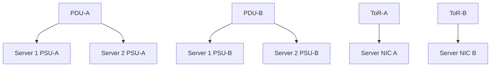
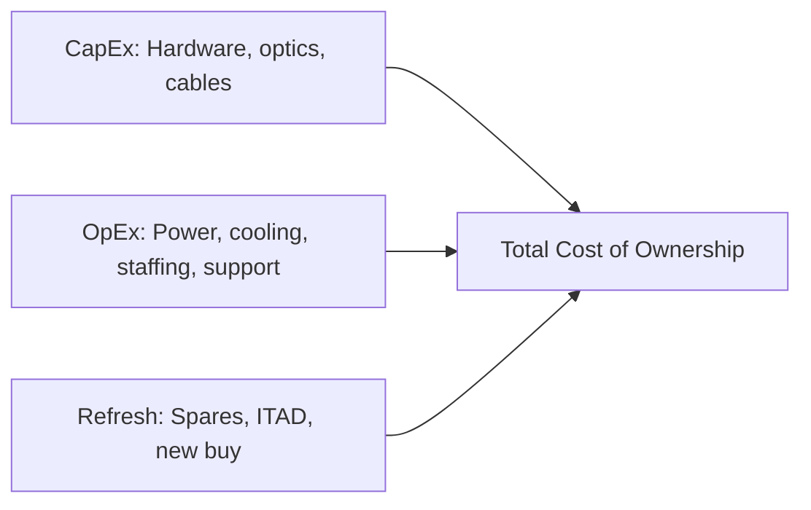
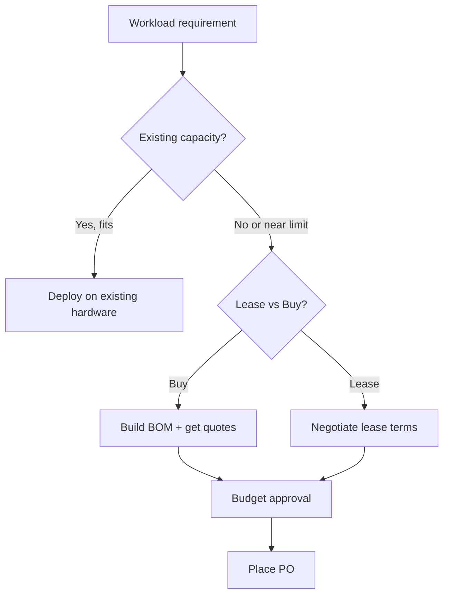
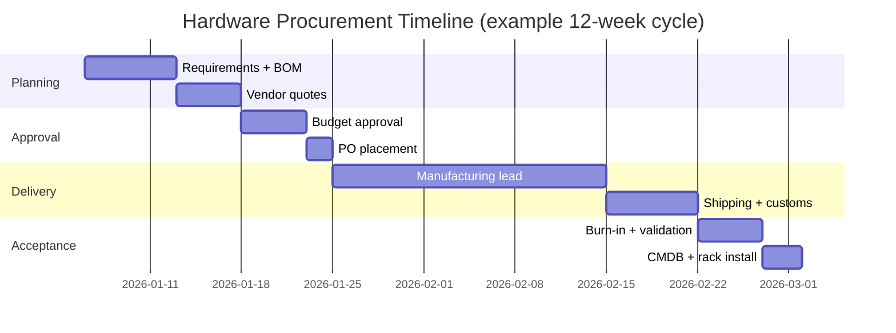

# 1. Hardware Procurement

- **Purpose:** Select production-grade servers, racks, power, and support contracts that match workload, facility, and lifecycle requirements.
- **Style:** Production-oriented, concise bullets, commands, expected outputs, diagrams, and operational guardrails.
- **Audience:** Platform engineers, SREs, systems administrators, datacenter operators, and architects.
- **Use this guide when:** Building, refreshing, or auditing physical server infrastructure.
> **Disclaimer:** Third-party logos and screenshots are used for educational purposes only.

## Procurement goals

- Translate workload requirements into repeatable standard hardware SKUs.
- Avoid under-spec systems that fail within one refresh cycle or over-spec systems with poor utilization.
- Ensure every purchased component has a support path, part number, firmware baseline, and sparing strategy.
- Design for N+1 capacity, maintenance windows, and expected growth over 36–60 months.

## Server form factors

| Form factor | Typical use | Pros | Cons |
| --- | --- | --- | --- |
| 1U rack | Web, edge, dense compute | High density, lower rack cost per node | Less drive/GPU room, louder, hotter |
| 2U rack | General purpose, NVMe, GPU light | Balanced density and expansion | Uses more rack units |
| 4U rack | Storage, GPU, large memory | Many PCIe slots and drive bays | Low density, heavy |
| Blade | Large enterprise chassis | Shared power/network, dense management | Vendor lock-in, chassis cost |
| Tower | Remote office, lab | Quiet, no rack required | Operationally awkward at scale |

### Procurement flow


## Key components

- **CPU:** Intel Xeon and AMD EPYC dominate server platforms; select by core count, clock speed, memory channels, PCIe lanes, and TDP.
- **RAM:** ECC DDR4/DDR5 RDIMMs or LRDIMMs only; populate channels symmetrically.
- **Storage:** NVMe SSD for low-latency workloads, SAS HDD for capacity, SATA SSD for budget-sensitive tiers.
- **NICs:** 1G for management, 10/25G for common production, 100G for storage/HPC fabrics.
- **HBA:** Use for direct disk presentation to the OS or SDS platforms.
- **RAID controller:** Use when controller-managed arrays and cache protection are required.

## CPU selection notes

- Favor higher clock speeds for license-bound databases.
- Favor high core counts for virtualization, analytics, and CI/CD farms.
- Verify VT-x/VT-d, AMD-V/IOMMU, AES-NI, and SR-IOV support where needed.
- Standardize on a small number of CPU SKUs to simplify benchmarking and spares.

## Memory selection notes

- Use vendor-qualified DIMMs only.
- Preserve channel balance across both sockets.
- Leave expansion room when growth is expected.
- Record slot maps for fast field replacement.

## Storage selection notes

- Use mirrored boot media separate from data media where possible.
- Match SSD endurance class to write profile.
- Decide early between hardware RAID, HBA pass-through, and software-defined storage.
- Track firmware and wear metrics from first power-on.

## Major server vendor comparison

| Vendor | Representative models | Strengths | Watch items |
| --- | --- | --- | --- |
| Dell PowerEdge | R660, R760, R760xa | Strong iDRAC, broad ecosystem, mature supply chain | Lifecycle controller update discipline |
| HPE ProLiant | DL360, DL380, DL385 | iLO maturity, enterprise support | Advanced management licensing |
| Lenovo ThinkSystem | SR630, SR650, SR665 | Competitive pricing, reliable XCC | Regional parts variance |
| Supermicro | Ultra, Hyper, BigTwin | Flexible configurations, GPU density | Support quality depends on partner |

## Procurement checklist

- **Workload profile:** CPU-bound, memory-bound, storage-heavy, GPU-bound, or mixed.
- **Availability target:** single node, N+1 cluster, multi-rack, or multi-site.
- **Lifecycle target:** 3-year or 5-year warranty, lease vs buy, planned refresh quarter.
- **CPU:** vendor, generation, sockets, base clock, turbo, TDP.
- **RAM:** total capacity, DIMM size, population plan, spare DIMMs.
- **Storage:** boot disks, data disks, RAID/HBA mode, hot-spare policy.
- **NICs:** speed, port count, PXE support, optic type, cable length.
- **Out-of-band:** BMC license, remote console entitlement, dedicated management port.
- **Power:** PSU wattage, efficiency rating, C13/C19 plug type, A+B feeds.
- **Rails/accessories:** rails, cable-management arms, bezels, labels, cage nuts.
- **Compliance:** TPM 2.0, secure boot, encryption needs, FIPS posture.
- **Operations:** supported OS matrix, firmware cadence, monitoring integration.

## Network equipment

- ToR switches fit smaller pods and straightforward cabling.
- Spine-leaf fits east-west heavy, multi-rack scaling.
- Firewalls must be sized for real throughput with security features enabled.
- Load balancers can be appliances, software HAProxy, or NGINX-based pairs.
- Budget optics, DACs, patch cords, patch panels, and transceivers in the BOM.

## Rack planning

- Keep steady-state power below ~70–80% of circuit capacity.
- `208V x 30A ≈ 6.24 kW raw`; use derated usable capacity for design.
- `1 watt ≈ 3.412 BTU/hr` for cooling calculations.
- Place heavy servers low in the rack.
- Use color-coded A/B power and network classes.
- Preserve service loops and label both cable ends.

## PDU types

| PDU type | Use case | Advantage | Limitation |
| --- | --- | --- | --- |
| Basic | Low-cost racks | Simple and reliable | No visibility |
| Metered | Power trending | Input/output readings | No remote control |
| Switched | Remote reboot and outlet control | Operational flexibility | Higher cost, secure carefully |
| ATS | Single-cord devices | Automatic source transfer | Not a substitute for dual PSUs |

## UPS sizing example

- **Formula:** UPS VA ≈ total watts / power factor.
- **Example load:** 8 servers x 450W + 2 switches x 180W + firewall 220W = 4,180W.
- **At PF 0.9:** 4,180 / 0.9 ≈ 4,645 VA minimum.
- **Design target:** choose 6–8 kVA to preserve runtime and growth.

### Receipt validation commands

```bash
dmidecode -t system | egrep "Manufacturer|Product Name|Serial Number"
lscpu | egrep "Model name|Socket|Core|Thread"
lsblk -d -o NAME,SIZE,MODEL
ip -br link
```

**Expected output**

```text
Manufacturer: Dell Inc.
Product Name: PowerEdge R760
Serial Number: ABCD123
Model name: Intel(R) Xeon(R) Gold 6430
Socket(s): 2
Core(s) per socket: 32
Thread(s) per core: 2
nvme0n1 3.5T PM9A3
ens1f0 UP
```

## BOM template

| Item | Qty | Part number | Unit cost | Support term | Notes |
| --- | --- | --- | --- | --- | --- |
| 2U server chassis | 12 | R760-BASE | $ | 5 years 24x7 | Dual CPU |
| CPU kit | 24 | XEON-6430 | $ | Included | 2 per server |
| 64 GB ECC DIMM | 96 | DDR5-64G | $ | Included | 8 per server |
| 3.84 TB NVMe | 48 | NVME-3.84T | $ | 5 years | 4 per server |
| 25G dual-port NIC | 12 | OCP-25G | $ | 5 years | LACP uplinks |
| Switched PDU | 4 | PDU-SW-32A | $ | 3 years | A/B per rack |

### Example rack view



## Lead times and vendor SLA

- Standard compute nodes may ship in 2–6 weeks; GPU/high-NVMe builds often take longer.
- Validate support start date, replacement SLA, and regional spare stock.
- Demand firmware matrix and known issue advisories before accepting shipment.
- Keep at least one spare node per major SKU per site.
- Document RMA workflow and who opens vendor cases.

## Burn-in and acceptance testing

- Run 24–48 hours of stress tests before accepting hardware into production.
- Use `stress-ng`, `memtester`, `fio`, and `iperf3` to exercise CPU, memory, storage, and NICs.
- Compare observed power draw against vendor spec sheet.
- Validate all DIMM slots, NVMe slots, and network ports, not only the populated ones.

### Burn-in commands

```bash
stress-ng --cpu 0 --vm 2 --vm-bytes 80% --timeout 12h &
memtester 8192 5
fio --name=burnin --filename=/dev/nvme0n1 --rw=randrw --bs=4k --size=10G --direct=1 --runtime=600
iperf3 -c 10.20.30.1 -t 120 -P 4
```

**Expected output**

```text
stress-ng: info: [3241] successful run completed in 43200.00s
memtester: Done.
iperf3: [ ID] Interval     Transfer   Bitrate
iperf3: [SUM] 0-120s  27.3 GBytes  1.96 Gbits/sec
```

## Sparing strategy

| SKU class | Recommended spare ratio | Storage rationale |
| --- | --- | --- |
| Compute 1U/2U | 1 per 10 nodes | Short swap time |
| Storage server | 1 per 6 nodes | Drives are the real spare |
| NVMe drive | 10% of fleet population | High write amplification risk |
| DIMM | 4–8 per server SKU | Single DIMM failures are common |
| NIC | 2 per server SKU | Port/controller failures |
| PSU | 2 per server SKU | Hot-swap, instant recovery |
| Optic/DAC | 5% of population | Failures during cable pulls |

## Receiving and physical inspection

- Inspect packaging for crush damage, moisture indicators, and tilt warnings.
- Match serial numbers and part numbers against the purchase order line-by-line.
- Power on in staging area before racking — do not rack blind.
- Photograph front and rear of each server and file with asset record.
- Run `dmidecode` and save output for every node as an as-received baseline.

```bash
dmidecode > /var/lib/cmdb/$(hostname)-dmidecode-$(date +%F).txt
lshw -xml > /var/lib/cmdb/$(hostname)-lshw-$(date +%F).xml
```

## Vendor SLA matrix

| SLA tier | Response | Parts on-site | Use case |
| --- | --- | --- | --- |
| 4-hour on-site | 4 h | Pre-positioned | Production critical |
| NBD on-site | Next business day | Shipped same day | Tier-2 production |
| 5x9 NBD | Business hours | Standard depot | Dev/staging |
| Return-to-depot | Weeks | Ship-in | Lab/test |

- Verify ProSupport/CarePack/ThinSystem service IDs in vendor portal before go-live.
- Confirm coverage includes parts, labour, and remote diagnosis.
- Record contract number, start date, end date, and renewal owner in CMDB.

## Green and sustainability considerations

- Match CPU TDP and density to cooling capacity to avoid thermal throttling.
- Choose PSU efficiency ratings of 80 PLUS Platinum or Titanium.
- Right-size DIMM population — fully populated lightly loaded DIMMs waste idle power.
- Plan hardware refresh on a schedule that balances performance-per-watt gains against embodied carbon of new hardware.
- Follow vendor ITAD/recycling programs at end-of-life.

### Total lifecycle cost model



## GPU and accelerator procurement

- GPU servers require extra power budget (typically 300–700 W per GPU), reinforced floors, and adequate cooling.
- Verify PCIe generation and lane count between CPU and GPU slots; PCIe 5.0 x16 is the current standard for A100/H100 class cards.
- Use NVLink bridges for GPU-to-GPU memory when workloads require cross-GPU coherency.
- Validate HBM memory type, GDDR6 configuration, and cooling solution (air, SXM, or liquid-cooled).
- Track GPU firmware (VBIOS) and driver compatibility with each OS/kernel version.

```bash
nvidia-smi --query-gpu=name,pci.bus_id,power.draw,temperature.gpu,memory.total --format=csv
```

**Expected output**

```text
name, pci.bus_id, power.draw [W], temperature.gpu, memory.total [MiB]
NVIDIA H100 SXM5 80GB, 00000000:03:00.0, 380.00 W, 42, 81559 MiB
```

## Networking equipment BOM

- Include transceivers in BOM by part number; multivendor optics must be validated against switch compatibility matrix.
- Budget DAC cables for in-rack connections (cheaper, lower power) and active optical cables (AOCs) for inter-rack runs.
- Procure spare transceivers at 5–10% of installed count.
- Document optic type, wavelength, reach, and switch firmware requirements for each transceiver type.

| Cable type | Distance | Cost | Latency |
| --- | --- | --- | --- |
| Passive DAC | Up to 5m | Low | Sub-nanosecond |
| Active DAC | Up to 10m | Medium | Negligible |
| AOC | Up to 100m | Higher | Negligible |
| QSFP28 SR4 | Up to 100m (fiber) | Medium | Negligible |
| QSFP28 LR4 | Up to 10km (fiber) | High | Negligible |

## Contract and legal considerations

- Confirm hardware export compliance (ECCN numbers, ITAR, BIS restrictions) before purchasing high-performance compute.
- Review warranty transfer policy if the hardware will be relocated or sold.
- Confirm service contract terms for on-site dispatch, parts exclusions, and firmware support obligations.
- Retain all invoices, packing slips, and serial number records for insurance and compliance audits.

## Capacity planning at procurement time

- Size servers for peak-plus-headroom: assume 70–80% steady-state utilization to leave room for failure and growth.
- Model rack-level power including two-PDU overhead, switch power, and patch panel power.
- Project memory growth: many workloads double memory requirements within 18 months.
- Include management overhead: BMC network, switch uplinks, cabling, and cage nuts add up.

### Compute sizing table example

| Workload | CPU cores | RAM | NVMe | NIC | Notes |
| --- | --- | --- | --- | --- | --- |
| Web tier | 32 | 64 GiB | 2× 960G | 2×25G | Low storage, high egress |
| App tier | 64 | 256 GiB | 2×1.9T | 2×25G | Java heap sizing |
| Database | 64 | 512 GiB | 4×3.84T | 2×25G+2×25G storage | NVMe write endurance |
| Object store | 32 | 128 GiB | 12×7.68T | 2×100G | Throughput-bound |
| Analytics | 128 | 1 TiB | 8×3.84T | 2×100G | In-memory compute |

## Deferred purchasing and lifecycle overlap

- Never refresh an entire fleet in a single wave; stagger purchases by 12–18 months to spread budget and risk.
- Overlap refresh waves: new nodes arrive before old nodes are decommissioned so workload migration can proceed safely.
- Negotiate multi-year purchase agreements to lock in pricing and guarantee availability.
- Pre-negotiate a trade-in or certified-pre-owned resale program with vendor for decommissioned hardware.

### Procurement decision tree



## Troubleshooting

- If quotes differ wildly, normalize CPU generation, DIMM count, RAID/HBA mode, NIC speed, and warranty term.
- If rack power is tight, lower density or request higher-voltage feeds before ordering.
- If received hardware deviates from BOM, quarantine it until PO and serials are reconciled.
- If optics fail link-up, verify vendor coding and supported transceiver matrix.
- If burn-in reveals high error rates, document the failure with serial, part number, and test output before raising an RMA.
- If lead times extend, engage secondary vendors early and check certified-refurbished options to bridge gaps.

## Procurement quick-reference checklist

Use this as a final gate before submitting a purchase order:

- [ ] Workload requirements documented (CPU, memory, storage, NIC profiles).
- [ ] Rack and power capacity confirmed with facilities team.
- [ ] BOM reviewed by network, storage, and security stakeholders.
- [ ] Vendor support entitlements confirmed (24×7, NBD, or 4-hour).
- [ ] Firmware compatibility matrix reviewed against target OS.
- [ ] Sparing strategy approved (drives, DIMMs, NICs, PSUs).
- [ ] CMDB/IPAM pre-staged with hostnames, IPs, and rack positions.
- [ ] Burn-in plan documented with acceptance criteria.
- [ ] Delivery address, dock hours, and remote-hands coordination confirmed.
- [ ] Export compliance checked if GPU/HPC hardware is included.

## Vendor relationship and escalation

- Assign a named technical account manager (TAM) for sites with more than 50 nodes.
- Establish a quarterly business review (QBR) to align roadmap, firmware advisories, and renewal timelines.
- Document the vendor escalation path: support case → TAM → account team → executive sponsor.
- Subscribe to vendor security advisory mailing lists and process notifications within 48 hours.

### End-to-end procurement timeline



## Official references

- [Dell PowerEdge documentation](https://www.dell.com/support/home/en-us/product-support/product/poweredge-r760/docs)
- [HPE ProLiant docs](https://support.hpe.com/connect/s/product?language=en_US)
- [Lenovo ThinkSystem documentation](https://pubs.lenovo.com/)
- [Supermicro support portal](https://www.supermicro.com/support/)
- [APC UPS sizing guidance](https://www.apc.com/us/en/tools/ups_selector/)
