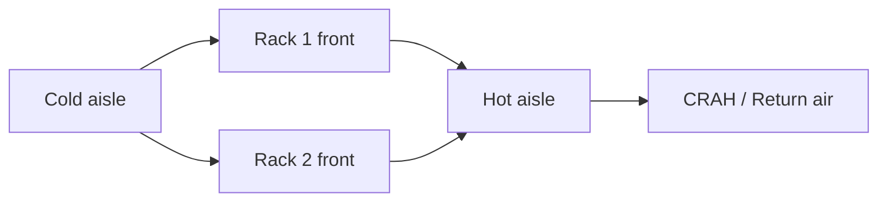
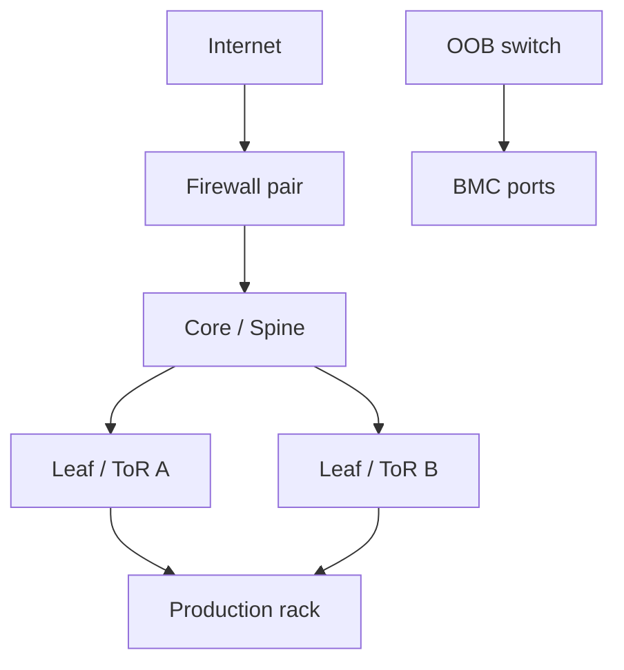
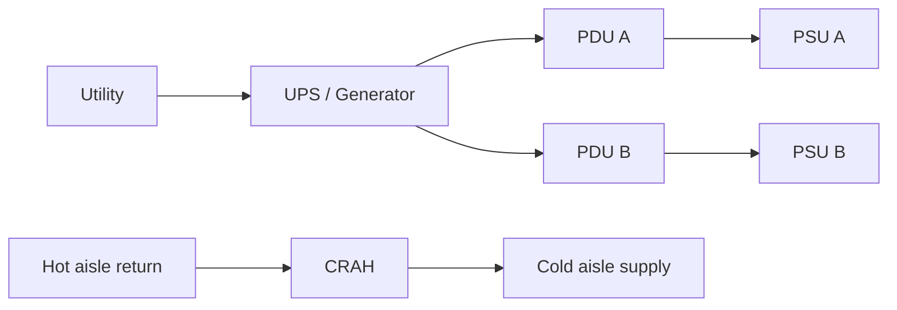
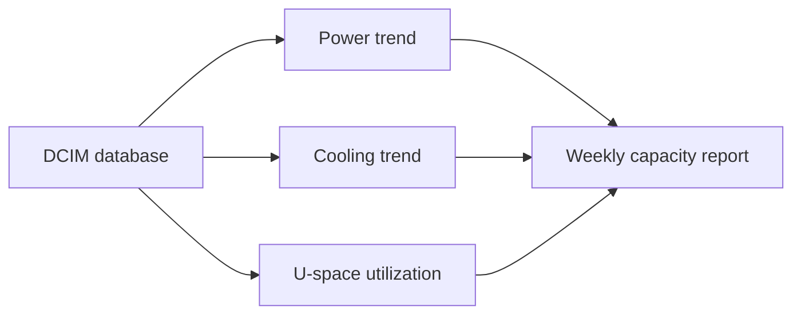
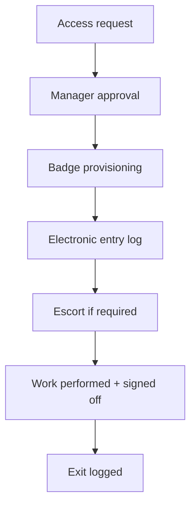
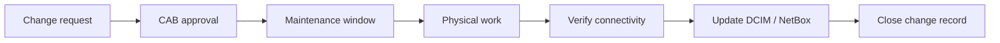
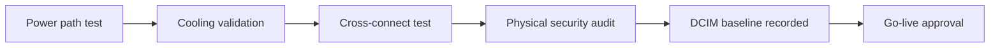

# 2. Datacenter Setup

- **Purpose:** Prepare the facility, rack rows, power, cooling, cabling, and physical controls required for reliable production bare-metal operations.
- **Style:** Production-oriented, concise bullets, commands, expected outputs, diagrams, and operational guardrails.
- **Audience:** Platform engineers, SREs, systems administrators, datacenter operators, and architects.
- **Use this guide when:** Building, refreshing, or auditing physical server infrastructure.
> **Disclaimer:** Third-party logos and screenshots are used for educational purposes only.

## Datacenter tier overview

| Tier | Concept | Typical annual availability | Notes |
| --- | --- | --- | --- |
| Tier I | Basic capacity | ~99.671% | Single path, limited redundancy |
| Tier II | Redundant components | ~99.741% | Some resilience, single distribution path |
| Tier III | Concurrently maintainable | ~99.982% | Maintenance without full shutdown |
| Tier IV | Fault tolerant | ~99.995% | Multiple active paths, highest cost |

## Colocation vs owned facility

| Model | Strengths | Trade-offs | Best fit |
| --- | --- | --- | --- |
| Colocation | Fast go-live, carrier access, shared building services | Ongoing MRC, facility policy constraints | Most enterprises |
| Owned facility | Full control, custom design, long-term economics at scale | CapEx heavy, staffing intensive | Large enterprises |

### Rack row layout



## Site readiness checklist

- Confirm floor loading limits, loading dock access, staging space, and remote-hands policy.
- Document A+B power availability, breaker ratings, connector types, and rack allocations.
- Reserve cross-connects, meet-me room routes, and provider demarc details.
- Validate fire suppression type and after-hours access procedures.
- Ensure DCIM/IPAM/CMDB records exist before first hardware arrival.

## Rack installation standards

- Install racks square, anchored, and grounded per facility standards.
- Fit rails before loading hardware.
- Use cable-management arms only when rack depth and airflow allow them.
- Place blanking panels in unused U-space.
- Label rack, U position, asset tag, hostname, and power source consistently.

## Labeling standards

- Follow TIA-606 style labels for racks, patch panels, copper runs, fiber trunks, and ports.
- Example rack name: `DC1-R05-A12`.
- Example server label: `DC1-R05-A12-U18 app-bm-01`.
- Example cable label pair: `DC1-R05-A12-U18:ens1f0 -> LEAF01:Eth1/17`.

## Power design

- Provide A+B redundant feeds to every dual-cord device.
- Keep continuous load at or below 80% of breaker capacity.
- Balance servers across phases and PDUs.
- Use metered or switched PDUs for visibility and remote recovery.
- Monitor branch current, input voltage, and outlet utilization.

### Checking power telemetry

```bash
ipmitool dcmi power reading
```

**Expected output**

```text
Instantaneous power reading: 412 Watts
Average power reading over sample period: 423 Watts
```

## Cooling design

- Use hot aisle/cold aisle containment when density is high.
- CRAC uses refrigerant cooling; CRAH uses chilled water.
- Raised floor helps in established underfloor-air designs; overhead is simpler in many modern sites.
- Keep perforated tiles only in cold aisles.
- Monitor top-of-rack inlet temperature, not just room average.

## Network cabling

| Medium | Typical use | Distance | Note |
| --- | --- | --- | --- |
| Cat6a | 1/10G copper | Up to 100 m | Good for management and short server runs |
| OM3 | 10/40G multimode | Short to medium | Legacy but common |
| OM4 | 10/25/40/100G multimode | Medium | Preferred for in-room fiber |
| OS2 | Single-mode | Long distance | Best for campus/inter-building |

## Physical security controls

- Use badge + biometric or MFA access for production cages/rooms.
- Require CCTV coverage for entrances, aisles, and loading areas.
- Use mantraps where compliance requires anti-tailgating control.
- Install door, motion, humidity, smoke, and water-leak sensors.
- Maintain visitor logs and escort policy.

### Rack and network topology



## DCIM and environmental management

- Track rack elevations, power draw, asset position, and cable paths.
- Poll smart PDUs, UPSs, CRAC/CRAH, and environmental sensors into monitoring.
- Define alert thresholds for inlet temp, humidity, smoke, water leak, and door-open events.
- Review trends monthly to identify hot racks and stranded power.

## Fire suppression

- Common options: pre-action dry pipe, clean agent, and inert gas systems.
- Document shutdown/interlock behavior before production go-live.
- Protect floor and ceiling penetrations to preserve containment.

### Power and cooling concept



## Environmental monitoring

- Deploy temperature, humidity, airflow, smoke, water-leak, and door-open sensors.
- Integrate sensors into a central DCIM or monitoring platform (Nagios/Prometheus/Zabbix).
- Alert on inlet temp above 27°C, humidity outside 40–60%, or any water-leak event.
- Review trends weekly; spikes near rack tops usually indicate a blanking-panel gap or containment breach.

### Sensor alert thresholds

| Sensor | Warning | Critical | Action |
| --- | --- | --- | --- |
| Inlet air temp | > 24°C | > 27°C | Investigate airflow; raise CRAH setpoint |
| Humidity | < 35% / > 65% | < 25% / > 75% | HVAC review; ESD risk |
| Water leak | Any reading | Any reading | Evacuate hardware; alert facility manager |
| Smoke | Any reading | Any reading | Fire response per facility SOP |

## Power monitoring and trending

- Poll smart PDUs via SNMP or vendor API for per-outlet readings.
- Track branch circuit utilization over 30/90-day periods.
- Alert when any circuit exceeds 80% of rated breaker amperage.
- Use trending data to defer or accelerate hardware installs against facility limits.

```bash
snmpwalk -v2c -c public pdu01.mgmt.example.com .1.3.6.1.4.1.318.1.1.26
```

**Expected output**

```text
.1.3.6.1.4.1.318.1.1.26.6.3.1.5.1 = INTEGER: 412
```

## Cable management standards

- Use color-coded patch cords by network zone: blue for management, yellow for production, red for storage, grey for backup.
- Maintain consistent cable lengths; avoid coiling excess.
- Route power and network in separate trays on opposite sides of the rack.
- Document every cable end-to-end in DCIM before cutover.
- Photograph patch panel and switch port labeling after each install.

## Grounding and bonding

- Every rack frame must connect to the facility ground bar.
- Verify ground continuity with a multimeter before powering equipment.
- PDU metal chassis should be bonded to rack frame.
- Improper grounding manifests as intermittent NIC errors and hard-to-reproduce crashes.

## Capacity tracking

| Resource | Metric | Warning | Action |
| --- | --- | --- | --- |
| Power | % of circuit capacity | > 70% | Rebalance or add circuit |
| Cooling | Inlet temp trend | Rising > 2°C/week | Audit blanking panels, CRAH load |
| Rack U-space | % occupied | > 85% | Evaluate adjacent rack or consolidation |
| Cross-connects | Count vs available ports | > 80% | Order additional capacity |

### Capacity planning dashboard



## Network infrastructure in the datacenter

- Deploy management switches in dedicated 1U slots at the top or bottom of each rack.
- Use separate out-of-band management switches; never share with production.
- Document inter-switch trunk ports and VLAN lists in DCIM before go-live.
- Test failover of each network path before production traffic is admitted.

## Physical access and audit

- Maintain an electronic visitor log with badge scans at every cage or room boundary.
- Require two-person integrity for critical hardware changes (servers, switches, cabling).
- Conduct quarterly audits comparing CMDB rack elevations to physical installs.
- Document every cable touch in a change record to support incident correlation.

### Site access flow



## Structured cabling standards

- Follow TIA-568 for copper and TIA-942 for datacenter infrastructure standards.
- Fiber optic terminations must be cleaned and tested with a power meter and OTDR before go-live.
- Use fiber patch panels with labeled breakout for every trunk.
- Certify all copper runs to Cat6a specification; document test results.

```bash
# From a server, test fiber link speed and FEC status
ethtool ens1f0 | egrep "Speed|Duplex|FEC|Auto-neg"
```

**Expected output**

```text
Speed: 25000Mb/s
Duplex: Full
Auto-negotiation: on
```

## Generator and UPS integration

- UPS provides bridging power for generator start time (typically 10–30 seconds).
- Generator transfer switch must cut over cleanly; test under load annually.
- Maintain generator fuel supply for minimum 72 hours of runtime.
- Monitor generator status, fuel level, and battery health in DCIM.
- Document generator test schedule and results for compliance audits.

## Hot aisle/cold aisle containment installation

- Seal all front-panel cable penetrations to prevent short-circuit airflow.
- Blanking panels are mandatory in every unused U-space.
- Use chimney racks or rear-door heat exchangers for very high-density racks (>15 kW).
- Verify total rack inlet face area versus CRAH airflow capacity per aisle before final layout.

```bash
# Prometheus alert rule for thermal event
# (assuming node_hwmon_temp_celsius exported by node_exporter)
```

## Change management for the physical layer

- Every physical change (cable move, server install, PDU rebalance) must be in a change record.
- Out-of-hours changes require a maintenance window, rollback plan, and on-call coverage.
- Assign unique change IDs to every cable label change so incidents can be correlated.
- After each change, update DCIM/NetBox and verify affected systems are healthy before closing.

### Physical change workflow



## Colocation vendor evaluation

- Evaluate: power availability, cooling headroom, carrier options, latency to key peering points, SLA terms, and compliance certifications (SOC2, ISO 27001, PCI DSS).
- Inspect the facility in person; request a current audit report and uptime/incident history.
- Negotiate cross-connect pricing — it can exceed server costs at scale.
- Confirm remote hands SLA, cost per incident, and whether they can execute runbooks.

| Colo feature | Minimum acceptable | Best-in-class |
| --- | --- | --- |
| Power redundancy | 2N circuits | 2N+1 with generator |
| Cooling | N+1 CRAH | N+2 with chilled water |
| Physical security | Card + PIN | Card + biometric + mantrap |
| Remote hands SLA | < 4 hours | < 1 hour with CCTV confirmation |
| Carrier choices | ≥ 2 diverse providers | ≥ 4 with diverse meet-me rooms |

## Commissioning and acceptance testing

- Perform a full load bank test on UPS and generator before accepting facility contract.
- Verify CRAC/CRAH setpoints and confirm inlet air temperature meets ASHRAE A2 class (< 35°C max).
- Walk every rack row before go-live to confirm blanking panels, cable routing, and grounding.
- Test a planned power path maintenance scenario before production traffic arrives.

```bash
# From a server, confirm A + B power path independence
ipmitool dcmi power reading
ipmitool sensor get "PS1 Status" "PS2 Status"
```

**Expected output**

```text
Instantaneous power reading: 412 Watts
PS1 Status | 0x01 | ok
PS2 Status | 0x01 | ok
```

## Network interconnect planning

- Plan cross-connects before hardware arrives; lead times can be 2–6 weeks.
- Document demarcation point, patch panel port, and LOA (Letter of Authorization) for each circuit.
- Maintain a circuit inventory with carrier, bandwidth, latency, and expiry date.
- Test new circuits end-to-end before cutting production traffic.

### Site commissioning checklist



## Troubleshooting

- If racks run hot at the top, add blanking panels and verify containment integrity.
- If breaker trips occur, compare real current draw to planning assumptions and rebalance feeds.
- If labels are inconsistent, stop new installs until the naming standard is enforced.
- If remote hands mispatch cables, provide endpoint-mapped instructions and port photos.

## Official references

- [Uptime Institute tier overview](https://uptimeinstitute.com/tiers)
- [TIA overview](https://www.tiaonline.org/)
- [ASHRAE datacom resources](https://www.ashrae.org/technical-resources/bookstore/datacom-series)
- [Schneider Electric datacenter resources](https://www.se.com/us/en/work/solutions/for-business/data-centers-and-networks/)
- [NetBox documentation](https://netbox.readthedocs.io/en/stable/)
