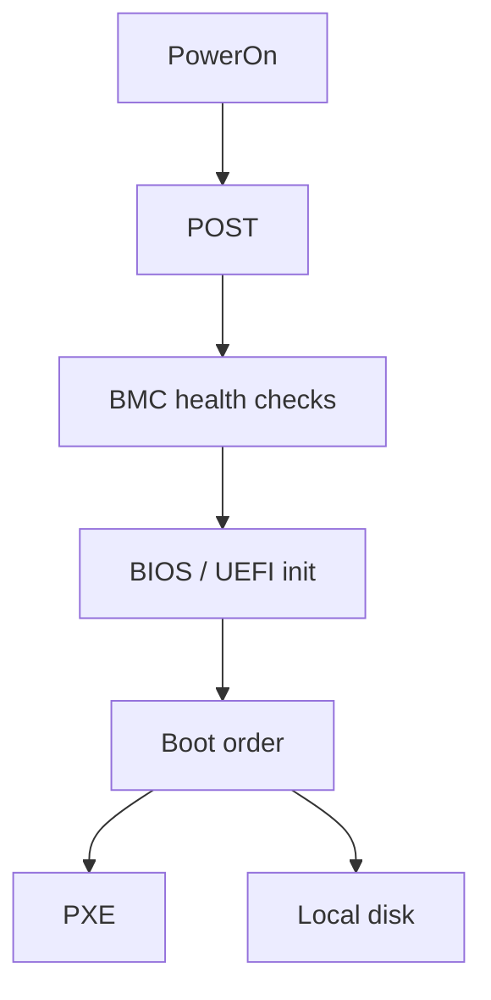
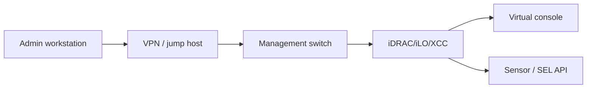
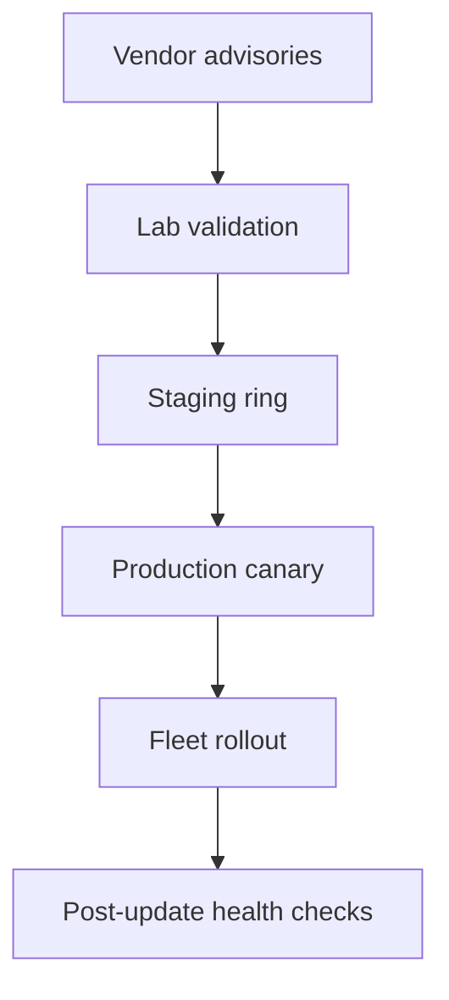
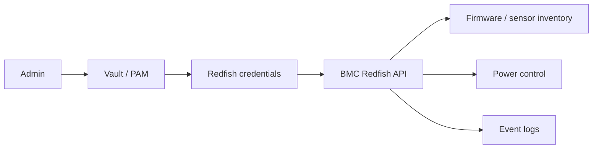

# 3. Server BIOS and Firmware

- **Purpose:** Standardize low-level platform settings so every node boots consistently, performs predictably, and remains remotely manageable.
- **Style:** Production-oriented, concise bullets, commands, expected outputs, diagrams, and operational guardrails.
- **Audience:** Platform engineers, SREs, systems administrators, datacenter operators, and architects.
- **Use this guide when:** Building, refreshing, or auditing physical server infrastructure.
> **Disclaimer:** Third-party logos and screenshots are used for educational purposes only.

## BIOS vs UEFI

| Attribute | Legacy BIOS | UEFI |
| --- | --- | --- |
| Boot method | MBR and legacy option ROM | GPT, EFI system partition |
| Security | Limited | Secure Boot, TPM integration |
| Recommendation | Use only for legacy constraints | Preferred for modern production |

### Boot path overview



## Baseline BIOS/UEFI settings

- Set boot mode to UEFI unless a legacy dependency is documented.
- Put PXE first only during provisioning windows; restore local disk first afterward.
- Enable virtualization features: VT-x/VT-d or AMD-V/IOMMU, plus SR-IOV when used.
- Set power profile to Maximum Performance for latency-sensitive systems.
- Review NUMA, memory interleaving, C-state, turbo, and SMT settings against benchmarks.

## BMC platform mapping

| Vendor | Management plane | Typical utility | Notes |
| --- | --- | --- | --- |
| Dell | iDRAC | racadm | Lifecycle Controller integration |
| HPE | iLO | hponcfg / REST | Advanced features may require license |
| Lenovo | XCC | OneCLI / XClarity | Strong API support |
| Generic | IPMI / Redfish | ipmitool / curl | Validate cipher suites and TLS policy |

### Checking BMC network settings

```bash
ipmitool lan print 1
```

**Expected output**

```text
IP Address Source : Static Address
IP Address        : 10.10.10.41
Default Gateway IP: 10.10.10.1
```

## Out-of-band management setup

- Place BMCs on a dedicated management VLAN.
- Assign static IPs or DHCP reservations and record serials and asset tags.
- Enable HTTPS/Redfish, disable weak ciphers, and rotate default credentials immediately.
- Validate virtual console and virtual media before remote-only windows.
- Collect sensor and SEL telemetry into monitoring.

### OOB management network



## Firmware update procedures

- Use vendor-supported bundles: Dell DSU, HPE SPP, Lenovo UpdateXpress.
- Validate in lab, then staging, then production canary, then fleet rollout.
- Track BIOS, BMC, NIC, RAID, HBA, disk, and PSU firmware as one compatibility set.
- Schedule updates during approved windows and capture rollback options.

### Example Dell update flow

```bash
dsu --inventory
dsu --preview
dsu --apply-upgrades
```

**Expected output**

```text
Applicable updates found: BIOS, iDRAC, NIC
A reboot is required to complete installation.
```

## RAID level comparison

| RAID | Minimum disks | Strength | Trade-off |
| --- | --- | --- | --- |
| 0 | 2 | Performance | No redundancy |
| 1 | 2 | Simple mirror | 50% usable capacity |
| 5 | 3 | Capacity efficient | Rebuild risk on large disks |
| 6 | 4 | Two-disk fault tolerance | Write penalty |
| 10 | 4 | Strong performance + redundancy | 50% usable capacity |
| 50 | 6 | Scaled RAID5 sets | Complexity |
| 60 | 8 | Scaled RAID6 sets | Higher overhead |

## RAID controller guidance

- Use RAID1 for boot disks.
- Use RAID10 for write-heavy local data sets when hardware RAID is required.
- Prefer HBA/pass-through for Ceph, ZFS, or mdadm-based designs.
- Enable write-back cache only when cache protection is healthy.
- Document array layout, stripe size, and hot-spare policy.

## TPM and Secure Boot

- Enable TPM 2.0 and initialize ownership per OS policy.
- Enable Secure Boot for standard enterprise Linux builds.
- Document any disablement as a tracked exception.

### Firmware lifecycle



## Power management profiles

| Profile | Use case | Trade-off |
| --- | --- | --- |
| Maximum Performance | Latency-sensitive workloads | Higher idle power |
| Balanced | General purpose | Moderate idle power |
| Power Saving | Dev / overnight workloads | Reduced performance |
| OS Control | Kernel governor manages P/C-states | Requires kernel tuning |

- Disable Turbo Boost only when benchmark tests show benefit (rare).
- Set C-states to C1/C1E only for latency-sensitive DPDK or real-time workloads.
- Document chosen profile in CMDB for every SKU class.

## NUMA topology validation

```bash
numactl --hardware
lscpu | egrep "NUMA|Socket|Core"
lstopo --of txt
```

**Expected output**

```text
available: 2 nodes (0-1)
node 0 cpus: 0-31 64-95
node 0 size: 196608 MB
node 1 cpus: 32-63 96-127
```

- Pin memory-intensive workloads to local NUMA nodes to avoid cross-socket latency.
- Align VM vCPU and vMem assignments to single NUMA nodes where possible.

## BMC user and credential management

- Remove or disable all default vendor accounts on first power-on.
- Create role-based accounts: read-only for monitoring, operator for ops, admin for break-glass.
- Enforce password complexity and 90-day rotation policy in ITSM.
- Store break-glass credentials in a PAM/vault solution (HashiCorp Vault, CyberArk).
- Enable LDAP/AD integration where supported to avoid local account sprawl.

```bash
racadm set idrac.users.2.enable 0
racadm set idrac.users.3.username ops-readonly
racadm set idrac.users.3.privilege 0x1
```

**Expected output**

```text
[Key=idrac.Embedded.1#Users.2]
Object value modified successfully
```

## Redfish API overview

- Dell, HPE, Lenovo, and Supermicro all support DMTF Redfish as a REST API for hardware management.
- Use Redfish for automated firmware inventory, sensor polling, and power control.

```bash
curl -sk -u admin:password https://bmc-host/redfish/v1/Systems/System.Embedded.1 \
  | python3 -m json.tool | grep -E '"Model|PowerState|MemorySummary"'
```

**Expected output**

```text
"Model": "PowerEdge R760",
"PowerState": "On",
"TotalSystemMemoryGiB": 256
```

### Redfish management flow



## Post-update validation checklist

- [ ] Server posts cleanly with no new SEL errors.
- [ ] All sensors show normal readings.
- [ ] RAID arrays are optimal (not rebuilding unless expected).
- [ ] BMC remote console is accessible.
- [ ] Network interfaces are up and at expected speed.
- [ ] OS boots and passes health checks.
- [ ] Monitoring agent and node exporter are reporting.

## Secure Boot and measured boot

- UEFI Secure Boot ensures only signed bootloaders, kernels, and drivers are executed.
- Verify Secure Boot state from OS: `mokutil --sb-state`.
- For custom kernels, sign modules with a machine-owner key (MOK) enrolled via `mokutil --import`.
- Measured boot extends PCR values into TPM; use `tpm2-tools` to verify attestation.

```bash
mokutil --sb-state
tpm2_pcrread sha256:0,1,2,3,7
```

**Expected output**

```text
SecureBoot enabled
sha256:
  0 : 0x...
  7 : 0x...  (Boot Services driver execution measurements)
```

## BIOS configuration templates

- Create a vendor-specific BIOS configuration template (XML export for Dell/iDRAC, HPONCFG XML for HPE, LXCE for Lenovo).
- Apply templates via automation to ensure every node has identical settings.
- Store templates in version control and diff them against live nodes during audits.

```bash
# Dell: export current BIOS settings
racadm get BIOS > bios_baseline_$(hostname)_$(date +%F).cfg
# Apply template to fleet
racadm set -f bios_template.cfg
```

**Expected output**

```text
[Key=BIOS.Setup.1-1]
Object value modified successfully
```

## Out-of-band monitoring integration

- Integrate BMC IPMI/Redfish endpoints with Prometheus `ipmi_exporter` or Zabbix IPMI templates.
- Collect: fan speed, CPU temperature, inlet temperature, power consumption, PSU status, and DIMM errors.
- Alert on any SEL entry with severity "critical" or above.

```bash
# ipmi_exporter (Prometheus)
cat > /etc/ipmi_exporter/config.yml <<'EOF'
modules:
  default:
    user: monitoring
    pass: changeme
    privilege: user
    driver: LAN_2_0
    timeout: 10s
    collectors: [bmc, ipmi, dcmi, sel]
EOF
systemctl enable --now ipmi_exporter
curl -s http://localhost:9290/metrics | grep ipmi_fan_speed
```

## Firmware inventory and drift detection

- Maintain a firmware baseline document per hardware SKU including: BIOS, BMC, NIC, RAID/HBA, disk firmware.
- Compare live node firmware against baseline weekly using vendor tools or Redfish API.
- Alert when any component deviates from the approved baseline.

```bash
# Dell: inventory all component firmware versions
racadm getversion
# Or via ipmitool for generic baseline
ipmitool mc info | egrep "Firmware|Manufacturer"
```

**Expected output**

```text
Firmware Revision         : 7.00.00.173
Manufacturer ID           : Dell Inc.
```

## BMC network hardening

- Restrict BMC access to the management VLAN only — production and storage networks must never reach BMC ports.
- Disable BMC features not in use: SNMP v1/v2 (prefer v3), older cipher suites, and telnet interfaces.
- Enable audit logging on the BMC for all login, logout, and power-control events.
- Rotate BMC passwords on the same schedule as OS accounts (minimum 90 days).

## Troubleshooting

- If a system boots intermittently after firmware updates, restore the baseline BIOS template and reapply only approved deviations.
- If virtual media fails, verify BMC licensing, OOB ACLs, and browser compatibility.
- If arrays disappear after a controller update, check imported foreign configuration prompts and controller mode.
- If performance drops after BIOS changes, compare power profile, C-states, SMT, and NUMA settings to the benchmark baseline.

## Official references

- [Dell DSU docs](https://www.dell.com/support/kbdoc/en-us/000130590/dell-system-update-dsu)
- [HPE Service Pack for ProLiant](https://techlibrary.hpe.com/us/en/enterprise/servers/products/service_pack/spp/index.aspx)
- [Lenovo XClarity / UpdateXpress docs](https://pubs.lenovo.com/)
- [ipmitool project](https://github.com/ipmitool/ipmitool)
