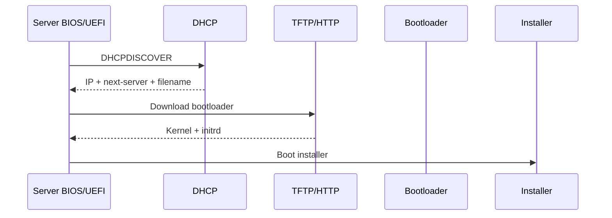
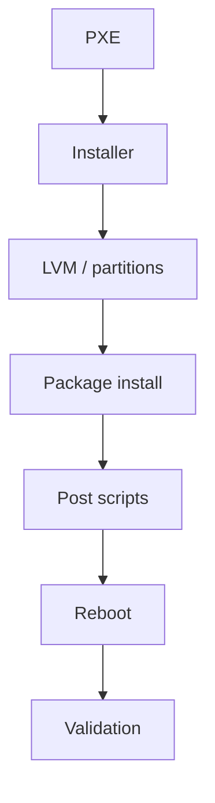
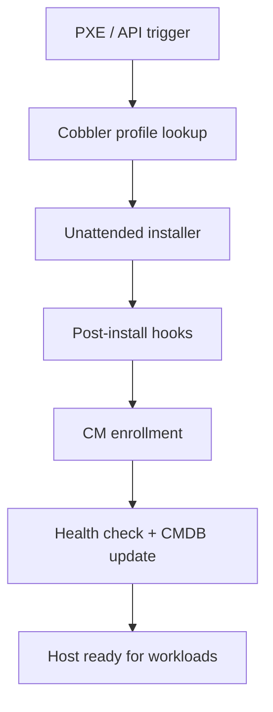

# 4. Operating System Installation

- **Purpose:** Automate consistent Linux installation on physical servers using PXE, Kickstart, Preseed, and post-install validation.
- **Style:** Production-oriented, concise bullets, commands, expected outputs, diagrams, and operational guardrails.
- **Audience:** Platform engineers, SREs, systems administrators, datacenter operators, and architects.
- **Use this guide when:** Building, refreshing, or auditing physical server infrastructure.
> **Disclaimer:** Third-party logos and screenshots are used for educational purposes only.

## PXE boot setup

- DHCP supplies IP, `next-server`, and `filename`.
- TFTP or HTTP serves bootloader, kernel, and initrd.
- Installer fetches Kickstart/Preseed over HTTP/FTP.
- Restore local-disk boot order after provisioning.

### PXE boot flow



## DHCP example

```conf
subnet 192.168.50.0 netmask 255.255.255.0 {
  range 192.168.50.100 192.168.50.200;
  option routers 192.168.50.1;
  next-server 192.168.50.20;
  filename "grubx64.efi";
}
```

## TFTP server setup

```bash
yum install -y tftp-server syslinux httpd
mkdir -p /var/lib/tftpboot/pxelinux.cfg
systemctl enable --now tftp.socket httpd
```

**Expected output**

```text
Created symlink /etc/systemd/system/sockets.target.wants/tftp.socket
```

## Kickstart example

```kickstart
install
url --url="http://repo.example.com/rhel/9/BaseOS/x86_64/os"
lang en_US.UTF-8
timezone UTC --isUtc
network --bootproto=static --device=eno1 --ip=192.168.50.41 --netmask=255.255.255.0 --gateway=192.168.50.1 --nameserver=192.168.50.10 --hostname=app-bm-01.example.com --activate
rootpw --iscrypted <hashed-password>
selinux --enforcing
clearpart --all --initlabel
part /boot/efi --fstype=efi --size=600
part /boot --fstype=xfs --size=1024
part pv.01 --grow --size=1
volgroup vg_root pv.01
logvol / --fstype=xfs --name=lv_root --vgname=vg_root --size=20480
logvol /var --fstype=xfs --name=lv_var --vgname=vg_root --size=20480
%packages
@^minimal-environment
chrony
openssh-server
%end
```

## Partition layout

| Mount | Typical size | Why |
| --- | --- | --- |
| /boot/efi | 600 MiB | UEFI boot files |
| /boot | 1 GiB | Kernel and initramfs |
| / | 20–50 GiB | Base OS |
| /var | 20+ GiB | Packages and app data |
| /var/log | 10+ GiB | Log isolation |
| /tmp | 4–8 GiB | Hardened temp space |
| /home | 4+ GiB | Admin data |
| swap | 4–16 GiB | Crash dump / memory bursts |

## Preseed example

```preseed
d-i debian-installer/locale string en_US.UTF-8
d-i netcfg/choose_interface select eno1
d-i passwd/root-login boolean false
d-i passwd/username string opsadmin
d-i partman-auto/method string lvm
d-i finish-install/reboot_in_progress note
```

## Cobbler provisioning server

- Import distro trees and create profiles.
- Bind profiles to Kickstart snippets and repositories.
- Use system records for MAC-based provisioning.
- Add post-install hooks for CMDB registration and monitoring bootstrap.

### Validation commands

```bash
lshw -short | head
dmidecode -t system | egrep "Manufacturer|Product Name"
lspci | egrep "Ethernet|RAID|Non-Volatile memory"
lsblk
ip -br addr
ethtool eno1 | egrep "Speed|Link detected"
```

**Expected output**

```text
Manufacturer: Dell Inc.
Product Name: PowerEdge R760
eno1 UP 192.168.50.41/24
Speed: 25000Mb/s
Link detected: yes
```

## LVM and LUKS

- Use LVM for flexible resizing and logical separation.
- Use LUKS when compliance requires at-rest encryption.
- Document key escrow and remote unlock procedures before production rollout.

### Install to first boot



## Post-install hardening hooks

- Execute a post-install script from Kickstart `%post` section to bootstrap security controls before first user login.
- Set SELinux to `enforcing`, configure firewalld, disable unused services, and enroll the host in Satellite/Landscape.

```kickstart
%post
setenforce 1
sed -i 's/^SELINUX=.*/SELINUX=enforcing/' /etc/selinux/config
systemctl disable bluetooth avahi-daemon cups
firewall-cmd --permanent --add-service=ssh
firewall-cmd --reload
/opt/enrollment/enroll.sh --env production
%end
```

## Cloud-init for hybrid provisioning

- Cloud-init provides a cloud-agnostic mechanism to inject hostname, SSH keys, and run scripts on first boot.
- Useful on bare-metal when combined with Metal-as-a-Service (MAAS) or Equinix Metal provisioning.

```yaml
#cloud-config
hostname: app-bm-03
fqdn: app-bm-03.example.com
users:
  - name: opsadmin
    sudo: ALL=(ALL) NOPASSWD:ALL
    ssh_authorized_keys:
      - ssh-ed25519 AAAA...
runcmd:
  - /opt/enrollment/enroll.sh
```

## Network configuration at install time

- Prefer static assignments at install time for production nodes.
- Use Kickstart `network` stanzas or Preseed `netcfg` directives.
- LACP bonds can be configured post-install via Ansible; install to a single port first.

## Multi-distro support matrix

| Distribution | Installer format | Automation tool | Notes |
| --- | --- | --- | --- |
| RHEL 8/9 | Kickstart | Satellite / Cobbler | Most common enterprise choice |
| AlmaLinux / Rocky | Kickstart | Cobbler / Foreman | RHEL-compatible free option |
| Ubuntu 22.04/24.04 | Autoinstall (cloud-init) | MAAS / Cobbler | cloud-init native |
| Debian 12 | Preseed | FAI / simple-cdd | Flexible but smaller ecosystem |
| SLES 15 | AutoYaST | SUMA / Cobbler | SAP deployments |

## Custom repository mirrors

- Mirror distribution packages internally to avoid latency and internet dependency during installs.
- Use `reposync` for RHEL/Rocky/Alma and `apt-mirror` or `debmirror` for Debian/Ubuntu.
- Keep mirrors on a fast NFS/HTTP path reachable from the installer network.

```bash
reposync --repoid=rhel-9-baseos-rpms --download-path=/srv/repos/rhel9/
createrepo_c /srv/repos/rhel9/BaseOS/
```

### Automated OS lifecycle



## First-boot validation script

```bash
#!/bin/bash
set -euo pipefail
echo "=== OS version ===" && cat /etc/os-release | grep PRETTY
echo "=== Hostname ===" && hostname -f
echo "=== SELinux ===" && getenforce
echo "=== Disk layout ===" && lsblk
echo "=== Network ===" && ip -br addr
echo "=== Firewall ===" && firewall-cmd --list-all
echo "=== Services ===" && systemctl list-units --state=failed
```

**Expected output**

```text
=== OS version ===
PRETTY_NAME="Red Hat Enterprise Linux 9.4 (Plow)"
=== Hostname ===
app-bm-01.example.com
=== SELinux ===
Enforcing
=== Services ===
  0 loaded units listed.
```

## Disk encryption at install (LUKS)

```kickstart
part pv.01 --grow --size=1 --encrypted --passphrase=<managed-by-vault>
```

- Store LUKS passphrases in HashiCorp Vault and use Tang/Clevis for network-bound disk encryption.
- Test remote unlock via Clevis before rebooting in a headless environment.

```bash
clevis luks bind -d /dev/sda3 tang '{"url":"https://tang.example.com"}'
clevis luks unlock -d /dev/sda3
```

## Automated OS hardening at install

- Automate CIS Level 1 settings in the `%post` block of Kickstart or as an Ansible role applied on first boot.
- Disable IPv6 forwarding, ICMP redirects, and source routing via `sysctl.d` snippets deployed in `%post`.

```bash
cat > /etc/sysctl.d/99-hardening.conf <<'EOF'
net.ipv4.conf.all.accept_redirects = 0
net.ipv4.conf.all.send_redirects = 0
net.ipv4.conf.all.log_martians = 1
kernel.randomize_va_space = 2
fs.suid_dumpable = 0
EOF
sysctl -p /etc/sysctl.d/99-hardening.conf
```

## OS installation for Ubuntu (Autoinstall)

```yaml
# /var/www/autoinstall/user-data
autoinstall:
  version: 1
  locale: en_US.UTF-8
  keyboard:
    layout: us
  identity:
    hostname: app-bm-04
    username: opsadmin
    password: "$6$..."
  ssh:
    install-server: true
    allow-pw: false
  storage:
    layout:
      name: lvm
  late-commands:
    - curtin in-target -- /opt/enrollment/enroll.sh
```

## OS image build pipeline (for appliance-style deployments)

- Some bare-metal deployments benefit from a pre-built, minimal OS image rather than network installation.
- Use **Packer** to build RHEL/Rocky/Ubuntu qcow2 or raw disk images; write them to target disks via IPMI virtual media or a deployment service.

```bash
packer build -only='qemu.*' rhel9-minimal.pkr.hcl
qemu-img convert -O raw rhel9-minimal.qcow2 rhel9-minimal.raw
dd if=rhel9-minimal.raw of=/dev/sda bs=4M status=progress
```

## Installation audit and compliance

```bash
# Verify all expected packages are installed and no unexpected ones
rpm -qa --last | head -20
# Check for SUID/SGID binaries post-install
find / -xdev \( -perm -4000 -o -perm -2000 \) -type f -print
# Confirm no world-writable directories
find / -xdev -type d -perm -0002 -print
```

**Expected output**

```text
No unexpected SUID/SGID binaries beyond OS defaults
No world-writable directories outside /tmp, /var/tmp
```

## Deployment verification gates

- After every automated install, run a gate script that checks: hostname, SELinux mode, firewall status, CMDB registration, and monitoring agent connectivity.
- Block the host from receiving production traffic until all gates pass.
- Track gate pass/fail rate as an installation quality metric.

```bash
#!/bin/bash
# install-gate.sh
ERRORS=0
[ "$(hostname -f)" != "app-bm-05.example.com" ] && echo "FAIL: hostname" && ERRORS=$((ERRORS+1))
[ "$(getenforce)" != "Enforcing" ] && echo "FAIL: SELinux" && ERRORS=$((ERRORS+1))
systemctl is-active --quiet firewalld || { echo "FAIL: firewalld"; ERRORS=$((ERRORS+1)); }
curl -sf http://node-exporter-check:9100/metrics > /dev/null || { echo "FAIL: node_exporter"; ERRORS=$((ERRORS+1)); }
[ "$ERRORS" -eq 0 ] && echo "ALL GATES PASSED" && exit 0
echo "$ERRORS gate(s) failed" && exit 1
```

## Scaling to large fleets

- Use Cobbler or Foreman profiles to manage multiple OS variants from a single provisioning server.
- Assign provisioning profiles by MAC address or BMC DNS name to avoid manual selection.
- Scale TFTP/HTTP capacity (or switch to HTTP-only boot) for fleets >100 concurrent installs.
- Use Ansible to register newly provisioned hosts in DNS, IPAM, and monitoring automatically.

```bash
# Cobbler: add a system record for MAC-based assignment
cobbler system add \
  --name=app-bm-05 \
  --mac=aa:bb:cc:dd:ee:ff \
  --profile=rhel9-prod \
  --hostname=app-bm-05.example.com \
  --ip-address=192.168.50.45 \
  --gateway=192.168.50.1 \
  --name-servers="192.168.50.10"
cobbler sync
```

## Troubleshooting

- If PXE clients hang early, verify DHCP option values and access VLAN.
- If UEFI works differently from BIOS, confirm correct `grubx64.efi` path.
- If Kickstart/Preseed fetch fails, test HTTP reachability from the installer shell.
- If arrays are invisible, verify storage driver and RAID/HBA mode.

## Official references

- [RHEL Kickstart docs](https://access.redhat.com/documentation/en-us/red_hat_enterprise_linux/9/html/automatically_installing_rhel/index)
- [Ubuntu Server docs](https://documentation.ubuntu.com/server/)
- [Cobbler docs](https://cobbler.readthedocs.io/en/latest/)
- [ISC DHCP docs](https://kb.isc.org/docs/isc-dhcp-44-manual-pages-dhcpdconf)
