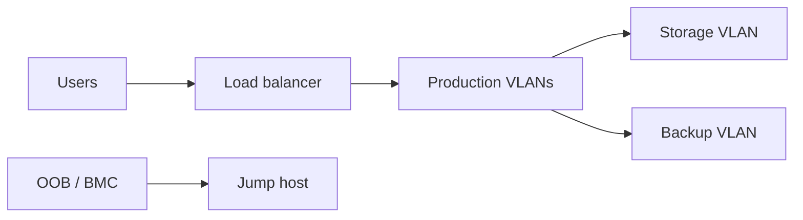
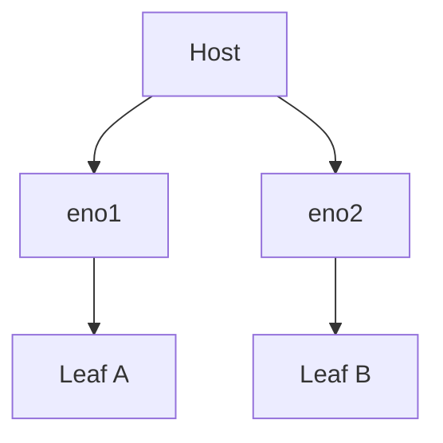
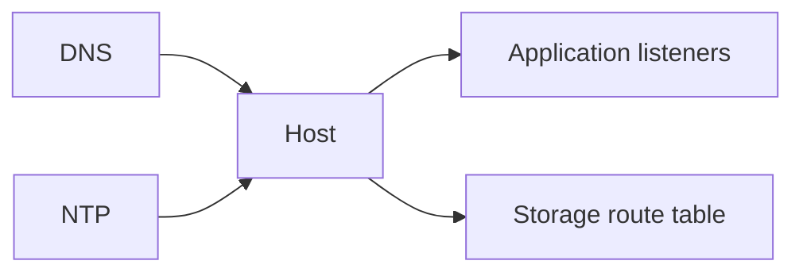
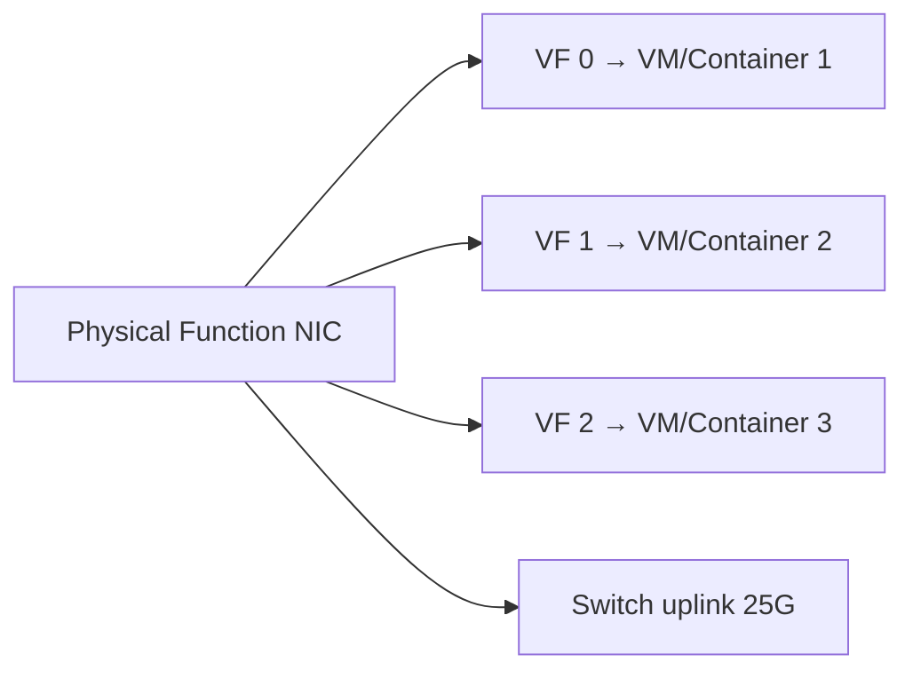
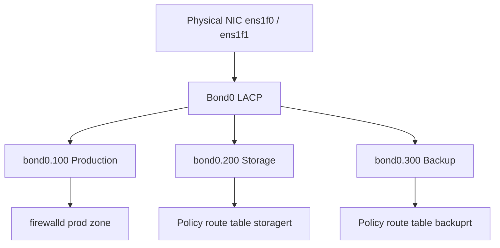

# 5. Network Configuration

- **Purpose:** Build resilient and segmented network connectivity for management, production, storage, and backup traffic on physical hosts.
- **Style:** Production-oriented, concise bullets, commands, expected outputs, diagrams, and operational guardrails.
- **Audience:** Platform engineers, SREs, systems administrators, datacenter operators, and architects.
- **Use this guide when:** Building, refreshing, or auditing physical server infrastructure.
> **Disclaimer:** Third-party logos and screenshots are used for educational purposes only.

## Network zones

- Management network for BMC/IPMI/iDRAC/iLO only.
- Production network for application and client traffic.
- Storage network for iSCSI/NFS/replication.
- Backup network for large backup flows and restore traffic.

### Bare-metal network zones



## Bonding modes

- Mode 1 active-backup: simple and switch-independent.
- Mode 4 802.3ad LACP: aggregated bandwidth and redundancy.
- Use dual ToR/leaf uplinks for every production host.

## nmcli LACP example

```bash
nmcli con add type bond ifname bond0 mode 802.3ad miimon 100
nmcli con add type ethernet ifname eno1 master bond0
nmcli con add type ethernet ifname eno2 master bond0
nmcli con add type ethernet ifname bond0 ipv4.method manual ipv4.addresses 10.20.30.41/24 ipv4.gateway 10.20.30.1
nmcli con up bond0
```

**Expected output**

```text
Connection 'bond0' successfully added.
Connection successfully activated
```

## ifcfg active-backup example

```conf
DEVICE=bond0
TYPE=Bond
BONDING_MASTER=yes
BOOTPROTO=none
IPADDR=10.20.40.41
PREFIX=24
GATEWAY=10.20.40.1
BONDING_OPTS="mode=active-backup miimon=100 primary=eno1"
ONBOOT=yes
```

### Bond verification

```bash
cat /proc/net/bonding/bond0
```

**Expected output**

```text
Bonding Mode: IEEE 802.3ad Dynamic link aggregation
MII Status: up
Slave Interface: eno1
Slave Interface: eno2
```

## VLAN configuration

```bash
nmcli con add type vlan con-name bond0.120 ifname bond0.120 dev bond0 id 120 ipv4.method manual ipv4.addresses 172.16.120.41/24
ip -d link show bond0.120
```

**Expected output**

```text
bond0.120@bond0: mtu 1500 state UP vlan protocol 802.1Q id 120
```

### Host link redundancy



## Firewalling

- Use firewalld zones or nftables tables per role.
- Default deny inbound, permit only approved ports and source ranges.
- Restrict BMC, SSH, and monitoring endpoints as administrative surfaces.

## firewalld example

```bash
firewall-cmd --permanent --new-zone=prod
firewall-cmd --permanent --zone=prod --add-interface=bond0.120
firewall-cmd --permanent --zone=prod --add-service=https
firewall-cmd --reload
firewall-cmd --zone=prod --list-all
```

**Expected output**

```text
prod
  interfaces: bond0.120
  services: https
```

## DNS and time sync

- Use internal resolvers with split-horizon records when needed.
- Prefer Chrony over ntpd.
- Verify forward and reverse DNS for all production nodes.

## Chrony baseline

```bash
systemctl enable --now chronyd
chronyc sources -v
```

**Expected output**

```text
^* ntp1.example.com 2 6 377 18 -120us +/- 12ms
```

## Static routes and policy routing

- Use static routes for storage or backup paths that must not follow the default route.
- Use policy routing when source-specific egress is required.
- Persist routes via NetworkManager or distro-native config.

### Troubleshooting commands

```bash
ip -br addr
ip route
ss -tulpn | head
ping -c 2 10.20.30.1
ethtool ens1f0 | egrep "Speed|Duplex|Link detected"
```

**Expected output**

```text
bond0 UP 10.20.30.41/24
default via 10.20.30.1 dev bond0
Speed: 25000Mb/s
Duplex: Full
Link detected: yes
```

### Routing and services



## MTU and jumbo frames

- Default Ethernet MTU is 1500 bytes; jumbo frames use 9000 bytes.
- Enable jumbo frames on storage and cluster interconnect networks only.
- Every hop — NICs, bonds, VLANs, switches — must match the same MTU value.

```bash
ip link set dev bond0 mtu 9000
ip link set dev bond0.310 mtu 9000
ping -M do -s 8972 10.30.40.1
```

**Expected output**

```text
8 bytes from 10.30.40.1: icmp_seq=1 ttl=64 time=0.312 ms
```

If ping with `-M do` returns `Frag needed`, the path MTU is smaller than 9000 — find the limiting hop.

## IPv6 considerations

- Enable IPv6 on management and production VLANs where the addressing plan supports it.
- Disable IPv6 only when there is a documented operational reason; use `net.ipv6.conf.all.disable_ipv6=1` via sysctl.
- Use SLAAC or DHCPv6 depending on your IPAM tooling.
- Always verify both IPv4 and IPv6 connectivity in post-install validation.

## Routing protocols and policy routing

- For single-subnet hosts, a default route and static storage/backup routes are sufficient.
- For hosts with multiple roles on multiple subnets, use `ip rule` policy routing and per-interface route tables.

```bash
echo "200 storagert" >> /etc/iproute2/rt_tables
ip rule add from 10.30.40.41 table storagert
ip route add default via 10.30.40.1 table storagert
ip route show table storagert
```

**Expected output**

```text
default via 10.30.40.1 dev bond0.310
```

## SR-IOV configuration

- SR-IOV creates Virtual Functions (VFs) from a Physical Function (PF) NIC for near-bare-metal network performance in VMs or containers.
- Verify IOMMU is enabled in BIOS and kernel (`intel_iommu=on` or `amd_iommu=on`).

```bash
echo 4 > /sys/class/net/ens1f0/device/sriov_numvfs
ip link show ens1f0
```

**Expected output**

```text
vf 0 MAC 00:0e:1e:ab:cd:01, tx rate 10000 (Mbps), vlan 0
vf 1 MAC 00:0e:1e:ab:cd:02
```

### SR-IOV topology



## Network performance baseline

```bash
ethtool -S ens1f0 | egrep "rx_errors|tx_errors|rx_dropped|tx_dropped"
ss -s
sar -n DEV 1 5
iperf3 -s &
iperf3 -c 10.20.30.1 -t 60 -P 8
```

**Expected output**

```text
rx_errors: 0
tx_errors: 0
rx_dropped: 0
[SUM] 0.00-60.00 sec  166 GBytes  23.8 Gbits/sec  sender
```

## IPAM integration

- Use NetBox or Infoblox for authoritative IP address management.
- Automate DNS and DHCP reservation creation via NetBox API calls in provisioning pipelines.
- Alert on IP conflicts using `arping` or ARP-scan in monitoring.

```bash
arping -c 3 -I bond0 10.20.30.41
```

**Expected output**

```text
ARPING 10.20.30.41 from 10.20.30.41 bond0
Sent 3 probes (1 broadcast(s))
Received 1 response(s)
```

### Full host network stack



## Network performance tuning

- Increase socket buffer sizes for high-throughput storage and backup traffic.

```bash
cat > /etc/sysctl.d/99-net-tuning.conf <<'EOF'
net.core.rmem_max = 134217728
net.core.wmem_max = 134217728
net.ipv4.tcp_rmem = 4096 87380 134217728
net.ipv4.tcp_wmem = 4096 65536 134217728
net.core.netdev_max_backlog = 250000
net.ipv4.tcp_congestion_control = bbr
EOF
sysctl -p /etc/sysctl.d/99-net-tuning.conf
```

**Expected output**

```text
net.core.rmem_max = 134217728
net.ipv4.tcp_congestion_control = bbr
```

## DPDK setup basics

- DPDK (Data Plane Development Kit) bypasses the Linux kernel network stack for ultra-low latency I/O.
- Requires hugepages, a DPDK-compatible NIC, and IOMMU-enabled system.

```bash
echo 1024 > /sys/kernel/mm/hugepages/hugepages-2048kB/nr_hugepages
echo "vm.nr_hugepages = 1024" >> /etc/sysctl.d/99-hugepages.conf
dpdk-devbind.py --status | grep "drv=vfio-pci"
```

## Network monitoring and baselining

```bash
# Capture 60 seconds of per-interface stats
sar -n DEV 5 12 > /var/log/net-baseline-$(date +%F).log
# Check for retransmits
ss -s
netstat -s | egrep "retransmit|failed"
# Interface error counters
ip -s link show bond0
```

**Expected output**

```text
TcpExt: 12 times the listen queue of a socket overflowed
Retransmits: 0
```

## Troubleshooting

- If LACP flaps, confirm switch-side port-channel config and member consistency.
- If VLAN traffic is absent, verify trunk allowance list and native VLAN assumptions.
- If DNS works from one interface only, review policy routing and firewall rules.
- If jumbo frames fail, test end-to-end MTU with `ping -M do`.

## Official references

- [RHEL networking docs](https://access.redhat.com/documentation/en-us/red_hat_enterprise_linux/9/html/configuring_and_managing_networking/index)
- [Netplan docs](https://netplan.readthedocs.io/en/latest/)
- [Chrony docs](https://chrony-project.org/documentation.html)
- [firewalld docs](https://firewalld.org/documentation/)
