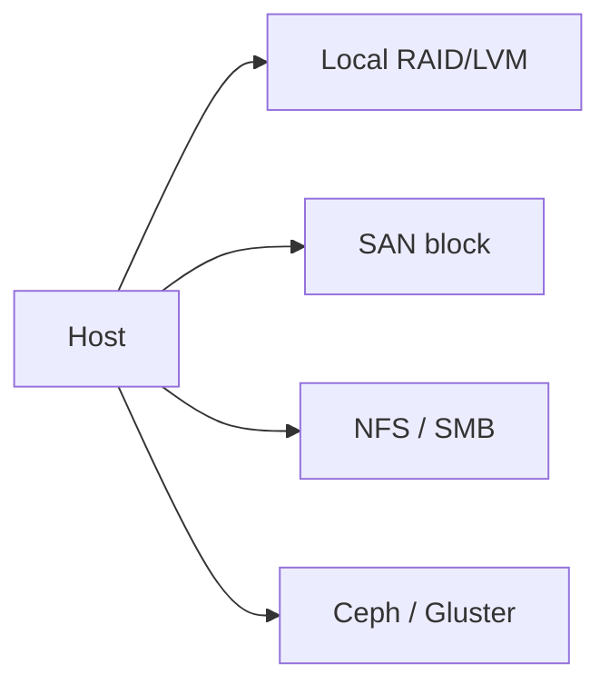
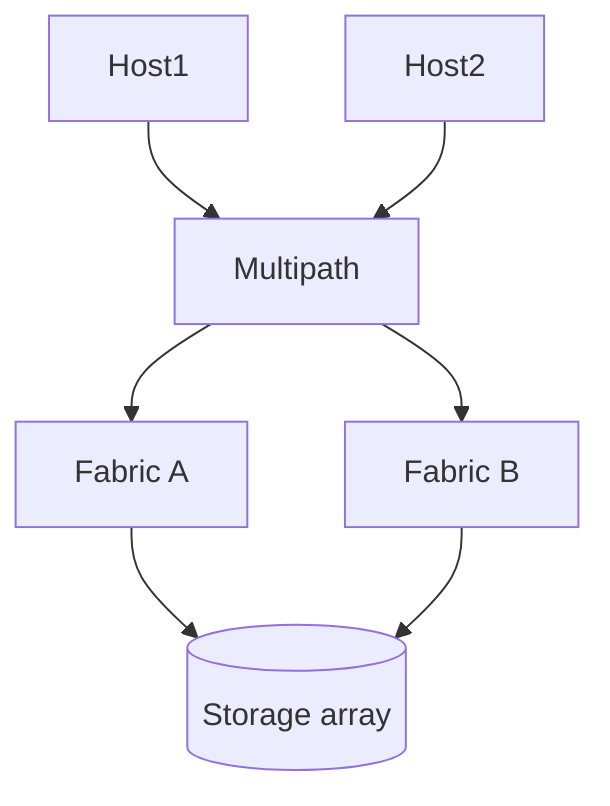
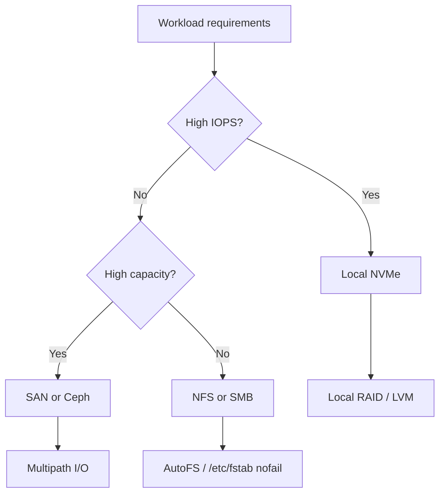

# 6. Storage Configuration

- **Purpose:** Design local, shared, and distributed storage layers with clear performance, resilience, and operability trade-offs.
- **Style:** Production-oriented, concise bullets, commands, expected outputs, diagrams, and operational guardrails.
- **Audience:** Platform engineers, SREs, systems administrators, datacenter operators, and architects.
- **Use this guide when:** Building, refreshing, or auditing physical server infrastructure.
> **Disclaimer:** Third-party logos and screenshots are used for educational purposes only.

## Local storage

- Hardware RAID offers controller-managed arrays and cache.
- Software RAID (`mdadm`) is transparent and Linux-native.
- HBA plus ZFS/Ceph gives direct-disk control for SDS platforms.

## LVM workflow

- **PV** → physical volume.
- **VG** → pooled storage.
- **LV** → logical volume for a filesystem or app.

### Create software RAID and LVM

```bash
mdadm --create /dev/md0 --level=1 --raid-devices=2 /dev/sdb /dev/sdc
pvcreate /dev/md0
vgcreate vg_data /dev/md0
lvcreate -n lv_app -L 500G vg_data
mkfs.xfs /dev/vg_data/lv_app
mount /dev/vg_data/lv_app /srv/app
```

**Expected output**

```text
mdadm: array /dev/md0 started.
Volume group "vg_data" successfully created.
Logical volume "lv_app" created.
```

## Filesystem comparison

| Filesystem | Strengths | Trade-offs | Typical use |
| --- | --- | --- | --- |
| XFS | Excellent scalability | Shrink limitations | Large filesystems, logs, databases |
| ext4 | Mature and flexible | Less scalable at extremes | General Linux |
| ZFS | Checksums, snapshots, compression | Memory-heavy, policy considerations | Storage appliances |

## Filesystem tuning

- Use `noatime` when access-time updates add no value.
- Prefer periodic `fstrim` over continuous `discard` on SSD fleets.
- Separate logs, temp, and data onto different volumes.

### Storage paths



## SAN

- Fibre Channel uses HBAs, zoning, dual fabrics, and multipath.
- iSCSI uses initiators, target discovery, CHAP, and IP networks.
- Multipath I/O is mandatory for resilient shared block storage.

## iSCSI initiator example

```bash
yum install -y iscsi-initiator-utils device-mapper-multipath
systemctl enable --now iscsid multipathd
iscsiadm -m discovery -t sendtargets -p 10.30.40.10
iscsiadm -m node --login
multipath -ll
```

**Expected output**

```text
10.30.40.10:3260,1 iqn.2024-01.com.example:storage.lun01
mpatha dm-3 size=2.0T wp=rw
```

## NAS

- Use NFSv4 for Linux-centric shared storage.
- Use SMB/CIFS with Samba for Windows integration.
- Use AutoFS for on-demand mounts.

## NFS example

```bash
mkdir -p /srv/nfs/appdata
echo '/srv/nfs/appdata 10.20.0.0/16(rw,sync,no_subtree_check)' >> /etc/exports
exportfs -rav
mount -t nfs4 nfs01:/srv/nfs/appdata /mnt/appdata
```

**Expected output**

```text
exporting 10.20.0.0/16:/srv/nfs/appdata
```

## Ceph and Gluster basics

- Ceph: MON, MGR, OSD, MDS, and optional RGW.
- Plan CRUSH failure domains around host, chassis, rack, and room.
- GlusterFS fits simpler scale-out file services with careful split-brain handling.

## Disk benchmarking and monitoring

```bash
fio --name=randread --filename=/srv/app/testfile --size=4G --bs=4k --rw=randread --iodepth=32 --direct=1
smartctl -a /dev/sdb | egrep "SMART overall|Power_On_Hours|Media_Wearout"
iostat -xz 1 3
```

**Expected output**

```text
randread: IOPS=72.1k, BW=281MiB/s
SMART overall-health self-assessment test result: PASSED
Device r/s rkB/s await aqu-sz %util
```

### Shared storage resiliency



## Capacity planning

- Alert on filesystem usage, disk latency, queue depth, rebuild state, and SSD wear.
- Forecast growth on 30/90/180-day trends.
- Include backup repositories and snapshot growth in sizing models.

## Backup storage

- Use LTO tape for long-term offline retention when required.
- Use object storage for immutable backup copies where available.
- Test restore throughput, not only backup throughput.

## ZFS quick reference

- Import, create, and list pools.
- Use compression, deduplication carefully (dedup is memory-intensive).
- Use snapshots for fast local point-in-time recovery.

```bash
zpool create -f tank mirror /dev/sdb /dev/sdc
zfs set compression=lz4 tank
zfs set recordsize=128k tank/databases
zfs snapshot tank/data@snap-$(date +%F)
zfs list -t snapshot
zpool status tank
```

**Expected output**

```text
  pool: tank
 state: ONLINE
config:
	tank   ONLINE
	  mirror   ONLINE
	    sdb    ONLINE
	    sdc    ONLINE
errors: No known data errors
```

## LUKS volume management

```bash
cryptsetup luksFormat /dev/sdd
cryptsetup luksOpen /dev/sdd encrypted_data
mkfs.xfs /dev/mapper/encrypted_data
mount /dev/mapper/encrypted_data /secure/data
```

## Volume group extension

```bash
pvcreate /dev/nvme2n1
vgextend vg_data /dev/nvme2n1
lvextend -l +100%FREE /dev/vg_data/lv_app
xfs_growfs /srv/app
```

**Expected output**

```text
Physical volume "/dev/nvme2n1" successfully created.
Volume group "vg_data" successfully extended
Size of logical volume vg_data/lv_app changed from 500.00 GiB to 1.37 TiB.
data blocks changed from 131072000 to 357302272
```

## Multipath configuration

```bash
cat > /etc/multipath.conf <<'EOF'
defaults {
  user_friendly_names yes
  find_multipaths     yes
}
blacklist {
  devnode "^(ram|raw|loop|fd|md|dm-|sr|scd|st)[0-9]*"
}
EOF
systemctl enable --now multipathd
multipath -ll
```

**Expected output**

```text
mpatha (360000000000000001) dm-1 VENDOR,PRODUCT
size=2.0T features='1 queue_if_no_path' hwhandler='0'
\_ round-robin 0 [prio=10][active]
 \_ 3:0:0:1  sdc 8:32 [active][ready]
 \_ 4:0:0:1  sde 8:64 [active][ready]
```

### Storage tier selection



## Thin provisioning and quotas

```bash
lvcreate --thin -L 1T vg_data/pool_thin
lvcreate --thin -V 500G --name lv_thin1 vg_data/pool_thin
lvcreate --thin -V 500G --name lv_thin2 vg_data/pool_thin
xfs_quota -xc 'limit bsoft=450g bhard=500g opsuser' /srv/app
```

## SMART monitoring automation

- Schedule weekly SMART tests using `smartd`.
- Alert on reallocated sectors, pending sectors, temperature threshold crossings, and wear indicators.

```conf
# /etc/smartd.conf
DEVICESCAN -d auto -a -o on -S on -s (S/../.././02|L/../../6/03) -W 5,50,55 -m ops@example.com -M exec /usr/libexec/smartmontools/smartd-runner
```

```bash
systemctl enable --now smartd
smartctl -t short /dev/sdb && sleep 60 && smartctl -l selftest /dev/sdb
```

### Disk health monitoring pipeline


## Ceph deployment quick-reference

```bash
cephadm bootstrap --mon-ip 10.30.40.10 --initial-dashboard-password admin
ceph orch apply osd --all-available-devices
ceph status
ceph osd tree
```

**Expected output**

```text
  cluster:
    id:     xxxxxxxx
    health: HEALTH_OK
  services:
    mon: 3 daemons, quorum ceph01,ceph02,ceph03
    osd: 24 osds: 24 up, 24 in
```

## Storage performance tuning

```bash
# Set scheduler to none (NVMe) or mq-deadline (SATA/SAS)
echo none > /sys/block/nvme0n1/queue/scheduler
echo mq-deadline > /sys/block/sdb/queue/scheduler
# Increase read-ahead for sequential workloads
blockdev --setra 4096 /dev/sdb
# Disable barriers on battery-backed controllers (consult vendor docs first)
mount -o remount,nobarrier /srv/app
```

**Expected output**

```text
[nvme0n1] none
[sdb] mq-deadline
```

## Filesystem monitoring

```bash
# Watch filesystem usage across all mounted XFS/ext4 volumes
df -hT | egrep "xfs|ext4|Filesystem"
# Check XFS internal stats
xfs_info /srv/app
# Watch inode usage
df -i | awk 'NR==1 || $5+0 > 70' 
```

**Expected output**

```text
Filesystem     Type      Size  Used Avail Use% Mounted on
/dev/mapper/vg_data-lv_app xfs   500G  142G  358G  29% /srv/app
isize=512  agcount=32  agsize=4095744 blks
```

## iSCSI multipath and failover verification

```bash
# Verify multipath failover by disabling one path and measuring latency
iscsiadm -m session -P 3 | egrep "Target|Session State|Portal"
# Simulate path failure
ip link set ens1f0 down
multipath -ll | egrep "status|policy|active"
# Re-enable path
ip link set ens1f0 up
```

**Expected output**

```text
mpatha (xxxxx) dm-3 VENDOR,PRODUCT
\_ round-robin 0 [prio=10][active]
 \_ 3:0:0:1  sdc  [active][ready]
 \_ 4:0:0:1  sde  [failed][faulty]
# After re-enable:
 \_ 4:0:0:1  sde  [active][ready]
```

## Storage capacity growth management

- Configure filesystem and LVM alerts at 70%, 80%, and 90% usage thresholds.
- Use thin provisioning where appropriate to defer physical capacity purchase.
- Review Ceph/GlusterFS replication overhead in capacity models (effective usable = raw / replication factor).
- Schedule regular capacity review meetings to align with procurement lead times.

```bash
# Monitor LVM thin pool usage
lvs --reportformat json -o lv_name,data_percent,snap_percent vg_data | python3 -m json.tool
```

**Expected output**

```text
"lv_name": "pool_thin",
"data_percent": "42.30",
"snap_percent": "0.00"
```

## Troubleshooting

- If storage is slow, determine whether the bottleneck is local disk, controller, SAN path, or filesystem.
- If multipath shows failed paths, verify zoning, switch ports, optics, and array controller state.
- If NFS mounts hang during boot, move to AutoFS or add `_netdev` and `nofail`.
- If SSD wear rises quickly, review write amplification and logging patterns.

## Official references

- [RHEL storage docs](https://access.redhat.com/documentation/en-us/red_hat_enterprise_linux/9/html/managing_storage_devices/index)
- [mdadm manual](https://man7.org/linux/man-pages/man8/mdadm.8.html)
- [Ceph docs](https://docs.ceph.com/en/latest/)
- [Gluster docs](https://docs.gluster.org/en/latest/)
