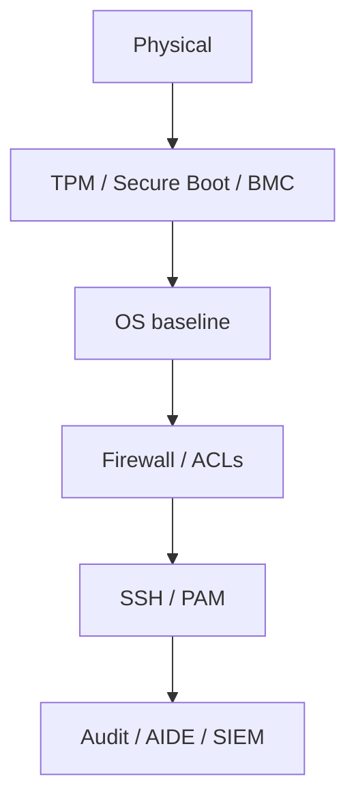
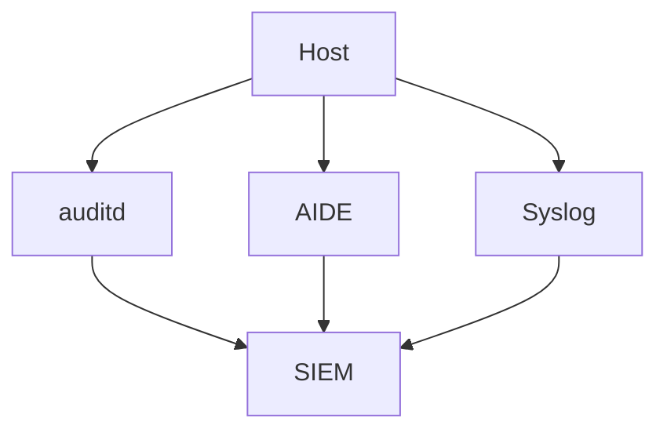
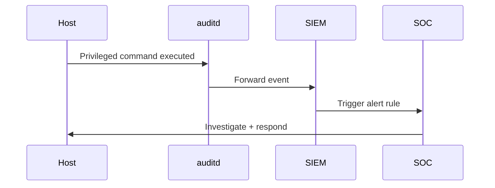
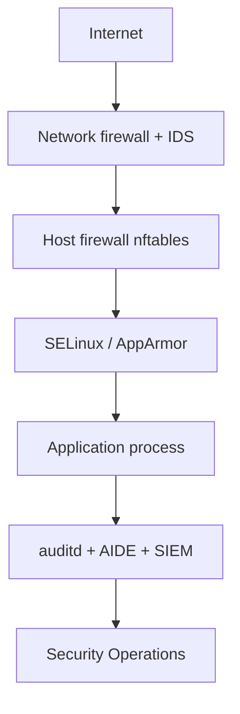

# 7. Security Hardening

- **Purpose:** Apply production-grade host security controls, compliance checks, and patching practices for bare-metal fleets.
- **Style:** Production-oriented, concise bullets, commands, expected outputs, diagrams, and operational guardrails.
- **Audience:** Platform engineers, SREs, systems administrators, datacenter operators, and architects.
- **Use this guide when:** Building, refreshing, or auditing physical server infrastructure.
> **Disclaimer:** Third-party logos and screenshots are used for educational purposes only.

## CIS-style baseline controls

- Mount `/tmp` with `nodev,nosuid,noexec` when compatible.
- Consider similar restrictions for `/var/tmp`.
- Enforce password length, complexity, aging, and reuse limits.
- Enable account lockout with `pam_faillock` or equivalent.
- Disable unused services.
- Restrict cron/at where policy requires.
- Apply secure sysctl defaults for redirects, martians, and ASLR.

### Security control layers



## SSH hardening example

```conf
Protocol 2
PermitRootLogin no
PasswordAuthentication no
PubkeyAuthentication yes
AllowUsers opsadmin srebot
MaxAuthTries 3
```

```bash
sshd -t && systemctl reload sshd
```

**Expected output**

```text
# no output means syntax is valid
```

## PAM lockout example

```bash
authselect select sssd with-faillock --force
faillock --user testuser
```

**Expected output**

```text
testuser:
When Type Source Valid
```

## sysctl hardening

```conf
kernel.randomize_va_space = 2
net.ipv4.conf.all.accept_redirects = 0
net.ipv4.conf.all.send_redirects = 0
net.ipv4.conf.all.log_martians = 1
```

## SELinux/AppArmor

- Keep SELinux Enforcing or AppArmor active.
- Prefer context fixes and booleans over disabling the MAC framework.
- Use `ausearch` and `audit2allow` only after validating the denial.

## AIDE and auditd

- Use AIDE for file integrity monitoring.
- Store the AIDE database securely.
- Watch high-value paths such as SSH config, sudoers, and auth logs.

## auditd rules example

```conf
-w /etc/ssh/sshd_config -p wa -k ssh_config
-w /etc/sudoers -p wa -k privilege_escalation
-a always,exit -F arch=b64 -S execve -k command_exec
```

### Patch workflow


## Vulnerability scanning

- Use OpenSCAP for compliance scanning.
- Use Nessus or OpenVAS for broader vulnerability scanning.
- Prioritize by exploitability, exposure, and business impact, not only CVSS.

## OpenSCAP example

```bash
oscap xccdf eval --profile xccdf_org.ssgproject.content_profile_cis_server_l1 --results /root/oscap-results.xml /usr/share/xml/scap/ssg/content/ssg-rhel9-ds.xml
```

**Expected output**

```text
Title   Ensure mounting of cramfs filesystems is disabled
Result  pass
```

## Patch management

- Use Satellite, SUSE Manager, or Landscape when scale justifies it.
- Follow scan → test → stage → prod.
- Use kpatch/livepatch only with explicit policy and validation.

## Certificate management and LUKS

- Use internal PKI for host and service certificates.
- Encrypt sensitive disks with LUKS when compliance requires it.
- Protect keys and recovery materials in a managed secrets platform.

### Detection telemetry



## sudo hardening

- Grant `sudo` only to named users or groups; avoid `ALL` where possible.
- Use `NOPASSWD` only for automated service accounts with strong justification.
- Log all sudo activity to syslog and audit logs.

```conf
# /etc/sudoers.d/ops-team
%ops-team    ALL=(ALL)       ALL
svcbot       ALL=(deploy)    NOPASSWD: /opt/deploy/deploy.sh
Defaults     logfile=/var/log/sudo.log
Defaults     log_input,log_output
```

## PKI and certificate lifecycle

- Use internal CA for server certificates (HashiCorp Vault PKI, CFSSL, or Easy-RSA).
- Automate renewal with cert-manager (Kubernetes), Certbot (ACME), or Vault agent.
- Alert 30 days before certificate expiration.
- Revoke certificates immediately when a host is decommissioned.

```bash
openssl x509 -in /etc/pki/tls/certs/app.crt -noout -dates
```

**Expected output**

```text
notBefore=Jun  1 00:00:00 2024 GMT
notAfter=Jun  1 00:00:00 2025 GMT
```

## Secrets management

- Do not store secrets in Kickstart files, Ansible vars files, or environment variables baked into images.
- Use HashiCorp Vault, AWS Secrets Manager (on-prem self-hosted), or CyberArk Conjur for runtime injection.
- Rotate secrets automatically; log every access for auditability.

## Network segmentation hardening

- Use nftables or iptables to restrict inter-server communication within the same VLAN.
- Allow only the minimum set of ports needed by each role.
- Implement host-based firewall rules as code (Ansible `firewalld` role or nftables templates).

```bash
nft list ruleset
nft add rule inet filter input tcp dport { 80, 443 } accept
nft add rule inet filter input tcp dport 22 ip saddr 10.10.10.0/24 accept
nft add rule inet filter input drop
```

### Zero-trust host model


## Intrusion detection

- Install AIDE and initialize the database after hardening is complete.
- Run AIDE checks nightly and ship reports to SIEM.
- Consider OSSEC/Wazuh for agent-based HIDS with active response options.

```bash
aide --init
mv /var/lib/aide/aide.db.new.gz /var/lib/aide/aide.db.gz
aide --check 2>&1 | grep -E "changed|added|removed"
```

**Expected output**

```text
Changed entries:
f   ...
/var/log/secure
```

## Compliance frameworks mapping

| Control | CIS Benchmark | NIST SP 800-53 | PCI DSS |
| --- | --- | --- | --- |
| SSH root login disabled | CIS 5.2.8 | AC-6 | 2.2.7 |
| Password complexity | CIS 5.4.1 | IA-5 | 8.3 |
| Audit logging | CIS 4.1 | AU-2 | 10.2 |
| File integrity | CIS 1.3 | SI-7 | 11.5 |
| Firewall active | CIS 3.5 | SC-7 | 1.3 |

## Emergency access (break-glass) procedure

- Designate one break-glass account per server type stored in a sealed vault.
- Require dual-control to access break-glass credentials.
- Log and alert every use of the break-glass account.
- Review break-glass usage in post-incident review.

### Security event timeline



## Container and runtime security on bare-metal

- Even without Kubernetes, enforce namespace separation for containerized workloads.
- Scan container images with Trivy or Grype before deploying to production.
- Use rootless containers where possible (Podman rootless, Docker with userns-remap).
- Mount container runtimes with seccomp profiles and AppArmor/SELinux policies.

```bash
trivy image nginx:latest --severity HIGH,CRITICAL --no-progress
```

**Expected output**

```text
Total: 5 (HIGH: 4, CRITICAL: 1)
```

## Kernel module hardening

- Disable unused kernel modules that expand the attack surface.

```bash
echo "install cramfs /bin/true" > /etc/modprobe.d/cramfs.conf
echo "install freevxfs /bin/true" >> /etc/modprobe.d/cramfs.conf
echo "install jffs2 /bin/true" >> /etc/modprobe.d/cramfs.conf
echo "install hfs /bin/true" >> /etc/modprobe.d/cramfs.conf
echo "install hfsplus /bin/true" >> /etc/modprobe.d/cramfs.conf
```

## Privileged access management (PAM) integration

- Integrate with CyberArk, BeyondTrust, or Teleport for session recording and JIT access.
- Require MFA for all SSH sessions via PAM `pam_google_authenticator` or `pam_duo`.
- Time-box access grants; revoke automatically when the grant window expires.

```bash
# Teleport node registration example
teleport node configure --token=<token> --ca-pin=sha256:<hash> \
  --proxy=teleport.example.com:3080 > /etc/teleport.yaml
systemctl enable --now teleport
```

## Security patch SLA targets

| CVSS score | Patch SLA | Notes |
| --- | --- | --- |
| Critical (9.0–10.0) | 24–72 hours | Emergency change with CAB fast-track |
| High (7.0–8.9) | 7 days | Scheduled with next patch wave |
| Medium (4.0–6.9) | 30 days | Next regular patch cycle |
| Low (< 4.0) | 90 days or next refresh | Bundled with standard maintenance |

## Immutable infrastructure security model

- When possible, treat bare-metal OS as immutable: build a known-good image, deploy it, and replace rather than patch in place.
- Host-level configuration drift is a security signal — monitor it with Ansible check mode or Puppet Puppet-run reports.
- Use read-only root filesystems for appliance-style deployments (with writable `/var` and `/tmp`).

## Network security controls

```bash
# Deny all inbound traffic by default using nftables
nft flush ruleset
nft add table inet filter
nft add chain inet filter input '{ type filter hook input priority 0 ; policy drop ; }'
nft add chain inet filter forward '{ type filter hook forward priority 0 ; policy drop ; }'
nft add chain inet filter output '{ type filter hook output priority 0 ; policy accept ; }'
nft add rule inet filter input ct state established,related accept
nft add rule inet filter input iif lo accept
nft add rule inet filter input tcp dport 22 ip saddr 10.10.10.0/24 accept
nft save > /etc/nftables.conf
```

**Expected output**

```text
# no output = rules applied successfully
nft list ruleset  # verify
```

## Compliance evidence collection

- Automate collection of compliance evidence: CIS benchmark results, auditd summary, patch status, and certificate inventory.
- Ship evidence to a central compliance repository (S3, SharePoint, or GRC tool).
- Schedule evidence collection before each audit cycle.

```bash
# Generate OpenSCAP report in HTML
oscap xccdf eval \
  --profile xccdf_org.ssgproject.content_profile_cis_server_l1 \
  --results /var/lib/compliance/oscap-$(hostname)-$(date +%F).xml \
  --report /var/lib/compliance/oscap-$(hostname)-$(date +%F).html \
  /usr/share/xml/scap/ssg/content/ssg-rhel9-ds.xml
```

**Expected output**

```text
Title   Ensure SSH Protocol Is Set To 2          Result  pass
Title   Ensure noexec Option Set On /tmp          Result  pass
```

### Layered defence model



## Troubleshooting

- If SSH access is lost, use console/BMC and validate `sshd -t` before rollback.
- If SELinux blocks an app, inspect AVC denials and fix contexts or booleans first.
- If OpenSCAP output is noisy, review and tailor the chosen profile.
- If auditd load is high, refine high-value rules rather than watching everything.

## Official references

- [RHEL security hardening](https://access.redhat.com/documentation/en-us/red_hat_enterprise_linux/9/html/security_hardening/index)
- [Ubuntu security docs](https://documentation.ubuntu.com/server/explanation/security/)
- [OpenSCAP](https://www.open-scap.org/)
- [Nessus docs](https://docs.tenable.com/nessus/)
