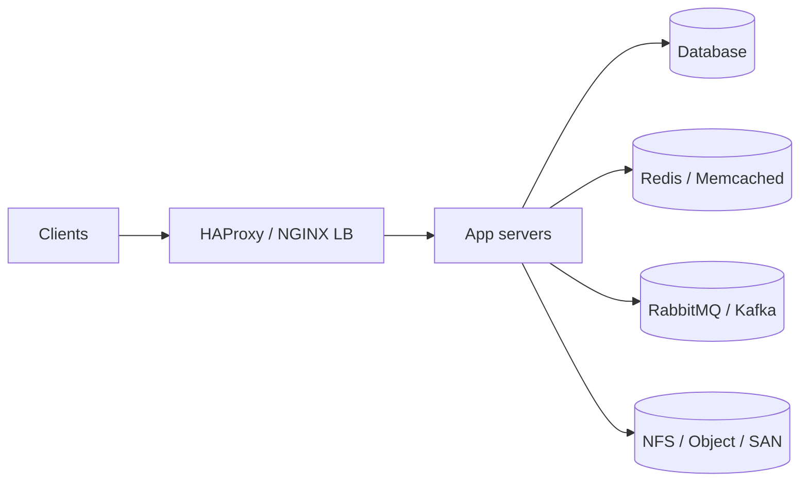
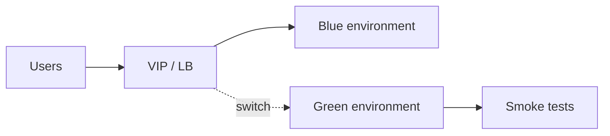
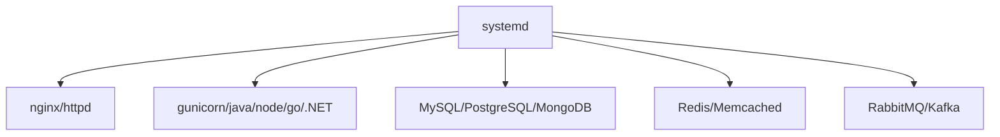
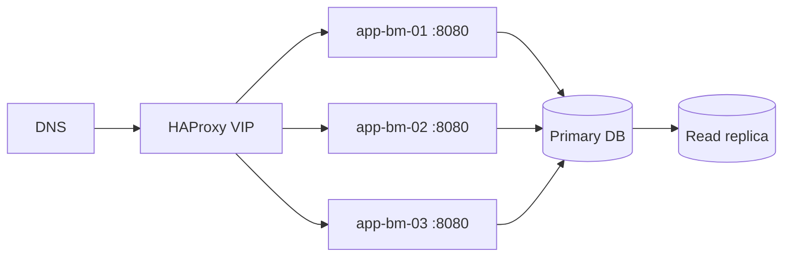

# 8. Application Deployment

- **Purpose:** Deploy production application stacks on bare-metal hosts with repeatable services, load balancing, and high-availability patterns.
- **Style:** Production-oriented, concise bullets, commands, expected outputs, diagrams, and operational guardrails.
- **Audience:** Platform engineers, SREs, systems administrators, datacenter operators, and architects.
- **Use this guide when:** Building, refreshing, or auditing physical server infrastructure.
> **Disclaimer:** Third-party logos and screenshots are used for educational purposes only.

### Bare-metal application stack



## Web servers

- NGINX: reverse proxy, TLS termination, static content, modern performance tuning.
- Apache: broad module ecosystem and compatibility with legacy app stacks.

## NGINX example

```bash
yum install -y nginx
nginx -t && systemctl enable --now nginx
```

**Expected output**

```text
nginx: configuration file /etc/nginx/nginx.conf test is successful
```

## Application runtimes

- Java: OpenJDK, Tomcat, WildFly/JBoss.
- Python: virtualenv, gunicorn, uWSGI.
- Node.js: PM2 or systemd.
- Go: single static binary under systemd.
- .NET: reverse proxy + systemd service.

## systemd unit example

```ini
[Unit]
Description=Go API Service
After=network-online.target
[Service]
User=appsvc
ExecStart=/opt/goapi/goapi --config /etc/goapi/config.yaml
Restart=on-failure
LimitNOFILE=65535
[Install]
WantedBy=multi-user.target
```

## Database servers

- MySQL/MariaDB: secure installation, replication, backup consistency.
- PostgreSQL: `pg_hba.conf`, streaming replication, WAL sizing.
- MongoDB: replica sets with odd-member voting.

## PostgreSQL example

```bash
postgresql-setup --initdb
systemctl enable --now postgresql
psql -c "select version();"
```

**Expected output**

```text
PostgreSQL 16.x on x86_64-pc-linux-gnu
```

## Cache and queues

- Redis with RDB/AOF and Sentinel or cluster for HA.
- Memcached for ephemeral cache.
- RabbitMQ for durable messaging.
- Kafka for high-throughput event streams.

## HAProxy example

```conf
frontend https_in
  bind *:443 ssl crt /etc/pki/tls/private/lb.pem
  default_backend app_pool
backend app_pool
  balance roundrobin
  option httpchk GET /healthz
  server app1 10.20.30.41:8080 check
  server app2 10.20.30.42:8080 check
```

```bash
haproxy -c -f /etc/haproxy/haproxy.cfg
```

**Expected output**

```text
Configuration file is valid
```

### Blue/green release pattern



## Containers on bare-metal

- Docker Engine is fine for single-host containerized services.
- Use `kubeadm` for Kubernetes cluster bootstrap on physical servers.
- Validate cgroups, overlayfs, and kernel modules first.

## kubeadm example

```bash
kubeadm init --control-plane-endpoint k8s-vip.example.com --pod-network-cidr 10.244.0.0/16
```

**Expected output**

```text
Your Kubernetes control-plane has initialized successfully!
```

### Runtime layout



## Canary and rolling deployments

- Canary: route a small percentage (e.g. 5%) of traffic to the new version first.
- Rolling: replace nodes one at a time; keep minimum healthy count in load balancer.
- Blue/green: maintain two full environments; flip the load balancer atomically.

```bash
# Drain a node from HAProxy (via socat admin socket)
echo "disable server app_pool/app3" | socat stdio /run/haproxy/admin.sock
# Re-enable after upgrade
echo "enable server app_pool/app3" | socat stdio /run/haproxy/admin.sock
```

**Expected output**

```text
# (no output means success)
```

## systemd hardening for services

- Run application services as dedicated non-root users.
- Use `PrivateTmp`, `NoNewPrivileges`, `ProtectSystem`, and `CapabilityBoundingSet`.

```ini
[Service]
User=appsvc
Group=appsvc
NoNewPrivileges=true
PrivateTmp=true
ProtectSystem=strict
ReadWritePaths=/var/lib/myapp
CapabilityBoundingSet=CAP_NET_BIND_SERVICE
```

## Artifact management

- Store release artifacts in a versioned binary repository (Nexus, Artifactory, or S3-compatible).
- Sign artifacts with GPG or cosign to validate integrity at deploy time.
- Never deploy from a developer laptop or unversioned file share in production.

```bash
gpg --verify myapp-2.4.0-linux-amd64.tar.gz.sig myapp-2.4.0-linux-amd64.tar.gz
echo $?
```

**Expected output**

```text
gpg: Signature made Thu 09 Jun 2026
gpg: Good signature from "deploy@example.com"
0
```

## Configuration management integration

- Deploy application config files via Ansible templates or Puppet/Chef manifests.
- Externalize secrets using environment injection or a Vault agent sidecar.
- Track config changes in version control; drift detection alerts via Ansible Tower/AWX or Satellite.

```yaml
- name: Deploy app config
  template:
    src: templates/app.conf.j2
    dest: /etc/myapp/app.conf
    owner: appsvc
    mode: '0640'
  notify: Restart myapp
```

### CI/CD to bare-metal pipeline


## Health check patterns

- Expose `/healthz` (liveness) and `/readyz` (readiness) endpoints on each service.
- Configure HAProxy or NGINX to use `option httpchk GET /healthz`.
- Use systemd `ExecStartPost` or a separate health-check script to verify post-start state.

```bash
curl -sf http://localhost:8080/healthz && echo "healthy" || echo "unhealthy"
```

**Expected output**

```text
healthy
```

## Log rotation and app logging

- Use `logrotate` for application logs not captured by journald.
- Rotate daily, compress after one day, retain 14 days.
- Forward structured JSON logs to the centralized log stack via Filebeat or rsyslog imfile.

```conf
/var/log/myapp/*.log {
    daily
    compress
    delaycompress
    rotate 14
    missingok
    notifempty
    postrotate
        systemctl kill -s USR1 myapp.service
    endscript
}
```

### Application resiliency topology



## Database HA patterns on bare-metal

### MySQL/MariaDB Galera cluster

```bash
# On first node
galera_new_cluster
systemctl enable --now mysql
mysql -e "SHOW STATUS LIKE 'wsrep_cluster_size';"
```

**Expected output**

```text
+--------------------+-------+
| Variable_name      | Value |
+--------------------+-------+
| wsrep_cluster_size | 3     |
+--------------------+-------+
```

### PostgreSQL streaming replication

```bash
# On replica
pg_basebackup -h primary.example.com -U replicator -D /var/lib/postgresql/data -P -Xs -R
cat /var/lib/postgresql/data/postgresql.auto.conf
```

**Expected output**

```text
primary_conninfo = 'host=primary.example.com port=5432 user=replicator'
```

## Message queue HA

- RabbitMQ: form a 3-node cluster with quorum queues; avoid classic mirrored queues.
- Kafka: 3 brokers minimum, RF=3, `min.insync.replicas=2`, use KRaft mode in new deployments.

```bash
rabbitmqctl cluster_status | egrep "nodes|partitions|alarms"
kafka-topics.sh --bootstrap-server kafka01:9092 --describe --topic events | head
```

**Expected output**

```text
Nodes: [rabbit@mq01, rabbit@mq02, rabbit@mq03]
Partition: 0  Leader: 1  Replicas: 1,2,3  Isr: 1,2,3
```

## Service mesh on bare-metal

- Consul Connect or Istio can provide mTLS between services on bare-metal without Kubernetes.
- Consul agent runs as a systemd service; sidecar proxies handle traffic encryption.

```bash
consul agent -data-dir=/var/lib/consul -config-dir=/etc/consul.d &
consul members
```

**Expected output**

```text
Node      Address          Status  Type    Build
app-bm-01 10.20.30.41:8301 alive   client  1.17.0
```

## Troubleshooting

- If a service works manually but not under systemd, compare environment, working directory, user, and limits.
- If reverse proxy returns 502/504, test the backend locally and confirm SELinux/firewall rules.
- If DB replication lags, inspect disk latency, WAL/binlog volume, and network bandwidth.
- If blue/green cutover fails, keep the old pool warm and revert quickly.
- If a systemd service fails after OS upgrade, check unit file syntax with `systemd-analyze verify`.
- If application can't bind a port, verify no other process owns it (`ss -tlnp`) and confirm firewall zone config.

## Deployment pre/post checklist

**Pre-deploy:**
- [ ] Change record approved and maintenance window communicated.
- [ ] Rollback plan documented and tested.
- [ ] Artifact checksum verified against repository.
- [ ] Health check endpoints confirmed passing on staging.
- [ ] Database migrations are backward-compatible.

**Post-deploy:**
- [ ] All health endpoints return 2xx.
- [ ] Load balancer shows all backends healthy.
- [ ] Error rate and latency nominal in Grafana.
- [ ] Logs show no unexpected errors.
- [ ] On-call team notified of successful deploy.

## Resource limits reference

| Resource | Systemd directive | Typical production value |
| --- | --- | --- |
| Open files | LimitNOFILE | 65535 |
| Processes | LimitNPROC | 4096 |
| Core dump | LimitCORE | 0 (disabled) or unlimited (debug) |
| Max locked memory | LimitMEMLOCK | 64M for most; unlimited for DPDK |
| CPU weight | CPUWeight | 100 (default) |
| Memory max | MemoryMax | e.g. 4G for bounded services |

## Official references

- [NGINX docs](https://nginx.org/en/docs/)
- [Apache docs](https://httpd.apache.org/docs/)
- [PostgreSQL docs](https://www.postgresql.org/docs/)
- [MariaDB docs](https://mariadb.com/kb/en/documentation/)
- [kubeadm docs](https://kubernetes.io/docs/setup/production-environment/tools/kubeadm/)
