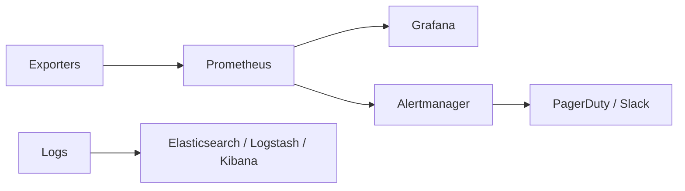
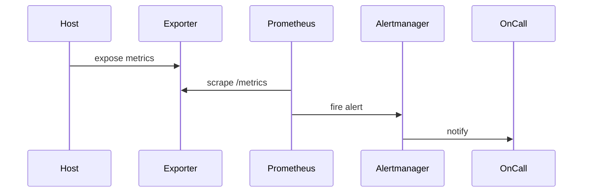
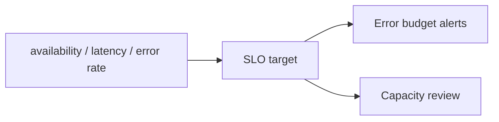
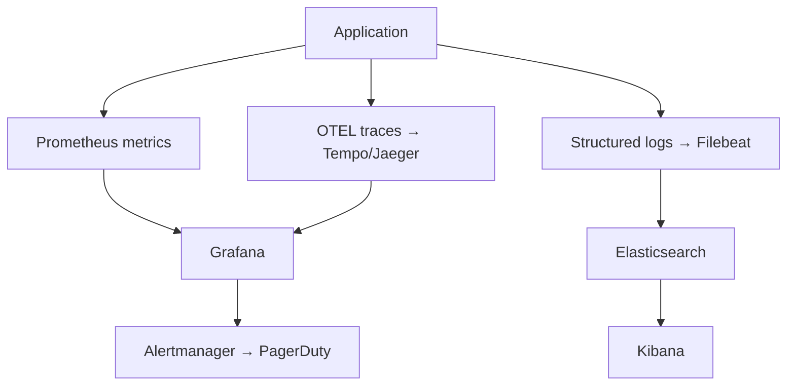

# 9. Monitoring and Observability

- **Purpose:** Collect metrics, logs, alerts, and capacity signals across the full bare-metal stack from hardware sensors to application SLOs.
- **Style:** Production-oriented, concise bullets, commands, expected outputs, diagrams, and operational guardrails.
- **Audience:** Platform engineers, SREs, systems administrators, datacenter operators, and architects.
- **Use this guide when:** Building, refreshing, or auditing physical server infrastructure.
> **Disclaimer:** Third-party logos and screenshots are used for educational purposes only.

### Observability architecture



## Infrastructure monitoring

- Prometheus + node_exporter for Linux host metrics.
- Grafana for dashboards such as Node Exporter Full, NGINX, MySQL, and PostgreSQL.
- SNMP for switches, PDUs, UPSs, and environmental gear.

## node_exporter example

```bash
systemctl enable --now node_exporter
curl -s http://localhost:9100/metrics | head
```

**Expected output**

```text
# HELP go_gc_duration_seconds A summary of the pause duration of garbage collection cycles.
```

## Hardware monitoring

```bash
ipmitool sensor list | head
ipmitool sel list | tail
smartctl -a /dev/sda | egrep "SMART overall|Temperature_Celsius"
storcli /c0 show
```

**Expected output**

```text
CPU1 Temp | 38 degrees C | ok
SMART overall-health self-assessment test result: PASSED
Status = Success
```

### Metrics and alert flow



## Log management

- Centralize with rsyslog or journald forwarding.
- Use ELK/OpenSearch-style stacks for search and correlation.
- Use Filebeat or rsyslog forwarders tagged by environment, role, and rack.

## journalctl examples

```bash
journalctl -u nginx --since -30m
journalctl -p err -b
```

**Expected output**

```text
Jun 09 10:00:11 app-bm-01 nginx[1204]: 200 GET /healthz
Jun 09 10:01:12 kernel: blk_update_request: I/O error, dev sdb
```

## Alerting

- Route by severity, team, service, and maintenance state.
- Use inhibition rules to suppress symptom alerts when root cause is known.
- Page only on actionable conditions with runbooks.

## APM and network monitoring

- Expose JMX, Prometheus client metrics, StatsD, and custom latency histograms.
- Use SNMP, Smokeping, and NetFlow/sFlow for network visibility.
- Build capacity dashboards around CPU, memory, disk, power, and growth trends.

### SLO model



## Prometheus configuration

```yaml
global:
  scrape_interval: 15s
  evaluation_interval: 15s

scrape_configs:
  - job_name: node
    static_configs:
      - targets:
          - app-bm-01:9100
          - app-bm-02:9100
  - job_name: nginx
    static_configs:
      - targets: ['app-bm-01:9113']
  - job_name: postgres
    static_configs:
      - targets: ['db-bm-01:9187']
```

```bash
promtool check config /etc/prometheus/prometheus.yml
```

**Expected output**

```text
Checking /etc/prometheus/prometheus.yml
  SUCCESS: 1 rule files found
```

## Grafana dashboard setup

- Import community dashboards via Grafana UI: Dashboard → Import → enter dashboard ID.
  - Node Exporter Full: dashboard ID `1860`
  - NGINX: `9614`
  - PostgreSQL: `9628`
  - Ceph: `2842`
- Create organization-specific dashboards to track SLO error budgets.

## Key alert rules

```yaml
groups:
  - name: hardware
    rules:
      - alert: HighCPUTemp
        expr: node_hwmon_temp_celsius{chip="coretemp-isa-0000"} > 80
        for: 5m
        labels:
          severity: critical
        annotations:
          summary: "CPU temp > 80°C on {{ $labels.instance }}"
      - alert: DiskNearFull
        expr: (node_filesystem_avail_bytes / node_filesystem_size_bytes) < 0.10
        for: 10m
        labels:
          severity: warning
        annotations:
          summary: "Disk < 10% free on {{ $labels.instance }}"
      - alert: HostDown
        expr: up == 0
        for: 2m
        labels:
          severity: critical
```

## Log aggregation stack

### Filebeat configuration

```yaml
filebeat.inputs:
  - type: filestream
    id: app-logs
    paths:
      - /var/log/myapp/*.log
    tags: ["production", "app"]

output.elasticsearch:
  hosts: ["https://elasticsearch01:9200"]
  index: "logs-production-%{+yyyy.MM.dd}"
  username: "filebeat_writer"
  password: "${FILEBEAT_ES_PASSWORD}"
```

```bash
filebeat test config
filebeat test output
```

**Expected output**

```text
Config OK
talk to server... OK
```

## SLO implementation

- Define SLIs (measurable signals): availability, latency P99, error rate.
- Set SLOs (targets): 99.9% availability, P99 < 250 ms, error rate < 0.1%.
- Compute error budget: 0.1% downtime per 30-day window = 43.2 minutes.
- Alert on error budget burn rate, not just threshold breaches.

```yaml
- alert: ErrorBudgetBurning
  expr: |
    (1 - rate(http_requests_total{status=~"5.."}[1h]) / rate(http_requests_total[1h]))
    < 0.999
  for: 1m
  labels:
    severity: warning
  annotations:
    summary: "SLO error budget consuming fast"
```

## Distributed tracing basics

- Use OpenTelemetry SDK in application code to emit traces.
- Route traces to Jaeger, Zipkin, or Tempo.
- Correlate trace IDs across logs by injecting them into structured log fields.

### Full observability pipeline



## Capacity planning metrics

- Track `node_memory_MemAvailable_bytes`, `node_cpu_seconds_total`, `node_filesystem_avail_bytes`.
- Build 30/90-day trend dashboards to predict when a resource will be exhausted.
- Export capacity report weekly to feed procurement planning.

```bash
# Query current memory pressure across fleet
curl -s 'http://prometheus:9090/api/v1/query' \
  --data-urlencode 'query=100*(1 - node_memory_MemAvailable_bytes/node_memory_MemTotal_bytes)' \
  | python3 -m json.tool | grep '"value"' | head -5
```

### Observability maturity model


## Hardware metrics collection

```yaml
# prometheus-ipmi-exporter scrape config
- job_name: ipmi
  scrape_interval: 60s
  scrape_timeout: 30s
  metrics_path: /ipmi
  params:
    module: [default]
  static_configs:
    - targets:
        - 10.10.10.41  # BMC IPs
        - 10.10.10.42
  relabel_configs:
    - source_labels: [__address__]
      target_label: __param_target
    - source_labels: [__param_target]
      target_label: instance
    - replacement: localhost:9290
      target_label: __address__
```

## On-call runbook pattern

- Every alert must link to a runbook with: description, impact, investigation steps, remediation steps.
- Runbooks live in version control alongside alert rules.
- Review and update runbooks after every incident.

```markdown
## Alert: HostDown
**Description:** Target has not responded to Prometheus scrapes for > 2 minutes.
**Impact:** Loss of metrics visibility; host may be offline.
**Investigate:**
1. `ping -c 3 <host-ip>`
2. `ssh opsadmin@<host>` via jump host
3. Check BMC console: `ipmitool -H <bmc-ip> -U admin chassis power status`
**Remediate:**
- Power issue: `ipmitool -H <bmc-ip> -U admin chassis power on`
- OS hang: `ipmitool -H <bmc-ip> -U admin chassis power reset`
```

## Log query patterns (Kibana / OpenSearch)

```
# Find all ERROR lines in the last 1 hour for service myapp
service: "myapp" AND level: "ERROR" AND @timestamp: [now-1h TO now]

# Find OOM events on any host
message: "Out of memory" AND @timestamp: [now-24h TO now]

# Find all 5xx errors across NGINX fleet
nginx.access.response_code: [500 TO 599] AND @timestamp: [now-1h TO now]
```

## Synthetic monitoring

- Use Blackbox Exporter to probe HTTP, HTTPS, TCP, ICMP, and DNS endpoints.
- Alert on probe failures, slow TLS handshakes, and certificate expiry.

```yaml
# blackbox.yml
modules:
  http_2xx:
    prober: http
    timeout: 5s
    http:
      valid_status_codes: [200, 204]
      preferred_ip_protocol: ip4
      tls_config:
        insecure_skip_verify: false
```

```bash
blackbox_exporter --config.file=/etc/blackbox_exporter/blackbox.yml &
curl -s "http://localhost:9115/probe?target=https://app.example.com/healthz&module=http_2xx" \
  | grep "probe_success"
```

**Expected output**

```text
probe_success 1
```

## Troubleshooting

- If Prometheus is slow, reduce high-cardinality labels and low-value scrape jobs.
- If Grafana panels show gaps, verify scrape config, reachability, and NTP sync.
- If hardware alerts never fire, validate BMC credentials and exporter permissions.
- If logs arrive out of order, fix time sync and collector backpressure.

## Official references

- [Prometheus docs](https://prometheus.io/docs/introduction/overview/)
- [Grafana docs](https://grafana.com/docs/)
- [Alertmanager docs](https://prometheus.io/docs/alerting/latest/alertmanager/)
- [Elastic docs](https://www.elastic.co/guide/index.html)
