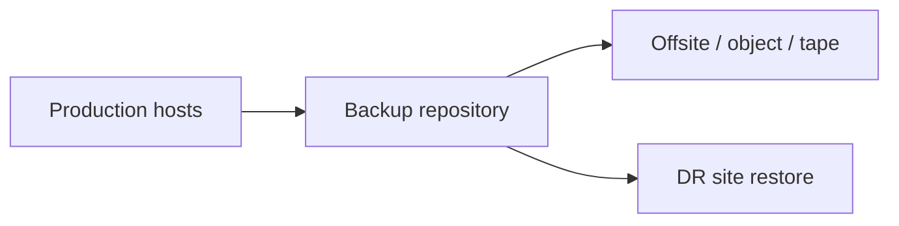
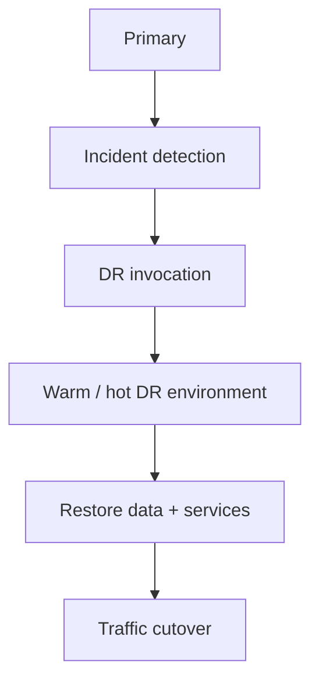
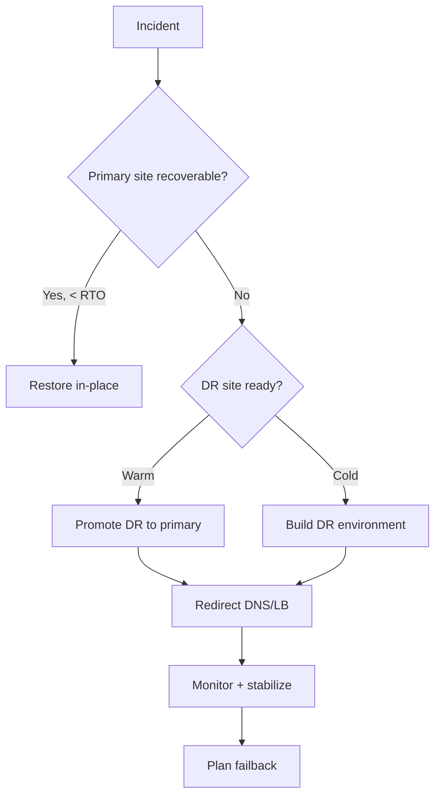
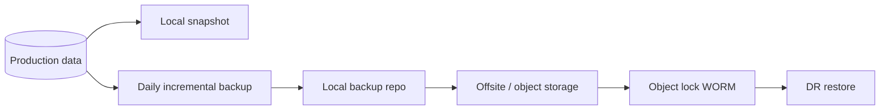
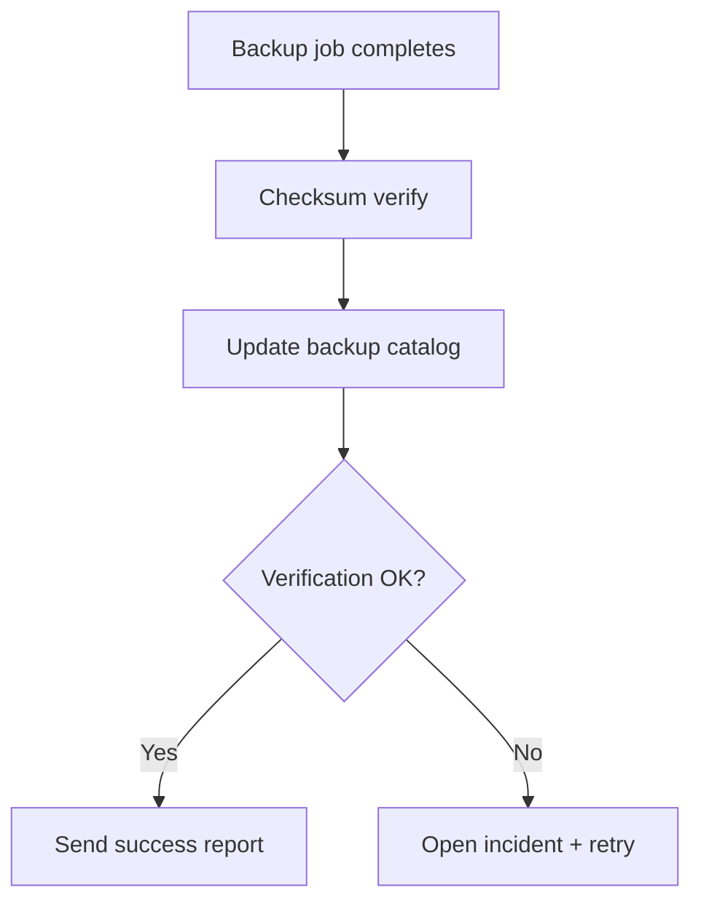
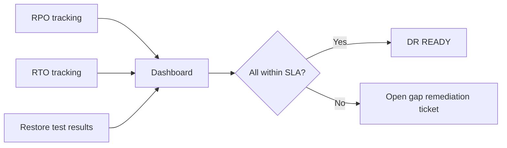

# 10. Backup and Disaster Recovery

- **Purpose:** Protect data and service continuity with tested backups, documented restore paths, and realistic DR objectives.
- **Style:** Production-oriented, concise bullets, commands, expected outputs, diagrams, and operational guardrails.
- **Audience:** Platform engineers, SREs, systems administrators, datacenter operators, and architects.
- **Use this guide when:** Building, refreshing, or auditing physical server infrastructure.
> **Disclaimer:** Third-party logos and screenshots are used for educational purposes only.

## 3-2-1 strategy

- Keep at least 3 copies of data.
- Use at least 2 media types.
- Keep at least 1 copy offsite or logically isolated.

## Backup type comparison

| Type | Strength | Trade-off | Typical use |
| --- | --- | --- | --- |
| Full | Fast restore | Large backup window and storage use | Weekly/monthly anchor |
| Incremental | Smallest daily backup | Restore chain complexity | Frequent daily backups |
| Differential | Simpler restore than incremental | Grows until next full | Mid-sized estates |

## Tooling

- `rsync` for simple local or remote file backups.
- Bacula/Bareos for enterprise scheduling and policy.
- BorgBackup for encrypted, deduplicated backups.
- Veeam Agent for Linux where Veeam already exists.

## rsync example

```bash
rsync -aHAX --delete /srv/app/ backup01:/backup/app-bm-01/
```

**Expected output**

```text
sent 1.24G bytes  received 22.1K bytes  total size 5.87G
```

## Database backups

```bash
mysqldump --single-transaction appdb > appdb.sql
xtrabackup --backup --target-dir=/backup/mysql/full-2026-06-09
pg_dump -Fc appdb > appdb.dump
pg_basebackup -D /backup/pg/base -Fp -Xs -P
mongodump --out /backup/mongo/$(date +%F)
```

### Backup and DR flow



## Bare-metal recovery

- ReaR for ISO-based system recovery.
- Clonezilla for disk imaging.
- Keep firmware, RAID, partition, and network documentation with recovery artifacts.

## DR planning

- Define RTO and RPO per service.
- Classify DR site as cold, warm, or hot.
- Maintain failover and failback runbooks.
- Test restores monthly and full DR exercises on schedule.

### Failover model



## BorgBackup example

```bash
borg init --encryption=repokey-blake2 user@backup01:/backup/$(hostname)
borg create --stats user@backup01:/backup/$(hostname)::$(date +%F-%H%M) /srv/app /etc
borg prune --keep-daily 7 --keep-weekly 4 --keep-monthly 6 user@backup01:/backup/$(hostname)
borg list user@backup01:/backup/$(hostname)
```

**Expected output**

```text
Archive name: 2026-06-09-0200
Original size:  12.34 GB    Compressed size:  8.41 GB
Number of files: 143217
Kept daily 7, weekly 4, monthly 6
```

## Restore testing runbook

1. Identify the target archive using `borg list` or backup management console.
2. Restore to a staging path; never overwrite production data without explicit approval.
3. Validate file count, checksums, and application smoke test.
4. Document restore time against RTO target.
5. Flag any gaps for corrective action.

```bash
borg extract --dry-run --list user@backup01:/backup/$(hostname)::2026-06-09-0200 srv/app
borg extract user@backup01:/backup/$(hostname)::2026-06-09-0200 --destination /mnt/restore
diff -r /srv/app /mnt/restore/srv/app
```

## Immutable backup storage

- Use object storage with object-lock (S3 Object Lock WORM mode, Wasabi, or Cloudian) to protect against ransomware deletion.
- Set retention lock duration beyond your longest RPO requirement.
- Never grant delete permissions to backup service accounts.

## ReaR system recovery

```bash
yum install -y rear
cat > /etc/rear/site.conf <<'EOF'
BACKUP=NETFS
BACKUP_URL=nfs://backup01/backup/rear
OUTPUT=ISO
BACKUP_OPTIONS="nfsvers=4"
EOF
rear mkbackup
rear recover   # run from rescue ISO
```

**Expected output**

```text
Making backup (using backup method NETFS)
Finished making backup
```

## RTO/RPO planning worksheet

| Service | RPO | RTO | Backup method | DR tier | Test frequency |
| --- | --- | --- | --- | --- | --- |
| Database (prod) | 15 min | 1 h | xtrabackup + binlog | Warm | Monthly |
| App servers | 1 h | 2 h | BorgBackup full + incremental | Warm | Monthly |
| Config/secrets | 5 min | 30 min | Git + Vault replication | Hot | Weekly |
| Object/blob store | 24 h | 4 h | S3 cross-region replication | Cold | Quarterly |
| Bare-metal OS | 4 h | 4 h | ReaR ISO + Kickstart re-deploy | Cold | Quarterly |

### DR invocation decision tree



## Backup monitoring

- Alert if a backup job has not completed within the expected window.
- Alert on backup job failures immediately.
- Track backup size growth trends to predict storage exhaustion.

```yaml
# Prometheus rule (if using Prometheus Blackbox or VictoriaMetrics)
- alert: BackupJobMissed
  expr: time() - backup_last_success_timestamp_seconds > 86400
  labels:
    severity: critical
  annotations:
    summary: "No successful backup in 24h for {{ $labels.job }}"
```

### Data protection layers



## Bareos/Bacula enterprise backup

```bash
# Bareos director test
bconsole -c /etc/bareos/bconsole.conf
# In bconsole
status director
status storage
run job=backup-app-servers level=Incremental
```

**Expected output**

```text
Director Version: 22.0.x
Running Jobs: 0
```

## Backup encryption and key management

- Encrypt all backup streams and repositories at rest and in transit.
- Store encryption keys separately from backup data; use HashiCorp Vault or a hardware security module (HSM).
- Test decryption independently of the backup process to confirm keys are accessible.
- Rotate encryption keys on schedule; re-encrypt repositories when keys are retired.

```bash
# BorgBackup key management
borg key export user@backup01:/backup/$(hostname) /secure/borgkey-$(hostname)-$(date +%F).txt
# Verify key integrity
borg key export --paper user@backup01:/backup/$(hostname)
```

## DR network and DNS considerations

- Pre-configure DNS TTLs at 60–300 seconds for services that may fail over.
- Use Anycast or GeoDNS to route traffic to DR site without manual intervention.
- Maintain a DR runbook with step-by-step DNS change commands and owners.
- Test DNS cutover during planned DR exercises.

```bash
# Verify TTL before lowering
dig +short app.example.com | head
dig +short +ttl app.example.com | awk '{print $1, $2}'
# Lower TTL 24 hours before a planned DR test
nsupdate -k /etc/bind/rndc.key <<'EOF'
server 10.10.10.5
update delete app.example.com 300 A
update add app.example.com 60 A 10.20.30.41
send
EOF
```

## Restore exercise log

| Date | Service | Restore type | Time taken | Within RTO? | Issues found |
| --- | --- | --- | --- | --- | --- |
| 2026-01-15 | appdb | Point-in-time | 47 min | Yes (RTO 1h) | None |
| 2026-02-12 | app-bm-01 | Full system (ReaR) | 78 min | No (RTO 1h) | GRUB misconfig |
| 2026-03-18 | blob storage | Object restore | 35 min | Yes (RTO 4h) | None |

- File restore test failures as incidents and track corrective actions to completion.
- Adjust RTO/RPO targets when tests consistently exceed them — targets must reflect reality.

### Backup validation pipeline



## Object storage backup target (MinIO / S3-compatible)

- Deploy MinIO on dedicated storage nodes for an on-premises S3-compatible backup target.
- Use bucket versioning and object lock to protect against accidental deletion and ransomware.
- Replicate buckets between two sites for offsite protection.

```bash
mc alias set minio01 https://minio01.example.com ACCESS_KEY SECRET_KEY
mc mb minio01/backups --with-lock
mc version enable minio01/backups
mc retention set --default COMPLIANCE 30d minio01/backups
mc ls minio01/backups
```

**Expected output**

```text
Bucket created successfully `minio01/backups`.
Object locking is enabled for `minio01/backups`
[2026-06-09]  ...  app-bm-01/
```

## Backup compliance requirements mapping

| Regulation | Required retention | Immutability | Encryption | Notes |
| --- | --- | --- | --- | --- |
| PCI DSS | 12 months online | Required for logs | Required | Card data environment |
| HIPAA | 6 years | Recommended | Required | PHI data |
| GDPR | Defined by purpose | N/A | Required | Right-to-erasure conflict |
| SOX | 7 years | Required | Required | Financial records |

## Testing restore automation

- Automate weekly restore tests for critical services using a staging restore environment.
- Compare restored database row counts and checksums against production snapshot.
- Alert if automated restore test fails.

```bash
#!/bin/bash
# automated-restore-test.sh
set -euo pipefail
borg extract --dry-run user@backup01:/backup/appdb::latest etc/appdb
pg_restore -h staging-db -U appdb -d appdb_restore --no-owner appdb.dump
psql -h staging-db -U appdb -d appdb_restore -c "SELECT COUNT(*) FROM orders;" > /var/log/restore-test-$(date +%F).log
diff <(tail -1 /var/log/restore-test-$(date +%F).log) <(cat /var/lib/cmdb/expected-row-count.txt)
echo "Restore test PASSED"
```

### DR readiness status dashboard



## Troubleshooting

- If backups complete but restores fail, treat the backup as failed.
- If backup windows overrun, use incremental or snapshot-based methods.
- If offsite copies lag, inspect WAN throughput and repository contention.
- If runbooks are stale, update them after every architecture change.

## Official references

- [Relax-and-Recover docs](https://relax-and-recover.org/documentation/)
- [BorgBackup docs](https://borgbackup.readthedocs.io/en/stable/)
- [Bareos docs](https://docs.bareos.org/)
- [Veeam Agent for Linux docs](https://helpcenter.veeam.com/docs/agentforlinux/userguide/overview.html)
