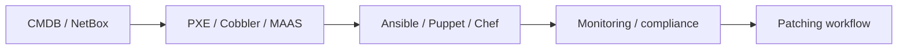
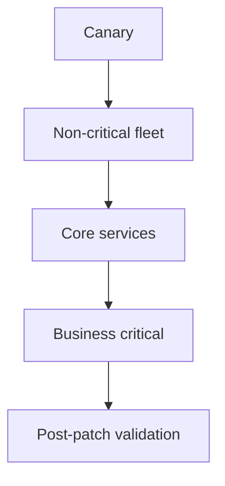
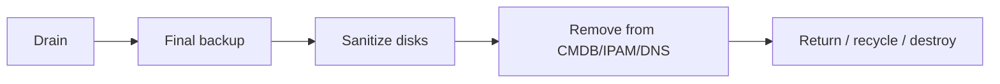
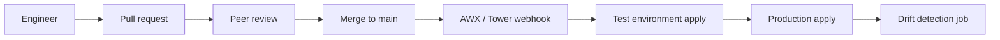
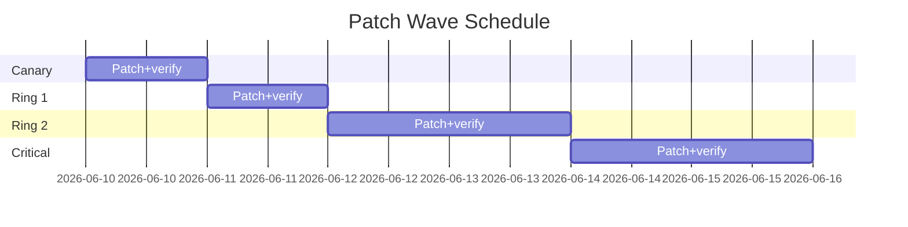
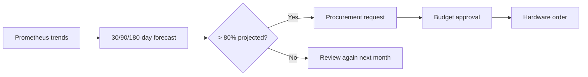

# 11. Automation at Scale

- **Purpose:** Use provisioning, configuration management, lifecycle tooling, and CMDB discipline to operate large bare-metal fleets reliably.
- **Style:** Production-oriented, concise bullets, commands, expected outputs, diagrams, and operational guardrails.
- **Audience:** Platform engineers, SREs, systems administrators, datacenter operators, and architects.
- **Use this guide when:** Building, refreshing, or auditing physical server infrastructure.
> **Disclaimer:** Third-party logos and screenshots are used for educational purposes only.

## Configuration management

- Ansible for agentless fleet configuration.
- Puppet and Chef as alternatives where existing ecosystems justify them.
- Standardize inventories, roles, and patch rings.

### Fleet automation pipeline



## Ansible baseline

```ini
[web]
app-bm-01 ansible_host=10.20.30.41
app-bm-02 ansible_host=10.20.30.42
```

```yaml
- hosts: web
  become: true
  roles:
    - base
    - nginx
    - app_runtime
```

```bash
ansible-playbook -i inventory.ini site.yml --limit web
```

**Expected output**

```text
PLAY RECAP
app-bm-01 : ok=18 changed=2 failed=0
```

## Provisioning at scale

- Foreman + Katello or Red Hat Satellite for lifecycle management.
- MAAS for Ubuntu-centric metal provisioning.
- Cobbler for lightweight PXE/Kickstart workflows.

## IaC

- Terraform can manage some bare-metal-adjacent providers such as Equinix Metal or MAAS integrations.
- Pair Terraform with Ansible roles for full server lifecycle control.

### Patch ring workflow



## Inventory management

- Track serials, warranties, rack positions, MACs, WWPNs, BMC IPs, and ownership.
- Use NetBox for DCIM + IPAM.
- Link CMDB assets to monitoring, backup, and ticketing systems.

## Decommissioning checklist

- Drain workloads.
- Take final backups if required.
- Sanitize disks.
- Remove from DNS/IPAM/CMDB/monitoring.
- Terminate support contracts and capture destruction evidence.

### Decommission lifecycle



## Ansible advanced patterns

### Dynamic inventory from NetBox

```bash
pip install pynetbox
cat > netbox_inventory.yml <<'EOF'
plugin: netbox.netbox.nb_inventory
api_endpoint: https://netbox.example.com
token: "{{ lookup('env', 'NETBOX_TOKEN') }}"
group_by:
  - tags
  - roles
EOF
ansible-inventory -i netbox_inventory.yml --list | head -30
```

### Rolling update playbook

```yaml
- hosts: web
  serial: "20%"
  max_fail_percentage: 10
  tasks:
    - name: Drain from load balancer
      uri:
        url: "http://haproxy-admin:{{ haproxy_admin_port }}/disable/app_pool/{{ inventory_hostname }}"
        method: POST
    - name: Deploy application
      include_role:
        name: deploy_app
    - name: Re-enable in load balancer
      uri:
        url: "http://haproxy-admin:{{ haproxy_admin_port }}/enable/app_pool/{{ inventory_hostname }}"
        method: POST
    - name: Smoke test
      uri:
        url: "http://{{ inventory_hostname }}:8080/healthz"
        status_code: 200
```

## Terraform for metal provisioning

- Equinix Metal, Oxide Computer, Hetzner Dedicated, and MAAS all have Terraform providers.
- Use Terraform for Day 0 provisioning and Ansible for Day 1 configuration.

```hcl
terraform {
  required_providers {
    maas = { source = "maas/maas" version = "~> 2.3" }
  }
}

resource "maas_machine" "app_node" {
  count        = 3
  hostname     = "app-bm-0${count.index + 4}"
  pxe_mac_address = var.mac_addresses[count.index]
  deploy_distro   = "ubuntu-22.04"
}
```

## Secrets in automation

- Use Ansible Vault to encrypt sensitive variables at rest.
- Retrieve runtime secrets from HashiCorp Vault using the `hashi_vault` lookup plugin.

```bash
ansible-vault encrypt_string 'mysecret' --name 'db_password'
```

```yaml
vars:
  db_password: !vault |
    $ANSIBLE_VAULT;1.1;AES256
    ...
  vault_token: "{{ lookup('env','VAULT_TOKEN') }}"
  api_key: "{{ lookup('hashi_vault','secret=kv/data/myapp:api_key') }}"
```

## GitOps for fleet configuration

- Store all Ansible roles, playbooks, and variable files in Git.
- Use Ansible Tower/AWX or Semaphore to trigger runs from Git webhooks.
- Enforce pull-request reviews for production inventory and variable changes.
- Use branch protection and signed commits for configuration changes.

### GitOps pipeline



## Patch automation

```bash
# Dry run - show what would be updated
ansible-playbook -i inventory.ini patch_hosts.yml --check --diff --limit canary

# Apply to canary ring
ansible-playbook -i inventory.ini patch_hosts.yml --limit canary

# Verify canary health then promote
ansible-playbook -i inventory.ini verify_health.yml --limit canary
ansible-playbook -i inventory.ini patch_hosts.yml --limit ring1
```

### Patch window scheduling



## CMDB hygiene automation

- Automatically update NetBox asset status when provisioning completes.
- Automatically remove hosts from DNS/monitoring/CMDB when decommissioning script runs.
- Schedule quarterly CMDB audits: compare physical rack survey against NetBox records.

```bash
# NetBox API: mark host active after provisioning
curl -s -X PATCH https://netbox.example.com/api/dcim/devices/42/ \
  -H "Authorization: Token $NETBOX_TOKEN" \
  -H "Content-Type: application/json" \
  -d '{"status":"active"}' | python3 -m json.tool | grep '"status"'
```

**Expected output**

```text
"status": {"value": "active", "label": "Active"}
```

## Ansible Tower / AWX deployment patterns

- Deploy AWX on a dedicated management VM or bare-metal host using the AWX Operator.
- Organize inventories by environment (dev, staging, prod) and role (web, db, storage).
- Use workflow job templates to chain provisioning, configuration, and validation playbooks.
- Enable webhook triggers from Git (GitHub, GitLab) to run playbooks on commit.

```bash
# Trigger AWX job via API
curl -sk -X POST \
  -H "Authorization: Bearer $AWX_TOKEN" \
  -H "Content-Type: application/json" \
  https://awx.example.com/api/v2/job_templates/42/launch/ \
  -d '{"limit": "app-bm-01", "extra_vars": {"deploy_version": "2.4.1"}}'
```

**Expected output**

```text
{"id": 1234, "status": "pending", "job": 1234, ...}
```

## Hardware lifecycle management

### Capacity forecasting



## Configuration drift detection

- Run Ansible in `--check` mode nightly against all production hosts.
- Alert if any tasks would change (indicating drift).
- Surface drift in a Grafana dashboard using custom metrics or job output.

```bash
ansible-playbook -i inventory.ini site.yml --check --diff 2>&1 \
  | tee drift-report-$(date +%F).txt \
  | awk '/PLAY RECAP/{f=1} f && /changed=/' | grep -v "changed=0"
```

**Expected output**

```text
# Empty output = no drift detected
# Any output = drift requiring investigation
app-bm-02 : ok=18 changed=1 failed=0 unreachable=0
```

## Troubleshooting

- If automation diverges from manual reality, re-establish source-of-truth ownership first.
- If provisioning scales poorly, profile DHCP/TFTP/HTTP bottlenecks.
- If patch waves stall, review maintenance dependencies and health checks.
- If CMDB data decays, integrate automatic discovery from provisioning and BMC APIs.
- If automation fails silently, add explicit health-check tasks and exit-code assertions to every playbook.
- If patch rings stall due to unresolved dependencies, maintain a dependency graph in the change management tool.

## Automation metrics and KPIs

Track these metrics to measure automation maturity and fleet health:

| Metric | Target | Alert threshold |
| --- | --- | --- |
| Provisioning time (bare-metal to ready) | < 45 min | > 90 min |
| Configuration drift rate | 0% | > 2% of fleet |
| Patch compliance (within SLA) | > 98% | < 95% |
| CMDB accuracy | > 99% | < 97% |
| Failed automation job rate | < 1% | > 5% |

## Runbook automation

- Convert repetitive operational tasks (disk expansion, user provisioning, certificate renewal) into AWX job templates.
- Gate runbook automation with approval workflows for production scope.
- Log every automated action with operator name, timestamp, and parameters for audit trails.

```bash
# Trigger certificate renewal runbook via AWX API
curl -sk -X POST \
  -H "Authorization: Bearer $AWX_TOKEN" \
  https://awx.example.com/api/v2/job_templates/55/launch/ \
  -d '{"extra_vars": {"cert_host": "app-bm-01", "cert_cn": "app.example.com"}}'
```

## Official references

- [Ansible docs](https://docs.ansible.com/)
- [Foreman docs](https://docs.theforeman.org/)
- [Red Hat Satellite docs](https://access.redhat.com/documentation/en-us/red_hat_satellite/)
- [MAAS docs](https://maas.io/docs)
- [NetBox docs](https://netbox.readthedocs.io/en/stable/)
